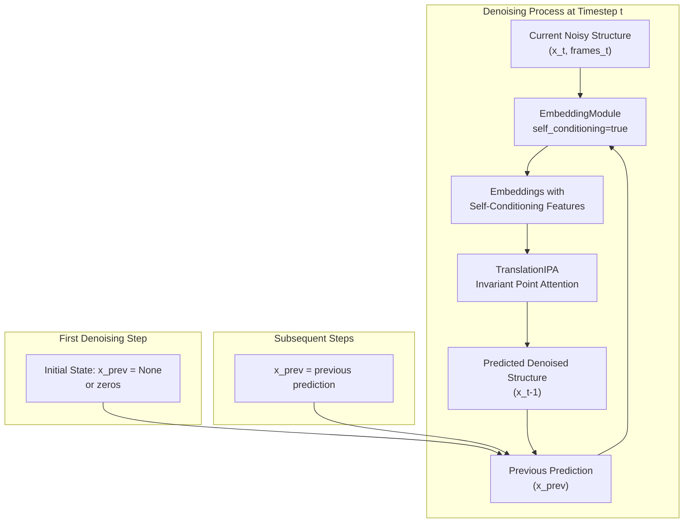
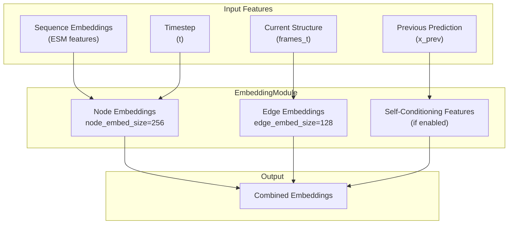
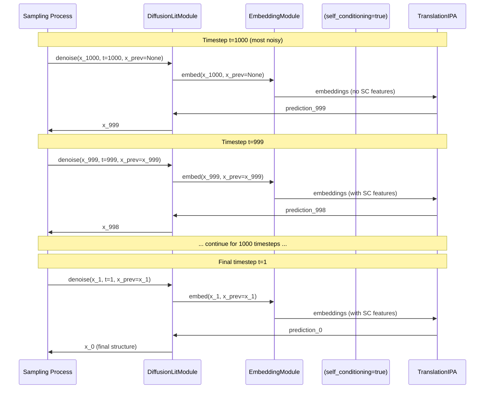
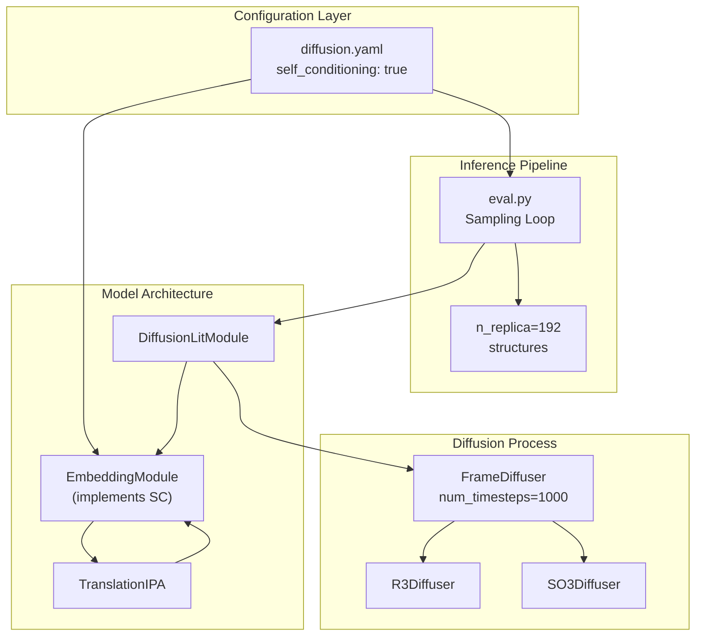

# Self-Conditioning

> **Relevant source files**
> * [configs/model/diffusion.yaml](https://github.com/Junjie-Zhu/IDPFold/blob/ba40f40c/configs/model/diffusion.yaml)

This document describes the self-conditioning technique used in IDPFold's diffusion model. Self-conditioning is an advanced training and inference strategy that improves model predictions by allowing the neural network to condition on its own previous predictions during the denoising process.

For information about other inference parameters, see [Inference Parameters](/Junjie-Zhu/IDPFold/7.1-inference-parameters). For details on the model architecture that implements self-conditioning, see [DenoisingNet](/Junjie-Zhu/IDPFold/4.2-denoisingnet).

---

## Overview

Self-conditioning is a technique where the diffusion model uses its own prediction from a previous denoising step as additional input to the current denoising step. This allows the model to iteratively refine its predictions, leading to higher quality conformational ensembles. In IDPFold, self-conditioning is implemented in the `EmbeddingModule` and can be enabled or disabled through configuration.

The technique works by:

1. Making an initial prediction without self-conditioning (using zeros or null embeddings)
2. Using that prediction as additional input for the next denoising step
3. Iteratively refining predictions through the reverse diffusion process

---

## Configuration

Self-conditioning is controlled through two configuration parameters in `diffusion.yaml`:

| Configuration Location | Parameter | Default Value | Purpose |
| --- | --- | --- | --- |
| `net.embedder.self_conditioning` | Boolean | `true` | Enables self-conditioning in the embedding module |
| `inference.self_conditioning` | Boolean | `true` | Enables self-conditioning during inference/sampling |

**Embedder Configuration** [configs/model/diffusion.yaml L18-L26](https://github.com/Junjie-Zhu/IDPFold/blob/ba40f40c/configs/model/diffusion.yaml#L18-L26)

```yaml
embedder:   _target_: src.models.net.denoising_ipa.EmbeddingModule  init_embed_size: 32  node_embed_size: 256  edge_embed_size: 128  num_bins: 22  min_bin: 1e-5  max_bin: 20.0  self_conditioning: true
```

**Inference Configuration** [configs/model/diffusion.yaml L88-L98](https://github.com/Junjie-Zhu/IDPFold/blob/ba40f40c/configs/model/diffusion.yaml#L88-L98)

```yaml
inference:  delta_min: 0.25  delta_max: 0.35  delta_step: 0.05  n_replica: 192  replica_per_batch: 64  num_timesteps: 1000  noise_scale: 1.0  probability_flow: false  self_conditioning: true  min_t: 1e-2
```

**Sources:** [configs/model/diffusion.yaml L18-L98](https://github.com/Junjie-Zhu/IDPFold/blob/ba40f40c/configs/model/diffusion.yaml#L18-L98)

---

## Self-Conditioning in the Model Architecture



**Diagram: Self-Conditioning Flow in the Denoising Process**

The `EmbeddingModule` processes both the current noisy structure and the previous prediction to generate enhanced embeddings. During the first denoising step, `x_prev` is initialized to `None` or zeros. In subsequent steps, `x_prev` contains the structure predicted in the previous denoising iteration.

**Sources:** [configs/model/diffusion.yaml L18-L26](https://github.com/Junjie-Zhu/IDPFold/blob/ba40f40c/configs/model/diffusion.yaml#L18-L26)

---

## Implementation Details

### EmbeddingModule Structure



**Diagram: EmbeddingModule with Self-Conditioning Components**

When `self_conditioning=true`, the `EmbeddingModule` includes additional neural network layers to process the previous prediction. These features are combined with standard node and edge embeddings before being passed to the `TranslationIPA` module.

**Sources:** [configs/model/diffusion.yaml L18-L26](https://github.com/Junjie-Zhu/IDPFold/blob/ba40f40c/configs/model/diffusion.yaml#L18-L26)

---

## Training vs Inference Behavior

### Training Mode

During training, self-conditioning is applied stochastically to prevent the model from becoming overly dependent on the self-conditioning signal:

1. For a random subset of training examples, `x_prev` is set to `None` or zeros
2. For the remaining examples, `x_prev` is set to a previous prediction (possibly from an earlier denoising step in the same batch)
3. This stochastic application ensures the model learns to make good predictions both with and without self-conditioning

### Inference Mode

During inference [configs/model/diffusion.yaml L88-L98](https://github.com/Junjie-Zhu/IDPFold/blob/ba40f40c/configs/model/diffusion.yaml#L88-L98)

 self-conditioning is typically always enabled:

1. **Initial Step**: Start with `x_prev = None`, generate first prediction
2. **Subsequent Steps**: Use the previous timestep's prediction as `x_prev`
3. **Iterative Refinement**: Each step incorporates information from the previous prediction, leading to progressively refined structures



**Diagram: Self-Conditioning During Inference Sampling**

The sequence diagram shows how self-conditioning is applied across multiple denoising timesteps. The first step uses no self-conditioning (`x_prev=None`), while subsequent steps use the previous prediction as input.

**Sources:** [configs/model/diffusion.yaml L88-L98](https://github.com/Junjie-Zhu/IDPFold/blob/ba40f40c/configs/model/diffusion.yaml#L88-L98)

---

## Parameter Summary

### Key Configuration Parameters

| Parameter | Location | Type | Default | Description |
| --- | --- | --- | --- | --- |
| `self_conditioning` | `net.embedder` | `bool` | `true` | Enables self-conditioning in the embedding module architecture |
| `self_conditioning` | `inference` | `bool` | `true` | Enables self-conditioning during sampling/inference |
| `init_embed_size` | `net.embedder` | `int` | `32` | Initial embedding size before self-conditioning features |
| `node_embed_size` | `net.embedder` | `int` | `256` | Size of node embeddings (includes SC features if enabled) |
| `edge_embed_size` | `net.embedder` | `int` | `128` | Size of edge embeddings |

**Sources:** [configs/model/diffusion.yaml L18-L98](https://github.com/Junjie-Zhu/IDPFold/blob/ba40f40c/configs/model/diffusion.yaml#L18-L98)

---

## Impact on Model Performance

### Benefits

1. **Improved Accuracy**: Self-conditioning allows the model to iteratively refine predictions, leading to more accurate conformational ensembles
2. **Better Consistency**: Predictions at later timesteps are informed by earlier predictions, creating more coherent structural trajectories
3. **Enhanced Detail**: The model can capture finer structural details by building upon coarse predictions

### Computational Considerations

1. **Memory Usage**: Self-conditioning adds additional features to the embedding dimension, slightly increasing memory requirements
2. **Inference Speed**: Minimal impact on speed since the additional features are processed within the same forward pass
3. **Training Complexity**: Stochastic self-conditioning during training adds complexity but improves generalization

---

## Disabling Self-Conditioning

To disable self-conditioning for experimentation or ablation studies, modify both configuration parameters in `diffusion.yaml`:

```yaml
net:  embedder:    self_conditioning: false  # Disable in model architecture inference:  self_conditioning: false  # Disable during sampling
```

When disabled, the model will not use previous predictions as input, relying solely on the current noisy structure and sequence embeddings. This typically results in lower quality predictions but can be useful for understanding the contribution of self-conditioning to model performance.

**Sources:** [configs/model/diffusion.yaml L26](https://github.com/Junjie-Zhu/IDPFold/blob/ba40f40c/configs/model/diffusion.yaml#L26-L26)

 [configs/model/diffusion.yaml L97](https://github.com/Junjie-Zhu/IDPFold/blob/ba40f40c/configs/model/diffusion.yaml#L97-L97)

---

## Relationship to Other Components

Self-conditioning interacts with several other components in the IDPFold system:



**Diagram: Self-Conditioning in the Overall System Architecture**

Self-conditioning is configured at the top level but implemented within `EmbeddingModule`. It affects both the model architecture (how embeddings are computed) and the inference pipeline (how predictions are iteratively refined across timesteps).

**Sources:** [configs/model/diffusion.yaml L1-L103](https://github.com/Junjie-Zhu/IDPFold/blob/ba40f40c/configs/model/diffusion.yaml#L1-L103)

---

## Code References

The self-conditioning implementation spans multiple files in the codebase:

| File | Relevant Components | Description |
| --- | --- | --- |
| `configs/model/diffusion.yaml` | Lines 26, 97 | Configuration parameters for self-conditioning |
| `src/models/net/denoising_ipa.py` | `EmbeddingModule` class | Implementation of self-conditioning in embeddings |
| `src/models/diffusion_module.py` | `DiffusionLitModule` class | Integration of self-conditioning in training/inference |
| `src/eval.py` | Sampling loop | Usage of self-conditioning during ensemble generation |

**Sources:** [configs/model/diffusion.yaml L1-L103](https://github.com/Junjie-Zhu/IDPFold/blob/ba40f40c/configs/model/diffusion.yaml#L1-L103)