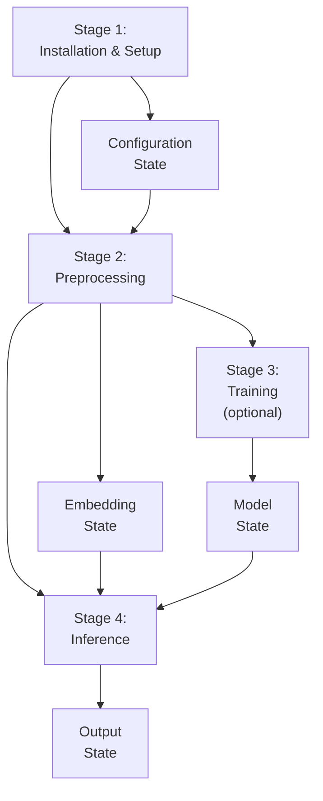
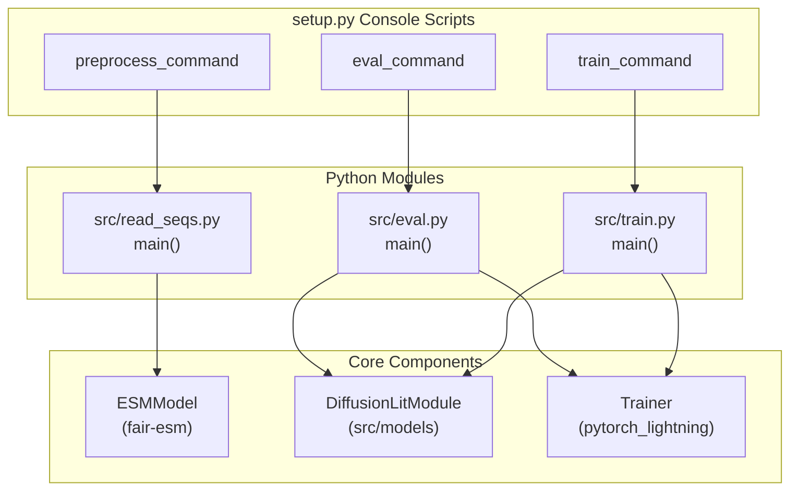
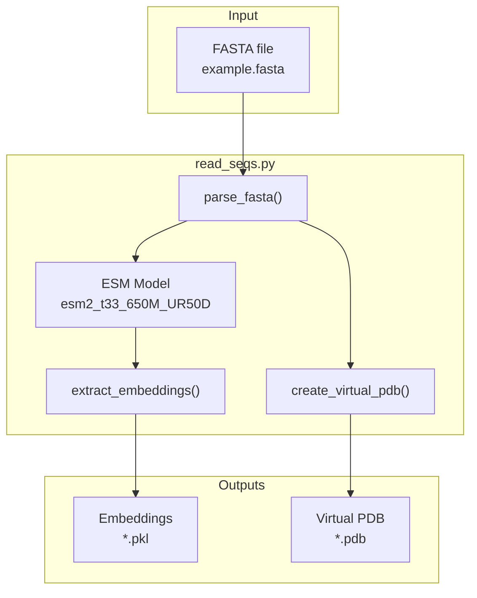
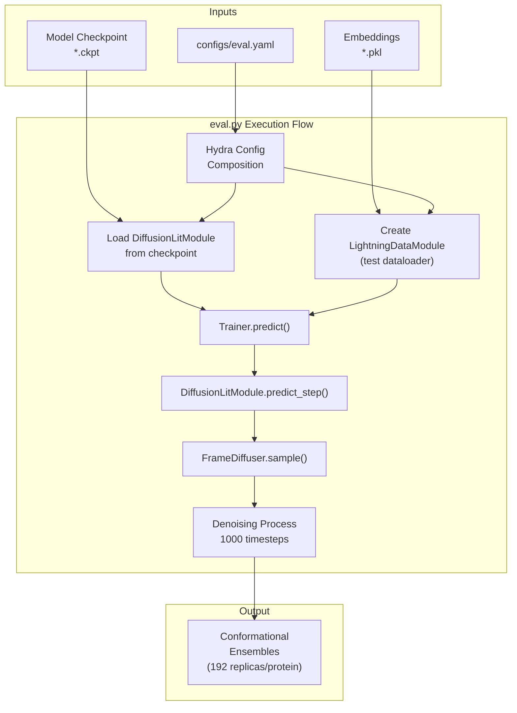
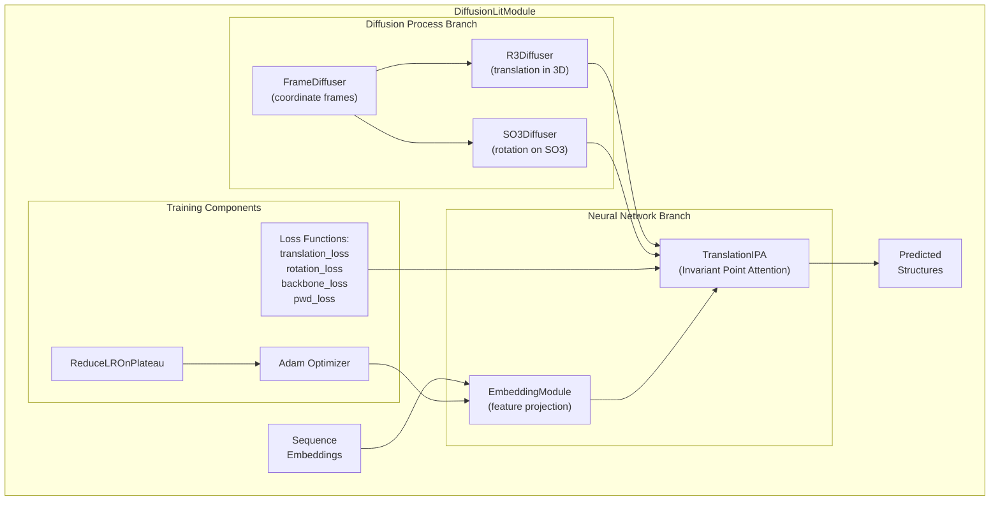
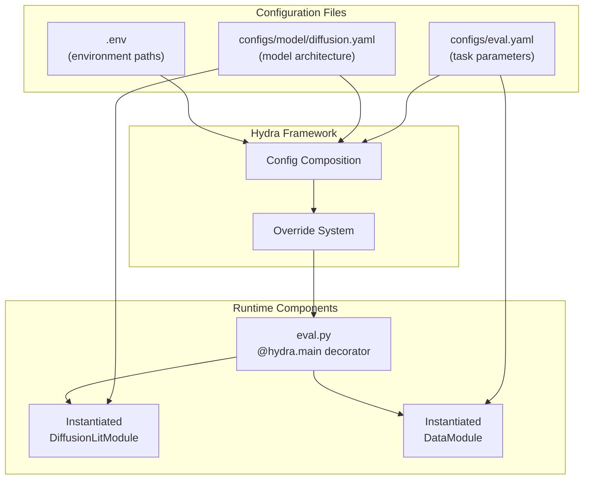
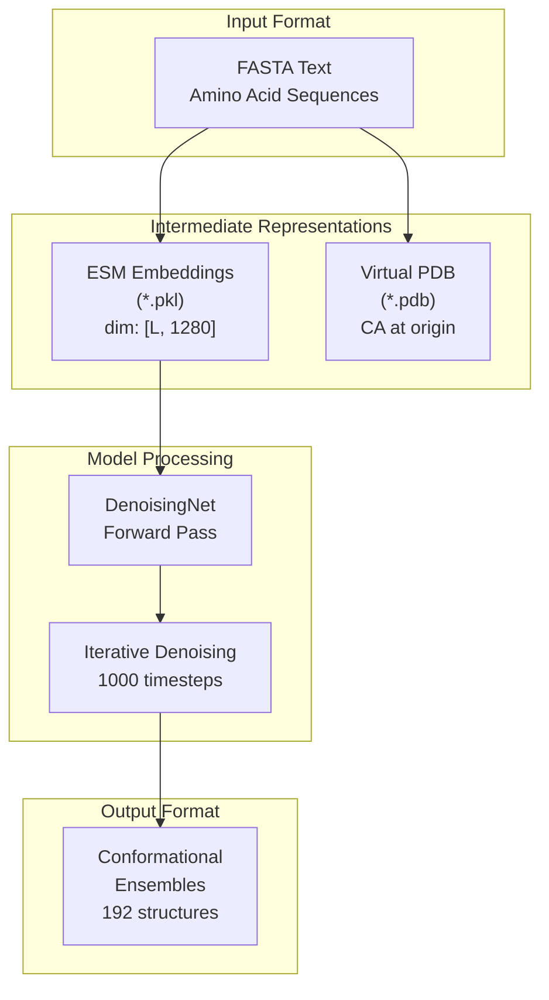
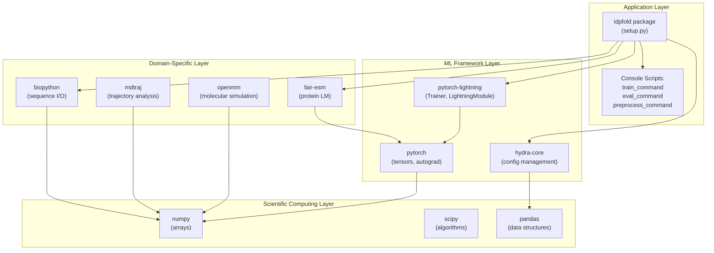
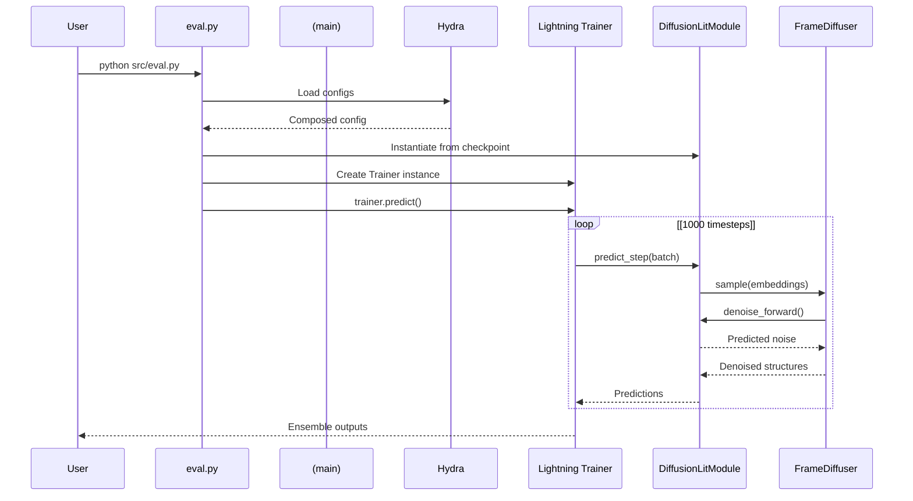

# System Architecture

> **Relevant source files**
> * [.project-root](https://github.com/Junjie-Zhu/IDPFold/blob/ba40f40c/.project-root)
> * [README.md](https://github.com/Junjie-Zhu/IDPFold/blob/ba40f40c/README.md?plain=1)
> * [assets/Overview.png](https://github.com/Junjie-Zhu/IDPFold/blob/ba40f40c/assets/Overview.png)
> * [data/example.fasta](https://github.com/Junjie-Zhu/IDPFold/blob/ba40f40c/data/example.fasta)
> * [setup.py](https://github.com/Junjie-Zhu/IDPFold/blob/ba40f40c/setup.py)

## Purpose and Scope

This document describes the high-level architecture of IDPFold, a generative deep learning system for predicting conformational ensembles of Intrinsically Disordered Proteins (IDPs). It covers the major system components, their interactions, and the overall data flow from sequence input to ensemble generation.

For detailed information about specific topics, see:

* Installation procedures: [Installation and Setup](/Junjie-Zhu/IDPFold/2-installation-and-setup)
* Command-line usage: [Command-Line Interface](/Junjie-Zhu/IDPFold/6-command-line-interface)
* Configuration parameters: [Configuration System](/Junjie-Zhu/IDPFold/5-configuration-system)
* Model internals: [Model Architecture](/Junjie-Zhu/IDPFold/4-model-architecture)

## Architectural Overview

IDPFold follows a **pipeline architecture** organized into four sequential stages, each independently executable and checkpointed through file-based persistence. The system is built on PyTorch Lightning and Hydra for configuration management, enabling reproducible machine learning workflows.

### Four-Stage Pipeline



**Key Architectural Principles:**

1. **Stage Independence**: Each stage can be executed separately, enabling debugging and experimentation
2. **File-Based Checkpointing**: Intermediate results are persisted to disk between stages
3. **Configuration-Driven**: Hydra YAML files control all system behavior
4. **Reusability**: Preprocessing outputs (embeddings) can be reused across multiple inference runs

Sources: [README.md L10-L64](https://github.com/Junjie-Zhu/IDPFold/blob/ba40f40c/README.md?plain=1#L10-L64)

 Diagram 1 and Diagram 2 from provided diagrams

### CLI Entry Points to Code Mapping



Sources: [setup.py L15-L21](https://github.com/Junjie-Zhu/IDPFold/blob/ba40f40c/setup.py#L15-L21)

## System Stages

### Stage 1: Installation & Setup

**Purpose**: Establish the runtime environment and configuration.

**Components**:

* `setup.py`: Package definition and console script registration
* `environment.yml`: Conda environment specification
* `initialize.py`: Environment variable initialization
* `.env`: Path configuration file

**Outputs**: Configured conda environment, `.env` file with paths

Sources: [setup.py L1-L23](https://github.com/Junjie-Zhu/IDPFold/blob/ba40f40c/setup.py#L1-L23)

 [README.md L24-L43](https://github.com/Junjie-Zhu/IDPFold/blob/ba40f40c/README.md?plain=1#L24-L43)

### Stage 2: Preprocessing (Input & Embedding Extraction)

**Purpose**: Convert protein sequences into numerical embeddings suitable for the diffusion model.



**Key Code Entities**:

* Script: `src/read_seqs.py`
* Model: `esm2_t33_650M_UR50D` (from fair-esm library)
* Output format: Pickle files (`.pkl`) containing high-dimensional sequence embeddings
* Virtual PDB: Placeholder structures with CA atoms at origin (0,0,0)

**Invocation**:

```markdown
python src/read_seqs.py pred_dir='./data/example.fasta'# orpreprocess_command pred_dir='./data/example.fasta'
```

Sources: [README.md L54-L55](https://github.com/Junjie-Zhu/IDPFold/blob/ba40f40c/README.md?plain=1#L54-L55)

 [data/example.fasta L1-L6](https://github.com/Junjie-Zhu/IDPFold/blob/ba40f40c/data/example.fasta#L1-L6)

 [setup.py L19](https://github.com/Junjie-Zhu/IDPFold/blob/ba40f40c/setup.py#L19-L19)

### Stage 3: Training (Optional)

**Purpose**: Train or fine-tune the diffusion model on protein structure datasets.

**Training Datasets**:

* **Pretraining**: PDB database (folded proteins)
* **Fine-tuning**: IDRome dataset (IDP conformational ensembles)

**Status**: Implementation details incomplete in current codebase (marked "To be updated" in README)

**Key Component**: `DiffusionLitModule` (PyTorch Lightning module)

Sources: [README.md L62-L63](https://github.com/Junjie-Zhu/IDPFold/blob/ba40f40c/README.md?plain=1#L62-L63)

 [setup.py L17](https://github.com/Junjie-Zhu/IDPFold/blob/ba40f40c/setup.py#L17-L17)

### Stage 4: Inference & Evaluation

**Purpose**: Generate conformational ensembles from preprocessed embeddings using a trained model.



**Key Parameters**:

* `num_timesteps`: 1000 (diffusion steps)
* `n_replica`: 192 (ensemble size per protein)
* `noise_scale`: 1.0
* `self_conditioning`: true

**Invocation**:

```markdown
python src/eval.py ckpt_path='/path/to/ckpt'# oreval_command ckpt_path='/path/to/ckpt'
```

Sources: [README.md L57-L59](https://github.com/Junjie-Zhu/IDPFold/blob/ba40f40c/README.md?plain=1#L57-L59)

 [setup.py L18](https://github.com/Junjie-Zhu/IDPFold/blob/ba40f40c/setup.py#L18-L18)

 Diagram 4 from provided diagrams

## Core Component Architecture

### DiffusionLitModule Decomposition

The `DiffusionLitModule` is the central component orchestrating the diffusion process. It contains two parallel subsystems:



**Key Characteristics**:

* **Separation of Concerns**: Neural network architecture is decoupled from diffusion mechanics
* **Independent Noise Schedules**: Translation and rotation are diffused separately
* **Attention Mechanism**: TranslationIPA uses invariant point attention for geometric awareness

**Configuration Source**: `configs/model/diffusion.yaml`

Sources: Diagram 4 from provided diagrams

### Configuration Architecture

IDPFold uses **Hydra** for hierarchical configuration management:



**Configuration Composition Rules**:

1. **Base Configuration**: `eval.yaml` specifies which model config to use
2. **Model Definition**: `diffusion.yaml` defines network architecture and hyperparameters
3. **Environment Paths**: `.env` provides dataset and checkpoint locations
4. **Command-line Overrides**: Any parameter can be overridden at runtime

**Example Override**:

```
python src/eval.py ckpt_path='/custom/path' model.num_timesteps=500
```

Sources: [README.md L39-L43](https://github.com/Junjie-Zhu/IDPFold/blob/ba40f40c/README.md?plain=1#L39-L43)

 Diagram 3 from provided diagrams

## Data Flow Architecture

### End-to-End Transformation Pipeline



**Data Format Specifications**:

| Stage | Format | Dimensions | Description |
| --- | --- | --- | --- |
| Input | FASTA | Variable length | Raw amino acid sequences |
| Embedding | PKL (pickle) | [L, 1280] | ESM-2 embeddings (L = sequence length) |
| Virtual PDB | PDB | [L, 3] | Placeholder coordinates (all zeros) |
| Output | Structure ensemble | [192, L, 3] | 3D coordinates for 192 conformations |

**Key Insight**: The virtual PDB files serve as format converters and structural templates, not actual coordinates. All meaningful geometric information comes from the diffusion model predictions.

Sources: Diagram 6 from provided diagrams, [data/example.fasta L1-L6](https://github.com/Junjie-Zhu/IDPFold/blob/ba40f40c/data/example.fasta#L1-L6)

## Technology Stack and Dependencies

### Layered Dependency Architecture



**Critical Dependencies**:

* `pytorch-lightning`: Orchestrates training/inference loops
* `hydra-core`: Manages configuration composition
* `fair-esm`: Provides pretrained protein language model (`esm2_t33_650M_UR50D`)
* `biopython`: Parses FASTA files and PDB structures

**Optional Dependencies** (declared but not currently used):

* `deepspeed`: Large model optimization (not in active configs)
* `optuna`: Hyperparameter tuning (no tuning scripts present)
* `wandb`: Experiment tracking (not configured)

Sources: [setup.py L12](https://github.com/Junjie-Zhu/IDPFold/blob/ba40f40c/setup.py#L12-L12)

 [README.md L32-L33](https://github.com/Junjie-Zhu/IDPFold/blob/ba40f40c/README.md?plain=1#L32-L33)

 Diagram 5 from provided diagrams

## Module Interaction Patterns

### Inference Execution Flow



**Control Flow Characteristics**:

1. **Hydra Initialization**: Configuration loaded before any component instantiation
2. **Lazy Loading**: Model checkpoint loaded only when needed
3. **Batched Processing**: Multiple sequences can be processed simultaneously
4. **Iterative Refinement**: 1000 denoising steps per structure

Sources: Diagram 2 from provided diagrams

## Checkpoint and State Management

The system maintains state through multiple checkpoint mechanisms:

| Checkpoint Type | Location | Purpose | Reusable |
| --- | --- | --- | --- |
| Environment Config | `.env` | Path configuration | ✓ |
| Embeddings | `*.pkl` files | Sequence representations | ✓ |
| Virtual PDB | `*.pdb` files | Structural templates | ✓ |
| Model Weights | `*.ckpt` files | Trained parameters | ✓ |
| Outputs | Various formats | Final predictions | ✗ |

**Reusability Pattern**: Embeddings (`.pkl` files) are the most frequently reused checkpoints, as they enable running multiple inference experiments with different model configurations without re-running ESM embedding extraction.

Sources: [README.md L47-L59](https://github.com/Junjie-Zhu/IDPFold/blob/ba40f40c/README.md?plain=1#L47-L59)

## Summary

IDPFold implements a **four-stage pipeline architecture** with clear separation between preprocessing, training, and inference. The system leverages:

* **Configuration-driven design** via Hydra for reproducibility
* **File-based checkpointing** for stage independence
* **PyTorch Lightning** for standardized ML workflows
* **ESM language models** for sequence understanding
* **Diffusion models** for ensemble generation

The architecture enables researchers to experiment with different hyperparameters, model architectures, and datasets without modifying code, while maintaining reproducibility through comprehensive configuration management.