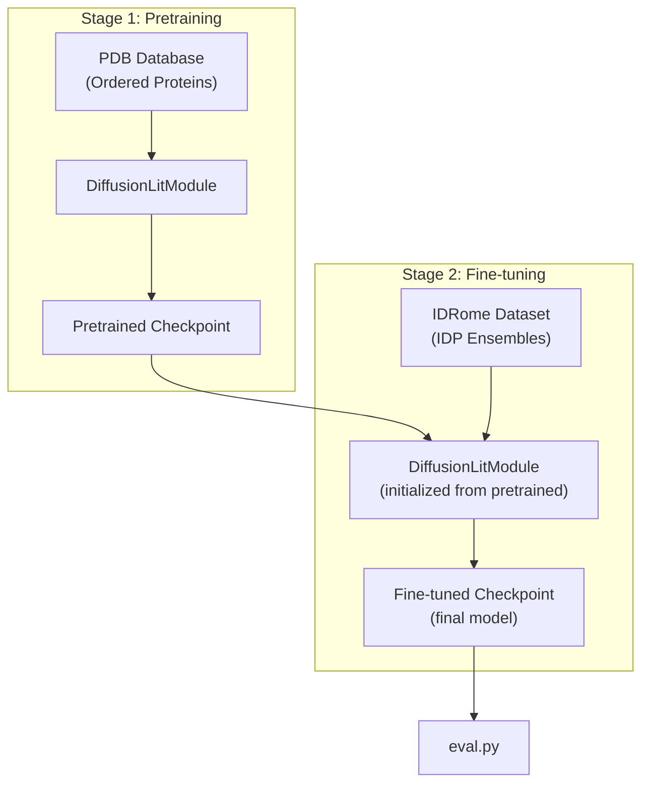
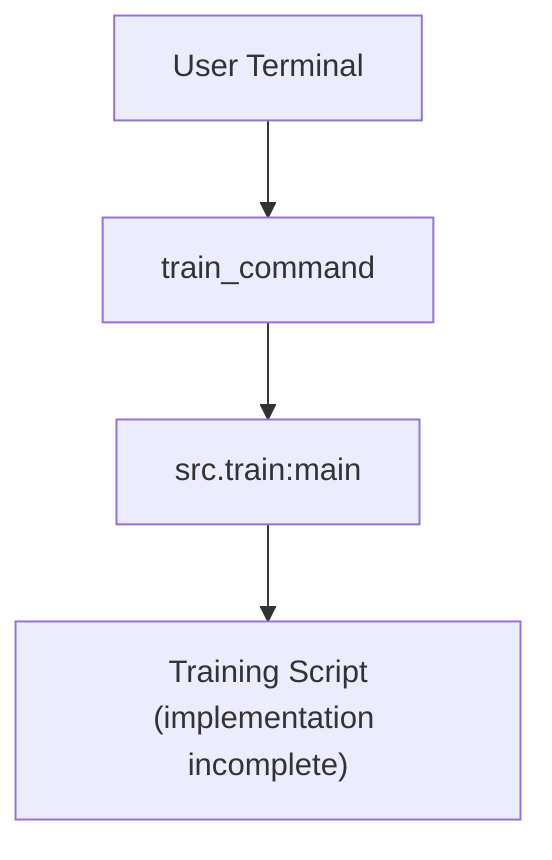
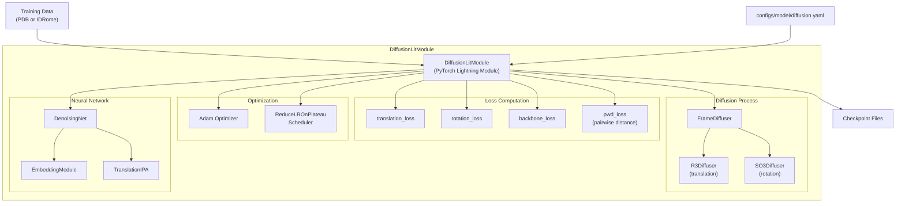
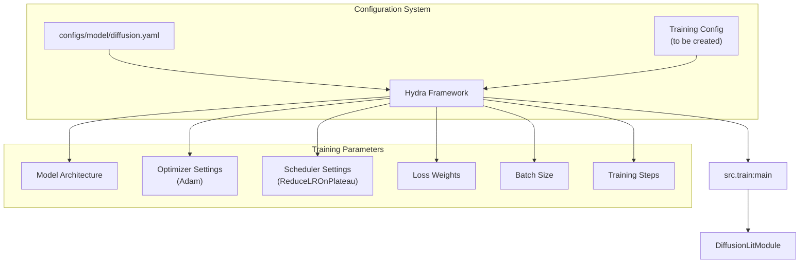
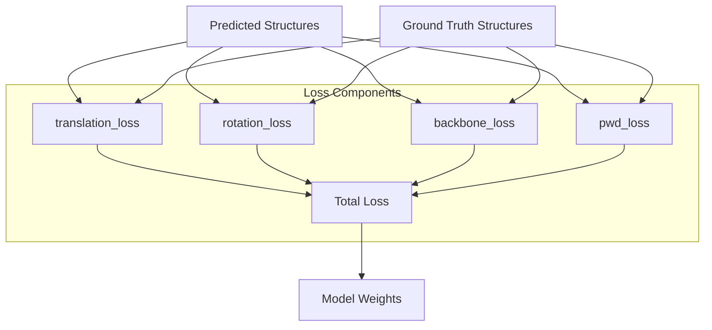
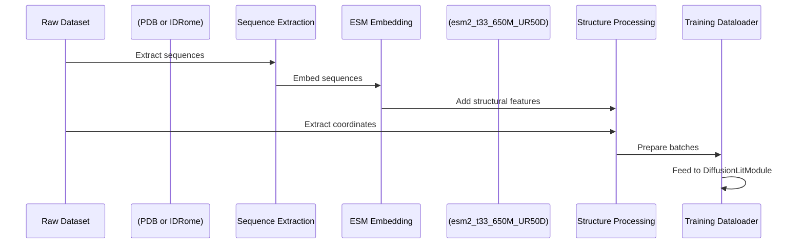

# Training Models

> **Relevant source files**
> * [.project-root](https://github.com/Junjie-Zhu/IDPFold/blob/ba40f40c/.project-root)
> * [README.md](https://github.com/Junjie-Zhu/IDPFold/blob/ba40f40c/README.md?plain=1)
> * [data/example.fasta](https://github.com/Junjie-Zhu/IDPFold/blob/ba40f40c/data/example.fasta)
> * [setup.py](https://github.com/Junjie-Zhu/IDPFold/blob/ba40f40c/setup.py)

## Purpose and Scope

This document describes the training process for IDPFold models, including the two-stage training strategy (pretraining on PDB and fine-tuning on IDRome), the training command interface, and the components involved in model training.

**Note**: As indicated in the README, the training implementation details are incomplete in the current codebase version. This document covers the architectural design and available information about the training process. For running inference with pre-trained checkpoints, see [Running Inference](/Junjie-Zhu/IDPFold/3.3-running-inference). For model architecture details, see [Model Architecture](/Junjie-Zhu/IDPFold/4-model-architecture).

**Sources**: [README.md L61-L63](https://github.com/Junjie-Zhu/IDPFold/blob/ba40f40c/README.md?plain=1#L61-L63)

---

## Training Status

The training functionality in IDPFold is currently under development. The codebase provides the architectural foundation for training but lacks complete implementation details and documentation.

### Available Components

| Component | Status | Description |
| --- | --- | --- |
| `train_command` entry point | Defined | Console script registered in setup.py |
| `src.train:main` | Referenced | Training script entry point (implementation incomplete) |
| `DiffusionLitModule` | Implemented | PyTorch Lightning module with training logic |
| Training configuration | Partial | Model architecture defined in `configs/model/diffusion.yaml` |
| Optimizer/Scheduler | Configured | Adam optimizer with ReduceLROnPlateau scheduler |
| Loss functions | Implemented | Multiple loss components in DiffusionLitModule |

**Sources**: [README.md L61-L63](https://github.com/Junjie-Zhu/IDPFold/blob/ba40f40c/README.md?plain=1#L61-L63)

 [setup.py L17](https://github.com/Junjie-Zhu/IDPFold/blob/ba40f40c/setup.py#L17-L17)

---

## Two-Stage Training Strategy

IDPFold employs a two-stage training approach to achieve accurate prediction of IDP conformational ensembles:



**Diagram: Two-stage training pipeline showing pretraining on PDB and fine-tuning on IDRome**

### Stage 1: Pretraining on PDB

The model is first pretrained on the PDB database, which contains experimentally determined structures of ordered proteins. This stage teaches the model:

* General protein geometry and stereochemistry
* Valid backbone conformations
* Physical constraints of polypeptide chains
* Spatial relationships between amino acids

### Stage 2: Fine-tuning on IDRome

After pretraining, the model is fine-tuned on the IDRome dataset, which provides conformational ensembles specifically for intrinsically disordered proteins and regions. This stage enables:

* Learning IDP-specific conformational preferences
* Capturing the flexibility and disorder characteristics
* Generating diverse ensemble conformations
* Accurate sampling of IDP ensemble properties

**Sources**: [README.md L12-L14](https://github.com/Junjie-Zhu/IDPFold/blob/ba40f40c/README.md?plain=1#L12-L14)

---

## Training Command Interface

The training command is registered as a console script during package installation.



**Diagram: Training command execution flow from console to training script**

### Command Registration

The `train_command` is registered in the package setup:

[setup.py L16-L17](https://github.com/Junjie-Zhu/IDPFold/blob/ba40f40c/setup.py#L16-L17)

```
entry_points={    "console_scripts": [        "train_command = src.train:main",        ...    ]}
```

### Expected Usage Pattern

While the implementation is incomplete, the expected usage pattern would follow the established conventions in the codebase:

```markdown
# Expected training command (to be implemented)train_command <config_options> # Or direct script executionpython src/train.py <config_options>
```

The command would likely use Hydra for configuration management, similar to `eval_command` and `preprocess_command`.

**Sources**: [setup.py L15-L21](https://github.com/Junjie-Zhu/IDPFold/blob/ba40f40c/setup.py#L15-L21)

---

## Training Components Architecture

The `DiffusionLitModule` serves as the central component for training, orchestrating the neural network, diffusion process, optimization, and loss computation.



**Diagram: Training components within DiffusionLitModule showing neural network, diffusion process, optimization, and loss functions**

### Core Training Loop

The PyTorch Lightning framework orchestrates the training loop through `DiffusionLitModule`. The module implements:

1. **Forward pass**: Processes input embeddings through `DenoisingNet`
2. **Diffusion**: Applies noise via `FrameDiffuser` (R3Diffuser for translations, SO3Diffuser for rotations)
3. **Loss computation**: Calculates multiple loss components
4. **Backward pass**: Computes gradients via PyTorch's autograd
5. **Optimization step**: Updates weights using Adam optimizer
6. **Learning rate scheduling**: Adjusts learning rate via ReduceLROnPlateau

### Optimizer Configuration

The model uses the Adam optimizer with ReduceLROnPlateau learning rate scheduling. This scheduler reduces the learning rate when the validation loss plateaus, enabling fine-grained convergence.

**Sources**: Referenced from high-level system diagrams

---

## Training Configuration

Training behavior is controlled through Hydra configuration files. The model architecture and training parameters are specified in YAML format.



**Diagram: Configuration system for training showing Hydra composition and parameter categories**

### Model Configuration

The model architecture is defined in [configs/model/diffusion.yaml](https://github.com/Junjie-Zhu/IDPFold/blob/ba40f40c/configs/model/diffusion.yaml)

 This file specifies:

* Neural network dimensions and layers
* Diffusion process parameters (timesteps, noise schedules)
* Attention mechanism settings
* Self-conditioning parameters

### Expected Training Configuration Structure

Based on the codebase architecture, a complete training configuration would include:

| Parameter Category | Examples | Purpose |
| --- | --- | --- |
| Dataset | `train_data_path`, `val_data_path` | Specify training and validation datasets |
| Model | `_target_: DiffusionLitModule`, architecture params | Define model structure |
| Optimizer | `lr`, `weight_decay`, `betas` | Control optimization behavior |
| Scheduler | `patience`, `factor`, `min_lr` | Configure learning rate scheduling |
| Training | `max_epochs`, `batch_size`, `gradient_clip` | Set training loop parameters |
| Checkpointing | `save_top_k`, `monitor` | Control checkpoint saving |
| Logging | `logger`, `log_every_n_steps` | Configure experiment tracking |

**Sources**: Referenced from high-level system diagrams and Hydra configuration patterns

---

## Loss Functions

The training process uses multiple loss components to guide the model toward generating accurate protein conformations.



**Diagram: Loss function components used during training to optimize model weights**

### Loss Component Descriptions

| Loss Function | Target | Purpose |
| --- | --- | --- |
| `translation_loss` | 3D positions (R³) | Measures error in atomic coordinate predictions |
| `rotation_loss` | Frame rotations (SO(3)) | Measures error in local coordinate frame orientations |
| `backbone_loss` | Backbone geometry | Enforces valid backbone bond lengths and angles |
| `pwd_loss` | Pairwise distances | Ensures correct spatial relationships between residues |

The multi-component loss function enables the model to learn both local geometric constraints (backbone, rotations) and global structural properties (translations, pairwise distances).

**Sources**: Referenced from high-level system diagrams (Diagram 4)

---

## Training Data Requirements

The training process requires specific data formats and preprocessing steps.

### PDB Dataset (Pretraining)

* **Source**: Protein Data Bank ([https://www.rcsb.org/](https://www.rcsb.org/))
* **Content**: Experimentally determined protein structures
* **Format**: Atomic coordinates from crystallography, NMR, or cryo-EM
* **Preprocessing**: Extract sequence embeddings, compute structural features

### IDRome Dataset (Fine-tuning)

* **Source**: IDRome repository ([https://github.com/KULL-Centre/_2023_Tesei_IDRome](https://github.com/KULL-Centre/_2023_Tesei_IDRome))
* **Content**: Conformational ensembles for intrinsically disordered proteins
* **Format**: Multiple conformations per sequence representing ensemble diversity
* **Characteristics**: Captures IDP-specific flexibility and disorder

### Data Processing Pipeline



**Diagram: Data processing pipeline from raw datasets to training batches**

**Sources**: [README.md L14](https://github.com/Junjie-Zhu/IDPFold/blob/ba40f40c/README.md?plain=1#L14-L14)

---

## Self-Conditioning During Training

Self-conditioning is a technique used during training to improve model performance. The model uses its own predictions from the previous denoising step as additional input to guide the current prediction.

### Training with Self-Conditioning

During training, self-conditioning enables the model to:

1. Learn to refine its predictions iteratively
2. Develop consistency between denoising steps
3. Improve convergence speed and final accuracy

The self-conditioning parameter can be enabled in the model configuration:

```markdown
# In configs/model/diffusion.yamlself_conditioning: true
```

For detailed information about self-conditioning mechanisms, see [Self-Conditioning](/Junjie-Zhu/IDPFold/7.4-self-conditioning).

**Sources**: Referenced from high-level system diagrams (Diagram 4)

---

## Model Checkpointing

PyTorch Lightning automatically manages checkpoint saving during training based on configuration parameters.

### Checkpoint Contents

Model checkpoints contain:

* Model state dictionary (neural network weights)
* Optimizer state (for resuming training)
* Learning rate scheduler state
* Training step/epoch counters
* Validation metrics

### Accessing Trained Checkpoints

Pre-trained IDPFold checkpoints are available from Google Drive:

* **Location**: [https://drive.google.com/drive/folders/1-5BHexAZKGX1lWyPkYU-JFi1EId88P9i?usp=sharing](https://drive.google.com/drive/folders/1-5BHexAZKGX1lWyPkYU-JFi1EId88P9i?usp=sharing)
* **Usage**: Download and use with `eval.py` for inference

For information on using checkpoints for inference, see [Running Inference](/Junjie-Zhu/IDPFold/3.3-running-inference). For checkpoint file format details, see [Model Checkpoints](/Junjie-Zhu/IDPFold/8.3-model-checkpoints).

**Sources**: [README.md L50](https://github.com/Junjie-Zhu/IDPFold/blob/ba40f40c/README.md?plain=1#L50-L50)

---

## Current Limitations and Future Work

### Implementation Status

The current codebase has the following training-related limitations:

1. **Incomplete training script**: `src/train.py` implementation is not fully documented
2. **Missing training configuration**: No example training config file provided
3. **Unclear dataset access**: PDB and IDRome dataset preparation scripts not included
4. **Limited documentation**: Training hyperparameters and best practices not documented

### Expected Future Updates

According to the README, the training section is marked "To be updated...", suggesting future additions will include:

* Complete training script implementation
* Training configuration examples
* Dataset preparation utilities
* Training hyperparameter guidelines
* Multi-GPU training support (potentially using DeepSpeed)
* Experiment tracking integration (potentially using Weights & Biases)

### Contact for Training Questions

For questions about training IDPFold models, contact:

* Email: [shiroyuki@sjtu.edu.cn](mailto:shiroyuki@sjtu.edu.cn)
* Or create an issue on the GitHub repository

**Sources**: [README.md L61-L69](https://github.com/Junjie-Zhu/IDPFold/blob/ba40f40c/README.md?plain=1#L61-L69)

---

## Summary

IDPFold employs a two-stage training strategy: pretraining on the PDB database to learn general protein geometry, followed by fine-tuning on the IDRome dataset to specialize in IDP conformational ensembles. The training process is orchestrated by the `DiffusionLitModule`, which coordinates the neural network (`DenoisingNet`), diffusion process (`FrameDiffuser`), optimization (Adam with ReduceLROnPlateau), and multi-component loss functions.

While the architectural foundation for training is implemented, the current codebase version has incomplete training documentation and scripts. Users can access pre-trained checkpoints for inference, and training implementation details are expected to be added in future updates.