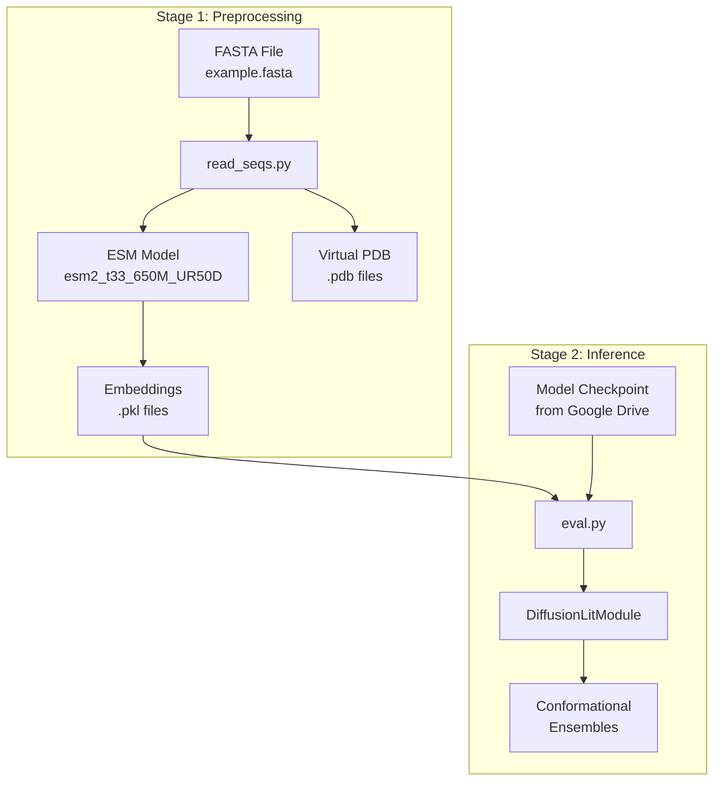
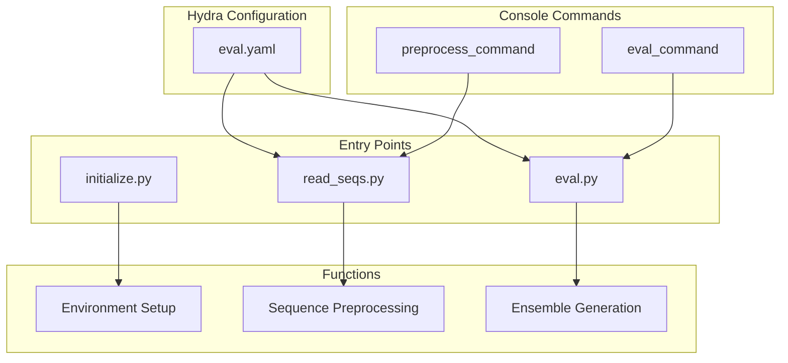
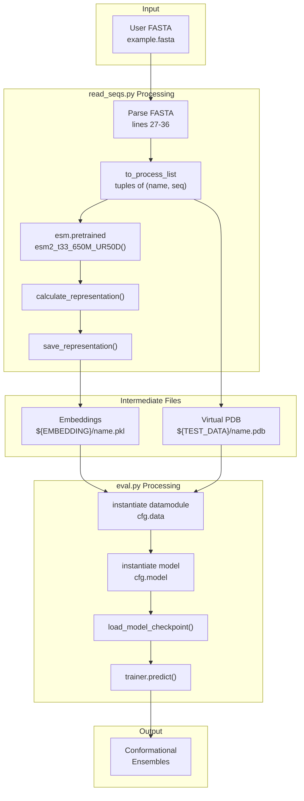

# User Guide

> **Relevant source files**
> * [README.md](https://github.com/Junjie-Zhu/IDPFold/blob/ba40f40c/README.md?plain=1)
> * [data/example.fasta](https://github.com/Junjie-Zhu/IDPFold/blob/ba40f40c/data/example.fasta)
> * [initialize.py](https://github.com/Junjie-Zhu/IDPFold/blob/ba40f40c/initialize.py)
> * [src/eval.py](https://github.com/Junjie-Zhu/IDPFold/blob/ba40f40c/src/eval.py)
> * [src/read_seqs.py](https://github.com/Junjie-Zhu/IDPFold/blob/ba40f40c/src/read_seqs.py)

## Purpose and Scope

This document provides practical instructions for using IDPFold to predict conformational ensembles of Intrinsically Disordered Proteins (IDPs). It covers the complete user workflow from input preparation through structure generation.

For installation and environment setup, see [Installation and Setup](/Junjie-Zhu/IDPFold/2-installation-and-setup). For detailed configuration options, see [Configuration System](/Junjie-Zhu/IDPFold/5-configuration-system). For in-depth information on the model architecture, see [Model Architecture](/Junjie-Zhu/IDPFold/4-model-architecture).

## Workflow Overview

IDPFold operates through a two-stage pipeline that transforms protein sequences into conformational ensembles. The workflow is strictly sequential, with each stage producing reusable intermediate outputs.



**IDPFold Complete User Workflow**

The preprocessing stage extracts ESM embeddings using [src/read_seqs.py L1-L63](https://github.com/Junjie-Zhu/IDPFold/blob/ba40f40c/src/read_seqs.py#L1-L63)

 and creates virtual PDB files with placeholder coordinates. These outputs are stored in directories defined in the `.env` file created by [initialize.py L1-L22](https://github.com/Junjie-Zhu/IDPFold/blob/ba40f40c/initialize.py#L1-L22)

 The inference stage loads these preprocessed files via [src/eval.py L1-L111](https://github.com/Junjie-Zhu/IDPFold/blob/ba40f40c/src/eval.py#L1-L111)

 and generates structural ensembles using a pre-trained diffusion model.

Sources: [README.md L45-L59](https://github.com/Junjie-Zhu/IDPFold/blob/ba40f40c/README.md?plain=1#L45-L59)

 [src/read_seqs.py L1-L63](https://github.com/Junjie-Zhu/IDPFold/blob/ba40f40c/src/read_seqs.py#L1-L63)

 [src/eval.py L1-L111](https://github.com/Junjie-Zhu/IDPFold/blob/ba40f40c/src/eval.py#L1-L111)

## Prerequisites Check

Before using IDPFold, verify the following:

| Requirement | Purpose | Verification Command |
| --- | --- | --- |
| Conda environment `idpfold` | Python dependencies | `conda env list \| grep idpfold` |
| `.env` file exists | Path configuration | `ls -la .env` |
| ESM package installed | Sequence embedding | `python -c "import esm"` |
| CUDA available (optional) | GPU acceleration | `python -c "import torch; print(torch.cuda.is_available())"` |
| Model checkpoint | Pre-trained weights | Check file exists at specified path |

The `.env` file must define these paths:

* `EMBEDDING`: Directory for sequence embeddings (`.pkl` files)
* `TEST_DATA`: Directory for virtual PDB files
* `CACHE_DIR`: Cache directory for temporary files

Sources: [README.md L22-L43](https://github.com/Junjie-Zhu/IDPFold/blob/ba40f40c/README.md?plain=1#L22-L43)

 [initialize.py L7-L11](https://github.com/Junjie-Zhu/IDPFold/blob/ba40f40c/initialize.py#L7-L11)

## Basic Usage Pattern

IDPFold provides three core operations accessible as Python scripts or console commands:



**IDPFold Command Structure and Entry Points**

Each script can be invoked directly with Hydra configuration overrides. The `preprocess_command` and `eval_command` console scripts are defined in [setup.py](https://github.com/Junjie-Zhu/IDPFold/blob/ba40f40c/setup.py)

 and provide convenient wrappers around the Python scripts.

Sources: [README.md L45-L63](https://github.com/Junjie-Zhu/IDPFold/blob/ba40f40c/README.md?plain=1#L45-L63)

 [src/read_seqs.py L15-L16](https://github.com/Junjie-Zhu/IDPFold/blob/ba40f40c/src/read_seqs.py#L15-L16)

 [src/eval.py L96-L97](https://github.com/Junjie-Zhu/IDPFold/blob/ba40f40c/src/eval.py#L96-L97)

## Command-Line Entry Points

### Direct Script Invocation

| Script | Purpose | Key Parameters | Output |
| --- | --- | --- | --- |
| `initialize.py` | Creates `.env` file and directories | None | `.env` file, data directories |
| `read_seqs.py` | Extracts ESM embeddings | `pred_dir` (FASTA path) | `.pkl` files, virtual `.pdb` files |
| `eval.py` | Generates ensembles | `ckpt_path` (checkpoint) | Conformational ensembles |

### Hydra Configuration Override Syntax

Both `read_seqs.py` and `eval.py` use Hydra for configuration management [src/read_seqs.py L15](https://github.com/Junjie-Zhu/IDPFold/blob/ba40f40c/src/read_seqs.py#L15-L15)

 [src/eval.py L96](https://github.com/Junjie-Zhu/IDPFold/blob/ba40f40c/src/eval.py#L96-L96)

 Parameters can be overridden from the command line:

```markdown
# Override the input FASTA file pathpython src/read_seqs.py pred_dir='./data/my_sequences.fasta' # Override the checkpoint pathpython src/eval.py ckpt_path='/path/to/checkpoint.ckpt'
```

The base configuration is loaded from [configs/eval.yaml](https://github.com/Junjie-Zhu/IDPFold/blob/ba40f40c/configs/eval.yaml)

 See [Configuration System](/Junjie-Zhu/IDPFold/5-configuration-system) for details on all available parameters.

Sources: [README.md L53-L59](https://github.com/Junjie-Zhu/IDPFold/blob/ba40f40c/README.md?plain=1#L53-L59)

 [src/read_seqs.py L15-L16](https://github.com/Junjie-Zhu/IDPFold/blob/ba40f40c/src/read_seqs.py#L15-L16)

 [src/eval.py L96-L97](https://github.com/Junjie-Zhu/IDPFold/blob/ba40f40c/src/eval.py#L96-L97)

## Data Flow Through the System



**Data Transformation Pipeline with Code References**

The preprocessing stage in [src/read_seqs.py L27-L58](https://github.com/Junjie-Zhu/IDPFold/blob/ba40f40c/src/read_seqs.py#L27-L58)

 parses FASTA files into a `to_process_list`, then uses the ESM model loaded at [src/read_seqs.py L51](https://github.com/Junjie-Zhu/IDPFold/blob/ba40f40c/src/read_seqs.py#L51-L51)

 to compute embeddings. The `calculate_representation()` function extracts features, and `save_representation()` writes them to `.pkl` files in the directory specified by `cfg.data.dataset.path_to_seq_embedding` [src/read_seqs.py L21](https://github.com/Junjie-Zhu/IDPFold/blob/ba40f40c/src/read_seqs.py#L21-L21)

During inference, [src/eval.py L56-L66](https://github.com/Junjie-Zhu/IDPFold/blob/ba40f40c/src/eval.py#L56-L66)

 instantiates the `LightningDataModule` and `LightningModule` from Hydra configs. The checkpoint is loaded manually via `checkpoint_utils.load_model_checkpoint()` [src/eval.py L81](https://github.com/Junjie-Zhu/IDPFold/blob/ba40f40c/src/eval.py#L81-L81)

 then `trainer.predict()` [src/eval.py L91](https://github.com/Junjie-Zhu/IDPFold/blob/ba40f40c/src/eval.py#L91-L91)

 generates the final ensembles.

Sources: [src/read_seqs.py L1-L63](https://github.com/Junjie-Zhu/IDPFold/blob/ba40f40c/src/read_seqs.py#L1-L63)

 [src/eval.py L46-L93](https://github.com/Junjie-Zhu/IDPFold/blob/ba40f40c/src/eval.py#L46-L93)

## Common Usage Scenarios

### Scenario 1: Predicting Ensembles for Example Sequences

The repository includes example IDP sequences in [data/example.fasta L1-L6](https://github.com/Junjie-Zhu/IDPFold/blob/ba40f40c/data/example.fasta#L1-L6)

:

```markdown
# Step 1: Initialize environment (first time only)python initialize.py # Step 2: Extract embeddings for example sequencespython src/read_seqs.py pred_dir='./data/example.fasta' # Step 3: Run inference with downloaded checkpointpython src/eval.py ckpt_path='/path/to/downloaded_checkpoint.ckpt'
```

This will process three IDP sequences (Abeta40, PaaA2, p15PAF) and generate conformational ensembles for each.

### Scenario 2: Processing Custom Sequences

```markdown
# Prepare your FASTA file with sequences# Format: > sequence_name#         AMINOACIDSEQUENCE # Extract embeddingspython src/read_seqs.py pred_dir='/path/to/your/sequences.fasta' # Generate ensemblespython src/eval.py ckpt_path='/path/to/checkpoint.ckpt'
```

### Scenario 3: Overriding Configuration Parameters

```markdown
# Change the number of replicas generatedpython src/eval.py ckpt_path='/path/to/checkpoint.ckpt' model.n_replica=384 # Adjust noise scale for inferencepython src/eval.py ckpt_path='/path/to/checkpoint.ckpt' model.noise_scale=1.5 # Change number of diffusion timestepspython src/eval.py ckpt_path='/path/to/checkpoint.ckpt' model.num_timesteps=500
```

See [Inference Parameters](/Junjie-Zhu/IDPFold/7.1-inference-parameters) for detailed explanations of these parameters.

Sources: [README.md L45-L59](https://github.com/Junjie-Zhu/IDPFold/blob/ba40f40c/README.md?plain=1#L45-L59)

 [data/example.fasta L1-L6](https://github.com/Junjie-Zhu/IDPFold/blob/ba40f40c/data/example.fasta#L1-L6)

## Key Implementation Details

### Virtual PDB File Generation

During preprocessing, [src/read_seqs.py L44-L49](https://github.com/Junjie-Zhu/IDPFold/blob/ba40f40c/src/read_seqs.py#L44-L49)

 creates virtual PDB files with all CA atoms placed at coordinates (0, 0, 0). These serve as placeholder structure files required by the data loading pipeline:

```css
# For each amino acid in the sequencef.write(f'ATOM  {i + 1:>5}  CA  {restype_dict[aa]:>3} A {i + 1:>3}      0.000   0.000   0.000  1.00  0.00           C\n')
```

The `restype_dict` maps single-letter amino acid codes to three-letter codes [src/read_seqs.py L39-L41](https://github.com/Junjie-Zhu/IDPFold/blob/ba40f40c/src/read_seqs.py#L39-L41)

 See [Virtual PDB Files](/Junjie-Zhu/IDPFold/7.3-virtual-pdb-files) for technical details.

### Device Selection

Both preprocessing and inference automatically detect GPU availability [src/read_seqs.py L24](https://github.com/Junjie-Zhu/IDPFold/blob/ba40f40c/src/read_seqs.py#L24-L24)

:

```
device = torch.device('cuda' if torch.cuda.is_available() else 'cpu')
```

ESM embedding extraction is GPU-accelerated when available, significantly reducing preprocessing time for large datasets.

### Configuration Loading

The scripts use Hydra's `@hydra.main` decorator to load configuration from [configs/eval.yaml](https://github.com/Junjie-Zhu/IDPFold/blob/ba40f40c/configs/eval.yaml)

 The base config directory is `../configs` relative to the script location [src/read_seqs.py L15](https://github.com/Junjie-Zhu/IDPFold/blob/ba40f40c/src/read_seqs.py#L15-L15)

 [src/eval.py L96](https://github.com/Junjie-Zhu/IDPFold/blob/ba40f40c/src/eval.py#L96-L96)

Sources: [src/read_seqs.py L24](https://github.com/Junjie-Zhu/IDPFold/blob/ba40f40c/src/read_seqs.py#L24-L24)

 [src/read_seqs.py L39-L49](https://github.com/Junjie-Zhu/IDPFold/blob/ba40f40c/src/read_seqs.py#L39-L49)

 [src/read_seqs.py L15](https://github.com/Junjie-Zhu/IDPFold/blob/ba40f40c/src/read_seqs.py#L15-L15)

 [src/eval.py L96](https://github.com/Junjie-Zhu/IDPFold/blob/ba40f40c/src/eval.py#L96-L96)

## Next Steps

For detailed documentation on each stage of the workflow:

* **Quick Start**: See [Quick Start](/Junjie-Zhu/IDPFold/3.1-quick-start) for a complete walkthrough example
* **Preprocessing**: See [Preprocessing Sequences](/Junjie-Zhu/IDPFold/3.2-preprocessing-sequences) for detailed embedding extraction options
* **Inference**: See [Running Inference](/Junjie-Zhu/IDPFold/3.3-running-inference) for ensemble generation parameters
* **Training**: See [Training Models](/Junjie-Zhu/IDPFold/3.4-training-models) for model training procedures (in development)

For advanced configuration:

* **Model Parameters**: See [Model Configuration Reference](/Junjie-Zhu/IDPFold/5.2-model-configuration-reference)
* **Evaluation Settings**: See [Evaluation Configuration Reference](/Junjie-Zhu/IDPFold/5.3-evaluation-configuration-reference)
* **Inference Tuning**: See [Inference Parameters](/Junjie-Zhu/IDPFold/7.1-inference-parameters)

For checkpoint access and file formats:

* **Obtaining Checkpoints**: Models available on [Google Drive](https://drive.google.com/drive/folders/1-5BHexAZKGX1lWyPkYU-JFi1EId88P9i)
* **File Formats**: See [File Formats and Data](/Junjie-Zhu/IDPFold/8-file-formats-and-data) for input/output specifications

Sources: [README.md L1-L69](https://github.com/Junjie-Zhu/IDPFold/blob/ba40f40c/README.md?plain=1#L1-L69)