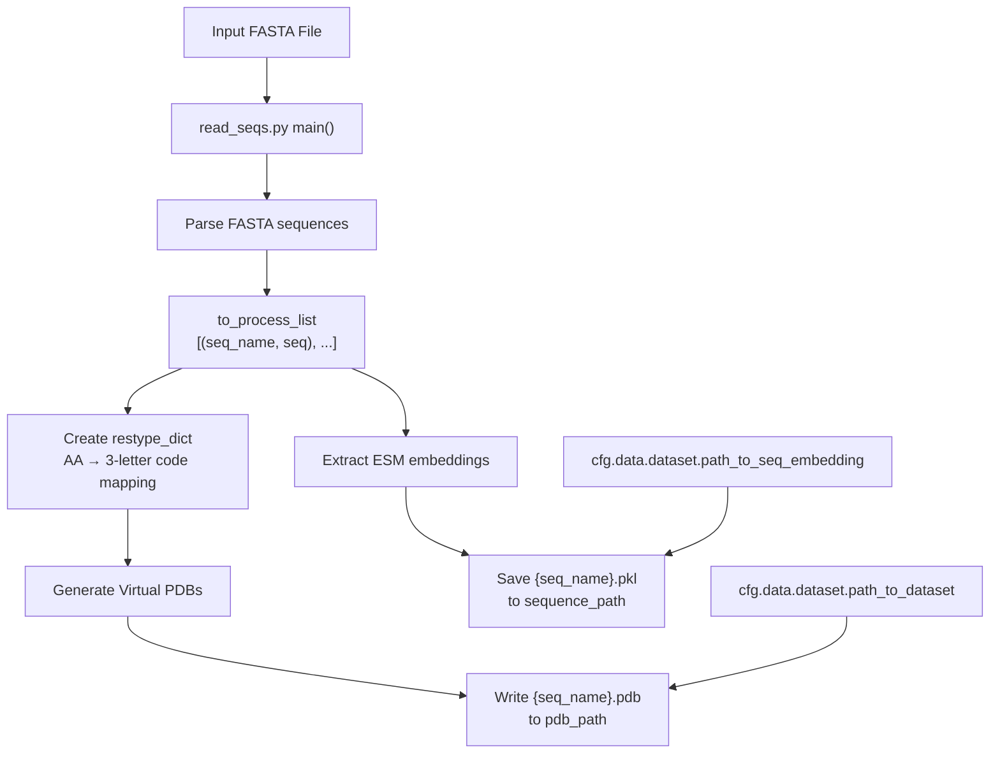
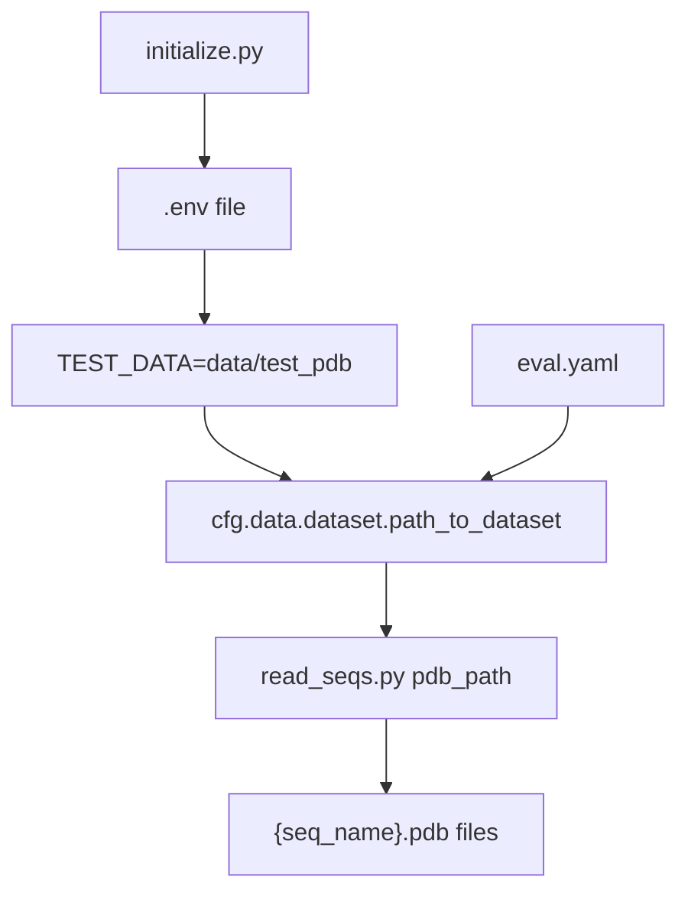
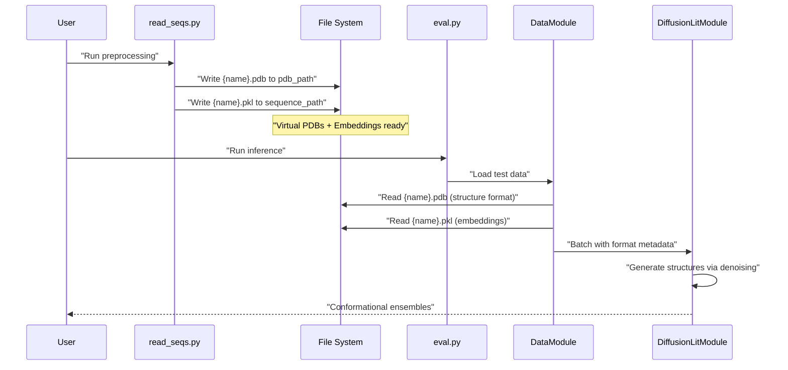
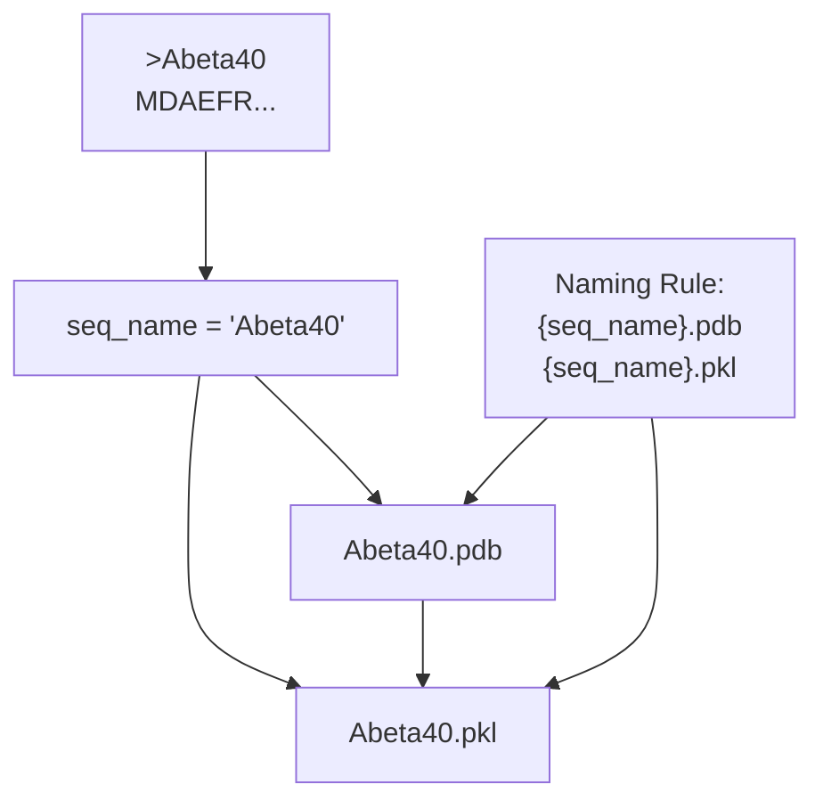

# Virtual PDB Files

> **Relevant source files**
> * [initialize.py](https://github.com/Junjie-Zhu/IDPFold/blob/ba40f40c/initialize.py)
> * [src/read_seqs.py](https://github.com/Junjie-Zhu/IDPFold/blob/ba40f40c/src/read_seqs.py)

Virtual PDB files are placeholder structure files with dummy coordinates generated during preprocessing. They serve as format templates that enable the inference pipeline to treat novel IDP sequences consistently with the data format expected by the model architecture. These files contain only CA (carbon alpha) backbone atoms with all coordinates set to the origin (0.000, 0.000, 0.000).

For information about the preprocessing workflow that generates these files, see [Preprocessing Sequences](/Junjie-Zhu/IDPFold/3.2-preprocessing-sequences). For details on the ESM embeddings generated alongside virtual PDBs, see [ESM Embedding Extraction](/Junjie-Zhu/IDPFold/7.2-esm-embedding-extraction).

---

## Purpose and Function

Virtual PDB files enable the IDPFold inference pipeline to process sequences that have no known experimental structure. Since the model architecture expects structural input alongside sequence embeddings, these placeholder files provide the necessary format compatibility without introducing structural bias.

### Key Characteristics

| Property | Value | Rationale |
| --- | --- | --- |
| **Atoms Included** | CA only | Backbone representation sufficient for coarse-grained modeling |
| **Coordinates** | (0.000, 0.000, 0.000) | No structural bias; all atoms at origin |
| **File Format** | Standard PDB | Compatible with downstream structural analysis tools |
| **Generation Time** | Preprocessing stage | Created once, reused across multiple inference runs |

The use of uniform zero coordinates ensures that the model relies entirely on learned sequence-structure relationships from the embeddings rather than initial coordinate values.

**Sources:** [src/read_seqs.py L43-L49](https://github.com/Junjie-Zhu/IDPFold/blob/ba40f40c/src/read_seqs.py#L43-L49)

---

## Generation Process

Virtual PDB files are automatically generated by `read_seqs.py` during the preprocessing stage. The generation occurs before ESM embedding extraction, ensuring all required input files are available for inference.



**Diagram: Virtual PDB Generation in Preprocessing Pipeline**

**Sources:** [src/read_seqs.py L15-L59](https://github.com/Junjie-Zhu/IDPFold/blob/ba40f40c/src/read_seqs.py#L15-L59)

---

## Code Implementation

The virtual PDB generation logic resides in the main preprocessing function. Each sequence is converted to a series of CA atom records with zero coordinates.

### Core Generation Loop

The generation occurs in a loop over parsed sequences from the input FASTA file:

```
for seq_name, seq in to_process_list:
    with open(os.path.join(pdb_path, (seq_name + '.pdb')), 'w') as f:
        for i, aa in enumerate(seq):
            f.write(
                f'ATOM  {i + 1:>5}  CA  {restype_dict[aa]:>3} A {i + 1:>3}      0.000   0.000   0.000  1.00  0.00           C\n')
```

This code is located at [src/read_seqs.py L44-L49](https://github.com/Junjie-Zhu/IDPFold/blob/ba40f40c/src/read_seqs.py#L44-L49)

### Amino Acid Code Mapping

The `restype_dict` dictionary maps single-letter amino acid codes to three-letter PDB residue names:

| Single Letter | Three Letter | Example |
| --- | --- | --- |
| A | ALA | Alanine |
| C | CYS | Cysteine |
| D | ASP | Aspartate |
| ... | ... | ... |
| Y | TYR | Tyrosine |

The complete mapping is defined at [src/read_seqs.py L39-L41](https://github.com/Junjie-Zhu/IDPFold/blob/ba40f40c/src/read_seqs.py#L39-L41)

**Sources:** [src/read_seqs.py L39-L49](https://github.com/Junjie-Zhu/IDPFold/blob/ba40f40c/src/read_seqs.py#L39-L49)

---

## File Format Specification

Virtual PDB files follow the standard PDB format specification for ATOM records. Each line represents a single CA atom.

### ATOM Record Format

```
ATOM  {atom_num:>5}  CA  {residue:>3} A {res_num:>3}      0.000   0.000   0.000  1.00  0.00           C
```

| Field | Column | Format | Value | Description |
| --- | --- | --- | --- | --- |
| Record name | 1-6 | String | `ATOM` | Identifies record type |
| Atom serial | 7-11 | Integer | `i + 1` | Atom number (1-indexed) |
| Atom name | 13-16 | String | `CA` | Carbon alpha |
| Residue name | 18-20 | String | 3-letter code | From `restype_dict` |
| Chain ID | 22 | Character | `A` | Single chain |
| Residue number | 23-26 | Integer | `i + 1` | Residue sequence number |
| X coordinate | 31-38 | Float | `0.000` | Fixed at origin |
| Y coordinate | 39-46 | Float | `0.000` | Fixed at origin |
| Z coordinate | 47-54 | Float | `0.000` | Fixed at origin |
| Occupancy | 55-60 | Float | `1.00` | Standard value |
| Temperature | 61-66 | Float | `0.00` | Standard value |
| Element symbol | 77-78 | String | `C` | Carbon |

### Example Virtual PDB

For a sequence "MKLL":

```
ATOM      1  CA  MET A   1      0.000   0.000   0.000  1.00  0.00           C
ATOM      2  CA  LYS A   2      0.000   0.000   0.000  1.00  0.00           C
ATOM      3  CA  LEU A   3      0.000   0.000   0.000  1.00  0.00           C
ATOM      4  CA  LEU A   4      0.000   0.000   0.000  1.00  0.00           C
```

**Sources:** [src/read_seqs.py L48-L49](https://github.com/Junjie-Zhu/IDPFold/blob/ba40f40c/src/read_seqs.py#L48-L49)

---

## Directory Configuration

Virtual PDB files are written to the directory specified by the configuration path `cfg.data.dataset.path_to_dataset`. This path is typically set during environment initialization.



**Diagram: Configuration Path Flow for Virtual PDBs**

The default directory is `data/test_pdb`, created during initialization:

| Configuration Key | Default Value | Purpose |
| --- | --- | --- |
| `TEST_DATA` in `.env` | `data/test_pdb` | Storage location for virtual PDBs |

**Sources:** [initialize.py L10](https://github.com/Junjie-Zhu/IDPFold/blob/ba40f40c/initialize.py#L10-L10)

 [src/read_seqs.py L22](https://github.com/Junjie-Zhu/IDPFold/blob/ba40f40c/src/read_seqs.py#L22-L22)

---

## Role in Inference Pipeline

Virtual PDB files are loaded during inference to provide structural metadata for the sequences being predicted. While the coordinates themselves are not used for predictions (since they are all zeros), the file format and structure metadata enable compatibility with the model's data loading pipeline.



**Diagram: Virtual PDB Usage in Inference Pipeline**

The data loading module expects paired `.pdb` and `.pkl` files with matching filenames. The virtual PDB provides:

1. **Sequence length metadata** - Number of residues from CA atom count
2. **Residue identities** - Three-letter codes for validation against embeddings
3. **Format compatibility** - Standard PDB format for structural tools
4. **Chain information** - Single-chain designation (chain A)

**Sources:** [src/read_seqs.py L22](https://github.com/Junjie-Zhu/IDPFold/blob/ba40f40c/src/read_seqs.py#L22-L22)

 [src/read_seqs.py L44-L49](https://github.com/Junjie-Zhu/IDPFold/blob/ba40f40c/src/read_seqs.py#L44-L49)

---

## Naming Convention

Virtual PDB files follow a strict naming convention that matches the sequence identifiers from the input FASTA file.



**Diagram: File Naming Convention from FASTA Headers**

The sequence name is extracted from the FASTA header by removing the leading `>` character and stripping whitespace:

* FASTA header: `>Abeta40`
* Extracted name: `Abeta40`
* Virtual PDB: `Abeta40.pdb`
* Embedding file: `Abeta40.pkl`

This pairing ensures the data loader can automatically match structure templates with their corresponding sequence embeddings.

**Sources:** [src/read_seqs.py L32-L33](https://github.com/Junjie-Zhu/IDPFold/blob/ba40f40c/src/read_seqs.py#L32-L33)

 [src/read_seqs.py L45](https://github.com/Junjie-Zhu/IDPFold/blob/ba40f40c/src/read_seqs.py#L45-L45)

 [src/read_seqs.py L58](https://github.com/Junjie-Zhu/IDPFold/blob/ba40f40c/src/read_seqs.py#L58-L58)

---

## Comparison with Real PDB Files

Virtual PDB files differ significantly from experimental PDB structures:

| Property | Virtual PDB | Experimental PDB |
| --- | --- | --- |
| **Coordinate Source** | Placeholder (0,0,0) | Experimental (X-ray, NMR, Cryo-EM) |
| **Atoms Included** | CA only | All atoms (backbone + sidechains) |
| **Number of Models** | 1 | 1 or multiple (e.g., NMR ensemble) |
| **Resolution** | N/A | Specified (e.g., 2.0 Å) |
| **Purpose** | Format template | Structural information |
| **B-factors** | Fixed (0.00) | Experimental uncertainty values |
| **Occupancy** | Fixed (1.00) | Occupancy values or 1.00 |

The key distinction is that virtual PDBs provide **format compatibility** rather than structural information. The actual structural predictions are generated by the diffusion model during inference.

**Sources:** [src/read_seqs.py L48-L49](https://github.com/Junjie-Zhu/IDPFold/blob/ba40f40c/src/read_seqs.py#L48-L49)

---

## Technical Rationale

The use of virtual PDB files with zero coordinates serves several technical purposes:

### No Structural Bias

By placing all atoms at the origin, the model cannot use initial coordinates as hints. The diffusion process must rely entirely on:

* Sequence embeddings from ESM
* Learned sequence-structure relationships
* Diffusion process noise schedules

### Format Standardization

The model architecture expects structural input in a standardized format. Virtual PDBs ensure:

* Consistent chain labeling (chain A)
* Sequential residue numbering
* Standard atom naming conventions (CA)
* Compatible with PDB parsing libraries

### Preprocessing Efficiency

Creating virtual PDBs during preprocessing is computationally trivial compared to ESM embedding extraction. This allows:

* Fast generation (simple string formatting)
* No GPU requirements
* Deterministic output

**Sources:** [src/read_seqs.py L44-L49](https://github.com/Junjie-Zhu/IDPFold/blob/ba40f40c/src/read_seqs.py#L44-L49)

---

## File System Layout

After running `read_seqs.py`, the file system contains paired virtual PDB and embedding files:

```markdown
data/
├── test_pdb/              # Virtual PDB files (pdb_path)
│   ├── Abeta40.pdb
│   ├── PaaA2.pdb
│   └── p15PAF.pdb
└── embeddings/            # ESM embeddings (sequence_path)
    ├── Abeta40.pkl
    ├── PaaA2.pkl
    └── p15PAF.pkl
```

Both directories are created during initialization and configured via the `.env` file. The `TEST_DATA` environment variable maps to `pdb_path`, while `EMBEDDING` maps to `sequence_path`.

**Sources:** [initialize.py L7-L11](https://github.com/Junjie-Zhu/IDPFold/blob/ba40f40c/initialize.py#L7-L11)

 [src/read_seqs.py L21-L22](https://github.com/Junjie-Zhu/IDPFold/blob/ba40f40c/src/read_seqs.py#L21-L22)

---

## Limitations and Constraints

Virtual PDB files have several inherent limitations:

### Single Chain Assumption

All virtual PDBs use chain identifier `A`. Multi-chain proteins or protein complexes are not supported in the current implementation.

### CA-Only Representation

Only carbon alpha atoms are included. Sidechain atoms, backbone nitrogen, carbonyl carbon, and oxygen atoms are omitted. This is consistent with the coarse-grained modeling approach used by IDPFold.

### No Structural Metadata

Virtual PDBs lack:

* HEADER records (experimental method, deposition date)
* REMARK records (resolution, refinement statistics)
* SEQRES records (complete sequence)
* HELIX/SHEET records (secondary structure)

These omissions are acceptable since the files serve only as format templates, not structural representations.

**Sources:** [src/read_seqs.py L48-L49](https://github.com/Junjie-Zhu/IDPFold/blob/ba40f40c/src/read_seqs.py#L48-L49)