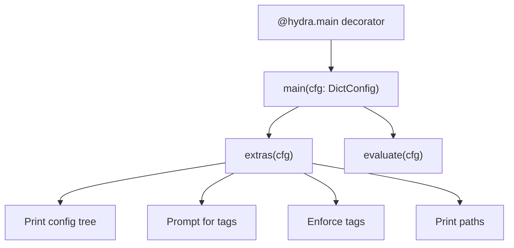
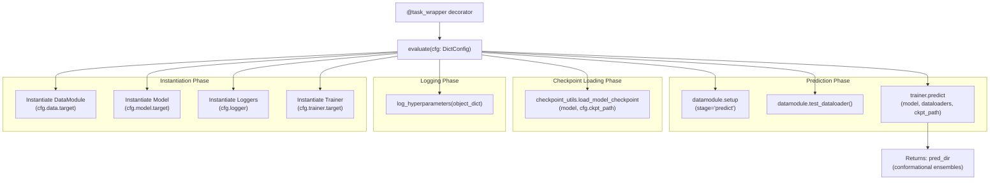
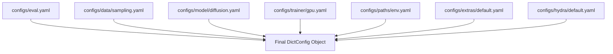
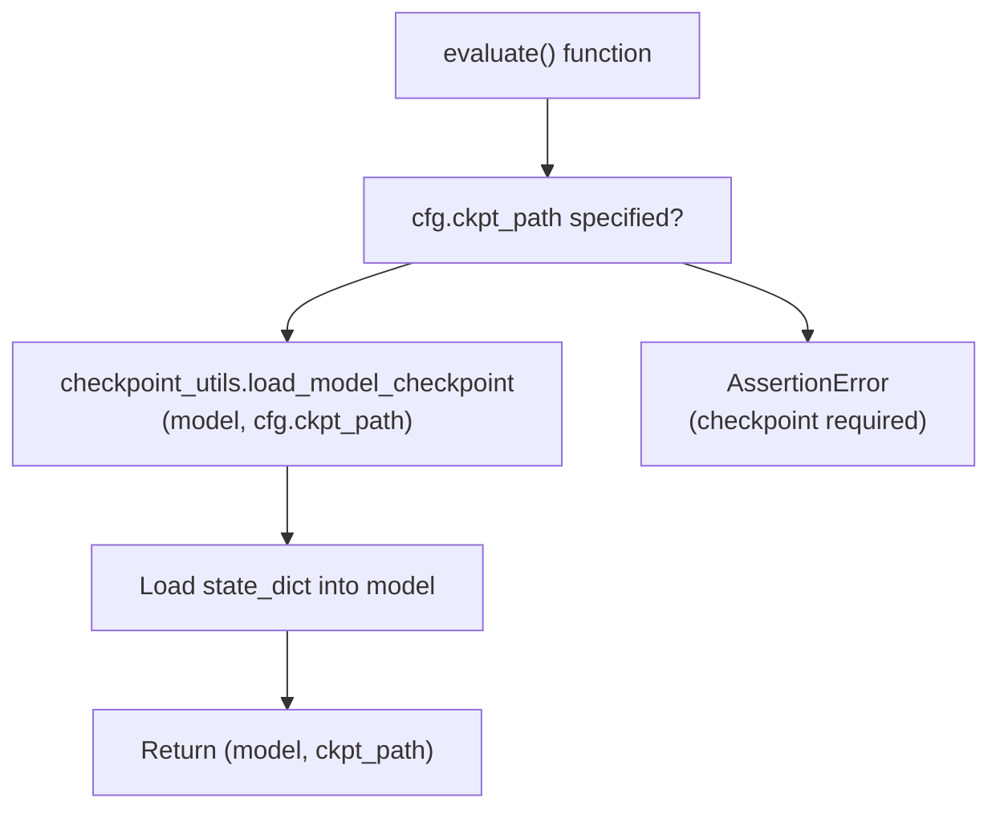
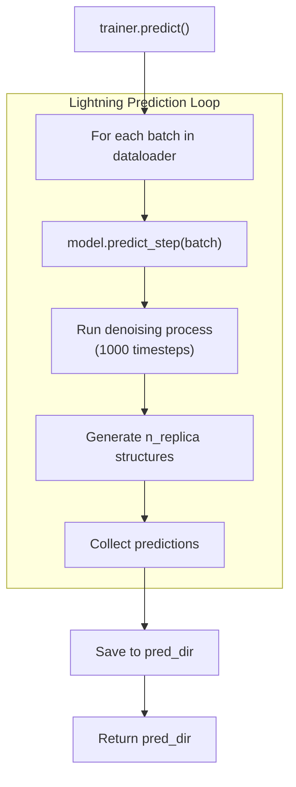
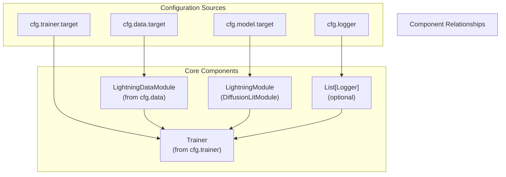
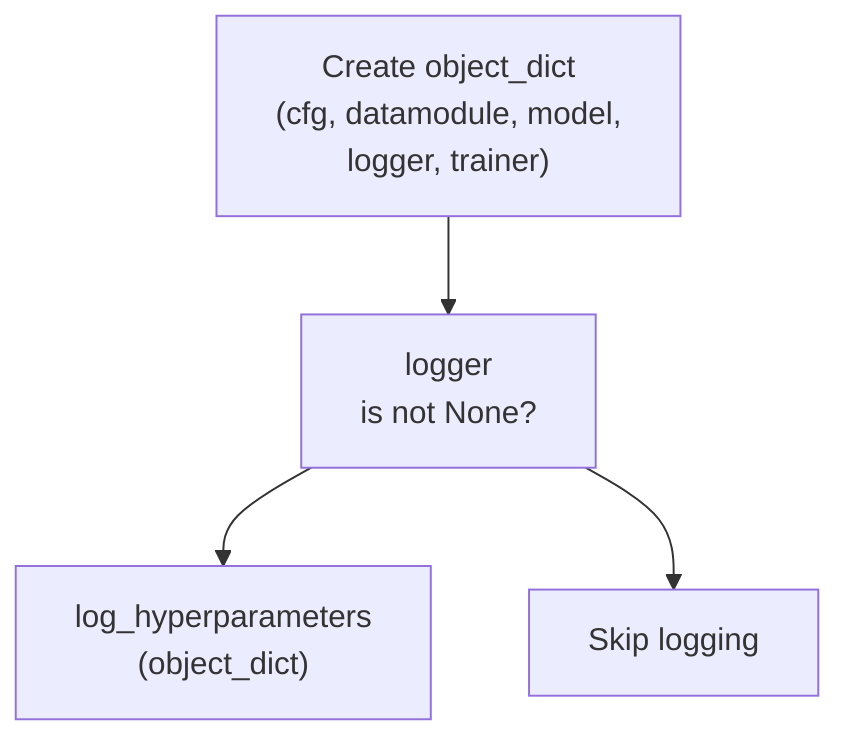
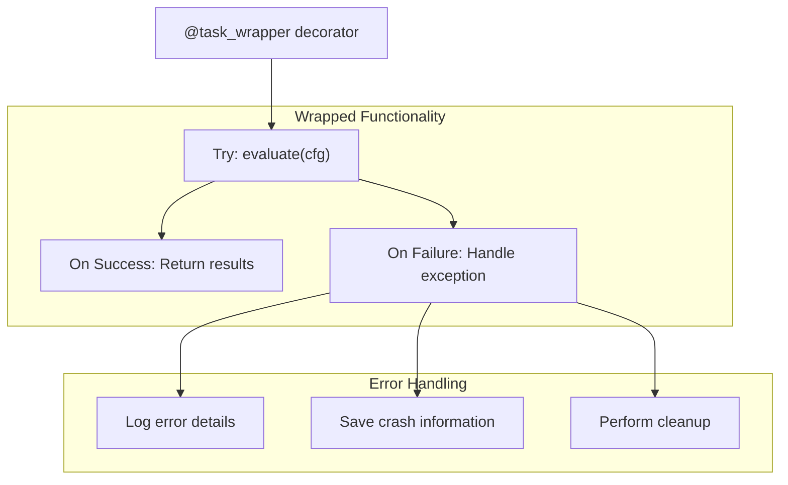
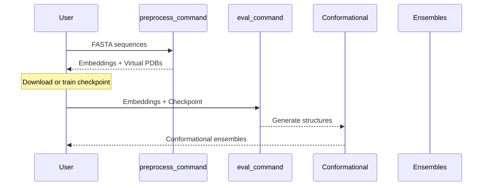

# eval_command

> **Relevant source files**
> * [.project-root](https://github.com/Junjie-Zhu/IDPFold/blob/ba40f40c/.project-root)
> * [configs/eval.yaml](https://github.com/Junjie-Zhu/IDPFold/blob/ba40f40c/configs/eval.yaml)
> * [setup.py](https://github.com/Junjie-Zhu/IDPFold/blob/ba40f40c/setup.py)
> * [src/eval.py](https://github.com/Junjie-Zhu/IDPFold/blob/ba40f40c/src/eval.py)

## Purpose and Scope

The `eval_command` is a command-line interface entry point for running inference with trained IDPFold models to generate conformational ensembles for Intrinsically Disordered Proteins. This page documents how to invoke the command, its configuration options, internal workflow, and outputs.

For information about preprocessing sequences before evaluation, see [preprocess_command](/Junjie-Zhu/IDPFold/6.1-preprocess_command). For details about the configuration parameters themselves, see [Evaluation Configuration Reference](/Junjie-Zhu/IDPFold/5.3-evaluation-configuration-reference). For the underlying model architecture used during inference, see [DiffusionLitModule Overview](/Junjie-Zhu/IDPFold/4.1-diffusionlitmodule-overview).

---

## Command Registration

The `eval_command` is registered as a console script entry point in the package setup, making it available system-wide after installation.

**Entry Point Definition:**

| Component | Value |
| --- | --- |
| Command Name | `eval_command` |
| Module | `src.eval` |
| Function | `main` |
| Config File | `configs/eval.yaml` |
| Hydra Version | 1.3 |

The command is defined in [setup.py L18](https://github.com/Junjie-Zhu/IDPFold/blob/ba40f40c/setup.py#L18-L18)

 as:

```
"eval_command = src.eval:main"
```

This registration makes the command callable from any terminal after package installation via `pip install -e .`

**Sources:** [setup.py L15-L21](https://github.com/Junjie-Zhu/IDPFold/blob/ba40f40c/setup.py#L15-L21)

---

## Command Invocation

### Basic Usage

```
eval_command
```

When invoked without arguments, the command uses default configuration from `configs/eval.yaml` and its composed config files.

### With Configuration Overrides

```
eval_command ckpt_path=/path/to/model.ckpt
```

Hydra allows overriding any configuration parameter via command-line arguments using the syntax `key=value`.

### Common Override Patterns

```markdown
# Override checkpoint patheval_command ckpt_path=${paths.data_dir}/my_checkpoint.ckpt # Override multiple parameterseval_command ckpt_path=/path/to/ckpt data.batch_size=8 trainer.devices=2 # Use different config groupseval_command data=sampling model=diffusion trainer=cpu
```

**Sources:** [src/eval.py L96-L110](https://github.com/Junjie-Zhu/IDPFold/blob/ba40f40c/src/eval.py#L96-L110)

---

## Workflow Overview

The following diagram illustrates the complete execution flow when `eval_command` is invoked:

```mermaid
sequenceDiagram
  participant User
  participant eval_command
  participant Hydra Framework
  participant eval.py::main()
  participant eval.py::evaluate()
  participant DiffusionLitModule
  participant LightningDataModule
  participant Lightning Trainer
  participant Model Checkpoint

  User->>eval_command: eval_command [args]
  eval_command->>Hydra Framework: Load configs/eval.yaml
  Hydra Framework->>eval.py::main(): main(cfg: DictConfig)
  eval.py::main()->>eval.py::main(): extras(cfg)
  note over eval.py::main(): Apply utilities (tags, logging)
  eval.py::main()->>eval.py::evaluate(): evaluate(cfg)
  eval.py::evaluate()->>LightningDataModule: instantiate(cfg.data)
  eval.py::evaluate()->>DiffusionLitModule: instantiate(cfg.model)
  eval.py::evaluate()->>Lightning Trainer: instantiate(cfg.trainer)
  eval.py::evaluate()->>Model Checkpoint: checkpoint_utils.load_model_checkpoint()
  Model Checkpoint-->>DiffusionLitModule: Load weights
  eval.py::evaluate()->>LightningDataModule: setup(stage="predict")
  LightningDataModule-->>eval.py::evaluate(): test_dataloader()
  eval.py::evaluate()->>Lightning Trainer: trainer.predict(model, dataloaders)
  Lightning Trainer->>DiffusionLitModule: Run inference
  DiffusionLitModule-->>Lightning Trainer: Predictions
  Lightning Trainer-->>eval.py::evaluate(): pred_dir
  eval.py::evaluate()-->>User: Conformational ensembles
```

**Workflow Stages:**

1. **Configuration Loading**: Hydra composes configuration from YAML files
2. **Utilities Application**: Extra utilities like tag prompting and config printing
3. **Component Instantiation**: DataModule, Model, and Trainer objects created
4. **Checkpoint Loading**: Model weights loaded from specified checkpoint path
5. **Data Preparation**: DataModule sets up test dataloader for predictions
6. **Inference Execution**: Trainer runs prediction loop with loaded model
7. **Output Generation**: Conformational ensembles written to output directory

**Sources:** [src/eval.py L45-L106](https://github.com/Junjie-Zhu/IDPFold/blob/ba40f40c/src/eval.py#L45-L106)

---

## Implementation Architecture

The command's implementation consists of two main functions in `src/eval.py`:

### Function: main()



**Purpose:** Entry point that loads configuration via Hydra and applies extra utilities before delegating to `evaluate()`.

**Key Responsibilities:**

* Decorated with `@hydra.main` for configuration management [src/eval.py L96](https://github.com/Junjie-Zhu/IDPFold/blob/ba40f40c/src/eval.py#L96-L96)
* Calls `extras(cfg)` for utility operations [src/eval.py L104](https://github.com/Junjie-Zhu/IDPFold/blob/ba40f40c/src/eval.py#L104-L104)
* Invokes `evaluate(cfg)` for actual evaluation logic [src/eval.py L106](https://github.com/Junjie-Zhu/IDPFold/blob/ba40f40c/src/eval.py#L106-L106)

**Sources:** [src/eval.py L96-L110](https://github.com/Junjie-Zhu/IDPFold/blob/ba40f40c/src/eval.py#L96-L110)

### Function: evaluate()



**Purpose:** Core evaluation logic wrapped with task_wrapper for error handling and logging.

**Key Responsibilities:**

1. Instantiates all required components using Hydra [src/eval.py L56-L66](https://github.com/Junjie-Zhu/IDPFold/blob/ba40f40c/src/eval.py#L56-L66)
2. Logs hyperparameters if loggers are configured [src/eval.py L76-L78](https://github.com/Junjie-Zhu/IDPFold/blob/ba40f40c/src/eval.py#L76-L78)
3. Loads model checkpoint using utility function [src/eval.py L81](https://github.com/Junjie-Zhu/IDPFold/blob/ba40f40c/src/eval.py#L81-L81)
4. Sets up DataModule for prediction stage [src/eval.py L87](https://github.com/Junjie-Zhu/IDPFold/blob/ba40f40c/src/eval.py#L87-L87)
5. Obtains test dataloader [src/eval.py L88](https://github.com/Junjie-Zhu/IDPFold/blob/ba40f40c/src/eval.py#L88-L88)
6. Executes prediction via Trainer [src/eval.py L91](https://github.com/Junjie-Zhu/IDPFold/blob/ba40f40c/src/eval.py#L91-L91)

**Return Value:** Tuple of `(metrics_dict, object_dict)` where:

* `metrics_dict`: Empty dict (no test metrics computed) [src/eval.py L93](https://github.com/Junjie-Zhu/IDPFold/blob/ba40f40c/src/eval.py#L93-L93)
* `object_dict`: Dict containing cfg, datamodule, model, logger, trainer [src/eval.py L68-L74](https://github.com/Junjie-Zhu/IDPFold/blob/ba40f40c/src/eval.py#L68-L74)

**Sources:** [src/eval.py L45-L93](https://github.com/Junjie-Zhu/IDPFold/blob/ba40f40c/src/eval.py#L45-L93)

---

## Configuration System Integration

The command uses Hydra's configuration composition to build the complete configuration:

### Default Configuration Structure

From [configs/eval.yaml L3-L11](https://github.com/Junjie-Zhu/IDPFold/blob/ba40f40c/configs/eval.yaml#L3-L11)

:

```yaml
defaults:  - _self_  - data: sampling  - model: diffusion  - logger: null  - trainer: gpu  - paths: env  - extras: default  - hydra: default
```

### Configuration Composition Flow



**Configuration Parameters:**

| Parameter | Default Value | Purpose |
| --- | --- | --- |
| `task_name` | `"eval"` | Identifies the task type |
| `tags` | `["dev"]` | Tags for experiment tracking |
| `ckpt_path` | `${paths.data_dir}/last.ckpt` | Path to model checkpoint |
| `pred_dir` | `null` | Output directory (auto-generated if null) |
| `data` | `sampling` | DataModule configuration group |
| `model` | `diffusion` | Model configuration group |
| `logger` | `null` | Logger configuration (disabled by default) |
| `trainer` | `gpu` | Trainer configuration group |

**Sources:** [configs/eval.yaml L1-L20](https://github.com/Junjie-Zhu/IDPFold/blob/ba40f40c/configs/eval.yaml#L1-L20)

---

## Checkpoint Loading Mechanism

The command uses a specialized checkpoint loading utility to handle model weight restoration:

### Loading Process



**Code Reference:**

The checkpoint loading occurs at [src/eval.py L81](https://github.com/Junjie-Zhu/IDPFold/blob/ba40f40c/src/eval.py#L81-L81)

:

```
model, ckpt_path = checkpoint_utils.load_model_checkpoint(model, cfg.ckpt_path)
```

**Key Points:**

* Checkpoint path is **required** for evaluation (no training mode)
* The utility function handles both local paths and potentially remote URLs
* Model weights are loaded before prediction begins
* The loaded checkpoint path is passed to `trainer.predict()` for Lightning compatibility

**Sources:** [src/eval.py L80-L81](https://github.com/Junjie-Zhu/IDPFold/blob/ba40f40c/src/eval.py#L80-L81)

---

## Prediction Execution

### DataModule Setup

The command explicitly sets up the DataModule for the "predict" stage:

```
datamodule.setup(stage="predict")dataloaders = datamodule.test_dataloader()
```

This ensures:

* Test dataset is loaded and prepared
* Dataloaders are configured with appropriate batch sizes
* Embeddings and virtual PDB files are located correctly

**Sources:** [src/eval.py L86-L88](https://github.com/Junjie-Zhu/IDPFold/blob/ba40f40c/src/eval.py#L86-L88)

### Trainer Prediction Loop

The actual inference is executed via Lightning's Trainer:

```
pred_dir = trainer.predict(model=model, dataloaders=dataloaders, ckpt_path=ckpt_path)[-1]
```

**Prediction Flow:**



**Key Characteristics:**

* Uses Lightning's built-in prediction loop for distributed execution
* Model's `predict_step()` method generates conformational ensembles
* Output directory contains generated structures for each protein
* Returns the final prediction directory path

**Sources:** [src/eval.py L90-L91](https://github.com/Junjie-Zhu/IDPFold/blob/ba40f40c/src/eval.py#L90-L91)

---

## Component Dependencies

The command instantiates and coordinates multiple components:

### Instantiation Order and Dependencies



**Instantiation Code:**

| Component | Code Location | Configuration Key |
| --- | --- | --- |
| DataModule | [src/eval.py L56-L57](https://github.com/Junjie-Zhu/IDPFold/blob/ba40f40c/src/eval.py#L56-L57) | `cfg.data._target_` |
| Model | [src/eval.py L59-L60](https://github.com/Junjie-Zhu/IDPFold/blob/ba40f40c/src/eval.py#L59-L60) | `cfg.model._target_` |
| Loggers | [src/eval.py L62-L63](https://github.com/Junjie-Zhu/IDPFold/blob/ba40f40c/src/eval.py#L62-L63) | `cfg.logger` |
| Trainer | [src/eval.py L65-L66](https://github.com/Junjie-Zhu/IDPFold/blob/ba40f40c/src/eval.py#L65-L66) | `cfg.trainer._target_` |

**Sources:** [src/eval.py L56-L74](https://github.com/Junjie-Zhu/IDPFold/blob/ba40f40c/src/eval.py#L56-L74)

---

## Logging and Hyperparameter Tracking

The command optionally logs hyperparameters when loggers are configured:

### Logging Workflow



**Object Dictionary Structure:**

The `object_dict` passed to `log_hyperparameters()` contains [src/eval.py L68-L74](https://github.com/Junjie-Zhu/IDPFold/blob/ba40f40c/src/eval.py#L68-L74)

:

```css
object_dict = {    "cfg": cfg,                    # Complete configuration    "datamodule": datamodule,      # Instantiated DataModule    "model": model,                # Instantiated Model    "logger": logger,              # List of loggers    "trainer": trainer,            # Instantiated Trainer}
```

**Note:** By default, `logger` is set to `null` in [configs/eval.yaml L7](https://github.com/Junjie-Zhu/IDPFold/blob/ba40f40c/configs/eval.yaml#L7-L7)

 so no logging occurs during evaluation unless explicitly configured.

**Sources:** [src/eval.py L68-L78](https://github.com/Junjie-Zhu/IDPFold/blob/ba40f40c/src/eval.py#L68-L78)

---

## Output Generation

The command generates conformational ensembles as output:

### Output Directory

The prediction directory is automatically determined by the Trainer and DataModule configuration. The final directory path is returned by `trainer.predict()`:

```
pred_dir = trainer.predict(...)[-1]
```

**Directory Structure (Typical):**

```
pred_dir/
├── protein1_ensemble.pdb
├── protein2_ensemble.pdb
└── ...
```

### Output Characteristics

| Characteristic | Description |
| --- | --- |
| Format | Conformational ensemble structures |
| Number of Structures | Determined by `model.n_replica` (default: 192) |
| Proteins Processed | All sequences in test dataloader |
| File Organization | One file per protein or organized by DataModule |

For detailed information about output formats, see [Output Conformational Ensembles](/Junjie-Zhu/IDPFold/8.4-output-conformational-ensembles).

**Sources:** [src/eval.py L91](https://github.com/Junjie-Zhu/IDPFold/blob/ba40f40c/src/eval.py#L91-L91)

---

## Error Handling

The `evaluate()` function is wrapped with the `@task_wrapper` decorator [src/eval.py L45](https://github.com/Junjie-Zhu/IDPFold/blob/ba40f40c/src/eval.py#L45-L45)

 which provides:

### Task Wrapper Features



**Benefits:**

* Graceful failure handling during multiruns
* Automatic logging of error information
* Crash report generation for debugging
* Ensures consistent behavior across tasks

**Sources:** [src/eval.py L45](https://github.com/Junjie-Zhu/IDPFold/blob/ba40f40c/src/eval.py#L45-L45)

---

## Usage Examples

### Example 1: Basic Inference

```markdown
# Run with default configurationeval_command
```

Assumes:

* Checkpoint exists at `${paths.data_dir}/last.ckpt`
* Test data configured in `configs/data/sampling.yaml`
* GPU trainer with default settings

### Example 2: Custom Checkpoint

```markdown
# Use specific checkpointeval_command ckpt_path=/path/to/pretrained_model.ckpt
```

### Example 3: CPU Execution

```markdown
# Run on CPU instead of GPUeval_command trainer=cpu
```

### Example 4: Modified Inference Parameters

```markdown
# Override model inference settingseval_command model.n_replica=512 model.num_timesteps=2000
```

### Example 5: Multiple Overrides

```markdown
# Comprehensive configuration overrideeval_command \    ckpt_path=/path/to/checkpoint.ckpt \    data.batch_size=4 \    trainer.devices=1 \    model.n_replica=256 \    model.self_conditioning=false
```

**Sources:** [src/eval.py L96-L110](https://github.com/Junjie-Zhu/IDPFold/blob/ba40f40c/src/eval.py#L96-L110)

 [configs/eval.yaml L1-L20](https://github.com/Junjie-Zhu/IDPFold/blob/ba40f40c/configs/eval.yaml#L1-L20)

---

## Relationship to Other Commands

### Command Comparison

| Aspect | preprocess_command | eval_command | train_command |
| --- | --- | --- | --- |
| **Primary Function** | Extract embeddings | Run inference | Train model |
| **Input** | FASTA files | Embeddings + checkpoint | Training data |
| **Output** | .pkl + virtual PDBs | Conformational ensembles | Model checkpoints |
| **Requires Model** | No | Yes (checkpoint) | Yes (initialization) |
| **Config File** | N/A (script args) | eval.yaml | train.yaml |
| **Entry Point** | [setup.py L19](https://github.com/Junjie-Zhu/IDPFold/blob/ba40f40c/setup.py#L19-L19) | [setup.py L18](https://github.com/Junjie-Zhu/IDPFold/blob/ba40f40c/setup.py#L18-L18) | [setup.py L17](https://github.com/Junjie-Zhu/IDPFold/blob/ba40f40c/setup.py#L17-L17) |

### Typical Workflow Sequence



**Sources:** [setup.py L15-L21](https://github.com/Junjie-Zhu/IDPFold/blob/ba40f40c/setup.py#L15-L21)

---

## Summary

The `eval_command` provides a streamlined interface for generating IDP conformational ensembles using trained diffusion models. Key aspects:

**Invocation:** Simple CLI command with Hydra-based configuration override support

**Configuration:** Composes settings from multiple YAML files for flexible experimentation

**Workflow:** Linear execution from component instantiation through checkpoint loading to prediction

**Integration:** Leverages PyTorch Lightning's Trainer for robust, distributed inference execution

**Output:** Generates conformational ensembles saved to automatically determined output directory

For practical usage examples, see [Quick Start](/Junjie-Zhu/IDPFold/3.1-quick-start). For configuration customization, see [Evaluation Configuration Reference](/Junjie-Zhu/IDPFold/5.3-evaluation-configuration-reference). For advanced inference parameters, see [Inference Parameters](/Junjie-Zhu/IDPFold/7.1-inference-parameters).

**Sources:** [setup.py L15-L21](https://github.com/Junjie-Zhu/IDPFold/blob/ba40f40c/setup.py#L15-L21)

 [src/eval.py L1-L111](https://github.com/Junjie-Zhu/IDPFold/blob/ba40f40c/src/eval.py#L1-L111)

 [configs/eval.yaml L1-L20](https://github.com/Junjie-Zhu/IDPFold/blob/ba40f40c/configs/eval.yaml#L1-L20)