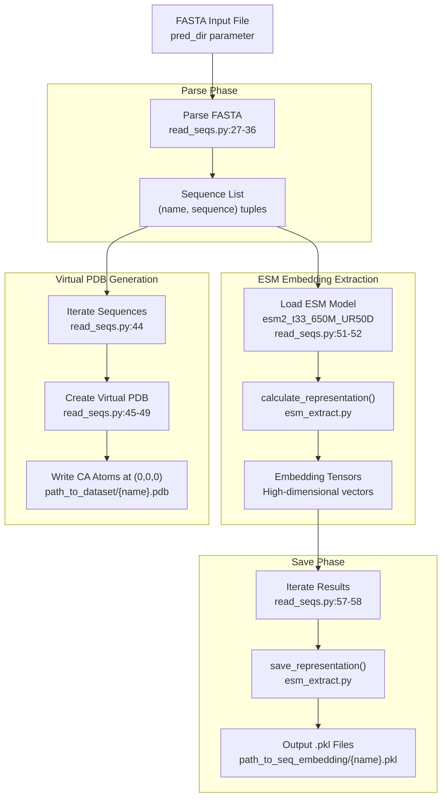
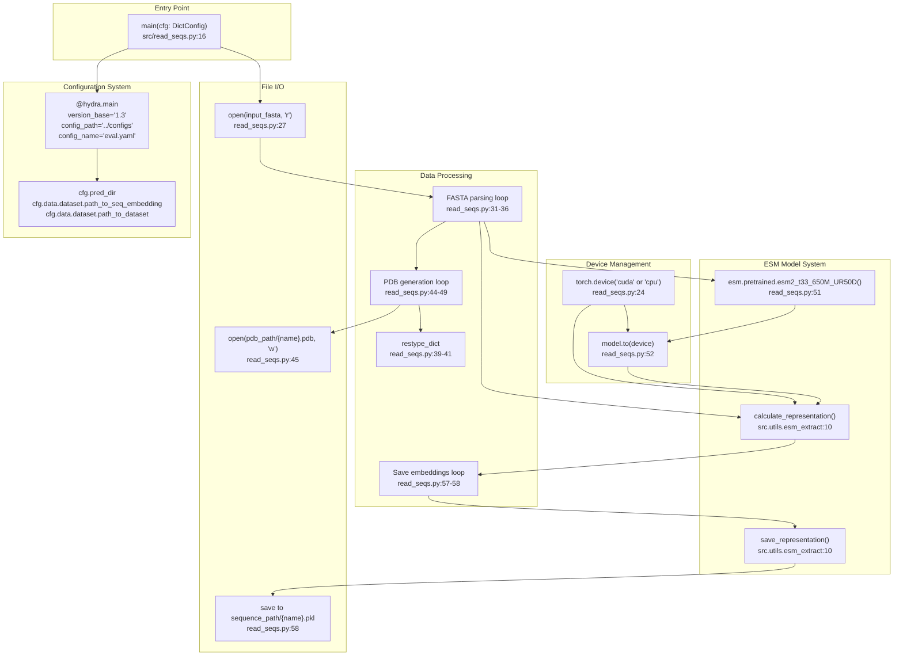

# preprocess_command

> **Relevant source files**
> * [.project-root](https://github.com/Junjie-Zhu/IDPFold/blob/ba40f40c/.project-root)
> * [initialize.py](https://github.com/Junjie-Zhu/IDPFold/blob/ba40f40c/initialize.py)
> * [setup.py](https://github.com/Junjie-Zhu/IDPFold/blob/ba40f40c/setup.py)
> * [src/read_seqs.py](https://github.com/Junjie-Zhu/IDPFold/blob/ba40f40c/src/read_seqs.py)

## Purpose and Scope

The `preprocess_command` CLI command is responsible for converting raw protein sequences in FASTA format into the intermediate representations required by IDPFold's inference pipeline. This command extracts ESM2 language model embeddings and generates virtual PDB files with placeholder coordinates. These preprocessed outputs serve as inputs to the diffusion model during conformational ensemble generation.

For information about running inference with preprocessed data, see [eval_command](/Junjie-Zhu/IDPFold/6.2-eval_command). For details on the embedding extraction process, see [ESM Embedding Extraction](/Junjie-Zhu/IDPFold/7.2-esm-embedding-extraction). For information on virtual PDB file structure, see [Virtual PDB Files](/Junjie-Zhu/IDPFold/7.3-virtual-pdb-files).

---

## Command Definition

The `preprocess_command` is registered as a console script entry point in the package setup, pointing to the `main()` function in `src/read_seqs.py`:

[setup.py L15-L21](https://github.com/Junjie-Zhu/IDPFold/blob/ba40f40c/setup.py#L15-L21)

This registration allows the command to be invoked directly from the terminal after installing the IDPFold package.

**Sources:** [setup.py L15-L21](https://github.com/Junjie-Zhu/IDPFold/blob/ba40f40c/setup.py#L15-L21)

---

## Command Invocation

The command can be executed in two ways:

**Method 1: Using the CLI entry point (after package installation):**

```
preprocess_command pred_dir=/path/to/sequences.fasta
```

**Method 2: Direct Python execution:**

```
python src/read_seqs.py pred_dir=/path/to/sequences.fasta
```

Both methods use Hydra for configuration management, allowing parameters to be overridden via command-line arguments.

**Sources:** [setup.py L19](https://github.com/Junjie-Zhu/IDPFold/blob/ba40f40c/setup.py#L19-L19)

 [src/read_seqs.py L15-L16](https://github.com/Junjie-Zhu/IDPFold/blob/ba40f40c/src/read_seqs.py#L15-L16)

---

## Configuration Parameters

The command is configured through Hydra, using `eval.yaml` as its base configuration file. The following parameters control preprocessing behavior:

| Parameter | Default Source | Description |
| --- | --- | --- |
| `pred_dir` | Command-line required | Path to input FASTA file containing protein sequences |
| `data.dataset.path_to_seq_embedding` | `eval.yaml` | Output directory for `.pkl` embedding files |
| `data.dataset.path_to_dataset` | `eval.yaml` | Output directory for virtual PDB files |

The command reads these configuration values at runtime:

[src/read_seqs.py L21-L23](https://github.com/Junjie-Zhu/IDPFold/blob/ba40f40c/src/read_seqs.py#L21-L23)

**Sources:** [src/read_seqs.py L15-L23](https://github.com/Junjie-Zhu/IDPFold/blob/ba40f40c/src/read_seqs.py#L15-L23)

---

## Input Requirements

### FASTA File Format

The input must be a FASTA-formatted text file containing one or more protein sequences. The file structure follows standard FASTA conventions:

```
>sequence_name_1
MKLLSKQQQSP...
>sequence_name_2
ASEDLKRT...
```

The parser extracts sequence names (excluding the `>` prefix) and their corresponding amino acid sequences:

[src/read_seqs.py L26-L36](https://github.com/Junjie-Zhu/IDPFold/blob/ba40f40c/src/read_seqs.py#L26-L36)

### Supported Amino Acids

The command supports the 20 standard amino acids with single-letter codes. A residue type dictionary maps these codes to three-letter PDB format:

[src/read_seqs.py L39-L41](https://github.com/Junjie-Zhu/IDPFold/blob/ba40f40c/src/read_seqs.py#L39-L41)

**Sources:** [src/read_seqs.py L26-L41](https://github.com/Junjie-Zhu/IDPFold/blob/ba40f40c/src/read_seqs.py#L26-L41)

---

## Processing Workflow



**Workflow Description:**

1. **Parse Phase**: The command reads the FASTA file and extracts sequence names and amino acid strings into a list of tuples [src/read_seqs.py L27-L36](https://github.com/Junjie-Zhu/IDPFold/blob/ba40f40c/src/read_seqs.py#L27-L36)
2. **Virtual PDB Generation**: For each sequence, a PDB file is created with CA (alpha-carbon) atoms positioned at the origin (0, 0, 0). These serve as structural templates [src/read_seqs.py L44-L49](https://github.com/Junjie-Zhu/IDPFold/blob/ba40f40c/src/read_seqs.py#L44-L49)
3. **ESM Model Loading**: The ESM2 language model (`esm2_t33_650M_UR50D`) is loaded onto the available device (GPU if available, otherwise CPU) [src/read_seqs.py L51-L52](https://github.com/Junjie-Zhu/IDPFold/blob/ba40f40c/src/read_seqs.py#L51-L52)
4. **Embedding Extraction**: The `calculate_representation()` function processes all sequences through the ESM model to generate embeddings [src/read_seqs.py L55](https://github.com/Junjie-Zhu/IDPFold/blob/ba40f40c/src/read_seqs.py#L55-L55)
5. **Save Phase**: Each sequence's embeddings are saved to individual pickle files using `save_representation()` [src/read_seqs.py L57-L58](https://github.com/Junjie-Zhu/IDPFold/blob/ba40f40c/src/read_seqs.py#L57-L58)

**Sources:** [src/read_seqs.py L26-L58](https://github.com/Junjie-Zhu/IDPFold/blob/ba40f40c/src/read_seqs.py#L26-L58)

---

## Code Entity Architecture



**Architecture Description:**

The `preprocess_command` is implemented as a Hydra-decorated main function that orchestrates three parallel output streams: virtual PDB file generation, ESM embedding extraction, and embedding persistence. The system uses PyTorch for device management and the ESM library for language model inference.

**Sources:** [src/read_seqs.py L1-L62](https://github.com/Junjie-Zhu/IDPFold/blob/ba40f40c/src/read_seqs.py#L1-L62)

 [setup.py L19](https://github.com/Junjie-Zhu/IDPFold/blob/ba40f40c/setup.py#L19-L19)

---

## Output Files

The command generates two types of output files for each input sequence:

### 1. Virtual PDB Files

**Location:** `{path_to_dataset}/{sequence_name}.pdb`

Virtual PDB files contain CA atoms with placeholder coordinates at the origin. Each line follows PDB format:

```
ATOM      1  CA  ALA A   1      0.000   0.000   0.000  1.00  0.00           C
ATOM      2  CA  SER A   2      0.000   0.000   0.000  1.00  0.00           C
...
```

The generation logic is:

[src/read_seqs.py L45-L49](https://github.com/Junjie-Zhu/IDPFold/blob/ba40f40c/src/read_seqs.py#L45-L49)

These files serve as structural templates for the inference system, providing residue identity and sequence order information without geometric constraints.

### 2. Embedding Pickle Files

**Location:** `{path_to_seq_embedding}/{sequence_name}.pkl`

Pickle files contain the ESM2 model embeddings as serialized Python objects. The embeddings are high-dimensional vector representations (dimension depends on the ESM model layer used) of the protein sequence.

The save operation is performed by:

[src/read_seqs.py L57-L58](https://github.com/Junjie-Zhu/IDPFold/blob/ba40f40c/src/read_seqs.py#L57-L58)

For detailed embedding structure, see [Embedding Files (.pkl)](/Junjie-Zhu/IDPFold/8.2-embedding-files-(.pkl)).

**Sources:** [src/read_seqs.py L44-L58](https://github.com/Junjie-Zhu/IDPFold/blob/ba40f40c/src/read_seqs.py#L44-L58)

---

## ESM Model Details

### Model Architecture

The command uses the `esm2_t33_650M_UR50D` model, which is:

* A 650-million parameter transformer model
* Trained on UniRef50 database
* Has 33 layers
* Produces per-residue embeddings capturing protein sequence context

The model is loaded from the ESM library's pretrained models:

[src/read_seqs.py L51](https://github.com/Junjie-Zhu/IDPFold/blob/ba40f40c/src/read_seqs.py#L51-L51)

### Device Selection

The command automatically selects the computation device based on CUDA availability:

[src/read_seqs.py L24](https://github.com/Junjie-Zhu/IDPFold/blob/ba40f40c/src/read_seqs.py#L24-L24)

The model is then moved to the selected device for inference:

[src/read_seqs.py L52](https://github.com/Junjie-Zhu/IDPFold/blob/ba40f40c/src/read_seqs.py#L52-L52)

**Sources:** [src/read_seqs.py L24](https://github.com/Junjie-Zhu/IDPFold/blob/ba40f40c/src/read_seqs.py#L24-L24)

 [src/read_seqs.py L51-L52](https://github.com/Junjie-Zhu/IDPFold/blob/ba40f40c/src/read_seqs.py#L51-L52)

---

## Batch Processing

The command processes all sequences in the input FASTA file in a single execution. The workflow handles multiple sequences efficiently:

1. All sequences are parsed into a list before processing [src/read_seqs.py L26-L36](https://github.com/Junjie-Zhu/IDPFold/blob/ba40f40c/src/read_seqs.py#L26-L36)
2. Virtual PDB files are generated sequentially [src/read_seqs.py L44-L49](https://github.com/Junjie-Zhu/IDPFold/blob/ba40f40c/src/read_seqs.py#L44-L49)
3. ESM embeddings are calculated for all sequences together [src/read_seqs.py L55](https://github.com/Junjie-Zhu/IDPFold/blob/ba40f40c/src/read_seqs.py#L55-L55)
4. Results are saved individually [src/read_seqs.py L57-L58](https://github.com/Junjie-Zhu/IDPFold/blob/ba40f40c/src/read_seqs.py#L57-L58)

This design minimizes model loading overhead and enables efficient GPU utilization when processing multiple sequences.

**Sources:** [src/read_seqs.py L26-L58](https://github.com/Junjie-Zhu/IDPFold/blob/ba40f40c/src/read_seqs.py#L26-L58)

---

## Utility Functions

The command delegates core functionality to utility functions in `src.utils.esm_extract`:

| Function | Purpose | Called At |
| --- | --- | --- |
| `calculate_representation()` | Extract ESM embeddings from sequences | [src/read_seqs.py L55](https://github.com/Junjie-Zhu/IDPFold/blob/ba40f40c/src/read_seqs.py#L55-L55) |
| `save_representation()` | Serialize embeddings to pickle files | [src/read_seqs.py L58](https://github.com/Junjie-Zhu/IDPFold/blob/ba40f40c/src/read_seqs.py#L58-L58) |

These functions are imported at the module level:

[src/read_seqs.py L10](https://github.com/Junjie-Zhu/IDPFold/blob/ba40f40c/src/read_seqs.py#L10-L10)

For implementation details of these functions, see [ESM Embedding Extraction](/Junjie-Zhu/IDPFold/7.2-esm-embedding-extraction).

**Sources:** [src/read_seqs.py L10](https://github.com/Junjie-Zhu/IDPFold/blob/ba40f40c/src/read_seqs.py#L10-L10)

 [src/read_seqs.py L55](https://github.com/Junjie-Zhu/IDPFold/blob/ba40f40c/src/read_seqs.py#L55-L55)

 [src/read_seqs.py L58](https://github.com/Junjie-Zhu/IDPFold/blob/ba40f40c/src/read_seqs.py#L58-L58)

---

## Error Handling Considerations

The current implementation does not include explicit error handling for:

* Invalid FASTA format
* Unsupported amino acid characters (not in the residue type dictionary)
* File I/O errors
* GPU out-of-memory conditions
* Missing configuration parameters

Users should ensure:

* Input FASTA files are properly formatted
* Sequences contain only standard 20 amino acids
* Output directories exist and are writable (created by `initialize.py`, see [Environment Configuration](/Junjie-Zhu/IDPFold/2.3-environment-configuration))
* Sufficient GPU memory is available for the ESM model

**Sources:** [src/read_seqs.py L1-L62](https://github.com/Junjie-Zhu/IDPFold/blob/ba40f40c/src/read_seqs.py#L1-L62)

---

## Example Usage

### Basic Preprocessing

```
preprocess_command pred_dir=data/my_sequences.fasta
```

This command will:

1. Read sequences from `data/my_sequences.fasta`
2. Write virtual PDB files to the configured `path_to_dataset` directory
3. Extract ESM embeddings and save them to the configured `path_to_seq_embedding` directory

### Overriding Output Paths

```
preprocess_command pred_dir=data/my_sequences.fasta \  data.dataset.path_to_dataset=/custom/pdb/dir \  data.dataset.path_to_seq_embedding=/custom/embedding/dir
```

### Processing with Specific Configuration

```
python src/read_seqs.py --config-name=custom_eval pred_dir=data/sequences.fasta
```

**Sources:** [src/read_seqs.py L15-L16](https://github.com/Junjie-Zhu/IDPFold/blob/ba40f40c/src/read_seqs.py#L15-L16)

 [setup.py L19](https://github.com/Junjie-Zhu/IDPFold/blob/ba40f40c/setup.py#L19-L19)

---

## Integration with IDPFold Pipeline

```mermaid
sequenceDiagram
  participant User
  participant preprocess_command
  participant (src/read_seqs.py)
  participant ESM Model
  participant esm2_t33_650M_UR50D
  participant File System
  participant eval_command
  participant (src/eval.py)

  User->>preprocess_command: "Execute with FASTA file"
  preprocess_command->>File System: "Read pred_dir FASTA"
  File System-->>preprocess_command: "Sequence data"
  preprocess_command->>File System: "Write virtual PDBs
  preprocess_command->>ESM Model: path_to_dataset/{name}.pdb"
  ESM Model-->>preprocess_command: "Load model"
  preprocess_command->>ESM Model: "Model instance"
  ESM Model-->>preprocess_command: "calculate_representation(sequences)"
  preprocess_command->>File System: "Embedding tensors"
  preprocess_command-->>User: "save_representation()
  note over User,(src/eval.py): "Preprocessed files ready for inference"
  User->>eval_command: path_to_seq_embedding/{name}.pkl"
  eval_command->>File System: "Preprocessing complete"
  File System-->>eval_command: "Execute inference"
  eval_command-->>User: "Read .pkl and .pdb files"
```

**Pipeline Integration:**

The `preprocess_command` serves as the first stage in the IDPFold pipeline. Its outputs (.pkl embeddings and virtual PDB files) are consumed by `eval_command` during inference. This separation allows:

1. **Reusability**: Preprocessed embeddings can be used for multiple inference runs with different model checkpoints or parameters
2. **Efficiency**: ESM embedding extraction is computationally expensive and only needs to be performed once per sequence
3. **Debugging**: Each pipeline stage can be tested independently

**Sources:** [src/read_seqs.py L1-L62](https://github.com/Junjie-Zhu/IDPFold/blob/ba40f40c/src/read_seqs.py#L1-L62)

 [setup.py L19](https://github.com/Junjie-Zhu/IDPFold/blob/ba40f40c/setup.py#L19-L19)