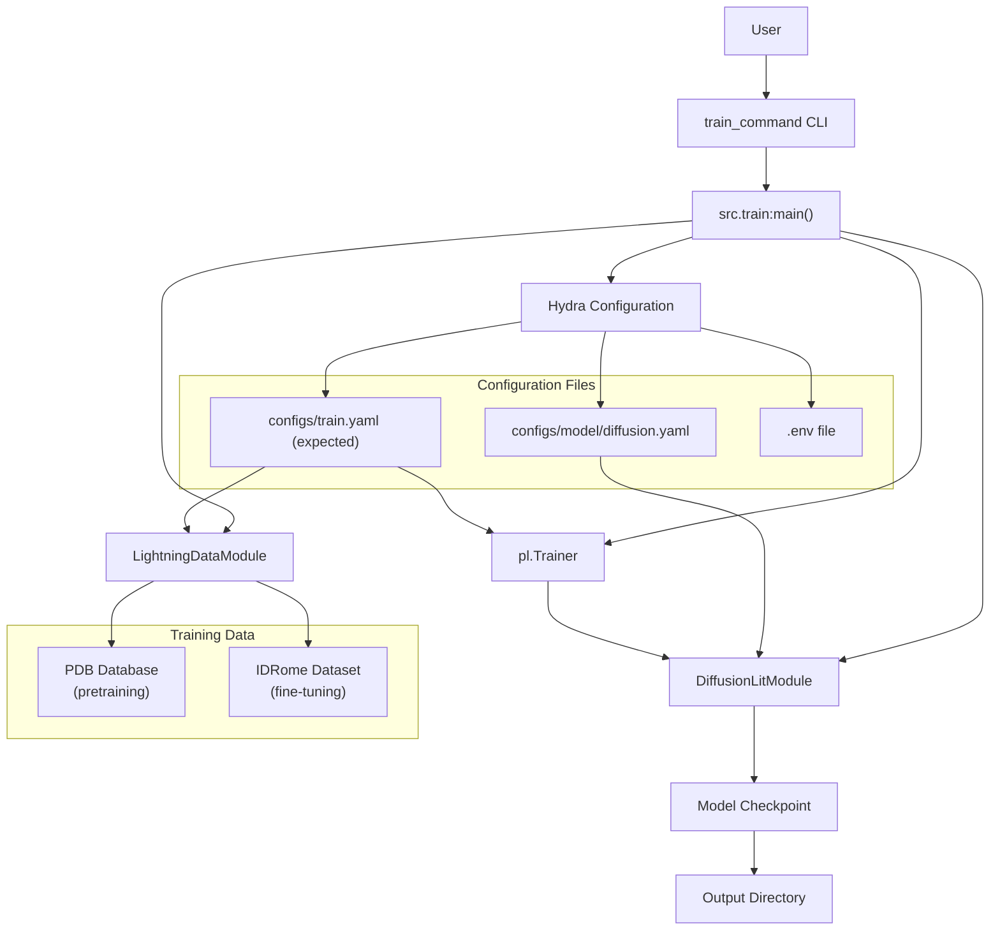
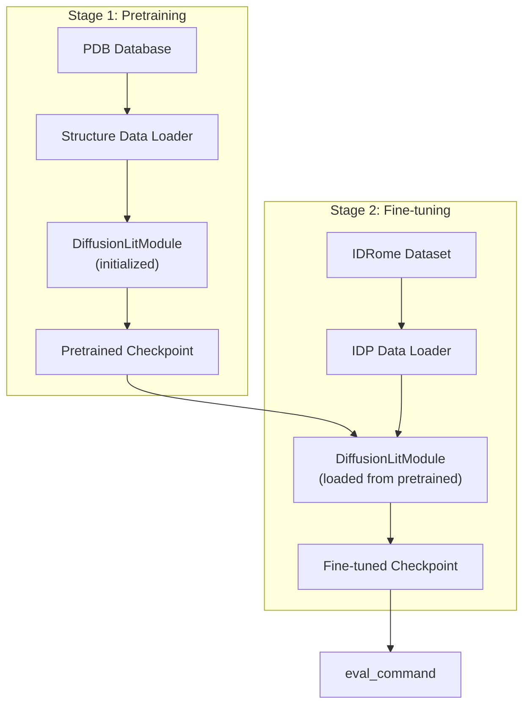
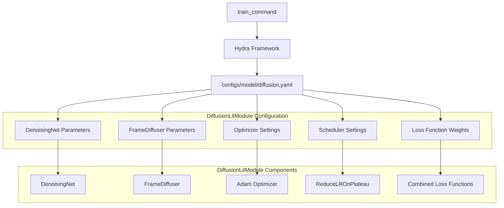
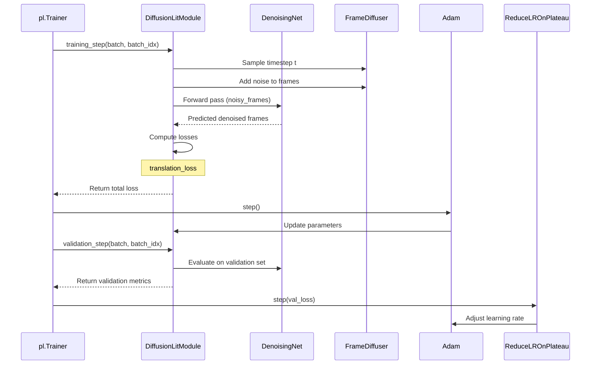
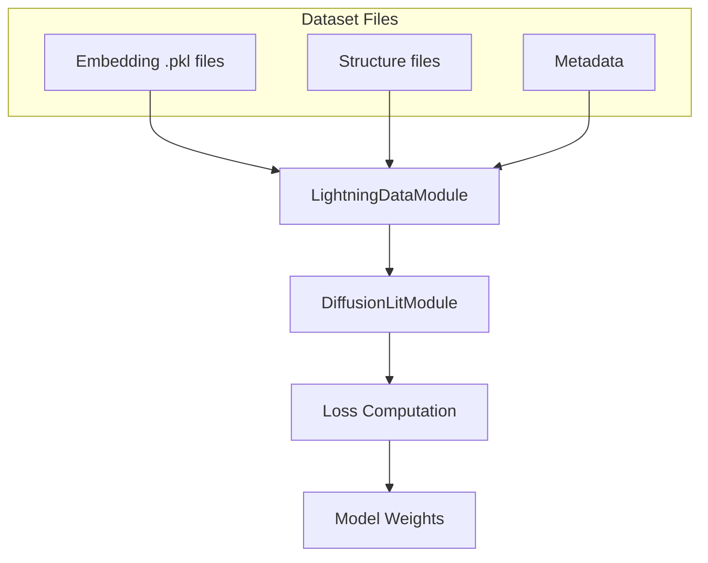
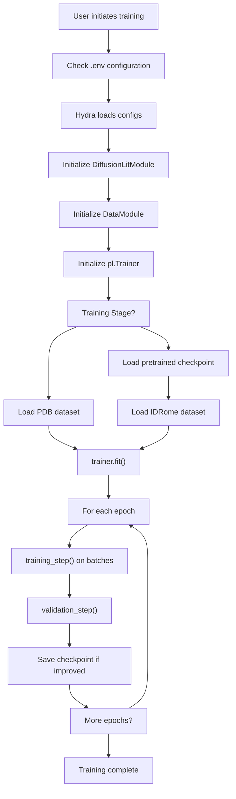

# train_command

> **Relevant source files**
> * [.project-root](https://github.com/Junjie-Zhu/IDPFold/blob/ba40f40c/.project-root)
> * [README.md](https://github.com/Junjie-Zhu/IDPFold/blob/ba40f40c/README.md?plain=1)
> * [data/example.fasta](https://github.com/Junjie-Zhu/IDPFold/blob/ba40f40c/data/example.fasta)
> * [setup.py](https://github.com/Junjie-Zhu/IDPFold/blob/ba40f40c/setup.py)

This page documents the `train_command` CLI entry point, which provides access to the training functionality for IDPFold's diffusion model. The command is intended to train or fine-tune the DiffusionLitModule on protein structure datasets.

**Note**: As of the current version, the training implementation details are incomplete and marked "To be updated" in the codebase. This page documents the command definition and intended workflow based on available configuration files and system architecture.

For information about running inference with trained models, see [eval_command](/Junjie-Zhu/IDPFold/6.2-eval_command). For preprocessing sequences before training, see [preprocess_command](/Junjie-Zhu/IDPFold/6.1-preprocess_command).

---

## Command Definition

The `train_command` is registered as a console script entry point in the package setup configuration at [setup.py L17](https://github.com/Junjie-Zhu/IDPFold/blob/ba40f40c/setup.py#L17-L17)

:

```
"train_command = src.train:main"
```

This entry point maps to the `main()` function in `src/train.py`, which is intended to orchestrate the training process using PyTorch Lightning and Hydra configuration management.

**Sources**: [setup.py L15-L21](https://github.com/Junjie-Zhu/IDPFold/blob/ba40f40c/setup.py#L15-L21)

---

## Current Status

The training functionality is currently under development. The README explicitly states this limitation at [README.md L62-L63](https://github.com/Junjie-Zhu/IDPFold/blob/ba40f40c/README.md?plain=1#L62-L63)

:

```markdown
## Training

To be updated ...
```

The command entry point is defined in the package setup, but the implementation details in `src/train.py` are not fully documented in the available codebase files.

**Sources**: [README.md L62-L63](https://github.com/Junjie-Zhu/IDPFold/blob/ba40f40c/README.md?plain=1#L62-L63)

---

## Intended Training Workflow

Based on the system architecture and configuration files, the intended training workflow follows this structure:

### Training Workflow Diagram



**Sources**: [setup.py L17](https://github.com/Junjie-Zhu/IDPFold/blob/ba40f40c/setup.py#L17-L17)

 Inferred from system architecture diagrams

---

## Expected Usage Pattern

### Basic Training Command

Once implemented, the command would be executed as:

```
train_command
```

Or equivalently:

```
python src/train.py
```

### Configuration Override

Following the Hydra configuration pattern used in `eval_command` (see [eval_command](/Junjie-Zhu/IDPFold/6.2-eval_command)), the training command would support configuration overrides:

```
train_command model.num_timesteps=500 optimizer.lr=0.0001
```

**Sources**: Inferred from [setup.py L17](https://github.com/Junjie-Zhu/IDPFold/blob/ba40f40c/setup.py#L17-L17)

 and Hydra patterns in system architecture

---

## Training Stages

### Training Stage Diagram



Based on the README description at [README.md L14](https://github.com/Junjie-Zhu/IDPFold/blob/ba40f40c/README.md?plain=1#L14-L14)

 IDPFold employs a two-stage training strategy:

1. **Pretraining**: Train the diffusion model on structures from the PDB database to learn general protein structural patterns
2. **Fine-tuning**: Fine-tune the pretrained model on IDP conformational ensembles from the IDRome dataset to specialize in disordered protein structures

**Sources**: [README.md L14](https://github.com/Junjie-Zhu/IDPFold/blob/ba40f40c/README.md?plain=1#L14-L14)

---

## Model Configuration for Training

### Configuration Architecture



The model architecture for training is defined in `configs/model/diffusion.yaml`. Key configuration categories include:

| Configuration Category | Purpose | Key Parameters |
| --- | --- | --- |
| **Network Architecture** | Defines DenoisingNet structure | Embedding dimensions, attention heads, IPA layers |
| **Diffusion Process** | Controls noise schedule | `num_timesteps`, `noise_scale` for R3Diffuser and SO3Diffuser |
| **Optimization** | Training hyperparameters | Adam optimizer with learning rate, betas, weight decay |
| **Learning Rate Schedule** | Adaptive learning rate | ReduceLROnPlateau with patience, factor, min_lr |
| **Loss Functions** | Training objectives | Weights for translation, rotation, backbone, pairwise distance losses |

For detailed parameter specifications, see [Model Configuration Reference](/Junjie-Zhu/IDPFold/5.2-model-configuration-reference).

**Sources**: Inferred from system architecture diagrams and configuration system overview

---

## Training Components

### DiffusionLitModule Training Flow



The `DiffusionLitModule` class serves as the core training component. During training, it implements:

1. **Forward Diffusion**: Add noise to ground truth protein structures according to the diffusion schedule
2. **Denoising Prediction**: Use DenoisingNet to predict the original structure from noisy input
3. **Loss Calculation**: Compute multiple loss terms measuring prediction accuracy
4. **Optimization**: Update model parameters using Adam optimizer
5. **Learning Rate Adjustment**: Apply ReduceLROnPlateau scheduler based on validation performance

For detailed information on the model architecture, see [DiffusionLitModule Overview](/Junjie-Zhu/IDPFold/4.1-diffusionlitmodule-overview). For loss function details, see [Loss Functions](/Junjie-Zhu/IDPFold/4.4-loss-functions).

**Sources**: Inferred from system architecture diagrams

---

## Training Data Requirements

### Expected Data Structure

The training system would require preprocessed data in the following format:

| Data Component | Format | Source |
| --- | --- | --- |
| **Sequence Embeddings** | `.pkl` files with ESM embeddings | Generated by `preprocess_command` |
| **Ground Truth Structures** | Coordinate data (PDB format or tensors) | PDB database for pretraining, IDRome for fine-tuning |
| **Metadata** | Sequence IDs, chain information | Accompanying dataset files |

### Data Loading Pattern



The data loading would follow the PyTorch Lightning DataModule pattern, providing train and validation dataloaders that yield batches containing:

* Sequence embeddings
* Ground truth protein coordinates
* Metadata for tracking and logging

**Sources**: Inferred from preprocessing workflow and system architecture

---

## Environment Configuration

### Required Environment Variables

Training requires proper configuration of data paths in the `.env` file. The initialization script at `initialize.py` sets up these paths:

| Variable | Purpose |
| --- | --- |
| Dataset paths | Location of PDB structures and IDRome ensembles |
| Embedding paths | Directory containing preprocessed ESM embeddings |
| Output paths | Directory for saving checkpoints and logs |

For setup instructions, see [Environment Configuration](/Junjie-Zhu/IDPFold/2.3-environment-configuration).

**Sources**: [README.md L39-L43](https://github.com/Junjie-Zhu/IDPFold/blob/ba40f40c/README.md?plain=1#L39-L43)

---

## Checkpoint Management

### Checkpoint Generation

During training, the system would generate checkpoints containing:

* Model state dictionary (DiffusionLitModule weights)
* Optimizer state
* Learning rate scheduler state
* Training epoch and step counters
* Validation metrics

These checkpoints are subsequently used by `eval_command` for inference. See [Model Checkpoints](/Junjie-Zhu/IDPFold/8.3-model-checkpoints) for checkpoint file structure details.

**Sources**: Inferred from [README.md L50](https://github.com/Junjie-Zhu/IDPFold/blob/ba40f40c/README.md?plain=1#L50-L50)

 and system architecture

---

## Command Execution Flow

### Complete Training Pipeline



**Sources**: Inferred from system architecture and PyTorch Lightning patterns

---

## Implementation Notes

### Current Limitations

1. **Incomplete Implementation**: The training code in `src/train.py` is not fully implemented as indicated by [README.md L62-L63](https://github.com/Junjie-Zhu/IDPFold/blob/ba40f40c/README.md?plain=1#L62-L63)
2. **Missing Configuration**: A `configs/train.yaml` file for training-specific parameters may need to be created
3. **Dataset Access**: The PDB and IDRome datasets mentioned at [README.md L14](https://github.com/Junjie-Zhu/IDPFold/blob/ba40f40c/README.md?plain=1#L14-L14)  require proper setup and data preprocessing

### Expected Components

When fully implemented, `src/train.py` would contain:

* `main()` function decorated with `@hydra.main()` for configuration management
* Instantiation of `DiffusionLitModule` from configuration
* Creation of training and validation DataLoaders
* Setup of PyTorch Lightning `Trainer` with callbacks
* Execution of `trainer.fit()` to run training loop
* Checkpoint saving and logging integration

**Sources**: [README.md L62-L63](https://github.com/Junjie-Zhu/IDPFold/blob/ba40f40c/README.md?plain=1#L62-L63)

 [setup.py L17](https://github.com/Junjie-Zhu/IDPFold/blob/ba40f40c/setup.py#L17-L17)

---

## Related Commands

The training command is part of a three-command CLI suite:

* **[preprocess_command](/Junjie-Zhu/IDPFold/6.1-preprocess_command)**: Extract ESM embeddings from FASTA sequences, preparing input data for training
* **[eval_command](/Junjie-Zhu/IDPFold/6.2-eval_command)**: Run inference using trained checkpoints to generate conformational ensembles
* **train_command** (this page): Train or fine-tune the diffusion model

These commands form a complete workflow from data preparation through model training to prediction generation.

**Sources**: [setup.py L15-L21](https://github.com/Junjie-Zhu/IDPFold/blob/ba40f40c/setup.py#L15-L21)