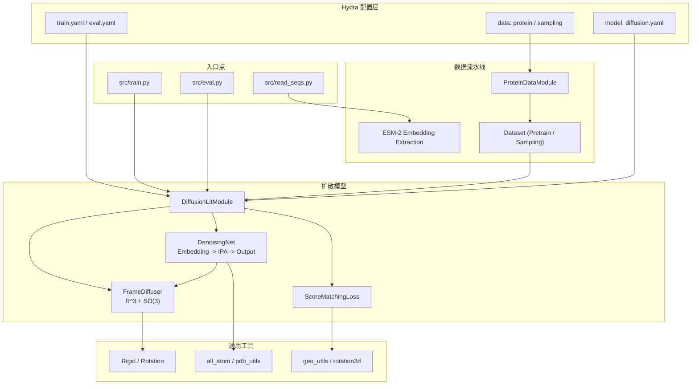
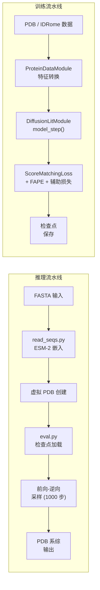

---
slug:1-overview
blog_type:normal
---


**IDPFold** 是一种生成式深度学习模型，能够直接根据氨基酸序列预测内在无序蛋白（IDP）的构象系综。通过利用在 SE(3) 流形上运行的微调扩散模型，IDPFold 无需依赖多序列比对（MSA）或实验数据即可实现准确的系综预测，其表现优于当前最先进的深度学习模型与分子动力学模拟。该模型先在 [PDB](https://www.rcsb.org/) 数据库上进行预训练，随后在来自 [IDRome](https://github.com/KULL-Centre/_2023_Tesei_IDRome) 的构象系综数据上进行微调，从而能够精确采样无序蛋白特有的异质性结构景观。


来源：[README.md](/README.md#L1-L69), [setup.py](/setup.py#L1-L23)

## 核心设计理念

IDPFold 将蛋白质主链构象视为**刚体坐标系**——每个残基由一个旋转矩阵（方向）和一个平移向量（位置）表示，二者共同构成 SE(3) 李群的一个元素。扩散过程利用 R³（平移）和 SO(3)（旋转）上解析定义的前向边际分布，在连续时间内对这些坐标系进行扰动，随后训练神经网络在每个噪声层级预测**分数函数**——即对数边际概率的梯度。在推理阶段，学习到的分数会驱动逆向采样过程，从纯噪声中生成多样化且物理上合理的构象。该方法受到了 [Str2Str](https://github.com/lujiarui/Str2Str) 的启发，并借鉴了 RFdiffusion 的自条件化策略。

来源：[diffusion_module.py](/src/models/diffusion_module.py#L87-L141), [frame.py](/src/models/score/frame.py#L19-L51), [README.md](/README.md#L1-L69)

## 系统架构

本仓库遵循 **Lightning-Hydra 模板**架构，将配置、数据、模型和工具层清晰地解耦。Hydra 通过可组合的 YAML 配置文件管理所有超参数，而 PyTorch Lightning 负责统筹训练、验证和预测循环。模型本身围绕三大核心模块构建：控制 SE(3) 上前向/逆向扩散的 **FrameDiffuser**、作为分数预测主干网络的 **DenoisingNet**，以及结合了平移/旋转分数匹配与辅助结构损失的 **ScoreMatchingLoss** 模块。



来源：[train.py](/src/train.py#L49-L88), [eval.py](/src/eval.py#L53-L98), [diffusion_module.py](/src/models/diffusion_module.py#L63-L100), [diffusion.yaml](/configs/model/diffusion.yaml#L1-L103)

## 仓库结构

代码库被组织为四个顶级目录及若干配置文件。`src/` 目录包含划分为五个包的全部源代码，`configs/` 则存放完整的 Hydra 配置层级。下表概述了各组件的作用：

| 目录 | 用途 | 关键文件 |
|---|---|---|
| `src/models/` | 扩散模型、神经网络及损失函数 | `diffusion_module.py`, `score/{frame,r3,so3}.py`, `net/{denoising_ipa,ipa,layers}.py`, `loss.py` |
| `src/data/` | 数据加载、批处理及数据集定义 | `protein_datamodule.py`, `components/dataset.py` |
| `src/common/` | 共享的几何与蛋白质结构工具 | `rigid_utils.py`, `all_atom.py`, `rotation3d.py`, `pdb_utils.py`, `residue_constants.py` |
| `src/utils/` | 基础设施工具（检查点、日志、ESM 提取） | `checkpoint_utils.py`, `esm_extract.py`, `tensor_utils.py`, `plot_utils.py` |
| `configs/` | 用于模型、数据、训练器、回调、日志的 Hydra YAML 配置 | `train.yaml`, `eval.yaml`, `model/diffusion.yaml`, `data/{protein,sampling}.yaml` |

```
IDPFold/
├── src/
│   ├── models/
│   │   ├── diffusion_module.py    # LightningModule: 训练与推理统筹
│   │   ├── score/                 # SE(3) 扩散: R³ (VPSDE) + SO(3) (IGSO3)
│   │   │   ├── frame.py           # FrameDiffuser: 结合旋转与平移
│   │   │   ├── r3.py              # R³Diffuser: 针对平移的 VPSDE
│   │   │   └── so3.py             # SO3Diffuser: 针对旋转的 IGSO(3)
│   │   ├── net/
│   │   │   ├── denoising_ipa.py   # DenoisingNet + EmbeddingModule
│   │   │   ├── ipa.py             # 不变点注意力 (TranslationIPA)
│   │   │   └── layers.py          # 线性层、转换、扭转角头部、主链更新
│   │   └── loss.py                # 分数匹配 + FAPE + 辅助损失
│   ├── data/
│   │   ├── protein_datamodule.py  # 用于蛋白质数据集的 LightningDataModule
│   │   └── components/dataset.py  # 预训练与采样数据集类
│   ├── common/                    # 刚体代数、全原子坐标、PDB I/O
│   └── utils/                     # ESM 提取、检查点、日志、绘图
├── configs/                       # Hydra 配置层级
├── data/example.fasta             # 用于推理的示例 IDP 序列
├── environment.yml                # Conda 环境配置
└── setup.py                       # 包安装 + CLI 入口点
```

来源：[README.md](/README.md#L1-L69), [setup.py](/setup.py#L1-L23), [environment.yml](/environment.yml#L1-L50)

## 技术栈

IDPFold 构建于一系列经过精心挑选的框架之上，兼顾了研究的灵活性与工程的严谨性。**PyTorch + Lightning** 组合提供了分布式训练与检查点管理能力，而 **Hydra** 则支持在无需修改代码的情况下实现完全可组合的配置。**Biopython**、**OpenMM** 和 **MDTraj** 等蛋白质特定依赖负责处理结构生物学操作，**ESM-2**（通过 `fair-esm`）则生成用于条件化扩散模型的序列嵌入。

| 类别 | 技术 | 在 IDPFold 中的作用 |
|---|---|---|
| 深度学习框架 | PyTorch 1.11 + CUDA 11.3 | 张量计算与自动求导 |
| 训练编排 | PyTorch Lightning | 训练循环、检查点、分布式训练 |
| 配置管理 | Hydra + OmegaConf | 可组合 YAML 配置、CLI 覆盖、多重运行 |
| 序列嵌入 | ESM-2 (650M 参数) | 用于提取序列特征的预训练语言模型 |
| 几何深度学习 | PyTorch Geometric + PyTorch Scatter/Sparse | 图操作（可选工具） |
| 结构生物学 | Biopython, OpenMM, MDTraj, PDBFixer | PDB 解析、结构处理 |
| 项目模板 | Lightning-Hydra-Template | 仓库脚手架、日志、工具集 |

<CgxTip>Conda 环境将 PyTorch 1.11 与 CUDA 11.3 进行了版本锁定——这种版本搭配至关重要，因为 PyTorch Geometric 扩展（scatter、sparse、cluster）是基于这一确切组合编译的。如果你需要修改环境，请确保所有与 PyTorch 相邻的包保持兼容。</CgxTip>

来源：[environment.yml](/environment.yml#L1-L50), [setup.py](/setup.py#L1-L23), [read_seqs.py](/src/read_seqs.py#L46-L48)

## 模型概览

默认的模型配置（定义在 `configs/model/diffusion.yaml` 中）展示了 IDPFold 的完整参数化设定。下表概述了关键的架构与扩散超参数：

| 组件 | 参数 | 默认值 | 描述 |
|---|---|---|---|
| **嵌入** | `node_embed_size` | 256 | 单体（节点）表示维度 |
| | `edge_embed_size` | 128 | 成对（边）表示维度 |
| | `self_conditioning` | true | RFDiffusion 风格的自条件化技巧 |
| **IPA 主干** | `no_ipa_blocks` | 4 | 不变点注意力块的数量 |
| | `no_heads` | 8 | 每个 IPA 块的注意力头数 |
| | `no_qk_points` / `no_v_points` | 8 / 12 | 每个头部的查询/键点数与值点数 |
| | `transformer_num_layers` | 2 | 成对堆栈中的 Transformer 层数 |
| **R³ 扩散** | `min_b` / `max_b` | 0.1 / 20.0 | VPSDE 噪声调度边界 |
| | `coordinate_scaling` | 0.1 | 埃至模型单位的缩放比例 |
| **SO(3) 扩散** | `min_sigma` / `max_sigma` | 0.1 / 1.5 | IGSO(3) 噪声调度边界 |
| | `schedule` | logarithmic | Sigma 调度函数 |
| **训练** | `optimizer` | Adam (lr=1e-4) | 带有 ReduceLROnPlateau 的 Adam |
| **推理** | `n_replica` | 192 | 每个 delta-T 生成的构象数 |
| | `num_timesteps` | 1000 | 离散化的逆向步数 |
| | `backward_only` | true | 跳过前向扰动，从先验分布采样 |

来源：[diffusion.yaml](/configs/model/diffusion.yaml#L1-L103)

## 工作流概述

IDPFold 支持两种主要工作流——**推理**（生成构象系综）与**训练**（在 PDB 上预训练或在 IDP 系综上微调）。推理流水线可通过提供的检查点完全运行，而训练文档在 README 中标注为“待更新”。



推理命令包含两个步骤：首先通过 `read_seqs.py` 提取 ESM-2 序列嵌入，随后在指定检查点路径的情况下运行 `eval.py` 执行扩散采样。`DiffusionLitModule` 中的 `predict_step` 方法统筹了完整的前向-逆向采样过程，为每个 delta-T 值生成 `n_replica` 个构象，并将其保存为合并的多模型 PDB 文件。

来源：[README.md](/README.md#L31-L55), [read_seqs.py](/src/read_seqs.py#L27-L63), [eval.py](/src/eval.py#L53-L98), [diffusion_module.py](/src/models/diffusion_module.py#L204-L380)

## 环境初始化

在运行任何流水线之前，IDPFold 需要一个 `.env` 文件来定义数据目录的路径。`initialize.py` 脚本会自动创建该文件及相应的目录结构：

| 环境变量 | 默认路径 | 用途 |
|---|---|---|
| `CACHE_DIR` | `.cache/` | 缓存的 IGSO(3) 分数表 |
| `TRAIN_DATA` | `data/pdb/` | 训练用 PDB 结构 |
| `EMBEDDING` | `data/embeddings/` | ESM-2 序列嵌入 (`.pkl`) |
| `TEST_DATA` | `data/test_pdb/` | 推理输入结构 |

在项目根目录下运行 `python initialize.py` 会创建上述四个目录，并将绝对路径写入 `.env` 文件，该文件随后会在运行时被 `rootutils` 包加载。

来源：[initialize.py](/initialize.py#L1-L22), [README.md](/README.md#L26-L29)

## 建议阅读路径

本文档的结构旨在引导你从初始设置逐步深入理解底层架构。推荐的路径遵循受 Diátaxis 启发的发展脉络：从实际设置入手，接着探索理论基础，最后剖析实现细节。

**入门指南**——从这里开始，在你的序列上运行 IDPFold：

1. [快速开始](2-quick-start)——生成首个 IDP 系综的极简步骤
2. [环境配置](3-environment-setup)——详细的 conda、ESM 及包安装说明
3. [推理流水线](4-inference-pipeline)——端到端的采样工作流演示

**深入探究**——理解 IDPFold 背后的数学原理与工程设计：

4. [架构概览](5-architecture-overview)——高层系统设计与数据流
5. *SE(3) 流形上的扩散* → [刚体表示](6-rigid-body-representation), [R3 平移扩散器](7-r3-translation-diffuser), [SO3 旋转扩散器](8-so3-rotation-diffuser), [坐标系扩散器整合](9-frame-diffuser-integration)
6. *神经网络主干* → [嵌入模块设计](10-embedding-module-design), [不变点注意力](11-invariant-point-attention), [去噪网络流水线](12-denoising-network-pipeline)
7. *训练与损失* → [训练循环与模型步骤](13-training-loop-and-model-step), [分数匹配损失](14-score-matching-loss), [FAPE 与辅助损失](15-fape-and-auxiliary-losses)
8. *数据流水线* → [蛋白质数据集与转换](16-protein-dataset-and-transforms), [ESM 序列嵌入提取](17-esm-sequence-embedding-extraction), [数据模块与批处理](18-data-module-and-batching)
9. *推理与采样* → [前向-逆向采样策略](19-forward-backward-sampling-strategy), [检查点加载](20-checkpoint-loading), [PDB 输出生成](21-pdb-output-generation)
10. *配置系统* → [Hydra 配置层级](22-hydra-configuration-hierarchy), [模型配置参考](23-model-configuration-reference), [实验与训练器配置](24-experiment-and-trainer-configs)
11. [工具模块概览](25-utility-modules-overview)

<CgxTip>如果你的目的仅仅是生成构象系综，“入门指南”部分（第 1–4 页）即可提供所需的全部信息。当你打算修改模型架构、适配训练流水线，或希望深入理解用于蛋白质结构预测的 SE(3) 扩散数学基础时，推荐阅读“深入探究”部分。</CgxTip>