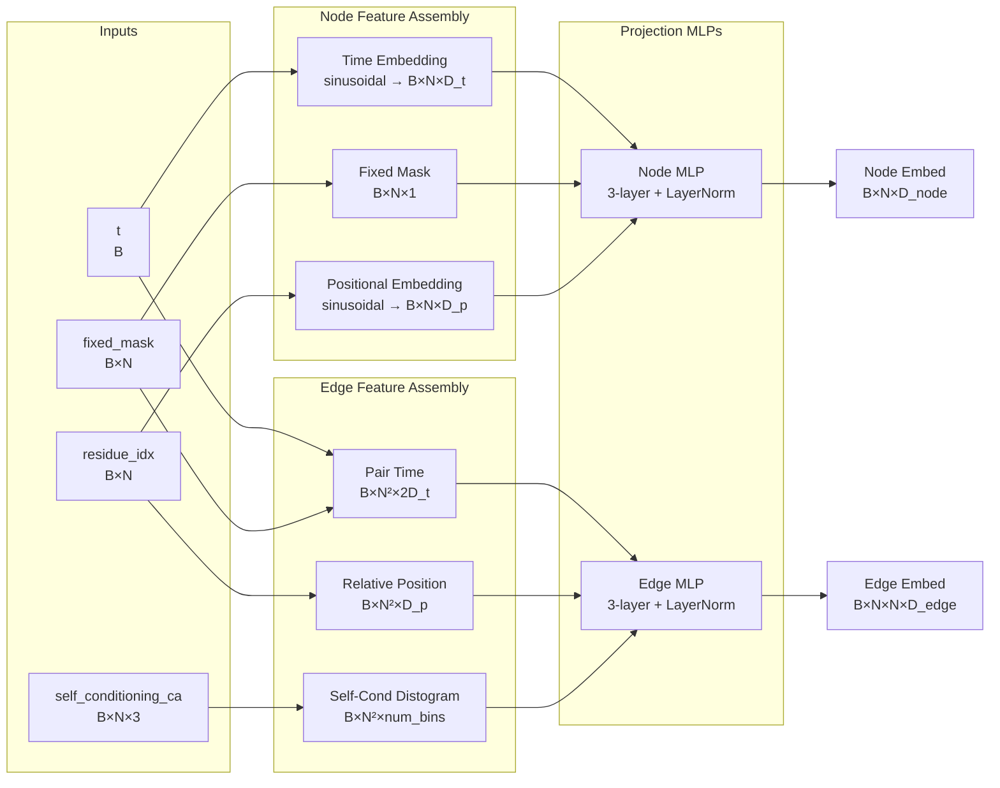

---
slug:10-embedding-module-design
blog_type:normal
---


嵌入模块是 IDPFold 去噪网络的入口，负责将原始的扩散时间步、残基位置和自条件信号转换为结构化的节点与边表示，供下游的 IPA 主干网络使用。网络对当前扩散状态“已知”的所有信息——当前所处的时间步、哪些残基具有柔性、先前预测的结构位置——在进入任何注意力机制之前，都会先经过此模块处理。

## 架构概述

`EmbeddingModule` 类定义于 `denoising_ipa.py` 中，并在 `DenoisingNet` 容器内被实例化为 `self.embedder`。其 `forward` 方法接收四个输入：`residue_idx`、`t`、`fixed_mask` 和 `self_conditioning_ca`，并产出两个输出：形状为 `[B, N, D_node]` 的**节点嵌入**和形状为 `[B, N, N, D_edge]` 的**边嵌入**。这些输出会直接馈入 `TranslationIPA` 主干网络，该网络会在迭代 IPA 模块的同时，同步进行刚体坐标系的更新，从而对这两种表示进行精细化。

该模块的设计遵循**并行路径模式**：节点级特征（时间、位置、固定掩码）和边级特征（相对位置、自条件距离图）独立构建，随后通过各自独立的多层感知机投射到最终的嵌入空间。这种分离设计呼应了 AlphaFold2 架构中确立的单一/配对表示的二分法，其中节点嵌入携带单个残基的上下文信息，而边嵌入则编码残基对之间的几何关系。



来源：[denoising_ipa.py](src/models/net/denoising_ipa.py#L44-L139), [diffusion.yaml](configs/model/diffusion.yaml#L24-L36)

## 输入规格

嵌入模块接收四个输入，这些输入由上游的 `DiffusionLitModule.model_step` 方法和数据管线组装而成。理解它们的来源与语义对于追踪信息流至关重要。

| 输入 | 形状 | 来源 | 语义含义 |
|---|---|---|---|
| `residue_idx` | `[B, N]` | `ProteinFeatureTransform.patch_feats` | 从零开始索引的残基位置，支持链断裂 |
| `t` | `[B]` | `model_step` 随机采样 | `[min_t, 1.0]` 范围内的连续扩散时间 |
| `fixed_mask` | `[B, N]` | `ProteinFeatureTransform.patch_feats` | 二值掩码：0 = 柔性，1 = 固定（motif） |
| `self_conditioning_ca` | `[B, N, 3]` | `model_step` 自条件循环 | 上一次去噪过程产生的 C-alpha 坐标 |

`residue_idx` 在数据转换阶段通过减去最小残基索引计算得出，这种处理方式能够应对多链蛋白质中 PDB 编号在链间重置的情况。`t` 值在 `[min_t, 1.0]`（其中 `min_t = 1e-2`）范围内均匀采样，以防止在扩散边界处出现数值不稳定。`self_conditioning_ca` 输入仅在启用自条件机制时（训练期间有 50% 的概率）才会被填充；否则它将全为零，并在数据转换阶段完成初始化。

来源：[denoising_ipa.py](src/models/net/denoising_ipa.py#L99-L137), [diffusion_module.py](src/models/diffusion_module.py#L82-L107), [dataset.py](src/data/components/dataset.py#L74-L83)

## 时间步嵌入

扩散时间采用改编自 DDPM 代码库的**正弦嵌入**进行编码。`get_timestep_embedding` 函数接收一批标量时间值，并利用几何间隔频率的成对正弦和余弦函数将其投射到高维空间中。

嵌入公式首先计算 `emb = exp(arange(half_dim) * -log(max_len)/(half_dim-1))` 以生成频带，随后应用 `sin(t * max_len * frequencies)` 和 `cos(t * max_len * frequencies)` 并沿特征维度进行拼接。`max_len` 参数被设为 10000，从而在各个时间步上提供了宽广的动态范围。输出维度为 `t_embed_size`，默认值为配置中的 `init_embed_size = 32`。

```python
def get_timestep_embedding(timesteps, embedding_dim, max_len=10000):
    half_dim = embedding_dim // 2
    emb = math.log(max_len) / (half_dim - 1)
    emb = torch.exp(torch.arange(half_dim, ...) * -emb)
    emb = timesteps.float()[:, None] * emb[None, :]
    emb = torch.cat([torch.sin(emb), torch.cos(emb)], dim=1)
    return emb
```

时间嵌入会被广播至所有残基：形状为 `[B, D_t]` 的 `t_embed` 会被平铺为 `[B, N, D_t]`。至关重要的是，`fixed_mask` 会与此时间嵌入进行拼接，生成形状为 `[B, N, D_t + 1]` 的节点级输入。这种拼接使得网络能够在每个时间步区分应保持固定的残基（motif 位置）与正在进行主动去噪的残基。

对于边特征，单个残基的时间嵌入会被复制并排列成对称的配对表示：每个位置 `(i, j)` 接收 `t_embed[i]` 和 `t_embed[j]` 的拼接结果，从而产生维度为 `2 * (D_t + 1)` 的配对特征。

来源：[denoising_ipa.py](src/models/net/denoising_ipa.py#L14-L27), [denoising_ipa.py](src/models/net/denoising_ipa.py#L106-L122)

## 位置嵌入

残基位置使用作用于整数索引的独立正弦函数 `get_positional_embedding` 进行编码。与使用对数频率间隔的时间步嵌入不同，该函数使用由 `max_len = 2056` 控制的线性频率间隔，以匹配预期的最大序列长度。

对于节点特征，绝对残基索引 `residue_idx` 被直接嵌入为 `[B, N, D_p]`，其中 `D_p = pos_embed_size = init_embed_size = 32`。对于边特征，则计算并嵌入**相对序列偏移量** `residue_idx[i] - residue_idx[j]`，生成 `[B, N², D_p]`。这种相对编码捕捉了残基对之间的序列距离，对于网络学习局部与长程结构依赖关系至关重要。

相对偏移方法能够自然地处理链断裂：当两个残基属于不同的链时，它们的索引差会很大（反映出实际的 PDB 编号间隙），从而向网络发出信号，表明它们之间不存在序列上的相邻关系。

来源：[denoising_ipy.py](src/models/net/denoising_ipa.py#L3-L13), [denoising_ipa.py](src/models/net/denoising_ipa.py#L124-L131)

## 自条件距离图

借鉴自 RFDiffusion 的自条件机制，在相同的时间步向网络提供来自**先前去噪过程**的结构信息。在训练期间，模型有 50% 的概率执行一次无梯度的前向传播，并存储预测的 C-alpha 位置。随后，这些坐标被转换为分桶的距离矩阵（距离图），并作为附加的边特征输入到主前向传播中。

距离图由 `geo_utils.py` 中的 `calc_distogram` 函数计算得出，该函数计算所有 C-alpha 原子之间的欧几里得距离，并将其分入 `num_bins = 22` 个类别中，范围跨度从 `min_bin = 1e-5` 到 `max_bin = 20.0` 埃。分桶采用半开区间 `[lower, upper)`，最后一个区间延伸至无穷大。

```python
def calc_distogram(pos, min_bin, max_bin, num_bins):
    dists_2d = torch.linalg.norm(
        pos[..., :, None, :] - pos[..., None, :, :], axis=-1
    )[..., None]
    lower = torch.linspace(min_bin, max_bin, num_bins, device=pos.device)
    upper = torch.cat([lower[1:], lower.new_tensor([1e8])], dim=-1)
    distogram = ((dists_2d > lower) * (dists_2d < upper)).type(pos.dtype)
    return distogram
```

生成的距离图形状为 `[B, N, N, num_bins]`，并被重塑为 `[B, N², num_bins]` 以便与其他边特征拼接。当未启用自条件机制或不存在先前的预测时，`self_conditioning_ca` 输入为零，从而生成全零的距离图，边 MLP 能够通过学习妥善处理这种情况。

<CgxTip>仅当 `self_conditioning=True` 时，自条件距离图才会向边输入增加 `num_bins`（默认为 22）个维度。在计算 `edge_in_dim` 时必须考虑到这一点——`EmbeddingModule.__init__` 会根据此标志有条件地将 `edge_in_dim` 扩展 `num_bins` 的大小。</CgxTip>

来源：[denoising_ipa.py](src/models/net/denoising_ipa.py#L58-L68), [denoising_ipa.py](src/models/net/denoising_ipa.py#L133-L137), [geo_utils.py](src/common/geo_utils.py#L49-L60), [diffusion_module.py](src/models/diffusion_module.py#L98-L101)

## 投影多层感知机

在组装好原始特征向量后，节点和边表示会通过专用的 3 层 MLP 投射到目标嵌入维度。这些 MLP 共享相同的架构：`Linear → ReLU → Linear → ReLU → Linear → LayerNorm`。

### 维度核算

输入维度在 `__init__` 中通过累加各特征来源的贡献计算得出：

| 特征来源 | 节点贡献维度 | 边贡献维度 |
|---|---|---|
| 时间嵌入 + 固定掩码 | `t_embed_size + 1` | `2 × (t_embed_size + 1)` |
| 位置嵌入 | `pos_embed_size` | `pos_embed_size` |
| 自条件距离图 | — | `num_bins`（条件性） |
| **总计（含自条件）** | `D_t + 1 + D_p` | `2(D_t + 1) + D_p + num_bins` |

在默认配置下（`init_embed_size = 32`、`num_bins = 22`），节点输入维度为 `32 + 1 + 32 = 65`，边输入维度为 `2 × 33 + 32 + 22 = 120`。

输出维度分别为 `node_embed_size = 256` 和 `edge_embed_size = 128`，与下游 `TranslationIPA` 主干网络的 `c_s` 和 `c_z` 参数相匹配。最后的 `LayerNorm` 用于在嵌入进入同样在内部应用了自身层归一化的 IPA 模块之前，稳定嵌入的分布。

### 权重初始化

投影 MLP 使用 PyTorch 默认的 `nn.Linear` 初始化方式（Kaiming 均匀分布），这与 IPA 主干网络中 `Linear` 层使用的自定义初始化方案不同。主干网络的层定义于 `layers.py` 中，支持截断正态分布的初始化变体（LeCun、He、Glorot）以及专门的方案，如 `gating`（权重=0，偏置=1）和 `final`（权重=0，偏置=0）。这种差异是刻意设计的：嵌入 MLP 充当通用特征投影器，而主干网络中的线性层则根据其特定角色（注意力投射、门控、主干更新）量身定制初始化方案。

来源：[denoising_ipa.py](src/models/net/denoising_ipa.py#L52-L97), [layers.py](src/models/net/layers.py#L65-L117), [diffusion.yaml](configs/model/diffusion.yaml#L24-L36)

## 与序列嵌入的整合

除了内部生成的特征外，`DenoisingNet.forward` 方法还可以选择将**预计算的 ESM-2 序列嵌入**拼接到节点表示中。当批次数据包含 `seq_emb` 键（由数据集从预提取的 ESM-2 表示中填充）时，节点嵌入将被扩展：

```python
if 'seq_emb' in batch.keys():
    node_embed = torch.cat([node_embed, batch['seq_emb']], dim=-1)
    node_embed = F.relu(self.linear(node_embed))
```

ESM-2 嵌入是使用 `esm2_t33_650M_UR50D`（6.5 亿参数，第 33 层）提取的，生成维度为 1280 的单残基表示。拼接后，线性层（`nn.Linear(1536, 256)`）将组合后的 `256 + 1280 = 1536` 维向量重新投射回 `256` 维，并接上一个 ReLU 激活函数。该投射层直接定义在 `DenoisingNet.__init__` 中，而非 `EmbeddingModule` 中，从而保持了嵌入模块专注于处理扩散特定特征的初衷。

这种设计意味着 `EmbeddingModule` 产出 256 维的节点嵌入，随后在 `DenoisingNet` 层级融合序列信息。序列嵌入提供了扩散过程本身无法捕捉的进化与共进化信号，从而将结构预测锚定在具有生物学意义的构象上。

来源：[denoising_ipa.py](src/models/net/denoising_ipa.py#L143-L166), [esm_extract.py](src/utils/esm_extract.py#L43-L60), [dataset.py](src/data/components/dataset.py#L262-L274)

## 配置参考

嵌入模块可通过 Hydra 配置系统进行完全配置。下表将各 YAML 参数映射至其对应的构造函数参数及作用：

| 参数 | 默认值 | 构造函数参数 | 作用 |
|---|---|---|---|
| `init_embed_size` | 32 | `init_embed_size` | 时间和位置嵌入的维度（`t_embed_size`、`pos_embed_size`） |
| `node_embed_size` | 256 | `node_embed_size` | 输出节点嵌入维度，必须与转换器中的 `c_s` 匹配 |
| `edge_embed_size` | 128 | `edge_embed_size` | 输出边嵌入维度，必须与转换器中的 `c_z` 匹配 |
| `num_bins` | 22 | `num_bins` | 用于自条件的距离图分桶数 |
| `min_bin` | 1e-5 | `min_bin` | 第一个距离图桶的下界 |
| `max_bin` | 20.0 | `max_bin` | 最后一个有限距离图桶的上界 |
| `self_conditioning` | true | `self_conditioning` | 是否在边特征中包含自条件距离图 |

<CgxTip>`node_embed_size` 和 `edge_embed_size` 的值必须与转换器的 `c_s` 和 `c_z` 参数完全匹配。配置系统隐式地强制执行了这一点——两者都在 `diffusion.yaml` 的同一个 `net` 键下设置——但如果仅手动修改其中一项而未更新另一项，将在运行时导致维度不匹配的错误。</CgxTip>

来源：[diffusion.yaml](configs/model/diffusion.yaml#L24-L36), [denoising_ipa.py](src/models/net/denoising_ipa.py#L44-L68)

## 信息流总结

贯穿嵌入模块的完整数据流可以被视为一系列张量转换过程，每一步都为表示添加几何或时间上下文：

1. **时间编码**：标量 `t ∈ [0,1]` → 正弦嵌入 `[B, D_t]` → 平铺为 `[B, N, D_t]` → 与固定掩码拼接 → `[B, N, D_t + 1]`
2. **位置编码**：整数 `residue_idx` → 正弦嵌入 `[B, N, D_p]`（绝对）和 `[B, N², D_p]`（相对）
3. **自条件**：C-alpha 坐标 `[B, N, 3]`` → 成对距离 → 分桶距离图 `[B, N², num_bins]`
4. **投影**：拼接后的特征 → 3 层 MLP + LayerNorm → 最终的节点 `[B, N, 256]` 和边 `[B, N, N, 128]` 嵌入
5. **序列融合**（在 `DenoisingNet` 中）：节点嵌入与 ESM-2 `[B, N, 1280]` 拼接 → 线性投射回 `[B, N, 256]`

随后，节点和边嵌入流入[去噪网络管线](12-denoising-network-pipeline)，在此处 `TranslationIPA` 主干网络通过 IPA 注意力机制、Transformer 层以及主干更新对其进行迭代式的精细化。[不变点注意力](11-invariant-point-attention)页面详细介绍了这些嵌入在每个 IPA 模块中是如何被消耗利用的。