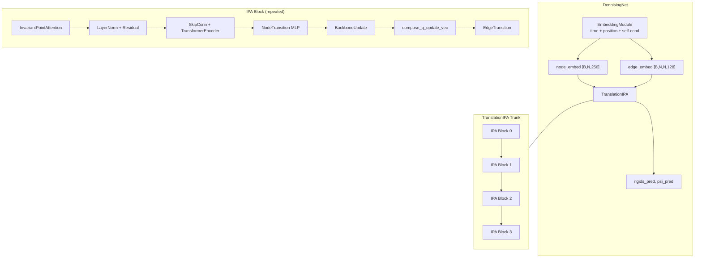
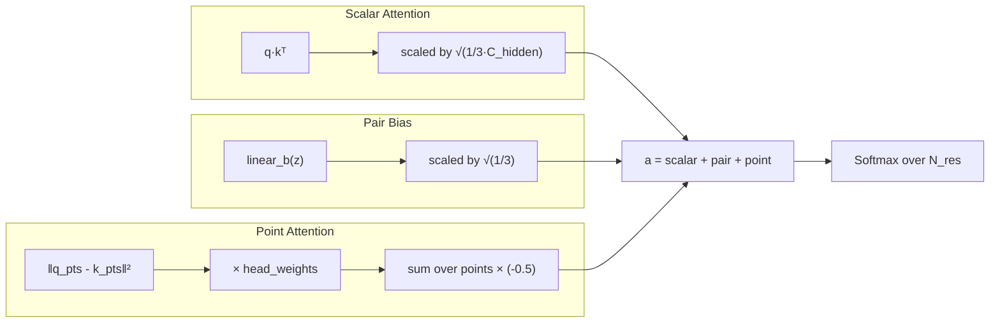
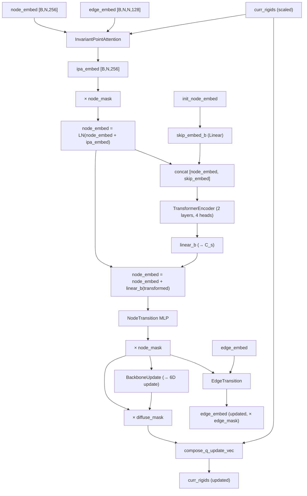

---
slug:11-invariant-point-attention
blog_type:normal
---


不变点注意力（Invariant Point Attention, IPA）是 IDPFold 去噪网络核心的几何推理引擎。与纯粹在序列空间或特征空间中运作的标准注意力机制不同，IPA 作用于 **3D 局部坐标系**（刚体），生成的表征兼具 **SE(3)-等变性**（即当输入结构发生全局旋转或平移时，注意力输出也会随之进行正确的变换）与 **不变性**（即注意力权重本身仅取决于坐标系内部的几何关系）。本页面将深入剖析 IDPFold 中 IPA 的具体实现，涵盖核心的 `InvariantPointAttention` 模块、堆叠 IPA 块与辅助子层的 `TranslationIPA` 主体网络，以及使等变性得以有效实现的 `Rigid` 几何基元。

## 架构位置

IPA 位于去噪流水线的核心位置。数据流向如下：`DenoisingNet` 接收受扩散扰动的刚体帧和嵌入特征（来自序列、时间和位置编码的节点特征；来自对表征的边特征），随后将其交由 `TranslationIPA` 处理。后者在多个 IPA 块中迭代地优化单序列（节点）表征和刚体帧。



每个 IPA 块执行一个完整周期：3D 点注意力计算 → 残差更新 → 标准序列域 Transformer → 前馈过渡层 → 刚体更新。最后一个块省略了边过渡层，因为不再需要进一步更新边特征。

来源：[denoising_ipa.py](/src/models/net/denoising_ipa.py#L162-L221), [ipa.py](/src/models/net/ipa.py#L273-L390), [diffusion.yaml](/configs/model/diffusion.yaml#L16-L40)

## 刚体基元

IPA 的等变性保证依赖于 `Rigid` 类，该类将 SE(3) 变换封装为一对参数：一个 `Rotation`（内部以 3×3 旋转矩阵或单位四元数形式存储）和一个平移向量。该类被设计为行为类似 PyTorch 张量——支持索引、维度扩展、设备转移和批处理操作——同时隐藏了双重表示格式的复杂性。

IPA 调用的关键方法如下：

| 方法 | 签名 | 在 IPA 中的作用 |
|--------|-----------|-------------|
| `from_tensor_7` | `tensor[*, 7] → Rigid` | 从扩散状态反序列化 7D 帧（四元数 + 平移） |
| `apply` | `pts[*, 3] → pts[*, 3]` | 将局部坐标系下的点转换为全局坐标，用于生成查询/键/值点 |
| `invert_apply` | `pts[*, 3] → pts[*, 3]` | 将全局注意力输出点转换回局部坐标系 |
| `compose_q_update_vec` | `vec[*, 6], mask → Rigid` | 应用带掩码的逐残基刚体更新（3 个四元数增量 + 3 个平移增量） |
| `apply_trans_fn` | `fn → Rigid` | 缩放/反缩放平移量，用于坐标归一化 |

<CgxTip>

`Rigid` 类强制旋转和平移均使用全精度（`float32`），而不受 AMP（自动混合精度）设置的影响。这是一个刻意的设计选择：在旋转矩阵上使用混合精度算术可能会破坏其正交性，而在 `float16` 下进行四元数归一化会引入不可接受的漂移。手写的 `rot_matmul` 和 `rot_vec_mul` 函数（它们避免使用 `torch.matmul` 以防 AMP 自动降精度）进一步强化了这一不变性。

</CgxTip>

`from_tensor_7` 方法将 7 元素张量拆分为四元数 `[..., :4]` 和平移量 `[..., 4:]`，从而构建一个四元数格式的 `Rotation`。`apply` 方法执行 `R·p + t`（先旋转后平移），而 `invert_apply` 方法执行 `Rᵀ·(p − t)`（逆变换）。这两个操作是 IPA 的几何基石：局部点在注意力计算前被转换到全局坐标系，而注意力输出点在计算后被转换回局部坐标系，从而确保特征表征不受每个残基坐标系绝对位姿的影响。

来源：[rigid_utils.py](/src/common/rigid_utils.py#L856-L866), [rigid_utils.py](/src/common/rigid_utils.py#L1107-L1133), [rigid_utils.py](/src/common/rigid_utils.py#L1217-L1233), [rigid_utils.py](/src/common/rigid_utils.py#L1042-L1066), [rigid_utils.py](/src/common/rigid_utils.py#L1335-L1346), [rigid_utils.py](/src/common/rigid_utils.py#L24-L108)

## InvariantPointAttention：核心机制

`InvariantPointAttention` 类实现了最初在 AlphaFold2 中作为算法 22 提出的注意力机制，改编自 OpenFold。其前向传播接收四个输入：单表征 `s [*, N_res, C_s]`、对表征 `z [*, N_res, N_res, C_z]`、`Rigid` 对象 `r [*, N_res]` 和残基 `mask [*, N_res]`。它产生一个单表征更新 `s [*, N_res, C_s]`。

### 初始化与参数布局

该模块构建了六个线性投影层和一个可学习的头权重参数：

| 参数 | 输入 → 输出形状 | 用途 |
|-----------|---------------------|---------|
| `linear_q` | `C_s → H·C_hidden` | 标量查询投影 |
| `linear_kv` | `C_s → 2·H·C_hidden` | 标量键 + 值投影（在前向传播中拆分） |
| `linear_q_points` | `C_s → H·P_q·3` | 局部坐标系中的查询点坐标 |
| `linear_kv_points` | `C_s → H·(P_q+P_v)·3` | 局部坐标系中的键 + 值点坐标 |
| `linear_b` | `C_z → H` | 来自边表征的对偏置 |
| `down_z` | `C_z → C_z//4` | 对聚合输出的降维 |
| `head_weights` | `H` (可学习，由 softplus 门控) | 基于点距离注意力的每个头的权重 |
| `linear_out` | `H·(C_z//4 + C_hidden + 4·P_v) → C_s` | 最终输出投影 |

头权重通过 `ipa_point_weights_init_` 初始化，将其填充为 `softplus⁻¹(1) ≈ 0.5413`，确保在经过 softplus 激活后初始值为 1。`linear_out` 层使用 `"final"` 初始化（权重为零，偏置为零），这意味着 IPA 的贡献初始为零，并从零开始学习。

来源：[ipa.py](/src/models/net/ipa.py#L31-L100), [layers.py](/src/models/net/layers.py#L64-L124)

### 前向传播：三重注意力通道

前向传播通过**三个并行通道**——标量、点和配对——计算注意力，然后将它们的输出拼接为一个单一表征更新。

**步骤 1 — 标量激活**：单表征 `s` 通过 `linear_q` 和 `linear_kv` 投影为查询 `q [*, N, H, C_hidden]` 和键/值 `k, v [*, N, H, C_hidden]`。同时，点坐标也被投影：`linear_q_points` 为每个残基生成 `H·P_q` 个局部坐标系下的 3D 点，然后通过 `r[..., None].apply(q_pts)` 转换为全局坐标。`[..., None]` 索引对 Rigid 进行升维，以便在头维度和点维度上进行广播。键点和值点经历相同的投影（`linear_kv_points`）和变换。

**步骤 2 — 注意力分数聚合**：三个分数项被相加：



标量注意力 `a_scalar = q·kᵀ · √(1/(3·C_hidden))` 是具有特定缩放因子的标准点积注意力。对偏置 `a_pair = linear_b(z) · √(1/3)` 将配对级别的信息直接注入到注意力 logits 中。点注意力是 IPA 的几何核心：对于每一对残基 (i, j)、每个头 h 和每个查询/键点 p，它在全局坐标系中计算平方欧几里得距离 `‖q_pts[i,h,p] − k_pts[j,h,p]‖²`，对点求和，乘以 softplus 门控的头权重（缩放因子为 `√(1/(3·(P_q·9/2)))`），并应用 `−0.5` 的因子。这产生了一个负平方距离核：3D 点距离较近的残基将获得更高的注意力。

关键的不变性属性：由于查询点和键点都通过相同的刚体被转换到了**全局坐标系**，且注意力分数仅取决于它们的**相对距离**，因此对所有坐标系同时应用全局 SE(3) 变换将保持所有成对距离不变——即注意力权重是不变的。

来源：[ipa.py](/src/models/net/ipa.py#L129-L217)

**步骤 3 — 输出计算**：注意力权重被应用于三个输出源：

1. **标量值**：`o = softmax(a) · v` 产生 `[*, N, H, C_hidden]`，然后被展平为 `[*, N, H·C_hidden]`。
2. **值点**：注意力权重在全局坐标系中聚合值点 `v_pts`，产生 `o_pt [*, N, H, P_v, 3]`。然后通过 `r[..., None, None].invert_apply(o_pt)` 将其**逆变换**回局部坐标系。从局部坐标系中的点提取两类特征：原始坐标 `o_pt [*, N, H·P_v, 3]`（每个坐标分量单独解绑）及其范数 `o_pt_dists [*, N, H·P_v]`（到局部坐标系原点的距离，计算为 `√(Σo_pt² + ε)`）。
3. **对聚合**：注意力权重对降维后的对表征进行转置聚合：`o_pair = aᵀ · down_z(z)`，产生 `[*, N, H·C_z//4]`。

所有特征被拼接——`[o, o_pt_components, o_pt_norm_feats, o_pair]`——并通过 `linear_out` 投影，产生最终的单表征更新 `s [*, N, C_s]`。

输出拼接的维度为 `H·(C_z//4 + C_hidden + 4·P_v)`。在默认配置下（`H=8, C_z//4=32, C_hidden=256, P_v=12`），该值为 `8·(32 + 256 + 48) = 2688`，随后被投影回 `C_s=256`。

来源：[ipa.py](/src/models/net/ipa.py#L219-L270)

## TranslationIPA：堆叠的 IPA 主体网络

`TranslationIPA` 类将 IPA 注意力块封装为一个完整的迭代优化主体网络。它实例化了 `no_ipa_blocks` 次重复的完整更新周期，每次更新包含一个 IPA 模块、层归一化、一个标准 Transformer 编码器、一个节点过渡 MLP、一个主链更新模块，以及（除最后一个块外的）一个边过渡层。

### 坐标缩放

在进入主循环之前，刚体帧会按 `coordinate_scaling`（默认为 `0.1`）进行缩放，该操作仅作用于平移分量：

```python
self.scale_rigids = lambda x: x.apply_trans_fn(self.scale_pos)
```

这将平移幅度归一化到一个更适合神经网络训练的范围内。主体网络运行完成后，帧将被反缩放回原状：`self.unscale_rigids(curr_rigids)`。旋转不受此操作影响。

来源：[ipa.py](/src/models/net/ipa.py#L290-L294), [ipa.py](/src/models/net/ipa.py#L338-L381)

### 单块数据流

每个块 `b` 执行以下序列：



**IPA + 残差 + 层归一化**：IPA 输出由 `node_mask` 掩码，并通过层归一化加到当前单表征上：`node_embed = LayerNorm(node_embed + ipa_embed)`。

**跳跃连接 + Transformer**：初始节点嵌入（在主体网络中进行任何 IPA 更新之前）通过 `skip_embed_b`（一个零初始化的线性层，输出维度为 `skip_embed_size=64`）进行投影，与更新后的节点嵌入拼接，并由一个具有 2 层和 4 个头的标准 `nn.TransformerEncoder` 处理。这为长距离序列级通信提供了一个通道，补充了 IPA 的空间推理能力。Transformer 的输出被投影回 `C_s` 并作为残差添加。

**节点过渡**：一个 3 层 MLP（`Linear → ReLU → Linear → ReLU → Linear`），带有残差连接和层归一化，提供逐残基的非线性处理。

**主链更新**：`BackboneUpdate` 模块是一个单线性层 `C_s → 6`，产生一个 6D 更新向量。前 3 个分量代表四元数更新（通过 `compose_q_update_vec` 应用于 `(1, x, y, z)`），后 3 个分量代表平移更新。至关重要的是，该更新由 `diffuse_mask = (1 − fixed_mask) × node_mask` 门控，这意味着**模体残基（即 `fixed_mask=1` 的部分）不会获得帧更新**——它们的刚体在整个主体网络中保持固定。这对于部分结构必须保持不变的条件结构生成任务至关重要。

**边过渡**：在节点更新之后（且在下一个 IPA 块之前），对表征通过 `EdgeTransition` 进行更新，该模块通过外积拼接和 2 层 MLP 主体网络将更新后的节点嵌入注入到边特征中。

来源：[ipa.py](/src/models/net/ipa.py#L298-L374), [layers.py](/src/models/net/layers.py#L128-L185), [layers.py](/src/models/net/layers.py#L216-L241)

### 扭转角预测与输出

在最后一个块之后，累积的 `node_embed` 被传递给 `TorsionAngleHead` 以预测 ψ (psi) 主链扭转角。`TorsionAngleHead` 是一个 3 层 MLP，后接 L2 归一化，产生 `[*, N, 2]` 输出（正弦/余弦表示）。预测的扭转角与优化后的刚体帧结合，随后被 `compute_backbone` 用于生成完整的 atom37 和 atom14 表征。

来源：[ipa.py](/src/models/net/ipa.py#L330-L330), [ipa.py](/src/models/net/ipa.py#L376-L389), [layers.py](/src/models/net/layers.py#L188-L213), [denoising_ipa.py](/src/models/net/denoising_ipa.py#L200-L221)

## 配置参考

IPA 主体网络的默认超参数在模型配置中定义：

| 参数 | 默认值 | 描述 |
|-----------|---------|-------------|
| `c_s` | 256 | 单（节点）表征通道维度 |
| `c_z` | 128 | 对（边）表征通道维度 |
| `coordinate_scaling` | 0.1 | 用于数值稳定性的平移缩放因子 |
| `no_ipa_blocks` | 4 | 迭代 IPA 优化块的数量 |
| `skip_embed_size` | 64 | 跳跃连接投影的维度 |
| `transformer_num_heads` | 4 | 辅助 TransformerEncoder 中的头数 |
| `transformer_num_layers` | 2 | 辅助 TransformerEncoder 中的层数 |
| `c_hidden` | 256 | 每个 IPA 注意力头的隐藏维度 |
| `no_heads` | 8 | IPA 注意力头的数量 |
| `no_qk_points` | 8 | 每个头的查询/键点数 |
| `no_v_points` | 12 | 每个头的值点数 |
| `dropout` | 0.0 | Dropout 率（默认禁用） |

<CgxTip>

比率 `no_v_points / no_qk_points = 12/8 = 1.5` 遵循了 AlphaFold2 的惯例，即值点数量多于查询/键点，从而提供更丰富的几何输出表征。输出特征维度 `H·(C_z//4 + C_hidden + 4·P_v) = 8·(32+256+48) = 2688` 主要由标量通道（`2048`）和点范数特征（`384`）构成，对聚合贡献了 `256`。

</CgxTip>

来源：[diffusion.yaml](/configs/model/diffusion.yaml#L27-L40)

## 设计原理与等变性分析

IPA 的不变性和等变性属性源于在输入和输出端应用 `Rigid` 变换之间的精确相互作用：

**注意力权重不变性**：查询点 `q_pts` 和键点 `k_pts` 都通过各自残基的刚体 `r_i` 和 `r_j` 转换到了全局坐标系。注意力分数取决于 `‖R_i·q + t_i − R_j·k − t_j‖²`。在全局变换 `g = (R_g, t_g)` 下，所有坐标系变为 `r'_i = g ∘ r_i`，因此分数变为 `‖R_g·(R_i·q + t_i) − R_g·(R_j·k + t_j) + t_g − t_g‖² = ‖R_g·(displacement)‖² = ‖displacement‖²`（因为旋转矩阵保持范数不变）。因此，注意力权重对全局 SE(3) 变换是**严格不变的**。

**输出等变性**：值点在全局坐标系中聚合，然后通过 `r_i.invert_apply` 逆变换回局部坐标系。在全局变换下，全局坐标系中的聚合结果会发生变化，但逆变换会进行补偿，从而产生**不变的**（而不仅仅是等变的）局部坐标系输出。标量和配对输出本质上是与坐标系无关的。因此，整体的单一表征更新 `s` 是 **SE(3)-不变的**。

然而，刚体帧本身通过 `compose_q_update_vec` 更新，该操作是 **SE(3)-等变**的：输入帧的全局变换会产生输出帧的相应变换。这种分离——用于注意力的不变特征与用于结构的等变更新——正是使 IPA 既具有强大表达能力又符合几何原理的架构准则。

来源：[ipa.py](/src/models/net/ipa.py#L146-L270), [rigid_utils.py](/src/common/rigid_utils.py#L658-L684), [rigid_utils.py](/src/common/rigid_utils.py#L1042-L1066)

## 与扩散框架的关系

在 IDPFold 的扩散框架中，IPA 充当得分网络——即在扩散时间 `t` 预测从带噪刚体帧回归到天然结构的去噪方向的组件。`TranslationIPA` 主体网络接收受扩散扰动的帧 `rigids_t`（来自 SE(3) 扩散过程的前向边缘分布），通过迭代 IPA 块对其进行优化，并输出更新后的帧 `out_rigids` 及预测的扭转角。这些输出随后被 `FrameDiffuser.score` 方法转换为得分函数，并由 `ScoreMatchingLoss` 与真实得分进行评估比对。

`TranslationIPA` 内部的固定掩码机制（通过 `diffuse_mask` 门控主链更新）直接支持**条件生成**：被标记为“固定”的残基（例如已知的模体）在整个主体网络中保留其输入的刚体，而网络则学习仅对周围的柔性区域进行去噪。

有关 IPA 如何融入去噪网络流水线和训练循环的更广泛背景，请参阅 [去噪网络流水线](12-denoising-network-pipeline) 和 [训练循环与模型步长](13-training-loop-and-model-step)。有关刚体表示的几何基础，请参阅 [刚体表示](6-rigid-body-representation)。