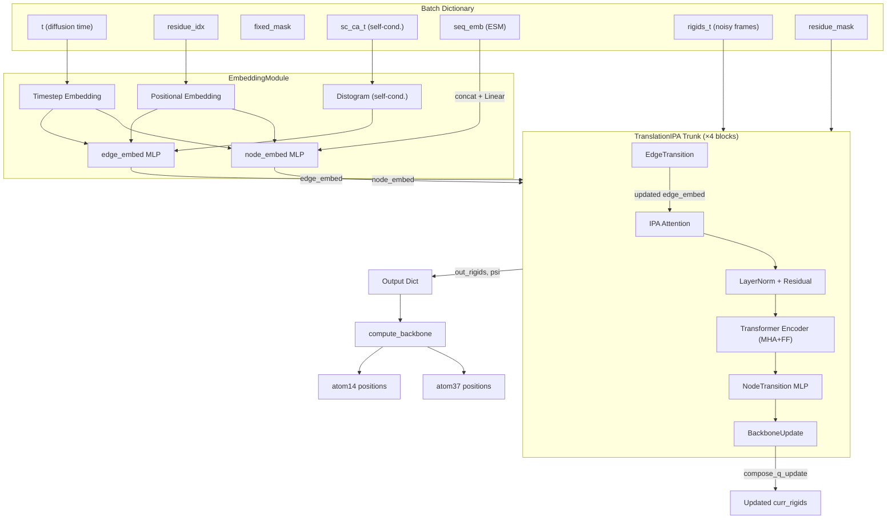
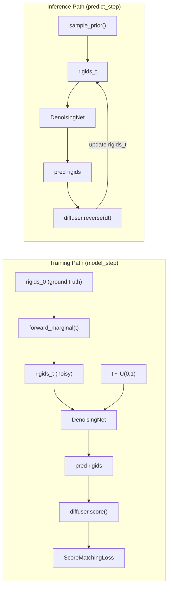

---
slug:12-denoising-network-pipeline
blog_type:normal
---

去噪网络是 IDPFold 的核心神经骨架 —— 该模块接收时间 $t$ 的含噪扩散刚体帧，并预测去噪后的结构 $X_0$。它通过迭代式 IPA 模块融合时间条件、序列嵌入和几何注意力，在 SE(3) 流形上对骨架帧进行细化。本页将追溯从原始批处理张量到预测原子位置的完整前向传播路径，分别探讨各个架构组件的独立功能与协同机制。

## 架构概述

在最顶层，去噪流水线由 `DenoisingNet` 统筹，它组合了两个子模块：一个是 `EmbeddingModule`，根据扩散时间、序列索引和自条件特征生成节点（单一）和边（成对）表示；另一个是 `TranslationIPA` 主干网络，通过堆叠的 IPA 模块迭代细化刚体帧。输出是一组去噪后的刚体变换和预测的扭转角，由此可重建全原子级坐标。

`DenoisingNet` 类本身刻意保持精简 —— 它将所有繁重的计算委托给其两个子模块，仅处理序列嵌入的整合以及骨架坐标的后处理。

来源：[denoising_ipa.py](/src/models/net/denoising_ipa.py#L162-L221), [diffusion.yaml](/configs/model/diffusion.yaml#L16-L40)

## EmbeddingModule：时间与结构编码

`EmbeddingModule` 将标量扩散时间 $t \in [0,1]$、序列索引、固定残基掩码以及可选的自条件 C-alpha 位置转换为密集的节点和边特征向量。这是网络首次接收条件信号的地方，这些信号告知它*施加了多少噪声*以及*哪些残基*可以自由移动。

### 时间步嵌入

扩散时间 $t$ 采用 DDPM 代码库中的正弦方案进行编码。`get_timestep_embedding` 函数将 $t$ 乘以一个大常数 (10000)，然后在 `embedding_dim // 2` 个频率上应用几何频率分解，并拼接正弦和余弦通道。对于默认为 32 的 `init_embed_size`，每个样本会生成一个 32 维的时间嵌入。

该时间嵌入在所有残基上进行平铺，生成逐残基特征，并与 `fixed_mask`（motif/固定残基的二值指示器）拼接，生成大小为 `t_embed_size + 1 = 33` 的节点输入维度。对于边特征，残基 $i$ 和 $j$ 的时间嵌入被拼接起来，得到 `2 * (t_embed_size + 1) = 66`。

### 位置嵌入

序列位置通过 `get_positional_embedding` 进行编码，该函数对节点特征使用绝对残基索引，对边特征使用*相对*序列偏移量 $|i - j|$ 应用标准的正余弦位置编码。两者均使用相同的 `init_embed_size = 32` 维输出。

### 自条件距离图

当启用 `self_conditioning`（默认情况）时，该模块接收来自先前去噪过程的 C-alpha 坐标，并通过 `calc_distogram` 计算分箱距离矩阵（距离图）。此距离图具有 `num_bins = 22` 个通道，跨越从 `min_bin = 1e-5` 到 `max_bin = 20.0` Å 的距离，为边特征输入增加 22 个维度。这与 RFDiffusion 中使用的自条件技巧相同，即训练模型以自身先前的预测作为条件（在训练期间以 50% 的概率随机应用）。

### 投影 MLP

节点和边特征均通过三层 MLP（Linear → ReLU → Linear → ReLU → Linear → LayerNorm）投影到其目标维度：

| 特征 | 输入维度 | 输出维度 |
|---------|-----------|------------|
| 节点    | 33 + 32 = 65 | 256 |
| 边    | 66 + 32 + 22 = 120 | 128 |

最终的 `forward` 返回形状为 `[B, N, 256]` 的 `node_embed` 和形状为 `[B, N, N, 128]` 的 `edge_embed`。

来源：[denoising_ipa.py](/src/models/net/denoising_ipa.py#L13-L159), [geo_utils.py](/src/common/geo_utils.py#L44-L56), [diffusion.yaml](/configs/model/diffusion.yaml#L18-L26)

## 序列嵌入整合

`EmbeddingModule` 生成初始节点特征后，`DenoisingNet.forward` 会检查批处理中是否存在预计算的 ESM 序列嵌入（`seq_emb`）。如果存在，它会沿着特征维度将其拼接到节点嵌入上，并通过一个 `Linear(1536, 256)` 层进行投影，随后接 ReLU 激活。1536 的输入维度对应于 ESM-2 的逐残基嵌入大小。此投影确保感知序列的节点表示匹配 IPA 主干所期望的 `c_s = 256` 通道维度。

然后，节点和边嵌入分别由 `residue_mask` 及其外积进行掩码处理，在进入 IPA 模块之前将填充位置置零。

来源：[denoising_ipa.py](/src/models/net/denoising_ipa.py#L189-L196), [diffusion_module.py](/src/models/diffusion_module.py#L126-L138)

## TranslationIPA：迭代式帧细化

`TranslationIPA` 模块是核心计算引擎。它接收节点嵌入、边嵌入和含噪输入帧 `rigids_t`，然后在 `no_ipa_blocks = 4` 个模块上迭代细化刚体变换。每个模块执行一轮完整的 IPA 注意力、基于 Transformer 的消息传递、过渡 MLP 以及骨架更新循环。

### 坐标缩放

在进入主干网络之前，输入刚体帧会按 `coordinate_scaling = 0.1` 进行缩放。这种将平移量乘以一个小常数的做法，使 IPA 点距离保持在数值有利的范围内，并在输出时进行反转（取消缩放）。旋转不受影响，因为缩放仅通过 `apply_trans_fn` 应用于平移分量。

### 单模块结构

4 个 IPA 模块中的每一个都包含以下子模块，并存储在以模块索引为键的 `ModuleDict` 中：

| 子模块 | 类 | 用途 |
|------------|-------|---------|
| `ipa_{b}` | `InvariantPointAttention` | 基于 3D 点的几何注意力 |
| `ipa_ln_{b}` | `nn.LayerNorm` | 对 IPA 输出进行归一化 + 残差连接 |
| `skip_embed_{b}` | `Linear(c_s, 64)` | 投影初始节点嵌入以用于跳跃连接 |
| `transformer_{b}` | `nn.TransformerEncoder` | 标准 MHA + 前馈网络（2 层，4 头） |
| `linear_{b}` | `Linear(320, 256)` | 将 Transformer 输出投影回 c_s |
| `node_transition_{b}` | `NodeTransition` | 带 LayerNorm 的 3 层残差 MLP |
| `bb_update_{b}` | `BackboneUpdate` | 预测每个残基的 6 自由度刚体更新 |
| `edge_transition_{b}` | `EdgeTransition` | 更新成对表示（仅限模块 0–2） |

单个模块的前向传播过程如下：

1. **IPA 注意力**：`InvariantPointAttention` 结合标量注意力（基于节点特征）和几何点注意力（基于从当前刚体帧导出的 3D 查询/键/值点），计算单一表示的更新。
2. **残差 + LayerNorm**：`node_embed = LayerNorm(node_embed + ipa_embed)`，并应用掩码。
3. **跳跃连接 + Transformer**：初始节点嵌入通过 `skip_embed` 投影到 64 维，与当前节点嵌入拼接（得到 320 = 256 + 64 维），并由一个 4 头的 2 层 `TransformerEncoder` 处理。Transformer 的输出被投影回 256 维并以残差形式相加。
4. **节点过渡**：一个带残差连接和 LayerNorm 的 3 层 MLP（`Linear → ReLU → Linear → ReLU → Linear`）。
5. **骨架更新**：`BackboneUpdate` 为每个残基预测一个 6 分量的更新向量（3 个用于旋转四元数更新，3 个用于平移更新）。此更新*仅应用于扩散残基*（即 `fixed_mask = 0` 处），使用 `compose_q_update_vec` 将当前刚体与预测的增量进行组合。
6. **边过渡**（仅限模块 0–2）：`EdgeTransition` 通过瓶颈 MLP 将节点特征融合到成对表示中，为下一个模块更新边嵌入。

<CgxTip>骨架更新由 `diffuse_mask = (1 - fixed_mask) * residue_mask` 进行掩码处理，这意味着固定 残基永远不会获得帧更新。这对于条件生成任务至关重要，因为在这些任务中，部分结构必须保持固定，而其余部分则进行去噪。</CgxTip>

来源：[ipa.py](/src/models/net/ipa.py#L273-L390), [layers.py](/src/models/net/layers.py#L128-L241), [diffusion.yaml](/configs/model/diffusion.yaml#L27-L40)

## InvariantPointAttention：3D 几何注意力

`InvariantPointAttention` 模块（改编自 OpenFold 对 AlphaFold2 算法 22 的实现）是每个 IPA 模块的几何推理核心。它将三种注意力信号 —— 标量、边偏置和基于 3D 点的信号 —— 结合为一个统一的注意力更新。

### 注意力得分构成

头 $h$ 的总注意力 logit $a_{ij}^h$ 是三项之和：

$$a_{ij}^h = \frac{1}{\sqrt{3 \cdot c_{\text{hidden}}}} \mathbf{q}_i^h \cdot \mathbf{k}_j^h + \frac{1}{\sqrt{3}} b_{ij}^h - \frac{1}{2} \sum_{p=1}^{P_q} w_h \| \mathbf{Q}_{ip}^h - \mathbf{K}_{jp}^h \|^2$$

其中 $\mathbf{q}, \mathbf{k}$ 是标量查询/键投影，$b$ 是来自边表示的边偏置项，最后一项测量查询点 $\mathbf{Q}$ 和键点 $\mathbf{K}$ 之间的平方 3D 距离，两者均通过当前刚体 $r_i$ 转换到每个残基的局部坐标系中。头权重 $w_h$ 初始化为 1 的 softplus 逆函数值 (≈0.5413)，以确保初始贡献不为零。

### 值聚合

经过 softmax 归一化后，输出由按每个头拼接的三个来源组成：

| 输出组件 | 每头形状 | 来源 |
|-----------------|----------------|--------|
| 标量值 | $C_{\text{hidden}} = 256$ | 标准注意力加权值向量 |
| 点值 (3D 坐标) | $P_v \times 3 = 36$ | 注意力加权的 3D 值点，逆变换至局部坐标系 |
| 点范数 | $P_v = 12$ | 输出点的 L2 范数（不变距离特征） |
| 成对聚合 | $C_z / 4 = 32$ | 注意力加权的下采样成对特征 |

这些组件被拼接起来（每个头总计 $256 + 36 + 12 + 32 = 336$，乘以 8 个头 = 2688），并通过 `linear_out` 投影回 $C_s = 256$。

来源：[ipa.py](/src/models/net/ipa.py#L31-L270), [diffusion.yaml](/configs/model/diffusion.yaml#L33-L39)

## 支持层细节

### BackboneUpdate

一个带有 `"final"` 初始化（权重初始置零）的 `Linear(c_s, 6)` 层。6 维输出编码了一个四元数-向量更新（3 个分量用于通过 `quat_multiply_by_vec` 进行旋转，3 个用于平移），通过 `compose_q_update_vec` 应用，将现有的刚体变换与预测的增量进行组合。`"final"` 初始化确保在训练开始时，骨架更新近似于恒等变换，为帧细化提供稳定的起点。

### TorsionAngleHead

在所有 IPA 模块完成后，`TorsionAngleHead` 根据最终的节点表示预测骨架 psi 角（sin/cos 对）。它使用一个 3 层 MLP，随后进行线性投影至 `n_torsion_angles * 2 = 2` 维，然后对输出进行 L2 归一化，以确保其位于单位圆上。psi 角控制骨架二面角 $\psi$，对于重建全原子级坐标至关重要。

### NodeTransition 和 EdgeTransition

`NodeTransition` 是一个标准的残差 MLP：`Linear → ReLU → Linear → ReLU → Linear`，带有跳跃连接和 LayerNorm，纯作用于单一表示。`EdgeTransition` 通过将来自残基 $i$ 和 $j$ 的投影节点特征与当前边特征拼接，通过一个 2 层主干 MLP，然后投影回原维度来更新成对表示。边过渡仅在模块 0 到 `num_blocks - 2` 中应用，因为最后一个模块的边更新永远不会被使用。

来源：[layers.py](/src/models/net/layers.py#L128-L241), [ipa.py](/src/models/net/ipa.py#L330-L331), [ipa.py](/src/models/net/ipa.py#L369-L374)

## 输出组装与骨架重建

在 IPA 主干网络生成细化后的刚体帧（`out_rigids`）和预测的 psi 角之后，`DenoisingNet.forward` 会组装最终的输出字典。psi 角的预测遵循 `fixed_mask`：对于固定残基，使用真实 psi 值；对于扩散残基，使用网络预测值。这种混合方式确保了已知的结构 motif 能保留其正确的骨架二面角。

随后，`compute_backbone` 函数将刚体帧和 psi 角转换为原子级坐标。它使用 `torsion_angles_to_frames` 将每个残基的单个骨架刚体扩展为 8 个刚体组（骨架 + 7 个依赖扭转角的帧），然后使用 `frames_to_atom14_pos` 将理想化原子放置在各自的帧中。atom14 表示被重新映射为 atom37 格式，生成骨架 N, CA, C, CB 和 O 的位置。

最终的输出字典包含：

| 键 | 形状 | 描述 |
|-----|-------|-------------|
| `rigids` | `[B, N]` (Rigid 或 tensor_7) | 去噪后的刚体帧 |
| `psi` | `[B, N, 2]` | 预测的 psi 角 (sin, cos) |
| `atom37` | `[B, N, 37, 3]` | 全原子骨架位置 |
| `atom14` | `[B, N, 14, 3]` | Atom14 表示 |

当 `as_tensor_7=True` 时（在训练和推理的自条件过程中使用），Rigid 对象将转换为其 7 维张量表示（4 个四元数 + 3 个平移），以便于批处理。

来源：[denoising_ipa.py](/src/models/net/denoising_ipa.py#L201-L221), [all_atom.py](/src/common/all_atom.py#L141-L173), [all_atom.py](/src/common/all_atom.py#L21-L83)

## 端到端数据流总结

在训练期间，`DenoisingNet` 在每个 `model_step` 中被调用一次：真实帧通过 `forward_marginal` 加噪，网络预测去噪帧，`FrameDiffuser.score` 方法将这些帧转换为旋转和平移得分估计以用于计算损失。作为可选项，可以通过在 `torch.no_grad()` 下运行一次网络来应用自条件，以获得 `sc_ca_t`（预测去噪结构的 C-alpha 位置），然后在第二次（启用梯度）传递中将其作为额外输入馈入。

在推理期间，网络在逆时间循环中被迭代调用：在每个时间步 $t$，网络预测 $X_0$，计算得分，`diffuser.reverse` 向后执行一步欧拉步进以生成 $X_{t-dt}$，该结果成为下一次迭代的输入。

<CgxTip>自条件机制在推理期间产生了一个鸡生蛋、蛋生鸡的问题：第一个时间步没有先前的预测。代码通过将 `sc_ca_t` 初始化为零并在进入主采样循环之前运行一次预热前向传递来处理此问题，确保网络始终具有有效的自条件输入。</CgxTip>

来源：[diffusion_module.py](/src/models/diffusion_module.py#L104-L151), [diffusion_module.py](/src/models/diffusion_module.py#L260-L335)

## 配置参考

去噪网络完全通过 `configs/model/diffusion.yaml` 进行配置。控制网络容量和行为的关键参数如下：

| 参数 | 默认值 | 位置 | 效果 |
|-----------|---------|----------|--------|
| `init_embed_size` | 32 | EmbeddingModule | 时间和位置嵌入的维度 |
| `node_embed_size` | 256 | EmbeddingModule | 输出节点（单一）表示维度 |
| `edge_embed_size` | 128 | EmbeddingModule | 输出边（成对）表示维度 |
| `num_bins` | 22 | EmbeddingModule | 用于自条件的距离图分箱数 |
| `self_conditioning` | true | EmbeddingModule | 启用 RFDiffusion 风格的自条件 |
| `no_ipa_blocks` | 4 | TranslationIPA | 迭代式 IPA 细化模块的数量 |
| `skip_embed_size` | 64 | TranslationIPA | 跳跃连接瓶颈维度 |
| `c_hidden` | 256 | IPA | 标量注意力的每头隐藏维度 |
| `no_heads` | 8 | IPA | IPA 注意力头数 |
| `no_qk_points` | 8 | IPA | 每头查询/键点数 |
| `no_v_points` | 12 | IPA | 每头值点数 |
| `coordinate_scaling` | 0.1 | TranslationIPA | IPA 的平移缩放因子 |
| `transformer_num_heads` | 4 | TranslationIPA | 辅助 TransformerEncoder 的头数 |
| `transformer_num_layers` | 2 | TranslationIPA | 辅助 TransformerEncoder 的层数 |

来源：[diffusion.yaml](/configs/model/diffusion.yaml#L16-L40)

## 后续步骤

既然你已经了解去噪网络如何将含噪帧转换为去噪预测，接下来的逻辑页面将探讨如何训练该网络以及如何对其输出进行评分：

- [训练循环与模型步](13-training-loop-and-model-step) — `model_step` 如何统筹前向边际、自条件和损失计算
- [得分匹配损失](14-score-matching-loss) — 得分匹配目标的数学公式化表述
- [FAPE 与辅助损失](15-fape-and-auxiliary-losses) — 包括骨架和成对距离项的额外结构损失
- [不变点注意力](11-invariant-point-attention) — 如果你想重温注意力机制，可在此深入探讨 IPA 算法