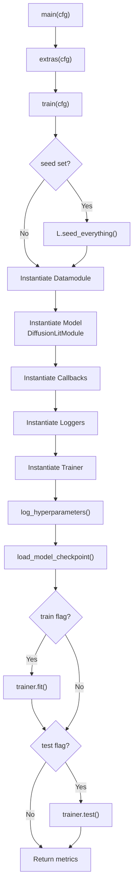
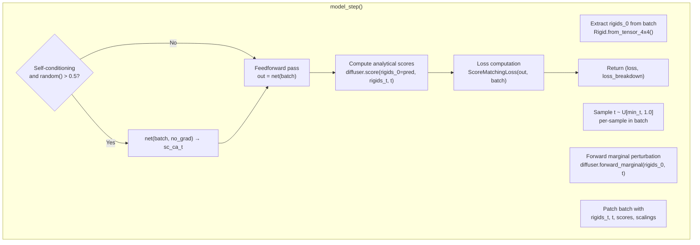
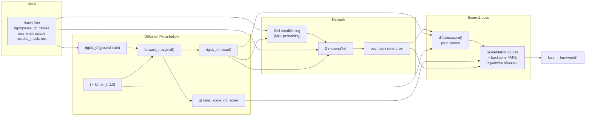

---
slug:13-training-loop-and-model-step
blog_type:normal
---


IDPFold 中的训练循环编排了一个 **基于 SE(3) 流形的分数扩散模型**，其中每个训练步骤包含：通过前向扩散过程扰动真实蛋白质刚体、通过神经网络预测去噪分数，以及将预测分数与解析已知的真实分数对比计算损失。本页面将剖析完整的训练生命周期——从 Hydra 驱动的实例化到核心 `model_step` 管道——帮助你精确理解数据在系统中的流转方式以及梯度的产生机制。

## 训练入口与编排

训练通过 `python src/train.py` 启动，该命令会调用一个由 Hydra 装饰的 `main()` 函数。`main()` 函数会应用一些可选的工具函数（如打标签、打印配置），然后将任务委托给 `train()` 函数。`train()` 函数本身被包裹在 `@task_wrapper` 装饰器中，用于控制多次运行期间的故障处理行为。

`train()` 函数遵循严格的实例化顺序。首先，通过 `L.seed_everything()` 选择性地设置随机种子。接着，通过 Hydra 的 `instantiate()` 工具实例化四个核心对象：**数据模块**（`LightningDataModule`）、**模型**（`DiffusionLitModule`）、**回调**列表和**日志记录器**列表。**训练器**最后实例化，接收回调和日志记录器作为构造函数参数。在加载检查点后，调用 `trainer.fit()` 开始训练循环；如果启用了 `test` 标志，则可选地执行 `trainer.test()`。



`object_dict` 是一个中央注册表，它将配置、数据模块、模型、回调、日志记录器和训练器捆绑在一个字典中。该字典会被传递给 `log_hyperparameters()`，以便在训练开始前记录所有的实验元数据。检查点工具会尝试从 `cfg.ckpt_path` 加载；如果为 `None`，则从头开始训练。

<CgxTip>
包裹 `train()` 的 `@task_wrapper` 装饰器并非只是装饰作用——它会在多次运行实验（例如 Optuna 超参数搜索）期间拦截异常，以保存崩溃信息。如果你扩展了训练管道，请确保任何新的副作用与此异常处理约定兼容。
</CgxTip>

来源：[train.py](/src/train.py#L44-L108), [train.py](/src/train.py#L111-L135)

## DiffusionLitModule：架构蓝图

`DiffusionLitModule` 类继承自 PyTorch Lightning 的 `LightningModule`，作为核心的训练容器。其 `__init__` 方法通过 Hydra 注入的超参数接收六个参数：

| 参数 | 类型 | 用途 |
|-----------|------|---------|
| `net` | `torch.nn.Module` | 去噪网络（`DenoisingNet`） |
| `optimizer` | `torch.optim.Optimizer` | Adam 的部分配置（lr=1e-4, weight_decay=0.0） |
| `scheduler` | `torch.optim.lr_scheduler` | `ReduceLROnPlateau` 的部分配置（factor=0.1, patience=10） |
| `diffuser` | `FrameDiffuser` | 封装 R3 和 SO3 扩散器的 SE(3) 扩散引擎 |
| `loss` | `Dict[str, Any]` | 损失配置字典 |
| `compile` | `bool` | 是否应用 `torch.compile`（默认：`false`） |

构造函数调用 `self.save_hyperparameters(logger=False)` 将所有初始化参数持久化到检查点中，以便稍后进行完整重建。这里初始化了三个指标追踪器：`train_loss` 和 `val_loss` 作为 `MeanMetric`（用于计算单个 epoch 内各批次的平均损失），以及 `val_loss_best` 作为 `MinMetric`（用于追踪最佳验证损失）。损失函数本身是使用 `loss` 配置子字典实例化的 `ScoreMatchingLoss` 对象。

当 `self.hparams.compile` 为 `True` 且阶段为 `"fit"` 时，`setup()` 钩子会处理网络可选的 `torch.compile` 操作。这会将编译推迟到训练开始前进行，确保模型已完全初始化且所有动态形状均已解析。

来源：[diffusion_module.py](/src/models/diffusion_module.py#L51-L86), [diffusion_module.py](/src/models/diffusion_module.py#L372-L399), [diffusion.yaml](/configs/model/diffusion.yaml#L1-L103)

## model_step 管道：核心扩散前向传播

`model_step()` 方法是 IDPFold 训练逻辑的核心。它实现了单个批次的完整前向传播：**扰动 → (可选的自条件化) → 网络推理 → 分数计算 → 损失计算**。`training_step` 和 `validation_step` 都委托给此方法，唯一区别在于 `training` 标志（尽管在当前实现中，该标志并未用于改变行为）。

### 步骤 1：提取真实刚体与时间采样

该方法首先从批次中提取真实的刚体变换。关键的 `rigidgroups_gt_frames` 张量为每个残基的主链框架保存了 4×4 齐次变换矩阵。这里选取第一个框架索引（`[..., 0, :, :]`），代表真实的主链 N-CA-C 框架。通过 `Rigid.from_tensor_4x4()` 将其转换为 `Rigid` 对象。

扩散时间 `t` 针对批次中的每个样本从 `[min_t, 1.0]` 中独立均匀采样。公式 `(1.0 - self.diffuser.min_t) * torch.rand(batch_size) + self.diffuser.min_t` 确保 `t` 永远不会精确达到零，从而避免分数函数出现奇点。默认的 `min_t` 为 `1e-2`，在 `diffusion.yaml` 中配置。

### 步骤 2：前向边际扰动

`FrameDiffuser.forward_marginal()` 方法对真实刚体应用前向扩散过程。对于每个刚体，它将变换分解为旋转（轴角表示）和平移，然后分别扰动各个分量：

- **旋转**：SO(3) 扩散器在时间 `t` 的边际分布中抽取角度进行旋转，产生 `rot_t` 和解析的 `rot_score`。
- **平移**：R(3) 扩散器施加由时间 `t` 的扩散系数缩放的高斯噪声，产生 `trans_t` 和解析的 `trans_score`。

被扰动的分量被重新组装成 `Rigid` 对象（`rigids_t`），当 `as_tensor_7=True` 时，以 7 维张量（四元数 + 平移）形式返回。输出字典还包含 `trans_score_scaling` 和 `rot_score_scaling`，它们是后续损失计算中使用的随时间变化的归一化因子。在训练期间 `diffuse_mask` 被设置为 `None`，意味着所有残基都会被扰动。

### 步骤 3：批次补充

被扰动的特征和辅助信息被合并到批次字典中：

```python
patch_feats = {
    't': t,                    # [B] 扩散时间
    'rigids_0': rigids_0,      # [B, N] 真实 Rigid 对象
}
batch.update({**perturb_feats, **patch_feats})
```

这会将 `rigids_t`、`trans_score`、`rot_score`、`trans_score_scaling`、`rot_score_scaling`、`t` 和 `rigids_0` 注入到批次中，使网络和损失函数均可访问它们。

### 步骤 4：自条件化（可选）

<CgxTip>
自条件化是扩散模型文献中的一种数据增强策略：以 50% 的概率在 `torch.no_grad()` 下对当前批次运行一次网络，并将其预测的 CA 平移（`rigids[..., 4:]`）存储为 `batch['sc_ca_t']`。这为网络提供了自身先前预测的估计值作为额外输入，从而提高去噪质量。随机的 50% 丢弃确保模型也能学会在没有该信号的情况下正常运行。
</CgxTip>

仅当 `self.net.embedder.self_conditioning` 为 `True`（在 `diffusion.yaml` 中配置为 `true`）时，才会激活自条件化。该机制的工作原理如下：以 0.5 的概率在推理模式（`torch.no_grad()`）下调用网络并设置 `as_tensor_7=True`，然后存储生成的 CA 坐标（7 维张量的最后 3 个分量，代表平移）。当未触发自条件化时（另外 50% 的情况），批次中不存在 `sc_ca_t`，嵌入器必须优雅地处理这种情况（通常通过零填充）。

### 步骤 5：网络前向传播

使用补充后的批次调用去噪网络（`DenoisingNet`）。网络接收带噪刚体 `rigids_t`、扩散时间 `t`、序列嵌入、残基索引以及可选的自条件化特征，然后输出一个至少包含以下内容的字典：

- `rigids`：预测的去噪刚体（作为 `Rigid` 对象或 7 维张量）
- `psi`：预测的主链 psi 扭转角

网络的内部架构——嵌入模块、IPA 模块和平移更新机制——详见 [Denoising Network Pipeline](12-denoising-network-pipeline)。

### 步骤 6：基于预测刚体的分数计算

在网络生成预测刚体后，调用 `FrameDiffuser.score()` 方法计算预测位置处扩散过程的**解析分数**。这是关键的一步：网络预测去噪后的刚体（即对 `rigids_0` 的估计），而分数函数将此预测转换为用于损失计算的分数空间。

分数计算的流程如下：
1. 计算预测的 `rigids_0` 与带噪的 `rigids_t` 之间的相对旋转（通过四元数乘法：`quat_0_inv ⊗ quat_t`）
2. 将此相对旋转转换为轴角表示
3. 将其传递给 `SO3Diffuser.score()` 获取旋转分数
4. 使用预测平移和带噪平移，通过 `R3Diffuser.score()` 计算平移分数

生成的 `pred_scores` 字典（包含 `trans_score` 和 `rot_score`）会被合并到网络输出字典中。

### 步骤 7：损失计算

最后，使用输出字典和批次调用 `ScoreMatchingLoss`，并设置 `_return_breakdown=True` 以同时接收总损失和包含各个损失分量的字典。损失计算将预测分数与前向边际得到的真实解析分数进行比较，并使用分数缩放因子进行加权。



来源：[diffusion_module.py](/src/models/diffusion_module.py#L104-L151), [frame.py](/src/models/score/frame.py#L36-L107), [frame.py](/src/models/score/frame.py#L109-L143), [diffusion.yaml](/configs/model/diffusion.yaml#L42-L85)

## 训练步骤与指标记录

`training_step()` 方法是 `model_step()` 的轻量级包装器。从模型步骤获取 `(loss, loss_bd)` 后，它会执行三个操作：

1. **更新累计损失指标**：`self.train_loss(loss)` 将当前批次的损失累加到 `MeanMetric` 聚合器中。
2. **记录聚合损失**：`self.log("train/loss", self.train_loss, ...)` 配合 `on_step=False, on_epoch=True` 确保损失每个 epoch 记录一次（而非每个步骤），并设置 `sync_dist=True` 以在分布式训练中正确聚合。
3. **记录各损失分量**：`loss_bd` 字典中的每个条目（排除 `'loss'` 键本身）均带有 `train/` 前缀进行记录，从而细粒度地洞察哪些损失项占据主导地位。

该方法返回 `loss`（标量张量），Lightning 使用它来计算梯度并更新参数。`on_train_epoch_end()` 钩子目前为空操作，将每个 epoch 的逻辑交由 Lightning 的内置机制处理。

`on_train_start()` 钩子会重置 `val_loss` 和 `val_loss_best`，以确保 Lightning 在第一个训练 epoch 之前执行的完整性检查验证不会污染所追踪的指标。

来源：[diffusion_module.py](/src/models/diffusion_module.py#L97-L178)

## 验证步骤与最佳模型追踪

`validation_step()` 调用 `model_step(batch, training=False)` 并更新 `val_loss` 指标。损失以 `"val/loss"` 记录，配置与训练相同，均为 epoch 级别且支持分布式同步。

在每个验证 epoch 结束时，`on_validation_epoch_end()` 通过 `self.val_loss.compute()` 计算当前验证损失，更新 `val_loss_best`（一个 `MinMetric`），并记录 `"val/loss"` 和 `"val/loss_best"`。最佳模型路径由 `ModelCheckpoint` 回调追踪，它在 `"min"` 模式下监控 `"val/loss"` 并将检查点保存至 `${paths.output_dir}/checkpoints`。

| 指标 | 类型 | 记录键 | 聚合方式 |
|--------|------|---------|-------------|
| `train_loss` | `MeanMetric` | `train/loss` | 每 epoch 平均值 |
| `val_loss` | `MeanMetric` | `val/loss` | 每 epoch 平均值 |
| `val_loss_best` | `MinMetric` | `val/loss_best` | 滚动最小值 |

来源：[diffusion_module.py](/src/models/diffusion_module.py#L180-L199), [default.yaml](/configs/callbacks/default.yaml#L1-L23)

## 优化器与调度器配置

`configure_optimizers()` 方法根据超参数配置构建优化管道。优化器实例化为 **Adam**，学习率为 `1e-4`，权重衰减为零，应用于 `self.trainer.model.parameters()`。调度器为 **ReduceLROnPlateau**，在 `"min"` 模式下运行，衰减因子为 `0.1`，容忍度为 `10` 个 epoch——这意味着如果验证损失连续 10 个 epoch 没有改善，学习率将除以 10。

该方法返回一个符合 Lightning 标准格式的字典：

```python
{
    "optimizer": optimizer,
    "lr_scheduler": {
        "scheduler": scheduler,
        "monitor": "val/loss",
    }
}
```

`monitor` 键告诉 Lightning 监控哪个指标以检测平台期。这与验证记录直接相连：调度器观察在每个验证 epoch 结束时记录的 `"val/loss"` 指标。

来源：[diffusion_module.py](/src/models/diffusion_module.py#L384-L410), [diffusion.yaml](/configs/model/diffusion.yaml#L3-L14)

## 训练配置摘要

下表汇总了配置文件中的关键训练超参数：

| 类别 | 参数 | 值 | 来源配置 |
|----------|-----------|-------|---------------|
| **优化器** | 类型 | Adam | `model/diffusion.yaml` |
| | 学习率 | 1e-4 | `model/diffusion.yaml` |
| | 权重衰减 | 0.0 | `model/diffusion.yaml` |
| **调度器** | 类型 | ReduceLROnPlateau | `model/diffusion.yaml` |
| | 衰减因子 | 0.1 | `model/diffusion.yaml` |
| | 容忍度 | 10 个 epoch | `model/diffusion.yaml` |
| | 监控指标 | val/loss | `model/diffusion.yaml` |
| **训练器** | 最大 epoch 数 | 10 | `trainer/default.yaml` |
| | 最小 epoch 数 | 1 | `trainer/default.yaml` |
| | 验证频率 | 每 1 个 epoch | `trainer/default.yaml` |
| | 加速器 | CPU（覆盖为 GPU/DDP） | `trainer/default.yaml` |
| **回调** | 检查点监控 | val/loss (min) | `callbacks/default.yaml` |
| | 早停容忍度 | 100 个 epoch | `callbacks/default.yaml` |
| | 保存最后检查点 | True | `callbacks/default.yaml` |
| **扩散** | min_t | 1e-2 | `model/diffusion.yaml` |
| | 自条件化 | 启用（50% 丢弃） | `model/diffusion.yaml` |
| **损失** | 平移权重 | 1.0 | `model/diffusion.yaml` |
| | 旋转权重 | 1.0 | `model/diffusion.yaml` |
| | 主链 FAPE 权重 | 0.25 (t ≤ 0.25) | `model/diffusion.yaml` |
| | 成对距离权重 | 0.25 (t ≤ 0.25) | `model/diffusion.yaml` |

损失配置揭示了一个重要的设计决策：**主链 FAPE** 和 **成对距离 (PWD)** 辅助损失仅在扩散时间 `t` 低于 `0.25` 的阈值时激活。这意味着这些结构损失仅在模型从相对干净的状态进行去噪时才发挥作用，从而避免了在高扩散时间下受噪声主导的梯度。分数匹配损失（平移和旋转）则在所有时间步骤中均保持激活。

来源：[diffusion.yaml](/configs/model/diffusion.yaml#L60-L85), [default.yaml](/configs/trainer/default.yaml#L1-L20), [default.yaml](/configs/callbacks/default.yaml#L1-L23), [train.yaml](/configs/train.yaml#L1-L50)

## 端到端训练数据流

下图展示了单个训练步骤中从原始批次输入到产生梯度损失的完整数据流：



来源：[diffusion_module.py](/src/models/diffusion_module.py#L104-L151), [frame.py](/src/models/score/frame.py#L36-L143), [loss.py](/src/models/loss.py#L1-L200)

## 接下来阅读什么

训练循环的损失计算涉及多个组件协同工作。要理解主要损失项的数学基础，请继续阅读 [Score Matching Loss](14-score-matching-loss)，其中详细介绍了如何在 SE(3) 流形上比较预测分数与解析分数。关于辅助结构损失（FAPE、成对距离、主链），请参阅 [FAPE and Auxiliary Losses](15-fape-and-auxiliary-losses)。输入到 `model_step` 的数据——包括 `rigidgroups_gt_frames` 和序列嵌入的准备方式——在 [Protein Dataset and Transforms](16-protein-dataset-and-transforms) 和 [ESM Sequence Embedding Extraction](17-esm-sequence-embedding-extraction) 中有所介绍。