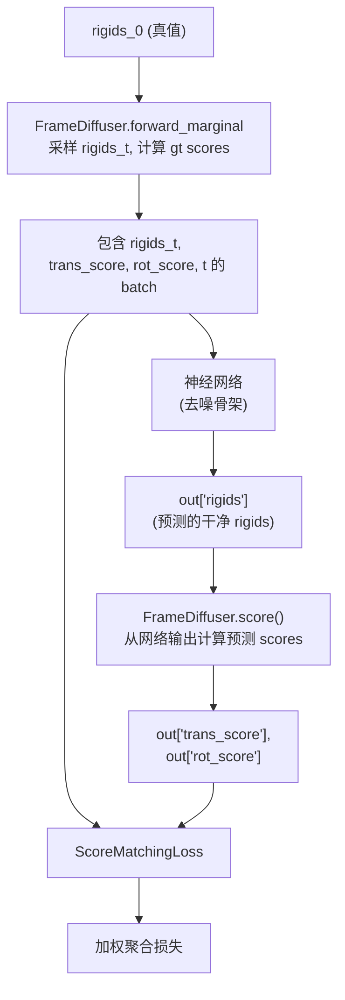
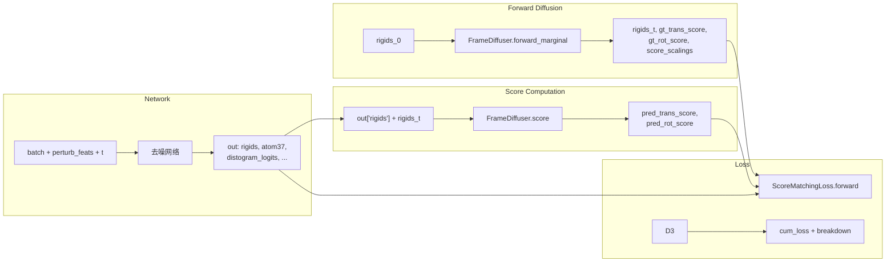

---
slug:14-score-matching-loss
blog_type:normal
---

`ScoreMatchingLoss` 类是 IDPFold 在 SE(3) 上的扩散模型的核心训练目标。它计算平移（R³）和旋转（SO(3)）组件的**解析得分匹配损失**（analytical score matching losses）的加权聚合，并可选择性地辅以一组辅助折叠损失。其核心思想是，网络学习预测 Stein 得分——即带噪分布对数密度的梯度——一旦训练完成，即可驱动逆时 SDE 采样，从噪声中生成蛋白质骨架。

## 架构背景：从网络输出到得分目标

在深入探讨损失函数之前，有必要先了解真实得分目标是如何构建的。`DiffusionLitModule` 中的 `model_step` 方法统筹了一个多阶段流水线：网络首先输出预测的刚体变换，随后 `FrameDiffuser.score()` 方法根据这些变换和带噪输入计算出*解析的*真实得分。

`FrameDiffuser.score()` 方法将刚体预测分解为旋转和平移子问题。对于平移，它委托给 `R3Diffuser.score()`，后者计算 VPSDE 边缘分布的解析得分。对于旋转，它将预测的干净旋转与带噪旋转之间的相对旋转提取为轴角向量，然后委托给 `SO3Diffuser.score()`，后者通过截断幂级数求值 IGSO(3) 密度的得分。

来源：[diffusion_module.py](src/models/diffusion_module.py#L104-L151), [frame.py](src/models/score/frame.py#L109-L143)

## R³ 平移得分：VPSDE 解析得分

平移扩散器在采用线性漂移调度的**方差保留 SDE (VPSDE)** 下运行。漂移系数为 `f(x, t) = -½ · b(t) · x`，扩散系数为 `g(t) = √b(t)`，其中 `b(t) = min_b + t · (max_b - min_b)`。边缘累积噪声为 `β(t) = t · min_b + ½ · t² · (max_b - min_b)`，它同时控制前向边缘分布和得分函数。

VPSDE 前向边缘分布 `p(x_t | x_0)` 的解析得分为：

$$\nabla_{x_t} \log p(x_t \mid x_0) = -\frac{x_t - e^{-\frac{1}{2}\beta(t)} \cdot x_0}{1 - e^{-\beta(t)}}$$

该计算在 `R3Diffuser.score()` 中实现，它在计算得分前应用坐标缩放，并返回形状为 `[..., N, 3]` 的张量。用于归一化损失的**得分缩放**（score scaling）因子为 `1 / √(conditional_var(t))`，其中 `conditional_var(t) = 1 - exp(-β(t))`。引入此缩放因子的原因在于，得分的大小在不同时间步之间差异巨大；通过除以得分缩放因子，可确保损失在整个扩散轨迹上保持良好的条件性。

来源：[r3.py](src/models/score/r3.py#L26-L77), [r3.py](src/models/score/r3.py#L133-L137)

## SO(3) 旋转得分：IGSO(3) 密度

旋转扩散器使用 **SO(3) 上的各向同性高斯分布**（IGSO(3)），其密度表示为 SO(3) 不可约表示中的截断幂级数。核心数学对象是其展开式：

$$p(\omega; \sigma) = \sum_{l=0}^{L} (2l+1) \cdot e^{-l(l+1)\sigma^2/2} \cdot \frac{\sin((l+\frac{1}{2})\omega)}{\sin(\omega/2)}$$

其中 `ω` 是旋转角（轴角向量的模），`σ` 是 IGSO(3) 的尺度参数。**sigma 调度**采用对数形式：`σ(t) = log(t · exp(max_σ) + (1-t) · exp(min_σ))`，将单位时间区间 `[0, 1]` 映射到噪声尺度范围 `[min_σ, max_σ]`。

IGSO(3) 边缘密度在旋转角上的得分，是通过对对数密度应用商法则计算得出的，产生一个标量 `d/dω [log p(ω; σ) / (1 - cos ω)]`，用于缩放旋转向量的单位轴。`SO3Diffuser.score()` 方法支持两种模式：**缓存查表**（使用由离散化的 sigma 和 omega 索引的预计算得分范数表）和**实时计算**（直接使用 PyTorch 张量求值截断级数）。SO(3) 的得分缩放源于 IGSO(3) 密度下得分的期望范数除以 `√3`。

<CgxTip>SO(3) 得分计算涉及除以 `sin(ω/2)`，这在 `ω = 0`（单位旋转）时是奇异的。实现中在分子范数和分母上均加上 `self.eps`（默认 `1e-6`）进行正则化。在调试低噪声水平下爆炸的得分匹配损失时，请检查此 epsilon 是否满足你的数值精度需求。</CgxTip>

来源：[so3.py](src/models/score/so3.py#L21-L62), [so3.py](src/models/score/so3.py#L85-L130), [so3.py](src/models/score/so3.py#L274-L313)

## ScoreMatchingLoss：构成与加权聚合

`ScoreMatchingLoss` 类继承自 `nn.Module`，作为所有训练损失的统一入口。其 `forward` 方法接收网络输出字典 `out`、数据批次 `batch`，以及一个可选的 `_return_breakdown` 标志，该标志控制是否在返回总损失的同时返回各组件损失。

### 掩码与归一化

损失仅限于既**有效**（`seq_mask`）又**处于扩散中**（`1 - fixed_mask`）的残基。两者的交集 `loss_mask = seq_mask × diffuse_mask` 生成形状为 `[B, L]` 的每残基二值掩码。归一化分母 `_denom = sum_except_batch(loss_mask) + eps` 确保损失不受扩散残基数量的影响，使其成为平均值而非求和。

### 平移损失：双模式得分匹配与 x₀ 预测

平移损失采用**混合策略**，根据扩散时间 `t` 在得分匹配和直接坐标预测之间切换：

| 模式 | 条件 | 损失公式 | 原理 |
|------|-----------|-------------|-----------|
| **得分匹配** | `t > x0_threshold` | `‖(gt_score - pred_score) · mask / score_scaling‖²` | 标准去噪得分匹配；适用于大噪声情况 |
| **x₀ 预测** | `t ≤ x0_threshold` | `‖coordinate_scaling · (x_0 - x̂_0) · mask‖²` | 在小噪声下，条件方差 → 0，导致得分缩放 → ∞，得分匹配损失在数值上不稳定；直接坐标 MSE 更为稳定 |

最终的平移损失为 `mean(trans_score_loss · 𝟙[t > τ] + trans_x0_loss · 𝟙[t ≤ τ])`，其中 `τ` 是可配置的 `x0_threshold`。此设计反映了一个实用见解：当噪声水平较低时，网络的预测已接近干净结构，因此直接监督预测坐标比监督得分更稳定且更具可解释性。

来源：[loss.py](src/models/loss.py#L1635-L1662)

### 旋转损失：纯得分匹配

旋转损失遵循与平移得分匹配相同的模式，但不进行双模式切换：

$$\mathcal{L}_{\text{rot}} = \text{mean}\left(\frac{\sum_{i} \|(\mathbf{s}_{\text{gt}}^{(i)} - \mathbf{s}_{\text{pred}}^{(i)}) \cdot m_i / \alpha(t)\|^2}{\sum_i m_i + \epsilon}\right)$$

其中 `s_gt` 和 `s_pred` 是真实和预测的旋转得分向量（在轴角空间中），`m_i` 是每残基的损失掩码，`α(t)` 是 `rot_score_scaling` 因子。旋转组件不采用 x₀ 回退机制，因为由于对数 sigma 调度，IGSO(3) 得分缩放在整个时间范围内保持有界。

来源：[loss.py](src/models/loss.py#L1664-L1666)

### 辅助损失：条件聚合

除了核心的得分匹配损失外，`ScoreMatchingLoss` 还会根据条件聚合一系列辅助目标，每个目标都由配置中的布尔值 `enabled` 标志控制：

| 损失组件 | 配置键 | 函数 | 用途 |
|----------------|-----------|----------|---------|
| 距离图 | `distogram` | `distogram_loss` | 成对距离分布预测 |
| 监督 χ 角 | `supervised_chi` | `supervised_chi_loss` | 侧链扭转角监督 |
| pLDDT | `lddt` | `lddt_loss` | 预测的局部距离差异测试 |
| FAPE | `fape` | `fape_loss` | 帧对齐点误差（骨架 + 侧链） |
| TM-score | `tm` | `tm_loss` | 模板建模得分预测 |
| 骨架原子 | `backbone` | `backbone_atom_loss` | 直接骨架原子位置 MSE |
| 成对距离 | `pwd` | `pairwise_distance_loss` | 短程成对距离一致性 |

每个辅助损失都被封装在一个闭包（lambda）中，并存储在 `loss_fns` 字典里。聚合循环遍历所有条目，从 `self.config[loss_name].weight` 中获取相应的权重，计算损失，并将 `weight × loss` 累加到 `cum_loss` 中。防御性的 NaN/Inf 检查会跳过任何产生无效值的损失，代之以 `requires_grad=True` 的零张量，确保反向传播不会因单个失败组件而受阻。

各组件的损失值（已 detach）被收集到 `losses` 字典中，当 `_return_breakdown=True` 时返回。这使得训练循环能够独立记录每个损失组件以进行监控——正如 `DiffusionLitModule.training_step` 中所示，它将每个 `loss_bd` 条目记录在 `train/{k}` 下。

来源：[loss.py](src/models/loss.py#L1668-L1741), [diffusion_module.py](src/models/diffusion_module.py#L153-L174)

## 数据流总结：完整的损失流水线

该流水线首先通过前向边缘分布对真值刚体 `rigids_0` 进行扰动，生成带噪刚体 `rigids_t` 以及解析的真实得分和得分缩放因子。网络接收带噪批次并输出预测的干净刚体（及辅助输出）。随后，`FrameDiffuser.score()` 方法从网络输出中推导出预测得分。最后，`ScoreMatchingLoss` 将预测得分与真实得分进行比较——根据各自的缩放因子加权，掩码至扩散残基，并结合任何已启用的辅助损失——以生成标量训练目标。

<CgxTip>`score_scaling` 归一化对于训练稳定性至关重要。若无此机制，大 `t`（高噪声）下的损失将占据主导地位，因为得分大小以 `1/√conditional_var(t)` 增长。通过除以 `score_scaling`，损失实际上测量的是*归一化得分误差*——即网络对得分方向和相对大小估计的误差，与噪声水平设定的绝对尺度无关。</CgxTip>

来源：[loss.py](src/models/loss.py#L1629-L1742), [frame.py](src/models/score/frame.py#L36-L107), [diffusion_module.py](src/models/diffusion_module.py#L104-L151)

## 配置参考

损失配置由构造时传递的 Hydra 配置字典驱动。下表总结了控制得分匹配行为的关键配置参数：

| 参数 | 路径 | 类型 | 描述 |
|-----------|------|------|-------------|
| `eps` | `loss.eps` | `float` | 用于归一化分母的数值稳定性 epsilon |
| `translation.coordinate_scaling` | `loss.translation.coordinate_scaling` | `float` | x₀ 预测损失的缩放因子 |
| `translation.x0_threshold` | `loss.translation.x0_threshold` | `float` | 低于该时间阈值时，x₀ 损失将替代得分损失 |
| `translation.weight` | `loss.translation.weight` | `float` | 平移损失组件的权重 |
| `rotation.weight` | `loss.rotation.weight` | `float` | 旋转损失组件的权重 |
| `{aux}.enabled` | `loss.{aux}.enabled` | `bool` | 是否包含辅助损失 `{aux}` |
| `{aux}.weight` | `loss.{aux}.weight` | `float` | 辅助损失 `{aux}` 的权重 |

其中 `{aux}` ∈ {`distogram`, `supervised_chi`, `lddt`, `fape`, `tm`, `backbone`, `pwd`}。

来源：[loss.py](src/models/loss.py#L1631-L1633), [loss.py](src/models/loss.py#L1654-L1662), [loss.py](src/models/loss.py#L1719-L1725)

## 后续步骤

- **[FAPE 与辅助损失](15-fape-and-auxiliary-losses)**：深入探讨 FAPE 计算、距离图损失及其他补充得分匹配的辅助目标。
- **[训练循环与模型步骤](13-training-loop-and-model-step)**：了解 `ScoreMatchingLoss` 如何集成到 Lightning 训练循环中，包括自条件化和指标记录。
- **[R3 平移扩散器](7-r3-translation-diffuser)**：产生得分目标的 VPSDE 前向/逆向过程的数学基础。
- **[SO3 旋转扩散器](8-so3-rotation-diffuser)**：IGSO(3) 密度、sigma 调度以及作为旋转得分基础的截断级数展开。