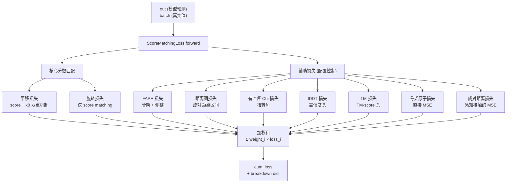
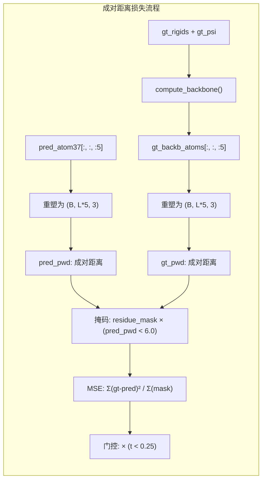

---
slug:15-fape-and-auxiliary-losses
blog_type:normal
---


IDPFold 的训练目标超越了在 SE(3) 流形上的纯分数匹配。`ScoreMatchingLoss` 类统筹了一个复合损失体系，将基于扩散的分数匹配与借鉴自 AlphaFold 折叠流程的结构监督信号（FAPE、距离图、扭转角、lDDT、TM-score、骨架原子以及成对距离损失）相融合，从而为去噪网络奠定符合物理有效性的蛋白质几何基础。本页将剖析各个损失组件、其数学公式，以及它们如何在统一的配置驱动框架下进行聚合。

来源：[loss.py](/src/models/loss.py#L1629-L1742), [diffusion.yaml](/configs/model/diffusion.yaml#L60-L85)

## 损失聚合架构

`ScoreMatchingLoss` 类作为核心调度器，接收模型输出字典（`out`）、训练批次（`batch`）以及一个结构化配置，该配置控制启用哪些损失及其各自权重。其核心在于，前向传播构建了一个包含惰性损失函数 lambda 的字典，遍历这些函数并累加加权和——如果某个组件产生 NaN 或 Inf 值，则会跳过该组件，记录警告日志，并使用一个梯度置零的张量。

损失流程始于两个**常驻开启**的组件：平移损失和旋转损失，二者均源于分数匹配理论。辅助损失则根据配置中的 `enabled` 标志有条件地进行追加。最终返回累计损失，以及用于记录各单项损失值的明细字典。



<CgxTip>损失聚合器针对辅助损失使用了 Python 惰性 lambda（`lambda:`），这意味着每个损失的计算图只有在循环遍历到它时才会构建。这不仅仅是代码组织上的选择——它确保了被禁用的损失（例如 `enabled: false` 时的 FAPE）永远不会分配中间张量，从而在训练期间保持较低内存占用。</CgxTip>

来源：[loss.py](/src/models/loss.py#L1635-L1741)

## 核心分数匹配损失

### 平移损失：双重机制设计

平移组件采用了由 `x0_threshold` 配置参数控制的**双重机制**策略。当扩散时间步 `t` 超过该阈值（表示噪声较强）时，损失采用**分数匹配**公式——将预测的分数向量与真实的解析分数进行比较，并通过分数缩放因子进行归一化。当 `t` 小于或等于阈值（表示噪声较轻，接近数据流形）时，损失切换为直接的 **x0 坐标损失**——将预测的 Cα 平移与真实平移进行比较，并通过 `coordinate_scaling` 进行缩放。

该设计反映了一个关键洞察：在低噪声水平下，分数函数会变得病态（梯度变平），使得直接的坐标监督能提供更丰富的信息。基于阈值的切换实现为一个加权和：

```python
trans_loss = torch.mean(
    trans_score_loss * (batch['t'] > self.config.translation.x0_threshold) +
    trans_x0_loss  * (batch['t'] <= self.config.translation.x0_threshold)
)
```

两个损失项均由 `loss_mask = seq_mask * diffuse_mask` 进行掩码处理，确保只有同时属于序列且被指定进行扩散的残差才会对梯度产生贡献。归一化使用 `sum_except_batch(loss_mask)` 作为分母，产生一个与批次大小无关的每残基平均值。

来源：[loss.py](/src/models/loss.py#L1645-L1662), [tensor_utils.py](/src/utils/tensor_utils.py#L54-L55)

### 旋转损失

旋转损失遵循纯分数匹配公式，在 SO(3) 流形上将预测的旋转分数向量与真实分数进行比较。与平移组件类似，它通过旋转分数缩放因子和损失掩码分母进行归一化。与平移不同的是，它没有 x0 回退机制——旋转分数匹配在整个噪声调度过程中始终保持良好状态，因为 SO(3) 分数是通过 IGSO(3) 分布计算的，该分布在低噪声下仍能维持有效的曲率。

来源：[loss.py](/src/models/loss.py#L1664-L1666)

## 框架对齐点误差 (FAPE)

### 数学基础

FAPE 通过评估预测和目标**局部坐标系**在用于表示原子位置时的对齐程度，来衡量结构的一致性。对于每一对（坐标系，点），误差计算为该点在预测坐标系中的坐标与其在目标坐标系中的坐标之间的欧几里得距离。其公式如下：

$$\text{FAPE} = \frac{1}{|\mathcal{F}||\mathcal{P}|} \sum_{f \in \mathcal{F}} \sum_{p \in \mathcal{P}} \left\| T_f^{-1} \cdot p_{\text{pred}} - T_f^{*-1} \cdot p_{\text{gt}} \right\|$$

其中 $T_f^{-1}$ 对刚性变换（坐标系 $f$）求逆，以将全局位置转换为局部坐标。`compute_fape` 函数通过对 `Rigid` 对象调用 `pred_frames.invert()` 和 `target_frames.invert()` 来实现这一点，然后将它们应用于对应的位置张量。

### 截断与长度缩放

两个关键超参数控制着 FAPE 的行为：

| 参数 | 默认值 | 用途 |
|-----------|---------|---------|
| `l1_clamp_distance` | `10.0` Å | 将每对误差限制在此距离内，防止异常坐标系主导梯度 |
| `length_scale` | `10.0` | 除以原始误差，产生约在 O(1) 范围内的无量纲损失 |

当提供 `l1_clamp_distance` 时，误差张量在除以长度比例之前会通过 `torch.clamp(error_dist, min=0, max=l1_clamp_distance)` 进行截断。这将损失从 L2 范数转变为一种**截断的类 L1** 度量——对小误差敏感，但对大误差趋于饱和，这对于在存在部分未折叠或无序区域时实现稳定训练至关重要。

<CgxTip>`backbone_loss` 中的 `use_clamped_fape` 机制在截断和非截断的 FAPE 之间进行线性插值：`fape_loss = clamped * use_clamped_fape + unclamped * (1 - use_clamped_fape)`。这允许进行基于课程的训练，即逐渐移除截断，尽管在 IDPFold 的默认配置中，FAPE 被完全禁用，转而支持更轻量的骨架原子和成对距离损失。</CgxTip>

### 友好于 FP16 的平均值计算

一个值得注意的实现细节是用于掩码平均的**顺序归约**模式，旨在避免 FP16 溢出。代码没有计算一个大的掩码总和除以标量归一化因子，而是执行了两次顺序归约——首先在点维度上求和，然后在坐标系维度上求和：

```python
normed_error = torch.sum(normed_error, dim=-1)  # 在点上求和
normed_error = normed_error / (eps + torch.sum(frames_mask, dim=-1))[..., None]
normed_error = torch.sum(normed_error, dim=-1)  # 在坐标系上求和
normed_error = normed_error / (eps + torch.sum(positions_mask, dim=-1))
```

这在数学上等价于 `sum(error * mask) / (sum(frame_mask) * sum(pos_mask))`，但避免了将掩码的完整乘积作为一个大的分母进行实例化，从而防止在混合精度训练中发生溢出或精度丢失。

来源：[loss.py](/src/models/loss.py#L78-L151), [loss.py](/src/models/loss.py#L154-L209)

### 骨架 FAPE

`backbone_loss` 函数将 FAPE 应用于骨架刚性组。预测坐标系通过 `Rigid.from_tensor_7(traj)` 从扩散轨迹中提取，然后重新封装以剥离四元数表示（仅使用旋转矩阵以保证数值稳定性）。真实坐标系从 4×4 齐次矩阵中加载。FAPE 使用骨架平移向量同时作为坐标系和点进行计算——这是一种自引用设计，其中每个残差的坐标系都会与所有其他残差的坐标系进行评估，以衡量全局结构的一致性。

代码中记录了与 DeepMind 原始实现的一个显著差异：原始流程对四元数表示进行归一化并转换回旋转矩阵，而 IDPFold 直接使用原始旋转矩阵，以避免因反复进行四元数转换而导致的数值不稳定性。

来源：[loss.py](/src/models/loss.py#L154-L209)

### 侧链 FAPE 与真值重命名

`sidechain_loss` 函数使用 atom14 表示将 FAPE 扩展到侧链刚性组。一个关键的预处理步骤是**真值重命名**（`compute_renamed_ground_truth`），它实现了 AlphaFold 补充材料中的算法 26。这通过选择使预测位置的 RMSD 最小化的命名约定，解决了对称原子命名的歧义（例如 Asp OD1/OD2、Glu OE1/OE2），确保所有损失信号将原子推向一致的方向。

`sidechain_loss` 函数本身获取轨迹的最后一个元素（`sidechain_frames[-1]`），展平刚性组维度，并在预测侧链坐标系和重命名后的真实坐标系之间应用 FAPE。随后，组合的 `fape_loss` 函数产生一个加权和：

```python
loss = config.backbone.weight * bb_loss + config.sidechain.weight * sc_loss
```

来源：[loss.py](/src/models/loss.py#L212-L283), [loss.py](/src/models/loss.py#L1355-L1399)

## 辅助结构损失

### 骨架原子损失

`backbone_atom_loss` 函数提供了一种轻量级的替代方案，用于替代完整 FAPE 进行骨架监督。它不评估所有坐标系对的一致性，而是计算预测的 atom37 表示的前五个骨架原子（N, CA, C, O, CB）与通过 `compute_backbone` 重建的真实骨架之间的直接 MSE。该损失支持一个 `t_threshold` 参数，用于根据扩散时间步对损失进行门控——当提供该参数时，对于 `t >= t_threshold` 的残差，损失将被置零，从而将监督集中在原子级精度至关重要的低噪声阶段。

在默认配置中，该损失启用，权重为 `0.25`，`t_threshold: 0.25`，这意味着它仅在去噪轨迹的最后 25% 阶段产生作用。

来源：[loss.py](/src/models/loss.py#L1553-L1578), [diffusion.yaml](/configs/model/diffusion.yaml#L77-L80)

### 成对距离损失

`pairwise_distance_loss` 函数监督原子间距离矩阵而非绝对坐标，提供了一种**平移不变**的信号。它计算预测值和真实值中前五个骨架原子的成对欧几里得距离，然后应用由两个条件掩码处理的平方误差：(1) 两个原子必须位于有效残基中；(2) 预测距离必须小于 `dist_threshold`（默认为 6.0 Å）。这种感知接触的掩码将损失聚焦于局部结构精度——确保近天然接触被保留——同时忽略在早期去噪阶段不太关键的长程距离误差。

与骨架原子损失一样，它支持 `t_threshold` 门控，并在默认配置中以权重 `0.25` 和 `t_threshold: 0.25` 启用。



来源：[loss.py](/src/models/loss.py#L1581-L1622), [diffusion.yaml](/configs/model/diffusion.yaml#L81-L84)

### 有监督 Chi（扭转角）损失

`supervised_chi_loss` 函数实现了 AlphaFold 中的算法 27，针对真实值监督预测的侧链扭转角（χ1–χ4）。该损失通过同时计算标准平方误差和偏移版本（翻转真实 sin-cos 表示的符号）并取最小值，来处理某些扭转角（例如芳香族残基中的 χ2）的 **π 周期性**。这可以防止损失惩罚化学上等价的旋转异构状态。

该损失结合了两项：扭转角误差（`chi_weight * sq_chi_loss`）和归一化惩罚（`angle_norm_weight * |‖unnormalized‖ − 1|`），后者鼓励网络未归一化的 sin-cos 输出位于单位圆上。`torsion_angle_loss` 辅助函数采用了类似的设计，其中归一化组件使用固定值为 0.02 的 `an_weight`。

来源：[loss.py](/src/models/loss.py#L286-L367), [loss.py](/src/models/loss.py#L54-L75)

### 距离图损失

`distogram_loss` 使用伪 β 位置（非甘氨酸的 Cα，甘氨酸的 Cβ）监督成对距离分类头。距离被分入 `no_bins`（默认为 64）个区间，区间边界跨越从 `min_bin`² 到 `max_bin`² 的平方距离，损失是针对独热编码的真实区间的 softmax 交叉熵。这提供了一种粗粒度的结构信号，对于长程接触预测特别有用。

来源：[loss.py](/src/models/loss.py#L515-L560)

### lDDT 和 TM-Score 损失

`lddt_loss` 和 `tm_loss` 函数监督置信度预测头。lDDT 损失根据预测和真实的 Cα 位置计算实际的 lDDT 分数，将其离散化为 `no_bins` 个区间，并使用交叉熵训练预测 lDDT 分类头。TM-score 损失遵循类似的模式，计算预测和真实骨架坐标系之间基于 FAPE 的平方误差，将其分箱并应用交叉熵。这两种损失都受分辨率约束（`min_resolution` 到 `max_resolution`）的门控限制，确保只有在真实结构具有足够质量时它们才发挥作用。

来源：[loss.py](/src/models/loss.py#L463-L512), [loss.py](/src/models/loss.py#L657-L711)

## 结构违规损失

除了监督损失之外，IDPFold 还继承了 AlphaFold 的结构违规检查套件——这是一组基于物理的惩罚，独立于训练目标强制执行化学有效性。

### 残基间键违规

`between_residue_bond_loss` 函数实现了一种**平底损失**，惩罚肽键几何结构的偏差：C–N 键长、CA–C–N 键角和 C–N–CA 键角。每个几何量都与残基特定的真实值进行比较（对脯氨酸独特的 C–N 键长进行了特殊处理）。只有当误差超过 `tolerance_factor_soft * gt_stddev` 时，损失才会被激活，在容差带内产生零梯度——这可以防止模型以牺牲全局折叠质量为代价过度优化键的几何结构。

来源：[loss.py](/src/models/loss.py#L714-L870)

### 空间位阻冲突惩罚

有两个函数处理原子冲突：`between_residue_clash_loss` 检测不同残基中原子之间的范德华力重叠，而 `within_residue_violations` 检查残基内部的距离边界。残基间冲突损失构建了一个完整的 (N, N, 14, 14) 距离矩阵，将允许的下限计算为范德华半径之和减去重叠容差，并对任何低于此界限的距离应用 ReLU 惩罚。特殊的掩码处理将合理的 C–N 肽键和半胱氨酸二硫键排除在冲突计算之外。

聚合的 `violation_loss` 将键几何损失（C–N 长度、CA–C–N 角度、C–N–CA 角度）与归一化的冲突损失相结合，产生一个标量，用于惩罚物理上不合理的结构。

来源：[loss.py](/src/models/loss.py#L873-L1017), [loss.py](/src/models/loss.py#L1020-L1104), [loss.py](/src/models/loss.py#L1333-L1352)

## 默认配置与损失加权

`diffusion.yaml` 中的默认训练配置揭示了 IDPFold 的损失策略：一种**极简**方法，主要依赖分数匹配，辅以两个轻量级的辅助损失。

| 损失组件 | 启用 | 权重 | t_threshold | 原理 |
|---------------|---------|--------|-------------|-----------|
| 平移 (score + x0) | ✅ 始终 | 1.0 | x0_threshold=1.0 | 核心扩散目标 |
| 旋转 | ✅ 始终 | 1.0 | — | 核心扩散目标 |
| 骨架原子 MSE | ✅ | 0.25 | 0.25 | 低噪声下的细粒度骨架精度 |
| 成对距离 MSE | ✅ | 0.25 | 0.25 | 低噪声下的接触保留 |
| FAPE | ❌ | — | — | 禁用；计算量较大，与骨架+成对距离冗余 |
| 距离图 | ❌ | — | — | 禁用；默认网络中无距离图头 |
| 有监督 Chi | ❌ | — | — | 禁用；默认网络中无扭转角头 |
| lDDT | ❌ | — | — | 禁用；默认网络中无 lDDT 头 |
| TM | ❌ | — | — | 禁用；默认网络中无 TM 头 |

两个已启用的辅助损失上的 `0.25` 的 `t_threshold` 意味着它们仅在去噪轨迹的**最后四分之一**（t ∈ [0, 0.25]）产生作用，此时结构最接近数据流形，细粒度的原子精度变得相关。在早期的高噪声阶段，只有分数匹配损失指导训练——这与粗略的全局结构应在局部精细化介入之前从扩散过程本身产生这一原则相一致。

来源：[diffusion.yaml](/configs/model/diffusion.yaml#L60-L85)

## 与训练循环的集成

损失在 `DiffusionLitModule.model_step` 中被调用，模型输出和批次被传递给 `self.loss(out, batch, _return_breakdown=True)`。返回的 `(cum_loss, loss_dict)` 元组由训练步骤使用，该步骤将每个单独的损失组件记录到进度条和日志记录器中，同时仅通过 `cum_loss` 进行反向传播。`ScoreMatchingLoss.forward` 中的 NaN 安全机制确保任何产生无效值的辅助损失都会被静默置零，而不是导致训练运行崩溃——鉴于结构损失计算的复杂性以及混合精度训练的使用，这是实际应用中的必要措施。

来源：[diffusion_module.py](/src/models/diffusion_module.py#L104-L151), [diffusion_module.py](/src/models/diffusion_module.py#L153-L174)

## 后续步骤

在完整映射损失全景之后，下一个合乎逻辑的探索是为这些损失提供数据的数据流水线：

- [蛋白质数据集与转换](16-protein-dataset-and-transforms) — 如何准备真实的刚性组、扭转角和原子位置
- [ESM 序列嵌入提取](17-esm-sequence-embedding-extraction) — 为去噪网络提供条件的序列特征
- [前向-后向采样策略](19-forward-backward-sampling-strategy) — 训练好的模型在推理时如何生成结构