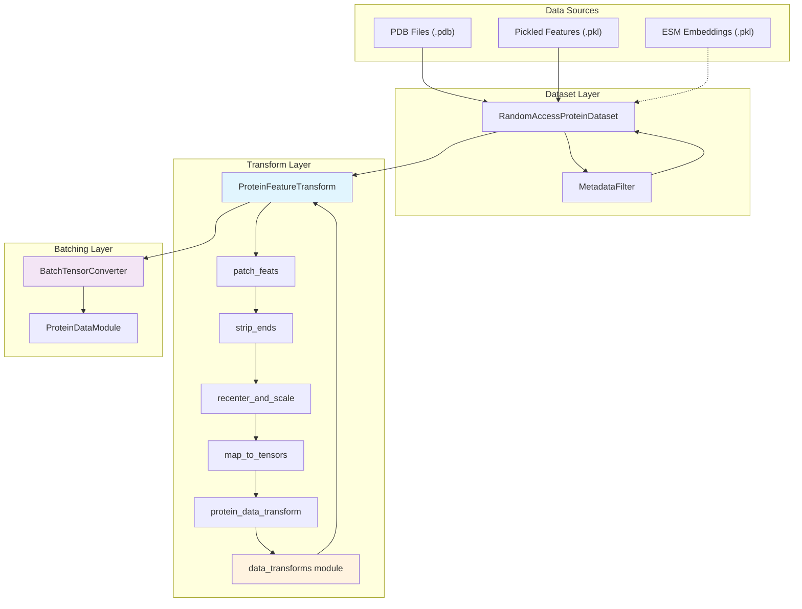
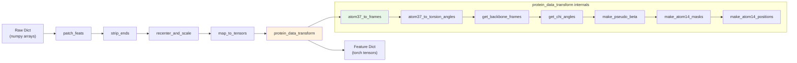

---
slug:16-protein-dataset-and-transforms
blog_type:normal
---

蛋白质数据管道是整个系统的入口点。它将原始结构生物学文件（PDB 字符串和序列化保存的特征字典）转换为富含张量的特征图，供 IDPFold 的扩散骨干网络使用。本页将深入剖析构成该管道的三个架构层：将 PDB 文件解析为规范 numpy 数组的 **`Protein` 数据类**、通过元数据过滤管理文件级 I/O 的 **`RandomAccessProteinDataset`** 系列类，以及编排六阶段特征提取级联（生成刚体坐标系、扭转角、atom14 位置和伪 Beta 坐标）的 **`ProteinFeatureTransform`** 引擎。理解该管道是配置 Hydra 数据集参数以及追踪真实结构信号如何到达得分匹配损失的前提。

来源：[protein.py](/src/common/protein.py#L34-L289), [dataset.py](/src/data/components/dataset.py#L1-L327), [data_transforms.py](/src/common/data_transforms.py#L1-L1195), [protein_datamodule.py](/src/data/protein_datamodule.py#L1-L243)

## 架构：从 PDB 文件到批处理张量

数据管道遵循严格单向流。原始结构文件进入数据集层，穿过特征转换管道，由自定义转换器整理为填充后的批次，最终通过数据模块交付给 Lightning 训练器。每一层都有明确的责任边界，且整个调用链可通过 Hydra 的 `_target_` 实例化系统进行组合。

`ProteinDataModule` 充当了由 Lightning 编排的包装器，将数据集、转换和整理逻辑整合在一起。其在 `configs/data/protein.yaml` 中的配置展示了完整的实例化图谱：带有 `MetadataFilter`（长度 10–500 个残基）的 `PretrainPDBDataset` 与 `ProteinFeatureTransform`（启用重新居中，无截断），最终输入至负责处理变长填充的 `BatchTensorConverter`。

来源：[protein.yaml](/configs/data/protein.yaml#L1-L26), [protein_datamodule.py](/src/data/protein_datamodule.py#L60-L195)

## `Protein` 数据类：规范化结构表示

该管道的基础是一个不可变数据类，它定义了蛋白质结构最简且明确的表示形式。每个字段均是以残基位置为索引的 numpy 数组，且该类实施了一项硬性约束：链数不得超过 62 条（即 PDB 格式的链 ID 上限）。

| 字段 | 形状 | 描述 |
|---|---|---|
| `atom_positions` | `[num_res, 37, 3]` | 笛卡尔坐标，单位为埃（Ångströms）；37 = `atom_type_num` |
| `aatype` | `[num_res]` | 整数 0–20（20 = 未知类型 'X'） |
| `atom_mask` | `[num_res, 37]` | 表示原子是否存在的二值浮点掩码 |
| `residue_index` | `[num_res]` | PDB 残基编号（不一定从 0 开始） |
| `chain_index` | `[num_res]` | 每个残基所属链的标识符（从 0 开始索引） |
| `b_factors` | `[num_res, 37]` | 温度因子，单位为平方埃（Ų） |

37 原子表示法遵循 AlphaFold 的 `atom_types` 约定，原子名称按字母顺序排列：`['N', 'CA', 'C', 'CB', 'O', 'CG', ...]`。`atom_order` 字典将每个名称映射至其列索引。这种定宽编码允许不论残基类型如何都能进行统一的张量表示——甘氨酸只是在 CB 列及之后的位置填充零。

<CgxTip>
`from_pdb_string` 函数会跳过满足 `np.sum(mask) < 0.5`（无已知原子位置）的残基，并将所有非标准残基转换为 'UNK'（索引 20）。这意味着具有重度修饰或缺失骨架原子的 PDB 文件在解析时会静默丢失残基。加载前后请务必核对残基数量。
</CgxTip>

`from_prediction` 工厂方法提供了逆向路径：将模型输出（`structure_module` 的结果）与输入特征组装成 `Protein` 对象。此方法在推理阶段用于构建最终结构以进行 PDB 序列化。`to_pdb` 方法生成具有严格 80 字符行填充的列式 PDB 文本，并处理多链 TER 记录及甘氨酸 CB 原子的省略。

来源：[protein.py](/src/common/protein.py#L34-L66), [protein.py](/src/common/protein.py#L72-L143), [protein.py](/src/common/protein.py#L152-L234), [residue_constants.py](/src/common/residue_constants.py#L490-L499)

## 数据集层：文件 I/O 与元数据过滤

### `RandomAccessProteinDataset`

基础数据集类支持由 `path_to_dataset` 参数决定的三种输入模式：

- **CSV 文件**：读取一个包含 `processed_path` 列的元数据表，该列指向各个 `.pkl` 文件，并按 `modeled_seq_len` 降序排列以实现高效批处理
- **目录**：通过 Glob 匹配指定目录中符合后缀（`.pkl` 或 `.pdb`）的所有文件
- **Glob 模式**：直接展开 Shell 风格的路径模式

`__getitem__` 方法被 `@lru_cache(maxsize=100)` 装饰，可在内存中缓存最多 100 个已加载的样本。对于中小型数据集而言，这是一项重大优化，否则在重复的 Epoch 遍历中将不得不重新从磁盘解析 PDB 文件。对于 `.pdb` 文件，每次访问都会触发 `protein.from_pdb_string()` 并随后执行 `.to_dict()` 转换。对于 `.pkl` 文件，序列化对象将被直接加载——这些是预处理的特征字典，完全绕过了 PDB 解析过程。

若提供了 `path_to_seq_embedding`，数据集将从独立的 pickle 目录中加载 ESM-2 表示，并以登录码前缀（按 `_` 分割）作为索引键。该嵌入项作为 `data_object['seq_emb']` 注入，携带了来自 ESM 模型的原始 `representations` 张量。这种设计将结构数据与序列嵌入干净地分离开来，允许二者独立更新。

来源：[dataset.py](/src/data/components/dataset.py#L191-L291)

### 数据集变体

两个特化子类通过不同的默认配置扩展了基础数据集：

| 类 | 用例 | 核心约束 |
|---|---|---|
| `PretrainPDBDataset` | 训练阶段 | 需配置 `metadata_filter` 和 `transform`；必须提供 `path_to_seq_embedding` |
| `SamplingPDBDataset` | 推理/采样 | `training=False`；路径仅限目录；无元数据过滤；默认后缀为 `.pdb` |

`SamplingPDBDataset` 强制要求 `os.path.isdir(path_to_dataset)`，因为推理过程针对的是待折叠的 PDB 文件目录，而非预先索引的 CSV。它还接受可选的 `accession_code_filter`，以便根据文件名主干筛选特定结构。

来源：[dataset.py](/src/data/components/dataset.py#L293-L327)

### `MetadataFilter`

元数据过滤器在提取文件路径之前对 CSV DataFrame 进行操作，应用一系列可选的谓词逻辑：

| 参数 | 过滤逻辑 | 配置默认值 |
|---|---|---|
| `min_len` / `max_len` | `raw_seq_len` 边界 | 10 / 500 |
| `min_chains` / `max_chains` | `num_chains` 边界 | None |
| `min_resolution` / `max_resolution` | `resolution` 边界 | None |
| `include_structure_method` | 白名单过滤 | None |
| `include_oligomeric_detail` | 白名单过滤 | None |

该过滤器在每次调用时都会打印一行摘要信息（`>>> Filter out N samples out of M by the metadata filter`），使得数据集的筛选过程具有可见性。

来源：[dataset.py](/src/data/components/dataset.py#L147-L188), [protein.yaml](/configs/data/protein.yaml#L8-L11)

## 转换管道：`ProteinFeatureTransform`

`ProteinFeatureTransform` 类是数据管道的计算核心。其 `__call__` 方法执行严格的六阶段序列，将原始特征字典（来自 PDB 解析的 numpy 数组）转换为富含特征的张量字典，以供扩散模型使用。

### 阶段 1：`patch_feats` — 辅助掩码与索引

该静态方法根据原始原子掩码和残基索引计算多个派生字段。CA 原子掩码（从 `atom_order['CA']` 获取的列索引 = 1）被同时用作 `seq_mask` 和 `residue_mask`——这是一个刻意的设计选择，因为 CA 原子的存在是残基已被建模的最强指标。`residue_idx` 被归一化为从 0 开始，同时保留链断裂处（原始 `residue_index` 中的间隙）。此外，还初始化了两个占位字段：`fixed_mask`（全零，在推理阶段为受约束残基设置）和 `sc_ca_t`（形状为 `[L, 3]` 的零矩阵，作为侧链 CA 平移的占位符）。

来源：[dataset.py](/src/data/components/dataset.py#L70-L84)

### 阶段 2：`strip_ends` — 移除未建模的末端残基

N 端和 C 端被标记为 'UNK'（aatype = 20）的残基将通过 `tree.map_structure` 被剥离，以同步切片所有数组类型的字段。这确保了模型绝不会遇到由于 PDB 条目不完整而产生的前导或尾随填充。

来源：[dataset.py](/src/data/components/dataset.py#L86-L93)

### 阶段 3：`recenter_and_scale_coords` — 几何归一化

骨架质心被计算为 CA 位置按序列掩码加权的平均值，随后从所有原子位置中减去该值。结果通过 `coordinate_scale`（埃为 1.0，纳米为 0.1）进行缩放，并使用 `atom_mask` 重新掩码以将缺失原子置零。`eps=1e-8` 防止了在所有原子均缺失的情况下发生除以零的错误。

<CgxTip>
重新居中操作仅使用 CA 位置（而非全原子质心），这意味着扩散模型的坐标系锚定在骨架质心上。这对于 SE(3) 扩散过程至关重要，该过程操作的是相对于此规范原点的刚体平移。
</CgxTip>

来源：[dataset.py](/src/data/components/dataset.py#L116-L123)

### 阶段 4：`map_to_tensors` — NumPy 到 PyTorch 的转换

所有值均通过 `torch.as_tensor` 转换为 PyTorch 张量。三个键被显式转换数据类型：`aatype` → `torch.long`，`atom_positions` → `torch.double`，`atom_mask` → `torch.double`。坐标采用双精度是刻意为之的——在 `atom37_to_torsion_angles` 的文档中记载，下游扭转角的计算“对浮点数的不精确性极其敏感”。

来源：[dataset.py](/src/data/components/dataset.py#L106-L113), [data_transforms.py](/src/common/data_transforms.py#L929-L933)

### 阶段 5：`protein_data_transform` — 深度特征提取

此处执行的是衍生自 AlphaFold 的转换链。该方法首先将 `atom_positions`/`atom_mask` 别名为 `all_atom_positions`/`all_atom_mask`（这是转换函数所期望的命名约定），然后按顺序运行六个转换，最后清理别名。

来源：[dataset.py](/src/data/components/dataset.py#L125-L144)

#### 5a. `atom37_to_frames` — 刚体分解

该函数将每个残基的 37 原子表示分解为每个残基的 **8 个刚体组**，生成供扩散模型学习去噪的真实刚体坐标系。这 8 个组分别是：

| 组索引 | 名称 | 原子 |
|---|---|---|
| 0 | 骨架 (Backbone) | C, CA, N |
| 1 | Pre-omega | （空） |
| 2 | Phi | （空，仅含氢原子） |
| 3 | Psi | CA, C, O |
| 4–7 | Chi1–Chi4 | 侧链旋转异构体 |

每个坐标系通过 `Rigid.from_3_points()` 利用三个参考原子构建，然后与一个修正旋转组合，该旋转会翻转组 0 的 x 轴和 z 轴以匹配 AlphaFold 的约定。对于具有歧义原子命名的残基（ASP、GLU、PHE、TYR），该函数还使用 `residue_atom_renaming_swaps` 置换矩阵计算其替代表征系。

输出包含 `rigidgroups_gt_frames` `[*, N_res, 8, 4, 4]`（齐次变换矩阵）、`rigidgroups_gt_exists`（二值掩码）以及 `rigidgroups_alt_gt_frames`（歧义替代表征系）。

来源：[data_transforms.py](/src/common/data_transforms.py#L758-L894)

#### 5b. `atom37_to_torsion_angles` — 骨架与侧链二面角

此转换计算每个残基的 **7 个扭转角**：pre-omega (C'-N-CA-C)、phi (N-CA-C-N')、psi (CA-C-N'-CA') 以及 chi1–chi4。计算遵循标准二面角公式，使用 `Rigid.from_3_points` 从中间两个原子构建局部坐标系，然后将第四个原子投影到该坐标系中以提取正弦/余弦分量。

该函数对第一个残基进行特殊处理（由于不存在前一个残基，故 pre-omega 和 phi 角不存在）并通过填充零来实现。具有歧义的 chi 角（对于 ASP、GLU、PHE、TYR 具有 π 周期性）通过 `alt_torsion_angles_sin_cos` 产生镜像替代项。

输出特征：`torsion_angles_sin_cos` `[*, N_res, 7, 2]`、`alt_torsion_angles_sin_cos` `[*, N_res, 7, 2]`、`torsion_angles_mask` `[*, N_res, 7]`。

来源：[data_transforms.py](/src/common/data_transforms.py#L924-L1090), [residue_constants.py](/src/common/residue_constants.py#L34-L111)

#### 5c. `get_backbone_frames` 和 `get_chi_angles` — 便捷提取

这些是轻量级的切片操作。`get_backbone_frames` 从 `rigidgroups_gt_frames` 中提取组 0，存入 `backbone_rigid_tensor` `[*, N_res, 4, 4]` 及其存在掩码。`get_chi_angles` 从索引 3 开始（chi1–chi4）切片扭转角，存入 `chi_angles_sin_cos` `[*, N_res, 4, 2]` 和 `chi_mask`。

来源：[data_transforms.py](/src/common/data_transforms.py#L1093-L1110)

#### 5d. `make_pseudo_beta` — 近似骨架迹线

对于每个残基，伪 Beta 位置即为 CB 坐标（对于缺乏 CB 的甘氨酸，则使用 CA）。这产生了一条简化的骨架迹线，用于基于距离的损失计算和结构可视化。该函数同时返回位置和二值掩码。

来源：[data_transforms.py](/src/common/data_transforms.py#L370-L402)

#### 5e. `make_atom14_masks` 和 `make_atom14_positions` — 紧凑原子表示

37 原子表示包含许多空槽位（例如，TRP 有 14 个原子却占据了 37 列）。atom14 表示利用定义在 `restype_name_to_atom14_names` 中的残基类型映射表，将每个残基精确压缩至 14 个槽位。

`make_atom14_masks` 构建正向和反向索引映射（`residx_atom14_to_atom37`、`residx_atom37_to_atom14`）及存在掩码。`make_atom14_positions` 将真实坐标收集至 14 槽位格式中，使用重命名矩阵（每种残基类型对应一个 14×14 的置换矩阵）计算歧义原子的替代位置，并使用 `atom14_atom_is_ambiguous` 标记歧义原子。

| 输出特征 | 形状 | 用途 |
|---|---|---|
| `atom14_atom_exists` | `[N_res, 14]` | 单原子存在掩码 |
| `atom14_gt_positions` | `[N_res, 14, 3]` | 真实坐标 |
| `atom14_gt_exists` | `[N_res, 14]` | GT 存在性（existence × atom_mask） |
| `atom14_alt_gt_positions` | `[N_res, 14, 3]` | 重命名后的替代位置 |
| `atom14_alt_gt_exists` | `[N_res, 14]` | 替代位置存在掩码 |
| `atom14_atom_is_ambiguous` | `[N_res, 14]` | 歧义标记 |

来源：[data_transforms.py](/src/common/data_transforms.py#L575-L755), [residue_constants.py](/src/common/residue_constants.py#L504-L527)

## 批处理：`BatchTensorConverter`

变长蛋白质无法简单地堆叠成张量。`BatchTensorConverter` 实现了一个自定义整理函数，将所有张量类型的字段沿各轴填充至最大维度，并用零填补。非张量字段（如字符串、像 `accession_code` 的整数）则被收集为列表。

`collate_dense_tensors` 静态方法处理核心填充逻辑：它确定批次中所有样本的最大形状，分配一个填满零的结果张量，并将每个样本复制到其对应的切片中。这种方法与维度数量无关——像 `aatype` 这样的 1D 数组和像 `atom_positions` 这样的 3D 数组均由相同的代码路径处理。

若未指定 `target_keys`，转换器会使用 `torch.is_tensor()` 检查首个样本，从而自动检测张量键。这意味着转换管道添加的任何字段（刚体坐标系、扭转角、atom14 位置等）都会被自动整理，无需显式注册。

来源：[protein_datamodule.py](/src/data/protein_datamodule.py#L9-L57)

## 数据模块：`ProteinDataModule`

`ProteinDataModule` 包装了数据集并提供兼容 Lightning 的数据加载钩子。在 `setup` 期间，它会针对分布式训练调整单设备批大小（除以 `world_size`），并使用 `torch.Generator().manual_seed(42)` 执行确定性的训练/验证集划分。在预测/测试阶段，则直接使用整个数据集而不进行划分。

`_dataloader_template` 方法创建一个 `DataLoader`，并将 `BatchTensorConverter` 作为其整理函数。`protein.yaml` 中的关键配置参数如下：

| 参数 | 默认值 | 作用 |
|---|---|---|
| `batch_size` | 2 | 在 DDP 中必须能被 `world_size` 整除 |
| `num_workers` | 4 | 并行数据加载工作进程数 |
| `pin_memory` | false | GPU 内存锁定（默认禁用） |
| `shuffle` | false | 样本顺序 |
| `generator_seed` | 42 | 训练/验证集划分的可复现性 |
| `train_val_split` | [0.95, 0.05] | 95% 训练集，5% 验证集 |

来源：[protein_datamodule.py](/src/data/protein_datamodule.py#L60-L243), [protein.yaml](/configs/data/protein.yaml#L20-L26)

## 完整特征清单

下表编录了经历完整转换管道后，输出字典中存在的所有特征键，并按来源阶段进行组织：

| 特征 | 形状（单样本） | 来源阶段 | dtype |
|---|---|---|---|
| `aatype` | `[N_res]` | Raw / map_to_tensors | long |
| `atom_positions` | `[N_res, 37, 3]` | Raw / recentered | double |
| `atom_mask` | `[N_res, 37]` | Raw | double |
| `residue_index` | `[N_res]` | Raw | long |
| `chain_index` | `[N_res]` | Raw | long |
| `b_factors` | `[N_res, 37]` | Raw | double |
| `seq_mask` | `[N_res]` | patch_feats | double |
| `residue_mask` | `[N_res]` | patch_feats | double |
| `residue_idx` | `[N_res]` | patch_feats | int64 |
| `fixed_mask` | `[N_res]` | patch_feats | double |
| `sc_ca_t` | `[N_res, 3]` | patch_feats | double |
| `rigidgroups_gt_frames` | `[N_res, 8, 4, 4]` | atom37_to_frames | double |
| `rigidgroups_gt_exists` | `[N_res, 8]` | atom37_to_frames | double |
| `rigidgroups_group_exists` | `[N_res, 8]` | atom37_to_frames | double |
| `rigidgroups_alt_gt_frames` | `[N_res, 8, 4, 4]` | atom37_to_frames | double |
| `torsion_angles_sin_cos` | `[N_res, 7, 2]` | atom37_to_torsion_angles | double |
| `alt_torsion_angles_sin_cos` | `[N_res, 7, 2]` | atom37_to_torsion_angles | double |
| `torsion_angles_mask` | `[N_res, 7]` | atom37_to_torsion_angles | double |
| `backbone_rigid_tensor` | `[N_res, 4, 4]` | get_backbone_frames | double |
| `backbone_rigid_mask` | `[N_res]` | get_backbone_frames | double |
| `chi_angles_sin_cos` | `[N_res, 4, 2]` | get_chi_angles | double |
| `chi_mask` | `[N_res, 4]` | get_chi_angles | double |
| `pseudo_beta` | `[N_res, 3]` | make_pseudo_beta | double |
| `pseudo_beta_mask` | `[N_res]` | make_pseudo_beta | double |
| `atom14_atom_exists` | `[N_res, 14]` | make_atom14_masks | float32 |
| `residx_atom14_to_atom37` | `[N_res, 14]` | make_atom14_masks | long |
| `residx_atom37_to_atom14` | `[N_res, 37]` | make_atom14_masks | long |
| `atom37_atom_exists` | `[N_res, 37]` | make_atom14_masks | float32 |
| `atom14_gt_positions` | `[N_res, 14, 3]` | make_atom14_positions | double |
| `atom14_gt_exists` | `[N_res, 14]` | make_atom14_positions | double |
| `atom14_alt_gt_positions` | `[N_res, 14, 3]` | make_atom14_positions | double |
| `atom14_alt_gt_exists` | `[N_res, 14]` | make_atom14_positions | double |
| `atom14_atom_is_ambiguous` | `[N_res, 14]` | make_atom14_positions | double |
| `seq_emb` | `[N_res, D]` | ESM embedding (optional) | float32 |
| `accession_code` | string | Dataset `__getitem__` | — |

来源：[dataset.py](/src/data/components/dataset.py#L48-L144), [data_transforms.py](/src/common/data_transforms.py#L575-L1110)

## 后续内容

掌握了完整的特征清单后，接下来的自然步骤是了解序列嵌入是如何生成的——[ESM 序列嵌入提取](17-esm-sequence-embedding-extraction) 页面涵盖了填充 `seq_emb` 字段的 ESM-2 模型集成。关于这些特征在训练循环中如何被下游消费，请参阅 [训练循环与模型步进](13-training-loop-and-model-step)。批处理与 DataLoader 机制的更多细节在 [数据模块与批处理](18-data-module-and-batching) 中有进一步说明。