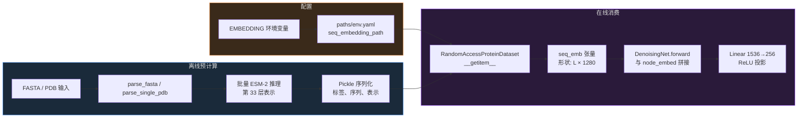
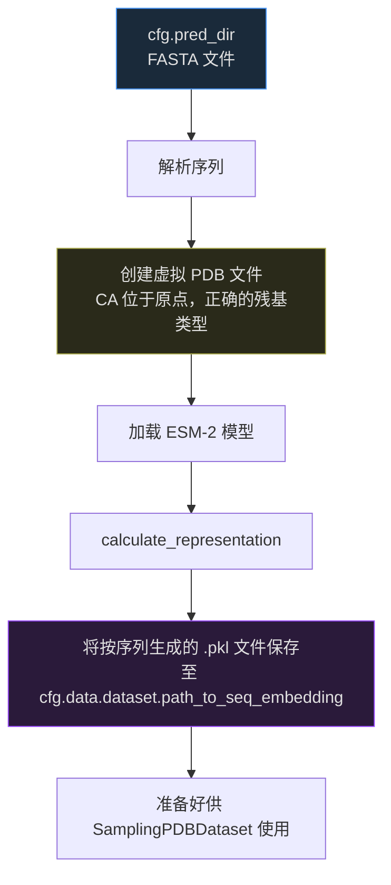

---
slug:17-esm-sequence-embedding-extraction
blog_type:normal
---


IDPFold 利用 **Evolutionary Scale Modeling (ESM-2)** 将丰富的进化和结构先验知识注入其去噪扩散网络中。该流程不再单纯依赖独热氨基酸编码，而是通过 `esm2_t33_650M_UR50D` 模型（一个在 UniRef50 数据库上训练、拥有 6.5 亿参数的 Transformer）预计算每个残基的嵌入向量，并将其作为辅助节点特征输入到神经网络主干中。本页文档记录了该嵌入向量的完整生命周期：从 FASTA/PDB 序列解析，到批量 ESM-2 推理、pickle 序列化、下游数据集加载，最终集成至 `DenoisingNet` 的前向传播过程。

---

## 架构概述：嵌入流程一览

ESM 嵌入子系统跨越代码库的四层，形成了一条从原始序列输入到网络就绪张量的线性数据流管道。理解离线预计算与在线消费之间的边界至关重要——嵌入向量**仅预计算一次**并以 pickle 文件缓存，随后在训练或推理期间由数据集按需加载。



刻意区分离线与在线阶段是基于这样的考量：ESM-2 推理属于 GPU 密集型任务（6.5 亿参数，$O(L^2)$ 复杂度的注意力机制），因此将输出缓存为 pickle 文件可避免跨训练周期产生冗余的前向传播。每个残基 **1280** 的嵌入维度是 `esm2_t33_650M_UR50D` 模型隐藏层的固定属性，下游网络架构的尺寸也已明确适配该维度。

来源：[esm_extract.py](/src/utils/esm_extract.py#L1-L130), [denoising_ipa.py](/src/models/net/denoising_ipa.py#L162-L221), [dataset.py](/src/data/components/dataset.py#L256-L290)

---

## ESM-2 模型选择与配置常量

提取模块在文件顶部硬编码了一组操作常量。这些常量不可通过 Hydra 配置——它们是模块级的全局变量，旨在运行提取脚本前直接修改。

| 常量 | 默认值 | 用途 |
|---|---|---|
| `SEQ_FLAG` | `"train"` | 序列处理标志（当前逻辑中未使用） |
| `SEQ_THERSHOLD` | `1000` | 嵌入的最大序列长度；超长序列将被过滤掉 |
| `BATCH_SIZE` | `8` | 每次 ESM-2 前向传播处理的序列数量 |
| `CUDA_DEVICE` | `'cuda:0'` | 推理的目标 GPU 设备 |

ESM 模型通过 `esm.pretrained.esm2_t33_650M_UR50D()` 加载，该方法在首次使用时会下载预训练权重，并返回一个 `(model, alphabet)` 元组。**alphabet** 对象提供了 `get_batch_converter()` 方法来处理分词——即将氨基酸字符串转换为整数 token 序列，并自动添加序列起始符（BOS，索引为 0）和序列终止符（EOS）。此处选择第 **33** 层作为表示层，它是该模型变体的最后一个 Transformer 层，能生成信息最丰富的残基级上下文嵌入。

<CgxTip>模型名称 `esm2_t33_650M_UR50D` 包含三个关键参数：`t33` = 33 个 Transformer 层，`650M` = 参数量，`UR50D` = 在 UniRef50 上训练。表示维度（1280）是该架构的固有属性，而非可配置参数。</CgxTip>

来源：[esm_extract.py](/src/utils/esm_extract.py#L12-L17), [esm_extract.py](/src/utils/esm_extract.py#L86-L87)

---

## 序列解析：FASTA 与 PDB 输入模式

该模块支持两种不同的输入格式，每种格式均由专用的解析函数和入口点提供服务。

### FASTA 解析

`parse_fasta()` 函数读取多条目的 FASTA 文件，以 `>` 分隔符拆分条目。对于每个条目，第一行作为**头部信息**（用作序列标签），后续行拼接为**序列字符串**。终止密码子（`*`）会被剔除。关键的过滤步骤会执行 `SEQ_THERSHOLD` 检查——由于 ESM-2 二次方复杂度的注意力机制会使长序列在内存和计算上的开销极其高昂，因此超过 1000 个残基的序列会被静默丢弃。

```python
def parse_fasta(filename):
    with open(filename, 'r') as f:
        contents = f.read().split('>')[1:]
        data = []
        for entry in contents:
            lines = entry.split('\n')
            header = lines[0]
            sequence = ''.join(lines[1:])
            sequence = sequence.replace("*", "") if "*" in sequence else sequence
            if len(sequence) <= SEQ_THERSHOLD:
                data.append((header, sequence))
    return data
```

返回类型为 `(header, sequence)` 元组列表——这正是 ESM 的 `batch_converter` 所期望的格式。

### PDB 解析

对于结构数据，`parse_single_pdb()` 使用 **biotite** 库加载 PDB 文件，并通过 `pdbx.get_sequence()` 提取其序列。该路径由 `main_pdb()` 入口点调用，它会遍历目录中的所有 `.pdb` 文件，提取序列，然后运行相同的批量嵌入流程。

| 输入模式 | 入口函数 | 解析器 | 标签来源 | 输出结构 |
|---|---|---|---|---|
| FASTA 文件 | `main(input_file, output_file)` | `parse_fasta()` | FASTA 头部行 | 包含所有序列的单个 pickle 文件 |
| PDB 目录 | `main_pdb(input_path, output_path)` | `parse_single_pdb()` | PDB 文件名 | 每个 PDB 文件对应一个 pickle 文件 |

FASTA 路径将所有嵌入合并至单个 pickle 文件中，而 PDB 路径会写入以各个 PDB 文件命名的独立 pickle 文件（例如 `1abc.pdb` → `1abc.pkl`）。此区别对下游加载至关重要，因为数据集的 `__getitem__` 方法预期每个登录码对应一个 pickle 文件。

来源：[esm_extract.py](/src/utils/esm_extract.py#L20-L41), [esm_extract.py](/src/utils/esm_extract.py#L80-L125), [example.fasta](/data/example.fasta#L1-L6)

---

## 批量 ESM-2 推理：`calculate_representation` 函数

这是提取流程的计算核心。它接收已加载的 ESM 模型、alphabet、解析后的序列数据和设备，随后执行批量前向传播以生成残基级嵌入向量。

### 处理逻辑

该函数将输入序列划分为大小为 `BATCH_SIZE`（默认为 8）的批次。对于每个批次，**batch converter** 会将 `(label, sequence)` 元组转换为 `(batch_labels, batch_strs, batch_tokens)` ——其中 `batch_tokens` 是形状为 `(B, max_len + 2)` 的填充整数张量（`+2` 对应 BOS/EOS token）。序列长度通过计算非填充 token 的数量得出。

关键的提取代码行如下：

```python
token_representations = model(batch_tokens, repr_layers=[33], return_contacts=True)["representations"][33]
```

此行仅请求第 33 层的输出（最终隐藏状态），生成形状为 `(B, max_len + 2, 1280)` 的张量。`return_contacts=True` 标志也会计算注意力接触图，尽管这些图不会保留在输出中。

### Token 剔除：移除特殊 Token

对于批次中的每个序列，BOS（索引 0）和 EOS token 会被剔除：

```python
sequence_representations.append(token_representations[i, 1: tokens_len - 1].cpu())
```

这种切片操作 `[1: tokens_len - 1]` 移除了开头的 BOS token 和结尾的 EOS token，生成形状为 `(L_i, 1280)` 的张量——即每个残基精确对应一个 1280 维向量。请注意，注释掉的备选方案（`.mean(0)`）会通过平均化生成单个序列级（而非残基级）嵌入；IDPFold 正确使用了残基级表示，因为去噪网络是在单个残基帧上进行操作的。

### 内存管理

在处理完每个批次后，该函数会显式删除中间变量并调用 `torch.cuda.empty_cache()` 以防止 GPU 内存碎片化——鉴于 ESM-2 在推理期间会占用大量内存，这是一项非常实用的措施。进度信息通过回车符覆写（`end="\r"`）输出，在提供实时反馈的同时避免控制台输出泛滥。

来源：[esm_extract.py](/src/utils/esm_extract.py#L43-L71)

---

## 序列化格式与存储

`save_representation()` 函数将包含三个键的字典序列化为 pickle 文件：

| 键 | 类型 | 内容 |
|---|---|---|
| `labels` | `list[str]` | 序列标识符（FASTA 头部或 PDB 文件名） |
| `sequences` | `list[str]` | 字符串形式的氨基酸序列 |
| `representations` | `list[Tensor]` 或 `Tensor` | 残基级嵌入，每个形状为 `(L, 1280)` |

FASTA 入口点（`main()`）将所有序列存储在单个 pickle 文件中。PDB 入口点（`main_pdb()`）和由 Hydra 编排的 `read_seqs.py` 则各自写入**每个序列一个 pickle 文件**，并以登录码作为文件名。这种按序列存储的格式正是数据集加载器所预期的——它从单个序列的 pickle 文件中读取 `embed_dict['representations']`。

来源：[esm_extract.py](/src/utils/esm_extract.py#L74-L77), [esm_extract.py](/src/utils/esm_extract.py#L122-L123), [read_seqs.py](/src/read_seqs.py#L57-L58)

---

## Hydra 编排的提取：`read_seqs.py` 入口点

虽然 `esm_extract.py` 可以通过 `python esm_extract.py <input> <output>` 独立运行，但项目在 `read_seqs.py` 中提供了一个由 Hydra 配置驱动的、更集成的入口点。该脚本充当**推理时的嵌入生成器**——它为将通过扩散采样器的序列准备嵌入向量。

### 工作流程

该脚本读取由 `cfg.pred_dir` 指定的 FASTA 文件，然后数据集目录中创建**虚拟 PDB 文件**。这些是仅包含放置在坐标原点 `(0, 0, 0)` 处的 C-alpha 原子的最小化 PDB 结构，并附带正确的残基类型和编号。这是一个巧妙的设计：下游的 `SamplingPDBDataset` 预期以 PDB 文件作为结构输入，但在推理时，唯一可用的结构信息只有序列本身。虚拟 PDB 满足了数据集对文件格式契约的要求，而实际的结构信号则来自于 ESM 嵌入和扩散过程。



残基类型映射使用硬编码的字典，将单字母氨基酸代码映射为三字母 PDB 残基名称（例如 `'A' → 'ALA'`，`'W' → 'TRP'`）。每行虚拟 PDB 记录均遵循标准的 ATOM 记录格式，包含 C-alpha 原子、占位度为 1.00、温度因子为 0.00。

来源：[read_seqs.py](/src/read_seqs.py#L1-L62), [eval.yaml](/configs/eval.yaml#L1-L20)

---

## 配置：环境变量与路径解析

嵌入路径通过 Hydra 配置系统经由环境变量进行连接，从而确保在不同部署环境间的可移植性。

该链路流经三个配置文件：

1. **`configs/paths/env.yaml`** — 将环境变量映射为具名的路径键：
   - `EMBEDDING` → `seq_embedding_path`
   - `TRAIN_DATA` → `data_path`
   - `TEST_DATA` → `test_data_path`

2. **`configs/data/protein.yaml`**（训练）— 在 `PretrainPDBDataset` 配置中引用 `path_to_seq_embedding: ${paths.seq_embedding_path}`。

3. **`configs/data/sampling.yaml`**（推理）— 为 `SamplingPDBDataset` 提供相同的引用。

这意味着用户在运行训练或评估之前，必须将 `EMBEDDING` 环境变量设置为包含预计算 `.pkl` 嵌入文件的目录。

| 配置文件 | 环境变量 | 配置键 | 使用方 |
|---|---|---|---|
| `paths/env.yaml` | `EMBEDDING` | `seq_embedding_path` | 所有数据配置 |
| `paths/env.yaml` | `TRAIN_DATA` | `data_path` | `protein.yaml` |
| `paths/env.yaml` | `TEST_DATA` | `test_data_path` | `sampling.yaml` |
| `paths/env.yaml` | `CACHE_DIR` | `cache_dir` | SO3 diffuser 缓存 |

来源：[env.yaml](/configs/paths/env.yaml#L1-L8), [protein.yaml](/configs/data/protein.yaml#L1-L26), [sampling.yaml](/configs/data/sampling.yaml#L1-L20)

---

## 下游消费：数据集加载

`RandomAccessProteinDataset.__getitem__()` 方法是缓存的嵌入向量重新进入流程的入口。在加载并转换蛋白质结构数据后，它会检查是否配置了 `path_to_seq_embedding`。如果已配置，则通过**登录码**解析嵌入文件并加载：

```python
embedding_code = accession_code.split('_')[0]
with open(os.path.join(self.path_to_seq_embedding, f"{embedding_code}.pkl"), 'rb') as f:
    embed_dict = pickle.load(f)
data_object.update({
    'seq_emb': torch.FloatTensor(embed_dict['representations']),
})
```

`embedding_code` 是通过在 `_` 处拆分登录码并取第一部分获得的——这使得多链或多模型 PDB 文件（例如 `1abc_A.pdb`）能够共享单个嵌入文件（`1abc.pkl`）。来自 pickle 文件的 `'representations'` 键被转换为 `FloatTensor`，并存储在特征字典的 `'seq_emb'` 键下，随后由 `BatchTensorConverter` 整理并传递给模型。

<CgxTip>数据集在 `__getitem__` 上使用了 `@lru_cache(maxsize=100)`，这意味着频繁访问的蛋白质条目（包括其 ESM 嵌入）在首次加载后会被缓存在内存中。这在多轮周期训练中尤为有益，因为它避免了针对最近访问的 100 个结构进行冗余的磁盘 I/O 和 pickle 反序列化操作。</CgxTip>

来源：[dataset.py](/src/data/components/dataset.py#L255-L290), [protein_datamodule.py](/src/data/protein_datamodule.py#L9-L57)

---

## 集成至去噪网络

嵌入流程的最后阶段发生在 `DenoisingNet.forward()` 内部。当 `EmbeddingModule` 从位置、时间和自条件特征中生成节点与边嵌入后，ESM 序列嵌入会拼接到节点表示上：

```python
if 'seq_emb' in batch.keys():
    node_embed = torch.cat([node_embed, batch['seq_emb']], dim=-1)
    node_embed = F.relu(self.linear(node_embed))
```

### 维度流

| 阶段 | 张量 | 形状 | 来源 |
|---|---|---|---|
| ESM-2 输出（残基级） | `seq_emb` | `(L, 1280)` | 序列化的嵌入 |
| EmbeddingModule 输出 | `node_embed` | `(L, 256)` | 位置 + 时间 + 自条件 |
| 拼接 | — | `(L, 1536)` | 256 + 1280 |
| 线性投影 | — | `(L, 256)` | `nn.Linear(1536, 256)` + ReLU |
| 掩码后的节点嵌入 | — | `(L, 256)` | 乘以 `node_mask` |

`Linear(1536, 256)` 层在 `DenoisingNet.__init__()` 方法中初始化为 `self.linear = nn.Linear(1536, 256)`。此投影确保增强了 ESM 信息的节点表示能够匹配下游 `TranslationIPA` 模块所需的通道维度（`c_s = 256`）。ReLU 激活函数在表示进入 IPA 模块之前引入了非线性。

该拼接操作是**有条件的**——`if 'seq_emb' in batch.keys()` 的守护条件意味着网络能够优雅处理没有预计算嵌入的批次（例如未配置嵌入路径时）。这种设计选择允许相同的模型架构在有或无进化序列信息的情况下运行，尽管在无嵌入的情况下线性层的权重将不会被使用。

来源：[denoising_ipa.py](/src/models/net/denoising_ipa.py#L162-L221), [diffusion.yaml](/configs/model/diffusion.yaml#L16-L41)

---

## 嵌入维度验证：为什么是 1536？

1536 的拼接维度并非随意设定，而是两个由架构确定的值的精确总和：

- **256** — 即 `diffusion.yaml` 中 `EmbeddingModule` 配置的 `node_embed_size`，它通过位置编码（32 维）、时间步嵌入（32 维）、固定掩码特征（1 维）以及一个 3 层 MLP 投影生成节点嵌入。
- **1280** — `esm2_t33_650M_UR50D` 模型的隐藏层维度，这是 ESM-2 架构的固有属性，不切换到其他模型变体则无法更改。

这种耦合意味着，**更换 ESM 模型变体需要更新 `DenoisingNet.__init__()` 中线性层的输入维度**。例如，若切换至 `esm2_t12_35M_UR50D`（隐藏维度 480），则需要将配置改为 `nn.Linear(256 + 480, 256)` = `nn.Linear(736, 256)`。当前代码硬编码为 1536，使其成为一个已知的维护重点。

来源：[denoising_ipa.py](/src/models/net/denoising_ipa.py#L171), [diffusion.yaml](/configs/model/diffusion.yaml#L20-L22)

---

## 端到端流程总结

下表追溯了序列信息从原始输入到网络输入的完整旅程，标明了代码库中每次转换及其所在位置：

| 步骤 | 组件 | 输入 | 输出 | 文件 |
|---|---|---|---|---|
| 1 | `parse_fasta()` / `parse_single_pdb()` | FASTA/PDB 文件 | `[(label, seq), ...]` | `esm_extract.py` |
| 2 | `alphabet.get_batch_converter()` | `(label, seq)` 元组 | 已分词的填充张量 | `esm_extract.py` |
| 3 | ESM-2 前向传播（第 33 层） | Token 张量 `(B, L+2)` | 隐藏状态 `(B, L+2, 1280)` | `esm_extract.py` |
| 4 | Token 剔除 `[1:len-1]` | 隐藏状态 | 残基级嵌入 `(L, 1280)` | `esm_extract.py` |
| 5 | `save_representation()` | 嵌入 + 标签 | `.pkl` 文件 | `esm_extract.py` |
| 6 | `Dataset.__getitem__()` | `.pkl` 文件 + 登录码 | 特征字典中的 `seq_emb` 张量 | `dataset.py` |
| 7 | `BatchTensorConverter` | 特征字典列表 | 填充后的批次字典 | `protein_datamodule.py` |
| 8 | `DenoisingNet.forward()` | `node_embed` + `seq_emb` | 拼接 → 投影 `(L, 256)` | `denoising_ipa.py` |

---

## 后续步骤

在完整记录了 ESM 嵌入流程之后，顺理成章的下一步是了解数据模块如何编排批次，以及整理后的批次如何流入训练循环：

- [数据模块与批处理](18-data-module-and-batching) — 探讨 `ProteinDataModule`、`BatchTensorConverter`，以及将变长蛋白质特征填充为批量张量的整理逻辑。
- [蛋白质数据集与转换](16-protein-dataset-and-transforms) — 涵盖 `ProteinFeatureTransform` 流程，包括与 ESM 嵌入一同准备结构数据的 atom37 到帧的转换及坐标重置。
- [嵌入模块设计](10-embedding-module-design) — 详述生成 256 维节点嵌入的 `EmbeddingModule`，这些嵌入在去噪网络中与 ESM 特征拼接。