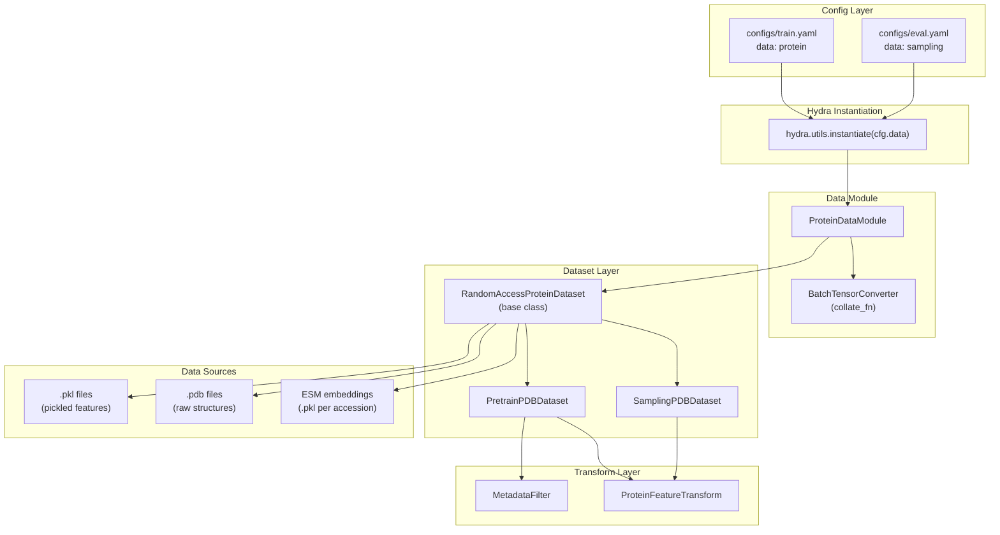
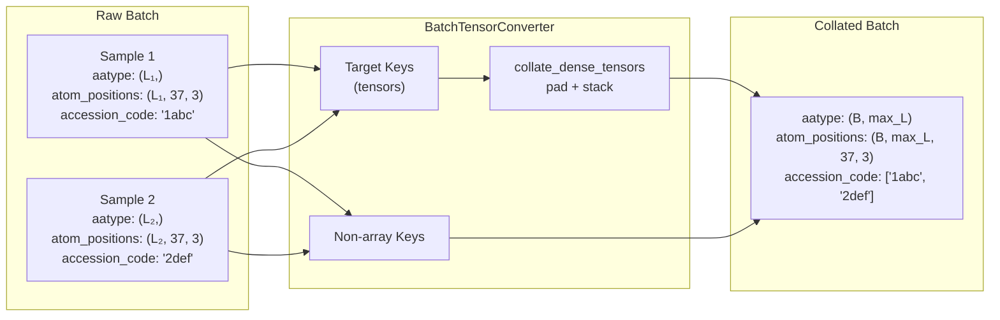
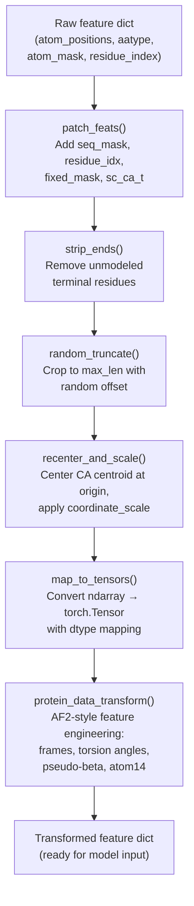

---
slug:18-data-module-and-batching
blog_type:normal
---


IDPFold 中的数据管道将原始蛋白质结构文件（序列化后的特征字典或 PDB 文件）衔接起来，转化为经过分批和填充的张量，以供扩散模型进行训练和推理。本文将深入剖析 `ProteinDataModule`、自定义的 `BatchTensorConverter` 整理策略，以及负责文件发现、特征转换和序列嵌入注入的数据集类。对于任何想要自定义训练数据来源、调整多 GPU 环境下的批处理策略，或将该管道扩展至新型蛋白质数据格式的开发者而言，深入理解这一层至关重要。

## 架构概览

该数据模块遵循 **递归 Hydra 实例化** 模式：顶层 `ProteinDataModule` 的 `dataset` 参数接收一个嵌套的 `_target_`，Hydra 会将其解析为完全构建好的数据集对象，然后再传递给数据模块的构造函数。这种设计将数据模块与任何特定的数据集实现解耦，使得训练和推理阶段的数据集能够共享同一模块，仅通过不同的 Hydra 配置组进行区分。



`train.py` 入口点通过 `hydra.utils.instantiate(cfg.data)` 实例化数据模块，该操作会在单次调用中递归构建 `ProteinDataModule` 及其嵌套的数据集、转换和过滤器对象。`eval.py` 入口点遵循相同的模式，但改为加载 `sampling.yaml` 配置组。

来源：[train.py](/src/train.py#L57-L58), [eval.py](/src/eval.py#L52-L53)

## ProteinDataModule：生命周期与阶段管理

`ProteinDataModule` 继承自 `LightningDataModule`，负责统筹数据集划分、单设备批大小计算以及 DataLoader 的构建。该模块接收一个预先构建好的数据集对象，以及用于数据划分、工作进程数和内存锁定的超参数。

### 构造函数与配置

构造函数通过 `self.save_hyperparameters(logger=False)` 存储所有超参数，以确保它们能够被序列化到 checkpoint 中。`dataset` 参数是唯一的非超参数属性——它直接持有由 Hydra 实例化的数据集。

| 参数 | 类型 | 默认值 | 用途 |
|---|---|---|---|
| `dataset` | `torch.utils.data.Dataset` | — | 由 Hydra 实例化的数据集（必填） |
| `batch_size` | `int` | `64` | 全局批大小；在 DDP 中除以 `world_size` |
| `generator_seed` | `int` | `42` | 用于保证 `random_split` 可复现性的随机种子 |
| `train_val_split` | `Tuple[float, float]` | `(0.95, 0.05)` | 训练/验证集的划分比例 |
| `num_workers` | `int` | `0` | DataLoader 的工作进程数 |
| `pin_memory` | `bool` | `False` | 是否为 GPU 传输锁定内存 |
| `shuffle` | `bool` | `False` | 是否在每个 epoch 打乱数据 |

<CgxTip>`batch_size` 表示跨越所有设备的**全局**批大小。在 `setup()` 期间，它会除以 `trainer.world_size` 来计算出单设备的批大小 `batch_size_per_device`。如果全局批大小不能被设备数整除，将抛出 `RuntimeError`——请始终将批大小设置为 GPU 数量的整数倍。</CgxTip>

来源：[protein_datamodule.py](/src/data/protein_datamodule.py#L74-L110)

### 基于阶段的设置

`setup()` 方法通过三个分支实现了 Lightning 的阶段协议：

- **`"fit"` 阶段**：使用配置的划分比例和带种子的生成器，对整个数据集执行 `random_split`。划分后的数据集会缓存在 `self.data_train` 和 `self.data_val` 中，以防止在后续调用时重复划分。
- **`"predict"` / `"test"` 阶段**：将整个数据集分配给 `self.data_test` 而不进行划分——用于推理阶段，此时必须处理每一个样本。
- **其他阶段**：抛出 `NotImplementedError`。

这种基于阶段的设计意味着，根据调用入口点的不同，同一个 `ProteinDataModule` 实例既可以用于训练（保留部分数据用于验证），也可以用于推理（使用完整数据集）。

来源：[protein_datamodule.py](/src/data/protein_datamodule.py#L125-L144)

### Dataloader 模板

三个 dataloader 方法（`train_dataloader`、`val_dataloader`、`test_dataloader`）均委托给一个统一的 `_dataloader_template` 方法。该方法会构建一个 `DataLoader`，并使用 `BatchTensorConverter` 作为其自定义整理函数。这确保了所有阶段中一致的批处理行为。

来源：[protein_datamodule.py](/src/data/protein_datamodule.py#L146-L162)

## BatchTensorConverter：变长蛋白质数据的整理

蛋白质结构的序列长度天然是可变的，这使得 PyTorch 默认的整理策略（要求张量形状一致）不再适用。`BatchTensorConverter` 通过执行**基于类型的分派整理**解决了这一问题：张量类型的键会被填充并堆叠为一个密集批次，而非张量类型的键（如字符串、整数、 accession 编号）则被收集至 Python 列表中。

### 整理逻辑

转换器会检查原始批次中的第一个样本，将键划分为两类：

1. **张量键**：通过显式指定的 `target_keys` 列表，或对每个值检查 `torch.is_tensor(v)` 来识别。这些键会被传递给 `collate_dense_tensors` 进行填充和堆叠。
2. **非数组键**：包含所有其他类型的键——以普通列表形式返回每个样本对应的值，保留其原始类型。

### collate_dense_tensors 算法

静态方法 `collate_dense_tensors` 接收一个张量列表，这些张量具有相同的维度数，但每个维度上的形状可能不同。该算法会计算每个维度上的最大尺寸，分配一个用 `pad_v`（默认为 `0.0`）填充的结果张量，并将每个样本复制到其对应的切片中：

```
输入:  [(L₁, 37, 3), (L₂, 37, 3), ..., (Lₙ, 37, 3)]
输出: (N, max(Lᵢ), 37, 3)  — 用 0.0 填充
```

该算法会验证所有张量是否具有相同的维度数并位于同一设备上。随后，它会遍历所有样本，将每个张量写入预分配的结果缓冲区的对应切片中。



<CgxTip>填充值 `0.0` 会统一应用于所有张量键。对于 `aatype` 等类别型张量（数据类型为 `torch.long`），零填充值对应于索引为 0 的残基（丙氨酸）。下游消费者必须使用 `seq_mask` 或 `residue_mask` 字段来区分真实残基和填充部分，因为整理后的批次不会自动生成填充掩码。</CgxTip>

来源：[protein_datamodule.py](/src/data/protein_datamodule.py#L12-L70)

## 数据集类层次结构

### RandomAccessProteinDataset：基类

`RandomAccessProteinDataset` 是基础的数据集类，负责处理文件发现、数据加载、变换应用以及序列嵌入注入。它支持 `path_to_dataset` 参数的三种输入模式：

| 输入类型 | 检测方式 | 行为 |
|---|---|---|
| CSV 文件 | `os.path.isfile(path)` + 检查 `.csv` 后缀 | 读取元数据 CSV，应用 `MetadataFilter`，使用 `processed_path` 列作为文件路径 |
| 目录 | `os.path.isdir(path)` | 匹配目录下所有符合 `*{suffix}` 格式的文件 |
| Glob 模式 | 兜底策略 | 直接将路径作为 glob 模式使用 |

该数据集支持由 `suffix` 参数控制的两种文件格式：

- **`.pkl`**：通过 `pickle.load` 加载预处理过的蛋白质特征字典。这些字典包含 `atom_positions`、`aatype`、`atom_mask`、`residue_index`、`chain_index` 和 `b_factors` 对应的 numpy 数组。
- **`.pdb`**：使用 `protein.from_pdb_string()` 解析原始 PDB 文件，并通过 `.to_dict()` 将其转换为特征字典。

### 提升 I/O 效率的 LRU 缓存

`__getitem__` 方法使用了 `@lru_cache(maxsize=100)` 装饰器，会在内存中缓存最近访问的最多 100 个样本。这在采用小批量（蛋白质配置中默认 `batch_size: 2`）进行训练时尤为有效，因为跨 epoch 重复访问相同样本可以避免冗余的文件 I/O 和解析开销。然而，这种缓存是基于索引的，且在一个进程内的所有 worker 之间共享——该缓存**并不**跨 DataLoader 工作进程共享，因为每个 worker 都会获得该数据集对象的独立副本。

来源：[dataset.py](/src/data/components/dataset.py#L201-L280)

### 序列嵌入集成

当提供 `path_to_seq_embedding` 时，数据集会为每个蛋白质加载 ESM-2 语言模型嵌入。系统会从文件名中提取 accession 编号（去除 `_` 后缀以获取基础的 PDB ID），并从嵌入目录中加载对应的 `.pkl` 文件。该嵌入张量会以 `torch.FloatTensor` 类型，通过 `seq_emb` 键注入到特征字典中。

这种设计将耗时的 ESM-2 前向传播（由 [ESM 序列嵌入提取](17-esm-sequence-embedding-extraction) 管道离线执行）与训练循环分离开来，从而实现了高效的数据加载，避免了训练期间受限于 GPU 的语言模型推理。

来源：[dataset.py](/src/data/components/dataset.py#L260-L272)

### PretrainPDBDataset 与 SamplingPDBDataset

两个特化的子类针对不同的使用场景对基数据集进行了配置：

| 特性 | `PretrainPDBDataset` | `SamplingPDBDataset` |
|---|---|---|
| **用途** | 训练与验证 | 推理 / 结构采样 |
| **元数据过滤器** | 必需（按长度、分辨率等过滤） | 禁用（`None`） |
| **序列嵌入** | 必需 | 可选 |
| **默认后缀** | `.pdb`（可配置） | `.pdb`（硬编码） |
| **Accession 编号过滤** | 不可用 | 支持（`accession_code_fillter`） |
| **输入路径类型** | CSV、目录或 glob | 仅目录（有断言校验） |
| **配置文件** | `configs/data/protein.yaml` | `configs/data/sampling.yaml` |

`SamplingPDBDataset` 强制要求 `path_to_dataset` 必须是一个目录，并提供 `accession_code_fillter` 机制将推理限制在特定的目标蛋白质上——这对于在精选的结构子集上进行评估非常有用。

来源：[dataset.py](/src/data/components/dataset.py#L285-L327), [protein.yaml](/configs/data/protein.yaml), [sampling.yaml](/configs/data/sampling.yaml)

## 特征转换管道

`ProteinFeatureTransform` 类对每个蛋白质特征字典应用一系列顺序执行的几何与结构变换。该变换可通过参数进行配置，以控制是否应用特定于训练的增强操作（如裁剪末端、截断、重新居中）。



### 变换阶段

**patch_feats** 从原始特征中派生辅助掩码和索引。它根据 CA 原子掩码计算 `seq_mask` 和 `residue_mask`（这是一种启发式方法，假设具有已建模 CA 原子的残基是有效的），将 `residue_index` 归一化以从零开始（将链断裂保留为间隔），并初始化 `fixed_mask`（全零，表示所有残基均可设计）和 `sc_ca_t`（侧链 CA 平移的占位符）。

**strip_ends** 通过寻找首个和最后一个已建模的位置并对所有数组进行相应切片，从两端移除未建模的残基（aatype == 20，代表未知/缺失的残基）。该操作在训练期间启用（`strip_missing_residues: true`），但在推理期间禁用（`strip_missing_residues: false`），以保留完整的输入序列。

**random_truncate** 通过选择一个随机起始偏移量并进行切片，将序列长度限制在 `truncate_length` 以内。当 `truncate_length` 为 `null`（两个配置中的默认值）时，不执行截断。

**recenter_and_scale** 平移原子位置，使 CA 质心位于原点，并应用坐标缩放因子（1.0 对应埃，0.1 对应纳米）。重新居中时使用由 `seq_mask` 加权的所有 CA 位置的均值，并加入一个小的 epsilon 值，以避免在空掩码时发生除以零的错误。

**map_to_tensors** 将所有 numpy 数组转换为 torch 张量，并应用特定于数据类型的转换：`aatype` → `torch.long`，`atom_positions` → `torch.double`，`atom_mask` → `torch.double`。

**protein_data_transform** 应用源自 AlphaFold2 的特征工程变换（位于 `src/common/data_transforms.py`），包括刚体帧计算（`atom37_to_frames`）、扭转角提取（`atom37_to_torsion_angles`）、骨架帧检索、chi 角计算、伪 beta 生成以及 atom14 表示构建。这些变换通过扩散模型的嵌入和注意力模块所需的几何表示来丰富特征字典。

来源：[dataset.py](/src/data/components/dataset.py#L27-L170)

## 配置系统与数据路径

### 两个配置组

数据模块通过映射到两个数据集子类的 Hydra 配置组进行配置：

**`configs/data/protein.yaml`**（训练）：
```yaml
_target_: src.data.protein_datamodule.ProteinDataModule
dataset:
  _target_: src.data.components.dataset.PretrainPDBDataset
  path_to_dataset: ${paths.data_path}
  path_to_seq_embedding: ${paths.seq_embedding_path}
  metadata_filter:
    _target_: src.data.components.dataset.MetadataFilter
    min_len: 10
    max_len: 500
  transform:
    _target_: src.data.components.dataset.ProteinFeatureTransform
    truncate_length: null
    strip_missing_residues: true
    recenter_and_scale: true
    eps: 1e-8
  suffix: pdb
batch_size: 2
```

**`configs/data/sampling.yaml`**（推理）：
```yaml
_target_: src.data.protein_datamodule.ProteinDataModule
dataset:
  _target_: src.data.components.dataset.SamplingPDBDataset
  path_to_dataset: ${paths.test_data_path}
  path_to_seq_embedding: ${paths.seq_embedding_path}
  transform:
    _target_: src.data.components.dataset.ProteinFeatureTransform
    truncate_length: null
    strip_missing_residues: false
    recenter_and_scale: false
    eps: 1e-8
  accession_code_fillter: null
batch_size: 1
```

关键区别在于——推理阶段禁用了残基裁剪和坐标重新居中（以保留原始结构的坐标系），使用 `batch_size: 1`（单样本批次无需填充），并将 `num_workers` 减少为 1。

### 基于环境变量的路径

数据路径通过 `configs/paths/env.yaml` 配置经由环境变量解析，该配置引用了 `${oc.env:VAR_NAME}` 插值：

| 配置键 | 环境变量 | 用途 |
|---|---|---|
| `data_path` | `TRAIN_DATA` | 训练数据集目录或 CSV |
| `test_data_path` | `TEST_DATA` | 推理数据集目录 |
| `seq_embedding_path` | `EMBEDDING` | ESM-2 嵌入目录 |
| `cache_dir` | `CACHE_DIR` | 通用缓存目录 |

这种基于环境变量的方法允许在不同的机器和数据布局中不加修改地使用相同的配置文件。

来源：[protein.yaml](/configs/data/protein.yaml), [sampling.yaml](/configs/data/sampling.yaml), [env.yaml](/configs/paths/env.yaml#L1-L8)

### 实验覆盖

`configs/experiment/example.yaml` 展示了如何为特定的实验运行覆盖数据模块参数。它切换到具有 2 个设备的 DDP 训练器，并调整了批大小：

```yaml
defaults:
  - override /data: protein
  - override /trainer: ddp

data:
  batch_size: 4    # 必须能被设备数 (2) 整除

trainer:
  devices: 2
  max_epochs: 1000
```

当 `devices: 2` 且 `batch_size: 4` 时，单设备的批大小变为 2。该实验配置还设置了 `seed: 42`，以确保在 PyTorch、NumPy 和 Python 的 random 模块中实现完全可复现性。

来源：[example.yaml](/configs/experiment/example.yaml#L1-L43), [train.yaml](/configs/train.yaml#L1-L50)

## 推理数据流

在评估期间，`eval.py` 入口点使用 `sampling.yaml` 配置实例化数据模块，调用 `datamodule.setup(stage="predict")`（将完整数据集分配给 `self.data_test`），并获取测试 dataloader。然后，该 dataloader 会被直接传递给 `trainer.predict()`：

```python
datamodule.setup(stage="predict")
dataloaders = datamodule.test_dataloader()
pred_dir = trainer.predict(model=model, dataloaders=dataloaders, ckpt_path=ckpt_path)[-1]
```

请注意，`setup()` 方法将 `"predict"` 和 `"test"` 阶段映射到同一代码路径（`self.data_test = self.dataset`），且 `test_dataloader()` 方法作为测试和预测的统一入口点。

来源：[eval.py](/src/eval.py#L78-L83), [protein_datamodule.py](/src/data/protein_datamodule.py#L135-L138)

## 批处理总结与设计权衡

IDPFold 中的批处理策略反映了受蛋白质结构数据领域特性影响而做出的几项深思熟虑的设计决策：

**基于填充的批处理优于基于图的批处理**：IDPFold 没有使用 PyTorch Geometric 的变长图批处理（该方法拼接节点并使用批次索引），而是通过 `collate_dense_tensors` 使用密集填充。这会生成标准的矩形张量 `(B, max_L, ...)`，可直接与标准注意力操作兼容，且不需要自定义的 scatter/gather 逻辑。

**默认使用小批量**：训练配置使用 `batch_size: 2`，因为蛋白质结构非常消耗内存——一个包含 37 个原子位置的 500 残基蛋白质仅坐标就需要大约 500 × 37 × 3 × 8 字节 ≈ 444 KB，并且模型的内部表示（每残基嵌入、成对表示、IPA 更新）会随序列长度呈平方级增长。

**不进行基于长度的分桶**：当前的实现没有进行基于长度的分桶或排序，这意味着批次中可能包含长度差异极大的蛋白质，从而导致显著的填充开销。`lru_cache` 虽然部分缓解了 I/O 成本，但并未解决填充效率低下的问题。对于生产规模的训练，实现一个将相似长度蛋白质分组的 `Sampler` 可以减少在填充标记上浪费的计算资源。

来源：[protein_datamodule.py](/src/data/protein_datamodule.py#L12-L70), [protein.yaml](/configs/data/protein.yaml)

---

在探索了完整的数据管道——从文件发现、特征转换到填充批次构建——之后，下一步合乎逻辑的去向是了解模型如何消费这些批次化特征。[训练循环与模型步骤](13-training-loop-and-model-step) 页面探讨了 `ProteinDataModule` 的输出如何流经扩散模型的前向传播，而 [Hydra 配置层次结构](22-hydra-configuration-hierarchy) 则深入剖析了支撑整个配置系统的递归实例化模式。