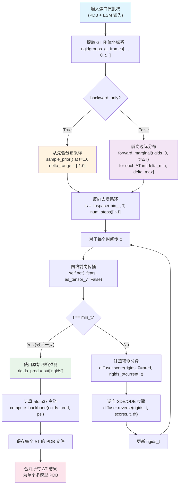

---
slug:19-forward-backward-sampling-strategy
blog_type:normal
---


IDPFold 的推理流水线实现了一种**混合前向-反向采样策略**，该策略将噪声注入点与完整的扩散时长解耦。系统无需在 t=1 时无条件地从先验分布开始执行逆向过程，而是可以先将前向边际分布应用于真实（或部分已知）的结构，直至达到中间时刻 t=ΔT，随后从该点开始反向去噪。这在结构保真度与构象多样性之间提供了一种可控的权衡——对于天然无序蛋白（IDP）系综而言，这是一项关键能力，因为其目标并非单一的天然态，而是**合理构象的分布**。

来源：[diffusion_module.py](/src/models/diffusion_module.py#L214-L370), [diffusion.yaml](/configs/model/diffusion.yaml#L88-L100)

## 架构概述

该采样策略在 `DiffusionLitModule.predict_step` 中统一调度，该方法是 `trainer.predict()` 执行期间的 Lightning 入口点。该方法会遍历一系列 ΔT 值（前向扰动深度），通过内部的 `forward_backward` 子程序为每个 ΔT 生成 `n_replica` 个结构样本，并将结果组装成多模型 PDB 文件。

下图展示了完整的前向-反向流水线，涵盖从输入蛋白质数据、噪声注入、迭代去噪到结构输出的全过程：



来源：[diffusion_module.py](/src/models/diffusion_module.py#L260-L335), [frame.py](/src/models/score/frame.py#L36-L107)

## 两种运行模式：前向-反向 vs. 仅反向

该采样策略支持两种截然不同的运行机制，由推理配置中的 `backward_only` 标志控制。这一区别决定了系统是从**受扰动的真实结构**（前向-反向模式）开始去噪，还是从**无条件先验分布**（仅反向模式）开始去噪。

### 前向-反向模式 (backward_only = false)

在此模式下，系统首先将前向扩散边际应用于已知结构直至时刻 ΔT，随后将过程逆向，从 ΔT 回退至 `min_t`。前向边际分别针对旋转 (SO(3)) 和平移 (R³) 分量进行计算：

- **平移前向边际**：从 VPSDE 转移核 `p(x_t | x_0)` 中采样，其中 `x_t = exp(-½β_t) · x_0 + √(1 - exp(-β_t)) · z`，且 `z ~ N(0, I)`，`β_t = t·min_b + ½t²(max_b - min_b)`
- **旋转前向边际**：在时刻 t 从 IGSO(3) 分布中采样一个增量旋转，然后通过 `rot_t = rot_0 ∘ δ_rot` 将其与真实旋转组合

ΔT 值在可配置范围 `[delta_min, delta_max]` 内以 `delta_step` 为步长进行扫描，从而在不同扰动深度下生成结构。这对于 IDP 系综生成尤为关键：较低的 ΔT 值生成的结构更接近参考结构，而较高的 ΔT 值则能探索更具多样性的构象空间。

来源：[diffusion_module.py](/src/models/diffusion_module.py#L274-L286), [r3.py](/src/models/score/r3.py#L49-L74), [so3.py](/src/models/score/so3.py#L315-L331)

### 仅反向模式 (backward_only = true)

当启用 `backward_only` 时，系统完全跳过前向边际。相反，它从先验分布中采样——平移使用各向同性高斯分布，旋转使用最大 sigma 下的均匀分布/IGSO(3)——并运行从 t=1.0 到 `min_t` 的完整逆向过程。在此模式下，`n_replica` 会乘以 ΔT 条目的数量（因为 delta 范围变得无关紧要），并且 `delta_range` 被设置为 `[-1.0]` 作为哨兵值。

此模式对应于基于学习到的分数模型进行的**无条件生成**，类似于 RFdiffusion 及类似框架中采用的标准扩散采样。

```python
# backward_only 路径：从先验分布采样而非前向边际
if t_delta > 0:
    rigids_t = self.diffuser.forward_marginal(
        rigids_0=rigids_0, t=t_delta * ..., ...
    )['rigids_t']
else:
    rigids_t = self.diffuser.sample_prior(
        shape=rigids_0.shape, device=device, as_tensor_7=True
    )['rigids_t']
```

来源：[diffusion_module.py](/src/models/diffusion_module.py#L244-L286), [frame.py](/src/models/score/frame.py#L212-L255)

### 模式对比

| 方面 | 前向-反向模式 | 仅反向模式 |
|--------|----------------------|-------------------|
| **起点** | t=ΔT 处受扰动的 GT 结构 | t=1.0 处的先验分布 |
| **ΔT 扫描** | 探索多种扰动深度 | 忽略 ΔT；`delta_range = [-1.0]` |
| **副本数量** | 每个 ΔT 值 `n_replica` 个 | 总计 `n_replica × len(delta_range)` 个 |
| **结构多样性** | 通过 ΔT 大小进行控制 | 完全基于先验随机 |
| **适用场景** | 围绕参考结构的 IDP 系综 | 无条件结构生成 |
| **默认配置** | `backward_only: false`（在 defaults 中被覆盖为 `true`） | `backward_only: true` |

来源：[diffusion_module.py](/src/models/diffusion_module.py#L228-L248), [diffusion.yaml](/configs/model/diffusion.yaml#L88-L100)

## 反向去噪循环

采样策略的核心是迭代逆向过程，实现为逆向 SDE（或概率流 ODE）的时间逆转 Euler-Maruyama 积分。对于每个 ΔT 值，系统构建一个逆向时间表 `ts = linspace(min_t, T, num_timesteps)[::-1]` 并逐步遍历，在每个时间步应用学习到的分数模型。

### 单步机制

在逆向时间表的每个时间步 `t` 中，执行以下序列：

1. **网络推理**：去噪网络接收当前的刚体状态 `rigids_t`、时间嵌入 `t`、序列特征以及可选的自条件特征，输出预测的干净刚体 `out['rigids']` 和主链二面角 `out['psi']`。

2. **分数计算**：`FrameDiffuser.score()` 方法根据网络预测的 `rigids_0` 和当前的 `rigids_t` 计算扩散过程的解析分数。这涉及：
   - **平移分数**：`-(x_t - exp(-½β_t)·x_0) / (1 - exp(-β_t))`，在缩放后的坐标空间中计算
   - **旋转分数**：IGSO(3) 分数，通过将相对旋转 `R₀⁻¹ ∘ R_t` 分解为轴角表示进行计算，随后与缓存或即时计算的 IGSO(3) 分数范数进行评估

3. **逆向步骤**：`FrameDiffuser.reverse()` 方法对逆向 SDE 应用一步 Euler-Maruyama 积分，分别处理旋转和平移，然后将它们重新组装成 `Rigid` 对象。

4. **自条件更新**：如果启用，网络预测的 CA 坐标（`out['rigids'][..., 4:]`）将作为 `sc_ca_t` 存储以供下一步输入，从而提供自回归信号。

<CgxTip>最后一个时间步（`t == min_t`）完全跳过逆向步骤——网络的原始预测直接作为输出结构。这避免了 t→0 附近分数函数引起的数值不稳定性，因为此时条件方差趋近于零，分数大小会发散。</CgxTip>

来源：[diffusion_module.py](/src/models/diffusion_module.py#L300-L335), [frame.py](/src/models/score/frame.py#L109-L143), [r3.py](/src/models/score/r3.py#L79-L125), [so3.py](/src/models/score/so3.py#L333-L371)

### 逆向 SDE vs. 概率流 ODE

每个逆向步骤支持两种数学公式，通过 `probability_flow` 标志进行切换：

| 公式 | 漂移项 | 扩散项 | 随机性 |
|-------------|-----------|----------------|---------------|
| **逆向 SDE** (probability_flow=false) | `(f - g²·score) · dt` | `g · √dt · z` | 随机 |
| **概率流 ODE** (probability_flow=true) | `½(f - g²·score) · dt` | `0` | 确定 |

对于 **R³ 平移**，漂移系数为 `f_t = -½·b(t)·x_t`，扩散系数为 `g_t = √b(t)`，其中 `b(t) = min_b + t·(max_b - min_b)` 是线性 VPSDE 时间表。逆向步骤减去扰动量：`x_{t-1} = x_t - perturb`，并可选地进行质心重置。

对于 **SO(3) 旋转**，扩散系数采用对数 sigma 时间表：`g_t = √(2·(exp(σ_max) - exp(σ_min))·σ(t)/exp(σ(t)))`。逆向步骤通过 `rot_{t-1} = rot_t ∘ (-perturb)` 进行轴角组合，遵循 SO(3) 的流形结构。

<CgxTip>`noise_scale` 参数作为随机扩散项 `z` 的全局乘数。在保持 `probability_flow=false` 的情况下设置 `noise_scale=0`，可以在不改变漂移系数的情况下有效地将 SDE 转换为 ODE——这是将分数模型质量与采样随机性隔离的有用调试工具。</CgxTip>

来源：[r3.py](/src/models/score/r3.py#L79-L125), [so3.py](/src/models/score/so3.py#L333-L371), [diffusion.yaml](/configs/model/diffusion.yaml#L93-L96)

## 副本批处理与内存管理

生成大型结构系综需要谨慎的内存管理。系统通过整除将 `n_replica` 个样本划分为包含 `replica_per_batch` 个样本的批次，最后一部分剩余样本组成末尾批次。使用 `gt_rigidgroups_4x4.repeat(replica_per_batch, ...)` 沿批处理维度复制真实刚体坐标系，每个批次通过 `forward_backward` 子程序独立处理。

```python
n_bs = n_replica // replica_per_batch    # 完整批次的数量
last_bs = n_replica % replica_per_batch  # 剩余批次的大小

for _ in range(n_bs):
    rigids_0 = Rigid.from_tensor_4x4(
        gt_rigidgroups_4x4.repeat(replica_per_batch, *(1,)*(...)))
    traj_atom37 = forward_backward(rigids_0, t_delta)
    atom_positions.append(traj_atom37)
```

在默认配置（`n_replica=192`，`replica_per_batch=64`）下，这将产生 3 个各包含 64 个结构的完整批次。在序列化为 PDB 之前，结果会沿批次轴拼接。

来源：[diffusion_module.py](/src/models/diffusion_module.py#L340-L353), [diffusion.yaml](/configs/model/diffusion.yaml#L92-L93)

## 推理配置参考

所有采样超参数均集中在 `configs/model/diffusion.yaml` 的 `inference` 键下。下表提供了完整的参考：

| 参数 | 默认值 | 描述 |
|-----------|---------|-------------|
| `delta_min` | 0.25 | 最小前向扰动深度 ΔT |
| `delta_max` | 0.35 | 最大前向扰动深度 ΔT |
| `delta_step` | 0.05 | ΔT 扫描的步长 |
| `n_replica` | 192 | 每个 ΔT 值的结构副本数 |
| `replica_per_batch` | 64 | 每次前向传播处理的结构数（用于内存控制） |
| `num_timesteps` | 1000 | 逆向过程的离散化步数（由 T 缩放） |
| `noise_scale` | 1.0 | 随机扩散项的乘数 |
| `probability_flow` | false | 使用确定性 ODE (true) 或随机 SDE (false) |
| `self_conditioning` | true | 将上一步预测的 CA 坐标作为附加输入传入 |
| `min_t` | 1e-2 | 时间下界（避免 t→0 奇异性） |
| `output_dir` | `${paths.output_dir}/samples` | 采样 PDB 文件的输出目录 |
| `backward_only` | true | 若为 true，则跳过前向边际；在 t=1 处从先验分布采样 |

给定 ΔT 对应的有效时间步数为 `int(num_timesteps * T)`，其中在前向-反向模式下 `T = ΔT`，在仅反向模式下 `T = 1.0`。步长为 `dt = 1.0 / num_timesteps`。

来源：[diffusion.yaml](/configs/model/diffusion.yaml#L88-L100), [diffusion_module.py](/src/models/diffusion_module.py#L228-L242)

## 输出结构与 PDB 组装

对于每个蛋白质目标（由 `accession_code` 标识），系统会生成如下目录层级：

```
output_dir/
├── 0.25/                    # ΔT = 0.25
│   └── {accession_code}.pdb # 192 个模型 (n_replica)
├── 0.30/                    # ΔT = 0.30
│   └── {accession_code}.pdb # 192 个模型
├── 0.35/                    # ΔT = 0.35
│   └── {accession_code}.pdb # 192 个模型
└── all_delta/               # 合并所有 ΔT 的结果
    └── {accession_code}.pdb # 总计 576 个模型
```

每个 PDB 文件包含多个 `MODEL` 记录，每个采样结构对应一条记录。`atom37_to_pdb` 函数将 `(B, L, 37, 3)` 原子位置数组转换为 PDB 格式，并附带正确的链索引、残基编号和氨基酸类型注释。`merge_pdbfiles` 工具将各 ΔT 对应的文件拼接为 `all_delta/` 下的单个多模型 PDB 文件。

来源：[diffusion_module.py](/src/models/diffusion_module.py#L355-L370), [pdb_utils.py](/src/common/pdb_utils.py#L31-L83), [pdb_utils.py](/src/common/pdb_utils.py#L205-L252)

## 评估入口

采样流水线通过 `src/eval.py` 触发，该文件使用 Hydra 组合 `eval.yaml` 配置。此配置选择 `sampling` 数据模块（该模块使用 `backward_only` 变换设置实例化 `SamplingPDBDataset`——无截断、无残基剥离、无重置中心）以及 `diffusion` 模型配置。通过 `checkpoint_utils.load_model_checkpoint` 手动加载检查点，随后 `trainer.predict()` 为数据集中的每个蛋白质调用 `predict_step`。

`SamplingPDBDataset` 期望输入一个包含 `.pdb` 文件的目录，并可选地提供 ESM 序列嵌入。推理期间批大小固定为 1，正如 `predict_step` 中所断言的：`assert batch['aatype'].shape[0] == 1`。这一约束源于副本扩展是在 `forward_backward` 内部沿批次维度进行的，而可变长度蛋白质批处理会使刚体坐标系复制逻辑复杂化。

来源：[eval.py](/src/eval.py#L46-L93), [eval.yaml](/configs/eval.yaml#L1-L20), [sampling.yaml](/configs/data/sampling.yaml#L1-L20), [dataset.py](/src/data/components/dataset.py#L309-L327)

## 采样过程的数学总结

完整的前向-反向采样过程可以形式化如下。给定具有刚体坐标系 $\{R_0^{(i)}\}_{i=1}^{N}$（每个残基的旋转和平移）的真实结构：

**前向阶段**（针对 ΔT 模式）：在时刻 $t = \Delta T$ 采样受扰动的刚体：
$$R_t^{(i)} = \text{compose}\left(R_0^{(i)},\; \delta R^{(i)}\right), \quad \delta R^{(i)} \sim \text{IGSO(3)}(\sigma(\Delta T)) \text{ （针对旋转）}$$
$$\mathbf{x}_t^{(i)} = e^{-\frac{1}{2}\bar{\beta}_{\Delta T}} \mathbf{x}_0^{(i)} + \sqrt{1 - e^{-\bar{\beta}_{\Delta T}}} \cdot \mathbf{z}, \quad \mathbf{z} \sim \mathcal{N}(0, I) \text{ （针对平移）}$$

**反向阶段**：从 $t = \Delta T$（或 $t = 1$）迭代至 $t = \text{min\_t}$：
$$\text{分数: } \quad s_\theta(R_t, t) = \nabla_{R_t} \log p_t(R_t | R_\theta)$$
$$\text{逆向 SDE: } \quad R_{t-dt} = R_t - \left[f(R_t, t) - g(t)^2 \cdot s_\theta(R_t, t)\right] dt - g(t)\sqrt{dt} \cdot \mathbf{z}$$

其中 $f$ 和 $g$ 分别是 $\mathbb{R}^3$ (VPSDE) 和 $SO(3)$ (IGSO(3) 布朗运动) 上对应前向 SDE 的漂移和扩散系数，$R_\theta$ 表示网络在每一步预测的干净结构。

来源：[r3.py](/src/models/score/r3.py#L26-L47), [so3.py](/src/models/score/so3.py#L216-L234), [frame.py](/src/models/score/frame.py#L153-L210)

## 后续步骤

- 若要了解如何加载已训练的检查点进行推理，请参阅 [检查点加载](20-checkpoint-loading)。
- 有关 PDB 输出格式及下游处理工具的详细信息，请参阅 [PDB 输出生成](21-pdb-output-generation)。
- 若要通过 Hydra 覆盖配置采样参数，请参阅 [模型配置参考](23-model-configuration-reference)。
- 若要了解此处使用的 SE(3) 扩散过程的数学基础，请参阅 [Frame Diffuser 集成](9-frame-diffuser-integration)。