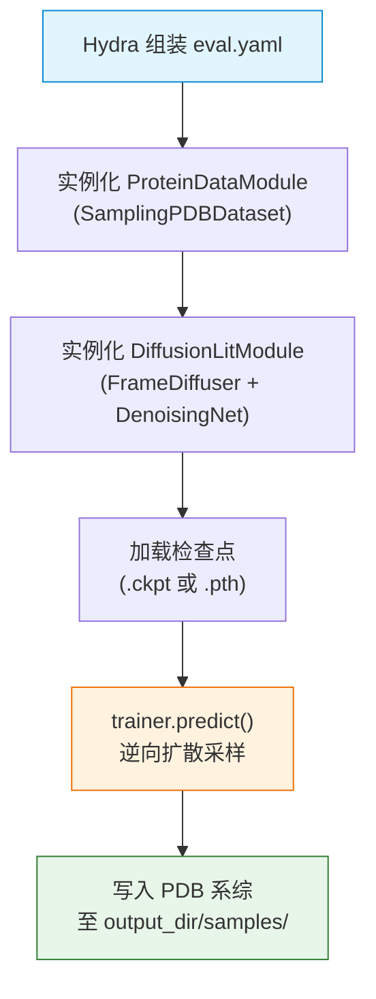

---
slug:2-quick-start
blog_type:normal
---


**IDPFold** 是一个生成式深度学习模型，能够直接根据氨基酸序列预测天然无序蛋白（IDP）的构象系综。通过在 SE(3) 流形上利用微调后的扩散模型，它无需依赖多序列比对（MSA）或实验数据，即可达到与分子动力学模拟相当的系综级精度。本页将引导你以最快路径从干净的克隆代码库走向预测第一个蛋白质结构——涵盖从环境创建到双命令推理流水线的全过程。

## 仓库一览

本项目遵循 **Lightning-Hydra-Template** 规范，清晰地将配置、源代码和数据分离。提前理解此布局结构，将为你阅读本指南及后续深度剖析页面节省大量导航代码库的时间。

```
IDPFold/
├── configs/              # Hydra 配置层次结构
│   ├── eval.yaml         # 推理入口配置
│   ├── train.yaml        # 训练入口配置
│   ├── data/             # 数据集与采样配置
│   ├── model/            # 扩散模型配置
│   ├── trainer/          # 训练器预设（cpu, gpu, ddp）
│   └── paths/            # 路径解析（环境变量驱动）
├── data/
│   └── example.fasta     # 3 个 IDP 示例序列
├── src/
│   ├── read_seqs.py      # ESM 嵌入提取（步骤 1）
│   ├── eval.py           # 扩散推理（步骤 2）
│   ├── train.py          # 训练入口点
│   ├── models/           # 扩散模块、IPA、分数匹配
│   ├── data/             # 数据集类与转换
│   ├── common/           # 蛋白质几何与 PDB 工具
│   └── utils/            # 检查点、ESM、日志辅助工具
├── environment.yml       # Conda 环境配置
├── setup.py              # 包安装脚本
└── initialize.py         # .env 文件生成器
```


从原始 FASTA 文件到预测 3D 结构的端到端工作流，包含三个逻辑阶段，由 Hydra 配置和 PyTorch Lightning 协同调度。下图展示了各组件之间如何依次衔接：


<CgxTip>整个流水线由 Hydra 配置覆盖驱动。从 ESM 模型选择到扩散时间步数量的每一个参数，都无需修改源代码即可通过命令行标志进行设置。这是你入门时最需要牢记的核心约定。</CgxTip>

来源：[README.md](/README.md#L1-L69), [setup.py](/setup.py#L1-L23), [configs/eval.yaml](/configs/eval.yaml#L1-L20), [configs/train.yaml](/configs/train.yaml#L1-L50)

## 安装

IDPFold 要求 **Python 3.9**、**CUDA 11.3**，并在实际推理中需要 GPU 支持。其 Conda 环境打包了 PyTorch 2.0.1、PyTorch Geometric、OpenMM、mdtraj、biotite 以及所有必要的科学计算依赖。请按顺序执行以下步骤：

```bash
# 1. 克隆仓库
git clone https://github.com/Junjie-Zhu/IDPFold.git
cd IDPFold

# 2. 创建并激活 conda 环境
conda env create -f environment.yml
conda activate idpfold

# 3. 安装 ESM 用于序列嵌入提取
pip install fair-esm

# 4. 将 IDPFold 作为可编辑包安装
pip install -e .
```

步骤 4 会注册三个控制台命令——`train_command`、`eval_command` 和 `preprocess_command`——作为对应入口点 `main()` 函数的别名，因此在激活环境后，你可以在任意目录下调用它们。下表汇总了核心依赖及其作用：

| 依赖 | 版本 | 作用 |
|:--|:--|:--|
| PyTorch | 2.0.1 (CUDA 11.3) | 深度学习后端 |
| PyTorch Lightning | 2.1.2 | 训练/推理调度编排 |
| Hydra | 1.3.2 | 配置管理 |
| fair-esm | 2.0.0 | ESM-2 蛋白质语言模型 |
| PyTorch Geometric | 2.1.0 | 图神经网络操作 |
| OpenMM | 8.0.0 | 分子动力学 / 能量最小化 |
| mdtraj | 1.9.7 | 轨迹分析与 PDB 处理 |
| biotite | 0.37.0 | 结构 I/O 与序列解析 |

来源：[environment.yml](/environment.yml#L1-L287), [setup.py](/setup.py#L1-L23), [README.md](/README.md#L20-L35)

## 环境初始化

安装完成后，IDPFold 需要在仓库根目录下创建一个 `.env` 文件，用于定义数据目录的路径。这些环境变量会被 Hydra 的路径解析层读取，并映射到配置树中。你无需手动创建该文件，只需运行提供的初始化脚本：

```bash
python initialize.py
```

该脚本会检测当前工作目录，创建必要的子目录，并写入包含绝对路径的 `.env` 文件。生成的文件如下所示（路径将反映你的本地克隆位置）：

| 变量 | 默认目录 | 用途 |
|:--|:--|:--|
| `CACHE_DIR` | `.cache/` | SO(3) 扩散器分数缓存 |
| `TRAIN_DATA` | `data/pdb/` | 训练用 PDB 结构 |
| `EMBEDDING` | `data/embeddings/` | ESM-2 序列嵌入 |
| `TEST_DATA` | `data/test_pdb/` | 推理输入 PDB 文件 |

这些变量通过 `configs/paths/env.yaml` 流入 Hydra，并由 OmegaConf 的 `oc.env` 插值进行解析。解析链为：`.env` 文件 → 环境变量 → `configs/paths/env.yaml` → 下游配置（例如 `configs/data/sampling.yaml`）。如果需要使用自定义数据路径，只需编辑 `.env` 文件即可——无需修改任何源代码。

<CgxTip>在推理流水线执行期间（见下一节），`read_seqs.py` 会将虚拟 PDB 占位文件写入 `TEST_DATA`，并将 ESM 嵌入写入 `EMBEDDING`。请确保这些目录具有写权限且磁盘空间充足——对于长度为 100 个残基的蛋白，其每个 ESM-2 表示大约包含 100×1280 个浮点数（约 0.5 MB）。</CgxTip>

来源：[initialize.py](/initialize.py#L1-L22), [configs/paths/env.yaml](/configs/paths/env.yaml#L1-L8), [configs/paths/default.yaml](/configs/paths/default.yaml#L1-L19)

## 运行首次推理

IDPFold 的推理流水线包含两个串行命令。第一条命令从 FASTA 文件中提取 ESM-2 序列嵌入；第二条命令加载预训练检查点并执行逆向扩散采样，从而生成结构系综。

### 步骤 1：准备输入

仅需提供一个包含一条或多条蛋白质序列的 FASTA 文件作为输入。仓库自带了 `data/example.fasta` 文件，其中包含三个表征明确的 IDP 序列：

| 序列 | 长度 | 描述 |
|:--|:--|:--|
| Abeta40 | 40 个残基 | 淀粉样蛋白-beta 1-40 |
| PaaA2 | 69 个残基 | 抗毒素 PaaA2 |
| p15PAF | 114 个残基 | CDK 抑制剂 p15PAF |

你可以用自己的序列替换该文件——系统同时支持单序列和多序列的 FASTA 文件。

### 步骤 2：下载预训练检查点

模型检查点托管于 [Google Drive](https://drive.google.com/drive/folders/1-5BHexAZKGX1lWyPkYU-JFi1EId88P9i?usp=sharing)。请下载检查点文件并记录其路径——你将在执行推理命令时用到它。

### 步骤 3：提取 ESM 嵌入

```bash
python src/read_seqs.py pred_dir='./data/example.fasta'
```

此命令会加载 **ESM-2 (esm2_t33_650M_UR50D)** 模型——一个拥有 3300 万参数、包含 33 个 Transformer 层的蛋白质语言模型——并计算第 33 层的逐残基表示。对于 FASTA 文件中的每一条序列，它会执行以下操作：

1. 将 FASTA 文件解析为 `(sequence_name, sequence_string)` 对
2. 在 `TEST_DATA` 目录中创建虚拟占位 PDB 文件（CA 原子位于原点）
3. 运行 ESM-2 推理，提取 1280 维的逐残基嵌入
4. 将每个嵌入以 `.pkl` 文件的形式保存至 `EMBEDDING` 目录

`pred_dir` 参数是一个 Hydra 覆盖项，用于设置 `configs/eval.yaml` 中的 `cfg.pred_dir` 字段。这是在 IDPFold 中传递运行时参数的标准模式。

### 步骤 4：运行扩散推理

```bash
python src/eval.py ckpt_path='/path/to/downloaded/ckpt'
```

此命令通过 Hydra 实例化完整的扩散流水线并执行逆向扩散采样。关键阶段如下：



`checkpoint_utils.py` 中的检查点加载逻辑支持两种格式：`.ckpt` 文件（包含优化器和轮次信息等完整的 PyTorch Lightning 状态）和 `.pth` 文件（仅包含网络参数，加载至 `model.net`）。在进行微调时，这一区别至关重要——使用 `.pth` 可以避免恢复过期的训练状态。

推理配置定义于 `configs/model/diffusion.yaml` 的 `inference` 键下，用于控制采样行为。最重要的参数如下：

| 参数 | 默认值 | 描述 |
|:--|:--|:--|
| `n_replica` | 192 | 每个噪声水平的结构数量 |
| `delta_min` | 0.25 | 逆向采样的最小噪声水平 |
| `delta_max` | 0.35 | 逆向采样的最大噪声水平 |
| `delta_step` | 0.05 | 噪声水平步长 |
| `num_timesteps` | 1000 | 逆向扩散步数 |
| `backward_only` | true | 跳过前向扩散；从噪声开始 |
| `output_dir` | `${paths.output_dir}/samples` | 生成 PDB 文件的输出目录 |

每条序列生成的结构总数等于 `n_replica × ((delta_max - delta_min) / delta_step + 1)`，在默认设置下可生成 **768 个结构**。生成的 PDB 文件会写入 `output_dir`，该路径会解析为 `logs/eval/runs/` 下带有时间戳的子目录。

来源：[src/read_seqs.py](/src/read_seqs.py#L1-L63), [src/eval.py](/src/eval.py#L1-L111), [src/utils/esm_extract.py](/src/utils/esm_extract.py#L1-L130), [src/utils/checkpoint_utils.py](/src/utils/checkpoint_utils.py#L1-L28), [configs/model/diffusion.yaml](/configs/model/diffusion.yaml#L56-L68), [configs/data/sampling.yaml](/configs/data/sampling.yaml#L1-L20), [README.md](/README.md#L42-L57)

## 配置系统一览

IDPFold 继承了 Lightning-Hydra-Template 中 Hydra 可组合配置架构。每次运行均以根配置（`eval.yaml` 或 `train.yaml`）开始，通过 `defaults` 列表组装子配置。下表汇总了你将接触到的配置层次结构：

| 配置组 | 文件 | 用途 |
|:--|:--|:--|
| 根配置（推理） | `configs/eval.yaml` | 组装 data、model、trainer、paths |
| 根配置（训练） | `configs/train.yaml` | 额外包含 callbacks、logger、experiment、hparams_search |
| 数据 | `configs/data/*.yaml` | `protein.yaml`（训练），`sampling.yaml`（推理） |
| 模型 | `configs/model/diffusion.yaml` | 优化器、扩散器、网络、损失、推理参数 |
| 训练器 | `configs/trainer/*.yaml` | `cpu.yaml`、`gpu.yaml`、`ddp.yaml` 预设 |
| 路径 | `configs/paths/env.yaml` | 将 `.env` 变量解析至配置树 |
| 实验 | `configs/experiment/example.yaml` | 可覆盖的超参数包 |

你可以在命令行中使用点表示法覆盖任意参数。例如，若要在 CPU 上运行推理并设置不同的副本数：

```bash
python src/eval.py ckpt_path='/path/to/ckpt' trainer=cpu model.inference.n_replica=32
```

关于这种可组合性的深入探讨，请参阅 [Hydra Configuration Hierarchy](22-hydra-configuration-hierarchy) 页面。

来源：[configs/eval.yaml](/configs/eval.yaml#L1-L20), [configs/train.yaml](/configs/train.yaml#L1-L50), [configs/trainer/gpu.yaml](/configs/trainer/gpu.yaml#L1-L6), [configs/trainer/cpu.yaml](/configs/trainer/cpu.yaml#L1-L6), [configs/experiment/example.yaml](/configs/experiment/example.yaml#L1-L43)

## 建议阅读路线

既然你已经能够端到端地运行推理流水线，接下来的页面将逐层深入解析——从环境细节，到扩散模型的数学基础，再到支撑该模型的神经网络架构：

| 步骤 | 页面 | 你将学到 |
|:--|:--|:--|
| 1 | [Environment Setup](3-environment-setup) | 详细的依赖分解、GPU 要求与故障排除 |
| 2 | [Inference Pipeline](4-inference-pipeline) | 深入探讨采样策略、检查点格式与 PDB 输出 |
| 3 | [Architecture Overview](5-architecture-overview) | 系统级设计与模块间关系 |
| 4 | [Rigid Body Representation](6-rigid-body-representation) | 针对蛋白质骨架的 SE(3) 框架参数化 |
| 5 | [R3 Translation Diffuser](7-r3-translation-diffuser) | ℝ³ 上的连续时间平移扩散 |
| 6 | [SO3 Rotation Diffuser](8-so3-rotation-diffuser) | 带有缓存分数函数的旋转扩散 |
| 7 | [Frame Diffuser Integration](9-frame-diffuser-integration) | 平移与旋转扩散器如何组合 |
| 8 | [Invariant Point Attention](11-invariant-point-attention) | SE(3) 等变注意力机制 |
| 9 | [Denoising Network Pipeline](12-denoising-network-pipeline) | 完整的降噪网络前向传递过程 |

如果你当前的目标仅是从序列生成结构，[Environment Setup](3-environment-setup) 和 [Inference Pipeline](4-inference-pipeline) 页面便已提供所需的一切。若想理解模型*为何*有效——包括扩散数学原理、网络架构及损失函数设计——请按顺序阅读“深度剖析”部分。