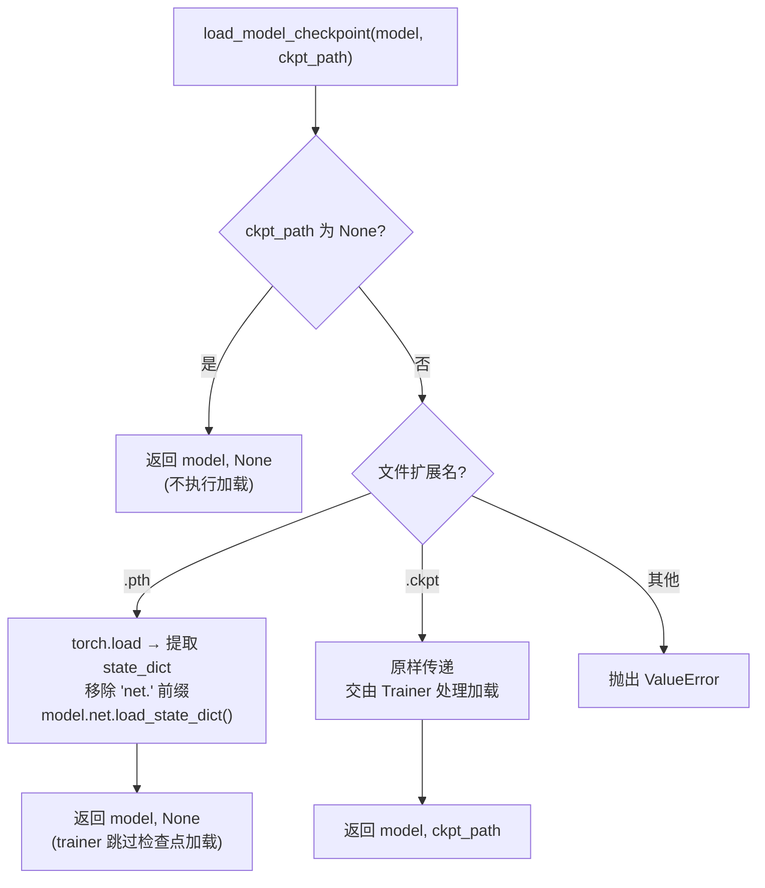
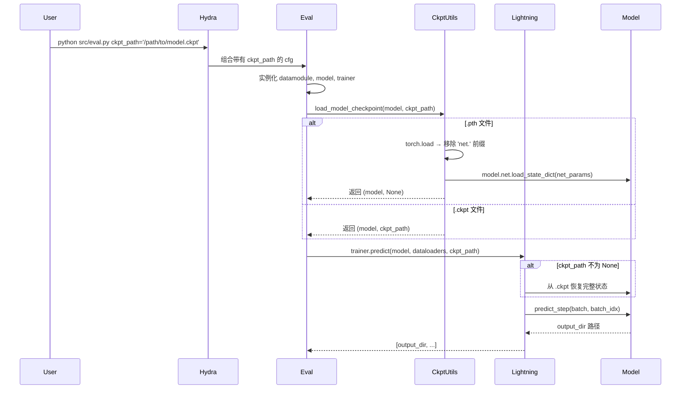

---
slug:20-checkpoint-loading
blog_type:normal
---

IDPFold 的检查点加载系统提供了一种**双路径分发机制**，同时兼容 PyTorch Lightning 原生的 `.ckpt` 文件和 PyTorch 原生的 `.pth` 文件，从而实现完整训练状态恢复与仅权重微调之间的灵活切换。本页将从配置到执行，深入剖析整个加载流水线，涵盖检查点在训练和推理入口的保存、验证及使用方式。

## 检查点保存：位置与方式

在探讨加载机制之前，了解检查点是如何生成的至关重要。IDPFold 将检查点的持久化委托给 Lightning 的 `ModelCheckpoint` 回调函数，并通过 Hydra 进行配置。`configs/callbacks/default.yaml` 中的默认回调配置将检查点目录定义为 `${paths.output_dir}/checkpoints`，其中 `output_dir` 由 Hydra 动态解析为 `logs/<task_name>/runs/<timestamp>/` 下带有时间戳的文件夹。每个检查点命名为 `epoch_{epoch:03d}.ckpt`，并通过设置 `auto_insert_metric_name: False` 从文件名中排除了指标名称。该回调以 `min` 模式监控 `val/loss`，仅保留最佳的一个检查点（`save_top_k: 1`），并始终维护一个 `last.ckpt` 副本（`save_last: True`）。

`DiffusionLitModule.__init__` 调用了 `self.save_hyperparameters(logger=False)`，将所有构造函数参数——包括整个 `net`、`optimizer`、`scheduler`、`diffuser`、`loss`、`inference` 和 `compile` 配置——序列化到检查点中。这确保了任何 `.ckpt` 文件都是自描述的：Lightning 可以仅凭检查点重建完整的模型计算图和训练状态，而无需在加载时提供原始的 Hydra 配置。实验配置（`configs/experiment/example.yaml`）展示了另一种保存策略，通过设置 `save_top_k: -1` 和 `every_n_epochs: 10`，每 10 个 epoch 保留一次所有检查点——这对于分析训练轨迹非常有用。

来源：[default.yaml](/configs/callbacks/default.yaml#L1-L23), [diffusion_module.py](/src/models/diffusion_module.py#L67-L71), [example.yaml](/configs/experiment/example.yaml#L16-L21), [default.yaml](/configs/paths/default.yaml#L1-L19), [default.yaml](/configs/hydra/default.yaml#L9-L13)

## 双路径分发：`load_model_checkpoint`

`src/utils/checkpoint_utils.py` 中的 `load_model_checkpoint` 函数是核心的检查点路由器。它接收一个模型实例和一个检查点路径，然后根据文件扩展名进行分发：

**`.pth` 路径**执行手动的、仅权重的加载。它通过 `torch.load(ckpt_path, map_location=torch.device('cpu'))` 读取检查点，提取 `state_dict` 键，然后移除每个参数名开头的 `net.` 前缀。该前缀的存在是因为 LightningModule 将去噪网络存储为 `self.net`，因此序列化后的键遵循 `net.embedder...`、`net.translator...` 的模式。移除前缀后，这些键便能与 `model.net.load_state_dict()` 预期的参数名匹配，该方法直接作用于原始的 `DenoisingNet` 模块。加载完成后，`ckpt_path` 被设置为 `None`——以此向下游的训练器（trainer）传递信号，表明无需再进行后续的检查点恢复。该路径专为微调场景设计，因为在这些场景中，继承先前运行的优化器状态、学习率或 epoch 计数器并不合适。

**`.ckpt` 路径**采取了截然不同的策略：它在此刻什么也不做。函数原样传递路径，将所有加载工作推迟给 Lightning 的 `Trainer`。当 `trainer.fit(ckpt_path=...)`、`trainer.test(ckpt_path=...)` 或 `trainer.predict(ckpt_path=...)` 接收到非空路径时，Lightning 会恢复完整的训练状态——包括模型权重、优化器动量、调度器步数、epoch 编号以及所有指标状态。这正是用于无缝恢复训练的路径。

<CgxTip>当基于预训练的 `.pth` 检查点进行微调时，优化器和调度器会根据当前的 Hydra 配置重新初始化，而不是从检查点中继承。这是有意为之：此举可防止来自不同训练机制的陈旧学习率调度干扰新的微调目标。</CgxTip>

来源：[checkpoint_utils.py](/src/utils/checkpoint_utils.py#L1-L28)

## 评估入口：推理检查点加载

`src/eval.py` 中的评估流水线遵循严格的执行顺序。在通过 Hydra 实例化 datamodule、模型、logger 和 trainer 之后，它会在第 81 行调用 `checkpoint_utils.load_model_checkpoint(model, cfg.ckpt_path)`。返回的 `(model, ckpt_path)` 元组承载了后续的加载决策：如果提供的是 `.pth` 文件，模型的网络权重已被加载，且 `ckpt_path` 变为 `None`；如果提供的是 `.ckpt` 文件，模型保持未初始化状态，且 `ckpt_path` 保留原路径。

关键的下游消费方是第 91 行的 `trainer.predict(model=model, dataloaders=dataloaders, ckpt_path=ckpt_path)`。当 `ckpt_path` 为 `None` 时，Lightning 会直接按原样使用模型——其权重已通过手动的 `.pth` 加载填充完毕。当 `ckpt_path` 指向 `.ckpt` 文件时，Lightning 会在执行 `predict_step` 之前拦截预测调用，以恢复完整的检查点状态。返回值上的 `[-1]` 索引用于捕获最后一批次的输出目录，该目录包含了合并后的 PDB 预测结果路径。

`configs/eval.yaml` 中的默认评估配置设置了 `ckpt_path: ${paths.data_dir}/last.ckpt`，解析为相对于项目根目录的 `data/last.ckpt`。用户可以在命令行中覆盖此项，如 README 所示：`python src/eval.py ckpt_path='/path/to/ckpt'`。评估配置还选择了 `sampling` 数据模块（为预测提供 `test_dataloader()`）、`gpu` trainer，并禁用了日志记录（`logger: null`），从而构建出精简的、面向推理的配置。

来源：[eval.py](/src/eval.py#L46-L93), [eval.yaml](/configs/eval.yaml#L1-L20), [README.md](/README.md#L46-L59)

## 训练入口：恢复与微调

`src/train.py` 中的训练流水线与评估模式类似，但额外扩展了测试阶段。在第 86 行，`checkpoint_utils.load_model_checkpoint(model, cfg.get("ckpt_path"))` 应用了相同的双路径分发机制。最终得到的 `ckpt_path` 会被传入第 90 行的 `trainer.fit(model=model, datamodule=datamodule, ckpt_path=ckpt_path)` 中。

对于训练恢复，强烈推荐使用 `.ckpt` 路径，因为它能恢复优化器的 Adam 动量向量和 `ReduceLROnPlateau` 调度器的耐心计数器（patience counter）——这些状态对于稳定地继续训练至关重要。如果在训练期间使用 `.pth` 加载，这些状态将被重置，由于优化器需从零开始重新累积动量，可能会导致初始阶段出现损失激增。

可选的测试阶段（通过 `cfg.get("test")` 激活）展示了第三种检查点选择机制。它不使用用户提供的路径，而是检索 `trainer.checkpoint_callback.best_model_path`——即在训练运行期间保存的性能最佳的检查点路径。如果未保存任何检查点（例如，回调配置错误），这将返回一个空字符串，从而触发警告并回退使用当前内存中的模型权重。

| 场景 | ckpt_path 配置 | 文件类型 | 恢复内容 | 用例 |
|---|---|---|---|---|
| 全新训练 | `null` | N/A | 无 | 从头开始训练 |
| 恢复训练 | `/path/to/last.ckpt` | `.ckpt` | 权重 + 优化器 + 调度器 + epoch | 续接中断的训练 |
| 微调（仅权重） | `/path/to/model.pth` | `.pth` | 仅网络权重 | 领域适配，新的学习率调度 |
| 训练后测试 | `best_model_path` (自动) | `.ckpt` | 最佳权重 + 训练状态 | 在留出集上进行验证 |
| 推理 | `/path/to/model.ckpt` | `.ckpt` | 完整模型状态 | 生产环境预测 |
| 推理（轻量级） | `/path/to/model.pth` | `.pth` | 仅网络权重 | 无需 Lightning 开销的快速部署 |

来源：[train.py](/src/train.py#L44-L108), [train.yaml](/configs/train.yaml#L39-L50), [model_checkpoint.yaml](/configs/callbacks/model_checkpoint.yaml#L1-L18)

## 检查点路径解析

检查点路径通过 Hydra 的插值系统进行解析，该系统将环境变量和路径配置串联在一起。`configs/paths/default.yaml` 从 `PROJECT_ROOT` 环境变量（由 `rootutils.setup_root` 设置）中定义 `root_dir`，并由此派生出 `data_dir` 为 `${paths.root_dir}/data/`。`configs/paths/env.yaml` 对此进行了扩展，为由环境变量支撑的训练数据、测试数据、序列嵌入和缓存目录提供了路径——所有这些均由 `initialize.py` 初始化，后者会写入一个包含绝对路径的 `.env` 文件。

因此，评估配置中默认的 `ckpt_path: ${paths.data_dir}/last.ckpt` 会解析为 `<project_root>/data/last.ckpt`。然而，README 指导用户从 Google Drive 下载预训练检查点，并通过命令行显式传递路径，从而完全绕过默认设置。这种设计将配置默认值（对开发很有用）与生产工作流（显式指定路径）分离开来。

<CgxTip>`train.py` 和 `eval.py` 中的 `rootutils.setup_root()` 调用会从脚本文件开始向上搜索 `.project-root` 标记文件，然后相应地设置 `PROJECT_ROOT`。这意味着无论从哪个工作目录调用脚本，`data/last.ckpt` 等检查点路径都能被正确解析——前提是 `.project-root` 文件存在于仓库根目录中。</CgxTip>

来源：[default.yaml](/configs/paths/default.yaml#L1-L19), [env.yaml](/configs/paths/env.yaml#L1-L8), [initialize.py](/initialize.py#L1-L22), [README.md](/README.md#L39-L59)

## 推理期间的端到端加载序列

从命令调用到模型权重激活，完整的推理检查点加载序列如下所示：

该序列突出了自定义工具函数与 Lightning 内置恢复机制之间的**关注点分离**。`load_model_checkpoint` 仅处理*是否*以及*如何*预加载权重的决策，而 Lightning 则在接收到非空 `ckpt_path` 时负责完整的状态恢复。这种设计避免了重新实现 Lightning 强大的检查点解析逻辑（该逻辑可处理版本不匹配、指标恢复和分布式状态），同时又添加了 Lightning 原生不支持的 `.pth` 快速加载路径。

来源：[eval.py](/src/eval.py#L46-L93), [checkpoint_utils.py](/src/utils/checkpoint_utils.py#L1-L28), [diffusion_module.py](/src/models/diffusion_module.py#L214-L370)

## 错误处理与验证

检查点加载系统实现了精简但充分的验证。`load_model_checkpoint` 函数执行三项检查：`None` 路径直接短路返回空操作；文件扩展名校验仅接受 `.pth` 和 `.ckpt`；任何其他扩展名都会抛出带有描述性信息的 `ValueError`。`.pth` 加载路径中的 `map_location=torch.device('cpu')` 参数确保了在 CPU 上进行反序列化，从而防止在显存有限的设备上加载大型检查点时出现 GPU OOM（内存溢出）错误——调用方需随后通过 Lightning 的 trainer 负责将模型移动到目标设备。

值得注意的是，系统并未验证检查点的架构是否与实例化的模型相匹配。如果用户提供的检查点使用了不同的网络配置进行训练（例如不同的 `node_embed_size` 或 `no_ipa_blocks`），`load_state_dict` 调用将抛出 PyTorch `RuntimeError` 并提示形状不匹配。这是设计使然：Hydra 配置是模型架构的唯一事实来源，检查点必须遵从该架构，而非反其道而行之。

来源：[checkpoint_utils.py](/src/utils/checkpoint_utils.py#L1-L28)

## 后续步骤

理解了检查点加载之后，顺理成章的下一步是探讨加载后的模型如何生成结构预测。[PDB 输出生成](21-pdb-output-generation) 页面详细介绍了 `predict_step` 方法的前向-后向采样循环和 `atom37_to_pdb` 转换流水线。如需更宏观地了解推理流水线，请查阅 [前向-后向采样策略](19-forward-backward-sampling-strategy)。要理解控制检查点路径的配置系统，请参阅 [Hydra 配置层级](22-hydra-configuration-hierarchy)。