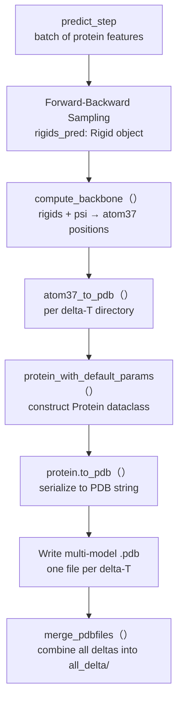
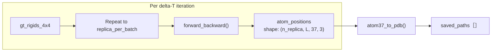

---
slug:21-pdb-output-generation
blog_type:normal
---


PDB 输出生成流水线将抽象的 SE(3) 扩散样本转换为工业标准的蛋白质结构文件。在去噪网络通过前向-反向采样过程生成刚体帧后，这些数学对象必须转换为笛卡尔原子坐标，并序列化为列式 PDB 格式。本页将追踪从 SE(3) 流形上的预测刚体到写入磁盘的最终 `.pdb` 文件的完整数据流，涵盖通过扭转角到帧的组合进行主链重建、多模型 PDB 序列化，以及用于组织输出目录结构的 delta-T 分层策略。

来源：[diffusion_module.py](/src/models/diffusion_module.py#L214-L370), [all_atom.py](/src/common/all_atom.py#L140-L180), [pdb_utils.py](/src/common/pdb_utils.py#L205-L252), [protein.py](/src/common/protein.py#L140-L234)

## 流水线概述

PDB 生成流水线在 `DiffusionLitModule` 的 `predict_step` 方法中触发，该方法是 `trainer.predict()` 调用的 Lightning 预测钩子。编排流程始于 `eval.py` 的评估入口，在此通过 Hydra 配置实例化模型和数据模块，加载检查点，并在蛋白质数据加载器上启动预测循环。



`eval.py` 中的入口点建立了评估上下文：它在 `"predict"` 阶段实例化数据模块，获取测试数据加载器，并委托给 `trainer.predict()`，后者返回最后一次预测步骤的输出目录。预测步骤本身返回 `all_delta_dir`（即合并后的 PDB 输出路径），该路径通过训练器的返回值向上传递。

来源：[eval.py](/src/eval.py#L50-L96), [diffusion_module.py](/src/models/diffusion_module.py#L214-L370)

## 从刚体到 Atom37 坐标

从 SE(3) 流形表示到笛卡尔空间的关键转换发生在 `src/common/all_atom.py` 中定义的 `compute_backbone()` 函数内。该函数将扩散模型输出的抽象刚体（一个包含旋转矩阵和平移向量的 `Rigid` 对象）与 PDB 序列化所需的具体原子坐标数组连接起来。

该函数接收三个输入：`bb_rigids`（去噪网络预测的主链刚体帧）、`psi_torsions`（与刚体一同预测的 psi 主链二面角）和 `aatype`（用于查找特定残基参考帧的氨基酸类型索引）。在内部，它通过将单个 psi 角平铺到所有七个侧链扭转角槽位来构建完整的扭转角张量，然后将其传递给 `torsion_angles_to_frames()`，后者将主链刚体与特定残基的默认帧组合，为每个残基生成八个刚体组（主链、前 omega、phi、psi 和 chi1-chi4）。

<CgxTip>atom14 和 atom37 表示之间的原子顺序有所不同。atom14 顺序中的主链原子为 `['N', 'CA', 'C', 'O', 'CB']`，而 atom37 使用 `['N', 'CA', 'C', 'CB', 'O']`。`compute_backbone` 函数显式地重映射了索引 3↔4 以调和这种不匹配——这是一个微妙但对正确输出 PDB 至关重要的细节。</CgxTip>

随后，`frames_to_atom14_pos()` 函数通过组合刚体变换应用每个残基的理想化原子位置（来自 `residue_constants.restype_atom37_rigid_group_positions`），生成 atom14 坐标。这些坐标被放置在一个 atom37 大小的零张量中的五个主链位置（N, CA, C, CB, O）上，从而生成最终的 `[batch, length, 37, 3]` 输出数组。

来源：[all_atom.py](/src/common/all_atom.py#L140-L180), [all_atom.py](/src/common/all_atom.py#L38-L112), [all_atom.py](/src/common/all_atom.py#L22-L36), [residue_constants.py](/src/common/residue_constants.py#L490-L499)

## predict_step 编排

`DiffusionLitModule` 中的 `predict_step` 方法是 PDB 生成的核心编排器。它从模型的配置命名空间（`self.hparams.inference`）读取推理超参数，遍历一系列 delta-T 值，并管理批处理采样循环，从而为每个蛋白质生成多个结构副本。

### 推理超参数

| 参数 | 默认值 | 描述 |
|-----------|---------|-------------|
| `delta_min` | 0.25 | 前向-反向采样的最小前向扰动时间 |
| `delta_max` | 0.35 | 最大前向扰动时间 |
| `delta_step` | 0.05 | delta-T 范围生成的步长 |
| `n_replica` | 192 | 每个蛋白质的结构样本数（前向-反向模式下为每个 delta-T 对应的数量） |
| `replica_per_batch` | 64 | 单次前向传递中处理的副本数量 |
| `num_timesteps` | 1000 | 反向扩散步数 |
| `noise_scale` | 1.0 | 反向过程的随机噪声乘数 |
| `probability_flow` | false | 是否使用概率流 ODE 求解器 |
| `self_conditioning` | true | 在采样期间是否使用自条件特征 |
| `min_t` | 1e-2 | 最小时间步（提前停止阈值） |
| `backward_only` | true | 若为 true，则跳过前向扰动；从先验分布采样 |
| `output_dir` | `${paths.output_dir}/samples` | PDB 输出的根目录 |

当启用 `backward_only`（默认）时，delta-T 范围会坍缩为 `[-1.0]`，并且 `n_replica` 会乘以原始 delta-T 值的数量。这意味着模型从采样的先验分布执行纯反向扩散，而不是将真实结构向前扰动然后再去噪。当 `backward_only=true` 时（相乘后），每个蛋白质生成的结构总数为 `n_replica`；否则为 `n_replica × len(delta_range)`。

来源：[diffusion_module.py](/src/models/diffusion_module.py#L228-L248), [diffusion.yaml](/configs/model/diffusion.yaml#L88-L101)

### 采样与副本批处理

对于每个 delta-T 值，该方法从批次中提取真实的刚体帧，然后将 `n_replica` 划分为大小为 `replica_per_batch` 的子批次。每个子批次由内部的 `forward_backward()` 闭包处理，该闭包要么将真实刚体向前扰动到时间 `t_delta`，要么从先验分布中采样，然后运行完整的反向扩散循环。

反向扩散循环遍历 `num_timesteps` 个时间步（由 `T` 缩放），在每个步骤中计算网络预测的刚体，通过 `self.diffuser.score()` 将它们转换为得分函数，并通过 `self.diffuser.reverse()` 应用反向步。在最后的时间步（`t == min_t`），直接使用网络的预测结果，不再进行进一步的反向步进。循环完成后，`compute_backbone()` 将最终预测的刚体转换为 atom37 坐标。



来源：[diffusion_module.py](/src/models/diffusion_module.py#L260-L353)

## PDB 序列化：Protein 数据类转字符串

`src/common/pdb_utils.py` 中的 `atom37_to_pdb()` 函数是写入 PDB 文件的主入口。它同时处理单模型（3D 输入：`[L, 37, 3]`）和多模型（4D 输入：`[B, L, 37, 3]`）原子位置数组，因此适用于写入单个结构或结构系综。

### Protein 数据类构建

在序列化之前，必须将原子位置打包到 `Protein` 数据类中——这是一个在 `src/common/protein.py` 中定义的不可变数据类，映射了 DeepMind 的 AlphaFold2 表示。`pdb_utils.py` 中的 `protein_with_default_params()` 辅助函数会为所有未指定的字段使用合理的默认值来构建此对象：

| 字段 | 类型 | 默认值 | 描述 |
|-------|------|---------|-------------|
| `atom_positions` | `[N, 37, 3]` | (必填) | 笛卡尔坐标，单位为埃 |
| `atom_mask` | `[N, 37]` | (计算得出) | 基于非零坐标检查生成的二进制掩码 |
| `aatype` | `[N]` | zeros | 氨基酸类型索引（0–20，其中 20 = UNK） |
| `residue_index` | `[N]` | `arange(N) + 1` | PDB 残基编号（从 1 开始） |
| `chain_index` | `[N]` | zeros | 链分配（所有残基均在链 0 中） |
| `b_factors` | `[N, 37]` | zeros | 温度因子（预测结果全为零） |

原子掩码采用启发式方法计算：任何坐标范数超过 `1e-7` 的原子均被视为存在。这避免了对单独掩码张量的依赖，并且在 atom37 表示中由于缺失原子被表示为精确的零而得以生效。

来源：[pdb_utils.py](/src/common/pdb_utils.py#L164-L203), [protein.py](/src/common/protein.py#L43-L71), [protein.py](/src/common/protein.py#L253-L289)

### PDB 字符串生成

`protein.py` 中的 `to_pdb()` 函数执行实际的序列化操作。它遵循固定列宽的 PDB 格式规范逐行构建 PDB 记录：

```
ATOM    1  N   ALA A   1     -15.345  -10.432   2.891  1.00  0.00           N
```

该函数遍历所有残基及其原子，并应用以下规则：

- **原子过滤**：掩码值低于 0.5 的原子会被跳过。此外，甘氨酸（GLY）的 CB 原子会被显式排除，因为甘氨酸没有侧链 beta 碳原子。
- **原子命名**：为了遵守 PDB 的列对齐规则，四个字符的原子名称与较短名称的左填充方式不同。
- **链处理**：当连续残基之间的链索引发生变化时，会插入一条 `TER` 记录以终止前一条链。链 ID 使用 `PDB_CHAIN_IDS` 字符串（A–Z, a–z, 0–9，最多支持 62 条链）从整数索引映射为字符。
- **行填充**：每行均右填充至恰好 80 个字符，并且最终字符串以换行符结束。

对于多模型输入（4D 数组），`atom37_to_pdb()` 会遍历第一个维度，以递增的模型编号（`model=1, 2, ...`）和 `add_end=False` 调用 `to_pdb()`，最后追加一条 `END` 记录。这会生成一个包含多个 `MODEL`/`ENDMDL` 块的 PDB 文件——这是结构系综的标准格式。

来源：[protein.py](/src/common/protein.py#L140-L234), [pdb_utils.py](/src/common/pdb_utils.py#L230-L252), [residue_constants.py](/src/common/residue_constants.py#L34-L36)

## 输出目录结构与合并

处理完所有 delta-T 值后，`predict_step` 方法会将输出组织成结构化的目录层次结构。每个 delta-T 值都有自己的子目录，其中包含一个以蛋白质登录号命名的单多模型 PDB 文件。最后的合并步骤将所有按 delta-T 分割的文件组合成一个完整的系综。

```
output_dir/
├── samples/
│   ├── -1.0/                          # delta-T 值（例如 0.25, 0.30, 0.35）
│   │   └── <accession_code>.pdb       # 多模型 PDB（n_replica 个模型）
│   ├── 0.25/
│   │   └── <accession_code>.pdb
│   ├── 0.30/
│   │   └── <accession_code>.pdb
│   ├── 0.35/
│   │   └── <accession_code>.pdb
│   └── all_delta/
│       └── <accession_code>.pdb       # 合并后：所有 delta × 所有副本
```

### merge_pdbfiles 函数

`pdb_utils.py` 中的 `merge_pdbfiles()` 函数处理最终的合并工作。它接收目录路径或 PDB 文件路径列表，然后遍历每个文件，按顺序重新对模型进行编号。该函数处理两种情况：

- **单模型文件**：每个文件被包装在带有递增模型编号的 `MODEL`/`ENDMDL` 记录中。仅保留 `ATOM` 和 `TER` 行。
- **多模型文件**：对现有的 `MODEL` 记录重新编号，剔除 `END` 记录以避免文件过早终止，并在来自不同源文件的模型之间插入 `ENDMDL` 记录。

所有行均填充至 80 个字符，合并后的文件以最终的 `ENDMDL` 和 `END` 记录终止。该函数会报告合并的源文件和模型总数。

<CgxTip>当 `backward_only=true`（默认配置）时，delta-T 范围会坍缩为 `[-1.0]`，因此只会创建一个按 delta 分割的目录。`all_delta/` 的合并仍会发生，但它只是简单地复制单个源文件中的模型并重新编号——这作为一个标准化步骤非常有用，可确保无论采用何种采样模式，输出结构都保持一致。</CgxTip>

来源：[diffusion_module.py](/src/models/diffusion_module.py#L355-L370), [pdb_utils.py](/src/common/pdb_utils.py#L33-L80)

## 后处理工具

`pdb_utils.py` 模块还提供了几个实用函数，用于对生成的 PDB 文件进行下游操作，这些函数可以通过该模块的 `__main__` 入口点和命令行参数进行访问。

| 函数 | CLI 模式 | 描述 |
|----------|----------|-------------|
| `split_pdbfile()` | `split` | 将多模型 PDB 拆分为单个单模型文件 |
| `merge_pdbfiles()` | `merge` | 将多个 PDB 文件合并为一个多模型文件 |
| `stratify_sample_pdbfile()` | `stratify` | 从大型系综中均匀采样 `n_max_sample` 个模型 |
| `extract_backbone_coords_from_pdb()` | — | 使用 biotite 提取 CA（或多原子）主链坐标 |
| `read_pdb_to_string()` | — | 读取 PDB 文件，仅保留 ATOM/TER/MODEL/END 行 |

`stratify_sample_pdbfile()` 函数对于大型系综特别有用：它从多模型 PDB 中读取所有模型，然后执行均匀交错采样以最多选择 `n_max_sample` 个结构，并按顺序对它们重新编号。当扩散模型生成数百个副本，而下游分析（例如聚类、RMSD 计算）需要易于管理的子集时，这非常有价值。

主链坐标提取工具使用 `biotite` 库解析 PDB 结构并提取指定主链原子的坐标（默认仅为 CA）。这些工具同时支持直接输入 PDB 文件和基于目录的批量提取，返回形状为 `[n_models, length, 3]`（仅 CA）或 `[n_models, length, n_atoms, 3]`（多原子）的 numpy 数组。

来源：[pdb_utils.py](/src/common/pdb_utils.py#L321-L353), [pdb_utils.py](/src/common/pdb_utils.py#L255-L317), [pdb_utils.py](/src/common/pdb_utils.py#L82-L135)

## 后续步骤

现在你已经端到端地理解了 PDB 输出生成流水线，余下的配置和工具文档将为你呈现 IDPFold 系统的全貌：

- [Hydra 配置层次结构](22-hydra-configuration-hierarchy) — 探索 `inference` 模块及所有其他配置部分如何通过 Hydra 的层次化覆盖系统进行组合。
- [模型配置参考](23-model-configuration-reference) — 深入了解 `diffusion.yaml` 模型配置，包括完整的推理参数模式。
- [实验与训练器配置](24-experiment-and-trainer-configs) — 了解实验级别的覆盖如何为特定蛋白质目标自定义采样参数。