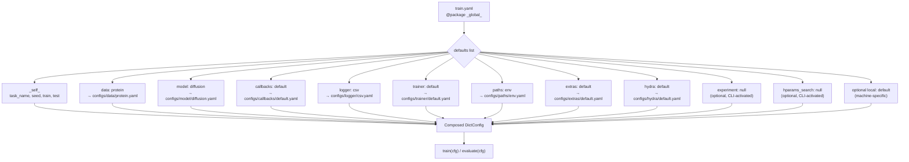

---
slug:22-hydra-configuration-hierarchy
blog_type:normal
---


IDPFold 的配置系统建立在 **Hydra** 之上——这是由 Meta Research 开发的一个框架，支持分层配置组合、动态命令行覆盖以及自动化对象实例化。训练和评估的方方面面，从模型架构、硬件分配到日志后端，统统通过一个 YAML 文件树来控制。在运行时，Hydra 会将这些文件组合成一个单一的 `DictConfig` 对象。理解这种层级结构至关重要：它是你指挥实验、替换组件和管理可复现性的控制平面。

## 入口点：Hydra 如何连接 Python

配置系统由两个入口点锚定。训练脚本通过一个装饰器向 Hydra 注册，该装饰器指向配置目录并指定根配置名称：

```python
@hydra.main(version_base="1.3", config_path="../configs", config_name="train.yaml")
def main(cfg: DictConfig) -> Optional[float]:
    extras(cfg)
    metric_dict, _ = train(cfg)
    ...
```

当你运行 `python src/train.py` 时，Hydra 会读取 `configs/train.yaml`，解析其 `defaults` 列表，插值所有变量引用，并将完全组合好的 `DictConfig` 传递给 `main()`。评估入口点遵循相同的模式，只是 `config_name="eval.yaml"`。`@task_wrapper` 装饰器包装了核心逻辑，以确保日志记录器能够优雅关闭并捕获异常，即便在多次扫描运行期间也是如此。

来源: [train.py](/src/train.py#L111-L135), [eval.py](/src/eval.py#L96-L110)

## Defaults 列表：配置组合架构

Hydra 系统的核心是 **defaults 列表**——这是一个有序的配置组选择序列，Hydra 会将其合并为一个统一的配置。`train.yaml` 文件在顶部声明了该列表：

```yaml
defaults:
  - _self_
  - data: protein
  - model: diffusion
  - callbacks: default
  - logger: csv
  - trainer: default
  - paths: env
  - extras: default
  - hydra: default
  - experiment: null
  - hparams_search: null
  - optional local: default
  - debug: null
```

顺序至关重要。Hydra 会从上到下处理 defaults 列表，后续条目会覆盖先前的条目。置于首位的 `_self_` 关键字意味着，直接在 `train.yaml` 中定义的标量值（如 `task_name`、`seed`、`train`、`test`）会被首先应用，并可能被后续的任何配置组覆盖。`train.yaml` 顶部的 `@package _global_` 指令确保所有值都合并到配置树的根级别，而不是嵌套在某个命名空间下。

<CgxTip>`experiment: null` 和 `hparams_search: null` 条目是**可选配置组**——它们默认为 `null`（未激活），但可以在命令行中直接激活，而无需修改任何 YAML 文件。这正是 Hydra 实现零文件修改实验管理的方式。</CgxTip>

来源: [train.yaml](/configs/train.yaml#L1-L28), [eval.yaml](/configs/eval.yaml#L1-L12)

组合流程可视化如下：



## 配置组：构建模块

defaults 列表中的每个条目都从一个**配置组**中选择一个文件——所谓配置组就是 `configs/` 下的一个目录，其中包含互斥的 YAML 选项。要切换选项，只需在命令行上修改一个词即可。

| 配置组 | 目录 | 可用选项 | 用途 |
|---|---|---|---|
| `data` | `configs/data/` | `protein`, `sampling` | 数据模块：训练数据集 vs. 推理采样 |
| `model` | `configs/model/` | `diffusion` | 模型架构、优化器、扩散器、损失函数、推理参数 |
| `callbacks` | `configs/callbacks/` | `default`, `none` | Lightning 回调：模型存盘、早停、进度条 |
| `logger` | `configs/logger/` | `csv`, `tensorboard`, `wandb`, `comet`, `mlflow`, `neptune`, `aim`, `many_loggers` | 实验跟踪后端 |
| `trainer` | `configs/trainer/` | `default`, `cpu`, `gpu`, `mps`, `ddp`, `ddp_sim` | Lightning Trainer：加速器、设备、策略 |
| `paths` | `configs/paths/` | `default`, `env` | 路径解析：根目录、数据、日志、输出目录 |
| `extras` | `configs/extras/` | `default` | 实用开关：警告、标签、配置打印 |
| `hydra` | `configs/hydra/` | `default` | Hydra 运行时：输出目录、日志处理器 |
| `experiment` | `configs/experiment/` | `example` | 针对特定运行的版本化超参数覆盖 |
| `hparams_search` | `configs/hparams_search/` | `optuna` | 通过 Optuna 扫描器进行超参数优化 |
| `local` | `configs/local/` | *(用户创建)* | 针对特定机器的覆盖配置，不纳入版本控制 |

`eval.yaml` 配置使用了相同配置组中的不同选项——使用 `data: sampling` 而非 `protein`，使用 `trainer: gpu` 而非 `default`，以及 `logger: null`（禁用）。这展示了相同的配置组如何通过设置不同的默认值来同时服务于训练和评估。

来源: [train.yaml](/configs/train.yaml#L5-L28), [eval.yaml](/configs/eval.yaml#L3-L11)

### 配置组内的嵌套 Defaults

配置组自身也可以包含 defaults 列表，从而形成多级组合。`callbacks/default.yaml` 就是一个典型的例子：

```yaml
defaults:
  - model_checkpoint
  - early_stopping
  - model_summary
  - rich_progress_bar
  - _self_

model_checkpoint:
  dirpath: ${paths.output_dir}/checkpoints
  monitor: "val/loss"
  mode: "min"
  ...
```

此配置组合了四个子回调配置——每个都为 Lightning 回调类定义了一个 `_target_`——然后应用来自 `_self_` 的覆盖值。`paths/env.yaml` 文件遵循相同的模式，继承自 `paths/default.yaml` 并添加了由环境变量驱动的路径：

```yaml
defaults:
  - default

cache_dir: ${oc.env:CACHE_DIR}
data_path: ${oc.env:TRAIN_DATA}
seq_embedding_path: ${oc.env:EMBEDDING}
test_data_path: ${oc.env:TEST_DATA}
```

来源: [callbacks/default.yaml](/configs/callbacks/default.yaml#L1-L23), [paths/env.yaml](/configs/paths/env.yaml#L1-L8), [paths/default.yaml](/configs/paths/default.yaml#L1-L19)

### Trainer 配置继承

Trainer 配置组展示了清晰的继承模式。`trainer/default.yaml` 定义了基础配置，包含 `accelerator: cpu` 和 `devices: 1`。诸如 `gpu.yaml`、`ddp.yaml` 和 `ddp_sim.yaml` 等专用配置各自声明了 `defaults: [default]`，并仅覆盖存在差异的字段：

| 配置 | 加速器 | 设备 | 策略 | 额外设置 |
|---|---|---|---|---|
| `default` | cpu | 1 | — | `max_epochs: 10`, `deterministic: False` |
| `cpu` | cpu | 1 | — | *(继承 default)* |
| `gpu` | gpu | 1 | — | *(继承 default)* |
| `mps` | mps | 1 | — | *(继承 default)* |
| `ddp` | gpu | 4 | `ddp_find_unused_parameters_true` | `sync_batchnorm: True`, `num_nodes: 1` |
| `ddp_sim` | cpu | 2 | `ddp_spawn` | *(用于在 CPU 上调试 DDP)* |

来源: [trainer/default.yaml](/configs/trainer/default.yaml#L1-L20), [trainer/gpu.yaml](/configs/trainer/gpu.yaml#L1-L6), [trainer/ddp.yaml](/configs/trainer/ddp.yaml#L1-L10), [trainer/ddp_sim.yaml](/configs/trainer/ddp_sim.yaml#L1-L8), [trainer/cpu.yaml](/configs/trainer/cpu.yaml#L1-L6), [trainer/mps.yaml](/configs/trainer/mps.yaml#L1-L6)

## 变量插值：动态配置解析

Hydra 使用 **OmegaConf 插值**在配置值之间创建动态引用。这意味着在配置树某处定义的值可以在另一处被引用和解析，从而消除冗余并确保一致性。IDPFold 使用了三种插值模式：

**1. 跨配置引用** 使用 `${path.to.value}` 语法。`paths/default.yaml` 文件将这些引用串联起来，构建出连贯的路径层级结构：

```yaml
root_dir: ${oc.env:PROJECT_ROOT}
data_dir: ${paths.root_dir}/data/
log_dir: ${paths.root_dir}/logs/
output_dir: ${hydra:runtime.output_dir}
work_dir: ${hydra:runtime.cwd}
```

**2. 环境变量解析** 使用 `${oc.env:VAR_NAME}` 语法。`initialize.py` 脚本会生成一个包含四个环境变量（`CACHE_DIR`、`TRAIN_DATA`、`EMBEDDING`、`TEST_DATA`）的 `.env` 文件，并在启动时由 `rootutils.setup_root()` 加载该文件。随后，这些变量会被 `paths/env.yaml` 消费。

**3. Hydra 运行时引用** 使用 `${hydra:runtime.xxx}` 语法。`hydra/default.yaml` 文件利用这些引用来构建带有动态时间戳的输出目录：

```yaml
run:
  dir: ${paths.log_dir}/${task_name}/runs/${now:%Y-%m-%d}_${now:%H-%M-%S}
sweep:
  dir: ${paths.log_dir}/${task_name}/multiruns/${now:%Y-%m-%d}_${now:%H-%M-%S}
  subdir: ${hydra.job.num}
```

这意味着每次运行都会生成一个唯一的输出目录，如 `logs/train/runs/2024-01-15_14-30-22/`，而多次扫描运行则会创建带编号的子目录（`0/`、`1/`、`2/`、...）。

<CgxTip>`${now:%Y-%m-%d_%H-%M-%S}` 插值是在 Hydra 组合配置的那一刻求值的，而不是在导入时。这保证了即使连续快速启动，每次运行也能获得一个全新的时间戳。</CgxTip>

来源: [paths/default.yaml](/configs/paths/default.yaml#L1-L19), [paths/env.yaml](/configs/paths/env.yaml#L1-L8), [hydra/default.yaml](/configs/hydra/default.yaml#L1-L20), [initialize.py](/initialize.py#L1-L22)

## 实例化：从配置到 Python 对象

组合后的 `DictConfig` 不仅仅是一个被动的数据结构——它更是**对象构建的蓝图**。Hydra 的 `hydra.utils.instantiate()` 函数会读取任意配置节点中的 `_target_` 字段，导入对应的 Python 类，并将剩余的键作为构造函数参数传递。

`src/train.py` 中的训练函数正是以这种方式实例化了所有主要组件：

```python
datamodule = hydra.utils.instantiate(cfg.data)
model = hydra.utils.instantiate(cfg.model)
trainer = hydra.utils.instantiate(cfg.trainer, callbacks=callbacks, logger=logger)
```

`_target_` 字段直接映射到完全限定的 Python 导入路径：

| 配置节点 | `_target_` 值 | Python 类 |
|---|---|---|
| `cfg.data` | `src.data.protein_datamodule.ProteinDataModule` | 蛋白质数据模块 |
| `cfg.data.dataset` | `src.data.components.dataset.PretrainPDBDataset` | PDB 训练数据集 |
| `cfg.model` | `src.models.diffusion_module.DiffusionLitModule` | Lightning 扩散模块 |
| `cfg.model.net` | `src.models.net.denoising_ipa.DenoisingNet` | 去噪网络 |
| `cfg.model.optimizer` | `torch.optim.Adam` | Adam 优化器 (`_partial_: true`) |
| `cfg.trainer` | `lightning.pytorch.trainer.Trainer` | Lightning Trainer |

### 嵌套实例化与偏函数应用

`model/diffusion.yaml` 配置展示了深度嵌套。`net` 键包含一个带有自身 `_target_` 的 `embedder` 子配置，而 `diffuser` 键包含 `trans_diffuser` 和 `rot_diffuser` 子配置——每一个都可以独立实例化。只要父类将它们作为构造函数参数接受，Hydra 就会在创建父对象时递归地实例化它们。

优化器和学习率调度器使用了 `_partial_: true`，这会指示 Hydra 返回一个偏函数，而非一个已完全构建的对象。这使得 Lightning 模块能够在适当的时机注入模型参数：

```yaml
optimizer:
  _target_: torch.optim.Adam
  _partial_: true
  lr: 1e-4
  weight_decay: 0.0
```

### 回调与日志记录器实例化

回调与日志记录器需要特殊处理，因为它们属于集合——必须从单个配置组中创建多个实例。`instantiate_callbacks()` 和 `instantiate_loggers()` 辅助函数会遍历配置字典，检查是否存在 `_target_`，并实例化每个条目：

```python
for _, cb_conf in callbacks_cfg.items():
    if isinstance(cb_conf, DictConfig) and "_target_" in cb_conf:
        callbacks.append(hydra.utils.instantiate(cb_conf))
```

这种模式使得 `callbacks/default.yaml` 能够将四个回调（模型存盘、早停、模型摘要、进度条）组合成一个单一列表，并传递给 Trainer。

来源: [train.py](/src/train.py#L58-L71), [instantiators.py](/src/utils/instantiators.py#L13-L56), [model/diffusion.yaml](/configs/model/diffusion.yaml#L1-L103)

## 实验覆盖：版本化超参数管理

实验配置提供了一种机制，用于**编码特定超参数组合并对其进行版本管理**，而无需修改基础配置。实验配置使用 `@package _global_` 和 `override` defaults 列表来选择基础配置的起点，随后应用针对性的参数变更：

```yaml
# @package _global_
defaults:
  - override /callbacks: default
  - override /data: protein
  - override /model: diffusion
  - override /trainer: ddp

callbacks:
  model_checkpoint:
    save_top_k: -1
    every_n_epochs: 10

data:
  batch_size: 4

trainer:
  min_epochs: 500
  max_epochs: 1000
  devices: 2

tags: ["dev"]
task_name: "example_experiment"
seed: 42
```

运行 `python src/train.py experiment=example` 会激活此配置，它将覆盖基础默认值，使用 4 个 GPU 进行 DDP 训练，每 10 个 epoch 保存所有检查点，并最多运行 1000 个 epoch。只有指定的参数发生了变化——其余一切均继承自基础配置。

来源: [experiment/example.yaml](/configs/experiment/example.yaml#L1-L43)

## 超参数搜索配置

`hparams_search/optuna.yaml` 配置会激活 Hydra 的 Optuna 扫描器插件以进行贝叶斯超参数优化。它覆盖了 Hydra 扫描器，定义了优化指标，并指定了搜索空间：

```yaml
hydra:
  mode: "MULTIRUN"
  sweeper:
    _target_: hydra_plugins.hydra_optuna_sweeper.optuna_sweeper.OptunaSweeper
    direction: minimize
    n_trials: 20
    sampler:
      _target_: optuna.samplers.TPESampler
      seed: 1234
      n_startup_trials: 10
    params:
      model.optimizer.lr: interval(0.00001, 0.1)
      data.batch_size: choice(1, 2, 4)
```

`hydra.mode: "MULTIRUN"` 设置会强制 Hydra 进入扫描模式。`optimized_metric` 字段（`val/loss`）由训练入口点中的 `get_metric_value()` 获取，并作为优化目标返回。TPE 采样器会在开始贝叶斯优化之前运行 10 次随机试验。

来源: [hparams_search/optuna.yaml](/configs/hparams_search/optuna.yaml#L1-L50), [utils.py](/src/utils/utils.py#L98-L119)

## 环境设置与路径解析链

路径解析系统遵循一个多阶段链条，将环境变量连接到运行时目录：

```mermaid
graph LR
    A["initialize.py"] -->|creates| B[".env file"]
    B -->|loaded by| C["rootutils.setup_root()"]
    C -->|sets| D["PROJECT_ROOT"]
    C -->|sets| E["CACHE_DIR, TRAIN_DATA,<br/>EMBEDDING, TEST_DATA"]
    D -->|${oc.env:PROJECT_ROOT}| F["paths/default.yaml<br/>root_dir, data_dir, log_dir"]
    E -->|${oc.env:...}| G["paths/env.yaml<br/>cache_dir, data_path,<br/>seq_embedding_path, test_data_path"]
    F -->|${paths.output_dir}| H["callbacks/<br/>loggers/<br/>model inference"]
    G -->|${paths.xxx}| H
```

两个入口点中的 `rootutils.setup_root()` 调用执行了三个关键操作：将项目根目录添加到 `PYTHONPATH`（允许在未安装包的情况下执行 `from src import ...` 导入），设置 `PROJECT_ROOT` 环境变量（供 `paths/default.yaml` 消费），并加载根目录中存在的任何 `.env` 文件。这确保了无论从哪个工作目录启动脚本，文件路径都能保持一致。

来源: [initialize.py](/initialize.py#L1-L22), [train.py](/src/train.py#L11-L27), [paths/default.yaml](/configs/paths/default.yaml#L1-L19), [paths/env.yaml](/configs/paths/env.yaml#L1-L8)

## 命令行覆盖模式

Hydra 最强大的功能在于能够通过命令行覆盖任何配置值，而无需编辑文件。下表总结了可用的覆盖模式：

| 模式 | 示例 | 效果 |
|---|---|---|
| 切换配置组 | `python src/train.py trainer=gpu` | 使用 `configs/trainer/gpu.yaml` 代替默认值 |
| 设置标量值 | `python src/train.py seed=42` | 将 `seed` 设置为 42 |
| 嵌套覆盖 | `python src/train.py model.optimizer.lr=1e-3` | 设置优化器学习率 |
| 列表覆盖 | `python src/train.py tags="[exp1, exp2]"` | 替换 tags 列表 |
| 激活实验 | `python src/train.py experiment=example` | 加载实验覆盖配置 |
| 激活超参数搜索 | `python src/train.py -m hparams_search=optuna` | 运行 Optuna 扫描 |
| 多重覆盖 | `python src/train.py trainer=gpu model.optimizer.lr=1e-3 seed=42` | 组合所有覆盖 |
| 调试模式 | `python src/train.py debug=default` | 激活调试配置（如果存在） |

`-m` 标志会触发**多次运行模式**，这是进行超参数扫描所必需的。在多次运行模式下，Hydra 会使用不同的参数组合多次执行脚本，并将输出组织到带编号的子目录中。

来源: [train.yaml](/configs/train.yaml#L5-L28), [hparams_search/optuna.yaml](/configs/hparams_search/optuna.yaml#L16-L17)

## 配置流程总结

配置从调用到对象实例化的完整生命周期遵循以下顺序：

1. **调用**：`python src/train.py trainer=gpu experiment=example`
2. **根路径解析**：`rootutils.setup_root()` 加载 `.env`，设置 `PROJECT_ROOT`
3. **Defaults 组合**：Hydra 读取 `train.yaml`，解析 defaults 列表，选择 `trainer/gpu.yaml`（由 CLI 覆盖）和 `experiment/example.yaml`
4. **插值**：OmegaConf 解析所有 `${...}` 引用——环境变量、跨配置路径、Hydra 运行时值、时间戳
5. **附加处理**：`extras()` 应用警告抑制、标签强制执行以及 Rich 配置树打印
6. **实例化**：`hydra.utils.instantiate()` 根据 `_target_` 字段构建数据模块、模型、回调、日志记录器和 trainer
7. **执行**：`train()` 函数调用 `trainer.fit()`，所有对象均根据组合后的配置进行设定

若要详细查阅模型配置中每个参数的参考说明，请前往 [模型配置参考](23-model-configuration-reference)。如需了解实验与 trainer 配置在实际中如何交互，请参阅 [实验与 Trainer 配置](24-experiment-and-trainer-configs)。