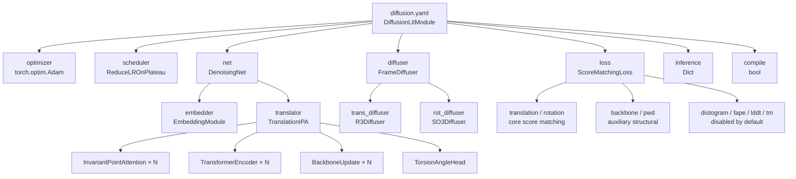

---
slug:23-model-configuration-reference
blog_type:normal
---


IDPFold 的模型配置完全在单个 Hydra YAML 文件中定义，该文件统筹协调五个子系统：**优化器**、**神经网络架构**、**扩散过程**、**损失函数**和**推理采样**。本页面提供了 `configs/model/diffusion.yaml` 的完整参数级参考，将每个 YAML 键映射到其调用的 Python 构造函数，解释了每个参数的数学作用，并指出了跨配置依赖关系。有关更广泛的 Hydra 组合层次结构，请参阅 [Hydra 配置层次结构](22-hydra-configuration-hierarchy)；有关训练器和实验覆盖配置，请参阅[实验与训练器配置](24-experiment-and-trainer-configs)。

来源：[diffusion.yaml](/configs/model/diffusion.yaml#L1-L103)

## 配置架构概述

模型配置通过 Hydra 的 `_target_` 实例化模式组合而成，其中每个嵌套块在运行时都会被解析为一个 Python 对象。顶层 `_target_` 指向 `DiffusionLitModule`，它充当 LightningModule 的包装器。所有嵌套块作为构造函数参数传入，从而创建出一个深度结构化的依赖树。



`DiffusionLitModule.__init__` 方法接受七个参数：`net`、`optimizer`、`scheduler`、`diffuser`、`loss`、`compile` 和 `inference`。Hydra 在注入前将每个 YAML 块解析为其目标对象。`loss` 块以原始字典（`Dict[str, Any]`）的形式存储，并在初始化时传给 `ScoreMatchingLoss(config=self.hparams.loss)`。这种延迟实例化模式允许在不修改构造函数签名的情况下切换损失组件。

来源：[diffusion.yaml](/configs/model/diffusion.yaml#L1-L103), [diffusion_module.py](/src/models/diffusion_module.py#L51-L78)

## 优化器与调度器

优化器和调度器使用 Hydra 的 `_partial_: true` 标志，将完整的实例化过程推迟到 Lightning 训练阶段调用 `configure_optimizers` 时进行。这是必要的，因为优化器需要 `self.trainer.model.parameters()` 作为其 `params` 参数，而该参数只有在模型附加到训练器后才可用。

| 参数 | YAML 路径 | 默认值 | 构造函数 | 描述 |
|-----------|-----------|---------|-------------|-------------|
| 学习率 | `optimizer.lr` | `1e-4` | `torch.optim.Adam` | Adam 优化器的初始学习率 |
| 权重衰减 | `optimizer.weight_decay` | `0.0` | `torch.optim.Adam` | L2 正则化系数（默认禁用） |
| 调度器模式 | `scheduler.mode` | `min` | `ReduceLROnPlateau` | 监控验证损失以进行降低 |
| 学习率因子 | `scheduler.factor` | `0.1` | `ReduceLROnPlateau` | 平台期时学习率乘以该因子 |
| 忍耐度 | `scheduler.patience` | `10` | `ReduceLROnPlateau` | 降低学习率前无改善的轮数 |

`configure_optimizers` 方法返回一个包含优化器和已配置的 `lr_scheduler` 条目的字典。调度器通过 Lightning 的 `ReduceLROnPlateau` 集成隐式地监控 `val/loss_best` —— 被监控的指标由调度器配置中的 `mode` 字段配置，而不是由 YAML 中显式的 `monitor` 键配置。

来源：[diffusion.yaml](/configs/model/diffusion.yaml#L3-L14), [diffusion_module.py](/src/models/diffusion_module.py#L384-L410)

## 神经网络架构 (`net`)

`net` 块实例化了 `DenoisingNet`，这是一个轻量级容器，将所有计算委托给两个子模块：`EmbeddingModule`（特征提取）和 `TranslationIPA`（通过不变点注意力进行迭代去噪）。`DenoisingNet.forward` 方法统筹数据流：嵌入 →（可选）序列嵌入拼接 → IPA 平移 → 骨架计算。

### 嵌入模块参数

`EmbeddingModule` 从三个信号源构建节点和边的表示：**扩散时间** `t`、**位置序列索引**，以及可选的 Cα 原子的**自条件化距离图**。

| 参数 | YAML 路径 | 默认值 | 描述 |
|-----------|-----------|---------|-------------|
| `init_embed_size` | `net.embedder.init_embed_size` | `32` | 时间和位置嵌入的维度；设定投影到 `node_embed_size` / `edge_embed_size` 之前的输入宽度 |
| `node_embed_size` | `net.embedder.node_embed_size` | `256` | 节点（单序列）表示的输出维度；必须与转换器中的 `c_s` 匹配 |
| `edge_embed_size` | `net.embedder.edge_embed_size` | `128` | 边（成对）表示的输出维度；必须与转换器中的 `c_z` 匹配 |
| `num_bins` | `net.embedder.num_bins` | `22` | 自条件化 Cα 距离图的距离分箱数；仅在 `self_conditioning: true` 时激活 |
| `min_bin` | `net.embedder.min_bin` | `1e-5` | 最小距离分箱边界（埃） |
| `max_bin` | `net.embedder.max_bin` | `20.0` | 最大距离分箱边界（埃） |
| `self_conditioning` | `net.embedder.self_conditioning` | `true` | 启用 RFDiffusion 风格的自条件化：将先前去噪过程的 Cα 位置分箱为距离图，并拼接到边特征上 |

节点输入维度动态计算为 `init_embed_size + 1`（时间嵌入 + 固定掩码）+ `init_embed_size`（位置嵌入）。边输入维度为 `2 * (init_embed_size + 1)`（双向时间特征）+ `init_embed_size`（相对位置）+ 可选的 `num_bins`（自条件化距离图）。两者都通过带有 ReLU 激活和 LayerNorm 的 3 层 MLP 进行投影。

<CgxTip>
`node_embed_size` 必须等于转换器配置中的 `c_s`，且 `edge_embed_size` 必须等于 `c_z` —— 这些在运行时不会进行验证。不匹配将导致在 IPA 前向传播深处出现静默的维度错误。此外，当 `seq_emb` 存在于批次中时（维度为 1536 的 ESM 嵌入），`DenoisingNet` 会将其拼接到节点特征上，并通过 `nn.Linear(1536, 256)` 进行投影 —— 此维度是**硬编码**的，如果 ESM 模型维度发生变化，将会导致报错。
</CgxTip>

来源：[diffusion.yaml](/configs/model/diffusion.yaml#L18-L26), [denoising_ipa.py](/src/models/net/denoising_ipa.py#L49-L159), [denoising_ipa.py](/src/models/net/denoising_ipa.py#L162-L221)

### TranslationIPA 参数

`TranslationIPA` 是核心的去噪主干。它堆叠了 `no_ipa_blocks` 个迭代细化模块，每个模块包含一个 IPA 注意力层、一个 Transformer 编码器、一个节点过渡 MLP、一个骨架更新，以及（除最后一个模块外）一个边过渡。

| 参数 | YAML 路径 | 默认值 | 描述 |
|-----------|-----------|---------|-------------|
| `c_s` | `net.translator.c_s` | `256` | 单序列（节点）表示通道维度；必须与 `node_embed_size` 匹配 |
| `c_z` | `net.translator.c_z` | `128` | 成对（边）表示通道维度；必须与 `edge_embed_size` 匹配 |
| `coordinate_scaling` | `net.translator.coordinate_scaling` | `0.1` | IPA 之前平移的缩放因子；坐标除以 10 以保持幅度接近单位尺度 |
| `no_ipa_blocks` | `net.translator.no_ipa_blocks` | `4` | 迭代 IPA + Transformer 细化模块的数量 |
| `skip_embed_size` | `net.translator.skip_embed_size` | `64` | 从初始节点嵌入进行跳跃连接投影的维度；在 Transformer 之前与节点特征拼接 |
| `transformer_num_heads` | `net.translator.transformer_num_heads` | `4` | `nn.TransformerEncoderLayer` 中的注意力头数 |
| `transformer_num_layers` | `net.translator.transformer_num_layers` | `2` | 每个 IPA 块中的 Transformer 编码器层数 |
| `c_hidden` | `net.translator.c_hidden` | `256` | IPA 注意力内部的隐藏通道维度（每个头） |
| `no_heads` | `net.translator.no_heads` | `8` | IPA 注意力头的数量 |
| `no_qk_points` | `net.translator.no_qk_points` | `8` | IPA 中每个头生成的查询/键 3D 点的数量 |
| `no_v_points` | `net.translator.no_v_points` | `12` | IPA 中每个头生成的值 3D 点的数量 |
| `dropout` | `net.translator.dropout` | `0.0` | Dropout 比率（默认禁用；IPA 内部不应用它 —— 它未被接入构造函数） |

每个 IPA 块遵循此序列：IPA 注意力 → LayerNorm 残差 → 跳跃连接拼接 → TransformerEncoder → 线性投影残差 → NodeTransition MLP → BackboneUpdate（刚体组合）。BackboneUpdate 从 `c_s` 维度的特征生成一个 6 分量的四元数-平移更新向量，仅通过 `diffuse_mask` 应用于扩散（非固定）残基。除最后一个模块外，所有模块中的边过渡都会更新成对表示。

来源：[diffusion.yaml](/configs/model/diffusion.yaml#L27-L40), [ipa.py](/src/models/net/ipa.py#L273-L390), [layers.py](/src/models/net/layers.py#L128-L241)

## 扩散器配置 (`diffuser`)

`diffuser` 块实例化了 `FrameDiffuser`，它包装了独立的 R³（平移）和 SO(3)（旋转）扩散器。每个都可以设置为 `null` 以禁用沿该流形的扩散 —— `FrameDiffuser` 通过返回零分数和恒等变换来优雅地处理这种情况。

### FrameDiffuser 顶层

| 参数 | YAML 路径 | 默认值 | 描述 |
|-----------|-----------|---------|-------------|
| `min_t` | `diffuser.min_t` | `1e-2` | 训练期间采样的最小时间 `t`；防止在 `t → 0` 时出现数值不稳定性（此时分数幅度发散） |

在 `model_step` 期间，时间 `t` 均匀采样为 `(1 - min_t) * rand() + min_t`，确保 `t ∈ [min_t, 1.0]`。

来源：[diffusion.yaml](/configs/model/diffusion.yaml#L42-L58), [frame.py](/src/models/score/frame.py#L21-L34), [diffusion_module.py](/src/models/diffusion_module.py#L117-L125)

### R³ 平移扩散器 (VPSDE)

`R3Diffuser` 为 ℝ³ 中的平移实现了保方差 SDE (VPSDE)。

| 参数 | YAML 路径 | 默认值 | 描述 |
|-----------|-----------|---------|-------------|
| `min_b` | `diffuser.trans_diffuser.min_b` | `0.1` | `t=0` 时线性漂移系数 `b(t)` 的最小值 |
| `max_b` | `diffuser.trans_diffuser.max_b` | `20.0` | `t=1` 时 `b(t)` 的最大值；控制总噪声注入幅度 |
| `coordinate_scaling` | `diffuser.trans_diffuser.coordinate_scaling` | `0.1` | 应用于坐标的扩散前缩放因子（埃 → 模型单位）；应与 `net.translator.coordinate_scaling` 匹配 |

漂移函数为 `b(t) = min_b + t * (max_b - min_b)`，边缘累积噪声为 `β(t) = t·min_b + 0.5·t²·(max_b - min_b)`。在将 `x_0` 乘以 `coordinate_scaling` 进行缩放后，前向边缘样本为 `x_t = exp(-0.5·β(t))·x_0 + √(1 - exp(-β(t)))·z`，其中 `z ~ N(0, I)`。

来源：[diffusion.yaml](/configs/model/diffusion.yaml#L44-L48), [r3.py](/src/models/score/r3.py#L8-L74)

### SO(3) 旋转扩散器 (IGSO(3))

`SO3Diffuser` 使用 IGSO(3) 分布实现旋转群上的扩散，该分布是 SO(3) 上高斯分布的类比。

| 参数 | YAML 路径 | 默认值 | 描述 |
|-----------|-----------|---------|-------------|
| `num_omega` | `diffuser.rot_diffuser.num_omega` | `1000` | 用于 CDF/分数查找表的离散化旋转角 ω ∈ (0, π] 的数量 |
| `num_sigma` | `diffuser.rot_diffuser.num_sigma` | `1000` | 用于 IGSO(3) 参数网格的离散化 σ 值的数量 |
| `min_sigma` | `diffuser.rot_diffuser.min_sigma` | `0.1` | 对数调度中的最小 σ 值 |
| `max_sigma` | `diffuser.rot_diffuser.max_sigma` | `1.5` | 对数调度中的最大 σ 值 |
| `schedule` | `diffuser.rot_diffuser.schedule` | `logarithmic` | σ(t) 调度函数；目前仅支持 `logarithmic` |
| `cache_dir` | `diffuser.rot_diffuser.cache_dir` | `${paths.cache_dir}` | 缓存预计算的 PDF、CDF 和分数范数表的目录；从 `CACHE_DIR` 环境变量解析 |
| `use_cached_score` | `diffuser.rot_diffuser.use_cached_score` | `false` | 如果为 `true`，使用预计算的分数查找表；如果为 `false`，通过 PyTorch 动态计算 IGSO(3) 展开 |

σ 调度为 `σ(t) = log(t·e^{max_sigma} + (1-t)·e^{min_sigma})`，在 `min_sigma` 和 `max_sigma` 之间产生对数插值。初始化时，扩散器在 `(num_sigma, num_omega)` 网格上预计算三个张量 —— PDF 值、CDF 值和分数范数。这些被缓存到磁盘上一个以所有超参数命名的目录中（例如，`eps_1000_omega_1000_min_sigma_0_1_max_sigma_1_5_schedule_logarithmic`）。如果缓存文件已存在，则直接加载。

<CgxTip>
设置 `use_cached_score: true` 是以空间换速度：分数查找使用 `torch.bucketize` 进行 O(1) 插值，而 `false` 则在每次前向传播时重新计算完整的 IGSO(3) 幂级数展开（截断至 L=1000 项）。对于频繁进行分数查询的训练，强烈建议启用缓存。当 `num_sigma`、`num_omega`、`min_sigma`、`max_sigma` 或 `schedule` 发生变化时，缓存会自动失效，因为它们构成了缓存目录名。
</CgxTip>

来源：[diffusion.yaml](/configs/model/diffusion.yaml#L49-L58), [so3.py](/src/models/score/so3.py#L133-L200), [paths/env.yaml](/configs/paths/env.yaml#L4)

## 损失配置 (`loss`)

`loss` 块作为普通字典传递给 `ScoreMatchingLoss.__init__`，后者将其存储为 `self.config`。损失聚合逻辑遍历已启用的损失组件，将每个组件乘以其权重并求和。两种损失类型**始终激活**（平移和旋转分数匹配），而五个辅助损失通过其 `enabled` 标志**按需启用**。

### 核心分数匹配损失（始终激活）

| 参数 | YAML 路径 | 默认值 | 描述 |
|-----------|-----------|---------|-------------|
| 平移权重 | `loss.translation.weight` | `1.0` | 平移分数匹配 + x₀ 损失组合的权重 |
| `coordinate_scaling` | `loss.translation.coordinate_scaling` | `0.1` | 应用于 x₀ 预测损失的缩放比例；应与扩散器/转换器的缩放比例匹配 |
| `x0_threshold` | `loss.translation.x0_threshold` | `1.0` | 时间阈值，低于该阈值时 x₀ 回归损失将替代平移的分数匹配损失 |
| 旋转权重 | `loss.rotation.weight` | `1.0` | 旋转分数匹配损失的权重 |

平移损失采用**混合策略**：对于 `t > x0_threshold`，它计算预测和真实平移分数之间的 MSE（由分数缩放归一化）；对于 `t ≤ x0_threshold`，它切换为直接的 x₀ 回归损失 —— 预测和真实 Cα 位置之间的平方误差。这是因为当 `t → 0` 时分数匹配在数值上变得不稳定，此时条件方差趋近于零。旋转损失全程采用纯分数匹配，因为 IGSO(3) 分数始终保持良好的表现。

来源：[diffusion.yaml](/configs/model/diffusion.yaml#L60-L85), [loss.py](/src/models/loss.py#L1629-L1666)

### 辅助结构损失

| 损失组件 | YAML 路径 | 默认 `enabled` | 默认 `weight` | 附加参数 | 描述 |
|----------------|-----------|--------------------|--------------------|-------------------|-------------|
| `backbone` | `loss.backbone` | `true` | `0.25` | `t_threshold: 0.25` | 预测与真实骨架原子位置（N, Cα, C, O, Cβ）之间的 MSE；仅在 `t < t_threshold` 时应用 |
| `pwd` | `loss.pwd` | `true` | `0.25` | `t_threshold: 0.25` | 骨架原子之间的成对距离损失；掩码至 `dist_threshold` (6.0 Å) 以内的对；仅在 `t < t_threshold` 时应用 |
| `distogram` | `loss.distogram` | `false` | — | — | 距离图分类损失（要求模型输出中包含 `distogram_logits`） |
| `supervised_chi` | `loss.supervised_chi` | `false` | — | — | 扭转角监督损失（要求模型输出中包含 `sm.angles`） |
| `fape` | `loss.fape` | `false` | — | — | 帧对齐点误差损失（要求模型输出中包含 `sm.frames`） |
| `lddt` | `loss.lddt` | `false` | — | — | pLDDT 预测损失（要求模型输出中包含 `lddt_logits`） |
| `tm` | `loss.tm` | `false` | — | — | TM-score 预测损失（要求模型输出中包含 `tm_logits`） |

`backbone` 和 `pwd` 损失共享一个关键的设计模式：它们通过 `t_threshold` 进行**时间门控**。两者都在 `compute_backbone(rigids_pred, psi_pred, aatype)` 生成的 atom37 表示上计算结构误差，但将每个样本的损失乘以 `(batch['t'] < t_threshold)`。这意味着这些损失仅在低噪声时间步贡献，此时模型的预测足够接近真实值，使得坐标级监督具有意义。在高噪声（早期扩散步骤）时，预测本质上是随机的，结构损失会提供误导性的梯度。

`pwd`（成对距离）损失额外过滤出预测距离低于 `dist_threshold: 6.0` Å 的对，将梯度集中在局部结构准确性而非全局拓扑上。归一化使用 `sum(pair_mask) - n_res + eps` 以考虑被排除的对角线。

全局 `eps` 参数（`loss.eps: 1e-6`）用作整体损失归一化中的分母正则化项。

来源：[diffusion.yaml](/configs/model/diffusion.yaml#L66-L85), [loss.py](/src/models/loss.py#L1553-L1622), [loss.py](/src/models/loss.py#L1668-L1741)

## 推理配置 (`inference`)

`inference` 块配置在 `DiffusionLitModule.predict_step` 中执行的采样过程。这些参数控制前向-后向采样策略、副本计数和输出处理。

| 参数 | YAML 路径 | 默认值 | 描述 |
|-----------|-----------|---------|-------------|
| `delta_min` | `inference.delta_min` | `0.25` | 部分噪声采样的最小前向噪声水平 ΔT |
| `delta_max` | `inference.delta_max` | `0.35` | 最大前向噪声水平 ΔT |
| `delta_step` | `inference.delta_step` | `0.05` | 迭代 ΔT 值的步长 |
| `n_replica` | `inference.n_replica` | `192` | 每个 ΔT 值的结构副本数（如果 `backward_only` 则为总数） |
| `replica_per_batch` | `inference.replica_per_batch` | `64` | 采样期间每个 GPU 批次处理的副本数 |
| `num_timesteps` | `inference.num_timesteps` | `1000` | 反向 SDE 的离散化时间步数；实际步数 = `int(num_timesteps * T)`，其中 `T` 为有效噪声水平 |
| `noise_scale` | `inference.noise_scale` | `1.0` | 反向 SDE 中的随机噪声乘数；设为 0 会产生确定性 ODE 采样 |
| `probability_flow` | `inference.probability_flow` | `false` | 如果为 `true`，使用概率流 ODE（确定性）代替反向 SDE |
| `self_conditioning` | `inference.self_conditioning` | `true` | 在采样期间启用自条件化（要求 `net.embedder.self_conditioning: true`） |
| `min_t` | `inference.min_t` | `1e-2` | 反向轨迹中的最小时间步；与 `diffuser.min_t` 匹配 |
| `output_dir` | `inference.output_dir` | `${paths.output_dir}/samples` | 采样 PDB 文件的输出目录 |
| `backward_only` | `inference.backward_only` | `true` | 如果为 `true`，跳过前向加噪并从先验采样（从 `t=1` 开始完全去噪）；`n_replica` 乘以 ΔT 值的数量 |

采样结构总数取决于模式。在**前向-后向模式**（`backward_only: false`）下，总数为 `n_replica × len(arange(delta_min, delta_max + 1e-5, delta_step))`，每个 ΔT 组在去噪前被加噪至 `ΔT` 水平。在**纯后向模式**（`backward_only: true`）下，ΔT 迭代被折叠 —— 所有副本从 `t=1` 的先验开始 —— 有效副本数为 `n_replica × num_delta_values`。使用默认配置，这会生成 `192 × 3 = 576` 个结构（ΔT 值：0.25, 0.30, 0.35），每个结构作为单独的模型保存在多模型 PDB 文件中。

采样以 `replica_per_batch` 个副本为小批量进行，以管理 GPU 内存。输入蛋白质的批次维度被断言为 1（`batch['aatype'].shape[0] == 1`），副本是通过沿批次维度重复单个蛋白质来创建的。

来源：[diffusion.yaml](/configs/model/diffusion.yaml#L88-L100), [diffusion_module.py](/src/models/diffusion_module.py#L214-L370)

## 模型编译 (`compile`)

| 参数 | YAML 路径 | 默认值 | 描述 |
|-----------|-----------|---------|-------------|
| `compile` | `compile` | `false` | 如果为 `true`，在 `fit` 阶段使用 `torch.compile()` 包装 `self.net` 以进行 PyTorch 2.0+ 图优化 |

编译仅在 `stage == "fit"` 时于 `DiffusionLitModule.setup` 中触发，因此它不会影响推理或评估。编译后的模型会就地替换 `self.net`。

来源：[diffusion.yaml](/configs/model/diffusion.yaml#L102-L103), [diffusion_module.py](/src/models/diffusion_module.py#L372-L382)

## 跨配置依赖

一些参数必须在不同的配置块和外部配置之间保持一致。下表总结了这些隐式契约：

| 参数 | 出现位置 | 约束条件 | 违反后果 |
|-----------|-----------|------------|--------------------------|
| `coordinate_scaling` | `net.translator`, `diffuser.trans_diffuser`, `loss.translation` | 必须全部相等（默认：`0.1`） | 缩放不匹配会导致损失和前向传播之间出现静默的梯度不对齐 |
| `node_embed_size` / `c_s` | `net.embedder.node_embed_size`, `net.translator.c_s` | 必须相等（默认：`256`） | 节点特征拼接中的维度不匹配 |
| `edge_embed_size` / `c_z` | `net.embedder.edge_embed_size`, `net.translator.c_z` | 必须相等（默认：`128`） | 输入到 IPA 的边特征维度不匹配 |
| `min_t` | `diffuser.min_t`, `inference.min_t` | 应该相等（默认：`1e-2`） | 训练/采样分布在轨迹端点处不匹配 |
| `self_conditioning` | `net.embedder.self_conditioning`, `inference.self_conditioning` | 推理由 `net.embedder.self_conditioning` 门控（逻辑与） | 如果嵌入器为 `false`，推理自条件化将被静默禁用 |
| `cache_dir` | `diffuser.rot_diffuser.cache_dir` | 需要 `CACHE_DIR` 环境变量 | 如果未设置环境变量，Hydra 插值在启动时会失败 |
| `output_dir` | `inference.output_dir` | 需要 `paths.output_dir`（Hydra 运行时） | 动态解析；仅在 Hydra 创建运行目录后可用 |

来源：[diffusion.yaml](/configs/model/diffusion.yaml#L1-L103), [diffusion_module.py](/src/models/diffusion_module.py#L238-L243), [paths/env.yaml](/configs/paths/env.yaml#L4-L7)

## 实验级覆盖

位于 `configs/experiment/example.yaml` 的实验配置演示了如何在不修改基础配置的情况下覆盖模型参数。它使用 Hydra 的 `override` 指令选择特定的默认值（例如，`ddp` 训练器，`protein` 数据），然后提供一个合并后的参数字典：

```yaml
model:
  optimizer:
    lr: 1e-4
```

这种浅合并仅替换优化器块中的 `lr` 键，保留所有其他优化器默认值（`weight_decay: 0.0`，`_target_`，`_partial_`）。实验配置还覆盖了 `trainer.min_epochs: 500`、`trainer.max_epochs: 1000`、`trainer.devices: 2` 和 `data.batch_size: 4`，说明了定义可复现训练运行的标准工作流。

来源：[example.yaml](/configs/experiment/example.yaml#L1-L43)

## 延伸阅读

- **[Hydra 配置层次结构](22-hydra-configuration-hierarchy)** — `diffusion.yaml` 如何通过 Hydra 默认值与数据、训练器和日志记录器配置组合
- **[实验与训练器配置](24-experiment-and-trainer-configs)** — 训练器后端（CPU、GPU、DDP）和实验覆盖模式的完整参考
- **[去噪网络流水线](12-denoising-network-pipeline)** — `DenoisingNet` 前向传播和数据流的详细演练
- **[帧扩散器集成](9-frame-diffuser-integration)** — 此处配置的 SE(3) 扩散过程的数学基础
- **[分数匹配损失](14-score-matching-loss)** — 核心损失函数的推导与实现细节