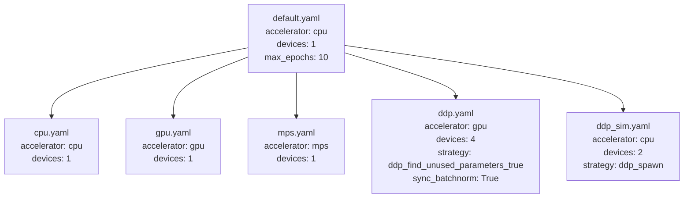
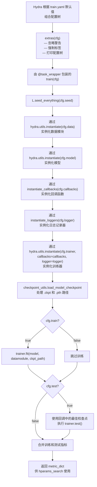

---
slug:24-experiment-and-trainer-configs
blog_type:normal
---

IDPFold 的配置系统利用 Hydra 的组合机制，实现了实验定义、训练器硬件适配、回调函数以及超参数搜索之间的关注点分离。本文档将介绍实验配置如何覆盖默认训练流水线、六种训练器配置如何映射到不同的硬件策略，以及训练入口点如何将组合后的配置实例化为实际的 PyTorch Lightning 训练循环。

## 配置组合根

`train.yaml` 文件是所有训练运行的**主组合根**。它声明了一个有序的 Hydra 默认列表，逐步组装出完整的配置树：数据、模型、回调函数、日志记录器、训练器、路径、附加设置以及 Hydra 自身设置。有两个可选槽位——`experiment: null` 和 `hparams_search: null`——保持非激活状态，除非通过命令行显式启用（例如：`python train.py experiment=example`）。第三个可选槽位 `local: default` 用于支持特定于机器的覆盖配置，同时避免污染版本控制。文件顶部的 `@package _global_` 指令确保所有在顶层定义的键被直接注入到全局命名空间中，而不是嵌套在某个组键下。

除了默认列表，`train.yaml` 还定义了几个控制训练生命周期的**运行时控制标志**：`train: true` 控制是否调用 `trainer.fit()`；`test: false` 控制在训练后是否使用最佳检查点权重在测试集上进行评估；`ckpt_path: null` 在指向 `.ckpt` 或 `.pth` 文件时支持恢复训练；`seed: null` 在设置后为 PyTorch、NumPy 和 Python 的 `random` 模块提供随机种子。`task_name: "train"` 和 `tags: ["dev"]` 字段分别用于决定输出目录的命名规范和实验标识。

来源：[train.yaml](/configs/train.yaml#L1-L50), [eval.yaml](/configs/eval.yaml#L1-L20)

## 实验配置：作用域覆盖

实验配置的存在是为了在版本控制下**冻结特定的超参数组合**。实验文件无需直接修改默认的数据、模型或训练器配置，而是通过 Hydra 的 `override` 指令声明覆盖，并仅指定与默认值不同的参数。内置示例 `configs/experiment/example.yaml` 演示了这种模式：它将训练器组覆盖为 `ddp`，然后对四个参数组进行微调。

实验的 `defaults` 块使用 `override /trainer: ddp`、`override /data: protein`、`override /model: diffusion` 和 `override /callbacks: default` 来替换相应的默认组选择。在组覆盖解析完成后，实验的顶层键会合并到全局配置中，覆盖特定的嵌套参数：

| 参数组 | 覆盖键 | 示例值 | 效果 |
|---|---|---|---|
| 回调函数 | `callbacks.model_checkpoint.save_top_k` | `-1` | 保存所有检查点，而非仅保存最佳 |
| 回调函数 | `callbacks.model_checkpoint.every_n_epochs` | `10` | 每 10 个 epoch 保存一次检查点 |
| 回调函数 | `callbacks.model_checkpoint.save_last` | `false` | 禁用 `last.ckpt` 自动保存 |
| 数据 | `data.batch_size` | `4` | 将默认批次大小加倍 |
| 模型 | `model.optimizer.lr` | `1e-4` | 设置 Adam 学习率 |
| 训练器 | `trainer.min_epochs` | `500` | 防止在 500 个 epoch 前提前停止 |
| 训练器 | `trainer.max_epochs` | `1000` | 硬性上限设为 1000 个 epoch |
| 训练器 | `trainer.devices` | `2` | 为 DDP 使用 2 个 GPU |

该实验还设置了 `task_name: "example_experiment"`、`seed: 42` 和 `tags: ["dev"]`，用于控制输出目录路径和实验元数据。执行命令为：`python train.py experiment=example`。

来源：[example.yaml](/configs/experiment/example.yaml#L1-L43), [train.yaml](/configs/train.yaml#L16-L21)

## 训练器配置层级

六个训练器 YAML 文件构成了一个以 `configs/trainer/default.yaml` 为根的**单继承层级结构**。每个专用配置都以 `defaults: [default]` 开头，然后仅覆盖存在差异的字段。基础配置通过 Hydra 的 `_target_` 机制实例化 `lightning.pytorch.trainer.Trainer`，并确立了合理的默认值：`min_epochs: 1`、`max_epochs: 10`、`accelerator: cpu`、`devices: 1`、`check_val_every_n_epoch: 1`、`deterministic: False`，以及解析为 `${paths.output_dir}` 的 `default_root_dir`。

这些专用配置在三个维度上有所不同：**加速器类型**、**设备数量**和**分布式策略**：

| 配置 | 加速器 | 设备数 | 策略 | 同步批归一化 | 适用场景 |
|---|---|---|---|---|---|
| `default` | cpu | 1 | — | — | 本地开发，CI |
| `cpu` | cpu | 1 | — | — | 显式指定 CPU |
| `gpu` | gpu | 1 | — | — | 单 GPU 训练 |
| `mps` | mps | 1 | — | — | Apple Silicon |
| `ddp` | gpu | 4 | `ddp_find_unused_parameters_true` | True | 多 GPU 生产环境训练 |
| `ddp_sim` | cpu | 2 | `ddp_spawn` | — | 在无 GPU 环境下调试 DDP |

DDP 配置值得注意：它设置了 `strategy: ddp_find_unused_parameters_true` 而非标准的 `ddp` 策略。这是必须的，因为 IDPFold 的 `DenoisingNet` 包含条件执行路径（例如，自条件分支、由 `t_threshold` 触发的辅助损失头），这些路径在每次前向传播中可能不会使用所有参数。如果不设置 `find_unused_parameters=True`，DDP 会发生死锁。`sync_batchnorm: True` 设置确保批归一化统计数据在所有 GPU 间同步，这对于扩散模型的 IPA 模块至关重要，因为归一化统计数据直接影响注意力的缩放。

来源：[default.yaml](/configs/trainer/default.yaml#L1-L20), [cpu.yaml](/configs/trainer/cpu.yaml#L1-L6), [gpu.yaml](/configs/trainer/gpu.yaml#L1-L6), [mps.yaml](/configs/trainer/mps.yaml#L1-L6), [ddp.yaml](/configs/trainer/ddp.yaml#L1-L10), [ddp_sim.yaml](/configs/trainer/ddp_sim.yaml#L1-L8)

## 回调函数组合

默认回调函数组在 `configs/callbacks/default.yaml` 中定义，将四个 Lightning 回调函数组合成一个有序列表。`defaults` 块引入 `model_checkpoint`、`early_stopping`、`model_summary` 和 `rich_progress_bar` 作为基础模板，然后通过 `_self_` 在此基础上应用覆盖。这种排序意味着基础模板提供 `_target_` 和默认参数，而 `default.yaml` 主体覆盖特定字段。

**ModelCheckpoint** 回调配置为在 `min` 模式下监控 `val/loss`，将最佳检查点以 `epoch_{epoch:03d}` 的文件名模式保存到 `${paths.output_dir}/checkpoints`。`save_last: True` 和 `auto_insert_metric_name: False` 设置确保始终存在 `last.ckpt` 符号链接，同时保持文件名整洁。**EarlyStopping** 回调共享相同的 `val/loss` 监控，并设置 `patience: 100`，这个值特意设置得较为宽松——因为扩散模型的损失曲线在出现改善之前可能会经历长时间的停滞。**RichModelSummary** 回调以 `max_depth: -1`（无限嵌套）打印层结构，而 **RichProgressBar** 提供基于终端的进度可视化。

<CgxTip>`configs/callbacks/early_stopping.yaml` 中的 `early_stopping` 基础模板设置了 `monitor: ???`（这是 Hydra 的“必须覆盖”哨兵值）。这意味着除非调用方配置（如 `default.yaml`）显式设置了监控值，否则回调函数将无法组合。这可以防止早停机制因静默配置错误而失效的情况发生。</CgxTip>

当实验配置覆盖回调函数组时，可以 selectively 修改单个回调参数，而无需重新定义整个集合。示例实验通过在模型检查点回调上设置 `save_top_k: -1`（保存所有）、`every_n_epochs: 10` 和 `save_last: false` 来演示这一点，同时保持其他三个回调不变。

来源：[default.yaml](/configs/callbacks/default.yaml#L1-L23), [model_checkpoint.yaml](/configs/callbacks/model_checkpoint.yaml#L1-L18), [early_stopping.yaml](/configs/callbacks/early_stopping.yaml#L1-L16), [model_summary.yaml](/configs/callbacks/model_summary.yaml#L1-L6), [rich_progress_bar.yaml](/configs/callbacks/rich_progress_bar.yaml#L1-L5)

## 训练入口点：从配置到执行

`src/train.py` 模块使用 `@hydra.main(version_base="1.3", config_path="../configs", config_name="train.yaml")` 装饰，指示 Hydra 在调用 `main(cfg)` 之前组合完整的配置树。执行流程分为四个阶段：**预处理**、**实例化**、**训练**和**指标提取**。

`train()` 函数被 `@task_wrapper` 装饰器包装，提供了**故障安全执行**能力：它会捕获异常并将其记录到 `.log` 文件中，同时确保即使在崩溃的情况下也能正确关闭 W&B 运行——这对于多重运行扫描至关重要。实例化阶段对数据、模型和训练器使用 `hydra.utils.instantiate()`，而回调函数和日志记录器则通过 `instantiate_callbacks()` 和 `instantiate_loggers()` 辅助函数进行实例化。这些辅助函数遍历配置的键值对，过滤出包含 `_target_` 的条目，并通过 Hydra 的实用工具逐一实例化。

检查点加载步骤值得特别关注。`checkpoint_utils.load_model_checkpoint()` 函数区分了两种检查点格式：`.ckpt` 文件是标准的 PyTorch Lightning 检查点，由训练器的 `fit(ckpt_path=...)` 调用原生处理；而 `.pth` 文件仅包含网络的状态字典，需要手动加载到 `model.net` 中，并从键中去除 `net.` 前缀。这种双路径设计既支持恢复完整的训练状态（优化器、调度器、epoch 计数器），也支持仅加载预训练主干网络权重进行微调，而无需继承原有的训练计划。

训练完成后，如果 `cfg.test` 为 `true`，函数将从 `trainer.checkpoint_callback.best_model_path` 获取最佳检查点路径并运行 `trainer.test()`。返回的 `metric_dict`——训练和测试回调指标的合并结果——会回流到 `main()`，由 `get_metric_value()` 提取 `optimized_metric`，供基于 Optuna 的超参数优化使用。

来源：[train.py](/src/train.py#L43-L135), [utils.py](/src/utils/utils.py#L43-L95), [instantiators.py](/src/utils/instantiators.py#L13-L33), [checkpoint_utils.py](/src/utils/checkpoint_utils.py#L1-L28)

## 评估配置与入口点

`eval.yaml` 配置的结构与 `train.yaml` 类似，但针对推理进行了优化。主要区别在于：数据组默认为 `sampling`（使用 `SamplingPDBDataset`，`batch_size: 1`，并禁用重新居中/缩放变换）；日志记录器设为 `null`（无需实验跟踪）；训练器默认为 `gpu`；且 `ckpt_path` 为必填项——默认为 `${paths.data_dir}/last.ckpt`。此外，还提供了一个 `pred_dir: null` 字段，用于指定自定义的预测输出目录。

`src/eval.py` 入口点遵循简化的实例化流程：创建数据模块、模型和训练器（无回调函数），加载检查点，然后调用 `datamodule.setup(stage="predict")` 初始化预测数据加载器。不同于 `trainer.test()`，它使用测试数据加载器调用 `trainer.predict()`，其返回值——预测列表的最后一个元素——即为预测输出目录路径。

来源：[eval.yaml](/configs/eval.yaml#L1-L20), [eval.py](/src/eval.py#L45-L93), [sampling.yaml](/configs/data/sampling.yaml#L1-L20)

## 使用 Optuna 进行超参数搜索

`configs/hparams_search/optuna.yaml` 配置激活了 Hydra 的 Optuna sweeper 插件，用于自动超参数优化。它将 `hydra/sweeper` 覆盖为 `OptunaSweeper`，并将 `optimized_metric` 设置为 `"val/loss"`，这必须与 `DiffusionLitModule` 记录的指标相匹配。sweeper 配置指定了以下内容：

- **方向**：`minimize`（损失越低越好）
- **试验次数**：共 `n_trials: 20` 次优化运行
- **采样器**：`TPESampler`（树状结构 Parzen 估计器），设置 `seed: 1234` 和 `n_startup_trials: 10`，即在贝叶斯优化介入前进行 10 次随机运行
- **搜索空间**：`model.optimizer.lr` 在 `interval(0.00001, 0.1)` 范围内，`data.batch_size` 在 `choice(1, 2, 4)` 中选择

由于 `hparams_search=optuna` 设置了 `hydra.mode: "MULTIRUN"`，Hydra 会自动处理扫描循环。`train.py` 中 `main()` 的 `get_metric_value()` 函数会从每次运行的 `metric_dict` 中提取优化指标，并将其返回给 sweeper。启动搜索的命令为：`python train.py -m hparams_search=optuna experiment=example`。

<CgxTip>`optuna.yaml` 中定义的搜索空间使用点路径语法引用 `model.optimizer.lr` 和 `data.batch_size`。这些路径必须与组合后的配置树结构完全匹配。如果实验配置重命名或重构了这些键，搜索将静默失败——在启动扫描之前，请务必通过 `extras.print_config: True` 验证打印出的配置树。</CgxTip>

来源：[optuna.yaml](/configs/hparams_search/optuna.yaml#L1-L50), [train.py](/src/train.py#L125-L131), [utils.py](/src/utils/utils.py#L98-L119)

## 本地覆盖与环境集成

`configs/local/` 目录被特意留空并排除在版本控制之外，用作**特定于机器的覆盖接口**。当 `train.yaml` 声明 `- optional local: default` 时，Hydra 会尝试加载 `configs/local/default.yaml`（如果存在），否则将静默跳过。开发者可以在此处放置特定于机器的路径、GPU 设备数量或日志记录器凭据，而不会影响共享配置。

环境变量通过两种机制解析。`configs/paths/env.yaml` 配置通过 OmegaConf 的 `${oc.env:VAR_NAME}` 插值从环境中提取 `CACHE_DIR`、`TRAIN_DATA`、`EMBEDDING` 和 `TEST_DATA`，从而扩展了 `paths/default.yaml`。`extras/default.yaml` 配置控制三个运行前实用工具：`ignore_warnings: False`、`enforce_tags: True`（如果未指定标签则提示输入）和 `print_config: True`（在执行开始前通过 Rich 渲染完整的配置树）。

来源：[env.yaml](/configs/paths/env.yaml#L1-L8), [default.yaml](/configs/paths/default.yaml#L1-L19), [extras/default.yaml](/configs/extras/default.yaml#L1-L9), [utils.py](/src/utils/utils.py#L12-L41)

## 实用配置模式

对于需要快速迭代的**单 GPU 开发**，默认配置即可满足要求：`python train.py` 将在 CPU 上运行 10 个 epoch。若要加速，只需覆盖训练器：`python train.py trainer=gpu`。对于跨多个 GPU 的**分布式训练**，可以使用实验配置（`python train.py experiment=example`）或直接内联组合：`python train.py trainer=ddp trainer.devices=2 model.optimizer.lr=1e-4`。若要**从检查点恢复**，请提供路径：`python train.py ckpt_path=logs/train/runs/2024-01-01_12-00-00/checkpoints/last.ckpt`。若要**仅使用预训练主干权重进行微调**，请使用 `.pth` 文件：`python train.py ckpt_path=pretrained_backbone.pth trainer.max_epochs=50`。

来源：[train.yaml](/configs/train.yaml#L1-L50), [checkpoint_utils.py](/src/utils/checkpoint_utils.py#L1-L28)

---

**后续步骤**：要了解组合后的模型配置如何映射到扩散架构，请阅读[模型配置参考](23-model-configuration-reference)。有关更广泛的 Hydra 层级结构以及所有配置组如何相互关联，请参阅 [Hydra 配置层级](22-hydra-configuration-hierarchy)。支持实例化、日志记录和检查点处理的实用工具模块已在[实用模块概述](25-utility-modules-overview)中详细说明。