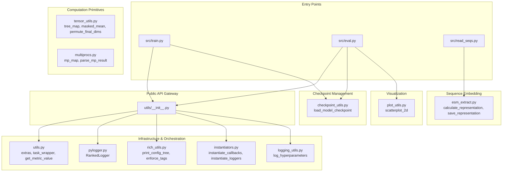
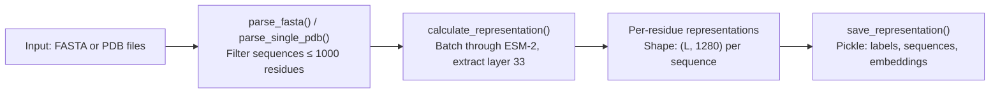
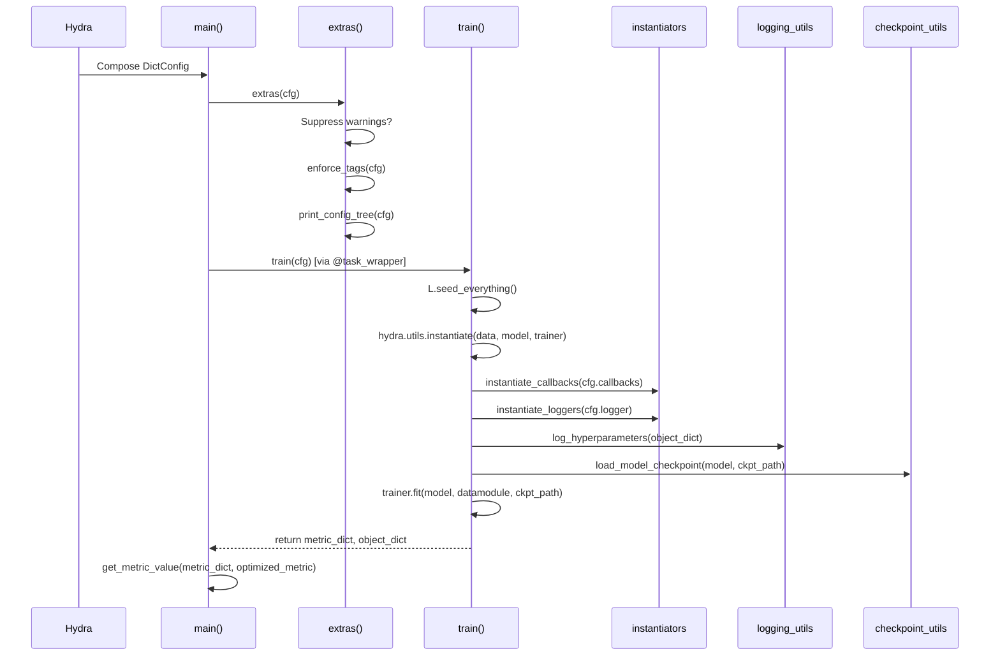

---
slug:25-utility-modules-overview
blog_type:normal
---


`src/utils/` 包是 IDPFold 训练和推理流程的连接组织。该仓库并未采用单一庞大的辅助文件，而是将横切关注点拆分为十一个专注的模块，涵盖**基础设施编排**、**分布式日志记录**、**Hydra 驱动的实例化**、**检查点管理**、**ESM 序列嵌入提取**、**张量操作**、**多进程处理**以及**可视化**。本页面提供了每个工具模块的结构图、公共 API 及其在运行时的交互方式，为你扩展或调试流程的任何层级提供所需的架构上下文。

## 模块架构一览

该工具包围绕清晰的关注点分离进行组织。`__init__.py` 充当公共 API 网关，仅重新导出训练和评估入口点直接调用的函数和类。在此外观模式之下，模块分为五个功能集群：



`__init__.py` 精确地重新导出了以下符号：`instantiate_callbacks`、`instantiate_loggers`、`log_hyperparameters`、`RankedLogger`、`enforce_tags`、`print_config_tree`、`extras`、`get_metric_value` 和 `task_wrapper`。这种精心设计的接口意味着，像 `train.py` 和 `eval.py` 这样的入口点会直接从 `src.utils` 导入，而像 `checkpoint_utils`、`esm_extract`、`plot_utils`、`tensor_utils` 和 `multiprocs` 这样的底层模块则按需通过路径导入。这种双层设计保持了公共 API 的精简，同时允许在特定工作流中进行深度访问。

来源：[__init__.py](/src/utils/__init__.py#L1-L6), [train.py](/src/train.py#L29-L38), [eval.py](/src/eval.py#L32-L40), [read_seqs.py](/src/read_seqs.py#L10-L10)

## 模块参考

下表提供了每个工具模块的完整清单、主要职责及其关键公共符号：

| 模块 | 职责 | 关键公共符号 | 消费者 |
|--------|---------------|-------------------|-----------|
| `utils.py` | 任务前置编排、异常处理、指标检索 | `extras()`, `task_wrapper()`, `get_metric_value()` | `train.py`, `eval.py` |
| `pylogger.py` | 多 GPU 感知进程秩的日志记录 | `RankedLogger` | 所有模块 |
| `rich_utils.py` | 丰富的终端输出（配置树、标签强制执行） | `print_config_tree()`, `enforce_tags()` | `utils.py` → `extras()` |
| `instantiators.py` | 基于 Hydra 的回调和日志记录器工厂 | `instantiate_callbacks()`, `instantiate_loggers()` | `train.py`, `eval.py` |
| `logging_utils.py` | 将超参数记录到实验跟踪器 | `log_hyperparameters()` | `train.py`, `eval.py` |
| `checkpoint_utils.py` | 双格式检查点加载（`.pth` / `.ckpt`） | `load_model_checkpoint()` | `train.py`, `eval.py` |
| `esm_extract.py` | ESM-2 (650M) 每残基嵌入提取 | `calculate_representation()`, `save_representation()`, `parse_fasta()` | `read_seqs.py` |
| `tensor_utils.py` | 张量操作原语（树映射、掩码均值等） | `tree_map()`, `dict_multimap()`, `masked_mean()`, `permute_final_dims()` | 模型和损失模块 |
| `multiprocs.py` | 多进程映射包装器 | `mp_map()`, `parse_mp_result()` | 数据流水线 |
| `plot_utils.py` | 带 KDE 密度的 2D 散点图可视化 | `scatterplot_2d()` | `eval.py` |

来源：[utils.py](/src/utils/utils.py#L1-L120), [pylogger.py](/src/utils/pylogger.py#L1-L52), [rich_utils.py](/src/utils/rich_utils.py#L1-L100), [instantiators.py](/src/utils/instantiators.py#L1-L57), [logging_utils.py](/src/utils/logging_utils.py#L1-L58), [checkpoint_utils.py](/src/utils/checkpoint_utils.py#L1-L28), [esm_extract.py](/src/utils/esm_extract.py#L1-L130), [tensor_utils.py](/src/utils/tensor_utils.py#L1-L150), [multiprocs.py](/src/utils/multiprocs.py#L1-L34), [plot_utils.py](/src/utils/plot_utils.py#L1-L100)

## 基础设施与编排

### RankedLogger：分布式安全的日志记录

`RankedLogger` 类包装了 Python 标准的 `logging.LoggerAdapter`，以便在多 GPU (DDP) 环境下生成带进程秩前缀的日志消息。它利用 `lightning_utilities.core.rank_zero` 获取当前进程的秩，并相应地为每条消息添加前缀。当 `rank_zero_only` 标志设为 `True` 时，会将所有日志记录限制在进程 0 中——从而防止 GPU worker 之间出现重复日志。`src/utils/` 中的几乎所有模块都在模块作用域内实例化了 `RankedLogger`，使其成为整个代码库事实上的日志记录标准。

```python
log = RankedLogger(__name__, rank_zero_only=True)
log.info("Instantiating model...")  # 仅在 rank 0 打印
```

该日志记录器的 `log()` 方法通过 `getattr(rank_zero_only, "rank", None)` 动态获取当前秩，这意味着秩是在调用时而非构造时解析的——对于进程组在模块导入后才初始化的场景而言，这是一个重要的特性。

来源：[pylogger.py](/src/utils/pylogger.py#L7-L52)

### 编排流程：extras() 和 task_wrapper()

`extras()` 函数充当任务前置配置门，在 `train.py:main()` 和 `eval.py:main()` 的最开始被调用。它读取 `cfg.extras` 命名空间，并按条件执行三项操作：抑制 Python 警告、通过交互式提示词强制执行实验标签，以及使用 Rich 打印解析后的 Hydra 配置树。对应的 `configs/extras/default.yaml` 控制这些开关：

```yaml
ignore_warnings: False
enforce_tags: True
print_config: True
```

`task_wrapper()` 装饰器将核心的 `train()` 和 `evaluate()` 函数包装在 try/except/finally 块中。成功时，它原样返回指标和对象字典。出现异常时，它通过 `log.exception("")` 记录完整的回溯信息并重新抛出异常。`finally` 块始终执行两项清理操作：记录输出目录路径，并通过 `wandb.finish()` 关闭任何处于活动状态的 Weights & Biases 运行。这确保了在多重运行实验期间，即使是灾难性故障也不会留下孤立的 W&B 进程或模糊的输出路径。

<CgxTip>`task_wrapper` 装饰器在尝试清理之前会使用 `find_spec("wandb")` 检查 W&B 的可用性——这意味着你可以在未安装 W&B 的情况下安全运行，而不会触发导入错误。</CgxTip>

`get_metric_value()` 函数提供了从 Lightning 的 `callback_metrics` 字典中安全检索命名指标的方法。`train.py:main()` 使用它来提取用于基于 Hydra 的超参数搜索（例如 Optuna）的优化指标值。如果未指定指标名称则返回 `None`，如果字典中缺少该指标则抛出描述性异常。

来源：[utils.py](/src/utils/utils.py#L12-L119), [train.py](/src/train.py#L111-L131), [eval.py](/src/eval.py#L96-L110), [default.yaml](/configs/extras/default.yaml#L1-L9)

### Hydra 实例化与 Rich 输出

`instantiators.py` 模块在 Hydra 的配置系统与 PyTorch Lightning 的运行时对象之间起到了桥梁作用。`instantiate_callbacks()` 和 `instantiate_loggers()` 遵循完全相同的模式：遍历配置组的条目，检查 `_target_` 键（Hydra 的实例化指令），并对每个符合条件的条目调用 `hydra.utils.instantiate()`。这种设计允许在 YAML 中声明式地定义整个回调和日志记录器堆栈，并在运行时组装，而无需任何硬编码的类引用。

```python
# 来自 train.py — 整个回调/日志记录器堆栈均由配置驱动
callbacks: List[Callback] = instantiate_callbacks(cfg.get("callbacks"))
logger: List[Logger] = instantiate_loggers(cfg.get("logger"))
```

`rich_utils.py` 模块提供了两个带有 `@rank_zero_only` 装饰的函数。`print_config_tree()` 从 DictConfig 构建分层的 Rich 树，默认按 `data → model → callbacks → logger → trainer → paths → extras` 的顺序排列各个部分，并追加任何额外的字段。每个分支通过 `OmegaConf.to_yaml()` 渲染其 YAML 内容，并支持可选的变量解析。当配置中未提供标签时，`enforce_tags()` 会以交互方式提示用户输入逗号分隔的标签——这是一种防止未标记实验运行的防护措施，对于无法进行交互式输入的多重运行场景则会直接报错。

来源：[instantiators.py](/src/utils/instantiators.py#L1-L57), [rich_utils.py](/src/utils/rich_utils.py#L17-L100), [train.py](/src/train.py#L64-L68)

### 超参数日志记录

`log_hyperparameters()` 函数从实例化的对象字典中聚合元数据，并将其分发给所有活动的 Lightning 日志记录器。它捕获 `model`、`data`、`trainer`、`callbacks` 和 `extras` 配置部分，以及 `task_name`、`tags`、`ckpt_path` 和 `seed`。关键在于，它还通过遍历 `model.parameters()` 并检查 `requires_grad` 来计算三个参数计数——**总计**、**可训练**和**不可训练**。这些计数存储在 `hparams["model/params/total"]`、`hparams["model/params/trainable"]` 和 `hparams["model/params/non_trainable"]` 下，从而在任何实验跟踪仪表板中都能直接查看模型规模。

来源：[logging_utils.py](/src/utils/logging_utils.py#L12-L58)

## 检查点管理

`checkpoint_utils.py` 模块处理检查点格式中一个微妙但重要的区别。`load_model_checkpoint()` 函数接受 `ckpt_path` 并根据文件扩展名进行路由：

| 扩展名 | 处理方式 | 用例 |
|-----------|----------|----------|
| `.pth` | 手动加载 `state_dict`，去除 `net.` 前缀，加载至 `model.net` | 用于微调的预训练主干权重 |
| `.ckpt` | 原样返回；交由 `trainer.fit(ckpt_path=...)` 处理 | 包含优化器/调度器状态的完整 Lightning 检查点 |
| `None` | 原样返回模型 | 从头开始训练 |
| 其他 | 抛出 `ValueError` | 无效输入 |

`.pth` 路径与 IDPFold 的迁移学习工作流尤为相关：它仅加载网络参数（`net.` 子模块），而丢弃 epoch、学习率和优化器状态。这防止了陈旧的训练元数据污染全新的微调运行。该函数返回一个元组 `(model, ckpt_path)`，其中在加载 `.pth` 后 `ckpt_path` 被设置为 `None`，以此向下游训练器发出无需进一步恢复检查点的信号。

来源：[checkpoint_utils.py](/src/utils/checkpoint_utils.py#L1-L28), [train.py](/src/train.py#L86)

## ESM 序列嵌入提取

`esm_extract.py` 模块包装了 Meta 的 ESM-2（`esm2_t33_650M_UR50D`，650M 参数），以生成作为 IDPFold 去噪网络主要序列输入的每残基嵌入。该模块提供了两个入口点：用于 FASTA 输入的 `main()` 和用于 PDB 目录输入的 `main_pdb()`。

提取流程分为四个阶段运行：



`calculate_representation()` 函数以可配置的批次（`BATCH_SIZE = 8`）处理序列，从 ESM-2 的第 33 层（最后一个 Transformer 层）提取表示。与平均池化的嵌入不同，该模块通过切片 `token_representations[i, 1:tokens_len-1]` 保留了**每残基**的表示——在剥离 BOS 和 EOS 标记的同时，保留了完整的序列长度维度。这对于 IDPFold 的结构预测任务至关重要，因为该任务中每个残基都需要拥有自己的嵌入向量。

该模块还独立公开了实用函数。`read_seqs.py` 入口点直接导入了 `calculate_representation` 和 `save_representation`，这表明该模块兼具独立脚本和程序库的双重角色。`parse_fasta()` 函数会过滤掉超过 `SEQ_THRESHOLD = 1000` 个残基的序列，而 `parse_single_pdb()` 函数则使用 Biotite 从 PDB 结构中提取序列。

<CgxTip>ESM-2 模型通过 `esm.pretrained.esm2_t33_650M_UR50D()` 加载，首次使用时会下载权重（约 2.5 GB）。在生产环境中，请预先下载或缓存这些权重，以避免在流水线初始化期间出现网络延迟。</CgxTip>

来源：[esm_extract.py](/src/utils/esm_extract.py#L1-L130), [read_seqs.py](/src/read_seqs.py#L10-L58)

## 张量操作原语

`tensor_utils.py` 模块改编自 AlQuraishi 实验室和 DeepMind 的 OpenFold 代码库（Apache 2.0 许可）。它提供了贯穿模型和损失计算层的底层张量操作。这些函数构成了不变点注意力（Invariant Point Attention）和 FAPE 损失计算等操作的数学基石。

| 函数 | 用途 | 典型应用 |
|----------|---------|-------------|
| `inflate_array_like(array, target)` | 广播 1D 数组以匹配目标的后缘维度 | 扩散时间步缩放 |
| `permute_final_dims(tensor, inds)` | 仅置换最后 N 个维度，保持前导维度不变 | 注意力头重排序 |
| `flatten_final_dims(t, no_dims)` | 将最后 N 个维度展平为一个维度 | 线性投影输入准备 |
| `sum_except_batch(t, batch_dims)` | 对前 N 个维度之外的所有维度求和 | 基于序列的损失降维 |
| `masked_mean(mask, value, dim)` | 仅计算有效位置的均值 | FAPE 和辅助损失 |
| `pts_to_distogram(pts, ...)` | 将点坐标转换为分箱的距离直方图 | 结构评估 |
| `dict_multimap(fn, dicts)` | 在多个嵌套字典中逐元素应用函数 | 梯度聚合 |
| `tree_map(fn, tree, leaf_type)` | 对字典/列表/元组树进行递归映射 | 模型状态操作 |
| `tensor_tree_map` | `partial(tree_map, leaf_type=torch.Tensor)` | 参数和梯度处理 |
| `batched_gather(data, inds, ...)` | 沿维度进行具有批次感知索引的聚集 | 序列索引 |
| `one_hot(x, v_bins)` | 最近邻分箱的独热编码 | 残基特征编码 |

`tree_map` / `dict_map` 组合实现了 JAX `tree_map` 的简易版本，通过遍历任意嵌套的字典、列表和元组，仅对匹配指定类型的叶子节点应用函数。作为 `partial(tree_map, leaf_type=torch.Tensor)` 创建的偏函数 `tensor_tree_map` 是最常用的变体，它支持在整个模型参数树上执行诸如 `tensor_tree_map(lambda t: t.detach(), model_state)` 之类的操作。

来源：[tensor_utils.py](/src/utils/tensor_utils.py#L1-L150)

## 多进程与可视化

### 多进程包装器

`multiprocs.py` 模块对 Python 的 `multiprocessing.Pool` 提供了一层轻量级抽象。`mp_map()` 函数接受一个函数、一个可迭代的参数以及可选的 CPU 数量（默认为 `mp.cpu_count()`）。它会创建一个进程池，映射函数，并通过 `pool.close()` 和 `pool.join()` 确保正确的清理。配套的 `parse_mp_result()` 函数可根据用户提供的键函数选择性地对结果进行排序，从而处理多进程以非确定性顺序返回结果的常见模式。

来源：[multiprocs.py](/src/utils/multiprocs.py#L1-L34)

### 2D 散点图可视化

`plot_utils.py` 模块提供了 `scatterplot_2d()`，这是一个具有出版物质量的可视化函数，用于将高维蛋白质构象投影到 2D 坐标上（通常是 tICA 分量）。该函数支持：

- 通过 `scipy.stats.gaussian_kde` 进行 **KDE 密度着色**，并在样本稀疏时回退为均匀密度
- 使用 `seaborn.kdeplot` 进行**参考势能面叠加**，以可视化目标分布
- 当提供 `xylim_key` 时，绘制以红色轮廓圆圈表示的**聚类中心标记**
- 当数据集数量超过 5 列时，会自动换行排布成多行的**自动子图布局**
- 通过 `n_max_point`（默认为 1000）进行**二次采样**，以在大型 ensemble 上保持渲染性能

该函数被 `eval.py` 导入，用于生成预测结构与参考结构之间的构象景观对比图，并以 500 DPI 保存供发表使用。

来源：[plot_utils.py](/src/utils/plot_utils.py#L1-L100), [eval.py](/src/eval.py#L32-L40)

## 运行时集成：工具模块如何组合

下图描绘了训练运行期间从 Hydra 入口到检查点加载的精确工具调用顺序：



评估流程（`eval.py`）遵循几乎相同的顺序，但有两个关键区别：它跳过了回调实例化（预测不需要早停或检查点回调），并调用 `trainer.predict()` 而不是 `trainer.fit()`。两个入口点都共享 `@task_wrapper` 装饰器，确保 W&B 清理和输出目录日志记录的保障在所有执行模式下均有效。

来源：[train.py](/src/train.py#L43-L108), [eval.py](/src/eval.py#L45-L93)

## 后续阅读

这些工具模块充当了 IDPFold 各主要子系统之间的桥梁。根据你的关注点：

- **了解检查点如何流入模型加载** → 参见 [检查点加载](20-checkpoint-loading)，了解完整的推理路径检查点生命周期
- **探索 ESM 嵌入在数据流水线中的消费方式** → 参见 [ESM 序列嵌入提取](17-esm-sequence-embedding-extraction)，了解嵌入如何输入到数据集中
- **查看 tensor_utils 在模型计算中的实际应用** → 参见 [不变点注意力](11-invariant-point-attention) 和 [分数匹配损失](14-score-matching-loss)，了解 `tree_map` 和 `masked_mean` 的使用模式
- **了解驱动实例化的 Hydra 配置系统** → 参见 [Hydra 配置层次结构](22-hydra-configuration-hierarchy)，了解 `extras()` 和 `instantiators.py` 所操作的完整配置树
- **回顾完整的训练编排** → 参见 [训练循环与模型步进](13-training-loop-and-model-step)，了解 `task_wrapper` 和 `log_hyperparameters` 如何与 Lightning 训练循环集成