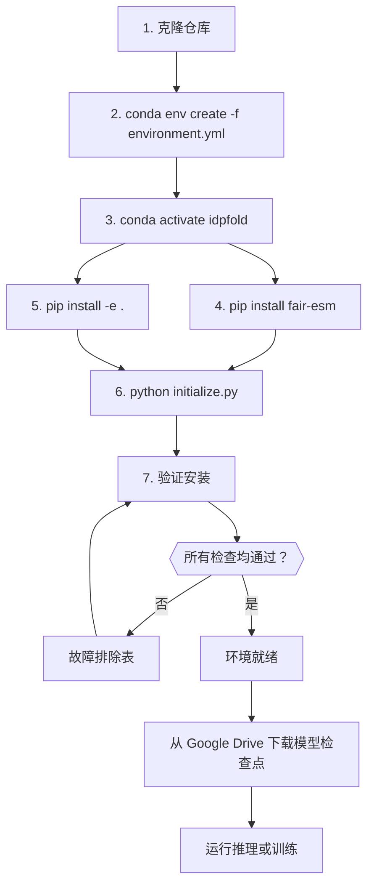

---
slug:3-environment-setup
blog_type:normal
---


IDPFold 的环境跨越三个层级：一个 **由 Conda 管理的依赖栈**（Python 3.9 + CUDA 工具包 + 科学计算库），一个 **通过 pip 安装的深度学习层**（PyTorch 2.0.1 + Lightning + Hydra），以及一个 **项目级初始化步骤**（将目录路径接入 Hydra 的 OmegaConf 解析系统）。本页将按照安装顺序依次介绍每个层级，解释环境变量如何传递至运行时配置中，并针对常见故障点提供验证与排错指南。

## 系统前提条件

开始前，请确保你的系统满足以下基础要求：

| 要求 | 最低配置 | 推荐配置 | 备注 |
|---|---|---|---|
| 操作系统 | Linux x86_64 | Ubuntu 20.04+ | Conda 包为 Linux-64 构建版本；macOS/Windows 未经测试 |
| GPU | NVIDIA GPU, CUDA 11.3+ | NVIDIA GPU ≥ 16 GB 显存 | 训练所必需；8 GB 显存即可进行推理 |
| CUDA 驱动 | ≥ 470 | ≥ 525 | 必须支持 CUDA 11.3/11.7 运行时 |
| Conda | Miniconda/Anaconda | 最新版 Miniconda | 用于基于 `environment.yml` 创建环境 |
| 磁盘空间 | 10 GB | 30 GB+ | ESM-2 650M 权重文件 (~2.5 GB)、数据集、检查点 |
| 内存 (RAM) | 16 GB | 32 GB+ | 数据加载与 SO(3) 分数缓存是内存密集型任务 |

Conda 环境通过 `pytorch` conda 频道锁定 Python 3.9.16 和 CUDA 工具包 11.3.1，而 pip 端的 NVIDIA 库则针对 CUDA 11.7。这种搭配是刻意为之的 —— Conda 的 `cudatoolkit` 提供基础运行时，而 pip wheels（`nvidia-cublas-cu11`、`nvidia-cudnn-cu11` 等）提供 PyTorch 2.0.1 所需的特定 CUDA 11.7 兼容二进制文件。

来源：[environment.yml](/environment.yml#L1-L50), [README.md](/README.md#L1-L69)

## 步骤 1：克隆仓库并创建 Conda 环境

安装过程从克隆仓库开始，并根据锁定的规格创建 conda 环境。`environment.yml` 文件枚举了所有依赖及其精确版本，确保在不同机器上的可复现性。

```bash
git clone https://github.com/Junjie-Zhu/IDPFold.git
cd IDPFold

# 创建 conda 环境（这可能需要 10-20 分钟）
conda env create -f environment.yml
conda activate idpfold
```

名为 **`idpfold`** 的 conda 环境按优先级顺序从五个频道拉取：`pytorch`、`pyg` (PyTorch Geometric)、`anaconda`、`conda-forge` 和 `defaults`。Conda 管理层负责处理那些依赖于预编译二进制文件的包 —— 尤其是 **PyTorch Geometric 生态系统**（`pyg`、`pytorch-cluster`、`pytorch-scatter`、`pytorch-sparse`），它们需要支持 CUDA 的 C++ 编译。

### 核心 Conda 依赖

| 类别 | 关键包 | 用途 |
|---|---|---|
| Python 运行时 | `python=3.9.16` | 基础解释器 |
| CUDA 工具包 | `cudatoolkit=11.3.1` | GPU 计算运行时 |
| PyG 生态系统 | `pyg=2.1.0`, `pytorch-cluster`, `pytorch-scatter`, `pytorch-sparse` | 图神经网络基础组件 |
| 结构生物学 | `biopython=1.81`, `biotite=0.37.0`, `mdtraj=1.9.7`, `openmm=8.0.0`, `pdbfixer=1.9` | PDB 解析、轨迹分析、结构修复 |
| 科学计算栈 | `numpy=1.24.3`, `scipy=1.10.1`, `scikit-learn=1.2.2`, `pandas=1.5.3` | 数值计算 |
| MPI 并行 | `mpi4py=3.1.4`, `mpich=4.0.3` | 多进程数据预处理 |

<CgxTip>PyG 的 conda 包（`pytorch-cluster`、`pytorch-scatter`、`pytorch-sparse`）是基于 PyTorch 1.11.0/cu113 构建的。由于 pip 层安装的是 `torch==2.0.1`，如果你在运行时遇到 `undefined symbol` 错误，请从匹配你的 torch 版本的 PyG wheel 索引中重新安装这三个包：`pip install torch-scatter torch-sparse torch-cluster -f https://data.pyg.org/whl/torch-2.0.1+cu117.html`</CgxTip>

来源：[environment.yml](/environment.yml#L1-L100), [environment.yml](/environment.yml#L200-L287)

## 步骤 2：安装由 pip 管理的深度学习包

`environment.yml` 包含一个 `pip:` 块，用于安装深度学习框架及相关工具。这些包由 pip 管理是因为它们以预构建的 wheels 形式发布，并内置了 CUDA 库，而 conda 频道往往在此类库的更新上存在滞后。

### 关键 pip 依赖

| 包 | 版本 | 在 IDPFold 中的作用 |
|---|---|---|
| `torch` | 2.0.1 | 核心张量操作、autograd、CUDA 内核 |
| `torchvision` | 0.15.2 | 图像工具（间接依赖） |
| `lightning` | 2.1.2 | 训练循环编排、检查点、回调 |
| `pytorch-lightning` | 1.9.4 | 兼容垫片（Lightning 2.x 迁移） |
| `hydra-core` | 1.3.2 | 层次化配置管理 |
| `omegaconf` | 2.3.0 | 配置插值与变量解析 |
| `deepspeed` | (未锁定) | 用于大批量训练的 ZeRO 优化 |
| `fair-esm` | 2.0.0 | 用于序列嵌入的 ESM-2 蛋白质语言模型 |
| `wandb` | 0.15.4 | 实验跟踪与可视化 |
| `einops` | 0.7.0 | 用于注意力计算的张量重排 |
| `rootutils` | 1.0.7 | 项目根目录检测与 PYTHONPATH 设置 |
| `lmdb` | 1.4.1 | 用于快速数据加载的 Lightning 内存映射数据库 |

`fair-esm` 包在 README 的安装说明中也被单独强调，突显了其重要性 —— IDPFold 使用 **ESM-2 `esm2_t33_650M_UR50D`** 模型（6.5 亿参数，第 33 层表征）来提取逐残基的序列嵌入，以此为扩散过程提供条件。

来源：[environment.yml](/environment.yml#L185-L287), [README.md](/README.md#L20-L35), [src/utils/esm_extract.py](/src/utils/esm_extract.py#L1-L50)

## 步骤 3：以可编辑模式安装 IDPFold

在激活的 conda 环境下，以可编辑模式（`-e`）安装 IDPFold 包本身：

```bash
pip install -e .
```

`setup.py` 声明了两个运行时依赖（`lightning`、`hydra-core`），并注册了三个映射到项目主脚本的控制台入口点：

| 控制台命令 | Python 入口点 | 用途 |
|---|---|---|
| `train_command` | `src.train:main` | 启动训练流水线 |
| `eval_command` | `src.eval:main` | 运行推理 / 采样 |
| `preprocess_command` | `src.read_seqs:main` | 从 FASTA 提取 ESM 嵌入 |

可编辑安装（`-e`）确保了对 `src/` 下源文件的修改能够立即生效，无需重新安装。不过，入口脚本（`src/train.py`、`src/eval.py`、`src/read_seqs.py`）同样支持通过 `python src/train.py` 直接运行，因为 `rootutils.setup_root()` 会在导入时将项目根目录动态添加到 `PYTHONPATH` 中。

来源：[setup.py](/setup.py#L1-L23), [README.md](/README.md#L30-L34)

## 步骤 4：初始化环境路径

IDPFold 依赖项目根目录下的 `.env` 文件来定义四个目录路径，这些路径由 Hydra 在运行时解析。`initialize.py` 脚本会自动生成此文件并创建相应的目录：

```bash
python initialize.py
```

该脚本会捕获当前工作目录，并将绝对路径写入 `.env`：

| 环境变量 | 默认路径 | 使用者 | 描述 |
|---|---|---|---|
| `CACHE_DIR` | `<cwd>/.cache` | SO(3) 扩散器分数缓存 | 预计算的旋转分数查找表 |
| `TRAIN_DATA` | `<cwd>/data/pdb` | 训练数据模块 | 用于训练的 PDB 结构文件目录 |
| `EMBEDDING` | `<cwd>/data/embeddings` | 数据模块 + `read_seqs.py` | 序列化的 ESM-2 逐残基嵌入 |
| `TEST_DATA` | `<cwd>/data/test_pdb` | 采样数据模块 | 用于推理输入的虚拟 PDB 文件（仅含 CA） |

生成的 `.env` 文件内容如下：

```env
CACHE_DIR="/absolute/path/to/.cache"
TRAIN_DATA="/absolute/path/to/data/pdb"
EMBEDDING="/absolute/path/to/data/embeddings"
TEST_DATA="/absolute/path/to/data/test_pdb"
```

<CgxTip>如果你需要指向存储在不同挂载点（例如共享 NFS 驱动器）上的数据集，只需在运行 `initialize.py` 后编辑 `.env` 文件即可 —— 这些路径是纯文本格式，无需转义。请确保目录存在且具有可写权限，因为 SO(3) 扩散器在首次运行时会尝试将缓存文件写入 `CACHE_DIR`。</CgxTip>

来源：[initialize.py](/initialize.py#L1-L22), [README.md](/README.md#L36-L42)

## 环境变量如何汇入 Hydra 配置

IDPFold 采用双层路径解析系统。理解这一调用链对于调试路径相关错误至关重要。

```mermaid
flowchart TD
    A[".env 文件<br/>CACHE_DIR, TRAIN_DATA,<br/>EMBEDDING, TEST_DATA"] -->|由 rootutils 加载| B["OS 环境变量"]
    C["rootutils.setup_root<br/>位于 train.py / eval.py"] -->|设置| D["PROJECT_ROOT 环境变量"]
    C -->|加载| A
    C -->|将 src/ 添加至 PYTHONPATH| E["Python 导入路径"]
    D --> F["configs/paths/default.yaml<br/>root_dir, data_dir, log_dir, output_dir"]
    B --> G["configs/paths/env.yaml<br/>cache_dir, data_path,<br/>seq_embedding_path, test_data_path"]
    F --> H["Hydra 配置树<br/>(通过 OmegaConf 合并)"]
    G --> H
    H -->|${paths.cache_dir}| I["模型配置<br/>diffusion.yaml"]
    H -->|${paths.data_path}| J["数据配置<br/>protein.yaml / sampling.yaml"]
    H -->|${paths.output_dir}| K["推理配置<br/>样本的 output_dir"]
```

该调用链的工作原理如下：`rootutils.setup_root()` 在每个入口脚本（`train.py`、`eval.py`、`read_seqs.py`）的顶部被调用。此函数会 (1) 通过搜索 `.project-root` 标记文件来定位项目根目录，(2) 设置 `PROJECT_ROOT` 环境变量，(3) 将 `.env` 中的所有变量加载到操作系统环境中，以及 (4) 将 `src/` 添加到 `PYTHONPATH`。随后，Hydra 将 `configs/paths/default.yaml`（解析 `PROJECT_ROOT`）与 `configs/paths/env.yaml`（通过 `${oc.env:VAR_NAME}` 语法解析四个 `.env` 变量）进行合并，从而组装出配置。最终生成的 `paths` 命名空间会在下游配置中通过 OmegaConf 插值被广泛引用 —— 例如，模型配置中的 `${paths.cache_dir}` 或数据配置中的 `${paths.data_path}`。

`configs/train.yaml` 在其 defaults 中选择了 `paths: env`，`configs/eval.yaml` 同样如此。这意味着训练和推理都会通过基于 `.env` 的同一套机制来解析路径。

来源：[configs/paths/env.yaml](/configs/paths/env.yaml#L1-L8), [configs/paths/default.yaml](/configs/paths/default.yaml#L1-L19), [src/train.py](/src/train.py#L1-L30), [src/eval.py](/src/eval.py#L1-L30), [configs/train.yaml](/configs/train.yaml#L1-L20), [configs/eval.yaml](/configs/eval.yaml#L1-L20)

## ESM-2 模型权重

`fair-esm` 包会在首次使用时下载模型权重。IDPFold 会专门加载 **ESM-2 `esm2_t33_650M_UR50D`** —— 这是一个拥有 6.5 亿参数的蛋白质语言模型，能够从第 33 层生成逐残基嵌入。当在 `src/read_seqs.py`（预处理）或 `src/utils/esm_extract.py`（独立提取）中调用 `esm.pretrained.esm2_t33_650M_UR50D()` 时，会自动触发此下载。

权重默认缓存在 `~/.cache/torch/hub/checkpoints/` 目录下（约 2.5 GB）。如果你的环境限制了网络访问，请在已联网的机器上预先下载权重，并将其复制到该目录。嵌入提取代码每次处理 8 个序列，默认使用 CUDA 设备 `cuda:0`，并会过滤掉长度超过 1000 个残基的序列。

来源：[src/utils/esm_extract.py](/src/utils/esm_extract.py#L1-L50), [src/read_seqs.py](/src/read_seqs.py#L1-L63)

## 硬件配置与 Trainer 选择

IDPFold 基于 Hydra 的配置系统让你无需修改代码即可切换硬件后端。`configs/trainer/` 目录提供了五种预设：

| 配置文件 | 加速器 | 设备数 | 策略 | 用途 |
|---|---|---|---|---|
| `default.yaml` | `cpu` | 1 | — | 调试、冒烟测试 |
| `gpu.yaml` | `gpu` | 1 | — | 单 GPU 训练或推理 |
| `ddp.yaml` | `gpu` | 4 | `ddp_find_unused_parameters_true` | 多 GPU 分布式训练 |
| `ddp_sim.yaml` | `cpu` | 2 | `ddp_spawn` | CPU 上的 DDP 模拟（测试用） |
| `mps.yaml` | `mps` | 1 | — | Apple Silicon（实验性） |

训练默认使用 CPU（`trainer=default`），而示例实验配置（`configs/experiment/example.yaml`）会覆盖为使用 2 个 GPU 和 500–1000 个 epoch 的 DDP。推理（`configs/eval.yaml`）默认使用单 GPU。可以通过命令行覆盖来切换 trainer：

```bash
# 单 GPU 训练
python src/train.py trainer=gpu

# 多 GPU DDP 训练（4 个 GPU）
python src/train.py trainer=ddp

# 自定义设备数量的 DDP
python src/train.py trainer=ddp trainer.devices=2
```

DDP 配置启用了 `sync_batchnorm=True` 并采用 `ddp_find_unused_parameters_true` 策略，这是必需的，因为 IDPFold 的去噪网络包含可能不会在每次前向传播中被激活的条件分支（例如自条件路径）。

来源：[configs/trainer/default.yaml](/configs/trainer/default.yaml#L1-L20), [configs/trainer/gpu.yaml](/configs/trainer/gpu.yaml#L1-L6), [configs/trainer/ddp.yaml](/configs/trainer/ddp.yaml#L1-L10), [configs/experiment/example.yaml](/configs/experiment/example.yaml#L1-L43), [configs/eval.yaml](/configs/eval.yaml#L1-L20)

## 验证清单

完成所有安装步骤后，请通过以下检查来验证你的环境：

```bash
# 1. 验证 conda 环境是否已激活
conda activate idpfold
python --version  # 应输出：Python 3.9.16

# 2. 验证 PyTorch 是否识别 CUDA
python -c "import torch; print(f'PyTorch {torch.__version__}, CUDA available: {torch.cuda.is_available()}, Device: {torch.cuda.get_device_name(0) if torch.cuda.is_available() else \"N/A\"}')"

# 3. 验证 PyTorch Geometric 扩展是否编译正确
python -c "from torch_scatter import scatter_sum; print('torch_scatter OK')"
python -c "import torch_cluster; print('torch_cluster OK')"

# 4. 验证 Lightning 和 Hydra
python -c "import lightning; print(f'Lightning {lightning.__version__}')"
python -c "import hydra; print(f'Hydra {hydra.__version__}')"

# 5. 验证 ESM 是否可加载
python -c "import esm; print('fair-esm imported successfully')"

# 6. 验证结构生物学包
python -c "import biotite.structure as struc; print('biotite OK')"
python -c "import mdtraj; print('mdtraj OK')"

# 7. 验证 .env 是否已创建
cat .env

# 8. 验证项目根目录检测
python -c "import rootutils; rootutils.setup_root(__file__, indicator='.project-root', pythonpath=True); print('rootutils OK')"

# 9. 验证 IDPFold 包安装
pip show idpfold
```

如果所有检查均通过，则环境已准备就绪，可以进行[推理](4-inference-pipeline)和训练。

来源：[environment.yml](/environment.yml#L1-L287), [setup.py](/setup.py#L1-L23), [initialize.py](/initialize.py#L1-L22)

## 故障排除

| 症状 | 可能原因 | 解决方案 |
|---|---|---|
| `torch_scatter`/`torch_cluster` 报 `ImportError: undefined symbol` | PyG conda 包是基于 torch 1.11 构建的，而 pip 安装的是 torch 2.0.1 | 从 PyG wheel 索引重新安装：`pip install torch-scatter torch-sparse torch-cluster -f https://data.pyg.org/whl/torch-2.0.1+cu117.html` |
| `omegaconf.errors.InterpolationResolutionError: ValueError: Missing environment variable: CACHE_DIR` | 未创建 `.env` 文件或文件不在项目根目录下 | 在项目根目录下运行 `python initialize.py` |
| `omegaconf.errors.InterpolationResolutionError: Missing environment variable: PROJECT_ROOT` | 入口脚本未找到 `.project-root` 标记 | 确保仓库根目录下存在 `.project-root` 文件；检查在任何配置访问之前是否调用了 `rootutils.setup_root()` |
| 提取 ESM 嵌入时出现 `RuntimeError: CUDA out of memory` | 批量大小对于可用显存而言过大 | 将 `src/utils/esm_extract.py` 中的 `BATCH_SIZE`（默认：8）修改为更小的值 |
| 加载 ESM 模型时出现 `FileNotFoundError` | 无网络连接以下载权重 | 预先将 `esm2_t33_650M_UR50D.pt` 下载到 `~/.cache/torch/hub/checkpoints/` |
| `ModuleNotFoundError: No module named 'src'` | 未安装包或未设置 PYTHONPATH | 运行 `pip install -e .`，或确保在导入 `src` 之前执行了 `rootutils.setup_root()` |
| 针对 PDB 数据出现 `OSError: Unable to open file` | `.env` 中的 `TRAIN_DATA` 或 `TEST_DATA` 路径不正确 | 验证 `.env` 中的路径是否指向包含 PDB 文件的有效目录 |
| Conda 环境创建因频道冲突失败 | `pyg` 与 `conda-forge` 之间的频道优先级冲突 | 使用 `conda env create -f environment.yml --strict-channel-priority`，或通过 `conda config --set channel_priority strict` 手动创建 |

来源：[environment.yml](/environment.yml#L1-L287), [initialize.py](/initialize.py#L1-L22), [src/utils/esm_extract.py](/src/utils/esm_extract.py#L1-L50), [src/train.py](/src/train.py#L1-L30)

## 完整安装总结

以下流程图展示了从克隆到验证的完整设置过程：



环境配置大功告成后，你就可以继续后续操作了。若要对蛋白质序列进行预测，请参阅[推理流水线](4-inference-pipeline)指南。如果要在深入代码之前了解完整的系统架构，请从[架构概述](5-architecture-overview)开始。有关配置的详细信息，请参阅 [Hydra 配置层次结构](22-hydra-configuration-hierarchy)。