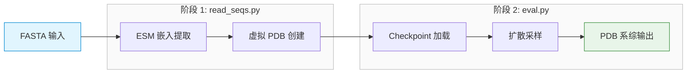
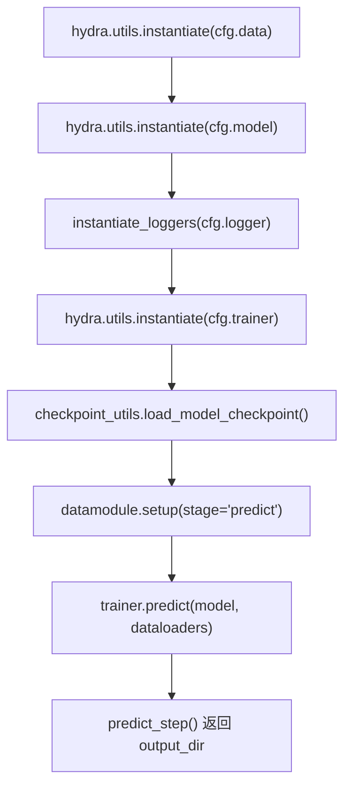
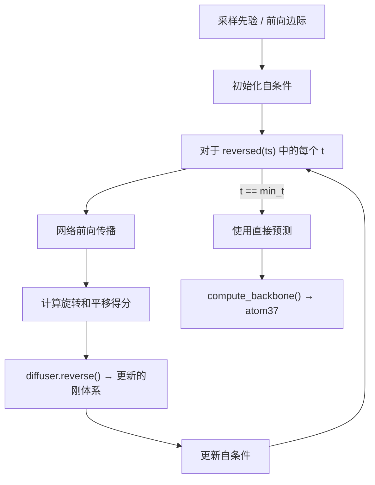
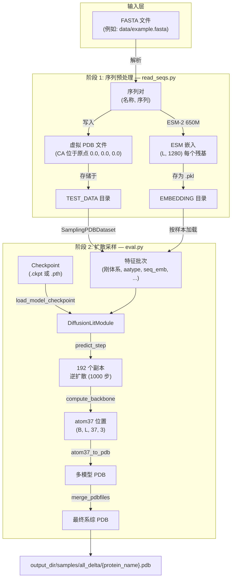

---
slug:4-inference-pipeline
blog_type:normal
---


IDPFold 的推理流水线将原始氨基酸序列转换为内在无序蛋白（IDP）的构象系综。该流水线分为两个阶段运行：**序列预处理**（ESM 嵌入提取）和**基于扩散的采样**（通过逆时去噪过程生成结构）。本页将详尽讲解初学者开发者需要了解的每个组件——从入口脚本到最终的 PDB 输出——帮助你自信地在自定义序列上运行预测。

## 流水线概览

推理流水线由五个顺序执行的阶段组成。每个阶段由特定的模块和配置文件驱动，并通过 Hydra 的配置组合系统进行编排。



来源：[read_seqs.py](/src/read_seqs.py#L1-L62), [eval.py](/src/eval.py#L46-L93)

## 第一步：使用 `read_seqs.py` 进行序列预处理

第一个入口点 `src/read_seqs.py` 接收一个包含一条或多条 IDP 序列的 FASTA 文件，并执行两项关键准备工作：创建**虚拟 PDB 文件**（所有 CA 原子位于原点的占位结构），以及提取**ESM-2 语言模型嵌入**，这些嵌入将作为扩散网络的唯一序列输入。

### FASTA 解析与虚拟 PDB 创建

脚本逐行读取 FASTA 文件，提取“序列名称-序列”对。对于每条序列，它会将一个最小化的 PDB 文件写入由 `cfg.data.dataset.path_to_dataset`（从 `TEST_DATA` 环境变量解析）指定的目录中。这些 PDB 文件仅包含位于坐标 (0, 0, 0) 的 CA 原子——它们**不是**真实的结构，而是数据集加载器所期望的**结构支架**。每个位置的残基类型是通过硬编码的氨基酸字典确定的，该字典将单字母代码映射到三字母的 PDB 残基名称。

```python
# 简化版：虚拟 PDB 创建
restype_dict = {'A': 'ALA', 'C': 'CYS', ...}
for seq_name, seq in to_process_list:
    with open(os.path.join(pdb_path, (seq_name + '.pdb')), 'w') as f:
        for i, aa in enumerate(seq):
            f.write(f'ATOM  {i+1:>5}  CA  {restype_dict[aa]:>3} A {i+1:>3}      0.000   0.000   0.000  1.00  0.00           C\n')
```

之所以需要这一步，是因为 `SamplingPDBDataset` 从 PDB 文件（而非原始序列）读取数据，并应用 AlphaFold2 风格的特征变换（坐标系分配、扭转角计算、伪 beta 生成），这些变换需要结构表示。虚拟 PDB 为这些变换提供了支架，而实际的位置信息则无关紧要——它将被扩散采样过程完全覆盖。

来源：[read_seqs.py](/src/read_seqs.py#L26-L49), [dataset.py](/src/data/components/dataset.py#L309-L327)

### ESM-2 嵌入提取

创建虚拟 PDB 后，脚本会加载 **ESM-2 模型**（`esm2_t33_650M_UR50D`，650M 参数，33 层 Transformer）并计算残基级别的表示。`calculate_representation` 函数以批大小 8 处理序列，提取第 33 层的隐藏状态，并去除序列起始和结束标记，从而为长度为 *L* 的序列生成形状为 `(L, 1280)` 的逐残基嵌入。

每个嵌入都保存为 pickle 文件，其中包含序列标签、原始序列字符串和表示张量。这些 pickle 文件存储在由 `cfg.data.dataset.path_to_seq_embedding`（从 `EMBEDDING` 环境变量解析）指定的目录中。文件名约定使用序列名称并加上 `.pkl` 扩展名。

| 参数 | 值 | 描述 |
|---|---|---|
| ESM 模型 | `esm2_t33_650M_UR50D` | 650M 参数，33 层 Transformer |
| 嵌入层 | 33 | 最后一个 Transformer 层的表示 |
| 嵌入维度 | 1280 | 逐残基特征维度 |
| 批大小 | 8 | 每次 ESM 前向传播处理的序列数 |
| 序列长度阈值 | 1000 | 超过此长度的序列将被过滤 |

来源：[read_seqs.py](/src/read_seqs.py#L51-L58), [esm_extract.py](/src/utils/esm_extract.py#L44-L71), [esm_extract.py](/src/utils/esm_extract.py#L75-L77)

## 第二步：使用 `eval.py` 作为主推理入口

第二个入口点 `src/eval.py` 是一个 Hydra 装饰器函数，负责编排整个预测流水线。它遵循 Lightning-Hydra 模板模式：从配置中实例化组件，加载模型 checkpoint，并委托给 PyTorch Lightning 的 `trainer.predict()` 执行。

### 配置组合

`configs/eval.yaml` 文件作为根配置。它通过 Hydra 的 `defaults` 机制组合子配置：

| 配置组 | 选定配置 | 用途 |
|---|---|---|
| `data` | `sampling` | 使用 `SamplingPDBDataset` 的 DataModule |
| `model` | `diffusion` | 带有去噪 IPA 网络的 `DiffusionLitModule` |
| `logger` | `null` | 推理期间不进行日志记录 |
| `trainer` | `gpu` | GPU 加速的训练器 |
| `paths` | `env` | 基于环境变量的路径解析 |
| `extras` | `default` | 标准附加配置（标签、配置打印） |

Checkpoint 路径默认为 `${paths.data_dir}/last.ckpt`，但可通过命令行覆盖。通过命令行设置 `pred_dir` 字段时，会指示 `read_seqs.py` 处理哪个 FASTA 文件。

来源：[eval.yaml](/configs/eval.yaml#L1-L20), [eval.py](/src/eval.py#L96-L110)

### 组件实例化与执行流程

`evaluate` 函数遵循精确的顺序：通过 `hydra.utils.instantiate` 实例化数据模块、模型、日志记录器和训练器；手动将 checkpoint 加载到模型中；为 "predict" 阶段设置数据模块；最后调用 `trainer.predict()`，该方法会遍历数据加载器并对每个批次调用 `predict_step`。



一个关键细节：此处**不**使用 `trainer.test()`（它会引发 `NotImplementedError`）。相反，流水线使用 `trainer.predict()`，该函数返回所有 `predict_step` 调用结果的列表。此列表的最后一个元素——即输出目录路径——会被提取作为最终的返回值。

来源：[eval.py](/src/eval.py#L46-L93), [diffusion_module.py](/src/models/diffusion_module.py#L201-L208)

## 第三步：Checkpoint 加载

`src/utils/checkpoint_utils.py` 中的 `load_model_checkpoint` 函数支持两种 checkpoint 格式，通过文件扩展名进行区分：

| 格式 | 扩展名 | 加载策略 |
|---|---|---|
| Lightning Checkpoint | `.ckpt` | 通过 `ckpt_path` 参数交由 `trainer.predict()` 处理 |
| 原始 PyTorch State Dict | `.pth` | 手动加载 `state_dict`，移除 `net.` 前缀，加载至 `model.net` |

对于 `.pth` 文件，该函数在 CPU 上加载 state dict，通过移除 `net.` 前缀重新映射键名（从 Lightning 模块的嵌套命名约定转换为原始网络的命名），将其直接加载到 `model.net` 中，并返回 `ckpt_path=None` 以向训练器发出信号，表明无需再加载 checkpoint。

对于 `.ckpt` 文件，该函数不执行任何操作——它直接将路径传递给 `trainer.predict()`，由后者处理完整的 Lightning checkpoint 恢复（包括优化器状态、epoch 计数器等）。

<CgxTip>使用 `.pth` checkpoint 时，模型的优化器和学习率调度器状态**不会**被加载。这对于推理是刻意为之的——只有网络权重才是关键。手动加载后会将 `ckpt_path` 设置为 `None`，这样 Lightning 就不会尝试进行冗余的恢复操作。</CgxTip>

来源：[checkpoint_utils.py](/src/utils/checkpoint_utils.py#L1-L28), [eval.py](/src/eval.py#L80-L81)

## 第四步：数据加载与特征变换

### SamplingPDBDataset

`SamplingPDBDataset` 是专为推理而构建的。与其训练对应的模块不同，它**不**应用元数据过滤器，并默认使用 `.pdb` 后缀。它从目录中读取所有 PDB 文件，可选择通过 `accession_code_fillter` 参数按登录代码进行过滤。

对于每个样本，数据集通过 `protein.from_pdb_string()` 将 PDB 文件加载到 `Protein` 对象中，将其转换为字典，应用 `ProteinFeatureTransform` 流水线，并从对应的 pickle 文件中附加 ESM 嵌入。

### ProteinFeatureTransform 流水线

该变换流水线准备了扩散网络所需的所有特征。对于推理，`sampling.yaml` 配置设置了 `strip_missing_residues: false` 和 `recenter_and_scale: false`——这是因为虚拟 PDB 没有有意义的可剥离或重新居中的坐标位置。

| 变换步骤 | 函数 | 用途 |
|---|---|---|
| 补丁特征 | `patch_feats()` | 添加 `seq_mask`、`residue_mask`、`residue_idx`、`fixed_mask`、`sc_ca_t` |
| 映射为张量 | `map_to_tensors()` | 将 NumPy 数组转换为具有适当数据类型的 PyTorch 张量 |
| AF2 变换 | `protein_data_transform()` | 计算刚体坐标系、扭转角、伪 beta、atom14 位置 |

在推理过程中，`fixed_mask` 被初始化为全零，这意味着**所有残基都可以自由扩散**——结构的任何部分都不会被固定。这对于缺乏稳定折叠核心的 IDP 来说是合理的。

来源：[dataset.py](/src/data/components/dataset.py#L309-L327), [dataset.py](/src/data/components/dataset.py#L25-L68), [dataset.py](/src/data/components/dataset.py#L255-L290), [sampling.yaml](/configs/data/sampling.yaml#L1-L20)

## 第五步：扩散采样 —— `predict_step`

`DiffusionLitModule` 中的 `predict_step` 方法是推理流水线的计算核心。它在刚体坐标系的 SE(3) 流形上实现了**逆时扩散过程**，通过从先验分布迭代去噪以生成结构化预测，从而产生构象系综。

### 推理超参数

采样行为由 `configs/model/diffusion.yaml` 的 `inference` 部分控制：

| 参数 | 默认值 | 描述 |
|---|---|---|
| `delta_min` | 0.25 | 最小前向扰动时间 |
| `delta_max` | 0.35 | 最大前向扰动时间 |
| `delta_step` | 0.05 | delta-T 扫描的步长 |
| `n_replica` | 192 | 每个 delta-T 的独立样本数 |
| `replica_per_batch` | 64 | 每次 GPU 前向传播处理的副本数 |
| `num_timesteps` | 1000 | 逆过程中的离散时间步数 |
| `noise_scale` | 1.0 | 随机噪声的缩放因子 |
| `probability_flow` | false | 是否使用概率流 ODE（对比 SDE） |
| `self_conditioning` | true | 是否使用自条件特征 |
| `backward_only` | true | 若为 true，则跳过前向扰动；从先验分布采样 |

当 `backward_only` 为 `true`（默认值）时，流水线从先验分布执行**纯逆扩散**——不应用前向扰动，并且 `n_replica` 会乘以 delta-T 值的数量（该数量变为 1，实际上坍缩为 `[-1.0]`）。这意味着默认配置会为每个蛋白质生成 **192 个独立的构象样本**。

来源：[diffusion.yaml](/configs/model/diffusion.yaml#L88-L101), [diffusion_module.py](/src/models/diffusion_module.py#L214-L249)

### 前向-后向采样子程序

内部的 `forward_backward` 函数实现了核心的去噪循环。当 `backward_only` 激活时，它通过 `self.diffuser.sample_prior()` 从**先验分布**（平移为各向同性高斯分布，旋转为 SO(3) 上的均匀分布）采样初始刚体坐标系。否则，它会使用 `self.diffuser.forward_marginal()` 将真实的坐标系向前扰动至时间 `t_delta`。

逆向过程在反转的时间网格 `ts = linspace(min_t, T, num_timesteps)[::-1]` 上进行迭代。在每一步中：

1. 网络根据当前带噪声的坐标系、时间 `t` 和特征预测刚体坐标系
2. 扩散器根据预测的坐标系计算得分函数（旋转和平移得分）
3. `reverse` 算子应用逆向 SDE/ODE 的一步，生成更新后的坐标系
4. 如果启用了自条件，预测的 CA 位置将作为 `sc_ca_t` 反馈给下一步

在最后的时间步（`t == min_t`），直接使用网络的直接预测结果，而无需进一步的逆向步进。生成的刚体坐标系通过 `compute_backbone()` 转换为 atom37 骨架坐标。



来源：[diffusion_module.py](/src/models/diffusion_module.py#L260-L335)

### 副本管理与批处理

`predict_step` 以易于管理的批次处理副本，以避免 GPU 内存耗尽。对于每个 delta-T 值，`n_replica` 个样本被划分为大小为 `replica_per_batch`（默认为 64）的批次。真实的刚体系在批次维度上进行复制，并为每个批次调用 `forward_backward`。结果被拼接成一个形状为 `(n_replica, L, 37, 3)` 的单一数组。

<CgxTip>断言 `batch['aatype'].shape[0] == 1` 确保每次 `predict_step` 调用仅处理一个蛋白质。`sampling.yaml` 中的 `batch_size: 1` 设置保证了这一点。多蛋白质推理由数据加载器迭代多个批次来处理，每个批次都会触发单独的 `predict_step`。</CgxTip>

来源：[diffusion_module.py](/src/models/diffusion_module.py#L337-L353), [sampling.yaml](/configs/data/sampling.yaml#L16)

## 第六步：PDB 输出生成

### Atom37 到 PDB 的转换

采样完成后，atom37 骨架位置（包含 N、CA、C、CB、O 原子）将通过 `atom37_to_pdb` 函数转换为 PDB 格式。此函数可处理 3D（单一结构）和 4D（系综）位置数组。对于系综，它将每个结构作为单独的 `MODEL` 写入同一个多模型 PDB 文件中。

该函数使用默认参数构建 `Protein` 对象（自动生成的残基索引、链索引和置零的 B 因子），然后调用 `protein.to_pdb()` 生成 PDB 字符串。通过检查是否有任何坐标分量的大小超过 `1e-7` 来计算原子掩码。

| 输出目录 | 内容 |
|---|---|
| `output_dir/samples/{t_delta}/` | 按_delta-T_划分的 PDB 文件（多模型，每个蛋白质一个） |
| `output_dir/samples/all_delta/` | 合并所有 delta-T 值的 PDB 文件 |

### PDB 合并

`predict_step` 的最后一步是将给定蛋白质的所有按 delta-T 划分的 PDB 文件合并到 `all_delta` 目录中的单个文件中。`merge_pdbfiles` 函数处理 MODEL 记录的重新编号，确保原本独立的文件之间模型编号是连续的。当 `backward_only` 为 `true` 时，只有一个 delta-T 值（`[-1.0]`），因此合并后的文件等同于单一 delta-T 文件。

来源：[diffusion_module.py](/src/models/diffusion_module.py#L355-L370), [pdb_utils.py](/src/common/pdb_utils.py#L205-L252), [pdb_utils.py](/src/common/pdb_utils.py#L31-L83)

## 环境设置与运行推理

### 路径配置

在运行推理之前，必须配置环境变量。`initialize.py` 脚本会创建一个包含四个路径的 `.env` 文件，并创建相应的目录：

| 变量 | 默认路径 | 用途 |
|---|---|---|
| `CACHE_DIR` | `.cache` | SO(3) 扩散器得分缓存 |
| `TRAIN_DATA` | `data/pdb` | 训练 PDB 数据（推理中不使用） |
| `EMBEDDING` | `data/embeddings` | ESM 嵌入 pickle 输出 |
| `TEST_DATA` | `data/test_pdb` | 用于推理输入的虚拟 PDB 文件 |

这些变量通过 `configs/paths/env.yaml` 进行解析，并通过 `${oc.env:VARIABLE_NAME}` 插值在 Hydra 配置树中使用。

来源：[initialize.py](/initialize.py#L1-L22), [env.yaml](/configs/paths/env.yaml#L1-L8)

### 完整命令序列

```bash
# 1. 初始化环境路径
python initialize.py

# 2. 提取 ESM 嵌入并创建虚拟 PDB
python src/read_seqs.py pred_dir='./data/example.fasta'

# 3. 运行扩散采样
python src/eval.py ckpt_path='/path/to/checkpoint.ckpt'
```

`pred_dir` 参数会覆盖 `eval.yaml` 中 `pred_dir: null` 的默认值。`ckpt_path` 参数会覆盖默认的 `${paths.data_dir}/last.ckpt`。输出的 PDB 系综将写入 Hydra 生成的 `output_dir` 下的 `samples/` 子目录中。

来源：[README.md](/README.md#L45-L59), [eval.yaml](/configs/eval.yaml#L17-L19)

## 端到端流水线总结



该流水线的设计确保了用户提供的输入仅为 FASTA 文件和模型 checkpoint。其他所有操作——特征计算、嵌入提取、扩散采样以及 PDB 生成——均通过 Hydra 配置系统和 PyTorch Lightning 的预测基础架构实现完全自动化。

来源：[read_seqs.py](/src/read_seqs.py#L1-L62), [eval.py](/src/eval.py#L46-L93), [diffusion_module.py](/src/models/diffusion_module.py#L214-L370), [pdb_utils.py](/src/common/pdb_utils.py#L205-L252)

## 后续步骤

现在你已了解端到端的推理流程，以下页面将深入探讨各个组件：

- **[前向-后向采样策略](19-forward-backward-sampling-strategy)** — 对 SE(3) 流形上的前向扰动和逆向去噪过程的详细数学解析
- **[Checkpoint 加载](20-checkpoint-loading)** — 对双格式 checkpoint 系统和 state dict 重映射的深入分析
- **[PDB 输出生成](21-pdb-output-generation)** — PDB 写入、合并、拆分和分层采样工具的完整参考
- **[ESM 序列嵌入提取](17-esm-sequence-embedding-extraction)** — ESM-2 表示是如何计算、批处理和缓存的
- **[Hydra 配置层级](22-hydra-configuration-hierarchy)** — 了解 `eval.yaml` 如何组合子配置并解析环境路径