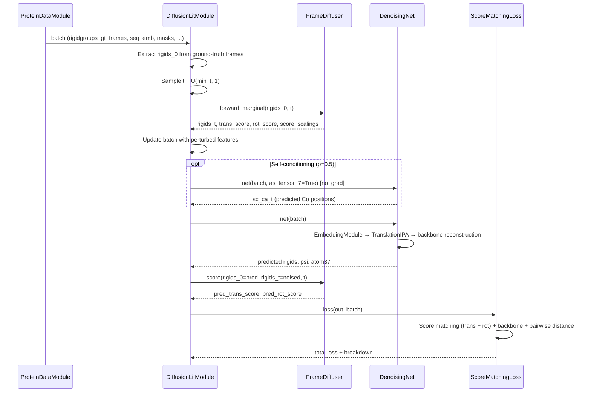
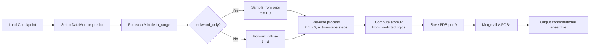

---
slug:5-architecture-overview
blog_type:normal
---


IDPFold 是一个生成式深度学习模型，能够直接根据氨基酸序列预测内在无序蛋白（IDP）的构象系综。该模型将蛋白质骨架结构建模为一组刚体坐标系——每个坐标系由一个 SE(3) 变换（旋转 + 平移）定义，并通过在 SE(3) 流形上基于分数的扩散过程来学习去噪。系统在 PDB 数据库上进行预训练，并在 IDRome 构象系综上进行微调，无需依赖多序列比对或实验数据。代码库基于 Lightning + Hydra 项目结构构建，继承了 lightning-hydra-template 模板，架构设计灵感来源于 Str2Str 和 AlphaFold2 的 IPA 骨架网络。


来源：[README.md](/README.md#L1-L69), [diffusion_module.py](/src/models/diffusion_module.py#L1-L50), [diffusion.yaml](/configs/model/diffusion.yaml#L1-L103)

## 系统架构概览

下图展示了 IDPFold 的端到端数据流，从原始蛋白质序列到生成的构象系综。每个主要子系统都被分解为相应的组成模块，展示了训练和推理路径是如何通过共享的扩散核心汇聚在一起的。

```mermaid
graph TB
    subgraph Data Pipeline
        FASTA[FASTA Sequence File]
        ESM[ESM Sequence Embedding]
        DS[Protein Dataset & Transforms]
        DM[ProteinDataModule]
        FASTA --> READ[read_seqs.py]
        READ --> ESM
        FASTA --> DS
        DS --> DM
    end

    subgraph Diffusion Core
        FD[FrameDiffuser]
        R3[R3Diffuser<br/>Translation on ℝ³]
        SO3[SO3Diffuser<br/>Rotation on SO(3)]
        R3 --> FD
        SO3 --> FD
    end

    subgraph Neural Network Backbone
        EM[EmbeddingModule<br/>Time + Position + Self-Cond.]
        IPA[TranslationIPA<br/>IPA Blocks + Transformer]
        DN[DenoisingNet]
        EM --> DN
        IPA --> DN
    end

    subgraph Lightning Orchestrator
        DLM[DiffusionLitModule]
        LOSS[ScoreMatchingLoss]
        DLM --> FD
        DLM --> DN
        DLM --> LOSS
    end

    subgraph Inference
        FB[Forward-Backward Sampling]
        PDB[PDB Output Generation]
    end

    subgraph Config
        HC[Hydra Config System]
    end

    DM --> DLM
    ESM --> EM
    DLM --> FB
    FB --> PDB
    HC -.-> DLM
    HC -.-> DM
    HC -.-> FD

    classDef core fill:#e8f0fe,stroke:#4285f4,stroke-width:2px
    classDef data fill:#e6f4ea,stroke:#34a853,stroke-width:2px
    classDef net fill:#fef7e0,stroke:#fbbc04,stroke-width:2px
    classDef infer fill:#fce8e6,stroke:#ea4335,stroke-width:2px
    class FD,R3,SO3 core
    class DM,DS,ESM,FASTA,READ data
    class EM,IPA,DN net
    class FB,PDB infer
```

该架构由四个紧密耦合的层组成：**数据处理**、**扩散数学**、**神经网络骨干**和**编排调度**。`DiffusionLitModule` 作为核心协调器——它负责实例化用于前向/反向扩散的 `FrameDiffuser`、用于分数预测的 `DenoisingNet`，以及用于梯度计算的 `ScoreMatchingLoss`。Hydra 的配置系统通过 `_target_` 实例化机制将各个组件串联起来，实现了整个系统的声明式配置。

来源：[train.py](/src/train.py#L52-L87), [eval.py](/src/eval.py#L44-L78), [diffusion_module.py](/src/models/diffusion_module.py#L47-L120), [diffusion.yaml](/configs/model/diffusion.yaml#L1-L103)

## 组件映射与职责

下表汇总了每个主要模块的源码位置及其在架构中的角色。这可以作为后续深入解析部分的导航参考。

| 子系统 | 模块 | 文件 | 职责 |
|---|---|---|---|
| **编排调度** | `DiffusionLitModule` | `src/models/diffusion_module.py` | Lightning 模块：训练步骤、验证、推理采样 |
| **扩散 — 帧** | `FrameDiffuser` | `src/models/score/frame.py` | 封装 R³ 和 SO(3) 扩散器；管理前向边际分布、分数和反向过程 |
| **扩散 — 平移** | `R3Diffuser` | `src/models/score/r3.py` | 在 ℝ³ 上的 VPSDE 扩散（平移分量） |
| **扩散 — 旋转** | `SO3Diffuser` | `src/models/score/so3.py` | 在旋转群上的 IGSO(3) 扩散（旋转分量） |
| **网络 — 嵌入** | `EmbeddingModule` | `src/models/net/denoising_ipa.py` | 时间、位置、相对序列及自条件嵌入 |
| **网络 — IPA** | `TranslationIPA` | `src/models/net/ipa.py` | 堆叠的 IPA 模块，结合 Transformer 与骨架更新 |
| **网络 — 去噪** | `DenoisingNet` | `src/models/net/denoising_ipa.py` | 统筹 嵌入 → IPA → 骨架重建 流程 |
| **损失函数** | `ScoreMatchingLoss` | `src/models/loss.py` | 分数匹配 + 辅助骨架/ pairwise-distance 损失 |
| **数据 — 数据集** | `RandomAccessProteinDataset` | `src/data/components/dataset.py` | 加载序列化的蛋白质特征；应用 AF2 风格的变换 |
| **数据 — 模块** | `ProteinDataModule` | `src/data/protein_datamodule.py` | Lightning 数据模块：训练/验证集划分与批处理拼接 |
| **数据 — ESM** | `esm_extract.py` | `src/utils/esm_extract.py` | 提取输入的 ESM 序列嵌入 |
| **几何运算** | `rigid_utils.py`, `rotation3d.py`, `all_atom.py` | `src/common/` | 刚体变换、四元数/轴角操作、骨架计算 |
| **配置** | Hydra YAMLs | `configs/` | 所有组件的声明式配置 |

来源：[diffusion_module.py](/src/models/diffusion_module.py#L1-L410), [frame.py](/src/models/score/frame.py#L1-L255), [r3.py](/src/models/score/r3.py#L1-L147), [so3.py](/src/models/score/so3.py#L1-L371), [denoising_ipa.py](/src/models/net/denoising_ipa.py#L1-L221), [ipa.py](/src/models/net/ipa.py#L230-L390), [loss.py](/src/models/loss.py#L1600-L1742), [dataset.py](/src/data/components/dataset.py#L1-L200), [protein_datamodule.py](/src/data/protein_datamodule.py#L1-L200)

## 项目目录结构

代码仓库遵循 lightning-hydra-template 规范，将 `src/`（源代码）、`configs/`（声明式配置）和 `data/`（输入数据）分离开来：

```
IDPFold/
├── src/
│   ├── train.py                    # 训练入口
│   ├── eval.py                     # 推理入口
│   ├── read_seqs.py                # ESM 嵌入提取
│   ├── models/
│   │   ├── diffusion_module.py     # DiffusionLitModule (编排调度器)
│   │   ├── loss.py                 # ScoreMatchingLoss + 辅助损失
│   │   ├── score/                  # 扩散数学
│   │   │   ├── frame.py            # FrameDiffuser (SE(3) 封装)
│   │   │   ├── r3.py               # R3Diffuser (ℝ³ 平移)
│   │   │   └── so3.py              # SO3Diffuser (SO(3) 旋转)
│   │   └── net/                    # 神经网络骨干
│   │       ├── denoising_ipa.py    # DenoisingNet + EmbeddingModule
│   │       ├── ipa.py              # InvariantPointAttention + TranslationIPA
│   │       └── layers.py           # 线性层、转换层、BackboneUpdate
│   ├── data/
│   │   ├── protein_datamodule.py   # LightningDataModule + 拼接操作
│   │   └── components/dataset.py   # 蛋白质数据集 + AF2 变换
│   ├── common/                     # 几何与蛋白质工具
│   │   ├── rigid_utils.py          # Rigid/Rotation 类
│   │   ├── rotation3d.py           # 四元数 ↔ 轴角 ↔ 矩阵
│   │   ├── all_atom.py             # 骨架坐标系 → atom37 计算
│   │   ├── protein.py              # 蛋白质数据结构
│   │   ├── residue_constants.py    # 氨基酸常数
│   │   └── data_transforms.py      # AF2 风格特征变换
│   └── utils/                      # 检查点、日志、ESM、绘图
├── configs/                        # Hydra 配置层级
│   ├── train.yaml / eval.yaml      # 顶层配置
│   ├── model/diffusion.yaml        # 模型超参数
│   ├── data/                       # 数据配置
│   ├── trainer/                    # 训练器配置 (CPU/GPU/DDP)
│   └── logger/                     # 日志配置 (W&B, TensorBoard 等)
├── assets/Overview.png             # 架构图
├── data/example.fasta              # 示例输入序列
├── environment.yml                 # Conda 环境
└── setup.py                        # 包安装
```

来源：[README.md](/README.md#L1-L69), [train.py](/src/train.py#L1-L136), [eval.py](/src/eval.py#L1-L111)

## 训练数据流

在训练过程中，`DiffusionLitModule.model_step` 方法统筹了一系列精确的操作：从批次数据中提取真实的刚体系；采样随机的扩散时间 `t ∈ [min_t, 1]`；通过 `FrameDiffuser.forward_marginal` 扰动这些坐标系以生成带噪刚体及对应真实分数。随后，`DenoisingNet` 处理这些带噪输入（可选择结合自条件机制），以预测去噪后的刚体系。`FrameDiffuser.score` 方法计算预测刚体与带噪刚体之间的解析分数，最后由 `ScoreMatchingLoss` 汇总得出最终损失。



<CgxTip>训练循环采用了**双重损失策略**：在 `t` 值较大（重噪声）时以分数匹配损失为主；在 `t` 值较小（轻噪声）时，则由 **x₀ 预测损失**（直接坐标均方误差）接管。该机制由 `x0_threshold` 参数控制，确保模型在数据分布边界附近能够稳定收敛。此外，`backbone_atom_loss` 和 `pairwise_distance_loss` 这两个辅助损失项受其各自的 `t_threshold` 控制，仅当结构接近真实值时才会激活。</CgxTip>

来源：[diffusion_module.py](/src/models/diffusion_module.py#L83-L130), [loss.py](/src/models/loss.py#L1600-L1742), [diffusion.yaml](/configs/model/diffusion.yaml#L68-L85)

## 推理数据流

推理过程使用了 IDPFold 独有的**前向-反向采样策略**。模型无需从 `t=1`（纯噪声）开始运行完整的扩散链，而是可以选择从初始结构前向扩散至中间时刻 `t=Δ`，随后再运行反向过程回到 `t=0`。这使得模型能够在已知起始点周围探索构象多样性——这对于生成探索局部构象邻域的 IDP 系综至关重要，而非单纯从完全无结构的先验分布中抽取。`predict_step` 方法会遍历多个 `Δ` 值，每个 delta 生成 `n_replica` 个结构，并将其保存为合并的 PDB 文件。



<CgxTip>默认推理配置在 `backward_only=True`（从先验分布进行纯反向采样）的情况下生成 **192 个副本**，采用 **1000 个时间步**及随机 SDE 动力学（`probability_flow=false`）。作为替代方案，概率流 ODE 模式可用于确定性采样，但代价是系综多样性会有所降低。</CgxTip>

来源：[diffusion_module.py](/src/models/diffusion_module.py#L207-L370), [eval.py](/src/eval.py#L44-L78), [diffusion.yaml](/configs/model/diffusion.yaml#L86-L101)

## 配置架构

IDPFold 采用了 Hydra 的可组合配置系统，其中每个组件均通过 YAML 中的 `_target_` 引用进行实例化。顶层配置文件 `train.yaml` 和 `eval.yaml` 组合了数据、模型、训练器、回调和日志等子配置。`model/diffusion.yaml` 文件是所有架构超参数的唯一事实来源——网络维度、扩散器参数、损失权重及推理设置均以声明式指定。

| 配置组 | 核心文件 | 控制内容 |
|---|---|---|
| 模型 | `configs/model/diffusion.yaml` | 网络维度、扩散器参数、损失权重、推理超参数 |
| 数据 | `configs/data/protein.yaml`, `sampling.yaml` | 数据集路径、变换、批处理 |
| 训练器 | `configs/trainer/{cpu,gpu,ddp}.yaml` | 设备、精度、分布式策略 |
| 日志 | `configs/logger/{wandb,tensorboard,...}.yaml` | 实验追踪 |
| 实验 | `configs/experiment/example.yaml` | 针对特定运行覆盖组合配置 |
| 回调 | `configs/callbacks/{default,early_stopping,...}.yaml` | 训练回调 |

模型配置揭示了精确的架构选择：`DenoisingNet` 使用了 4 个 IPA 模块，包含 256 维节点嵌入、128 维边嵌入、8 个注意力头、8 个查询/关键点以及 12 个值点。`FrameDiffuser` 结合了基于 VPSDE 的 `R3Diffuser`（min_b=0.1, max_b=20.0）与基于 IGSO(3) 的 `SO3Diffuser`（对数 sigma 调度，min_sigma=0.1, max_sigma=1.5）。两者共享大小为 0.1 的 `coordinate_scaling`，在内部将埃（Å）转换为纳米。

来源：[diffusion.yaml](/configs/model/diffusion.yaml#L1-L103), [train.py](/src/train.py#L79-L82), [eval.py](/src/eval.py#L71-L74)

## 核心设计决策

**SE(3) 乘积流形分解。** IDPFold 没有对完整的 4×4 刚体变换进行整体扩散，而是将 SE(3) 分解为 SO(3)（旋转）和 ℝ³（平移）分量，并对各自应用符合其特性的扩散过程。`R3Diffuser` 采用具有线性漂移的方差保持 SDE（VPSDE），而 `SO3Diffuser` 采用 IGSO(3) 分布——这是旋转群上高斯扩散的自然类比。`FrameDiffuser` 类作为整合层，组合来自两个扩散器的结果，并处理针对特定残基部分扩散的掩码操作。

**基于 IPA 的去噪骨干网络。** 神经网络遵循 AlphaFold2 的架构模式：不变点注意力直接利用刚体系在 3D 空间中进行操作，从结构上保证了网络的 SE(3) 等变性。每个 IPA 模块后接一个 Transformer 编码器层、一个节点转换 MLP、一个骨架更新（用于细化刚体系）以及一个边转换。`BackboneUpdate` 模块根据节点嵌入计算每个残基的刚体更新量，使网络能够通过 `compose_q_update_vec` 迭代细化坐标系位置。

**用于改善生成质量的自条件机制。** 借鉴自 RFDiffusion，自条件机制在训练期间（以 50% 概率）将网络自身先前预测的 Cα 位置（作为距离图）作为额外输入传入。在推理阶段，这会产生一种热启动效应，使网络能够利用自身的中间预测来引导后续的去噪步骤。

来源：[frame.py](/src/models/score/frame.py#L24-L115), [r3.py](/src/models/score/r3.py#L1-L60), [so3.py](/src/models/score/so3.py#L100-L200), [ipa.py](/src/models/net/ipa.py#L230-L390), [denoising_ipa.py](/src/models/net/denoising_ipa.py#L83-L200), [diffusion_module.py](/src/models/diffusion_module.py#L100-L115), [diffusion.yaml](/configs/model/diffusion.yaml#L20-L67)

## 推荐阅读路径

既然你已对架构有了宏观认识，后续的深度解析章节将按照由浅入深的顺序组织知识——从数学基础到实现细节：

1. **从扩散数学开始**：[刚体表示](6-rigid-body-representation) → [R3 平移扩散器](7-r3-translation-diffuser) → [SO3 旋转扩散器](8-so3-rotation-diffuser) → [帧扩散器整合](9-frame-diffuser-integration)
2. **然后探索神经网络**：[嵌入模块设计](10-embedding-module-design) → [不变点注意力](11-invariant-point-attention) → [去噪网络流程](12-denoising-network-pipeline)
3. **理解训练过程**：[训练循环与模型步骤](13-training-loop-and-model-step) → [分数匹配损失](14-score-matching-loss) → [FAPE 与辅助损失](15-fape-and-auxiliary-losses)
4. **审查数据流水线**：[蛋白质数据集与变换](16-protein-dataset-and-transforms) → [ESM 序列嵌入提取](17-esm-sequence-embedding-extraction) → [数据模块与批处理](18-data-module-and-batching)
5. **研究推理过程**：[前向-反向采样策略](19-forward-backward-sampling-strategy) → [检查点加载](20-checkpoint-loading) → [PDB 输出生成](21-pdb-output-generation)
6. **参考配置**：[Hydra 配置层级](22-hydra-configuration-hierarchy) → [模型配置参考](23-model-configuration-reference) → [实验与训练器配置](24-experiment-and-trainer-configs)