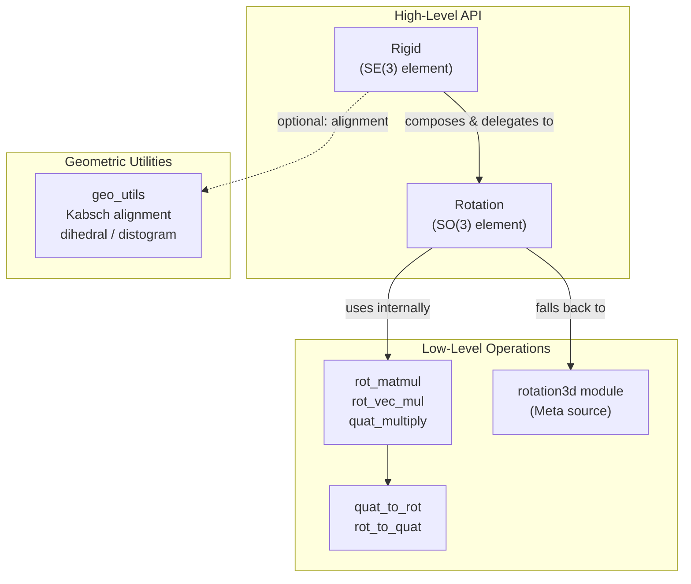
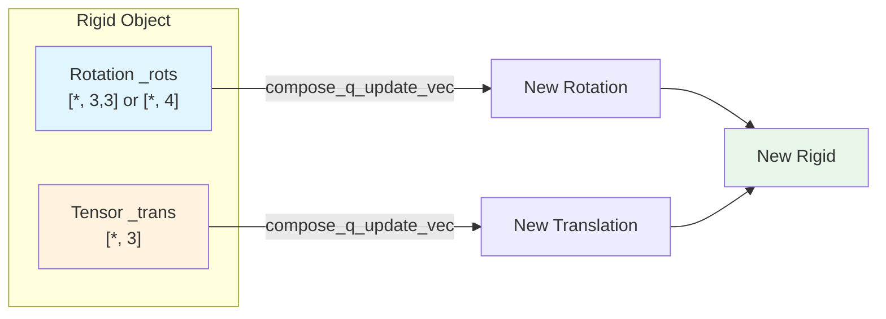
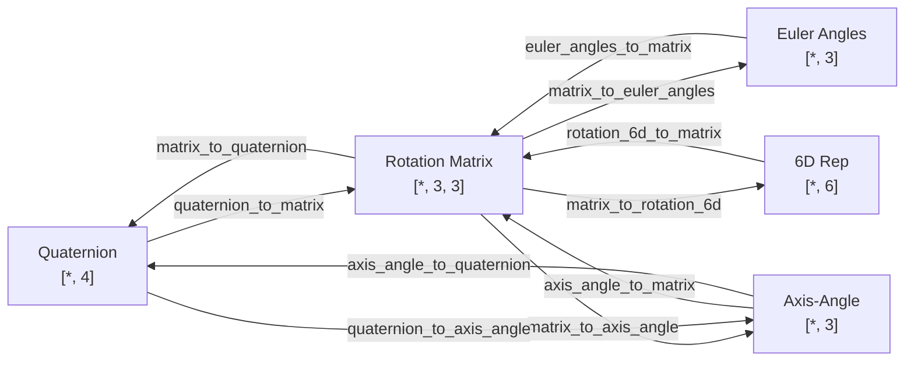

---
slug:6-rigid-body-representation
blog_type:normal
---

IDPFold 的扩散框架核心在于一个基础数学对象：**刚体变换**（rigid body transformation）。作为 SE(3) 李群的一个元素，它将旋转（SO(3)）和平移（ℝ³）联合编码在一起。本页将剖析两大核心抽象——`Rotation` 和 `Rigid`，它们构成了整个“帧上扩散”（diffusion-on-frames）机制的几何基底。在深入探讨 [R3 平移扩散器](7-r3-translation-diffuser) 和 [SO3 旋转扩散器](8-so3-rotation-diffuser) 如何操纵蛋白质骨架之前，理解它们的双格式存储策略、惰性转换语义以及仿张量 API 至关重要。

来源：[rigid_utils.py](/src/common/rigid_utils.py#L1-L21), [rotation3d.py](/src/common/rotation3d.py#L1-L12)

## 架构概述

刚体表示层由三个职责界限清晰的模块构成。`rigid_utils.py` 提供了高级的 `Rotation` 和 `Rigid` 包装类，供代码库的其余部分调用。`rotation3d.py`（源自 Meta/Facebook）提供了底层且数值稳定的转换函数，支持在五种旋转参数化形式之间进行转换。`geo_utils.py` 则提供了独立的几何辅助工具，包括 Kabsch 比对算法。依赖关系严格自上而下流动：`Rigid` 依赖于 `Rotation`，而 `Rotation` 又依赖于 `rotation3d` 进行跨格式转换。

其设计理念是**惰性双格式存储**：每个 `Rotation` 对象仅以两种格式之一来存储其底层旋转状态——3×3 旋转矩阵或单位四元数——仅在显式要求时才转换为另一种格式。这避免了冗余计算，更关键的是，它保留了原始参数化形式以供梯度反向传播使用，因为某些操作（例如四元数复合）在四元数空间中是可微的，但如果中间经过矩阵表示形式的往返转换，就会丢失梯度信息。

来源：[rigid_utils.py](/src/common/rigid_utils.py#L291-L337), [rigid_utils.py](/src/common/rigid_utils.py#L856-L905)

## Rotation 类：SO(3) 表示

### 双格式初始化

`Rotation` 类在构造时接受 `[*, 3, 3]` 的旋转矩阵张量或 `[*, 4]` 的四元数张量，但两者不可同时传入。根据设计，这些输入是互斥的——初始化时会通过断言来维持这一不变性。当传入四元数且设置 `normalize_quats=True`（默认值）时，系统会沿最后一维对其进行 L2 归一化，以保证其单位长度，这是构成有效 SO(3) 元素的先决条件。无论输入精度如何，这两种格式都会被强制转换为 `float32`。这一刻意的设计选择，是为了防止 AMP（自动混合精度）在处理对正交性约束敏感的旋转操作时引入数值不稳定性。

来源：[rigid_utils.py](/src/common/rigid_utils.py#L301-L337)

### 四元数 ↔ 旋转矩阵转换

该模块存在两条独立的转换路径，反映了其多源出身。**AlQuraishi/DeepMind 路径**使用了一个预计算的 4×4×3×3 系数张量（`_QTR_MAT`），它通过单次张量收缩，将四元数分量的外积直接映射为旋转矩阵的各项。该方法利用了一个著名的恒等式，即旋转矩阵的每个元素都是四元数分量的双线性形式：

$$R_{ij} = \sum_{a,b \in \{w,x,y,z\}} C_{abij} \cdot q_a \cdot q_b$$

**Meta 路径**（`rotation3d.matrix_to_quaternion`）采用数值稳健的策略实现了逆转换：它根据矩阵的对角线和非对角线元素计算出四个候选四元数，然后通过 `one_hot` 索引选择条件数最好的候选者（即分母最大者）。这避免了当旋转角接近特定临界值时，原始 Shepperd 方法实现中普遍存在的奇异性问题。

<CgxTip>Meta 的 `matrix_to_quaternion` 方法将分母的下限设为 0.1——这并非出于数学正确性的考虑，而是为了防止在梯度计算过程中除以接近零的数值。这个阈值特意设定得较为宽松；候选选择逻辑确保了无论哪个候选者胜出，最终的四元数都是正确的。</CgxTip>

| 转换函数 | 方向 | 实现来源 | 核心技术 |
|---|---|---|---|
| `quat_to_rot` | quat → rot_mat | AlQuraishi | 预计算 `_QTR_MAT` 张量收缩 |
| `rot_to_quat` | rot_mat → quat | AlQuraishi | 通过 `torch.linalg.eigh` 对 4×4 K-矩阵进行特征分解 |
| `quaternion_to_matrix` | quat → rot_mat | Meta | 使用 `2/(q·q)` 缩放的直接代数公式 |
| `matrix_to_quaternion` | rot_mat → quat | Meta | 多候选者选择及最大分母挑选 |
| `axis_angle_to_quaternion` | axis-angle → quat | Meta | 半角参数化配合小角泰勒展开 |

来源：[rigid_utils.py](/src/common/rigid_utils.py#L160-L207), [rigid_utils.py](/src/common/rigid_utils.py#L210-L229), [rotation3d.py](/src/common/rotation3d.py#L41-L70), [rotation3d.py](/src/common/rotation3d.py#L102-L161)

### 惰性转换语义

`get_rot_mats()` 和 `get_quats()` 访问器实现了惰性转换：如果请求的格式与存储格式一致，则直接返回底层张量，零额外开销。如果需要进行转换，则会即时执行并返回一个全新的张量——**内部存储状态永远不会被修改**。这种不可变性是刻意的架构选择，它简化了梯度跟踪，并防止了在操作前后持有 `Rotation` 引用的代码中出现隐蔽的别名错误。

`get_rotvec()` 方法值得特别关注。它通过首先提取四元数，在其实部为负数时翻转其符号（以确保 0 ≤ angle ≤ π），然后将旋转向量计算为 `angle * axis`，从而将旋转转换为轴角表示。对于小角度（≤ 1e-3 弧度），该方法使用泰勒级数近似 `sin(θ/2)/θ` 以避免数值相消，这遵循了 SciPy 的实现模式。

来源：[rigid_utils.py](/src/common/rigid_utils.py#L509-L586)

### 复合操作

`Rotation` 类提供了两种复合策略，与双格式存储机制相呼应：

**`compose_r`** 在旋转矩阵空间中运行。它从两个操作数中提取 3×3 矩阵，并使用 `rot_matmul` 将它们相乘——这是一个手动展开的实现，完全避免了使用 `torch.matmul`。文档明确指出，这种手动展开是为了防止 AMP 将中间乘积降精度为半精度，从而避免破坏结果矩阵的正交性约束。

**`compose_q`** 在四元数空间中使用哈密顿乘积运行，通过预计算的 4×4×4 张量（`_QUAT_MULTIPLY`）实现，该张量编码了四元数乘法表。乘积通过在两个四元数索引上进行张量收缩来计算，从而在单次向量化操作中得出结果。

**`compose_q_update_vec`** 实现了一个略有不同的操作：它不与完整的四元数进行复合，而是接收一个 `[*, 3]` 向量，该向量代表实部为 1 的四元数的虚部（即一个微小的旋转扰动），通过简化的 `_QUAT_MULTIPLY_BY_VEC` 表将其与当前四元数相乘，并将结果以加法形式累加到原始四元数上。这种加法更新是扩散去噪步骤中使用的机制，在此过程中，网络会预测当前帧的一个微小扰动。

来源：[rigid_utils.py](/src/common/rigid_utils.py#L24-L81), [rigid_utils.py](/src/common/rigid_utils.py#L232-L277), [rigid_utils.py](/src/common/rigid_utils.py#L590-L656)

### 仿张量 API

`Rotation` 和 `Rigid` 都实现了一整套镜像 PyTorch 张量语义的方法，使它们在许多场景下可以直接替代原始张量：

| 方法 | 语义 | Rotation 实现细节 |
|---|---|---|
| `__getitem__` | 索引 | 为 rot_mats 追加 `(slice(None), slice(None))`，或为 quats 追加 `(slice(None),)` |
| `__mul__` / `__rmul__` | 逐点缩放 | 将标量广播到末尾的 2 或 1 个维度 |
| `unsqueeze` | 维度扩展 | 将负索引调整 −2（rot_mats）或 −1（quats） |
| `cat` (静态) | 拼接 | 强制使用 rot_mat 格式；不兼容的格式会被转换 |
| `map_tensor_fn` | 自定义函数映射 | 解绑末尾维度，逐元素应用函数，重新堆叠 |
| `to` / `cuda` | 设备转移 | 委托给底层张量的 `.to()` / `.cuda()` |
| `detach` | 计算图分离 | 返回底层张量已分离的新 Rotation 对象 |

`map_tensor_fn` 方法尤其值得关注：它将旋转矩阵展平为 9 个元素，沿该维度解绑，将用户提供的函数独立应用于这 9 个分量向量中的每一个，然后重新堆叠并重塑回 `[*, 3, 3]`。这使得诸如对 one-hot 批次维度进行求和等操作，能够透明地在旋转对象上执行。

来源：[rigid_utils.py](/src/common/rigid_utils.py#L378-L440), [rigid_utils.py](/src/common/rigid_utils.py#L709-L853)

## Rigid 类：SE(3) 表示

### 结构与初始化

`Rigid` 类是一个轻量级的组合包装器，包装了一个 `Rotation` 对象和一个 `[*, 3]` 的平移张量。这两个组件的批次维度必须兼容——断言机制会强制确保 `rots.shape == trans.shape[:-1]`，且两者位于同一设备上。在构造时，平移张量会被强制转换为 `float32`，这与旋转对象的精度策略保持一致。如果其中任一组件为 `None`，则使用另一个组件来推断批次维度、dtype 和设备，并用单位元（单位旋转或零平移）填充缺失的组件。

来源：[rigid_utils.py](/src/common/rigid_utils.py#L856-L905)

### 复合：核心 SE(3) 群操作

`compose` 方法实现了 SE(3) 群乘积。给定两个刚体变换 $T_1 = (R_1, \mathbf{t}_1)$ 和 $T_2 = (R_2, \mathbf{t}_2)$，复合 $T_1 \circ T_2$ 的结果为：

$$R_{new} = R_1 R_2, \quad \mathbf{t}_{new} = R_1 \mathbf{t}_2 + \mathbf{t}_1$$

该实现与公式完全一致：旋转部分为 `new_rot = self._rots.compose_r(r._rots)`，平移部分为 `new_trans = self._rots.apply(r._trans) + self._trans`。第二个变换的平移分量首先被旋转到第一个变换的局部坐标系中，然后加上第一个变换的平移分量作为偏移。

`compose_q_update_vec` 方法将此模式扩展到了扩散场景中。它接收一个 `[*, 6]` 张量，其中前 3 个分量参数化了一个四元数更新向量（即 `(1, x, y, z)` 的虚部），后 3 个分量参数化了一个平移更新。四元数更新通过 `Rotation.compose_q_update_vec` 应用，而平移更新在加到当前平移量上之前，会**先被当前旋转矩阵旋转**。这种局部坐标系参数化确保了平移更新对当前朝向保持等变性——这对于 SE(3) 等变扩散至关重要。

<CgxTip>`compose_q_update_vec` 方法支持一个可选的 `update_mask` 张量，该张量会独立地对四元数和平移更新进行门控。这用于掩码扩散训练，在此过程中，每一步只有部分残基接收到更新。</CgxTip>

来源：[rigid_utils.py](/src/common/rigid_utils.py#L1042-L1105)

### 点应用与求逆

`apply` 方法通过 `Rotation.apply`（内部调用手动展开的 `rot_vec_mul`）先对 `[*, 3]` 坐标张量进行旋转，然后加上平移量，从而实现变换。`invert_apply` 方法则执行逆操作：先减去平移量，再应用逆向旋转。这种顺序反映了 SE(3) 群的非交换性——$(R, \mathbf{t})$ 的逆是 $(R^{-1}, -R^{-1}\mathbf{t})$，而不是 $(R^{-1}, -\mathbf{t})$。

`invert` 方法显式地构造了这个逆变换：它计算 `rot_inv = self._rots.invert()`（对旋转矩阵进行转置或对四元数取共轭），然后计算 `trn_inv = rot_inv.apply(self._trans)` 并取其相反数。生成的 `Rigid` 对象表示一个将世界坐标系中的任意点映射回局部坐标系的变换。

来源：[rigid_utils.py](/src/common/rigid_utils.py#L1107-L1145)

### 4×4 齐次表示

为了与需要齐次坐标的外部代码实现互操作，`to_tensor_4x4` 将旋转和平移打包成一个 `[*, 4, 4]` 矩阵：

$$T = \begin{bmatrix} R & \mathbf{t} \\ \mathbf{0}^T & 1 \end{bmatrix}$$

矩阵的最后一行被硬编码为 `[0, 0, 0, 1]`。逆向构造函数 `from_tensor_4x4` 则将这种表示解包回 `Rigid` 对象，提取左上角的 3×3 块作为旋转，右上角的 3×1 块作为平移。这种双向转换实现了与处理原始 4×4 矩阵的代码路径（例如某些 PDB 解析例程）的无缝集成。

来源：[rigid_utils.py](/src/common/rigid_utils.py#L1169-L1195)

## 几何辅助工具

### 手动展开的矩阵操作

`rot_matmul` 和 `rot_vec_mul` 函数被刻意编写为显式的逐元素计算，而没有使用 `torch.matmul` 或 `torch.einsum`。每个输出元素（分别为 9 或 3 个）都被计算为三个乘积之和，且所有中间结果都保持全精度。文档字符串明确说明了其基本原理：“手动展开以避免 AMP 降精度”。当在 AMP 下使用 `torch.matmul` 时，中间累加可能会被降精度为 `float16`，这会导致结果矩阵偏离正交性——对于以正交性为核心约束的旋转操作而言，这是灾难性的失败。

来源：[rigid_utils.py](/src/common/rigid_utils.py#L24-L108)

### rotation3d 模块：五向参数化

`rotation3d.py` 模块（在 BSD 许可证下源自 Meta Platforms）提供了一套全面的转换函数，支持在五种旋转表示形式之间进行转换：

6D 旋转表示（`rotation_6d_to_matrix` / `matrix_to_rotation_6d`）遵循 Zhou 等人（CVPR 2019）的方法，使用 Gram-Schmidt 正交化将任意 6D 向量映射为有效的旋转矩阵。这种表示是连续的——不像四元数或欧拉角那样存在拓扑不连续性——因此在某些学习场景中更受青睐作为网络输出格式。然而，IDPFold 的主要表示形式依然是基于四元数的，6D 路径仅作为一种备选方案。

轴角转换实现了严格的数值稳定性：对于低于 1e-6 弧度的角度，`axis_angle_to_quaternion` 使用小角度泰勒展开（`sin(θ/2)/θ ≈ 1/2 − θ²/48`），而 `quaternion_to_axis_angle` 则对称地应用相同的展开。这些防护措施防止了在计算近单位矩阵旋转的旋转向量时出现除以零的情况。

来源：[rotation3d.py](/src/common/rotation3d.py#L41-L70), [rotation3d.py](/src/common/rotation3d.py#L102-L161), [rotation3d.py](/src/common/rotation3d.py#L461-L522), [rotation3d.py](/src/common/rotation3d.py#L556-L596)

### geo_utils 中的 Kabsch 比对

`geo_utils.py` 模块提供了 `_find_rigid_alignment` 函数，该函数实现了 Kabsch 算法，用于两个点云之间的最优刚体比对。给定形状为 `[*, L, 3]` 的源点云和目标点云，该算法会：(1) 将两个点云的中心移至其质心，(2) 计算 3×3 协方差矩阵 `H = src_centered^T · tgt_centered`，(3) 通过 SVD 分解 `H = U S V^T`，(4) 构造 `R = V U^T`。平移量恢复为 `t = tgt_centroid − R · src_centroid`。`squared_deviation` 函数封装了该比对过程并计算 RMSD，作为主要的结构质量指标。

来源：[geo_utils.py](/src/common/geo_utils.py#L1-L13), [geo_utils.py](/src/common/geo_utils.py#L58-L143)

## 设计决策与权衡

| 决策 | 理由 | 权衡 |
|---|---|---|
| 双格式存储 | 保留梯度路径；避免不必要的转换 | 额外的分支逻辑；未使用格式的内存占用为零（惰性） |
| 手动展开的矩阵乘法 | 防止 AMP 破坏正交性 | 对于大批次比 `torch.matmul` 慢约 2 倍；可读性降低 |
| 强制使用 float32 | 旋转操作需要全精度 | 内存占用比 float16 多约 2 倍；限制了显存受限 GPU 上的批次大小 |
| 不可变变换 | 简化自动求导；防止别名错误 | 每次操作都会产生额外的内存分配；无法进行原地更新 |
| Meta 的矩阵转四元数方法 | 对所有旋转角度都具有数值稳健性 | 比 Shepperd 方法更复杂；计算成本略高 |

不可变性这一决策具有最深远的架构影响。每一次操作——复合、求逆、索引、设备转移——都会返回一个新的 `Rotation` 或 `Rigid` 对象。这意味着在扩散采样过程中（帧在多个时间步上被迭代更新），会产生一连串的内存分配。该设计将正确性和梯度安全置于内存效率之上，考虑到与模型的隐藏维度相比，蛋白质结构相对较小（数百到数千个残基），这种取舍是合理的。

来源：[rigid_utils.py](/src/common/rigid_utils.py#L291-L337), [rigid_utils.py](/src/common/rigid_utils.py#L856-L905)

## 与扩散管线的集成

`Rigid` 和 `Rotation` 类是 IDPFold 扩散模块的通用语言。蛋白质中的每个残基都由一个刚体帧（骨架 N-Cα-C 帧）表示，扩散过程通过 `compose_q_update_vec` 利用神经网络预测的更新量来扰动这些帧。`apply` 方法将局部坐标系下的原子坐标转换为全局坐标系以进行损失计算，而 `invert_apply` 则执行反向映射以进行特征提取。[帧扩散器集成](9-frame-diffuser-integration) 页面详细介绍了这些原语如何跨扩散时间步进行编排，而 [SO3 旋转扩散器](8-so3-rotation-diffuser) 和 [R3 平移扩散器](7-r3-translation-diffuser) 页面则分别探讨了应用于各分量的随机过程。