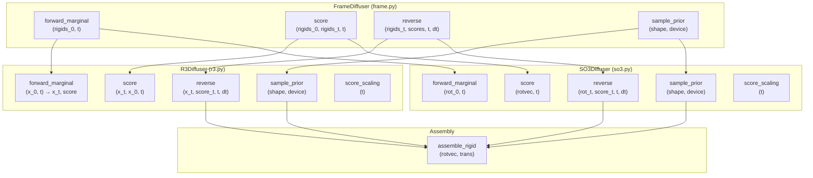
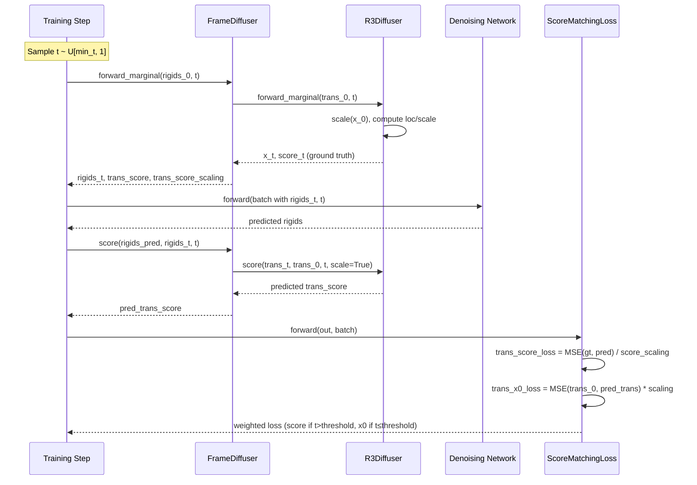

---
slug:7-r3-translation-diffuser
blog_type:normal
---


R3 Translation Diffuser 控制着 IDPFold 的 SE(3) 扩散框架中残基级平移向量的随机破坏与随后的去噪。它在 ℝ³ 上实现了一个 **Variance Preserving Stochastic Differential Equation (VP-SDE)**，其中每个残基的 Cα 平移根据线性噪声计划逐步被高斯噪声扰动。该模块是 [SO(3) Rotation Diffuser](8-so3-rotation-diffuser) 的平移对应物，两者均由 [Frame Diffuser Integration](9-frame-diffuser-integration) 包装器统一调度。理解其数学公式对于掌握去噪网络的训练方式以及推理阶段的结构采样过程至关重要。

来源: [r3.py](/src/models/score/r3.py#L1-L147), [frame.py](/src/models/score/frame.py#L1-L255), [diffusion.yaml](/configs/model/diffusion.yaml#L1-L103)

## VP-SDE 数学基础

R3Diffuser 运行在连续时间扩散的 **Variance Preserving (VP)** 公式下，这是 DDPM 向 SDE 的推广。在此框架中，前向扩散过程由以下 Itô SDE 定义：

$$dx = -\frac{1}{2} b(t)\, x\, dt + \sqrt{b(t)}\, dw$$

其中 $b(t)$ 是单调递增的噪声计划，$w$ 是标准布朗运动，$t \in [0, 1]$ 对扩散时间线进行参数化。“方差保持”特性的由来在于：漂移项 $-\frac{1}{2}b(t)x$ 会不断将状态拉向原点，抵消扩散项引发方差膨胀的趋势——从而确保边缘分布在任何时刻都保持有界。

### 线性噪声计划

该实现为 $b(t)$ 采用了 **线性计划**：

```python
def b_t(self, t: torch.Tensor):
    return self.min_b + t * (self.max_b - self.min_b)
```

这意味着 $b(t) = \text{min\_b} + t \cdot (\text{max\_b} - \text{min\_b})$，即在 $t=0$ 时的 `min_b` 和 $t=1$ 时的 `max_b` 之间进行线性插值。默认配置设置了 `min_b=0.1` 和 `max_b=20.0`，使得在整个扩散时间线中噪声注入率增加了 200 倍。

<CgxTip>比值 `max_b / min_b` 控制着噪声计划转换的剧烈程度。较大的比值会将大部分破坏集中在扩散的后期阶段（接近 $t=1$），这对于蛋白质结构的生成是有益的，因为它允许网络在处理近乎随机的构象之前，先学习粗略的结构恢复（小扰动）。</CgxTip>

**边缘累积噪声** $\bar{\beta}(t) = \int_0^t b(s)\, ds$ 通过解析方式计算：

```python
def marginal_b_t(self, t):
    return t * self.min_b + 0.5 * (t**2) * (self.max_b - self.min_b)
```

这个闭式积分 $\bar{\beta}(t) = t \cdot \text{min\_b} + \frac{1}{2}t^2(\text{max\_b} - \text{min\_b})$ 是基石性的关键量，所有的边缘分布、条件方差和分数函数均由此推导得出。

来源: [r3.py](/src/models/score/r3.py#L26-L34), [diffusion.yaml](/configs/model/diffusion.yaml#L40-L44)

### SDE 系数

从噪声计划中可以推导出两个 SDE 系数——**漂移系数** $f(x,t)$ 和 **扩散系数** $g(t)$：

| 系数 | 公式 | 代码 | 作用 |
|---|---|---|---|
| 漂移 $f(x,t)$ | $-\frac{1}{2} b(t) \cdot x$ | `drift_coef(x, t)` | 向原点的均值回复拉力 |
| 扩散 $g(t)$ | $\sqrt{b(t)}$ | `diffusion_coef(t)` | 随机噪声注入率 |
| 边缘 $\bar{\beta}(t)$ | $\int_0^t b(s)\,ds$ | `marginal_b_t(t)` | 累积噪声预算 |
| 条件方差 | $1 - e^{-\bar{\beta}(t)}$ | `conditional_var(t)` | $p(x_t \mid x_0)$ 的方差 |

来源: [r3.py](/src/models/score/r3.py#L36-L41), [r3.py](/src/models/score/r3.py#L62-L64)

## 坐标缩放

一个关键的设计决策是 **坐标缩放** 机制。以埃为单位的蛋白质平移跨度可达数十至数百个单位，这会使 VP-SDE 的噪声计划参数（`min_b`, `max_b`）在不恰当的量级上运行。`coordinate_scaling` 参数（默认值：`0.1`）在扩散操作前对平移进行归一化，并在操作后进行反归一化：

```python
def scale(self, x):
    return x * self.coordinate_scaling

def unscale(self, x):
    return x / self.coordinate_scaling
```

所有内部的扩散计算——前向边缘采样、分数计算和反向步进——均在 **缩放空间** 中进行。缩放因子在方法的入口处应用，并在出口处还原，使得扩散器对调用方透明。该缩放因子也出现在损失配置中（`config.translation.coordinate_scaling = 0.1`），以确保扩散过程与损失计算之间的一致性。

来源: [r3.py](/src/models/score/r3.py#L22-L26), [diffusion.yaml](/configs/model/diffusion.yaml#L42-L44), [loss.py](/src/models/loss.py#L1691-L1696)

## 前向边缘采样

前向过程计算边缘分布 $p(x_t \mid x_0)$，对于 VP-SDE，它具有闭式的高斯解：

$$p(x_t \mid x_0) = \mathcal{N}\left(x_t \;\middle|\; e^{-\frac{1}{2}\bar{\beta}(t)} x_0,\; 1 - e^{-\bar{\beta}(t)}\right)$$

该实现直接从该分布中采样：

```python
def forward_marginal(self, x_0: torch.Tensor, t: torch.Tensor):
    t = inflate_array_like(t, x_0)
    x_0 = self.scale(x_0)
    
    loc = torch.exp(-0.5 * self.marginal_b_t(t)) * x_0
    scale = torch.sqrt(1 - torch.exp(-self.marginal_b_t(t)))
    z = torch.randn_like(x_0)
    x_t = z * scale + loc
    score_t = self.score(x_t, x_0, t)
    
    x_t = self.unscale(x_t)
    return x_t, score_t
```

该方法同时返回受扰动后的位置 `x_t` 和作为训练目标的 **解析型真实分数** `score_t`。`inflate_array_like` 工具将时间张量 `t` 从形状 `(batch_size,)` 广播，以匹配 `x_0` 的空间维度 `(batch_size, n_residues, 3)`，从而确保按残基应用噪声。

在 $t=0$ 时，分布退化为原始结构（$\text{loc} = x_0$, $\text{scale} = 0$）。在 $t=1$ 且使用默认参数时（$\bar{\beta}(1) = 0.1 + 0.5 \times 19.9 = 10.05$），均值缩放因子 $e^{-5.025} \approx 0.0066$ 可忽略不计，且方差趋近于 1.0——实际上产生了一个标准正态分布。

来源: [r3.py](/src/models/score/r3.py#L66-L90), [tensor_utils.py](/src/utils/tensor_utils.py#L12-L30)

## 解析型分数函数

VP-SDE 边缘分布的分数函数 $\nabla_{x_t} \log p(x_t \mid x_0)$ 具有闭式表达式：

$$\nabla_{x_t} \log p(x_t \mid x_0) = -\frac{x_t - e^{-\frac{1}{2}\bar{\beta}(t)} x_0}{1 - e^{-\bar{\beta}(t)}}$$

```python
def score(self, x_t, x_0, t, scale=False):
    t = inflate_array_like(t, x_t)
    if scale: 
        x_t, x_0 = self.scale(x_t), self.scale(x_0)
    return -(x_t - torch.exp(-0.5 * self.marginal_b_t(t)) * x_0) / self.conditional_var(t)
```

该分数衡量了对数概率密度增加的方向——即从带噪样本 $x_t$ 指向干净数据 $x_0$ 的方向。在训练期间，神经网络学习预测该分数（由扩散系数进行缩放），而解析型分数则作为真实的监督信号。`scale` 标志控制是否在计算前对输入进行缩放；当从 `FrameDiffuser.score` 调用时，会显式启用缩放以确保一致性。

用于归一化损失以及在数据分数与噪声预测参数化之间进行转换的 **分数缩放** 因子为：

```python
def score_scaling(self, t: torch.Tensor):
    return 1.0 / torch.sqrt(self.conditional_var(t))
```

它等于 $1/\sqrt{1 - e^{-\bar{\beta}(t)}}$，当 $t \to 0$（条件方差消失时）趋向于无穷大，而当 $t \to 1$ 时趋向于 1.0。

来源: [r3.py](/src/models/score/r3.py#L115-L122), [r3.py](/src/models/score/r3.py#L92-L94)

## 基于分数的 x₀ 估计

一个特别有用的操作是通过反转边缘分布公式，从带噪样本 $x_t$ 和估计的分数中恢复干净的平移向量 $x_0$：

```python
def calc_trans_0(self, score_t, x_t, t):
    beta_t = self.marginal_b_t(t)
    beta_t = beta_t[..., None, None]
    cond_var = 1 - torch.exp(-beta_t)
    return (score_t * cond_var + x_t) / torch.exp(-0.5 * beta_t)
```

上式重新整理了分数方程以求解 $x_0$：

$$x_0 = \frac{\text{score}_t \cdot \sigma^2_t + x_t}{e^{-\frac{1}{2}\bar{\beta}(t)}}$$

其中 $\sigma^2_t = 1 - e^{-\bar{\beta}(t)}$ 是条件方差。此操作在训练期间用于计算 **x0 损失**——这是一种针对预测平移与真实平移的直接回归损失，作为低噪声水平下分数匹配损失的补充。

来源: [r3.py](/src/models/score/r3.py#L48-L54)

## 反向过程与采样

反向扩散过程通过将逆向时间 SDE 从 $t=1$ 向后积分至 $t=0$ 来重建干净的结构。该实现同时支持 **逆向 SDE**（随机）和 **概率流 ODE**（确定性）公式：

```python
def reverse(self, x_t, score_t, t, dt, mask=None, center=True,
            noise_scale=1.0, probability_flow=True):
    t = inflate_array_like(t, x_t)
    x_t = self.scale(x_t)
    
    f_t = self.drift_coef(x_t, t)
    g_t = self.diffusion_coef(t)
    
    z = noise_scale * torch.randn_like(score_t)
    
    rev_drift = (f_t - g_t ** 2 * score_t) * dt * (0.5 if probability_flow else 1.)
    rev_diffusion = 0. if probability_flow else (g_t * sqrt(dt) * z)
    perturb = rev_drift + rev_diffusion

    if mask is not None:
        perturb *= mask[..., None]
    else:
        mask = torch.ones_like(x_t[..., 0])
    x_t_1 = x_t - perturb
    if center:
        com = torch.sum(x_t_1, dim=-2) / torch.sum(mask, dim=-1)[..., None]
        x_t_1 -= com[..., None, :]
    
    x_t_1 = self.unscale(x_t_1)
    return x_t_1
```

这两种公式的区别仅在于一个系数以及随机噪声的存在与否：

| 模式 | 漂移项 | 扩散项 | 用例 |
|---|---|---|---|
| **逆向 SDE** | $(f - g^2 \cdot \text{score}) \cdot dt$ | $g \cdot \sqrt{dt} \cdot z$ | 随机采样（默认推理） |
| **概率流 ODE** | $\frac{1}{2}(f - g^2 \cdot \text{score}) \cdot dt$ | $0$ | 确定性采样，精确似然 |

<CgxTip>`center=True` 选项在每个反向步骤后减去质心，将轨迹投影到平移不变子空间上。这对于蛋白质扩散至关重要，因为绝对位置是没有意义的——只有残基的相对位置才携带结构信息。如果不进行居中处理，反向过程可能会累积全局漂移，从而浪费模型容量。</CgxTip>

`distribution` 方法提供了反向步转移核的均值和标准差，可用于分析或替代的采样方案：

```python
def distribution(self, x_t, score_t, t, mask, dt):
    x_t = self.scale(x_t)
    f_t = self.drift_coef(x_t, t)
    g_t = self.diffusion_coef(t)
    std = g_t * sqrt(dt)
    mu = x_t - (f_t - g_t**2 * score_t) * dt
    if mask is not None:
        mu *= mask[..., None]
    return mu, std
```

来源: [r3.py](/src/models/score/r3.py#L96-L113), [r3.py](/src/models/score/r3.py#L124-L131)

## 先验分布

在 $t=1$ 处的先验分布 $p(x_1)$ 是一个标准各向同性高斯分布，反映了当 $\bar{\beta}(t) \to \infty$ 时 VP-SDE 边缘分布收敛至 $\mathcal{N}(0, I)$ 的事实：

```python
def sample_prior(self, shape, device=None):
    return torch.randn(size=shape, device=device)
```

使用默认参数时，$\bar{\beta}(1) = 10.05$，给出的均值缩放为 $e^{-5.025} \approx 0.007$——实际上可忽略不计。该先验在缩放空间中采样，随后在组装成刚体对象之前由 `FrameDiffuser.sample_prior` 包装器进行反缩放。此先验作为纯反向推理模式的起点，在这种模式下，结构完全从噪声生成，而无需经过前向的部分加噪过程。

来源: [r3.py](/src/models/score/r3.py#L43-L44), [frame.py](/src/models/score/frame.py#L225-L255)

## 与 FrameDiffuser 的集成

R3Diffuser 并不直接由训练循环或推理流水线调用。相反，`FrameDiffuser` 类充当一个组合调度器，将平移操作委托给 `R3Diffuser`，并将旋转操作委托给 `SO3Diffuser`。下图展示了这种委托模式：



关键的集成点包括：

1. **前向边缘**：`FrameDiffuser.forward_marginal` 从 `Rigid` 对象中提取平移量，调用 `trans_diffuser.forward_marginal(trans_0, t)`，然后将受扰动的平移量与受扰动的旋转量重新组装成新的 `Rigid` 对象。
2. **分数计算**：`FrameDiffuser.score` 在显式缩放的情况下调用 `trans_diffuser.score(trans_t, trans_0, t, scale=True)`，因为 `FrameDiffuser` 操作的是未缩放的平移量。
3. **反向采样**：`FrameDiffuser.reverse` 委托给 `trans_diffuser.reverse`，并传入 `center` 标志以去除质心。
4. **先验采样**：`FrameDiffuser.sample_prior` 为平移分量调用 `trans_diffuser.sample_prior`，并通过 `reference_rigids` 和 `diffuse_mask` 支持部分扩散。

来源: [frame.py](/src/models/score/frame.py#L30-L120), [frame.py](/src/models/score/frame.py#L122-L180), [frame.py](/src/models/score/frame.py#L200-L255)

## 训练集成：分数匹配损失

平移扩散器的输出通过两条截然不同的平移损失路径汇入 `ScoreMatchingLoss`：

### 平移分数损失

主要损失是预测分数与真实分数之间的 **加权均方误差**，并由分数缩放因子进行归一化：

```python
trans_score_loss = (gt_trans_score - pred_trans_score) * loss_mask[..., None]
trans_score_loss /= inflate_array_like(batch['trans_score_scaling'], trans_score_loss)
trans_score_loss = torch.sum(trans_score_loss**2, dim=(-1, -2)) / _denom
```

通过 `trans_score_scaling` 进行归一化，将原始的分数 MSE 转换为噪声预测 MSE，后者在整个扩散时间线中具有更稳定的梯度。如果不进行归一化，损失将被解析型分数幅度较小的高噪声时间步所主导。

### 平移 x₀ 损失

在低噪声水平（$t \leq \text{x0\_threshold}$）下，损失切换为对预测平移量的直接回归：

```python
trans_x0_loss = (self.config.translation.coordinate_scaling * 
    (batch['rigids_0'].get_trans() - out['rigids'].get_trans()) * 
    loss_mask[..., None]
)
trans_x0_loss = torch.sum(trans_x0_loss**2, dim=(-1, -2)) / _denom
```

这种双损失策略利用了这样一个观察结果：分数匹配在 $t=0$ 附近会变得条件不良（此时分数缩放趋向无穷大），而直接坐标回归在该区域提供的信息更为丰富。`x0_threshold`（默认值：`1.0`）控制着这两种损失模式之间的切换：

$$\mathcal{L}_{\text{trans}} = \begin{cases} \mathcal{L}_{\text{score}} & \text{if } t > \text{x0\_threshold} \\ \mathcal{L}_{x_0} & \text{if } t \leq \text{x0\_threshold} \end{cases}$$

来源: [loss.py](/src/models/loss.py#L1684-L1702), [diffusion.yaml](/configs/model/diffusion.yaml#L52-L55)

## 配置参考

R3Diffuser 通过基于 Hydra 的配置系统进行配置。以下是 `configs/model/diffusion.yaml` 中的相关部分：

| 参数 | 默认值 | 描述 |
|---|---|---|
| `min_b` | `0.1` | $t=0$ 时的最小噪声计划值 |
| `max_b` | `20.0` | $t=1$ 时的最大噪声计划值 |
| `coordinate_scaling` | `0.1` | 平移归一化因子（埃 → 缩放单位） |

平移的损失配置：

| 参数 | 默认值 | 描述 |
|---|---|---|
| `weight` | `1.0` | 总损失中平移损失的相对权重 |
| `coordinate_scaling` | `0.1` | 应用于 x₀ 损失的缩放（必须与扩散器匹配） |
| `x0_threshold` | `1.0` | 采用 x₀ 损失的时间阈值下限 |

推理配置也通过反向采样参数影响平移扩散：

| 参数 | 默认值 | 描述 |
|---|---|---|
| `num_timesteps` | `1000` | 离散反向步数 |
| `noise_scale` | `1.0` | 逆向 SDE 中随机噪声的乘数 |
| `probability_flow` | `false` | 使用确定性 ODE (true) 或随机 SDE (false) |
| `min_t` | `1e-2` | 采样扩散时间的下限 |

来源: [diffusion.yaml](/configs/model/diffusion.yaml#L38-L50), [diffusion.yaml](/configs/model/diffusion.yaml#L72-L83)

## API 摘要

`R3Diffuser` 的完整方法清单：

| 方法 | 签名 | 返回值 | 用途 |
|---|---|---|---|
| `b_t` | `(t)` | `Tensor` | 瞬时噪声计划 $b(t)$ |
| `marginal_b_t` | `(t)` | `Tensor` | 累积噪声 $\bar{\beta}(t) = \int_0^t b(s)ds$ |
| `diffusion_coef` | `(t)` | `Tensor` | SDE 扩散系数 $g(t) = \sqrt{b(t)}$ |
| `drift_coef` | `(x, t)` | `Tensor` | SDE 漂移系数 $f(x,t) = -\frac{1}{2}b(t)x$ |
| `conditional_var` | `(t)` | `Tensor` | 条件方差 $\sigma^2_t = 1 - e^{-\bar{\beta}(t)}$ |
| `forward_marginal` | `(x_0, t)` | `(x_t, score_t)` | 采样 $p(x_t \mid x_0)$ 并计算真实分数 |
| `score` | `(x_t, x_0, t, scale)` | `Tensor` | 解析型分数 $\nabla \log p(x_t \mid x_0)$ |
| `score_scaling` | `(t)` | `Tensor` | 分数归一化因子 $1/\sqrt{\sigma^2_t}$ |
| `calc_trans_0` | `(score_t, x_t, t)` | `Tensor` | 根据分数和带噪样本估计 $x_0$ |
| `reverse` | `(x_t, score_t, t, dt, ...)` | `Tensor` | 单步反向 SDE/ODE 步进：$x_t \to x_{t-\Delta t}$ |
| `distribution` | `(x_t, score_t, t, mask, dt)` | `(mu, std)` | 反向转移核的均值和标准差 |
| `sample_prior` | `(shape, device)` | `Tensor` | 从 $\mathcal{N}(0, I)$ 先验中采样 |
| `scale` | `(x)` | `Tensor` | 乘以 `coordinate_scaling` |
| `unscale` | `(x)` | `Tensor` | 除以 `coordinate_scaling` |

来源: [r3.py](/src/models/score/r3.py#L1-L147)

## 前向-反向流水线总结

下图展示了平移数据在训练和推理过程中的端到端流程：



来源: [diffusion_module.py](/src/models/diffusion_module.py#L85-L130), [loss.py](/src/models/loss.py#L1684-L1702), [frame.py](/src/models/score/frame.py#L56-L120)

## 后续步骤

在建立了平移扩散机制之后，接下来自然要探讨其旋转的对应物以及集成的帧扩散器：

- [SO(3) Rotation Diffuser](8-so3-rotation-diffuser) — 在 SO(3) 流形上运行的旋转扩散模块，使用不同的噪声计划和 IGSO(3) 分布来处理刚体扰动的角度分量。
- [Frame Diffuser Integration](9-frame-diffuser-integration) — `FrameDiffuser` 如何组合 R3 和 SO3 扩散器、管理掩码，并将结果组装成 `Rigid` 对象。
- [Score Matching Loss](14-score-matching-loss) — 包含旋转、主链和成对距离损失的完整损失聚合，这些损失联合训练去噪网络。
- [Forward-Backward Sampling Strategy](19-forward-backward-sampling-strategy) — 在推理时如何通过可配置的 delta-T 范围和副本数来调度反向过程。