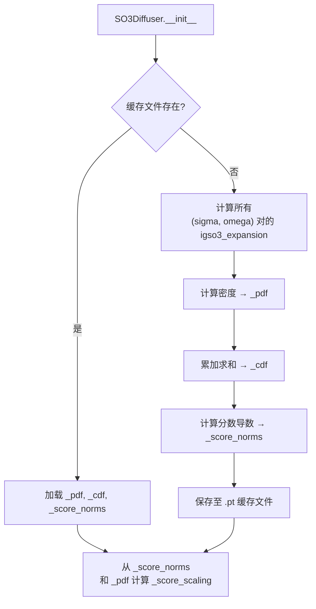
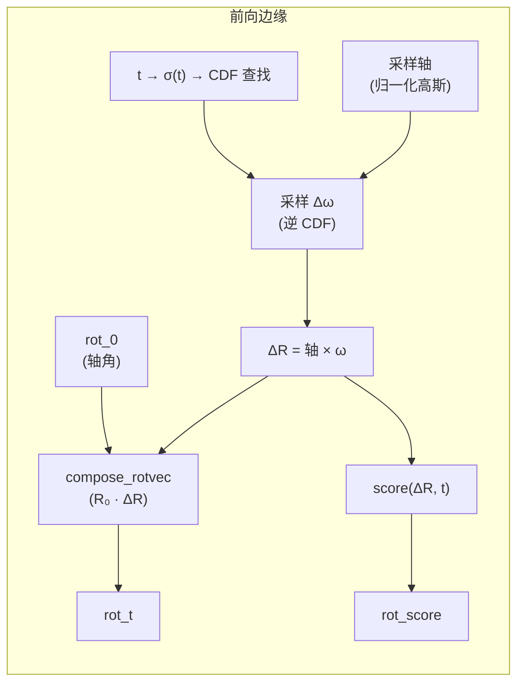
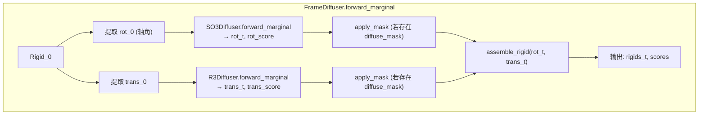
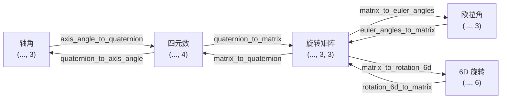

---
slug:8-so3-rotation-diffuser
blog_type:normal
---

`SO3Diffuser` 实现了特殊正交群 SO(3)（即三维旋转流形）上的扩散过程，使用了 **SO(3) 上的各向同性高斯分布**（IGSO(3)）。在欧几里得扩散中，前向过程直接添加高斯噪声；而旋转存在于弯曲的流形上，标准的扰动无法直接定义。IGSO(3) 分布提供了数学上严谨的类比：它是 SO(3) 上布朗运动的分布，其密度可以表示为不可约表示上的截断幂级数。该模块封装了旋转扩散的完整生命周期：前向边缘采样、解析分数计算、逆向 SDE 积分，以及使这些操作在训练和推理期间变得易于处理的关键预计算基础设施。

## 数学基础：IGSO(3) 分布

IGSO(3) 分布由尺度参数 σ（sigma）进行参数化，它对应于 SO(3) 上时间参数为 t = σ² 的等效布朗运动的标准差。IGSO(3) 的密度不存在闭式解；相反，它被表示为 SO(3) 不可约表示上的无限级数，以整数 ℓ 为索引：

$$f_{\text{IGSO3}}(R; \sigma) = \frac{1}{8\pi^2} \sum_{\ell=0}^{\infty} (2\ell+1) \exp\left(-\frac{\ell(\ell+1)\sigma^2}{2}\right) \frac{\sin\left((\ell+\frac{1}{2})\omega\right)}{\sin(\omega/2)}$$

其中 ω 是旋转角（即轴角表示中的旋转幅度）。在实践中，该级数被**截断为 L=1000 项**，这在 σ 值的整个操作范围内提供了足够的数值精度。该实现同时支持 NumPy（用于缓存预计算）和 PyTorch（用于训练期间的即时计算）后端，并根据 `use_torch` 标志进行切换。代码中指出了一个关键的重参数化：此处使用的 σ 与 Leach 等人（2022）的相差 √2 倍，以确保尺度为 σ 的 IGSO(3) 与 t = σ² 时刻 SO(3) 上的布朗运动相一致。通过对旋转轴进行积分（由于各向同性，旋转轴在 S² 上均匀分布）得到的**边缘密度**引入了因子 (1 - cos(ω))/π，将完整的 SO(3) 密度转换为 [0, π] 上的一维密度。

<CgxTip>选择轴角表示（旋转向量）作为工作参数化是刻意为之：IGSO(3) 分数自然地表示为 ω（旋转角）的标量函数与单位轴方向的乘积，从而生成 SO(3) 在恒等元处切空间中的一个向量。这避免了扩散过程中欧拉角的奇异性以及四元数的双重覆盖歧义。</CgxTip>

来源：[so3.py](src/models/score/so3.py#L21-L82), [so3.py](src/models/score/so3.py#L85-L130)

## Sigma 调度与扩散系数

连续时间变量 t ∈ [0, 1] 通过**对数调度**映射到尺度参数 σ(t)，该调度控制每个扩散步的噪声水平。对数调度定义为：

$$\sigma(t) = \log\left(t \cdot e^{\sigma_{\max}} + (1-t) \cdot e^{\sigma_{\min}}\right)$$

此调度确保 σ(t) 从 σ_min（在 t=0 时，噪声最小）单调递增至 σ_max（在 t=1 时，噪声最大），与线性调度相比，对数插值提供了更平滑的过渡。逆向 SDE 对应的**扩散系数** g(t) 由 IGSO(3) 尺度与 SO(3) 上布朗运动之间的关系推导得出：

$$g(t) = \sqrt{\frac{2(e^{\sigma_{\max}} - e^{\sigma_{\min}}) \cdot \sigma(t)}{e^{\sigma(t)}}}$$

默认配置使用 σ_min = 0.1、σ_max = 1.5，并为预计算网格设置了 1000 个离散的 sigma 值和 1000 个离散的 omega 值。

| 参数 | 默认值 | 作用 |
|-----------|---------|------|
| `min_sigma` | 0.1 | t=0 时的尺度（最小扰动） |
| `max_sigma` | 1.5 | t=1 时的尺度（SO(3) 上的均匀分布） |
| `num_sigma` | 1000 | σ 离散化的网格分辨率 |
| `num_omega` | 1000 | ω ∈ (0, π] 的网格分辨率 |
| `schedule` | `logarithmic` | 将 t 映射为 σ(t) |
| `use_cached_score` | `False` | 是否使用预计算的分数查找表 |
| `eps` | 1e-6 | 数值稳定性常数 |

来源：[so3.py](src/models/score/so3.py#L133-L150), [so3.py](src/models/score/so3.py#L205-L234), [diffusion.yaml](configs/model/diffusion.yaml#L49-L57)

## 预计算与缓存架构

一个核心的设计挑战在于，IGSO(3) 操作——特别是幂级数展开及其导数——涉及对 1000 项求和，如果在训练期间为每个 (σ, ω) 对进行计算，其开销将难以承受。`SO3Diffuser` 通过基于磁盘缓存的**惰性预计算策略**解决了这个问题。初始化时，扩散器会检查是否存在包含三个预计算张量的缓存 `.pt` 文件：

1. **PDF 值**：在完整的 (num_sigma × num_omega) 网格上求得的边缘密度 f(ω; σ) = expansion(ω, σ) · (1 - cos(ω))/π。
2. **CDF 值**：通过对 PDF 进行累加得到的累积分布函数，并通过 (num_omega · π) 进行归一化，从而实现逆 CDF 采样。
3. **分数范数**：使用商法则应用于幂级数项，计算得到的 IGSO(3) 密度对数对 ω 的导数。这是每个 (σ, ω) 点处分数的标量幅度。

此外，还预计算了一个**分数缩放**张量，它是 IGSO(3) 密度下分数的期望范数除以 √3：

$$\text{score\_scaling}(\sigma) = \frac{1}{\sqrt{3}} \sqrt{\frac{\sum_{\omega} \|s(\omega, \sigma)\|^2 \cdot f(\omega, \sigma)}{\sum_{\omega} f(\omega, \sigma)}}$$

该缩放因子在损失计算期间使用，用于在不同噪声水平下归一化旋转分数匹配损失。缓存目录由所有影响预计算值的超参数命名空间化，以防止配置更改时出现缓存损坏。

来源：[so3.py](src/models/score/so3.py#L133-L203), [so3.py](src/models/score/so3.py#L311-L313)

## 前向边缘采样

前向扩散过程扰动纯净旋转 R₀，生成含噪旋转 R_t 及对应的真实分数。采样过程分两个阶段进行：

**阶段 1 — 从 IGSO(3) 采样：** 首先从 S² 上均匀地抽取一个随机轴（通过归一化标准高斯向量实现），然后使用**逆 CDF 采样**从 IGSO(3) 边缘分布中采样旋转角 ω，以此得到一个旋转向量。对于每个时间 t，通过 `t_to_idx(t)` 从预计算表中检索相应的 CDF，随后 `np.interp` 在离散的 omega 网格上执行逆 CDF 查找。这是使采样变得易于处理的关键机制——我们无需在运行时计算幂级数，而是直接在预计算的 CDF 中进行插值。

**阶段 2 — 组合：** 采样的“增量旋转”（扰动）通过右乘与纯净旋转组合：R_t = R₀ · ΔR。由于旋转不构成向量空间，因此组合（而非加法）是正确的扰动机制。`compose_rotvec` 函数实现了这一点：将轴角向量转换为旋转矩阵，以双精度执行矩阵乘法，然后再转换回来——从而减轻可能破坏正交性约束的浮点累积误差。

<CgxTip>前向边缘过程返回含噪旋转以及该点处 IGSO(3) 密度的解析分数。这个真实分数对于训练期间的分数匹配损失计算至关重要，因为它提供了神经网络必须学习预测的目标。</CgxTip>

来源：[so3.py](src/models/score/so3.py#L240-L272), [so3.py](src/models/score/so3.py#L315-L331), [so3.py](src/models/score/so3.py#L13-L19)

## 分数计算

IGSO(3) 密度的分数作为 SO(3) 切空间中的一个向量，被计算为**标量幅度**（对数密度对 ω 的导数）与旋转向量**单位轴方向**的乘积。标量幅度是通过对幂级数应用商法则获得的：

$$\frac{d}{d\omega} \log \text{IGSO3}(\omega; \sigma) = \frac{\sum_{\ell=0}^{L-1} (2\ell+1) e^{-\ell(\ell+1)\sigma^2/2} \cdot \frac{d}{d\omega}\left[\frac{\sin((\ell+\frac{1}{2})\omega)}{\sin(\omega/2)}\right]}{\sum_{\ell=0}^{L-1} (2\ell+1) e^{-\ell(\ell+1)\sigma^2/2} \cdot \frac{\sin((\ell+\frac{1}{2})\omega)}{\sin(\omega/2)}}$$

比率 sin((ℓ+½)ω)/sin(ω/2) 的导数通过商法则计算，产生包含 cos((ℓ+½)ω) 和 cos(ω/2) 的项。该实现支持两种模式：

| 模式 | `use_cached_score` | 机制 | 权衡 |
|------|-------------------|-----------|-----------|
| **缓存** | `True` | 通过 `torch.bucketize` + `torch.gather` 查找 `_score_norms[sigma_idx, omega_idx]` | 速度快但为近似值（网格离散化） |
| **即时计算** | `False` (默认) | 直接在 PyTorch 中计算 `igso3_expansion` + `score()` | 速度较慢但精确；可微 |

在两种模式下，最终分数向量的计算方式均为 `score_norm * (vec / ω)`，将标量幅度投影到旋转轴方向上。对于接近恒等元的旋转，在 ω 上加上一个小常数 ε=1e-6 以防止除以零。

来源：[so3.py](src/models/score/so3.py#L85-L130), [so3.py](src/models/score/so3.py#L274-L309)

## 逆向 SDE：测地线随机游走

逆向扩散过程通过对逆时 SDE 进行积分来对旋转去噪，在 SO(3) 场景下，这采取**测地线随机游走**的形式。给定当前旋转 R_t 和预测分数 s_t，单步逆向计算为：

$$\text{perturb} = -g(t)^2 \cdot s_t \cdot dt \cdot c_{\text{pf}} + g(t) \cdot \sqrt{dt} \cdot z \cdot (1 - \text{pf})$$

其中 g(t) 是扩散系数，z 是标准高斯噪声，dt 是步长，当使用概率流 ODE（确定性）时 c_pf = 0.5，对于完整的 SDE（随机性）则为 1.0。当 `probability_flow=True` 时，扩散项完全消失，产生确定性的 ODE 积分。然后通过右乘应用扰动：R_{t-1} = R_t · compose(-perturb)，其中负号用于逆转时间方向。`inflate_array_like` 工具会广播每批次的时间张量 t，使其与完整的旋转张量形状相匹配，从而确保在各残基间进行正确的逐元素操作。

| 组件 | 概率流 (ODE) | 完整 SDE |
|-----------|----------------------|----------|
| 漂移项 | -½ · g² · s · dt | -g² · s · dt |
| 扩散项 | 0 | g · √dt · z |
| 确定性 | 是 | 否 |
| 默认配置 | — | `probability_flow: false` |

掩码机制允许进行选择性扩散：只有 `mask=True` 的残基才会受到扰动，从而支持某些区域保持固定的局部结构设计任务。

来源：[so3.py](src/models/score/so3.py#L333-L371), [tensor_utils.py](src/utils/tensor_utils.py#L24-L43), [diffusion.yaml](configs/model/diffusion.yaml#L88-L100)

## 与 Frame Diffuser 的集成

`SO3Diffuser` 不会孤立使用——它在 `FrameDiffuser` 包装器内部与 `R3Diffuser`（用于平移）组合，由后者管理完整的 SE(3) 刚体扩散。集成模式遵循清晰的关注点分离原则：`FrameDiffuser` 从 `Rigid` 对象中提取旋转和平移分量，将它们分别委派给各自的扩散器，然后重组结果。在前向边缘计算期间，通过 `matrix_to_axis_angle` 将旋转矩阵转换为轴角向量，经 SO(3) 扩散器扰动后重组。在逆向采样期间，`FrameDiffuser.reverse` 方法针对旋转分量调用 `SO3Diffuser.reverse`，针对平移调用 `R3Diffuser.reverse`，然后重组更新后的刚体。

分数计算路径中的一个关键细节：在计算用于损失训练的真实分数时，`FrameDiffuser.score` 方法首先使用四元数乘法（R₀⁻¹ · R_t）计算纯净帧与含噪帧之间的**相对旋转**，将其转换为轴角，然后评估 IGSO(3) 分数。这是必不可少的，因为 IGSO(3) 分数是相对于恒等旋转定义的，且扰动是通过右乘应用的。

来源：[frame.py](src/models/score/frame.py#L36-L107), [frame.py](src/models/score/frame.py#L109-L143), [frame.py](src/models/score/frame.py#L153-L200)

## 训练与推理集成

在训练期间，`DiffusionLitModule.model_step` 方法为批次中的每个蛋白质采样随机时间 t ∈ [min_t, 1]，调用 `FrameDiffuser.forward_marginal` 生成含噪刚体和真实分数，将含噪特征传入去噪网络，然后通过 `FrameDiffuser.score` 计算预测分数。旋转分数匹配损失将预测的旋转分数与真实的旋转分数进行比较，并通过在不同噪声水平下进行归一化的 `score_scaling` 因子进行加权。

在推理期间，`predict_step` 方法实现了前向-后向采样策略。对于纯后向采样（默认 `backward_only: true`），过程从 `SO3Diffuser.sample_prior`（在 t=1 时采样，对应于 SO(3) 上的均匀分布）开始，然后在 `num_timesteps` 步内使用网络预测的分数迭代应用 `FrameDiffuser.reverse`。逆向积分使用推理配置中的 `noise_scale` 和 `probability_flow` 参数，默认为随机采样（`probability_flow: false`）。

来源：[diffusion_module.py](src/models/diffusion_module.py#L104-L151), [diffusion_module.py](src/models/diffusion_module.py#L260-L335), [diffusion.yaml](configs/model/diffusion.yaml#L42-L100)

## 对比：SO(3) 与 R³ 扩散

SO(3) 和 R³ 扩散器解决的是数学上根本不同的问题，但共享通用的 API 接口（forward_marginal, score, reverse, score_scaling）。理解它们的差异有助于阐明针对流形的特定设计选择：

| 方面 | SO3Diffuser | R3Diffuser |
|--------|-------------|------------|
| **流形** | SO(3)（弯曲，紧致） | ℝ³（平坦，非紧致） |
| **分布** | IGSO(3)（幂级数） | 高斯分布（闭式解） |
| **扰动** | 旋转组合 (R·ΔR) | 向量加法 (x + Δx) |
| **分数形式** | 标量(ω) × 单位轴 | 直接向量 |
| **预计算** | 必需（CDF，分数范数） | 不需要（闭式解） |
| **调度** | 对数 σ(t) | 线性 β(t) (VPSDE) |
| **先验** | SO(3) 上的均匀分布 | 标准高斯分布 |
| **坐标缩放** | 不适用 | `coordinate_scaling: 0.1` |

R³ 扩散器使用带有线性 β 调度的保持方差的 SDE (VPSDE)，其中前向边缘、条件方差和分数均具有闭式高斯表达式。相比之下，SO(3) 扩散器必须处理非交换群结构、缺乏闭式密度以及需要基于测地线（而非欧几里得）的扰动等问题。

来源：[so3.py](src/models/score/so3.py#L133-L234), [r3.py](src/models/score/r3.py#L1-L147)

## 旋转表示工具

`rotation3d.py` 模块（改编自 Meta 的 PyTorch3D）提供了旋转表示之间可微转换的完整链条，构成了所有 SO(3) 操作的计算主干：

轴角与四元数之间的转换采用了数值稳定的公式，对于低于 1e-6 弧度的角度使用**小角度近似**（泰勒展开至二阶），以防止 sin(θ/2)/θ 项中出现除以零的情况。矩阵到四元数的转换通过选择分母最大的候选者，在四种可能的四元数表示中选出条件数最佳的方案，确保在旋转全范围内的数值鲁棒性。这些转换在每个扩散步骤中都会被调用——从 `Rigid` 对象中提取旋转时调用 `matrix_to_axis_angle`，组合旋转时调用 `axis_angle_to_matrix`——其数值稳定性直接影响训练的收敛性。

来源：[rotation3d.py](src/common/rotation3d.py#L461-L553), [rotation3d.py](src/common/rotation3d.py#L41-L70), [rotation3d.py](src/common/rotation3d.py#L102-L161)

## 后续步骤

SO(3) 扩散器是两个针对特定流形的扩散组件之一。要了解完整的 SE(3) 扩散全貌，请继续阅读 [Frame Diffuser 集成](9-frame-diffuser-integration) 以获取完整的组合架构，或查看 [R3 平移扩散器](7-r3-translation-diffuser) 了解其欧几里得对应物。有关 SO(3) 分数在损失计算中应用情况的训练视角，请参阅[分数匹配损失](14-score-matching-loss)。如需了解调用 `SO3Diffuser.reverse` 的推理时逆向采样循环，请参阅[前向-后向采样策略](19-forward-backward-sampling-strategy)。