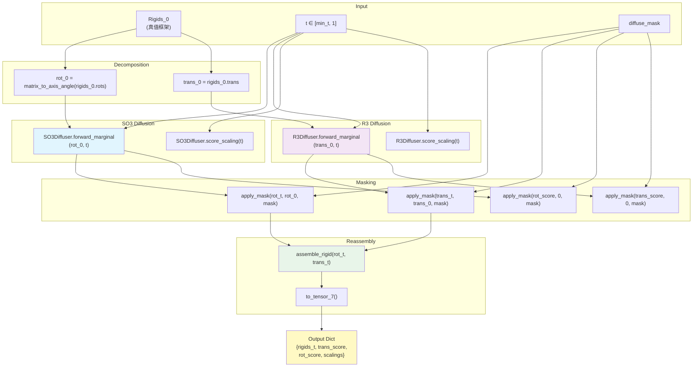
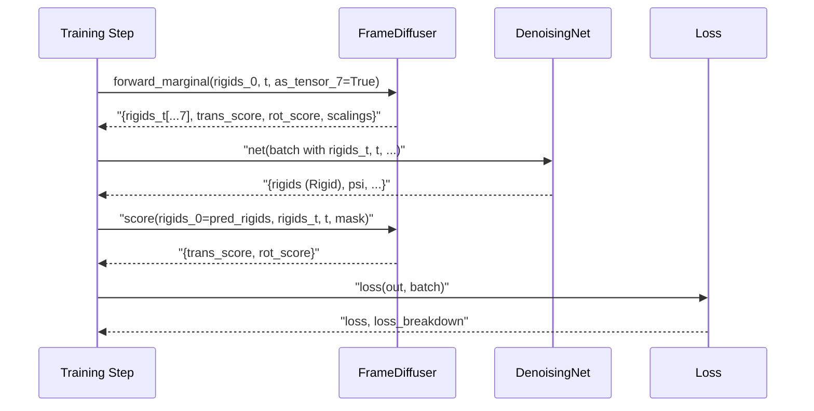

---
slug:9-frame-diffuser-integration
blog_type:normal
---

`FrameDiffuser` 类是架构的核心枢纽，它将刚体变换中平移（ℝ³）和旋转（SO(3)）分量上的独立扩散过程统一到单一且连贯的接口中。它没有将蛋白质主链框架视为整体对象，而是将每个 `Rigid` 分解为旋转矩阵和平移向量，将其分别派发给专门的扩散器，然后将受扰动的分量重新组装回统一的刚体表示。这种设计实现了模块化实验——任一组件均可独立禁用，从而允许在不触碰集成层的情况下对平移或旋转扩散进行消融实验。

来源：[frame.py](/src/models/score/frame.py#L1-L35), [diffusion.yaml](/configs/model/diffusion.yaml#L42-L58)

## 架构概述

`FrameDiffuser` 作为两个独立随机过程的**外观模式** 运行：用于 ℝ³ 平移的保方差 SDE (VPSDE) 和用于 SO(3) 旋转的基于 IGSO(3) 的扩散。关键洞察在于这两个过程是**解耦**的——给定共享的时间参数 `t`，它们独立演化，但在每一步都通过 `assemble_rigid` 函数**重新统一**，该函数将轴角向量转换回旋转矩阵并构造 `Rigid` 对象。

[frame.py#L9-L15](/src/models/score/frame.py#L9-L15) 中的 `assemble_rigid` 函数执行从轴角表示到 `Rigid` 容器的关键转换：它调用 `rotation3d.axis_angle_to_matrix` 生成 3×3 旋转矩阵，将其封装在 `Rotation` 对象中，并与平移张量配对。生成的 `Rigid` 对象——在源于 OpenFold 的 `rigid_utils.py` 中定义——支持双重内部表示（旋转矩阵或四元数），并暴露了诸如 `to_tensor_7()`（展平为 7 维向量：4 个四元数 + 3 个平移分量）和 `from_tensor_4x4()`（从 4×4 齐次矩阵构造）等转换方法。

来源：[frame.py](/src/models/score/frame.py#L9-L15), [rigid_utils.py](/src/common/rigid_utils.py#L856-L905)

## 前向边际：扰动真值框架

`forward_marginal` 方法是训练期间的主要入口点。给定真值刚体框架 `rigids_0` 和连续时间 `t ∈ [0, 1]`，它会生成含噪框架 `rigids_t` 以及旋转和平移对应的真值得分函数。该方法首先将输入的 `Rigid` 分解为轴角旋转向量和原始平移向量，然后分别委派给各子扩散器。

旋转路径调用 `SO3Diffuser.forward_marginal`，在时间 `t` 从 IGSO(3) 分布中采样“增量旋转”，并通过右乘（`compose_rotvec`）将其与真值旋转组合。平移路径调用 `R3Diffuser.forward_marginal`，应用 VPSDE 边际 `p(x_t | x_0)`——这是一个解析可处理的高斯分布，其均值呈指数衰减，方差随 `∫₀ᵗ b(s) ds` 增长。两个子扩散器同时返回各自的含噪值和得分函数。

<CgxTip>`diffuse_mask` 参数支持**部分扩散**——只有掩码为 `True` 的残基接收噪声，而其他残基保留其真值。这对于涉及部分固定结构的推理场景（例如，具有无序连接子的已知结构域）至关重要。[frame.py#L17-L18](/src/models/score/frame.py#L17-L18) 中的 `apply_mask` 辅助函数将其实现为简单的线性插值：`mask * noised + (1 - mask) * clean`。</CgxTip>

当任一扩散器为 `None`（被禁用）时，相应的分量将原样通过，且得分为零、缩放系数为 1。这种空对象模式允许 `FrameDiffuser` 作为纯平移或纯旋转扩散器运行，而无需在调用代码中使用条件分支。

来源：[frame.py](/src/models/score/frame.py#L36-L107), [so3.py](/src/models/score/so3.py#L315-L331), [r3.py](/src/models/score/r3.py#L49-L74)

## 得分计算：用于训练的真值得分

`score` 方法在给定干净和含噪刚体的情况下，计算旋转和平移的解析得分函数——即对数密度的梯度。这与 `forward_marginal` 不同，后者在执行前向扰动的同时返回得分；而当含噪状态已经存在时（例如，在推理期间网络预测出 `rigids_0` 且我们需要 `rigids_t` 处的得分时），则会调用 `score`。

对于**平移**，得分计算很直接：`R3Diffuser.score(x_t, x_0, t)` 计算 `-(x_t - e^{-½β_t} x_0) / σ²_t`，其中 `β_t` 是累积漂移，`σ²_t` 是条件方差。可选的 `scale=True` 标志会应用 `coordinate_scaling` 因子（默认配置中为 0.1），将埃格斯特朗尺度的坐标映射到归一化范围，在该范围内 VPSDE 参数（`min_b=0.1`、`max_b=20.0`）得到了良好的校准。

对于**旋转**，由于 SO(3) 是非欧几里得流形，计算更为复杂。该方法首先在四元数空间中（使用 `quat_multiply`）通过计算 `R₀⁻¹ ∘ R_t` 提取 `rigids_0` 和 `rigids_t` 之间的**相对旋转**，然后将此相对旋转转换为轴角向量 `rotvec_0t`。接着，将 SO(3) 得分计算为与 `rotvec_0t` 对齐的向量，并以相应 `ω`（旋转角）和 `σ(t)` 处的 IGSO(3) 得分范数进行缩放。

来源：[frame.py](/src/models/score/frame.py#L109-L143), [r3.py](/src/models/score/r3.py#L133-L137), [so3.py](/src/models/score/so3.py#L274-L309), [rigid_utils.py](/src/common/rigid_utils.py#L256-L277)

## 逆向过程：去噪采样

`reverse` 方法实现了逆时 SDE 的单步操作，从时间 `t` 推进至 `t - dt`。它通过各自的子扩散器独立逆转每个分量，并重新组装结果。该方法接受 `probability_flow` 和 `noise_scale` 参数，用于控制使用确定性 ODE 公式还是随机 SDE 公式。

| 参数 | 类型 | 默认值 | 描述 |
|-----------|------|---------|-------------|
| `rigids_t` | `Rigid` | 必需 | 时间 `t` 处的当前含噪框架 |
| `rot_score` | `Tensor[..., 3]` | 必需 | 预测的旋转得分 |
| `trans_score` | `Tensor[..., 3]` | 必需 | 预测的平移得分 |
| `t` | `Tensor` | 必需 | `[0, 1]` 中的当前时间 |
| `dt` | `float` | 必需 | 步长 |
| `diffuse_mask` | `Tensor[..., N]` | `None` | 残基级扩散掩码 |
| `center_trans` | `bool` | `True` | 步进后将质心归零 |
| `noise_scale` | `float` | `1.0` | 随机噪声乘数 |
| `probability_flow` | `bool` | `True` | 使用概率流 ODE |

**旋转逆向**采用测地线随机游走：它计算扰动 `δ = -g²(t) · score · dt · (若为 ODE 则为 ½ 否则为 1) + (随机项)`，然后通过 `compose_rotvec` 将当前旋转右乘该取反后的扰动。**平移逆向**应用标准 VPSDE 逆向 SDE 公式，漂移项为 `f - g² · score`，扩散项为 `g · √dt · z`，随后可选地移除质心。两个分量逆向完成后，应用 `diffuse_mask` 以确保固定的残基保持静止。

来源：[frame.py](/src/models/score/frame.py#L153-L210), [so3.py](/src/models/score/so3.py#L333-L371), [r3.py](/src/models/score/r3.py#L79-L125)

## 先验采样：初始化逆向链

`sample_prior` 方法从 `t = 1` 处的参考（终端）分布生成初始刚体样本。对于平移，这是一个标准高斯分布 `𝒩(0, I)`（经缩放后）。对于旋转，这通过在球面上均匀采样随机轴，并从 `σ_max` 处 IGSO(3) 分布的边际 CDF 中采样角度，从而在 SO(3) 上进行均匀分布采样——等价于最大噪声下的 IGSO(3)。

该方法支持**参考引导**模式，即提供 `reference_rigids` 和 `diffuse_mask`。在此模式下，扩散掩码之外的残基保留其参考（真值）位置，而掩码内的残基接收先验样本。这对于推理期间使用的**前向-后向采样策略**至关重要，该策略下模型首先应用部分前向扩散至 `t = δ`（一个低噪声水平），然后进行逆向——而不是从完全噪声开始。

<CgxTip>双模式 `sample_prior`——同时支持全噪声和参考引导初始化——正是实现前向-后向采样策略的关键。当 `backward_only=True`（默认配置）时，该方法从完整先验中采样；当 `backward_only=False` 时，转而调用 `forward_marginal` 在特定的 `t_delta` 处注入受控噪声，然后逆向过程从该中间状态开始去噪。</CgxTip>

来源：[frame.py](/src/models/score/frame.py#L212-L255), [so3.py](/src/models/score/so3.py#L240-L272), [r3.py](/src/models/score/r3.py#L37-L38)

## 与 DiffusionLitModule 集成

`FrameDiffuser` 由 Hydra 根据 `diffusion.yaml` 配置实例化，并作为 `diffuser` 属性注入到 `DiffusionLitModule` 中。其生命周期跨越 Lightning 模块内的三个关键集成点：

**训练 (`model_step`)**：该模块从 `batch['rigidgroups_gt_frames']` 中提取真值框架作为 4×4 齐次矩阵，采样随机时间 `t ∈ [min_t, 1]`，并调用 `diffuser.forward_marginal` 生成含噪框架和真值得分。在神经网络预测出干净框架后，再次调用 `diffuser.score`，以网络的预测作为 `rigids_0` 计算含噪状态下的解析得分——这就是得分匹配的训练信号。

**推理 (`predict_step`)**：`forward_backward` 内部函数编排完整的采样循环。如果 `t_delta > 0`，它调用 `diffuser.forward_marginal` 注入部分噪声；否则，调用 `diffuser.sample_prior` 进行全噪声初始化。随后逆向循环迭代 `num_timesteps` 步，调用 `self.net` 预测框架，调用 `diffuser.score` 根据预测计算得分，并调用 `diffuser.reverse` 在时间上向后步进。

**得分缩放**：`score_scaling` 方法返回一个包含平移和旋转独立缩放因子的字典，供损失模块用于在不同噪声水平下归一化得分匹配损失。平移缩放系数为 `1/√σ²_t`（标准差的倒数），而旋转缩放系数则根据 IGSO(3) 密度下的期望得分范数推导得出。

来源：[diffusion_module.py](/src/models/diffusion_module.py#L104-L151), [diffusion_module.py](/src/models/diffusion_module.py#L260-L335), [frame.py](/src/models/score/frame.py#L145-L151), [diffusion.yaml](/configs/model/diffusion.yaml#L42-L58)

## 数据流：张量表示转换

集成中一个微妙但关键的方面是 `Rigid` 对象和原始张量之间频繁的**表示切换**。`as_tensor_7` 标志控制 `forward_marginal` 和 `sample_prior` 返回 `Rigid` 对象还是 7 维张量（四元数 + 平移）。训练流水线使用 `as_tensor_7=True` 以保证批次兼容性，而推理循环使用 `as_tensor_7=False` 以便为 `reverse` 方法保留 `Rigid` 对象，仅在将更新后的状态存回特征字典时才转换为 7 维张量。

`assemble_rigid` 函数通过 `rotation3d.axis_angle_to_matrix` 将轴角向量转换为旋转矩阵，构造 `Rotation` 对象，并将其与平移配对，从而在这些表示之间架起桥梁。然后，`Rigid.to_tensor_7()` 方法通过将四元数（4 个分量，实部在前）与平移（3 个分量）拼接，将其展平为 `[..., 7]`。这种表示形式在神经网络的嵌入层和 IPA 模块中流转。

来源：[frame.py](/src/models/score/frame.py#L9-L15), [frame.py](/src/models/score/frame.py#L95-L98), [diffusion_module.py](/src/models/diffusion_module.py#L117-L147), [diffusion_module.py](/src/models/diffusion_module.py#L300-L330), [rotation3d.py](/src/common/rotation3d.py#L41-L70)

## 配置参考

`FrameDiffuser` 及其子扩散器完全通过 Hydra YAML 系统进行配置。下表将配置键映射到其架构角色：

| 配置路径 | 目标 | 关键参数 | 架构作用 |
|-------------|--------|----------------|-------------------|
| `diffuser._target_` | `FrameDiffuser` | `min_t: 1e-2` | 集成包装器；避免奇异性的最小时间 |
| `diffuser.trans_diffuser` | `R3Diffuser` | `min_b: 0.1, max_b: 20.0, coordinate_scaling: 0.1` | ℝ³ 上的 VPSDE；线性漂移调度 |
| `diffuser.rot_diffuser` | `SO3Diffuser` | `min_sigma: 0.1, max_sigma: 1.5, schedule: logarithmic, num_omega: 1000, num_sigma: 1000` | IGSO(3) 扩散；对数 σ 调度 |
| `diffuser.min_t` | — | `1e-2` | 两个过程的共享下界 |
| `inference.backward_only` | — | `true` | 控制先验初始化与前向边际初始化 |
| `inference.probability_flow` | — | `false` | SDE（随机）与 ODE（确定性）逆向 |
| `inference.noise_scale` | — | `1.0` | 逆向过程中随机噪声的乘数 |
| `inference.num_timesteps` | — | `1000` | 逆向过程的离散化分辨率 |

`coordinate_scaling` 参数 (0.1) 由 `R3Diffuser` 和 `TranslationIPA` 网络模块共享，确保扩散操作的尺度与网络处理坐标的尺度相匹配。此处不匹配将导致得分函数相对于网络输出量级的校准失效。

来源：[diffusion.yaml](/configs/model/diffusion.yaml#L42-L103), [r3.py](/src/models/score/r3.py#L10-L18), [so3.py](/src/models/score/so3.py#L133-L150)

## 子扩散器的独立性与组合

`FrameDiffuser` 的一个基本设计原则是**在给定 `t` 的情况下，旋转和平移扩散是条件独立的**。前向边际 `p(R_t, x_t | R_0, x_0, t) = p(R_t | R_0, t) · p(x_t | x_0, t)` 之所以能够分解，是因为 SE(3) 扩散被构造为因子空间 SO(3) 和 ℝ³ 上独立过程的乘积。这是一种近似——SE(3) 上真正的布朗运动会通过群结构耦合旋转和平移——但它极大地简化了数学推导和具体实现。

其产生的实际后果是，每个子扩散器都可以独立配置、禁用或替换。在配置中设置 `trans_diffuser: null` 会生成纯旋转扩散器；设置 `rot_diffuser: null` 会生成纯平移扩散器。`forward_marginal`、`score`、`reverse` 和 `sample_prior` 方法都能优雅地处理 `None` 扩散器，原样传递未受扰动的分量并将得分置零。

来源：[frame.py](/src/models/score/frame.py#L26-L34), [frame.py](/src/models/score/frame.py#L60-L75), [frame.py](/src/models/score/frame.py#L119-L134), [diffusion.yaml](/configs/model/diffusion.yaml#L42-L58)

## 后续步骤

`FrameDiffuser` 集成了前面页面介绍的两个独立扩散器。要了解每个组件的数学基础，请参阅 [R3 平移扩散器](7-r3-translation-diffuser) 和 [SO3 旋转扩散器](8-so3-rotation-diffuser)。有关 `FrameDiffuser` 操作的刚体表示，请参见 [刚体表示](6-rigid-body-representation)。消耗扩散器输出（从含噪输入预测干净框架）的神经网络在 [嵌入模块设计](10-embedding-module-design) 和 [去噪网络流水线](12-denoising-network-pipeline) 中有详细说明。编排 `forward_marginal` 和 `score` 调用的训练循环记录在 [训练循环与模型步进](13-training-loop-and-model-step) 中，而推理期间使用的前向-后向采样策略则在 [前向-后向采样策略](19-forward-backward-sampling-strategy) 中介绍。