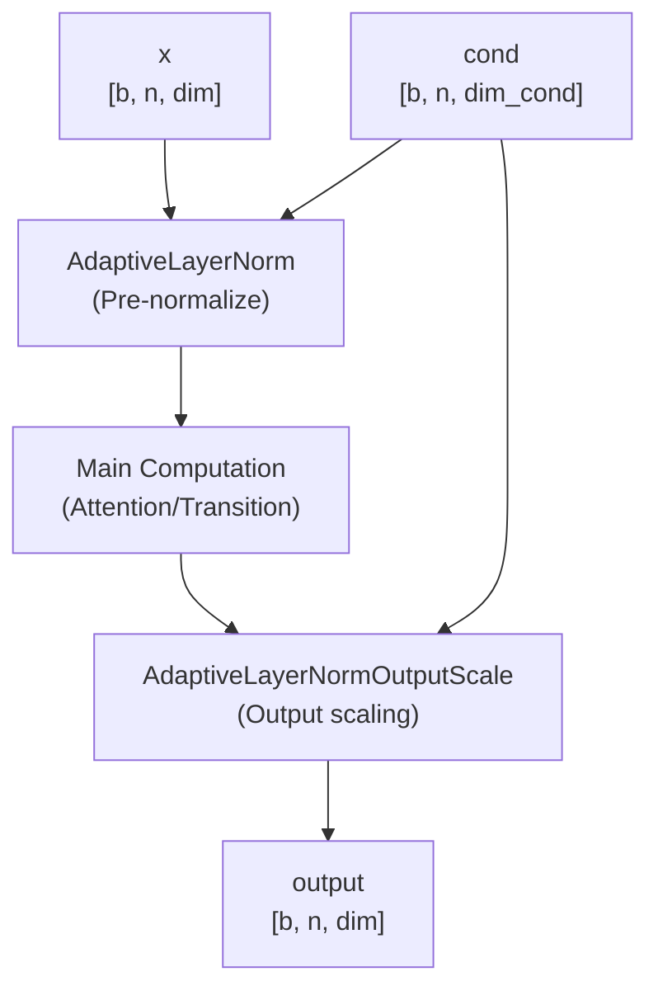
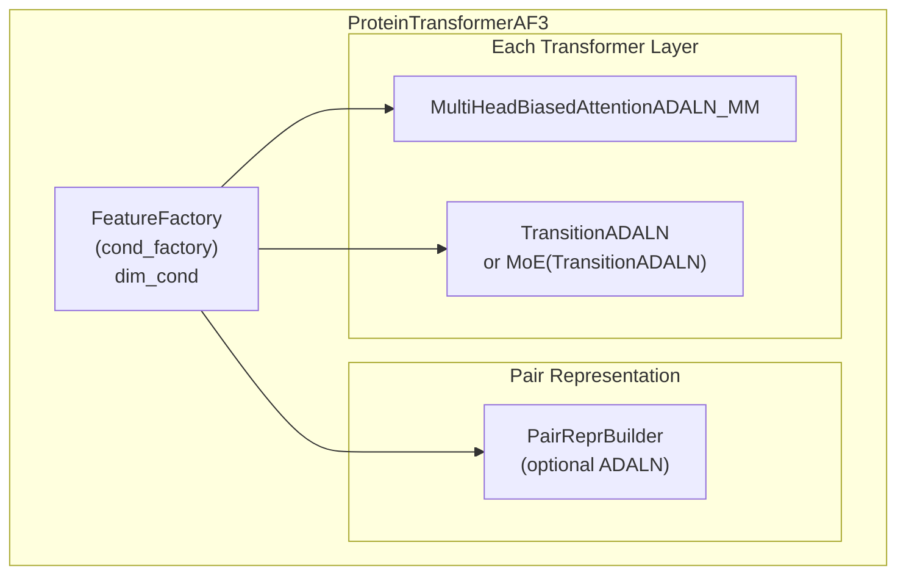
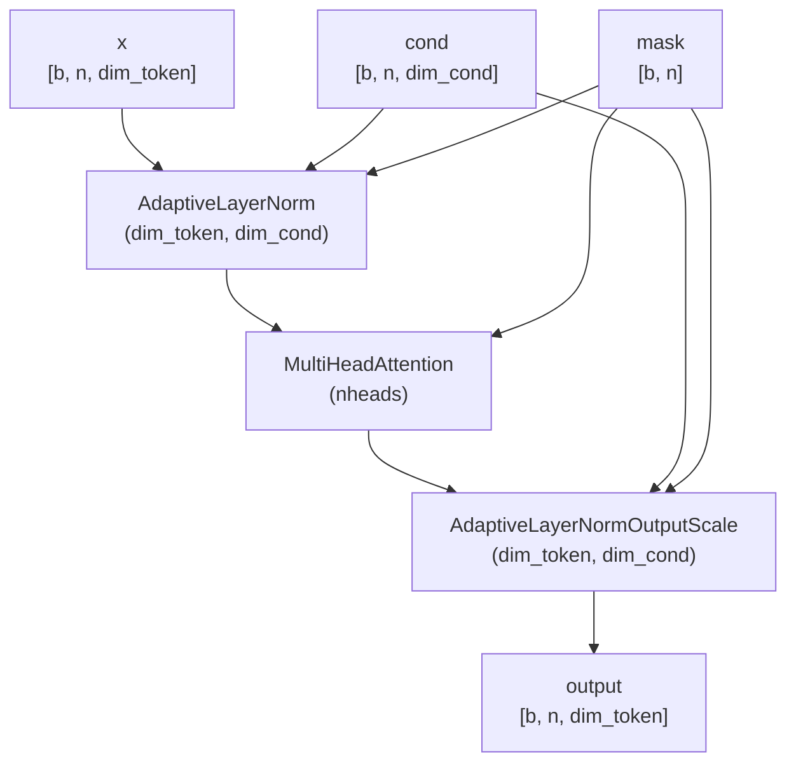
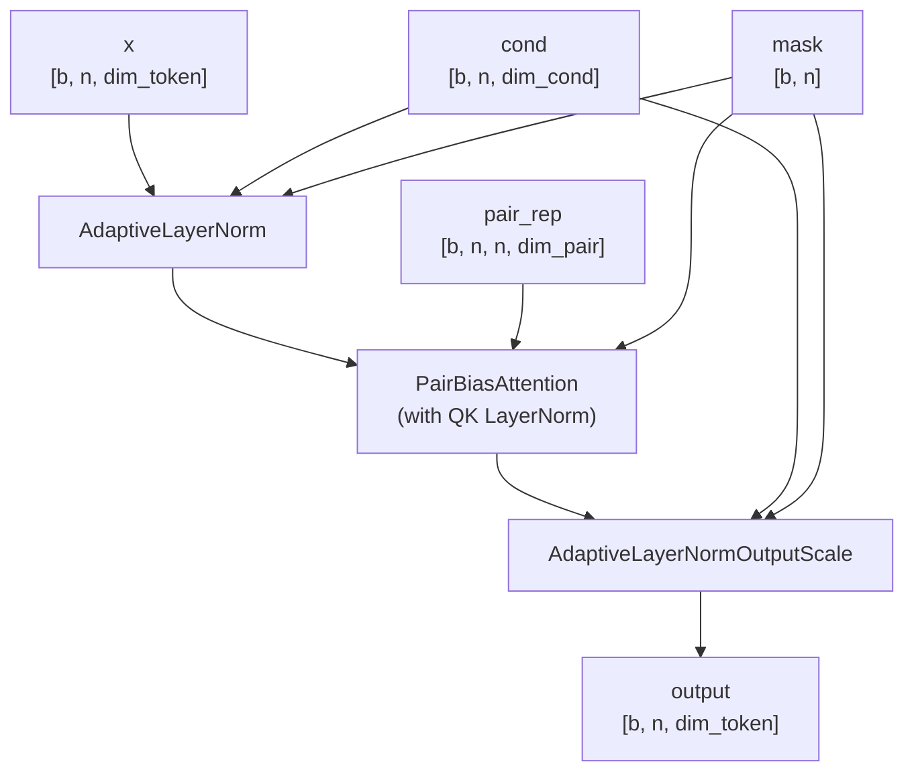
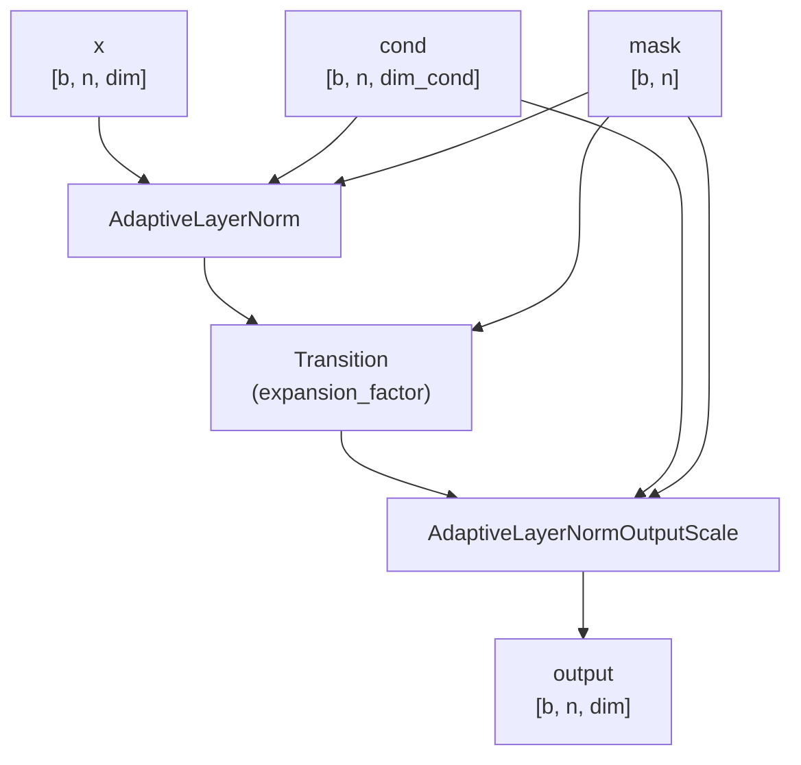
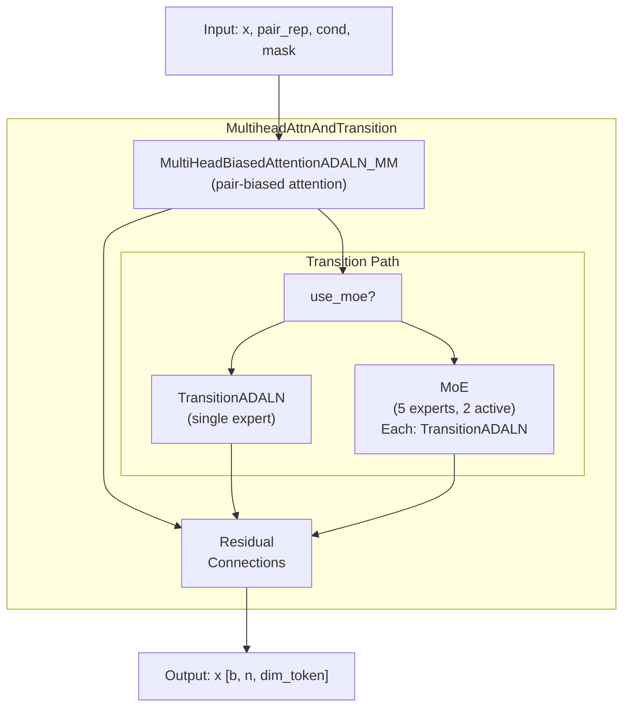
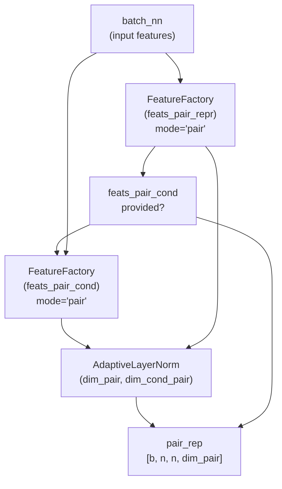
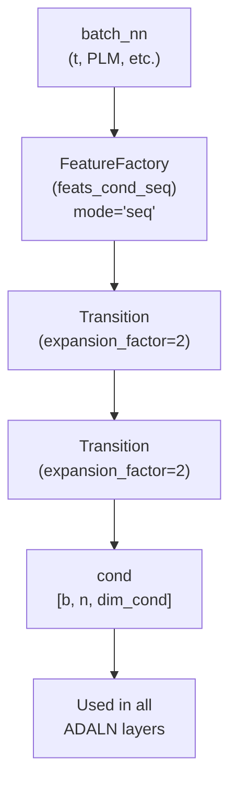
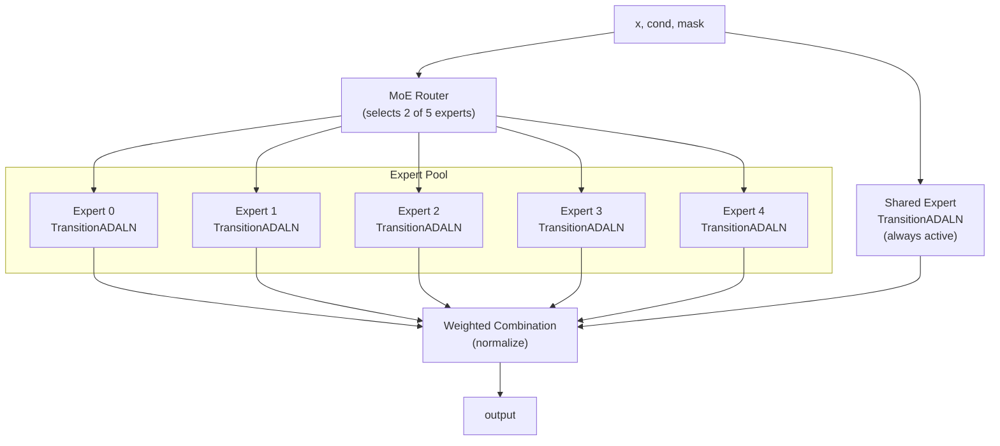
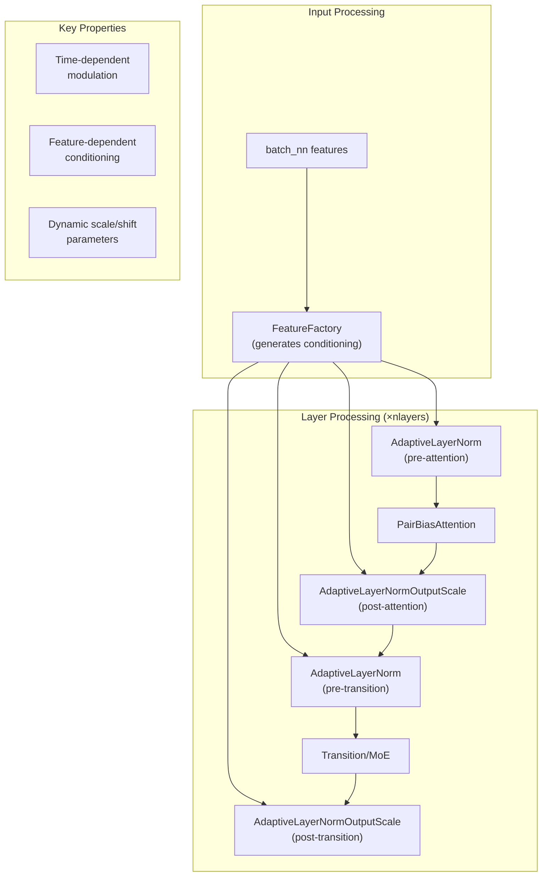

# Adaptive Layer Normalization

> **Relevant source files**
> * [src/model/components/moe_modules.py](https://github.com/Junjie-Zhu/IDPFold2/blob/5315b279/src/model/components/moe_modules.py)
> * [src/model/protein_transformer.py](https://github.com/Junjie-Zhu/IDPFold2/blob/5315b279/src/model/protein_transformer.py)

## Purpose and Scope

This document describes the Adaptive Layer Normalization (ADALN) mechanism used throughout IDPFold2's ProteinTransformerAF3 architecture. ADALN enables time-dependent and feature-dependent conditioning of the transformer layers during flow matching training and sampling. This conditioning mechanism is critical for the generative model to adapt its behavior based on the current timestep and other conditioning variables.

For the overall model architecture, see [ProteinTransformerAF3](/Junjie-Zhu/IDPFold2/5.1-proteintransformeraf3). For information about how conditioning variables are created, see [Feature Factories](/Junjie-Zhu/IDPFold2/5.4-feature-factories).

---

## Adaptive Layer Normalization Concept

Adaptive Layer Normalization modulates the layer normalization parameters using external conditioning variables. Unlike standard layer normalization which has fixed scale and shift parameters, ADALN computes these parameters dynamically based on conditioning inputs such as the flow matching timestep `t` and other features.

The key innovation is that ADALN provides a mechanism for the model to adjust its internal representations based on where it is in the generative process (early denoising vs. final refinement) and other contextual information.

### ADALN Architecture Pattern

Throughout the model, ADALN is applied in a consistent pattern:

1. **AdaptiveLayerNorm** is applied to the input before the main computation
2. The main computation is performed (attention, transition, etc.)
3. **AdaptiveLayerNormOutputScale** is applied to scale the output

This "sandwich" pattern allows both pre-normalization with adaptive parameters and adaptive output scaling.

**ADALN Pattern Flow**

**Sources:** [src/model/protein_transformer.py L67-L94](https://github.com/Junjie-Zhu/IDPFold2/blob/5315b279/src/model/protein_transformer.py#L67-L94)

 [src/model/protein_transformer.py L97-L133](https://github.com/Junjie-Zhu/IDPFold2/blob/5315b279/src/model/protein_transformer.py#L97-L133)

 [src/model/protein_transformer.py L136-L161](https://github.com/Junjie-Zhu/IDPFold2/blob/5315b279/src/model/protein_transformer.py#L136-L161)

---

## ADALN Components

IDPFold2 uses two main ADALN components imported from `af3_modules`:

### AdaptiveLayerNorm

Applied before the main computation to normalize inputs with adaptive parameters.

| Property | Description |
| --- | --- |
| **Input** | `x`: tensor [b, n, dim]`cond`: conditioning [b, n, dim_cond]`mask`: binary mask [b, n] |
| **Output** | Normalized tensor [b, n, dim] |
| **Purpose** | Normalize inputs with scale/shift computed from conditioning |
| **Location** | `src.model.components.af3_modules.AdaptiveLayerNorm` |

### AdaptiveLayerNormOutputScale

Applied after the main computation to adaptively scale outputs.

| Property | Description |
| --- | --- |
| **Input** | `x`: tensor [b, n, dim]`cond`: conditioning [b, n, dim_cond]`mask`: binary mask [b, n] |
| **Output** | Scaled tensor [b, n, dim] |
| **Purpose** | Apply adaptive scaling to outputs based on conditioning |
| **Location** | `src.model.components.af3_modules.AdaptiveLayerNormOutputScale` |

**Sources:** [src/model/protein_transformer.py L19-L23](https://github.com/Junjie-Zhu/IDPFold2/blob/5315b279/src/model/protein_transformer.py#L19-L23)

---

## ADALN Integration in Model Components

ADALN is integrated into three main component types in the ProteinTransformerAF3 architecture:

### Component Integration Overview

**Sources:** [src/model/protein_transformer.py L316-L537](https://github.com/Junjie-Zhu/IDPFold2/blob/5315b279/src/model/protein_transformer.py#L316-L537)

---

## ADALN Wrapper Classes

IDPFold2 defines several wrapper classes that integrate ADALN into specific model components:

### MultiHeadAttentionADALN

Wraps standard multi-head attention with ADALN conditioning.

**Key attributes:**

* `dim_token`: Token dimension (typically 768)
* `dim_cond`: Conditioning dimension (computed by FeatureFactory)
* `nheads`: Number of attention heads (typically 12)
* `dropout`: Dropout rate for attention

**Sources:** [src/model/protein_transformer.py L67-L94](https://github.com/Junjie-Zhu/IDPFold2/blob/5315b279/src/model/protein_transformer.py#L67-L94)

### MultiHeadBiasedAttentionADALN_MM

Wraps pair-biased attention (used in AlphaFold3) with ADALN conditioning.

**Key attributes:**

* `dim_pair`: Pair representation dimension
* `use_qkln`: Whether to use layer normalization on queries and keys

This class is used in the main transformer layers when `use_attn_pair_bias=True`.

**Sources:** [src/model/protein_transformer.py L97-L133](https://github.com/Junjie-Zhu/IDPFold2/blob/5315b279/src/model/protein_transformer.py#L97-L133)

### TransitionADALN

Wraps the transition (feedforward) layer with ADALN conditioning.

**Key attributes:**

* `expansion_factor`: Expansion factor for the transition MLP (typically 2 or 4)
* The `Transition` layer is a standard MLP with GELU activation

**Usage:** Used directly in transformer layers or wrapped by MoE for expert-based computation.

**Sources:** [src/model/protein_transformer.py L136-L161](https://github.com/Junjie-Zhu/IDPFold2/blob/5315b279/src/model/protein_transformer.py#L136-L161)

---

## ADALN in Transformer Layers

The `MultiheadAttnAndTransition` class combines both attention and transition with ADALN:

### Transformer Layer Structure

**Configuration parameters:**

* `dim_token`: Token dimension
* `dim_cond`: Conditioning dimension
* `residual_mha`: Whether to add residual in attention
* `residual_transition`: Whether to add residual in transition
* `parallel_mha_transition`: Whether to run attention and transition in parallel

**Sources:** [src/model/protein_transformer.py L164-L272](https://github.com/Junjie-Zhu/IDPFold2/blob/5315b279/src/model/protein_transformer.py#L164-L272)

---

## ADALN for Pair Representations

ADALN is also optionally applied to pair representations in the `PairReprBuilder`:

### Pair Representation Conditioning

This allows the pair representation to be conditioned based on pair-wise features (e.g., relative positions, time).

**Sources:** [src/model/protein_transformer.py L275-L313](https://github.com/Junjie-Zhu/IDPFold2/blob/5315b279/src/model/protein_transformer.py#L275-L313)

---

## Conditioning Variables Source

The conditioning variables fed into ADALN components are generated by the `FeatureFactory` with `feats_cond_seq` configuration:

### Conditioning Pipeline

**Common conditioning features:**

* **Timestep embedding**: Flow matching timestep `t` embedded as sinusoidal features
* **PLM embeddings**: Projected ESM2 embeddings (optional)
* **Sequence features**: One-hot encoded amino acid types
* **Structural features**: Chain breaks, residue indices

The conditioning is computed once at the start of the forward pass and reused across all transformer layers.

**Sources:** [src/model/protein_transformer.py L368-L377](https://github.com/Junjie-Zhu/IDPFold2/blob/5315b279/src/model/protein_transformer.py#L368-L377)

 [src/model/protein_transformer.py L506-L508](https://github.com/Junjie-Zhu/IDPFold2/blob/5315b279/src/model/protein_transformer.py#L506-L508)

---

## ADALN Forward Pass Example

Here's the complete flow through a single transformer layer with ADALN:

### Complete Transformer Layer Flow

| Step | Component | Input | Output | Purpose |
| --- | --- | --- | --- | --- |
| 1 | Prepare conditioning | `batch_nn` | `cond [b, n, dim_cond]` | Generate conditioning variables |
| 2 | AdaptiveLayerNorm | `x [b, n, dim]``cond [b, n, dim_cond]` | `x_norm [b, n, dim]` | Normalize with adaptive params |
| 3 | PairBiasAttention | `x_norm [b, n, dim]``pair_rep [b, n, n, dim_pair]` | `x_attn [b, n, dim]` | Compute attention |
| 4 | AdaptiveLayerNormOutputScale | `x_attn [b, n, dim]``cond [b, n, dim_cond]` | `x_scaled [b, n, dim]` | Scale output adaptively |
| 5 | Residual connection | `x [b, n, dim]``x_scaled [b, n, dim]` | `x [b, n, dim]` | Add residual (optional) |
| 6 | AdaptiveLayerNorm | `x [b, n, dim]``cond [b, n, dim_cond]` | `x_norm [b, n, dim]` | Normalize for transition |
| 7 | Transition or MoE | `x_norm [b, n, dim]` | `x_tr [b, n, dim]` | Feedforward computation |
| 8 | AdaptiveLayerNormOutputScale | `x_tr [b, n, dim]``cond [b, n, dim_cond]` | `x_scaled [b, n, dim]` | Scale transition output |
| 9 | Residual connection | `x [b, n, dim]``x_scaled [b, n, dim]` | `x [b, n, dim]` | Add residual (optional) |

**Sources:** [src/model/protein_transformer.py L241-L272](https://github.com/Junjie-Zhu/IDPFold2/blob/5315b279/src/model/protein_transformer.py#L241-L272)

---

## ADALN in MoE Context

When using Mixture of Experts (MoE), each expert is a `TransitionADALN` instance. The ADALN conditioning is applied within each expert:

### MoE with ADALN Experts

**Key points:**

* Each expert is a complete `TransitionADALN` with its own parameters
* All experts receive the same conditioning variables `cond`
* The router selection can optionally be conditioned using `dim_moe_cond`
* The shared expert always receives the input and contributes to the output

**Sources:** [src/model/protein_transformer.py L221-L239](https://github.com/Junjie-Zhu/IDPFold2/blob/5315b279/src/model/protein_transformer.py#L221-L239)

 [src/model/components/moe_modules.py L48-L107](https://github.com/Junjie-Zhu/IDPFold2/blob/5315b279/src/model/components/moe_modules.py#L48-L107)

---

## Configuration Parameters

ADALN behavior is controlled by several configuration parameters in `train.yaml`:

| Parameter | Type | Default | Description |
| --- | --- | --- | --- |
| `dim_cond` | int | - | Dimension of conditioning variables |
| `feats_cond_seq` | list | `["fourier_time", ...]` | Features used for sequence conditioning |
| `feats_pair_cond` | list | `[]` | Features used for pair conditioning (optional) |
| `residual_mha` | bool | `True` | Use residual connection in attention |
| `residual_transition` | bool | `True` | Use residual connection in transition |
| `parallel_mha_transition` | bool | `False` | Run attention and transition in parallel |

**Sources:** [src/model/protein_transformer.py L333-L413](https://github.com/Junjie-Zhu/IDPFold2/blob/5315b279/src/model/protein_transformer.py#L333-L413)

---

## Summary

**Adaptive Layer Normalization Architecture:**

ADALN provides the critical mechanism for time-dependent and context-dependent conditioning throughout ProteinTransformerAF3, enabling the model to adapt its behavior during the flow matching generative process.

**Sources:** [src/model/protein_transformer.py L1-L537](https://github.com/Junjie-Zhu/IDPFold2/blob/5315b279/src/model/protein_transformer.py#L1-L537)

 [src/model/components/moe_modules.py L48-L236](https://github.com/Junjie-Zhu/IDPFold2/blob/5315b279/src/model/components/moe_modules.py#L48-L236)