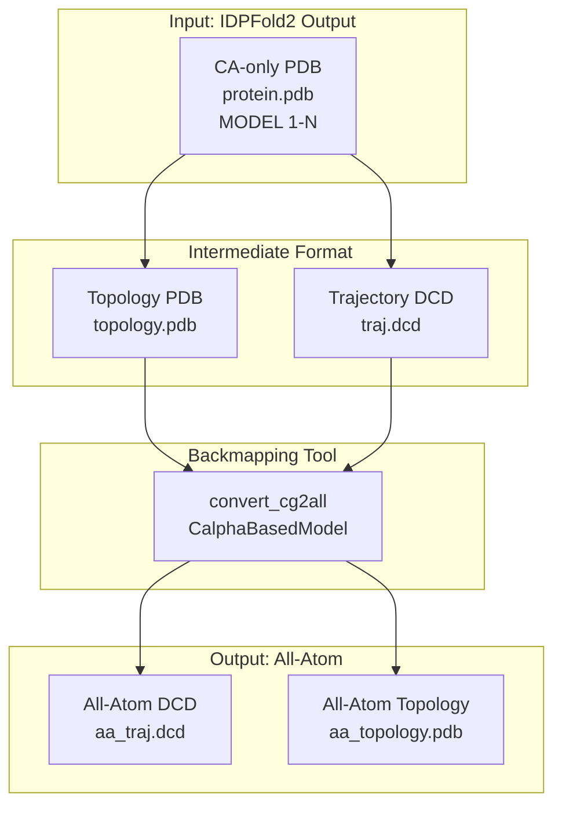
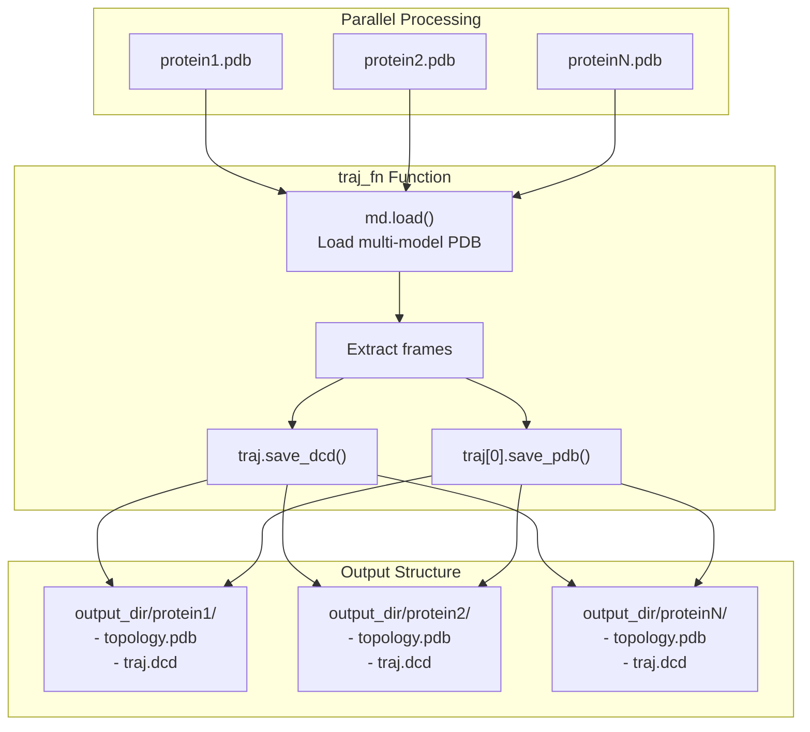
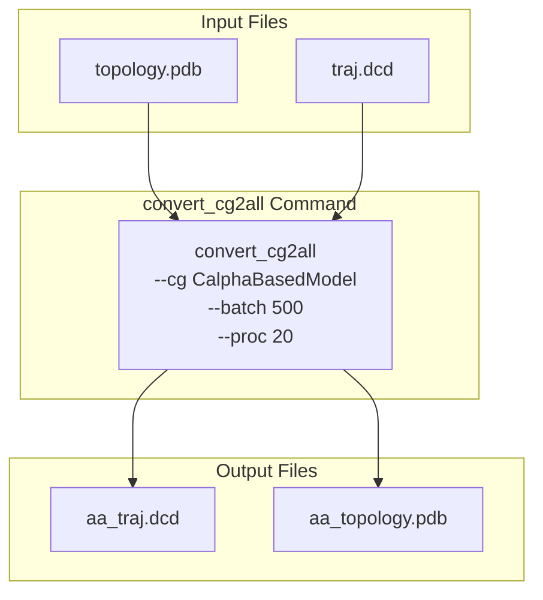
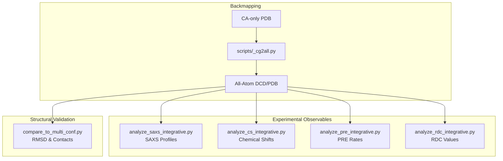

# Backmapping to All-Atom

> **Relevant source files**
> * [README.md](https://github.com/Junjie-Zhu/IDPFold2/blob/5315b279/README.md?plain=1)
> * [benchmarks/analyze_cs_integrative.py](https://github.com/Junjie-Zhu/IDPFold2/blob/5315b279/benchmarks/analyze_cs_integrative.py)
> * [benchmarks/analyze_pre_integrative.py](https://github.com/Junjie-Zhu/IDPFold2/blob/5315b279/benchmarks/analyze_pre_integrative.py)
> * [benchmarks/analyze_rdc_integrative.py](https://github.com/Junjie-Zhu/IDPFold2/blob/5315b279/benchmarks/analyze_rdc_integrative.py)
> * [benchmarks/analyze_saxs_integrative.py](https://github.com/Junjie-Zhu/IDPFold2/blob/5315b279/benchmarks/analyze_saxs_integrative.py)
> * [benchmarks/compare_to_multi_conf.py](https://github.com/Junjie-Zhu/IDPFold2/blob/5315b279/benchmarks/compare_to_multi_conf.py)
> * [scripts/_cg2all.py](https://github.com/Junjie-Zhu/IDPFold2/blob/5315b279/scripts/_cg2all.py)
> * [scripts/process_training_trajs.py](https://github.com/Junjie-Zhu/IDPFold2/blob/5315b279/scripts/process_training_trajs.py)
> * [scripts/quick_analysis.py](https://github.com/Junjie-Zhu/IDPFold2/blob/5315b279/scripts/quick_analysis.py)

## Purpose and Scope

This document describes the process of converting coarse-grained (Cα-only) protein structures generated by IDPFold2 into all-atom representations using the `cg2all` tool. Backmapping is an essential step before performing detailed structural analysis, calculating experimental observables (SAXS, chemical shifts, PRE, RDC), or comparing against all-atom reference structures.

For quick structural metrics that only require Cα coordinates (radius of gyration, end-to-end distance), see [Quick Structural Analysis](/Junjie-Zhu/IDPFold2/8.1-quick-structural-analysis). For detailed structural validation metrics that require backmapped structures, see [Structural Validation](/Junjie-Zhu/IDPFold2/8.3-structural-validation) and [Experimental Data Reweighting](/Junjie-Zhu/IDPFold2/8.4-experimental-data-reweighting).

**Sources:** [README.md L218-L229](https://github.com/Junjie-Zhu/IDPFold2/blob/5315b279/README.md?plain=1#L218-L229)

 [scripts/_cg2all.py L1-L70](https://github.com/Junjie-Zhu/IDPFold2/blob/5315b279/scripts/_cg2all.py#L1-L70)

## Overview of the Backmapping Process

IDPFold2 generates protein conformational ensembles represented as Cα-only (coarse-grained) structures. While this representation is sufficient for some analyses, many experimental observables and detailed structural comparisons require all-atom coordinates. The backmapping process reconstructs complete atomic coordinates from the coarse-grained representation.



**Sources:** [scripts/_cg2all.py L32-L66](https://github.com/Junjie-Zhu/IDPFold2/blob/5315b279/scripts/_cg2all.py#L32-L66)

 [README.md L218-L229](https://github.com/Junjie-Zhu/IDPFold2/blob/5315b279/README.md?plain=1#L218-L229)

## The cg2all Tool

The `cg2all` package is an external tool that reconstructs all-atom structures from coarse-grained representations. It must be installed separately from IDPFold2.

### Installation

```markdown
# Install cg2allpip install cg2all # Verify installationconvert_cg2all --help
```

### Supported Models

IDPFold2 uses the `CalphaBasedModel` from cg2all, which reconstructs all heavy atoms and hydrogens from Cα coordinates. This model is appropriate for protein backbones and standard amino acid side chains.

**Sources:** [README.md L220-L221](https://github.com/Junjie-Zhu/IDPFold2/blob/5315b279/README.md?plain=1#L220-L221)

 [scripts/_cg2all.py L18-L19](https://github.com/Junjie-Zhu/IDPFold2/blob/5315b279/scripts/_cg2all.py#L18-L19)

## Workflow Implementation

The backmapping workflow is implemented in [scripts/_cg2all.py](https://github.com/Junjie-Zhu/IDPFold2/blob/5315b279/scripts/_cg2all.py)

 and consists of two main stages: format conversion and all-atom reconstruction.

### Command-Line Interface

```
python scripts/_cg2all.py \    -i /path/to/generated/ensemble \    -o /path/to/output/structures \    -m CalphaBasedModel \    --num_proc 20 \    --batch_size 500
```

**Key Arguments:**

| Argument | Type | Description |
| --- | --- | --- |
| `--input_dir` / `-i` | str | Directory containing input PDB files (required) |
| `--output_dir` / `-o` | str | Directory for output structures (required) |
| `--model` / `-m` | str | Coarse-graining model (default: `CalphaBasedModel`) |
| `--num_proc` | int | Number of processes for parallel execution (default: 20) |
| `--batch_size` | int | Number of frames processed per batch (default: 500) |

**Sources:** [scripts/_cg2all.py L15-L27](https://github.com/Junjie-Zhu/IDPFold2/blob/5315b279/scripts/_cg2all.py#L15-L27)

### Stage 1: Format Conversion

The first stage converts multi-model PDB files into trajectory format required by cg2all:



**Implementation Details:**

The `traj_fn` function [scripts/_cg2all.py L44-L51](https://github.com/Junjie-Zhu/IDPFold2/blob/5315b279/scripts/_cg2all.py#L44-L51)

 handles format conversion:

1. Loads the multi-model PDB file using `mdtraj`
2. Creates a directory for each protein system
3. Saves the trajectory as DCD format (`traj.dcd`)
4. Extracts the first frame as topology PDB (`topology.pdb`)

This process is parallelized using `multiprocessing.Pool` to handle multiple protein systems simultaneously [scripts/_cg2all.py L56-L62](https://github.com/Junjie-Zhu/IDPFold2/blob/5315b279/scripts/_cg2all.py#L56-L62)

**Sources:** [scripts/_cg2all.py L44-L62](https://github.com/Junjie-Zhu/IDPFold2/blob/5315b279/scripts/_cg2all.py#L44-L62)

### Stage 2: All-Atom Reconstruction

The second stage invokes `cg2all` for each protein system:



**Command Structure:**

The `process_fn` function [scripts/_cg2all.py L32-L41](https://github.com/Junjie-Zhu/IDPFold2/blob/5315b279/scripts/_cg2all.py#L32-L41)

 constructs and executes the `convert_cg2all` command:

```
convert_cg2all 
    -p output_dir/{system}/topology.pdb 
    -d output_dir/{system}/traj.dcd 
    -o output_dir/{system}/aa_traj.dcd 
    -opdb output_dir/{system}/aa_topology.pdb 
    --cg CalphaBasedModel 
    --batch {batch_size} 
    --proc {num_proc}
```

**Sources:** [scripts/_cg2all.py L32-L66](https://github.com/Junjie-Zhu/IDPFold2/blob/5315b279/scripts/_cg2all.py#L32-L66)

## Output Files and Format

After successful backmapping, each protein system has the following directory structure:

```markdown
output_dir/
├── protein1/
│   ├── topology.pdb       # Original CA-only topology
│   ├── traj.dcd           # Original CA-only trajectory
│   ├── aa_topology.pdb    # All-atom topology (single frame)
│   └── aa_traj.dcd        # All-atom trajectory (all frames)
├── protein2/
│   ├── topology.pdb
│   ├── traj.dcd
│   ├── aa_topology.pdb
│   └── aa_traj.dcd
└── ...
```

### File Descriptions

| File | Format | Content |
| --- | --- | --- |
| `topology.pdb` | PDB | Single-frame Cα-only structure (reference topology) |
| `traj.dcd` | DCD Binary | Multi-frame Cα-only trajectory |
| `aa_topology.pdb` | PDB | Single-frame all-atom structure with complete residues |
| `aa_traj.dcd` | DCD Binary | Multi-frame all-atom trajectory with complete residues |

The all-atom structures contain all heavy atoms and hydrogens for standard amino acids, reconstructed according to the `CalphaBasedModel` energy function.

**Sources:** [scripts/_cg2all.py L32-L51](https://github.com/Junjie-Zhu/IDPFold2/blob/5315b279/scripts/_cg2all.py#L32-L51)

## Performance Considerations

### Computational Resources

Backmapping is computationally intensive, especially for large ensembles. The process can be tuned using two main parameters:

**Environment Variables:**

```javascript
export OMP_NUM_THREADS=2
```

Controls the number of OpenMP threads used by cg2all's internal optimization routines.

**Script Parameters:**

```
python scripts/_cg2all.py \    --num_proc 20 \    --batch_size 500
```

| Parameter | Effect | Recommendation |
| --- | --- | --- |
| `OMP_NUM_THREADS` | Threads per cg2all process | Set to 2-4 to avoid oversubscription |
| `--num_proc` | Parallel protein systems | Set to available CPU cores / OMP_NUM_THREADS |
| `--batch_size` | Frames per cg2all invocation | 500 works well for most systems |

**Example Configuration:**

For a 40-core machine:

* `OMP_NUM_THREADS=2`
* `--num_proc=20` (40 cores / 2 threads per process)
* `--batch_size=500`

This configuration processes 20 protein systems in parallel, with each cg2all process using 2 threads and processing 500 frames at a time.

**Sources:** [README.md L229](https://github.com/Junjie-Zhu/IDPFold2/blob/5315b279/README.md?plain=1#L229-L229)

 [scripts/_cg2all.py L19-L20](https://github.com/Junjie-Zhu/IDPFold2/blob/5315b279/scripts/_cg2all.py#L19-L20)

## Integration with Evaluation Pipeline

Backmapped structures are required for several downstream evaluation tasks:



### Structural Validation

The `compare_to_multi_conf.py` script [benchmarks/compare_to_multi_conf.py](https://github.com/Junjie-Zhu/IDPFold2/blob/5315b279/benchmarks/compare_to_multi_conf.py)

 requires all-atom structures for:

* Accurate RMSD calculations after sequence alignment
* Native contact fraction analysis with 8 Å distance threshold

### Experimental Data Reweighting

All experimental observable calculations require all-atom coordinates:

1. **SAXS Analysis** [benchmarks/analyze_saxs_integrative.py](https://github.com/Junjie-Zhu/IDPFold2/blob/5315b279/benchmarks/analyze_saxs_integrative.py) : Calculates small-angle X-ray scattering profiles from all-atom structures
2. **Chemical Shift Analysis** [benchmarks/analyze_cs_integrative.py](https://github.com/Junjie-Zhu/IDPFold2/blob/5315b279/benchmarks/analyze_cs_integrative.py) : Predicts NMR chemical shifts using tools like UCBshift
3. **PRE Analysis** [benchmarks/analyze_pre_integrative.py](https://github.com/Junjie-Zhu/IDPFold2/blob/5315b279/benchmarks/analyze_pre_integrative.py) : Calculates paramagnetic relaxation enhancement rates from spin-label distances
4. **RDC Analysis** [benchmarks/analyze_rdc_integrative.py](https://github.com/Junjie-Zhu/IDPFold2/blob/5315b279/benchmarks/analyze_rdc_integrative.py) : Computes residual dipolar couplings from backbone orientations

All these analyses expect DCD trajectory format with all-atom coordinates, which is the standard output of the backmapping process.

**Sources:** [benchmarks/compare_to_multi_conf.py L1-L352](https://github.com/Junjie-Zhu/IDPFold2/blob/5315b279/benchmarks/compare_to_multi_conf.py#L1-L352)

 [benchmarks/analyze_saxs_integrative.py L1-L285](https://github.com/Junjie-Zhu/IDPFold2/blob/5315b279/benchmarks/analyze_saxs_integrative.py#L1-L285)

 [benchmarks/analyze_cs_integrative.py L1-L245](https://github.com/Junjie-Zhu/IDPFold2/blob/5315b279/benchmarks/analyze_cs_integrative.py#L1-L245)

 [benchmarks/analyze_pre_integrative.py L1-L235](https://github.com/Junjie-Zhu/IDPFold2/blob/5315b279/benchmarks/analyze_pre_integrative.py#L1-L235)

 [benchmarks/analyze_rdc_integrative.py L1-L175](https://github.com/Junjie-Zhu/IDPFold2/blob/5315b279/benchmarks/analyze_rdc_integrative.py#L1-L175)

## Common Issues and Troubleshooting

### Installation Issues

**Problem:** `convert_cg2all` command not found

**Solution:** Ensure cg2all is properly installed:

```
pip install cg2allwhich convert_cg2all
```

**Problem:** Undefined symbol errors during installation

**Solution:** Refer to [MegaBlocks Issue #159](https://github.com/Junjie-Zhu/IDPFold2/blob/5315b279/MegaBlocks Issue #159)

 for compilation fixes, as cg2all may have similar dependencies.

**Sources:** [README.md L56-L58](https://github.com/Junjie-Zhu/IDPFold2/blob/5315b279/README.md?plain=1#L56-L58)

### Performance Issues

**Problem:** Very slow backmapping or system hanging

**Solution:** Adjust parallelization parameters:

1. Reduce `OMP_NUM_THREADS` to 1-2
2. Reduce `--num_proc` to avoid memory exhaustion
3. Reduce `--batch_size` if individual processes are memory-bound

**Problem:** Out of memory errors

**Solution:**

1. Decrease `--batch_size` (try 100-200 instead of 500)
2. Decrease `--num_proc` to reduce concurrent memory usage
3. Process systems in smaller batches

### File Format Issues

**Problem:** Empty or corrupted DCD files

**Solution:** Check that input PDB files are valid multi-model format:

```javascript
import mdtraj as mdtraj = md.load('protein.pdb')print(f"Loaded {traj.n_frames} frames, {traj.n_atoms} atoms")
```

**Problem:** Missing residues in all-atom output

**Solution:** Ensure input structures contain only standard amino acids. Non-standard residues may not be supported by `CalphaBasedModel`.

**Sources:** [scripts/_cg2all.py L44-L51](https://github.com/Junjie-Zhu/IDPFold2/blob/5315b279/scripts/_cg2all.py#L44-L51)

### Workflow Integration

**Problem:** Evaluation scripts cannot find backmapped structures

**Solution:** Ensure consistent naming conventions:

* Input: `{system_name}.pdb`
* Output directory: `output_dir/{system_name}/`
* All-atom trajectory: `output_dir/{system_name}/aa_traj.dcd`

The evaluation scripts expect this exact directory structure when loading backmapped ensembles.

**Sources:** [scripts/_cg2all.py L32-L51](https://github.com/Junjie-Zhu/IDPFold2/blob/5315b279/scripts/_cg2all.py#L32-L51)

 [benchmarks/analyze_saxs_integrative.py L181-L198](https://github.com/Junjie-Zhu/IDPFold2/blob/5315b279/benchmarks/analyze_saxs_integrative.py#L181-L198)