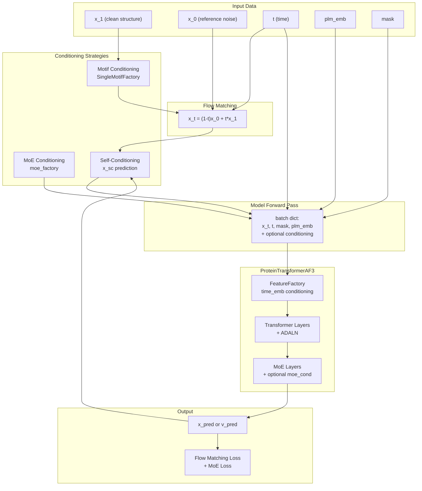
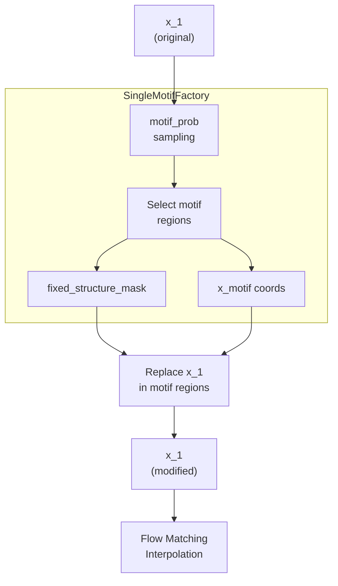
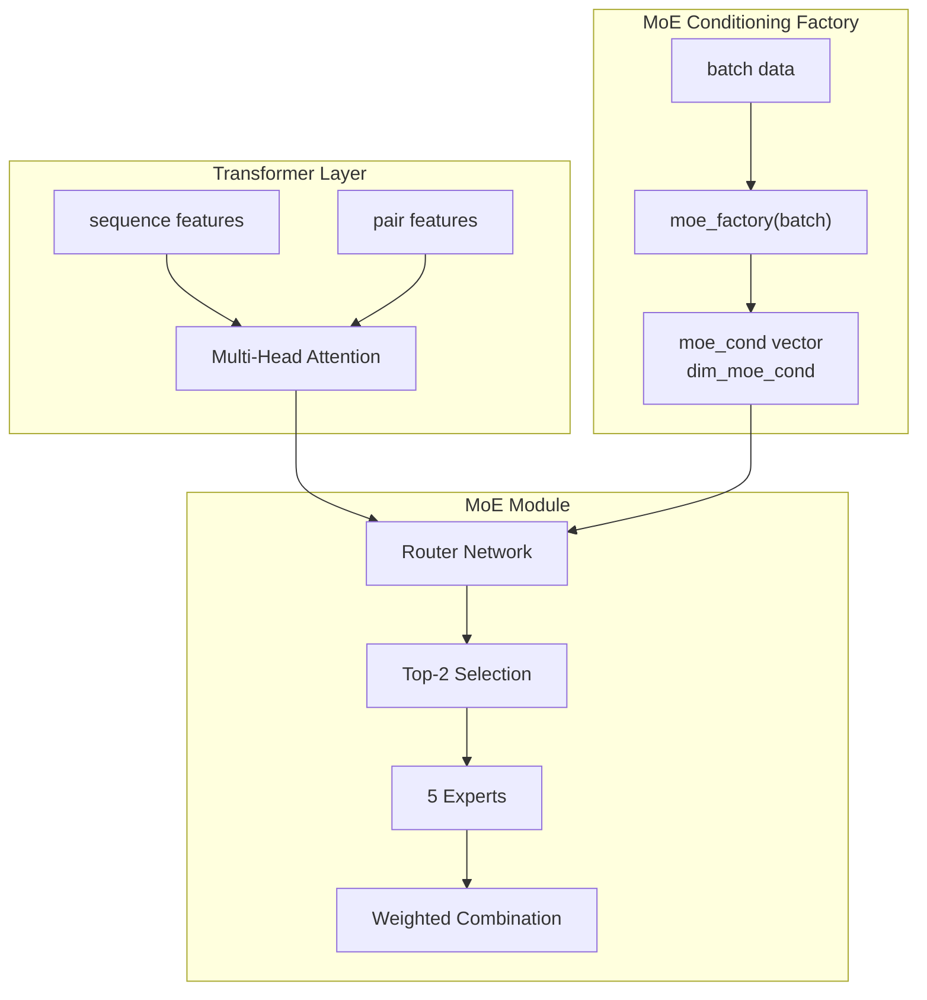
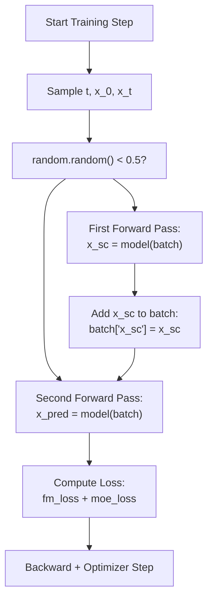
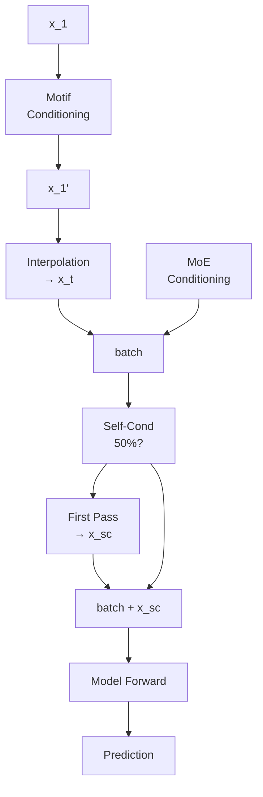

# Conditioning Strategies

> **Relevant source files**
> * [configs/train.yaml](https://github.com/Junjie-Zhu/IDPFold2/blob/5315b279/configs/train.yaml)
> * [src/model/components/feature_factory.py](https://github.com/Junjie-Zhu/IDPFold2/blob/5315b279/src/model/components/feature_factory.py)
> * [src/model/integral.py](https://github.com/Junjie-Zhu/IDPFold2/blob/5315b279/src/model/integral.py)
> * [src/train.py](https://github.com/Junjie-Zhu/IDPFold2/blob/5315b279/src/train.py)

This page documents the three conditioning strategies available in IDPFold2: **motif conditioning**, **MoE conditioning**, and **self-conditioning**. These strategies control how additional information is provided to the model during training and inference, enabling constrained generation, improved expert routing, and iterative refinement capabilities.

For information about the training pipeline that uses these strategies, see [Training Pipeline](/Junjie-Zhu/IDPFold2/6.1-training-pipeline). For details on the model architecture components that implement conditioning, see [Adaptive Layer Normalization](/Junjie-Zhu/IDPFold2/5.5-adaptive-layer-normalization) and [Mixture of Experts](/Junjie-Zhu/IDPFold2/5.2-mixture-of-experts).

---

## Overview

IDPFold2 supports three conditioning strategies that can be independently enabled or disabled:

| Strategy | Purpose | Training Flag | Default |
| --- | --- | --- | --- |
| **Motif Conditioning** | Constrain specific structural regions | `motif_conditioning` | `False` |
| **MoE Conditioning** | Provide additional context to expert routing | `moe_conditioning` | `False` |
| **Self-Conditioning** | Enable iterative refinement via autoregressive feedback | `self_conditioning` | `False` |

Each strategy modifies the model's input or conditioning vectors during the forward pass, allowing the model to learn different types of structured generation behaviors.

**Sources:** [configs/train.yaml L11-L13](https://github.com/Junjie-Zhu/IDPFold2/blob/5315b279/configs/train.yaml#L11-L13)

 [src/train.py L214-L216](https://github.com/Junjie-Zhu/IDPFold2/blob/5315b279/src/train.py#L214-L216)

 [src/model/integral.py L246-L248](https://github.com/Junjie-Zhu/IDPFold2/blob/5315b279/src/model/integral.py#L246-L248)

---

## Conditioning Architecture



**Diagram: Conditioning Strategy Integration in Training Flow**

This diagram shows how the three conditioning strategies integrate into the training pipeline. Motif conditioning modifies the clean structure before interpolation, MoE conditioning adds extra context to the batch, and self-conditioning uses the model's own predictions as input for subsequent passes.

**Sources:** [src/model/integral.py L238-L321](https://github.com/Junjie-Zhu/IDPFold2/blob/5315b279/src/model/integral.py#L238-L321)

 [src/train.py L258-L270](https://github.com/Junjie-Zhu/IDPFold2/blob/5315b279/src/train.py#L258-L270)

---

## Motif Conditioning

Motif conditioning allows the model to generate structures that conform to predefined structural constraints. This is useful for scenarios where certain regions of the protein structure are known or must match a specific template.

### Implementation

During training with motif conditioning enabled, the `SingleMotifFactory` modifies the clean structure `x_1` by replacing certain residues with fixed coordinates:



**Diagram: Motif Conditioning Workflow**

**Sources:** [src/model/integral.py L270-L272](https://github.com/Junjie-Zhu/IDPFold2/blob/5315b279/src/model/integral.py#L270-L272)

 [src/train.py L128](https://github.com/Junjie-Zhu/IDPFold2/blob/5315b279/src/train.py#L128-L128)

### Configuration

| Parameter | Type | Description | Location |
| --- | --- | --- | --- |
| `motif_conditioning` | `bool` | Enable/disable motif conditioning | [configs/train.yaml L11](https://github.com/Junjie-Zhu/IDPFold2/blob/5315b279/configs/train.yaml#L11-L11) |
| `motif_prob` | `float` | Probability of applying motif constraints per batch | [src/train.py L128](https://github.com/Junjie-Zhu/IDPFold2/blob/5315b279/src/train.py#L128-L128) |

When `motif_conditioning=True`, the training loop creates a `SingleMotifFactory`:

```
motif_factory = SingleMotifFactory(    motif_prob=0 if not args.motif_conditioning else args.motif_prob)
```

### Training Behavior

In the `training_predict` function, motif conditioning modifies the batch before interpolation:

1. **Factory Invocation**: `batch.update(motif_factory(batch))` [src/model/integral.py L271](https://github.com/Junjie-Zhu/IDPFold2/blob/5315b279/src/model/integral.py#L271-L271)
2. **Structure Replacement**: The factory updates `x_1` in the batch with motif-constrained coordinates [src/model/integral.py L272](https://github.com/Junjie-Zhu/IDPFold2/blob/5315b279/src/model/integral.py#L272-L272)
3. **Interpolation**: Flow matching interpolates using the modified `x_1`
4. **Zero COM**: When motif conditioning is active, `zero_com=False` in `R3NFlowMatcher` to preserve absolute coordinates [src/train.py L127](https://github.com/Junjie-Zhu/IDPFold2/blob/5315b279/src/train.py#L127-L127)

### Inference Behavior

During inference with `generating_predict`, motif conditioning uses a `zeroes=True` flag to compute unconditional predictions:

```sql
if motif_conditioning:    batch.update(motif_factory(batch, zeroes=True))
```

This allows classifier-free guidance to work with motif constraints by comparing conditional (with motif) and unconditional (without motif) predictions.

**Sources:** [src/model/integral.py L54-L57](https://github.com/Junjie-Zhu/IDPFold2/blob/5315b279/src/model/integral.py#L54-L57)

 [src/train.py L127-L128](https://github.com/Junjie-Zhu/IDPFold2/blob/5315b279/src/train.py#L127-L128)

 [src/model/integral.py L270-L272](https://github.com/Junjie-Zhu/IDPFold2/blob/5315b279/src/model/integral.py#L270-L272)

---

## MoE Conditioning

MoE conditioning provides additional context vectors to the Mixture of Experts layers, allowing expert routing decisions to depend on external information beyond the standard sequence and pair features.

### Architecture Integration



**Diagram: MoE Conditioning Flow**

**Sources:** [src/model/integral.py L274-L275](https://github.com/Junjie-Zhu/IDPFold2/blob/5315b279/src/model/integral.py#L274-L275)

 [configs/train.yaml L99](https://github.com/Junjie-Zhu/IDPFold2/blob/5315b279/configs/train.yaml#L99-L99)

### Configuration

| Parameter | Type | Description | Location |
| --- | --- | --- | --- |
| `moe_conditioning` | `bool` | Enable/disable MoE conditioning | [configs/train.yaml L12](https://github.com/Junjie-Zhu/IDPFold2/blob/5315b279/configs/train.yaml#L12-L12) |
| `dim_moe_cond` | `int` | Dimension of MoE conditioning vector | [configs/train.yaml L99](https://github.com/Junjie-Zhu/IDPFold2/blob/5315b279/configs/train.yaml#L99-L99) |

The model architecture accepts `dim_moe_cond` to configure the conditioning dimension. When set to 0 (default), no MoE conditioning is applied.

### Training Behavior

During training, MoE conditioning adds extra context to the batch:

1. **Factory Invocation**: `batch.update(moe_factory(batch))` [src/model/integral.py L275](https://github.com/Junjie-Zhu/IDPFold2/blob/5315b279/src/model/integral.py#L275-L275)
2. **Router Enhancement**: The conditioning vector is passed to the MoE router network
3. **Expert Selection**: Routing decisions consider both standard features and conditioning information
4. **Load Balancing**: MoE loss still applies to ensure balanced expert usage

### Load Balancing Loss

When MoE conditioning is active, the load balancing loss ensures experts remain evenly utilized:

```
moe_loss = compute_moe_loss(
    weight=moe_loss_weight,
    num_layers=n_layers,
    num_experts=n_experts,
    top_k=top_k,
)
```

The `moe_loss_weight` parameter (default 0.3) controls the strength of this regularization [configs/train.yaml L30](https://github.com/Junjie-Zhu/IDPFold2/blob/5315b279/configs/train.yaml#L30-L30)

**Sources:** [src/model/integral.py L274-L275](https://github.com/Junjie-Zhu/IDPFold2/blob/5315b279/src/model/integral.py#L274-L275)

 [src/model/integral.py L298-L314](https://github.com/Junjie-Zhu/IDPFold2/blob/5315b279/src/model/integral.py#L298-L314)

 [configs/train.yaml L30](https://github.com/Junjie-Zhu/IDPFold2/blob/5315b279/configs/train.yaml#L30-L30)

---

## Self-Conditioning

Self-conditioning enables the model to use its own predictions as input for subsequent forward passes, implementing a form of iterative refinement during training. This technique helps the model learn to refine structures through multiple passes.

### Training Algorithm



**Diagram: Self-Conditioning Training Flow**

**Sources:** [src/model/integral.py L287-L289](https://github.com/Junjie-Zhu/IDPFold2/blob/5315b279/src/model/integral.py#L287-L289)

### Implementation Details

The self-conditioning logic in `training_predict`:

```markdown
# self-conditioningif self_conditioning and random.random() < 0.5:    x_sc = prediction_to_x_clean(        model(batch, force_moe_capacity),         batch,         target_pred=target_pred    )    batch['x_sc'] = x_sc
```

**Key points:**

1. **50% Probability**: Self-conditioning is applied randomly to 50% of training batches [src/model/integral.py L287](https://github.com/Junjie-Zhu/IDPFold2/blob/5315b279/src/model/integral.py#L287-L287)
2. **First Pass**: Model predicts structure from `x_t` without self-conditioning
3. **Conversion**: Prediction is converted to clean structure `x_sc` using `prediction_to_x_clean`
4. **Second Pass**: The same `x_t` is processed again, but now with `x_sc` as additional context
5. **Loss Computation**: Loss is only computed on the second pass (the refined prediction)

### Feature Integration

When `x_sc` is present in the batch, the `FeatureFactory` must be configured to use it. This typically happens through pair features that compute distances from the self-conditioned structure, similar to how `x_t` distances are used.

### Inference Behavior

During inference, self-conditioning can be enabled through the `self_cond` parameter in `full_simulation`:

```markdown
pred_structure = flow_matching.full_simulation(    cleaned_conditioned_predict,    dt=batch["dt"],    self_cond=self_conditioning,    # ... other parameters)
```

When enabled during inference, each denoising step uses the previous step's prediction as conditioning for the current step, implementing true iterative refinement.

**Sources:** [src/model/integral.py L287-L289](https://github.com/Junjie-Zhu/IDPFold2/blob/5315b279/src/model/integral.py#L287-L289)

 [src/model/integral.py L379](https://github.com/Junjie-Zhu/IDPFold2/blob/5315b279/src/model/integral.py#L379-L379)

 [src/train.py L395](https://github.com/Junjie-Zhu/IDPFold2/blob/5315b279/src/train.py#L395-L395)

---

## Configuration Reference

### Training Configuration

All three conditioning strategies are configured in the main training configuration file:

```markdown
# configs/train.yamlmotif_conditioning: Falsemoe_conditioning: Falseself_conditioning: False
```

These flags are passed to both `training_predict` and `generating_predict` functions throughout training and validation.

**Sources:** [configs/train.yaml L11-L13](https://github.com/Junjie-Zhu/IDPFold2/blob/5315b279/configs/train.yaml#L11-L13)

### Runtime Control

Each conditioning strategy can be independently controlled during:

1. **Training**: Via `args.motif_conditioning`, `args.moe_conditioning`, `args.self_conditioning`
2. **Validation**: Same flags apply to validation loop [src/train.py L309-L322](https://github.com/Junjie-Zhu/IDPFold2/blob/5315b279/src/train.py#L309-L322)
3. **Inference**: Configured in inference configuration and passed to `generating_predict` [src/inference.py](https://github.com/Junjie-Zhu/IDPFold2/blob/5315b279/src/inference.py)

### Conditioning Flags in Function Calls

The `training_predict` function signature shows all conditioning parameters:

| Parameter | Type | Default | Description |
| --- | --- | --- | --- |
| `motif_conditioning` | `bool` | `False` | Enable motif constraints |
| `moe_conditioning` | `bool` | `False` | Enable MoE context vectors |
| `self_conditioning` | `bool` | `False` | Enable iterative refinement |
| `motif_factory` | `Optional[nn.Module]` | `None` | Factory for motif generation |
| `moe_factory` | `Optional[nn.Module]` | `None` | Factory for MoE conditioning |

**Sources:** [src/model/integral.py L238-L251](https://github.com/Junjie-Zhu/IDPFold2/blob/5315b279/src/model/integral.py#L238-L251)

---

## Combining Multiple Conditioning Strategies

All three conditioning strategies can be used simultaneously. The order of application is:

1. **Motif Conditioning**: Modifies `x_1` before flow matching interpolation [src/model/integral.py L270-L272](https://github.com/Junjie-Zhu/IDPFold2/blob/5315b279/src/model/integral.py#L270-L272)
2. **Interpolation**: Creates `x_t` from modified `x_1` [src/model/integral.py L278](https://github.com/Junjie-Zhu/IDPFold2/blob/5315b279/src/model/integral.py#L278-L278)
3. **MoE Conditioning**: Adds conditioning vectors to batch [src/model/integral.py L274-L275](https://github.com/Junjie-Zhu/IDPFold2/blob/5315b279/src/model/integral.py#L274-L275)
4. **Self-Conditioning**: Potentially adds `x_sc` to batch (50% probability) [src/model/integral.py L287-L289](https://github.com/Junjie-Zhu/IDPFold2/blob/5315b279/src/model/integral.py#L287-L289)
5. **Model Forward**: Processes batch with all conditioning information



**Diagram: Combined Conditioning Strategy Execution Order**

**Sources:** [src/model/integral.py L270-L292](https://github.com/Junjie-Zhu/IDPFold2/blob/5315b279/src/model/integral.py#L270-L292)

---

## Validation and Inference

### Validation Loop

During validation, conditioning strategies are applied identically to training, except:

* **MoE Capacity**: Set to `force_moe_capacity=False` to disable capacity limiting [src/train.py L321](https://github.com/Junjie-Zhu/IDPFold2/blob/5315b279/src/train.py#L321-L321)
* **No Gradient**: All operations occur within `torch.no_grad()` context [src/train.py L289](https://github.com/Junjie-Zhu/IDPFold2/blob/5315b279/src/train.py#L289-L289)
* **EMA Weights**: If EMA is enabled, validation uses shadow weights [src/train.py L301-L302](https://github.com/Junjie-Zhu/IDPFold2/blob/5315b279/src/train.py#L301-L302)

### Inference Sampling

During inference with `generating_predict`, conditioning strategies affect each denoising step:

```
cleaned_conditioned_predict = partial(    conditioned_predict,    flow_matching=flow_matching,    model=model,    motif_factory=motif_factory,    moe_factory=moe_factory,    target_pred=target_pred,    motif_conditioning=motif_conditioning,    moe_conditioning=moe_conditioning,)
```

The `conditioned_predict` function wraps the model forward pass with conditioning logic, and is called iteratively during ODE/SDE integration.

**Sources:** [src/model/integral.py L340-L352](https://github.com/Junjie-Zhu/IDPFold2/blob/5315b279/src/model/integral.py#L340-L352)

 [src/train.py L301-L322](https://github.com/Junjie-Zhu/IDPFold2/blob/5315b279/src/train.py#L301-L322)

---

## Implementation Notes

### Motif Factory Requirements

When implementing a custom `motif_factory`, it must:

1. Accept a `batch` dictionary as input
2. Accept optional `zeroes=True` parameter for unconditional generation
3. Return a dictionary with `x_1`, `x_motif`, and `fixed_structure_mask` keys
4. Ensure masked regions maintain correct center-of-mass properties

### MoE Factory Requirements

A custom `moe_factory` must:

1. Accept a `batch` dictionary as input
2. Accept optional `zeroes=True` parameter for unconditional generation
3. Return a dictionary with a conditioning vector of dimension `dim_moe_cond`
4. Ensure conditioning is differentiable for gradient flow

### Self-Conditioning Considerations

When using self-conditioning:

1. **Training Time**: Each step takes ~2x longer due to two forward passes
2. **Memory**: Requires storing intermediate predictions
3. **Batch Consistency**: Both passes use the same `x_t` and `t` values
4. **Target Prediction**: Conversion uses `target_pred` parameter (typically `'v'` for velocity field)

**Sources:** [src/model/integral.py L41-L91](https://github.com/Junjie-Zhu/IDPFold2/blob/5315b279/src/model/integral.py#L41-L91)

 [src/model/integral.py L287-L289](https://github.com/Junjie-Zhu/IDPFold2/blob/5315b279/src/model/integral.py#L287-L289)