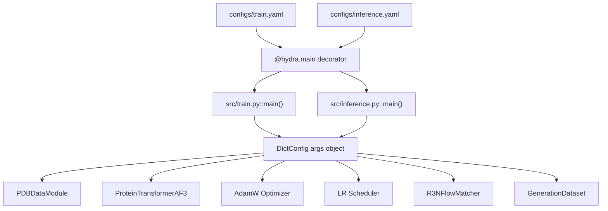
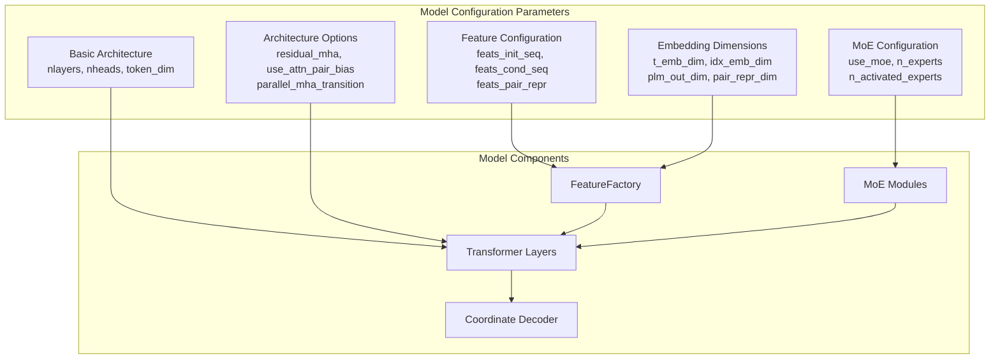
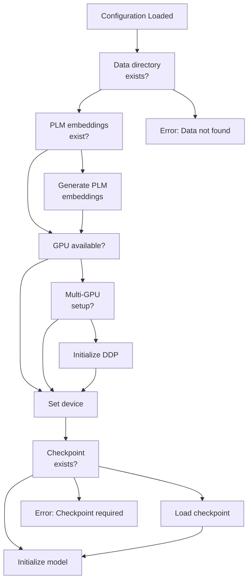

# Configuration Reference

> **Relevant source files**
> * [configs/inference.yaml](https://github.com/Junjie-Zhu/IDPFold2/blob/5315b279/configs/inference.yaml)
> * [configs/train.yaml](https://github.com/Junjie-Zhu/IDPFold2/blob/5315b279/configs/train.yaml)
> * [src/inference.py](https://github.com/Junjie-Zhu/IDPFold2/blob/5315b279/src/inference.py)
> * [src/train.py](https://github.com/Junjie-Zhu/IDPFold2/blob/5315b279/src/train.py)
> * [src/utils/pdb_utils.py](https://github.com/Junjie-Zhu/IDPFold2/blob/5315b279/src/utils/pdb_utils.py)

## Purpose and Scope

This page provides a complete reference for all configuration parameters used in IDPFold2 for both training and inference. These configurations are managed using Hydra and defined in YAML files located in the `configs/` directory.

For details on the training pipeline that uses these configurations, see [Training](/Junjie-Zhu/IDPFold2/6-training). For details on the inference pipeline, see [Inference](/Junjie-Zhu/IDPFold2/7-inference). For model architecture details, see [Model Architecture](/Junjie-Zhu/IDPFold2/5-model-architecture).

## Configuration System Overview

IDPFold2 uses [Hydra](https://hydra.cc/) for configuration management. The main configuration files are:

* `configs/train.yaml` - Training configuration
* `configs/inference.yaml` - Inference configuration

Both configurations share a common `model` section that defines the ProteinTransformerAF3 architecture parameters.

### Configuration Loading



**Configuration Loading Flow:**

1. Hydra decorator loads YAML file specified in `@hydra.main(config_name=...)`
2. Configuration is parsed into an `OmegaConf.DictConfig` object
3. Parameters are accessed via dot notation (e.g., `args.model.nlayers`)
4. Configuration is saved to logging directory at runtime for reproducibility

**Sources:** [configs/train.yaml L1-L124](https://github.com/Junjie-Zhu/IDPFold2/blob/5315b279/configs/train.yaml#L1-L124)

 [configs/inference.yaml L1-L103](https://github.com/Junjie-Zhu/IDPFold2/blob/5315b279/configs/inference.yaml#L1-L103)

 [src/train.py L31-L44](https://github.com/Junjie-Zhu/IDPFold2/blob/5315b279/src/train.py#L31-L44)

 [src/inference.py L167-L182](https://github.com/Junjie-Zhu/IDPFold2/blob/5315b279/src/inference.py#L167-L182)

## Training Configuration Structure

### Top-Level Training Parameters

| Parameter | Type | Default | Description |
| --- | --- | --- | --- |
| `task_prefix` | str | `"HYBRID_TRAIN"` | Prefix for logging directory name |
| `batch_size` | int | `8` | Batch size per GPU device |
| `epochs` | int | `500` | Total number of training epochs |
| `target_pred` | str | `"v"` | Prediction target: `"v"` for velocity field, `"x"` for coordinates |
| `checkpoint_interval` | int | `2` | Save checkpoint every N epochs |
| `seed` | int | `42` | Random seed for reproducibility |
| `deterministic` | bool | `False` | Enable deterministic training (slower) |
| `logging_dir` | str | `"./logs"` | Base directory for logs and checkpoints |

**Sources:** [configs/train.yaml L2-L9](https://github.com/Junjie-Zhu/IDPFold2/blob/5315b279/configs/train.yaml#L2-L9)

### Conditioning Strategy Parameters

These parameters control optional conditioning mechanisms during training. See [Conditioning Strategies](/Junjie-Zhu/IDPFold2/6.6-conditioning-strategies) for details.

| Parameter | Type | Default | Description |
| --- | --- | --- | --- |
| `motif_conditioning` | bool | `False` | Enable motif-based conditioning for structured regions |
| `moe_conditioning` | bool | `False` | Enable MoE-based conditioning |
| `self_conditioning` | bool | `False` | Enable self-conditioning with previous predictions |

**Sources:** [configs/train.yaml L11-L13](https://github.com/Junjie-Zhu/IDPFold2/blob/5315b279/configs/train.yaml#L11-L13)

### Resume Parameters

```yaml
resume:  ckpt_dir: null  ema_dir: null  load_model_only: True
```

| Parameter | Type | Default | Description |
| --- | --- | --- | --- |
| `resume.ckpt_dir` | str | `null` | Path to checkpoint file to resume from |
| `resume.ema_dir` | str | `null` | Path to EMA checkpoint to initialize from |
| `resume.load_model_only` | bool | `True` | If `True`, only load model weights; if `False`, also load optimizer and scheduler state |

**Usage:** Set `ckpt_dir` to resume training from a checkpoint. Set `ema_dir` to initialize model from EMA weights (useful for fine-tuning). When `load_model_only=True`, optimizer state is reset, allowing learning rate schedule to restart.

**Sources:** [configs/train.yaml L15-L18](https://github.com/Junjie-Zhu/IDPFold2/blob/5315b279/configs/train.yaml#L15-L18)

 [src/train.py L174-L195](https://github.com/Junjie-Zhu/IDPFold2/blob/5315b279/src/train.py#L174-L195)

### EMA Parameters

Exponential Moving Average (EMA) maintains a smoothed version of model weights for stable inference.

```yaml
ema:  decay: 0.999  mutable_param_keywords: [""]
```

| Parameter | Type | Default | Description |
| --- | --- | --- | --- |
| `ema.decay` | float | `0.999` | EMA decay rate. Higher values = slower updates. Set to `0` to disable EMA. |
| `ema.mutable_param_keywords` | list[str] | `[""]` | Keywords for parameters excluded from EMA (rarely used) |

**Formula:** `ema_param = decay * ema_param + (1 - decay) * current_param`

**Sources:** [configs/train.yaml L20-L22](https://github.com/Junjie-Zhu/IDPFold2/blob/5315b279/configs/train.yaml#L20-L22)

 [src/train.py L145-L153](https://github.com/Junjie-Zhu/IDPFold2/blob/5315b279/src/train.py#L145-L153)

### Noise Parameters

Control the noise schedule for flow matching training.

```yaml
noise:  mode: mix_up02_beta  p1: 1.9  p2: 1.0
```

| Parameter | Type | Default | Description |
| --- | --- | --- | --- |
| `noise.mode` | str | `"mix_up02_beta"` | Noise distribution mode. Options: `"uniform"`, `"beta"`, `"mix_up02_beta"` |
| `noise.p1` | float | `1.9` | First shape parameter for beta distribution |
| `noise.p2` | float | `1.0` | Second shape parameter for beta distribution |

**Modes:**

* `"uniform"`: Uniform distribution over [0, 1]
* `"beta"`: Beta distribution with shape parameters (p1, p2)
* `"mix_up02_beta"`: Mix of uniform on [0, 0.2] and beta on [0.2, 1]

**Sources:** [configs/train.yaml L24-L27](https://github.com/Junjie-Zhu/IDPFold2/blob/5315b279/configs/train.yaml#L24-L27)

### Loss Parameters

```yaml
loss:  moe_loss_weight: 0.3
```

| Parameter | Type | Default | Description |
| --- | --- | --- | --- |
| `loss.moe_loss_weight` | float | `0.3` | Weight for MoE load balancing loss. Total loss = flow_loss + moe_loss_weight * moe_loss |

**Sources:** [configs/train.yaml L29-L30](https://github.com/Junjie-Zhu/IDPFold2/blob/5315b279/configs/train.yaml#L29-L30)

 [src/train.py L269](https://github.com/Junjie-Zhu/IDPFold2/blob/5315b279/src/train.py#L269-L269)

## Data Configuration

The `data` section configures dataset loading, preprocessing, and batching.

### Data Path Parameters

| Parameter | Type | Default | Description |
| --- | --- | --- | --- |
| `data.data_dir` | str | `"./data/hybrid_train/"` | Directory containing processed PDB files (.pkl) |
| `data.plm_emb_dir` | str | `"./data/hybrid_train/embedding/"` | Directory containing cached PLM embeddings (.pt) |
| `data.complex_dir` | str | `"./data/hybrid_train/complex_contacts.csv"` | CSV file with complex contact information |

**Sources:** [configs/train.yaml L33-L35](https://github.com/Junjie-Zhu/IDPFold2/blob/5315b279/configs/train.yaml#L33-L35)

### Dataset Selection Parameters

| Parameter | Type | Default | Description |
| --- | --- | --- | --- |
| `data.fraction` | float | `1.0` | Fraction of dataset to use (for quick experiments) |
| `data.molecule_type` | str | `null` | Filter by molecule type (e.g., `"protein"`) |
| `data.experiment_types` | list[str] | `null` | Filter by experiment types |
| `data.min_length` | int | `null` | Minimum protein length (residues) |
| `data.max_length` | int | `256` | Maximum protein length (residues) |
| `data.oligomeric_min` | int | `null` | Minimum oligomeric state |
| `data.oligomeric_max` | int | `null` | Maximum oligomeric state |
| `data.best_resolution` | float | `null` | Best resolution threshold (Å) |
| `data.worst_resolution` | float | `null` | Worst resolution threshold (Å) |

**Sources:** [configs/train.yaml L44-L52](https://github.com/Junjie-Zhu/IDPFold2/blob/5315b279/configs/train.yaml#L44-L52)

### Data Processing Parameters

| Parameter | Type | Default | Description |
| --- | --- | --- | --- |
| `data.format` | str | `"pdb"` | File format: `"pdb"`, `"cif"`, or `"mmtf"` |
| `data.overwrite` | bool | `False` | Overwrite existing processed files |
| `data.batch_padding` | bool | `True` | Enable dense padding for variable-length proteins |
| `data.sampling_mode` | str | `"cluster-random"` | Sampling strategy: `"random"`, `"cluster-random"`, `"length-balanced"` |
| `data.crop_size` | int | `256` | Maximum residues per crop for long proteins |
| `data.complex_prop` | float | `0.8` | Proportion of complex structures in training data |

**Sources:** [configs/train.yaml L36-L41](https://github.com/Junjie-Zhu/IDPFold2/blob/5315b279/configs/train.yaml#L36-L41)

### Data Splitting Parameters

| Parameter | Type | Default | Description |
| --- | --- | --- | --- |
| `data.train_val_prop` | list[float] | `[0.99, 0.01]` | Train/validation split proportions |
| `data.split_type` | str | `"sequence_similarity"` | Split method: `"sequence_similarity"` or `"random"` |
| `data.split_sequence_similarity` | float | `0.9` | Maximum sequence similarity between train/val sets |
| `data.overwrite_sequence_clusters` | bool | `False` | Force recomputation of sequence clusters |

**Sources:** [configs/train.yaml L53-L56](https://github.com/Junjie-Zhu/IDPFold2/blob/5315b279/configs/train.yaml#L53-L56)

### DataLoader Parameters

| Parameter | Type | Default | Description |
| --- | --- | --- | --- |
| `data.num_workers` | int | `6` | Number of dataloader worker processes |
| `data.pin_memory` | bool | `True` | Pin memory for faster GPU transfer |

**Sources:** [configs/train.yaml L42-L43](https://github.com/Junjie-Zhu/IDPFold2/blob/5315b279/configs/train.yaml#L42-L43)

## Model Architecture Configuration

The `model` section is shared between training and inference configurations. These parameters define the ProteinTransformerAF3 architecture.



**Sources:** [configs/train.yaml L58-L102](https://github.com/Junjie-Zhu/IDPFold2/blob/5315b279/configs/train.yaml#L58-L102)

 [configs/inference.yaml L48-L92](https://github.com/Junjie-Zhu/IDPFold2/blob/5315b279/configs/inference.yaml#L48-L92)

### Basic Architecture Parameters

| Parameter | Type | Default | Description |
| --- | --- | --- | --- |
| `model.training` | bool | varies | `True` for training, `False` for inference. Controls dropout and other training-specific behavior |
| `model.token_dim` | int | `768` | Dimension of sequence token embeddings |
| `model.nlayers` | int | `10` | Number of transformer layers |
| `model.nheads` | int | `12` | Number of attention heads per layer |
| `model.num_registers` | int | `10` | Number of register tokens (auxiliary tokens for intermediate computation) |

**Sources:** [configs/train.yaml L59-L93](https://github.com/Junjie-Zhu/IDPFold2/blob/5315b279/configs/train.yaml#L59-L93)

### Architecture Style Parameters

| Parameter | Type | Default | Description |
| --- | --- | --- | --- |
| `model.residual_mha` | bool | `True` | Use residual connection around multi-head attention |
| `model.residual_transition` | bool | `True` | Use residual connection around transition (FFN) blocks |
| `model.parallel_mha_transition` | bool | `False` | If `True`, compute MHA and transition in parallel (AlphaFold3 style); if `False`, sequential (standard Transformer) |
| `model.use_attn_pair_bias` | bool | `True` | Bias attention using pair representation |
| `model.use_qkln` | bool | `True` | Use QK LayerNorm before computing attention scores |

**Sources:** [configs/train.yaml L63-L94](https://github.com/Junjie-Zhu/IDPFold2/blob/5315b279/configs/train.yaml#L63-L94)

### Feature Configuration Parameters

These control which features are included in sequence and pair representations.

| Parameter | Type | Default | Description |
| --- | --- | --- | --- |
| `model.strict_feats` | bool | `False` | If `True`, raise error on missing features; if `False`, use defaults |
| `model.feats_init_seq` | list[str] | `["plm_emb", "res_type", "res_idx", "chain_break_per_res"]` | Features for initial sequence representation |
| `model.feats_cond_seq` | list[str] | `["time_emb"]` | Features for sequence conditioning vector |
| `model.feats_pair_repr` | list[str] | `["xt_pair_dists", "rel_pos"]` | Features for pair representation |
| `model.feats_pair_cond` | list[str] | `["time_emb"]` | Features for pair conditioning |

**Available Features:**

* Sequence: `"plm_emb"`, `"res_type"`, `"res_idx"`, `"chain_break_per_res"`, `"time_emb"`
* Pair: `"xt_pair_dists"`, `"rel_pos"`, `"time_emb"`

**Sources:** [configs/train.yaml L68-L82](https://github.com/Junjie-Zhu/IDPFold2/blob/5315b279/configs/train.yaml#L68-L82)

### Embedding Dimension Parameters

| Parameter | Type | Default | Description |
| --- | --- | --- | --- |
| `model.t_emb_dim` | int | `256` | Dimension of time embedding (sinusoidal) |
| `model.idx_emb_dim` | int | `128` | Dimension of residue index embedding |
| `model.dim_cond` | int | `512` | Dimension of conditioning vector |
| `model.plm_in_dim` | int | `1280` | Input dimension of PLM embeddings (ESM2-650M) |
| `model.plm_out_dim` | int | `256` | Output dimension after projecting PLM embeddings |
| `model.pair_repr_dim` | int | `512` | Final dimension of pair representation |

**Sources:** [configs/train.yaml L75-L92](https://github.com/Junjie-Zhu/IDPFold2/blob/5315b279/configs/train.yaml#L75-L92)

### Pair Feature Parameters

| Parameter | Type | Default | Description |
| --- | --- | --- | --- |
| `model.xt_pair_dist_dim` | int | `64` | Number of bins for pairwise distance features |
| `model.xt_pair_dist_min` | float | `0.1` | Minimum distance for binning (nm) |
| `model.xt_pair_dist_max` | float | `3.0` | Maximum distance for binning (nm) |
| `model.r_max` | int | `32` | Maximum relative position in sequence to consider |

**Distance Binning:** Pairwise Cα distances in the noisy structure `x_t` are binned into `xt_pair_dist_dim` bins uniformly spanning [`xt_pair_dist_min`, `xt_pair_dist_max`].

**Sources:** [configs/train.yaml L86-L89](https://github.com/Junjie-Zhu/IDPFold2/blob/5315b279/configs/train.yaml#L86-L89)

### Mixture of Experts Parameters

| Parameter | Type | Default | Description |
| --- | --- | --- | --- |
| `model.use_moe` | bool | `True` | Enable Mixture of Experts in transition blocks |
| `model.n_experts` | int | `5` | Total number of expert networks |
| `model.n_activated_experts` | int | `2` | Number of experts activated per token (top-k) |
| `model.dim_moe_cond` | int | `0` | Dimension of MoE conditioning (0 = no conditioning) |
| `model.capacity_factor` | float | `1.3` | Expert capacity factor for load balancing |
| `model.normalize_expert_weights` | bool | `True` | Normalize expert output weights |

**Expert Capacity:** Maximum tokens per expert = `(n_tokens * n_activated_experts / n_experts) * capacity_factor`

**Sources:** [configs/train.yaml L96-L101](https://github.com/Junjie-Zhu/IDPFold2/blob/5315b279/configs/train.yaml#L96-L101)

## Optimizer Configuration

```yaml
optimizer:  lr: 0.0001  weight_decay: 0.  beta1: 0.9  beta2: 0.999  use_adamw: False  lr_scheduler: "af3"  warmup_steps: 4000  decay_every_n_steps: 80000  decay_factor: 0.98
```

| Parameter | Type | Default | Description |
| --- | --- | --- | --- |
| `optimizer.lr` | float | `0.0001` | Peak learning rate |
| `optimizer.weight_decay` | float | `0.0` | L2 weight decay coefficient |
| `optimizer.beta1` | float | `0.9` | Adam beta1 (first moment decay) |
| `optimizer.beta2` | float | `0.999` | Adam beta2 (second moment decay) |
| `optimizer.use_adamw` | bool | `False` | Use AdamW instead of Adam |

**Sources:** [configs/train.yaml L103-L108](https://github.com/Junjie-Zhu/IDPFold2/blob/5315b279/configs/train.yaml#L103-L108)

### Learning Rate Scheduler Parameters

| Parameter | Type | Default | Description |
| --- | --- | --- | --- |
| `optimizer.lr_scheduler` | str | `"af3"` | Scheduler type: `"af3"` (AlphaFold3), `"cosine"`, or `"constant"` |
| `optimizer.warmup_steps` | int | `4000` | Linear warmup steps |
| `optimizer.decay_every_n_steps` | int | `80000` | Steps between exponential decay (AF3 scheduler) |
| `optimizer.decay_factor` | float | `0.98` | Multiplicative decay factor (AF3 scheduler) |

**AlphaFold3 Scheduler:** Linear warmup for `warmup_steps`, then exponential decay by `decay_factor` every `decay_every_n_steps`.

**Sources:** [configs/train.yaml L109-L112](https://github.com/Junjie-Zhu/IDPFold2/blob/5315b279/configs/train.yaml#L109-L112)

 [src/train.py L163-L171](https://github.com/Junjie-Zhu/IDPFold2/blob/5315b279/src/train.py#L163-L171)

## Inference Configuration Structure

### Top-Level Inference Parameters

| Parameter | Type | Default | Description |
| --- | --- | --- | --- |
| `prefix` | str | `"DEFAULT"` | Prefix for logging directory |
| `csv_dir` | str | `null` | Path to CSV file with sequences to predict |
| `plm_emb_dir` | str | `null` | Directory to store/load PLM embeddings |
| `nsamples` | int | `100` | Total number of samples to generate per sequence |
| `max_batch_length` | int | `3500` | Maximum total residues per batch (controls memory usage) |
| `dt` | float | `0.005` | Time step for flow matching integration |
| `target_pred` | str | `"v"` | Prediction target: `"v"` for velocity field |
| `ckpt_dir` | str | `null` | Path to model checkpoint file |
| `ag_dir` | str | `null` | Path to auto-guidance model checkpoint (optional) |
| `load_multimer` | bool | `False` | Enable multi-chain protein generation |
| `num_workers` | int | `6` | Number of dataloader workers |
| `seed` | int | `42` | Random seed |
| `deterministic` | bool | `False` | Enable deterministic inference |
| `logging_dir` | str | `"./logs"` | Base directory for outputs |

**Sources:** [configs/inference.yaml L2-L25](https://github.com/Junjie-Zhu/IDPFold2/blob/5315b279/configs/inference.yaml#L2-L25)

### CSV Input Format

The `csv_dir` parameter should point to a CSV file with the following columns:

**For Monomers:**

```
test_case,sequenceprotein1,MKTAYIAKQRQISFVKSHFSRQLEERLGLIEVQAPILSRVGDGTQDNLSGAEKAVQVKVKALPDAQFEVVHSLAKWKRQTLGQHDFSAGEGLYTHMKALRPDEDRLSPLHSVYVDQWDWERVMGDGERQFSTLKSTVEAIWAGIKATEAAVSEEFGLAPFLPDQIHFVHSQELLSRYPDLDAKGRERAIAKDLGAVFLVGIGGKLSDGHRHDVRAPDYDDWSTPSELGHAGLNGDILVWNPVLEDAFELSSMGIRVDADTLKHQLALTGDEDRLELEWHQALLRGEMPQTIGGGIGQSRLTMLLLQLPHIGQVQAGVWPAAVRESVPSLLprotein2,GAMGSHHHHHHSSGENLYFQGHMCQLLKFCALLVRSQSLLISCIFDKSGASPHAVGAAGFGDLSRNLAHIFEPTRVASMSEYVIPQRYGGSVSNCALFNVKAQNRMLLDEKVKIISHLDRQISQVAQYIKAGDAKGALQDSAVRVFLSKFQDIGIVHSSYVLSELQELIKGAKYNPQLILVGNSSGSFQGVSEVNKKICADAEIMKGLKDSLSSVDAKAKGSASFSQQIQSAVAYFNNNYEEKLKAYLGTRRTTSKVIRRYRQTAQVNSNRFQKQILEVIKLDAYRKFMGISGGSGLVSNAKVFQLMDGLKKKELVRLLEAAPDPLLVVDISQYSDKGFYTTKGIVQYQQGFQGKLISYIKQAGGGGWVLTKTIDYYQRLSFKFSDADTPSVAQLQQRIEAVQSIESLHNQADLKYAQNQAQRSLCLKWFDGVLRQANVQIYDLTQ
```

**For Multimers:**

```
test_case,sequence,chain_idscomplex1,MKTAYIAK:GAMSGHH,A:Bcomplex2,QRQISFVK:HHHSSG:ENLYFQGH,A:B:C
```

**Sources:** [src/inference.py L31-L157](https://github.com/Junjie-Zhu/IDPFold2/blob/5315b279/src/inference.py#L31-L157)

### Sampling Strategy Parameters

```yaml
sampling:  sampling_mode: vf  sc_scale_noise: 0.0  sc_scale_score: 1.0  gt_mode: "1/t"  gt_p: 1.0  gt_clamp_val: null
```

| Parameter | Type | Default | Description |
| --- | --- | --- | --- |
| `sampling.sampling_mode` | str | `"vf"` | Sampling mode: `"vf"` (velocity field) or `"sc"` (score-based with noise) |
| `sampling.sc_scale_noise` | float | `0.0` | Scale for Gaussian noise in score-based sampling |
| `sampling.sc_scale_score` | float | `1.0` | Scale for score term in score-based sampling |
| `sampling.gt_mode` | str | `"1/t"` | g(t) function mode: `"us"` (unconditional), `"tan"`, or `"1/t"` |
| `sampling.gt_p` | float | `1.0` | Power parameter for g(t) function |
| `sampling.gt_clamp_val` | float | `null` | Clamp value for g(t) (null = no clamping) |

**Sampling Modes:**

* `"vf"`: Pure flow matching with velocity field prediction
* `"sc"`: Score-based diffusion with controllable noise injection

**Sources:** [configs/inference.yaml L32-L38](https://github.com/Junjie-Zhu/IDPFold2/blob/5315b279/configs/inference.yaml#L32-L38)

### Schedule Parameters

```yaml
schedule:  schedule_mode: log  schedule_p: 2.0
```

| Parameter | Type | Default | Description |
| --- | --- | --- | --- |
| `schedule.schedule_mode` | str | `"log"` | Time discretization mode: `"log"` or `"cosine"` |
| `schedule.schedule_p` | float | `2.0` | Power parameter for logarithmic schedule |

**Schedule Modes:**

* `"log"`: Logarithmic time steps: `t = (1 + 1/N)^(-schedule_p * i/N)` for i=0..N
* `"cosine"`: Cosine schedule for smoother transitions

**Sources:** [configs/inference.yaml L40-L42](https://github.com/Junjie-Zhu/IDPFold2/blob/5315b279/configs/inference.yaml#L40-L42)

### Guidance Parameters

```yaml
guidance_weight: 1.0autoguidance_ratio: 0.0autoguidance_ckpt_path: null
```

| Parameter | Type | Default | Description |
| --- | --- | --- | --- |
| `guidance_weight` | float | `1.0` | Classifier-free guidance weight. `1.0` = no guidance, `>1.0` = stronger conditioning |
| `autoguidance_ratio` | float | `0.0` | Ratio of auto-guidance vs classifier-free guidance. `0.0` = pure CFG, `1.0` = pure auto-guidance |
| `autoguidance_ckpt_path` | str | `null` | Path to secondary model for auto-guidance |

**Guidance Formula:**

```
pred = guidance_weight * pred_conditional + (1 - guidance_weight) * pred_unconditional
```

When `autoguidance_ratio > 0`:

```
pred = (1 - autoguidance_ratio) * cfg_pred + autoguidance_ratio * ag_pred
```

**Sources:** [configs/inference.yaml L44-L46](https://github.com/Junjie-Zhu/IDPFold2/blob/5315b279/configs/inference.yaml#L44-L46)

 [src/inference.py L246-L295](https://github.com/Junjie-Zhu/IDPFold2/blob/5315b279/src/inference.py#L246-L295)

## Configuration Relationship Diagram

```mermaid
flowchart TD

TRAIN_CFG["train.yaml"]
INF_CFG["inference.yaml"]
TRAIN_DATA["Data Parameters<br>→ PDBDataModule"]
TRAIN_OPT["Optimizer Parameters<br>→ AdamW + Scheduler"]
TRAIN_LOSS["Loss Parameters<br>→ training_predict()"]
TRAIN_EMA["EMA Parameters<br>→ EMAWrapper"]
INF_DATA["Data Parameters<br>→ GenerationDataset"]
INF_SAMPLE["Sampling Parameters<br>→ generating_predict()"]
INF_SCHED["Schedule Parameters<br>→ R3NFlowMatcher"]
INF_GUIDE["Guidance Parameters<br>→ generating_predict()"]
MODEL_ARCH["Model Parameters<br>→ ProteinTransformerAF3"]
COND["Conditioning Parameters<br>→ motif_factory, moe_factory"]
PDB_MODULE["src/data/dataset.py<br>PDBDataModule"]
OPT_CODE["src/model/optimizer.py<br>get_optimizer()"]
TRAIN_PRED["src/model/integral.py<br>training_predict()"]
EMA_CODE["src/model/ema.py<br>EMAWrapper"]
GEN_DATASET["src/inference.py<br>GenerationDataset"]
GEN_PRED["src/model/integral.py<br>generating_predict()"]
FLOW_CODE["src/model/flow_matching/r3flow.py<br>R3NFlowMatcher"]
MODEL_CODE["src/model/protein_transformer.py<br>ProteinTransformerAF3"]
MOTIF_CODE["src/model/components/motif_factory.py"]

TRAIN_CFG --> TRAIN_DATA
TRAIN_CFG --> TRAIN_OPT
TRAIN_CFG --> TRAIN_LOSS
TRAIN_CFG --> TRAIN_EMA
TRAIN_CFG --> MODEL_ARCH
TRAIN_CFG --> COND
INF_CFG --> INF_DATA
INF_CFG --> INF_SAMPLE
INF_CFG --> INF_SCHED
INF_CFG --> INF_GUIDE
INF_CFG --> MODEL_ARCH
INF_CFG --> COND
TRAIN_DATA --> PDB_MODULE
TRAIN_OPT --> OPT_CODE
TRAIN_LOSS --> TRAIN_PRED
TRAIN_EMA --> EMA_CODE
INF_DATA --> GEN_DATASET
INF_SAMPLE --> GEN_PRED
INF_SCHED --> FLOW_CODE
INF_GUIDE --> GEN_PRED
MODEL_ARCH --> MODEL_CODE
COND --> MOTIF_CODE

subgraph subGraph3 ["Shared Components"]
    MODEL_ARCH
    COND
end

subgraph subGraph2 ["Inference Components"]
    INF_DATA
    INF_SAMPLE
    INF_SCHED
    INF_GUIDE
end

subgraph subGraph1 ["Training Components"]
    TRAIN_DATA
    TRAIN_OPT
    TRAIN_LOSS
    TRAIN_EMA
end

subgraph subGraph0 ["Configuration Files"]
    TRAIN_CFG
    INF_CFG
end
```



**Sources:** [configs/train.yaml L1-L124](https://github.com/Junjie-Zhu/IDPFold2/blob/5315b279/configs/train.yaml#L1-L124)

 [configs/inference.yaml L1-L103](https://github.com/Junjie-Zhu/IDPFold2/blob/5315b279/configs/inference.yaml#L1-L103)

 [src/train.py L31-L435](https://github.com/Junjie-Zhu/IDPFold2/blob/5315b279/src/train.py#L31-L435)

 [src/inference.py L167-L368](https://github.com/Junjie-Zhu/IDPFold2/blob/5315b279/src/inference.py#L167-L368)

## Parameter Override via Command Line

Hydra allows overriding any configuration parameter from the command line:

```markdown
# Override single parameterspython src/train.py model.nlayers=12 batch_size=16 # Override nested parameterspython src/train.py optimizer.lr=0.0002 optimizer.warmup_steps=5000 # Override multiple parameterspython src/inference.py \    csv_dir=./inputs/sequences.csv \    plm_emb_dir=./embeddings/ \    ckpt_dir=./checkpoints/model.pth \    nsamples=50 \    guidance_weight=1.5
```

**Multiline Configuration:**

```
python src/train.py \    data.data_dir=/path/to/data \    data.max_length=512 \    model.nlayers=15 \    model.nheads=16 \    batch_size=4 \    epochs=1000
```

**Sources:** [src/train.py L31](https://github.com/Junjie-Zhu/IDPFold2/blob/5315b279/src/train.py#L31-L31)

 [src/inference.py L167](https://github.com/Junjie-Zhu/IDPFold2/blob/5315b279/src/inference.py#L167-L167)

## Configuration Validation

### Required Parameters

**Training:**

* `data.data_dir` - must exist and contain `.pkl` files
* `data.plm_emb_dir` - must exist and contain `.pt` files

**Inference:**

* `csv_dir` - must point to valid CSV file
* `plm_emb_dir` - directory for PLM embeddings (created if missing)
* `ckpt_dir` - must point to valid checkpoint file

### Validation Checks

The code performs several validation checks at runtime:



**Sources:** [src/train.py L79-L195](https://github.com/Junjie-Zhu/IDPFold2/blob/5315b279/src/train.py#L79-L195)

 [src/inference.py L210-L256](https://github.com/Junjie-Zhu/IDPFold2/blob/5315b279/src/inference.py#L210-L256)

## Best Practices

### Training Configuration

**For new training runs:**

```yaml
resume:  ckpt_dir: null  ema_dir: nullema:  decay: 0.999checkpoint_interval: 2
```

**For fine-tuning:**

```yaml
resume:  ckpt_dir: null  ema_dir: /path/to/ema_checkpoint.pth  load_model_only: Trueoptimizer:  lr: 0.00001  # Lower LR for fine-tuning
```

**For resuming interrupted training:**

```yaml
resume:  ckpt_dir: /path/to/checkpoint.pth  load_model_only: False  # Resume optimizer state
```

### Inference Configuration

**For high-quality ensembles:**

```yaml
nsamples: 100guidance_weight: 1.5schedule:  schedule_mode: log  schedule_p: 2.0sampling:  sampling_mode: vf
```

**For fast prototyping:**

```yaml
nsamples: 10guidance_weight: 1.0dt: 0.01  # Larger time step
```

**For multi-chain proteins:**

```yaml
load_multimer: Truemotif_conditioning: False  # Usually disabled for multimers
```

### Memory Management

**Adjust based on GPU memory:**

| GPU Memory | max_length (training) | max_batch_length (inference) | batch_size |
| --- | --- | --- | --- |
| 16 GB | 128 | 1500 | 4 |
| 32 GB | 256 | 3500 | 8 |
| 40 GB | 384 | 5000 | 12 |
| 80 GB | 512 | 8000 | 16 |

**Sources:** [configs/train.yaml L4-L48](https://github.com/Junjie-Zhu/IDPFold2/blob/5315b279/configs/train.yaml#L4-L48)

 [configs/inference.yaml L10](https://github.com/Junjie-Zhu/IDPFold2/blob/5315b279/configs/inference.yaml#L10-L10)

## Configuration Saving and Reproducibility

Both training and inference pipelines automatically save the configuration to the logging directory:

```css
# Saved as: {logging_dir}/config.yamlwith open(f"{logging_dir}/config.yaml", "w") as f:    OmegaConf.save(args, f)
```

This ensures full reproducibility - the exact configuration can be reused:

```markdown
# Use saved configurationpython src/train.py --config-path=/path/to/logs/experiment_name --config-name=config
```

**Sources:** [src/train.py L42-L44](https://github.com/Junjie-Zhu/IDPFold2/blob/5315b279/src/train.py#L42-L44)

 [src/inference.py L179-L181](https://github.com/Junjie-Zhu/IDPFold2/blob/5315b279/src/inference.py#L179-L181)