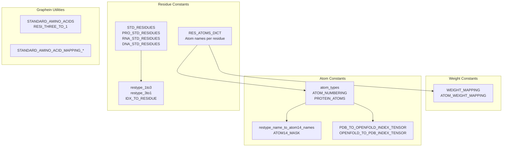
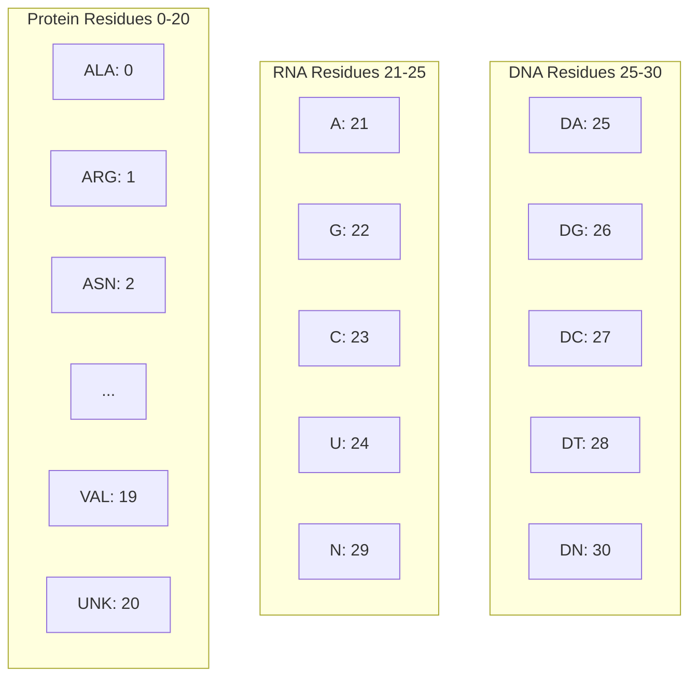
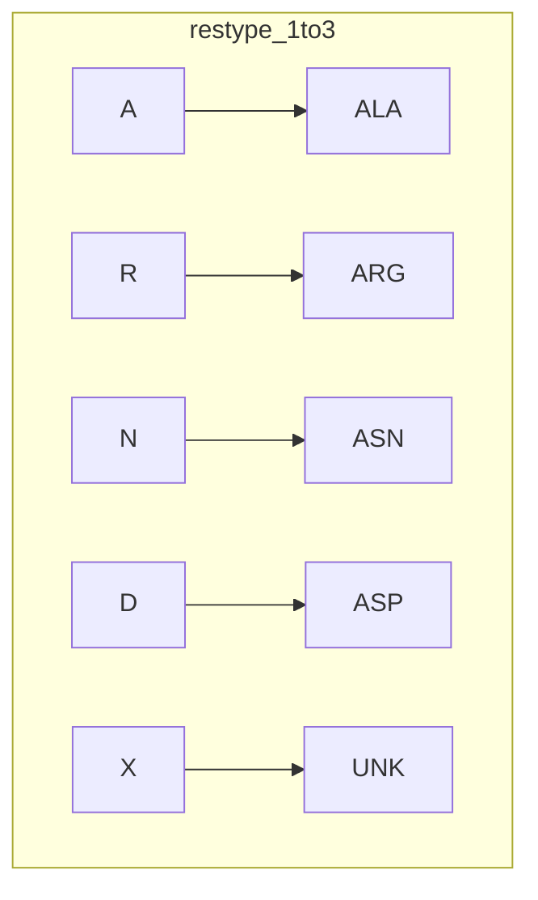
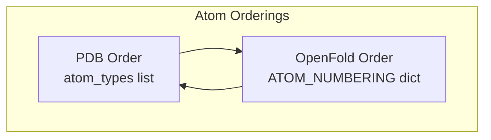
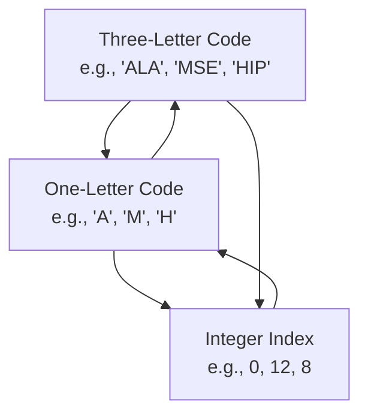
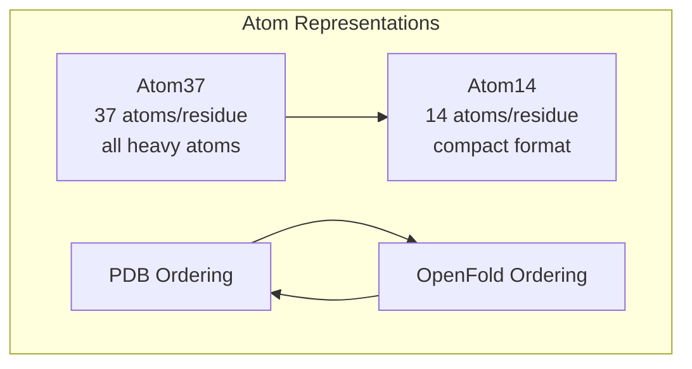
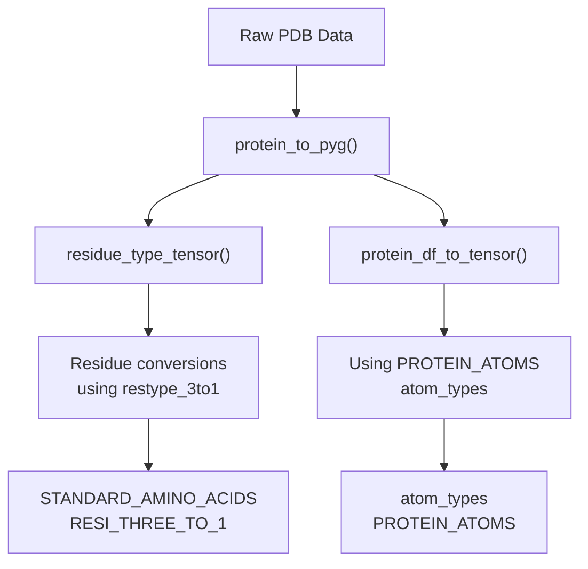

# Constants and Definitions

> **Relevant source files**
> * [src/common/atom37_constants.py](https://github.com/Junjie-Zhu/IDPFold2/blob/5315b279/src/common/atom37_constants.py)
> * [src/common/residue_constants.py](https://github.com/Junjie-Zhu/IDPFold2/blob/5315b279/src/common/residue_constants.py)
> * [src/model/ema.py](https://github.com/Junjie-Zhu/IDPFold2/blob/5315b279/src/model/ema.py)
> * [src/utils/graphein_utils.py](https://github.com/Junjie-Zhu/IDPFold2/blob/5315b279/src/utils/graphein_utils.py)

This page documents the constants, mappings, and definitions used throughout IDPFold2 for protein and nucleic acid representation. These constants define standard vocabularies for residue types, atom types, and provide conversion utilities between different structural representations.

For information about how these constants are used in data processing, see [Data Preparation and Selection](/Junjie-Zhu/IDPFold2/4.1-data-preparation-and-selection). For their role in feature generation, see [Feature Factories](/Junjie-Zhu/IDPFold2/5.4-feature-factories).

---

## Overview

The IDPFold2 codebase maintains several sets of constants that standardize the representation of proteins and nucleic acids:



**Sources:** [src/common/residue_constants.py L1-L586](https://github.com/Junjie-Zhu/IDPFold2/blob/5315b279/src/common/residue_constants.py#L1-L586)

 [src/common/atom37_constants.py L1-L154](https://github.com/Junjie-Zhu/IDPFold2/blob/5315b279/src/common/atom37_constants.py#L1-L154)

 [src/utils/graphein_utils.py L1-L2793](https://github.com/Junjie-Zhu/IDPFold2/blob/5315b279/src/utils/graphein_utils.py#L1-L2793)

---

## Residue Type Constants

### Standard Residue Definitions

The codebase defines three primary categories of biological residues:

| Category | Constant | Location | Count |
| --- | --- | --- | --- |
| Protein Amino Acids | `PRO_STD_RESIDUES` | [src/common/residue_constants.py L396-L418](https://github.com/Junjie-Zhu/IDPFold2/blob/5315b279/src/common/residue_constants.py#L396-L418) | 21 (20 standard + UNK) |
| RNA Residues | `RNA_STD_RESIDUES` | [src/common/residue_constants.py L420-L426](https://github.com/Junjie-Zhu/IDPFold2/blob/5315b279/src/common/residue_constants.py#L420-L426) | 5 (A, G, C, U, N) |
| DNA Residues | `DNA_STD_RESIDUES` | [src/common/residue_constants.py L428-L434](https://github.com/Junjie-Zhu/IDPFold2/blob/5315b279/src/common/residue_constants.py#L428-L434) | 5 (DA, DG, DC, DT, DN) |

The combined mapping `STD_RESIDUES` merges all three categories:

```
STD_RESIDUES = PRO_STD_RESIDUES | RNA_STD_RESIDUES | DNA_STD_RESIDUES
```

**Key Residue Indices:**



**Sources:** [src/common/residue_constants.py L396-L437](https://github.com/Junjie-Zhu/IDPFold2/blob/5315b279/src/common/residue_constants.py#L396-L437)

### Residue Atom Definitions

The `RES_ATOMS_DICT` provides a comprehensive mapping of atom names to indices for each residue type:

```
RES_ATOMS_DICT = {    "ALA": {"N": 0, "CA": 1, "C": 2, "O": 3, "CB": 4, "OXT": 5},    "ARG": {"N": 0, "CA": 1, "C": 2, "O": 3, "CB": 4, "CG": 5, ...},    ...}
```

This dictionary includes:

* All 20 standard amino acids with their complete atom sets
* Unknown residue type (`UNK`) with backbone atoms only
* DNA residues (DA, DC, DG, DT, DN) with sugar-phosphate backbone and bases
* RNA residues (A, C, G, U, N) with 2'-hydroxyl groups

**Sources:** [src/common/residue_constants.py L1-L394](https://github.com/Junjie-Zhu/IDPFold2/blob/5315b279/src/common/residue_constants.py#L1-L394)

### Residue Name Conversion

#### One-Letter to Three-Letter Codes



The `restype_1to3` mapping converts single-letter amino acid codes to three-letter codes. Defined at [src/common/residue_constants.py L472-L494](https://github.com/Junjie-Zhu/IDPFold2/blob/5315b279/src/common/residue_constants.py#L472-L494)

#### Three-Letter to One-Letter Codes (with Modified Residues)

The `restype_3to1` dictionary is more comprehensive, handling modified and non-standard residues:

```css
restype_3to1 = {    "ALA": "A",    "ARG": "R",    "MSE": "M",  # Selenomethionine → Methionine    "HIP": "H",  # Protonated histidine → Histidine    "SEP": "S",  # Phosphoserine → Serine    ...}
```

This mapping includes over 70 modified residue types, all mapped to their parent amino acid or to `X` (unknown).

**Sources:** [src/common/residue_constants.py L496-L583](https://github.com/Junjie-Zhu/IDPFold2/blob/5315b279/src/common/residue_constants.py#L496-L583)

### Residue Lists and Vocabularies

The `restypes` list defines the vocabulary of single-letter codes:

```
restypes = ["A", "R", "N", "D", "C", "Q", "E", "G", "H", "I",             "L", "K", "M", "F", "P", "S", "T", "W", "Y", "V", "X"]
```

This 21-element list (20 standard amino acids + unknown) is used throughout the codebase as the primary residue vocabulary.

**Sources:** [src/common/residue_constants.py L448-L470](https://github.com/Junjie-Zhu/IDPFold2/blob/5315b279/src/common/residue_constants.py#L448-L470)

---

## Atom Type Constants

### Atom37 Representation

The codebase uses two primary atom representations: **Atom37** and **Atom14**.

#### Atom37 Format

Atom37 represents proteins with up to 37 atoms per residue, covering all heavy atoms in all standard amino acids:

```
atom_types = [    "N", "CA", "C", "CB", "O", "CG", "CG1", "CG2", "OG", "OG1",     "SG", "CD", "CD1", "CD2", "ND1", "ND2", "OD1", "OD2", "SD",    "CE", "CE1", "CE2", "CE3", "NE", "NE1", "NE2", "OE1", "OE2",    "CH2", "NH1", "NH2", "OH", "CZ", "CZ2", "CZ3", "NZ", "OXT"]
```

The `ATOM_NUMBERING` dictionary provides a different ordering used by OpenFold:



**Conversion tensors:**

* `PDB_TO_OPENFOLD_INDEX_TENSOR`: Converts from PDB ordering to OpenFold ordering
* `OPENFOLD_TO_PDB_INDEX_TENSOR`: Converts from OpenFold ordering to PDB ordering

**Sources:** [src/common/atom37_constants.py L14-L110](https://github.com/Junjie-Zhu/IDPFold2/blob/5315b279/src/common/atom37_constants.py#L14-L110)

#### Atom14 Format

Atom14 is a compact representation storing up to 14 atoms per residue:

```
restype_name_to_atom14_names = {    'ALA': ['N', 'CA', 'C', 'O', 'CB', '', '', '', '', '', '', '', '', ''],    'ARG': ['N', 'CA', 'C', 'O', 'CB', 'CG', 'CD', 'NE', 'CZ', 'NH1', 'NH2', '', '', ''],    'TRP': ['N', 'CA', 'C', 'O', 'CB', 'CG', 'CD1', 'CD2', 'NE1', 'CE2', 'CE3', 'CZ2', 'CZ3', 'CH2'],    ...}
```

Empty strings (`''`) indicate positions not used by that residue type.

**Conversion utilities:**

* `atom37_to_atom14_indices()`: Creates mappings between atom37 and atom14 representations
* `ATOM37_TO_ATOM14_INDICES`: Tensor of shape `(21, 14)` mapping atom37 indices to atom14
* `ATOM14_MASK`: Boolean mask of shape `(21, 14)` indicating valid atoms

**Sources:** [src/common/atom37_constants.py L112-L154](https://github.com/Junjie-Zhu/IDPFold2/blob/5315b279/src/common/atom37_constants.py#L112-L154)

### Graphein Atom Constants

The `graphein_utils.py` module provides an equivalent list of protein atoms:

```
PROTEIN_ATOMS = [    "N", "CA", "C", "O", "CB", "OG", "CG", "CD1", "CD2", ...]
```

This 37-element list matches the atom37 representation and is used in tensor conversion functions like `protein_df_to_tensor()`.

**Sources:** [src/utils/graphein_utils.py L221-L259](https://github.com/Junjie-Zhu/IDPFold2/blob/5315b279/src/utils/graphein_utils.py#L221-L259)

---

## Index Mappings and Conversions

### Residue Index Conversions



**Key Mappings:**

| Mapping | Direction | Location |
| --- | --- | --- |
| `restype_1to3` | 1-letter → 3-letter | [src/common/residue_constants.py L472-L494](https://github.com/Junjie-Zhu/IDPFold2/blob/5315b279/src/common/residue_constants.py#L472-L494) |
| `restype_3to1` | 3-letter → 1-letter | [src/common/residue_constants.py L496-L583](https://github.com/Junjie-Zhu/IDPFold2/blob/5315b279/src/common/residue_constants.py#L496-L583) |
| `resname_to_idx` | 3-letter → index | [src/common/residue_constants.py L585](https://github.com/Junjie-Zhu/IDPFold2/blob/5315b279/src/common/residue_constants.py#L585-L585) |
| `IDX_TO_RESIDUE` | index → 3-letter | [src/common/residue_constants.py L437](https://github.com/Junjie-Zhu/IDPFold2/blob/5315b279/src/common/residue_constants.py#L437-L437) |

**Sources:** [src/common/residue_constants.py L437-L586](https://github.com/Junjie-Zhu/IDPFold2/blob/5315b279/src/common/residue_constants.py#L437-L586)

### Atom Representation Conversions

The codebase provides utilities to convert between different atom representations:



**Conversion Process:**

1. **Atom37 to Atom14:** Use `ATOM37_TO_ATOM14_INDICES` tensor to gather atoms
2. **Masking:** Apply `ATOM14_MASK` to identify valid positions
3. **Ordering:** Apply `PDB_TO_OPENFOLD_INDEX_TENSOR` or inverse for order conversion

**Sources:** [src/common/atom37_constants.py L105-L154](https://github.com/Junjie-Zhu/IDPFold2/blob/5315b279/src/common/atom37_constants.py#L105-L154)

---

## Molecular Weight Constants

### Element Weights

The `WEIGHT_MAPPING` dictionary provides atomic weights for common elements:

```
WEIGHT_MAPPING = {    'H': 1.008,   'C': 12.011,  'N': 14.007,  'O': 15.999,    'P': 30.974,  'S': 32.06,   'F': 18.998,  'MG': 24.305,    ...}
```

### Per-Residue Atom Weights

The `ATOM_WEIGHT_MAPPING` derives atom weights for each residue type:

```
ATOM_WEIGHT_MAPPING = {    k: [WEIGHT_MAPPING[atom[0]] for atom in v.keys()]     for k, v in RES_ATOMS_DICT.items()}
```

This creates a mapping from residue names to lists of atomic weights for each atom in that residue.

**Example:**

```markdown
ATOM_WEIGHT_MAPPING["ALA"]  # [14.007, 12.011, 12.011, 15.999, 12.011, 15.999]# Corresponding to:  [N,      CA,     C,      O,      CB,     OXT]
```

**Sources:** [src/common/residue_constants.py L439-L446](https://github.com/Junjie-Zhu/IDPFold2/blob/5315b279/src/common/residue_constants.py#L439-L446)

---

## Graphein Utility Constants

The `graphein_utils.py` module provides additional constants for protein structure processing:

### Standard Amino Acid Vocabularies

```
STANDARD_AMINO_ACIDS = [    "A", "B", "C", "D", "E", "F", "G", "H", "I", "J", "K", "L",    "M", "N", "P", "Q", "R", "S", "T", "V", "W", "X", "Y", "Z"]
```

This 25-element list includes:

* 20 standard amino acids
* `B` (ASX): Aspartic acid or Asparagine
* `Z` (GLX): Glutamic acid or Glutamine
* `J`: Leucine or Isoleucine
* `X`: Unknown/any amino acid

**Sources:** [src/utils/graphein_utils.py L50-L80](https://github.com/Junjie-Zhu/IDPFold2/blob/5315b279/src/utils/graphein_utils.py#L50-L80)

### Extended Residue Mappings

The `RESI_THREE_TO_1` dictionary in graphein_utils provides the most comprehensive mapping of modified residues:

```css
RESI_THREE_TO_1 = {    "ALA": "A",    "ARG": "R",    "MSE": "M",      # Selenomethionine    "CME": "C",      # S-methylcysteine    "HIP": "H",      # Protonated histidine    "SEP": "S",      # Phosphoserine    "TPO": "T",      # Phosphothreonine    "PTR": "Y",      # Phosphotyrosine    "PYL": "O",      # Pyrrolysine (22nd amino acid)    "SEC": "U",      # Selenocysteine (21st amino acid)    ...}
```

This includes special amino acids:

* **Pyrrolysine (O)**: 22nd proteinogenic amino acid
* **Selenocysteine (U)**: 21st proteinogenic amino acid

**Sources:** [src/utils/graphein_utils.py L83-L181](https://github.com/Junjie-Zhu/IDPFold2/blob/5315b279/src/utils/graphein_utils.py#L83-L181)

### Standard Amino Acid Mappings

For cases where only standard amino acids are needed:

```
STANDARD_AMINO_ACID_MAPPING_3_TO_1 = {    "ALA": "A", "CYS": "C", "ASP": "D", "GLU": "E", "PHE": "F",    "GLY": "G", "HIS": "H", "ILE": "I", "LYS": "K", "LEU": "L",    "MET": "M", "ASN": "N", "PYL": "O", "PRO": "P", "GLN": "Q",    "ARG": "R", "SER": "S", "THR": "T", "SEC": "U", "VAL": "V",    "TRP": "W", "TYR": "Y", "UNK": "X"} STANDARD_AMINO_ACID_MAPPING_1_TO_3 = {v: k for k, v in STANDARD_AMINO_ACID_MAPPING_3_TO_1.items()}
```

**Sources:** [src/utils/graphein_utils.py L183-L218](https://github.com/Junjie-Zhu/IDPFold2/blob/5315b279/src/utils/graphein_utils.py#L183-L218)

---

## Usage in Codebase

### In Data Processing

These constants are used extensively in data processing pipelines:



**Key Functions:**

* `protein_to_pyg()`: Uses `STANDARD_AMINO_ACID_MAPPING_1_TO_3` to filter residues [src/utils/graphein_utils.py L717-L906](https://github.com/Junjie-Zhu/IDPFold2/blob/5315b279/src/utils/graphein_utils.py#L717-L906)
* `residue_type_tensor()`: Uses `RESI_THREE_TO_1` for conversion [src/utils/graphein_utils.py L658-L715](https://github.com/Junjie-Zhu/IDPFold2/blob/5315b279/src/utils/graphein_utils.py#L658-L715)
* `protein_df_to_tensor()`: Uses `PROTEIN_ATOMS` for atom selection [src/utils/graphein_utils.py L466-L503](https://github.com/Junjie-Zhu/IDPFold2/blob/5315b279/src/utils/graphein_utils.py#L466-L503)

**Sources:** [src/utils/graphein_utils.py L466-L906](https://github.com/Junjie-Zhu/IDPFold2/blob/5315b279/src/utils/graphein_utils.py#L466-L906)

### In Model Features

The constants define feature dimensions and vocabularies:

| Constant | Usage | Dimension |
| --- | --- | --- |
| `restypes` | Residue type embeddings | 21 classes |
| `atom_types` | Atom position tensors | 37 atoms |
| `ATOM_NUMBERING` | OpenFold compatibility | 37 atoms |
| `restype_name_to_atom14_names` | Compact atom features | 14 atoms |

**Sources:** [src/common/residue_constants.py L448-L470](https://github.com/Junjie-Zhu/IDPFold2/blob/5315b279/src/common/residue_constants.py#L448-L470)

 [src/common/atom37_constants.py L14-L154](https://github.com/Junjie-Zhu/IDPFold2/blob/5315b279/src/common/atom37_constants.py#L14-L154)

---

## Summary Table

| Category | Primary File | Key Constants |
| --- | --- | --- |
| **Residue Types** | `residue_constants.py` | `PRO_STD_RESIDUES`, `RNA_STD_RESIDUES`, `DNA_STD_RESIDUES`, `STD_RESIDUES` |
| **Residue Atoms** | `residue_constants.py` | `RES_ATOMS_DICT`, `restypes` |
| **Name Conversions** | `residue_constants.py` | `restype_1to3`, `restype_3to1`, `IDX_TO_RESIDUE`, `resname_to_idx` |
| **Atom37 Format** | `atom37_constants.py` | `atom_types`, `ATOM_NUMBERING` |
| **Atom14 Format** | `atom37_constants.py` | `restype_name_to_atom14_names`, `ATOM14_MASK` |
| **Ordering Conversions** | `atom37_constants.py` | `PDB_TO_OPENFOLD_INDEX_TENSOR`, `OPENFOLD_TO_PDB_INDEX_TENSOR` |
| **Molecular Weights** | `residue_constants.py` | `WEIGHT_MAPPING`, `ATOM_WEIGHT_MAPPING` |
| **Graphein Utilities** | `graphein_utils.py` | `STANDARD_AMINO_ACIDS`, `RESI_THREE_TO_1`, `PROTEIN_ATOMS` |

**Sources:** [src/common/residue_constants.py L1-L586](https://github.com/Junjie-Zhu/IDPFold2/blob/5315b279/src/common/residue_constants.py#L1-L586)

 [src/common/atom37_constants.py L1-L154](https://github.com/Junjie-Zhu/IDPFold2/blob/5315b279/src/common/atom37_constants.py#L1-L154)

 [src/utils/graphein_utils.py L1-L2793](https://github.com/Junjie-Zhu/IDPFold2/blob/5315b279/src/utils/graphein_utils.py#L1-L2793)