# Core Concepts

> **Relevant source files**
> * [README.md](https://github.com/Junjie-Zhu/IDPFold2/blob/5315b279/README.md?plain=1)
> * [src/data/dataset.py](https://github.com/Junjie-Zhu/IDPFold2/blob/5315b279/src/data/dataset.py)
> * [src/model/components/feature_factory.py](https://github.com/Junjie-Zhu/IDPFold2/blob/5315b279/src/model/components/feature_factory.py)
> * [src/model/flow_matching/r3flow.py](https://github.com/Junjie-Zhu/IDPFold2/blob/5315b279/src/model/flow_matching/r3flow.py)
> * [src/model/integral.py](https://github.com/Junjie-Zhu/IDPFold2/blob/5315b279/src/model/integral.py)

This page explains the fundamental concepts underlying IDPFold2's approach to protein conformational ensemble generation. We cover the generative modeling framework based on flow matching, protein structure representation, mixture of experts architecture, and how these components interact during training and inference.

For implementation details of specific components, see [Model Architecture](/Junjie-Zhu/IDPFold2/5-model-architecture) for the neural network architecture, [Training](/Junjie-Zhu/IDPFold2/6-training) for the training pipeline, and [Inference](/Junjie-Zhu/IDPFold2/7-inference) for generation procedures.

---

## Generative Modeling Framework

IDPFold2 models protein conformational ensembles as a generative problem using **flow matching** on 3D coordinate space. The system learns a continuous transformation from a simple noise distribution to the complex distribution of protein structures.

### Overview

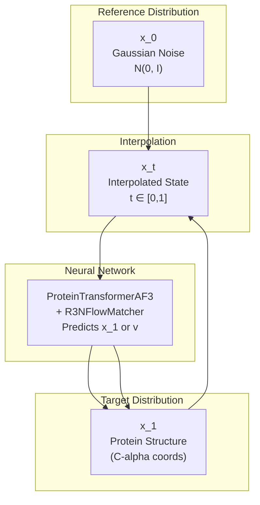

**Key Principles:**

| Concept | Description | Code Reference |
| --- | --- | --- |
| **Reference Distribution** | Standard Gaussian noise in (R³)^n space | [src/model/flow_matching/r3flow.py L365-L398](https://github.com/Junjie-Zhu/IDPFold2/blob/5315b279/src/model/flow_matching/r3flow.py#L365-L398) |
| **Target Distribution** | Real protein structures (C-alpha coordinates) | [src/data/dataset.py L474-L495](https://github.com/Junjie-Zhu/IDPFold2/blob/5315b279/src/data/dataset.py#L474-L495) |
| **Interpolation** | Linear interpolation x_t = (1-t)x_0 + t·x_1 | [src/model/flow_matching/r3flow.py L106-L136](https://github.com/Junjie-Zhu/IDPFold2/blob/5315b279/src/model/flow_matching/r3flow.py#L106-L136) |
| **Vector Field** | Neural network learns v = dx_t/dt | [src/model/flow_matching/r3flow.py L163-L194](https://github.com/Junjie-Zhu/IDPFold2/blob/5315b279/src/model/flow_matching/r3flow.py#L163-L194) |

Sources: [src/model/flow_matching/r3flow.py L1-L666](https://github.com/Junjie-Zhu/IDPFold2/blob/5315b279/src/model/flow_matching/r3flow.py#L1-L666)

 [src/model/integral.py L1-L403](https://github.com/Junjie-Zhu/IDPFold2/blob/5315b279/src/model/integral.py#L1-L403)

 [README.md L6-L12](https://github.com/Junjie-Zhu/IDPFold2/blob/5315b279/README.md?plain=1#L6-L12)

---

## Flow Matching on (R³)^n

Flow matching learns a time-dependent vector field that transforms noise into structured data. IDPFold2 implements flow matching specifically for protein C-alpha coordinates.

### Interpolation Scheme

The system uses **stochastic interpolation** between reference (x_0) and target (x_1) distributions:

```
x_t = (1 - t) * x_0 + t * x_1,  where t ∈ [0, 1]
```

**Centering Constraint:** All coordinates are zero-centered (center of mass = 0) to remove translational degrees of freedom.

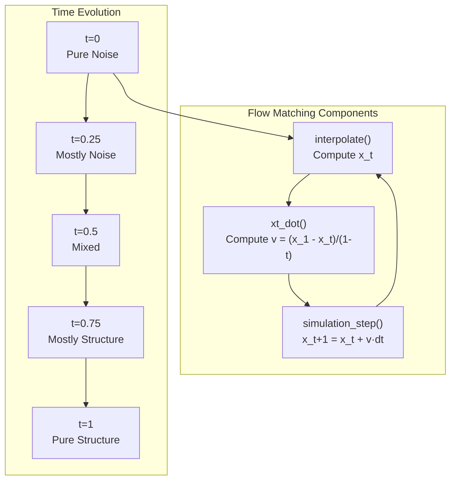

### Vector Field Prediction

The neural network predicts either:

* **x_1** (clean structure directly): Used for direct prediction
* **v** (velocity field): Used for flow matching loss

The relationship is: `v = (x_1 - x_t) / (1 - t)`

**Training Loss:**

```
L_fm = mean(||x_1 - x_1_pred||² * weight(t))
weight(t) = 1 / ((1-t)² + ε)
```

This weighting emphasizes later timesteps where the model refines structure details.

Sources: [src/model/flow_matching/r3flow.py L106-L136](https://github.com/Junjie-Zhu/IDPFold2/blob/5315b279/src/model/flow_matching/r3flow.py#L106-L136)

 [src/model/flow_matching/r3flow.py L163-L194](https://github.com/Junjie-Zhu/IDPFold2/blob/5315b279/src/model/flow_matching/r3flow.py#L163-L194)

 [src/model/integral.py L174-L201](https://github.com/Junjie-Zhu/IDPFold2/blob/5315b279/src/model/integral.py#L174-L201)

### Sampling Modes

During inference, two integration schemes are available:

| Mode | Integration Type | Equation | Use Case |
| --- | --- | --- | --- |
| **vf** | ODE | dx_t = v(x_t, t) dt | Standard generation |
| **sc** | SDE | dx_t = [v + g(t)·s]dt + √(2g(t))dw_t | Stochastic/low-temp sampling |

The **score** s(x_t, t) is derived from the vector field: `s = (t·v - x_t) / ((1-t)·scale_ref²)`

Sources: [src/model/flow_matching/r3flow.py L251-L334](https://github.com/Junjie-Zhu/IDPFold2/blob/5315b279/src/model/flow_matching/r3flow.py#L251-L334)

 [src/model/flow_matching/r3flow.py L335-L363](https://github.com/Junjie-Zhu/IDPFold2/blob/5315b279/src/model/flow_matching/r3flow.py#L335-L363)

### Scheduling

Time discretization schedules control sampling quality:

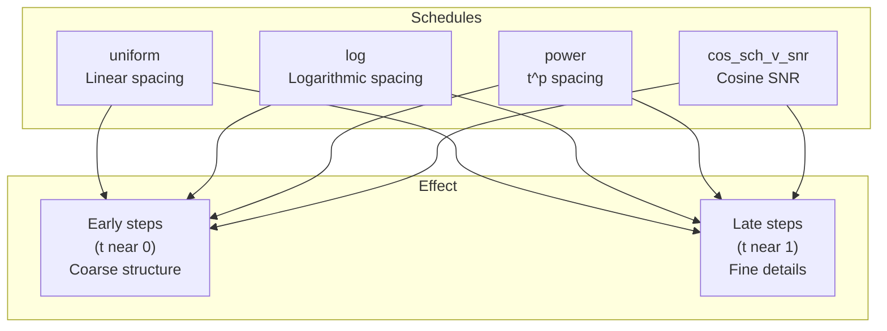

The `get_schedule()` function implements multiple discretization strategies. Log scheduling allocates more steps to early denoising phases.

Sources: [src/model/flow_matching/r3flow.py L612-L666](https://github.com/Junjie-Zhu/IDPFold2/blob/5315b279/src/model/flow_matching/r3flow.py#L612-L666)

 [src/model/flow_matching/r3flow.py L551-L610](https://github.com/Junjie-Zhu/IDPFold2/blob/5315b279/src/model/flow_matching/r3flow.py#L551-L610)

---

## Protein Structure Representation

IDPFold2 operates on coarse-grained protein representations using C-alpha atom coordinates.

### Coordinate Format

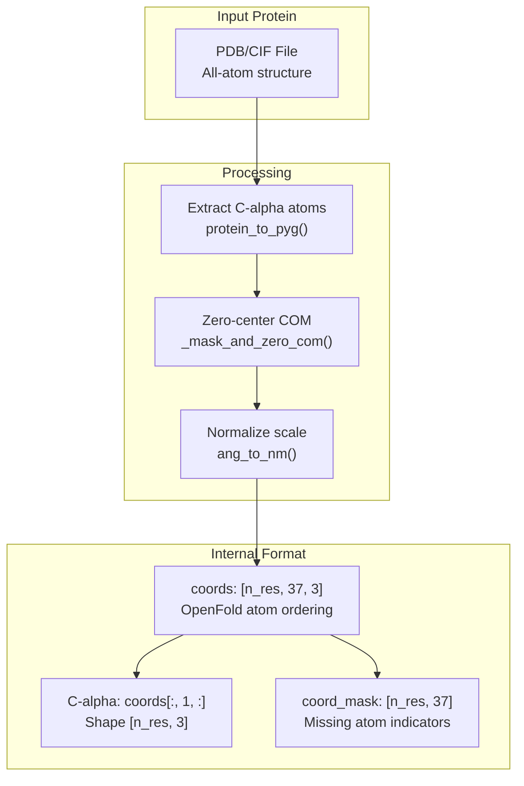

**Key Details:**

* **Atom Convention**: Coordinates use OpenFold ordering, not PDB ordering. Conversion is applied via `PDB_TO_OPENFOLD_INDEX_TENSOR`.
* **C-alpha Focus**: Position index 1 in the 37-atom representation corresponds to C-alpha.
* **Units**: Internally uses nanometers (nm), converted from Ångströms via `ang_to_nm_scale = 10.0`.
* **Masking**: Boolean masks handle variable-length proteins and missing atoms.

Sources: [src/data/dataset.py L474-L495](https://github.com/Junjie-Zhu/IDPFold2/blob/5315b279/src/data/dataset.py#L474-L495)

 [src/model/integral.py L13-L16](https://github.com/Junjie-Zhu/IDPFold2/blob/5315b279/src/model/integral.py#L13-L16)

 [src/model/integral.py L158-L172](https://github.com/Junjie-Zhu/IDPFold2/blob/5315b279/src/model/integral.py#L158-L172)

 [src/common/atom37_constants.py](https://github.com/Junjie-Zhu/IDPFold2/blob/5315b279/src/common/atom37_constants.py)

### Feature Representation

Proteins are represented as graphs with sequence and pair features:

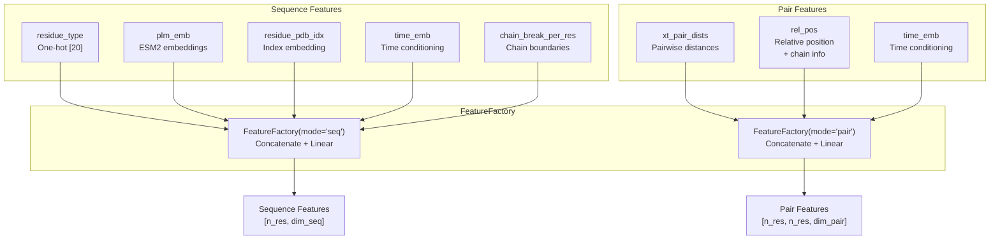

The `FeatureFactory` class dynamically composes features based on configuration:

| Feature Type | Input | Output Dimension | Purpose |
| --- | --- | --- | --- |
| `res_type` | Residue identity (0-19) | 20 | One-hot amino acid type |
| `plm_emb` | ESM2 embeddings | Configurable (default 1280→256) | Sequence context |
| `res_idx` | Residue index | Configurable | Positional information |
| `time_emb` | Timestep t | Configurable | Flow matching time |
| `xt_pair_dists` | C-alpha distances | Configurable | Spatial geometry |
| `rel_pos` | Chain + residue offset | 2 + 2·(r_max + 1) | Relative position |

Sources: [src/model/components/feature_factory.py L303-L425](https://github.com/Junjie-Zhu/IDPFold2/blob/5315b279/src/model/components/feature_factory.py#L303-L425)

 [src/model/components/feature_factory.py L74-L295](https://github.com/Junjie-Zhu/IDPFold2/blob/5315b279/src/model/components/feature_factory.py#L74-L295)

### Data Processing Pipeline

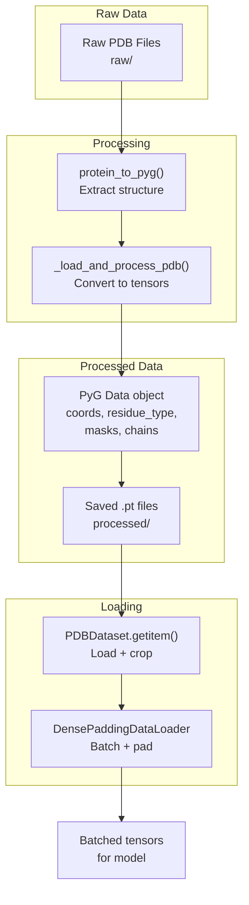

Sources: [src/data/dataset.py L822-L891](https://github.com/Junjie-Zhu/IDPFold2/blob/5315b279/src/data/dataset.py#L822-L891)

 [src/utils/graphein_utils.py](https://github.com/Junjie-Zhu/IDPFold2/blob/5315b279/src/utils/graphein_utils.py)

 [src/utils/dense_dataloader_utils.py](https://github.com/Junjie-Zhu/IDPFold2/blob/5315b279/src/utils/dense_dataloader_utils.py)

---

## Mixture of Experts (MoE)

IDPFold2 uses MoE layers to model heterogeneous protein dynamics by routing different inputs to specialized expert networks.

### MoE Architecture

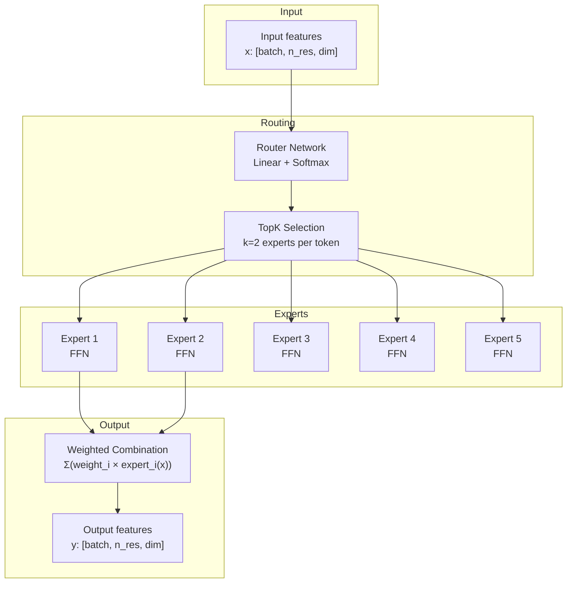

**Configuration:**

* **Number of Experts**: 5 (configurable via `n_experts`)
* **Active Experts**: 2 per token (configurable via `top_k`)
* **Routing**: Softmax-based with learned weights
* **Load Balancing**: Auxiliary loss encourages uniform expert usage

Sources: [src/model/components/moe_modules.py](https://github.com/Junjie-Zhu/IDPFold2/blob/5315b279/src/model/components/moe_modules.py)

 [src/model/integral.py L232-L236](https://github.com/Junjie-Zhu/IDPFold2/blob/5315b279/src/model/integral.py#L232-L236)

### Load Balancing Loss

To prevent expert collapse (all tokens routed to few experts), a load balancing loss is computed:

```
L_moe = weight · balance_loss(routing_weights, num_layers, num_experts, top_k)
```

This loss is accumulated during forward passes and added to the flow matching loss during training.

Sources: [src/model/integral.py L232-L236](https://github.com/Junjie-Zhu/IDPFold2/blob/5315b279/src/model/integral.py#L232-L236)

 [src/model/integral.py L298-L314](https://github.com/Junjie-Zhu/IDPFold2/blob/5315b279/src/model/integral.py#L298-L314)

### MoE Conditioning

During training, MoE can be conditioned on additional labels (e.g., CATH, TED):

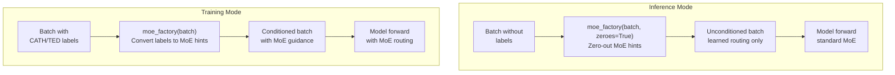

During inference, MoE conditioning can be zeroed out to rely on learned routing patterns.

Sources: [src/model/integral.py L54-L60](https://github.com/Junjie-Zhu/IDPFold2/blob/5315b279/src/model/integral.py#L54-L60)

 [src/model/integral.py L274-L275](https://github.com/Junjie-Zhu/IDPFold2/blob/5315b279/src/model/integral.py#L274-L275)

---

## Training vs Inference Predict Functions

The core prediction logic differs between training and inference modes.

### training_predict()

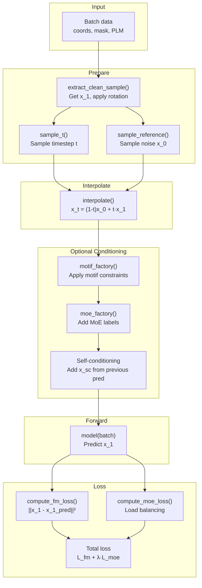

**Key Operations:**

1. **Random Rotation**: Training data is augmented with random SO(3) rotations
2. **Time Sampling**: Timestep t sampled from uniform, logit-normal, or beta distributions
3. **Interpolation**: Create noisy intermediate state x_t
4. **Conditioning**: Apply motif, MoE, or self-conditioning (probabilistic)
5. **Prediction**: Model predicts clean structure x_1
6. **Loss**: Compute flow matching + MoE losses

Sources: [src/model/integral.py L238-L321](https://github.com/Junjie-Zhu/IDPFold2/blob/5315b279/src/model/integral.py#L238-L321)

 [src/model/integral.py L121-L135](https://github.com/Junjie-Zhu/IDPFold2/blob/5315b279/src/model/integral.py#L121-L135)

 [src/model/integral.py L93-L118](https://github.com/Junjie-Zhu/IDPFold2/blob/5315b279/src/model/integral.py#L93-L118)

### generating_predict()

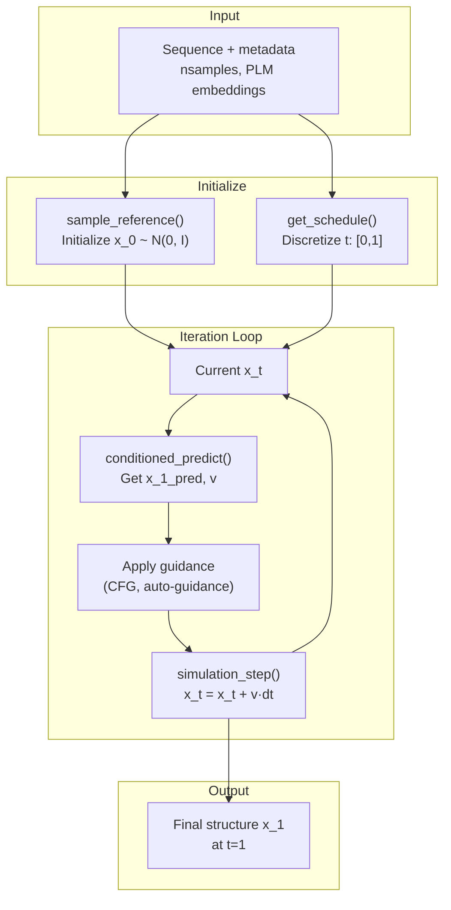

**Key Operations:**

1. **Initialization**: Sample noise x_0 from reference distribution
2. **Schedule**: Discretize time [0,1] into steps (e.g., log, cosine)
3. **Iterative Refinement**: At each step: * Predict vector field v(x_t, t) * Apply guidance (optional) * Integrate: x_{t+dt} = x_t + v·dt
4. **Self-Conditioning**: Optionally use previous prediction x_1_pred as input
5. **Output**: Return refined structure at t=1

Sources: [src/model/integral.py L323-L402](https://github.com/Junjie-Zhu/IDPFold2/blob/5315b279/src/model/integral.py#L323-L402)

 [src/model/integral.py L41-L91](https://github.com/Junjie-Zhu/IDPFold2/blob/5315b279/src/model/integral.py#L41-L91)

 [src/model/flow_matching/r3flow.py L400-L549](https://github.com/Junjie-Zhu/IDPFold2/blob/5315b279/src/model/flow_matching/r3flow.py#L400-L549)

### Comparison Table

| Aspect | Training | Inference |
| --- | --- | --- |
| **Input** | Ground truth structure x_1 | Sequence only |
| **Timestep** | Random t ~ distribution | Sequential t: 0→1 |
| **Direction** | Any t (single step) | Forward integration 0→1 |
| **Augmentation** | Random rotation | None |
| **Conditioning** | Motif, MoE, self-cond (probabilistic) | Guidance, self-cond (systematic) |
| **Output** | Loss for optimization | Generated structure |
| **Function** | `training_predict()` | `generating_predict()` |

Sources: [src/model/integral.py L238-L321](https://github.com/Junjie-Zhu/IDPFold2/blob/5315b279/src/model/integral.py#L238-L321)

 [src/model/integral.py L323-L402](https://github.com/Junjie-Zhu/IDPFold2/blob/5315b279/src/model/integral.py#L323-L402)

---

## Guidance Mechanisms

Inference supports several guidance techniques to improve generation quality.

### Classifier-Free Guidance (CFG)

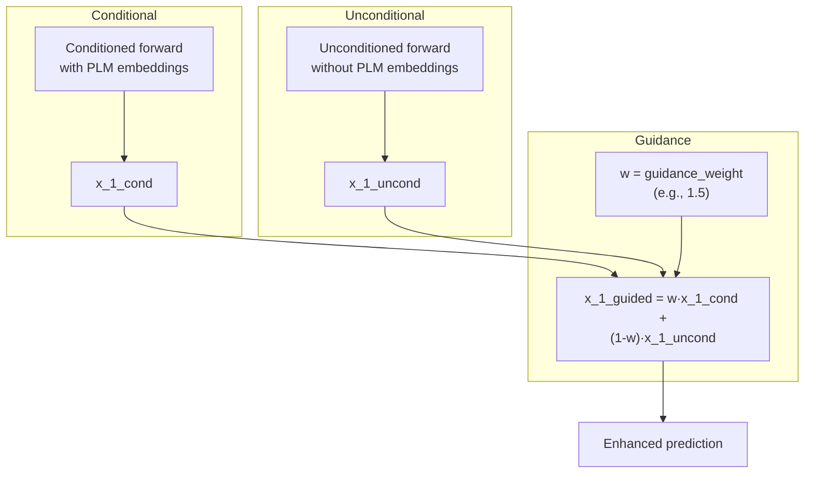

CFG amplifies the effect of conditioning by contrasting conditional and unconditional predictions. Weight > 1 strengthens conditioning influence.

Sources: [src/model/integral.py L65-L87](https://github.com/Junjie-Zhu/IDPFold2/blob/5315b279/src/model/integral.py#L65-L87)

### Auto-Guidance

Uses a secondary model to guide generation:

```
x_1_guided = w·x_1_main + (1-w)·(α·x_1_auto + (1-α)·x_1_uncond)
```

This combines predictions from the main model, an auto-guidance model, and unconditional baseline.

Sources: [src/model/integral.py L66-L72](https://github.com/Junjie-Zhu/IDPFold2/blob/5315b279/src/model/integral.py#L66-L72)

### Self-Conditioning

During iterative generation, the previous prediction can be fed as additional input:

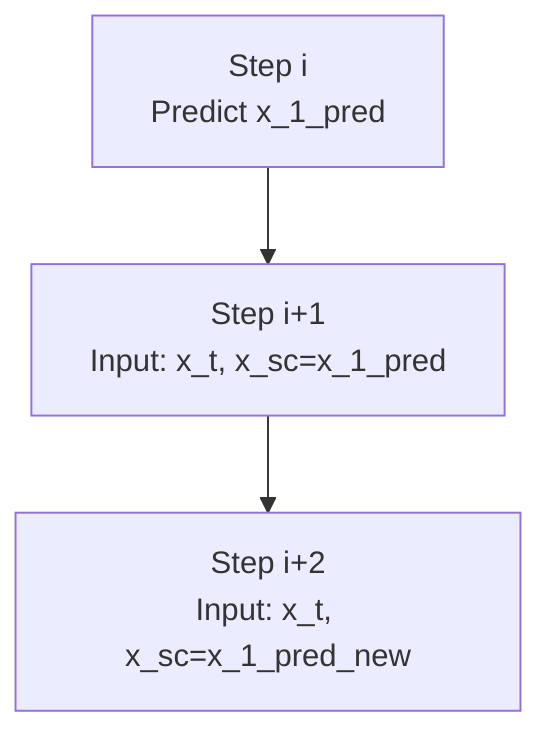

This allows the model to refine predictions based on previous estimates.

Sources: [src/model/integral.py L286-L289](https://github.com/Junjie-Zhu/IDPFold2/blob/5315b279/src/model/integral.py#L286-L289)

 [src/model/integral.py L526-L527](https://github.com/Junjie-Zhu/IDPFold2/blob/5315b279/src/model/integral.py#L526-L527)

---

## Summary

IDPFold2's core concepts integrate to form a powerful generative framework:

1. **Flow Matching**: Continuous transformation from noise to structure via learned vector fields
2. **Protein Representation**: C-alpha coordinates with rich sequence and pair features (PLM embeddings, distances, positional encoding)
3. **Mixture of Experts**: Conditional computation for heterogeneous protein dynamics with load balancing
4. **Training**: Learns to denoise structures at random timesteps with various conditioning strategies
5. **Inference**: Iteratively refines structures from noise using ODE/SDE integration with guidance

These concepts are implemented across the model architecture ([ProteinTransformerAF3](/Junjie-Zhu/IDPFold2/5.1-proteintransformeraf3)), flow matching framework ([R3NFlowMatcher](/Junjie-Zhu/IDPFold2/5.3-flow-matching-framework)), and data pipeline ([Data Pipeline](/Junjie-Zhu/IDPFold2/4-data-pipeline)), working together to generate diverse conformational ensembles.