# Data Loading and Batching

> **Relevant source files**
> * [configs/inference.yaml](https://github.com/Junjie-Zhu/IDPFold2/blob/5315b279/configs/inference.yaml)
> * [environment.yaml](https://github.com/Junjie-Zhu/IDPFold2/blob/5315b279/environment.yaml)
> * [src/data/dataset.py](https://github.com/Junjie-Zhu/IDPFold2/blob/5315b279/src/data/dataset.py)
> * [src/inference.py](https://github.com/Junjie-Zhu/IDPFold2/blob/5315b279/src/inference.py)
> * [src/model/components/moe_modules_torch.py](https://github.com/Junjie-Zhu/IDPFold2/blob/5315b279/src/model/components/moe_modules_torch.py)
> * [src/model/components/moe_operations.py](https://github.com/Junjie-Zhu/IDPFold2/blob/5315b279/src/model/components/moe_operations.py)
> * [src/model/flow_matching/r3flow.py](https://github.com/Junjie-Zhu/IDPFold2/blob/5315b279/src/model/flow_matching/r3flow.py)
> * [src/utils/dense_dataloader_utils.py](https://github.com/Junjie-Zhu/IDPFold2/blob/5315b279/src/utils/dense_dataloader_utils.py)
> * [src/utils/pdb_utils.py](https://github.com/Junjie-Zhu/IDPFold2/blob/5315b279/src/utils/pdb_utils.py)

This page covers the data loading and batching mechanisms in IDPFold2, including the dataset classes (`PDBDataset` for training, `GenerationDataset` for inference), the custom dense padding data loader, and strategies for handling variable-length protein sequences. For information about data preparation and preprocessing, see [Data Preparation and Selection](/Junjie-Zhu/IDPFold2/4.1-data-preparation-and-selection). For details on feature generation including PLM embeddings, see [Feature Generation](/Junjie-Zhu/IDPFold2/4.2-feature-generation).

## Overview

IDPFold2 uses different data loading strategies for training and inference:

* **Training**: `PDBDataset` loads pre-processed protein structures from disk, applies data augmentation through cropping, and handles both single-chain and multi-chain complexes
* **Inference**: `GenerationDataset` loads protein sequences and their PLM embeddings, with on-the-fly embedding generation if needed
* **Batching**: Both use `DensePaddingDataLoader`, which handles variable-length proteins by padding to the maximum length in each batch and creating masks to track valid positions

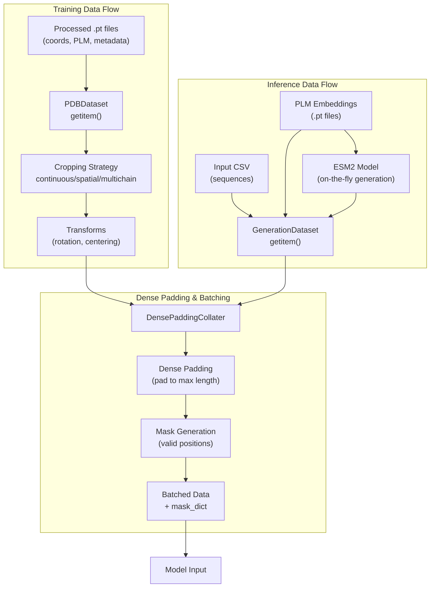

**Sources**: [src/data/dataset.py L338-L626](https://github.com/Junjie-Zhu/IDPFold2/blob/5315b279/src/data/dataset.py#L338-L626)

 [src/inference.py L31-L157](https://github.com/Junjie-Zhu/IDPFold2/blob/5315b279/src/inference.py#L31-L157)

 [src/utils/dense_dataloader_utils.py L401-L447](https://github.com/Junjie-Zhu/IDPFold2/blob/5315b279/src/utils/dense_dataloader_utils.py#L401-L447)

## PDBDataset (Training)

`PDBDataset` is the primary dataset class for training. It loads pre-processed protein structures stored as PyTorch Geometric `Data` objects and applies various transformations including cropping and augmentation.

### Dataset Initialization

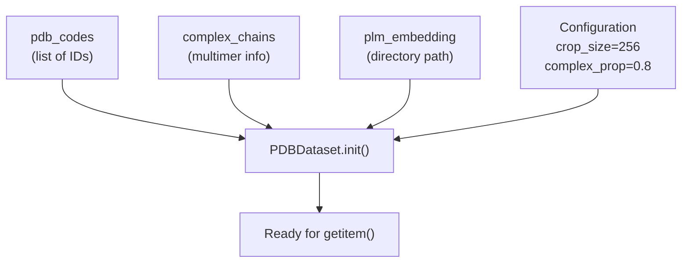

**Key Parameters**:

| Parameter | Type | Description |
| --- | --- | --- |
| `pdb_codes` | `List[str]` | PDB identifiers or filenames |
| `data_dir` | `str` | Path to processed data directory |
| `plm_embedding` | `str` | Path to PLM embedding directory |
| `complex_dir` | `str` | Path to complex chain information (.csv or .pkl) |
| `crop_size` | `int` | Maximum number of residues (default: 256) |
| `complex_prop` | `float` | Probability of building multimer (default: 0.8) |
| `transform` | `Callable` | Optional data transformation function |

**Sources**: [src/data/dataset.py L338-L410](https://github.com/Junjie-Zhu/IDPFold2/blob/5315b279/src/data/dataset.py#L338-L410)

### Data Loading Process

The `__getitem__` method implements the core data loading logic:

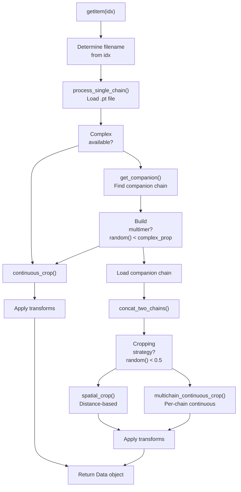

**Sources**: [src/data/dataset.py L414-L452](https://github.com/Junjie-Zhu/IDPFold2/blob/5315b279/src/data/dataset.py#L414-L452)

### Loading Single Chain Data

The `process_single_chain` method loads and prepares individual chains:

```markdown
# Returns processed Data object and complex availability flaggraph, complex_avail = dataset.process_single_chain(fname)
```

**Processing Steps**:

1. Load PyTorch Geometric `Data` object from `.pt` file
2. Filter to essential keys: `residue_type`, `coord_mask`, `coords`, `residue_pdb_idx`, `chains`
3. Load PLM embeddings from separate file based on naming convention
4. Reorder coordinates from PDB to OpenFold convention using `PDB_TO_OPENFOLD_INDEX_TENSOR`

**Sources**: [src/data/dataset.py L474-L495](https://github.com/Junjie-Zhu/IDPFold2/blob/5315b279/src/data/dataset.py#L474-L495)

### Cropping Strategies

IDPFold2 implements three cropping strategies to handle proteins longer than `crop_size`:

#### 1. Continuous Crop (Single Chain)

Randomly selects a continuous segment of residues:

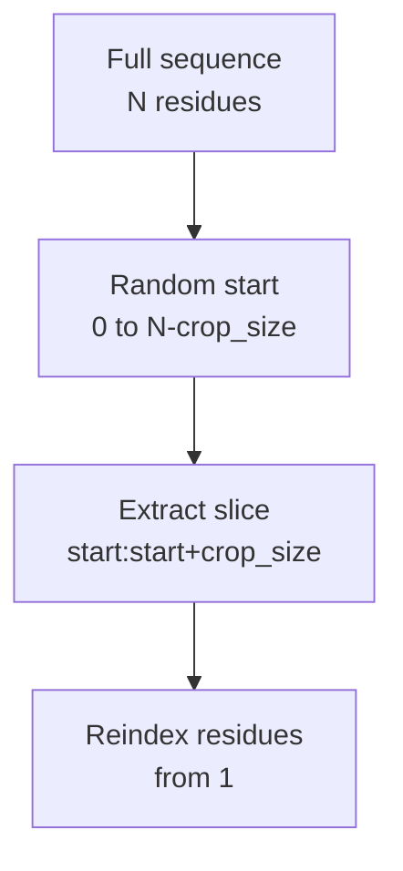

**Sources**: [src/data/dataset.py L591-L615](https://github.com/Junjie-Zhu/IDPFold2/blob/5315b279/src/data/dataset.py#L591-L615)

#### 2. Spatial Crop (Multimer)

Selects residues within a distance threshold of a central residue:

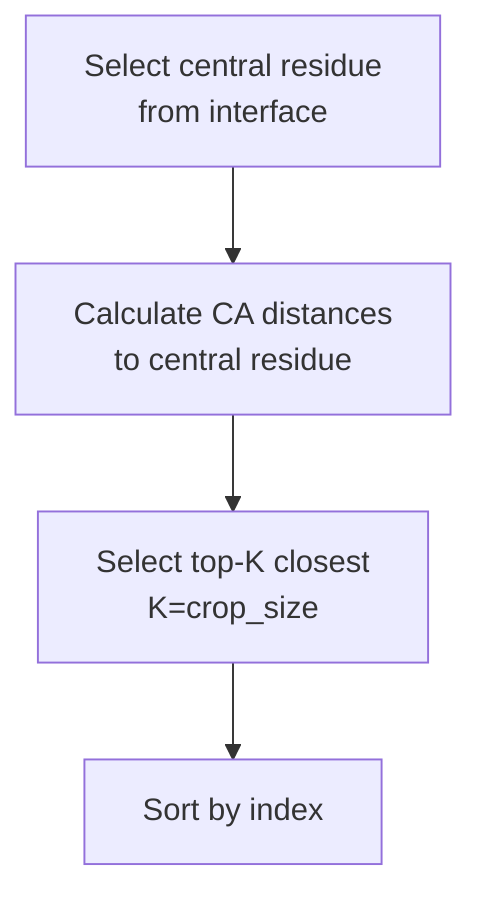

This method is useful for capturing protein-protein interfaces in complexes.

**Sources**: [src/data/dataset.py L513-L538](https://github.com/Junjie-Zhu/IDPFold2/blob/5315b279/src/data/dataset.py#L513-L538)

#### 3. Multichain Continuous Crop

Crops each chain independently with continuous segments:

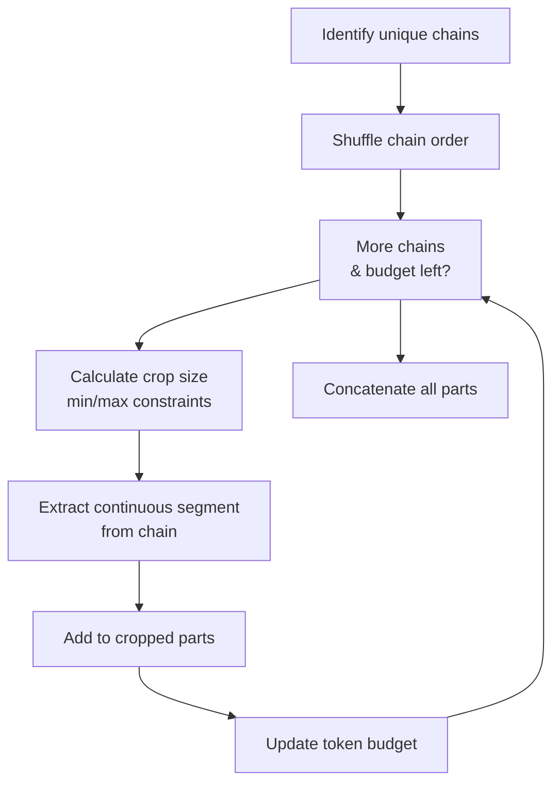

**Algorithm**:

* Randomly shuffle chain order
* For each chain, determine crop size based on remaining budget
* Extract continuous segment from each chain
* Ensure minimum 3 residues per chain
* Stop when reaching `crop_size` total tokens

**Sources**: [src/data/dataset.py L540-L589](https://github.com/Junjie-Zhu/IDPFold2/blob/5315b279/src/data/dataset.py#L540-L589)

### Complex/Multimer Handling

For training on protein complexes, `PDBDataset` can load companion chains:

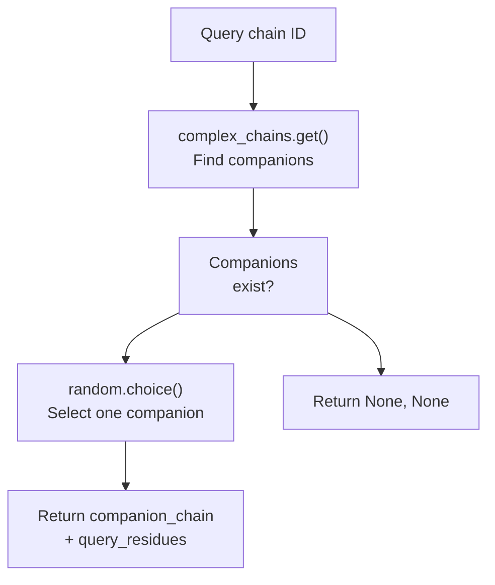

The `complex_chains` dictionary maps query chains to lists of companion information, loaded from a CSV or pickle file containing:

* `companion_chain`: ID of the companion chain
* `query_residues`: Interface residues on the query chain
* `companion_residues`: Interface residues on the companion chain

**Sources**: [src/data/dataset.py L386-L410](https://github.com/Junjie-Zhu/IDPFold2/blob/5315b279/src/data/dataset.py#L386-L410)

 [src/data/dataset.py L454-L460](https://github.com/Junjie-Zhu/IDPFold2/blob/5315b279/src/data/dataset.py#L454-L460)

## GenerationDataset (Inference)

`GenerationDataset` is a simpler dataset class optimized for inference. It loads protein sequences and their PLM embeddings from CSV files.

### Dataset Structure

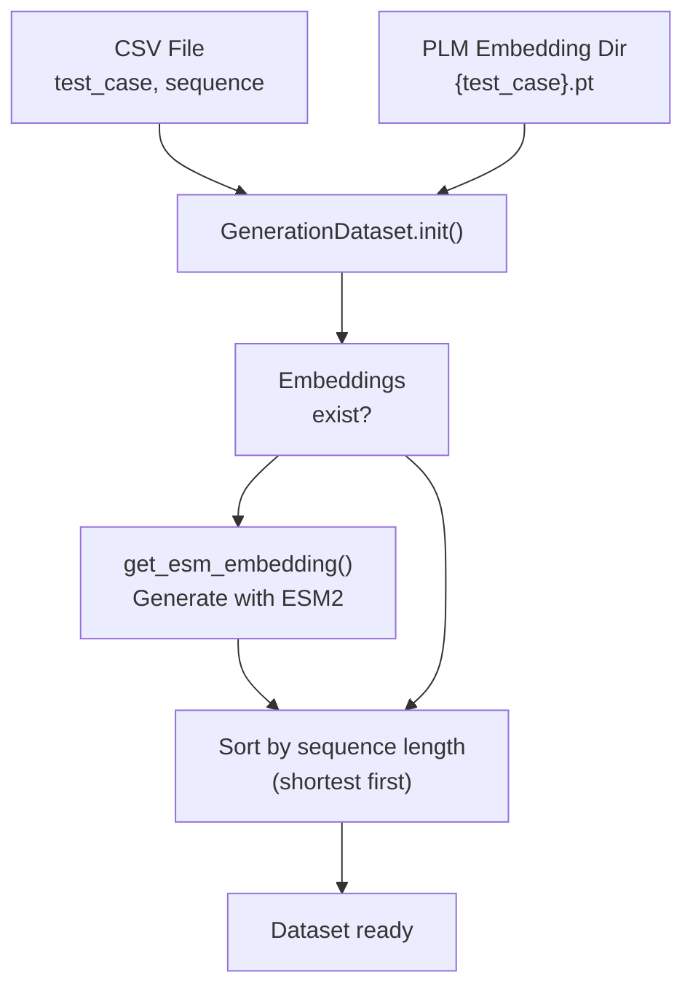

**Sources**: [src/inference.py L31-L81](https://github.com/Junjie-Zhu/IDPFold2/blob/5315b279/src/inference.py#L31-L81)

### Configuration Parameters

| Parameter | Type | Default | Description |
| --- | --- | --- | --- |
| `csv_path` | `str` | Required | Path to CSV with sequences |
| `plm_emb_dir` | `str` | Required | Directory for PLM embeddings |
| `dt` | `float` | 0.005 | Time step for flow matching |
| `nsamples` | `int/List[int]` | 10 | Number of samples to generate |
| `load_multimer` | `bool` | False | Whether to load multi-chain sequences |

**Sources**: [src/inference.py L32-L81](https://github.com/Junjie-Zhu/IDPFold2/blob/5315b279/src/inference.py#L32-L81)

### Data Format

The `__getitem__` method returns a dictionary with the following structure:

**Monomer (single chain)**:

```css
{    "dt": float,                    # Time step    "nsamples": int,                # Number of samples to generate    "nres": int,                    # Number of residues    "plm_emb": torch.Tensor,       # [nres, 1280]    "name": str,                    # Identifier    "residue_type": torch.Tensor,  # [nres] (residue indices)}
```

**Multimer (multiple chains)**:

```css
{    "dt": float,    "nsamples": int,    "nres": int,                    # Total residues across all chains    "plm_emb": torch.Tensor,       # [nres, 1280] (concatenated)    "name": str,                    # Colon-separated chain names    "residue_type": torch.Tensor,  # [nres] (concatenated)    "residue_idx": torch.Tensor,   # [nres] (per-chain indexing)    "chains": torch.Tensor,        # [nres] (chain IDs: 1, 2, 3, ...)}
```

**Sources**: [src/inference.py L85-L115](https://github.com/Junjie-Zhu/IDPFold2/blob/5315b279/src/inference.py#L85-L115)

### On-the-Fly Embedding Generation

If PLM embeddings are not found in `plm_emb_dir`, `GenerationDataset` automatically generates them using ESM2:

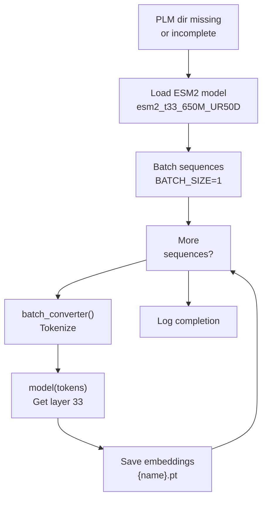

**Key Points**:

* Uses ESM2-650M model (1280-dimensional embeddings)
* Processes sequences in batches (default: 1 per batch)
* Extracts representations from layer 33
* Excludes start/end tokens (`[1:-1]`)
* Saves to disk for reuse

**Sources**: [src/inference.py L117-L157](https://github.com/Junjie-Zhu/IDPFold2/blob/5315b279/src/inference.py#L117-L157)

## DensePaddingDataLoader

`DensePaddingDataLoader` is a custom PyTorch DataLoader that handles variable-length protein sequences by padding them to the maximum length in each batch and creating masks to track valid positions.

### Architecture

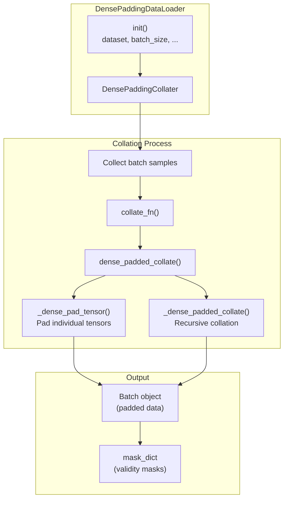

**Sources**: [src/utils/dense_dataloader_utils.py L401-L447](https://github.com/Junjie-Zhu/IDPFold2/blob/5315b279/src/utils/dense_dataloader_utils.py#L401-L447)

### Dense Padding Strategy

The padding process ensures all sequences in a batch have the same length:

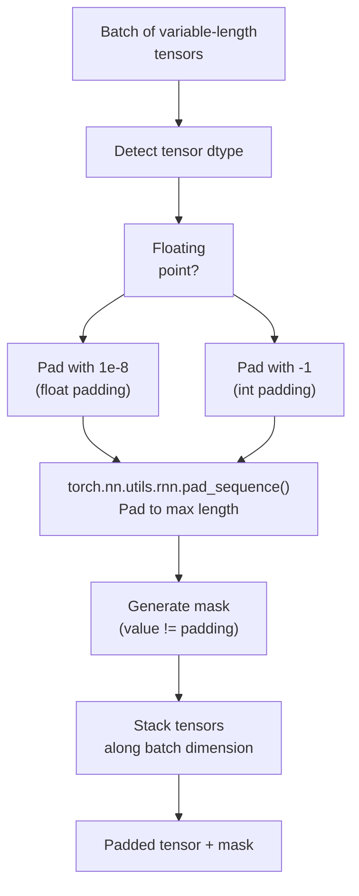

**Padding Values**:

* Float tensors: `1e-8` (small positive value)
* Integer tensors: `-1`
* Boolean tensors: Converted to long, then back with explicit masking

**Sources**: [src/utils/dense_dataloader_utils.py L32-L99](https://github.com/Junjie-Zhu/IDPFold2/blob/5315b279/src/utils/dense_dataloader_utils.py#L32-L99)

### Collation Function Details

The `_dense_padded_collate` function recursively processes different data types:

| Data Type | Handling Strategy |
| --- | --- |
| `torch.Tensor` (non-sparse) | Pad with `_dense_pad_tensor`, create mask |
| `int` or `float` | Convert to `torch.Tensor` |
| `Mapping` (dict) | Recursively collate each key |
| `Sequence` (list) | Recursively collate each element |
| Other | Return as-is (list of values) |

**Special Cases**:

* `edge_index` tensors (shape `[2, num_edges]`): Permute dimensions before padding
* Boolean/uint8 tensors: Convert to long for padding, then back to original dtype

**Sources**: [src/utils/dense_dataloader_utils.py L102-L211](https://github.com/Junjie-Zhu/IDPFold2/blob/5315b279/src/utils/dense_dataloader_utils.py#L102-L211)

### Batch Output Structure

The output of the data loader is a `Batch` object with an attached `mask_dict`:

```css
batch = next(iter(dataloader)) # Batch attributes (example)batch.coords           # [batch_size, max_length, 37, 3] - padded coordinatesbatch.plm_emb          # [batch_size, max_length, 1280] - padded embeddingsbatch.residue_type     # [batch_size, max_length] - padded residue types # Mask dictionarybatch.mask_dict = {    'coords': torch.Tensor,      # [batch_size, max_length] - validity mask    'plm_emb': torch.Tensor,     # [batch_size, max_length] - validity mask    'residue_type': torch.Tensor # [batch_size, max_length] - validity mask}
```

The masks indicate which positions contain valid data (`True`) versus padding (`False`).

**Sources**: [src/utils/dense_dataloader_utils.py L298-L328](https://github.com/Junjie-Zhu/IDPFold2/blob/5315b279/src/utils/dense_dataloader_utils.py#L298-L328)

## PDBDataModule

`PDBDataModule` orchestrates the entire training data pipeline, from data selection to dataloader creation.

### Module Structure

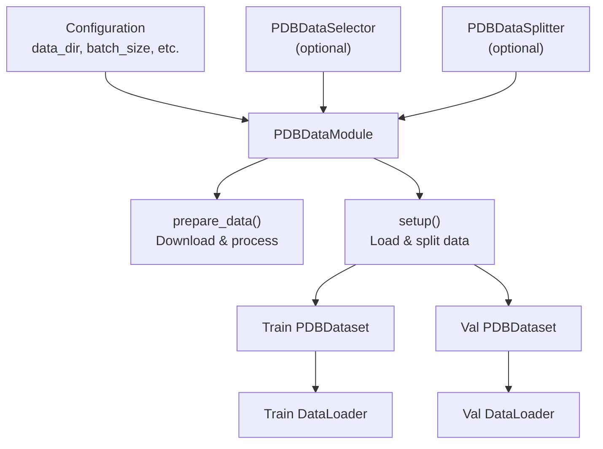

**Sources**: [src/data/dataset.py L628-L780](https://github.com/Junjie-Zhu/IDPFold2/blob/5315b279/src/data/dataset.py#L628-L780)

### DataLoader Creation

The module creates train and validation dataloaders with appropriate settings:

```markdown
# Training dataloadertrain_loader = DensePaddingDataLoader(    dataset=train_dataset,    batch_size=batch_size,    shuffle=True,           # or use ClusterSampler    num_workers=num_workers,    pin_memory=pin_memory) # Validation dataloaderval_loader = DensePaddingDataLoader(    dataset=val_dataset,    batch_size=batch_size,    shuffle=False,    num_workers=num_workers,    pin_memory=pin_memory)
```

**Configuration Parameters**:

| Parameter | Default | Description |
| --- | --- | --- |
| `batch_size` | 32 | Number of proteins per batch |
| `num_workers` | 32 | Parallel workers for data loading |
| `pin_memory` | False | Pin memory for faster GPU transfer |
| `batch_padding` | True | Use dense padding (vs sparse) |

**Sources**: [src/data/dataset.py L628-L677](https://github.com/Junjie-Zhu/IDPFold2/blob/5315b279/src/data/dataset.py#L628-L677)

## Key Differences: Training vs Inference

The training and inference data loading pipelines have distinct characteristics:

| Aspect | Training (`PDBDataset`) | Inference (`GenerationDataset`) |
| --- | --- | --- |
| **Input Source** | Pre-processed `.pt` files | CSV with sequences + PLM embeddings |
| **Data Complexity** | Full atom coordinates (37 atoms) | Only CA coordinates needed |
| **Data Augmentation** | Cropping, rotation, centering | None |
| **Multimer Handling** | Complex pairing with interface info | Simple concatenation of chains |
| **Sorting** | By cluster or random | By sequence length (efficiency) |
| **On-the-Fly Processing** | None (all pre-processed) | Can generate PLM embeddings |
| **Batch Distribution** | Distributed across workers | Single worker, distributed inference |
| **Memory Management** | Cropping to fixed size | Batching by length for efficiency |

**Sources**: [src/data/dataset.py L338-L626](https://github.com/Junjie-Zhu/IDPFold2/blob/5315b279/src/data/dataset.py#L338-L626)

 [src/inference.py L31-L157](https://github.com/Junjie-Zhu/IDPFold2/blob/5315b279/src/inference.py#L31-L157)

## Memory Efficiency Considerations

### Training

* **Cropping**: Limits maximum sequence length to `crop_size` (typically 256)
* **Dense Padding**: Pads to maximum length in each batch
* **Batch Size**: Typically 8-32 proteins per batch
* **Multi-GPU**: Data distributed across devices

### Inference

The inference pipeline includes dynamic batching based on memory constraints:

```markdown
# From inference.pynsamples_per_batch = max(1, args.max_batch_length // inference_dict['nres'][0])
```

This ensures that the total number of residues (`nsamples × nres`) doesn't exceed `max_batch_length` (default: 3500 on V100-32GB).

**Sample Distribution**:

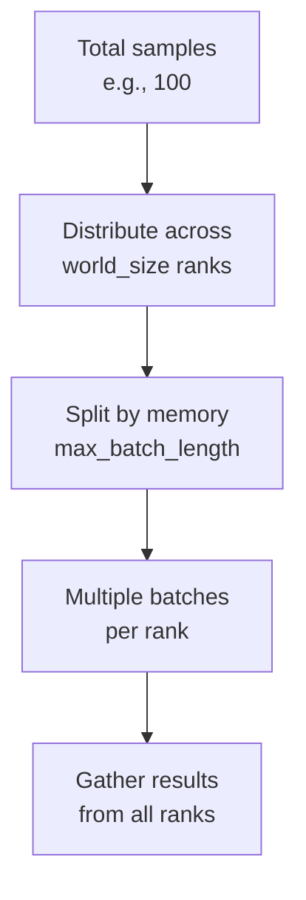

**Sources**: [src/inference.py L265-L295](https://github.com/Junjie-Zhu/IDPFold2/blob/5315b279/src/inference.py#L265-L295)

 [configs/inference.yaml L10](https://github.com/Junjie-Zhu/IDPFold2/blob/5315b279/configs/inference.yaml#L10-L10)