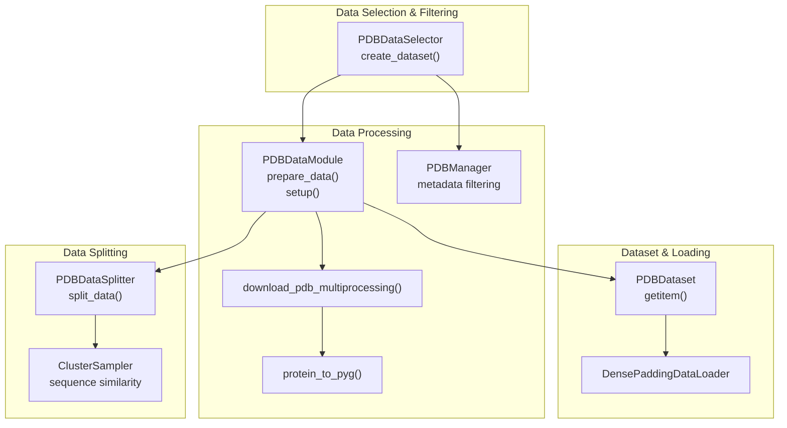
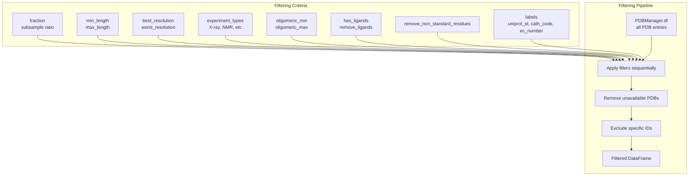
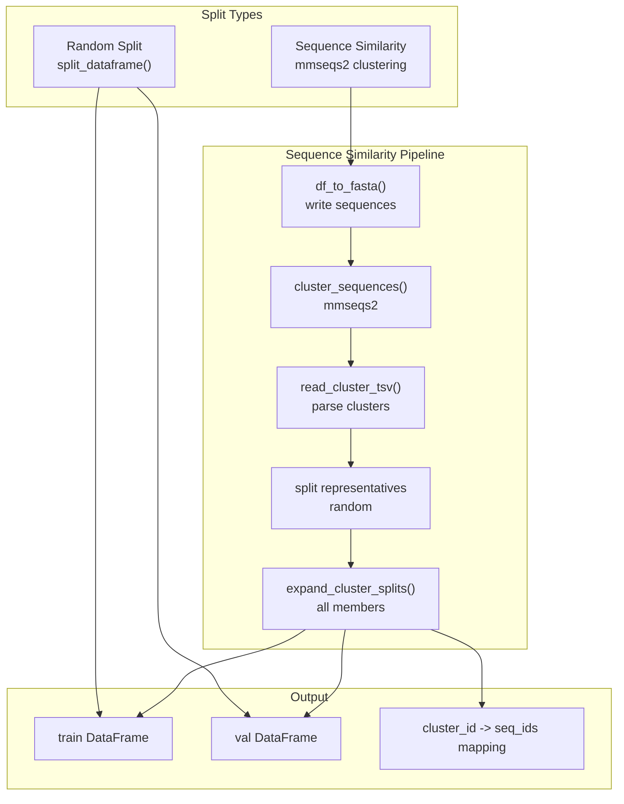
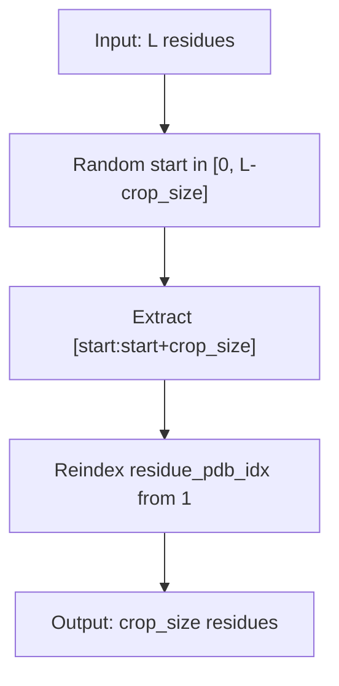
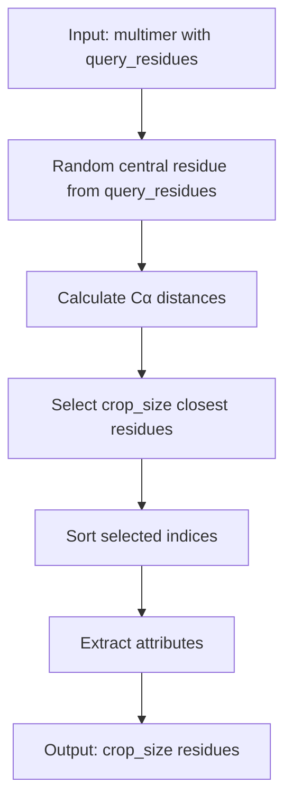
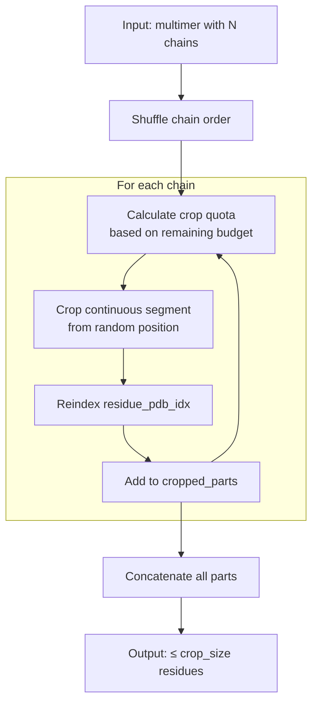
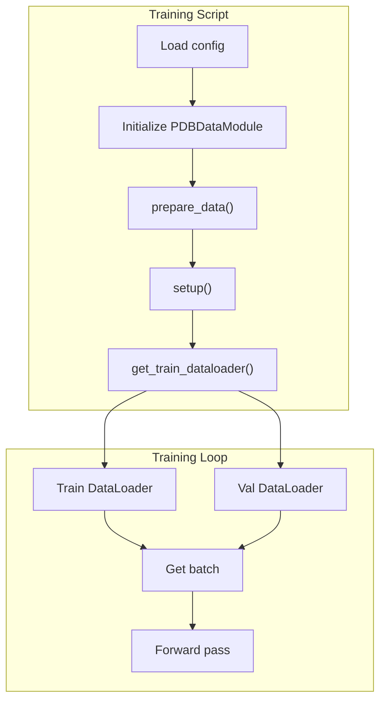

# Data Pipeline

> **Relevant source files**
> * [src/data/dataset.py](https://github.com/Junjie-Zhu/IDPFold2/blob/5315b279/src/data/dataset.py)
> * [src/model/flow_matching/r3flow.py](https://github.com/Junjie-Zhu/IDPFold2/blob/5315b279/src/model/flow_matching/r3flow.py)

## Purpose and Scope

The Data Pipeline is responsible for transforming raw protein structure data into model-ready batches for training and inference. This includes data selection and filtering, train/val splitting with sequence similarity clustering, coordinate processing, PLM embedding integration, and efficient batching with dense padding. The pipeline supports multiple data sources including PDB, mdCATH, IDRome, and AF-CALVADOS datasets.

For details on feature generation including PLM embeddings and coordinate transformations, see [Feature Generation](/Junjie-Zhu/IDPFold2/4.2-feature-generation). For information on data augmentation and transforms, see [Data Transforms and Augmentation](/Junjie-Zhu/IDPFold2/4.4-data-transforms-and-augmentation). For batch loading mechanics, see [Data Loading and Batching](/Junjie-Zhu/IDPFold2/4.3-data-loading-and-batching).

## Data Pipeline Overview

The data pipeline consists of four main classes that work together to prepare training data:



**Sources:** [src/data/dataset.py L46-L1036](https://github.com/Junjie-Zhu/IDPFold2/blob/5315b279/src/data/dataset.py#L46-L1036)

## Component Architecture

### Core Data Classes

| Class | Location | Purpose | Key Methods |
| --- | --- | --- | --- |
| `PDBDataSelector` | [src/data/dataset.py L46-L234](https://github.com/Junjie-Zhu/IDPFold2/blob/5315b279/src/data/dataset.py#L46-L234) | Filters PDB data by metadata criteria | `create_dataset()` |
| `PDBDataSplitter` | [src/data/dataset.py L236-L336](https://github.com/Junjie-Zhu/IDPFold2/blob/5315b279/src/data/dataset.py#L236-L336) | Splits data with sequence similarity control | `split_data()` |
| `PDBDataset` | [src/data/dataset.py L338-L626](https://github.com/Junjie-Zhu/IDPFold2/blob/5315b279/src/data/dataset.py#L338-L626) | PyTorch Dataset for protein structures | `__getitem__()`, cropping methods |
| `PDBDataModule` | [src/data/dataset.py L628-L1036](https://github.com/Junjie-Zhu/IDPFold2/blob/5315b279/src/data/dataset.py#L628-L1036) | Orchestrates entire pipeline | `prepare_data()`, `setup()` |

**Sources:** [src/data/dataset.py L1-L1036](https://github.com/Junjie-Zhu/IDPFold2/blob/5315b279/src/data/dataset.py#L1-L1036)

## Data Selection and Filtering

### PDBDataSelector

The `PDBDataSelector` class filters protein structures from the PDB based on various metadata criteria. It uses `PDBManager` from Graphein for metadata queries.



#### Key Parameters

The selector accepts the following filtering parameters during initialization:

* **`fraction`**: Subsample ratio for the dataset (default: 1.0)
* **`min_length`** / **`max_length`**: Sequence length constraints
* **`best_resolution`** / **`worst_resolution`**: Resolution thresholds in Angstroms
* **`experiment_types`**: List of allowed experimental methods (e.g., `["X-ray diffraction"]`)
* **`oligomeric_min`** / **`oligomeric_max`**: Number of chains in biological assembly
* **`molecule_type`**: Filter by molecule type (e.g., "protein")
* **`has_ligands`** / **`remove_ligands`**: Control presence of specific ligands
* **`remove_non_standard_residues`**: Boolean to exclude non-canonical amino acids
* **`labels`**: Include metadata labels like `"uniprot_id"`, `"cath_code"`, or `"ec_number"`
* **`exclude_ids`**: List of PDB IDs to exclude
* **`exclude_ids_from_file`**: Path to text file with IDs to exclude

**Sources:** [src/data/dataset.py L46-L97](https://github.com/Junjie-Zhu/IDPFold2/blob/5315b279/src/data/dataset.py#L46-L97)

#### Filtering Process

The `create_dataset()` method applies filters sequentially:

1. Initialize `PDBManager` with the data directory [src/data/dataset.py L132-L133](https://github.com/Junjie-Zhu/IDPFold2/blob/5315b279/src/data/dataset.py#L132-L133)
2. Subsample based on `fraction` if specified [src/data/dataset.py L139-L142](https://github.com/Junjie-Zhu/IDPFold2/blob/5315b279/src/data/dataset.py#L139-L142)
3. Filter by experiment types [src/data/dataset.py L144-L148](https://github.com/Junjie-Zhu/IDPFold2/blob/5315b279/src/data/dataset.py#L144-L148)
4. Apply length constraints [src/data/dataset.py L150-L158](https://github.com/Junjie-Zhu/IDPFold2/blob/5315b279/src/data/dataset.py#L150-L158)
5. Filter by molecule type [src/data/dataset.py L160-L165](https://github.com/Junjie-Zhu/IDPFold2/blob/5315b279/src/data/dataset.py#L160-L165)
6. Filter by oligomeric state [src/data/dataset.py L167-L174](https://github.com/Junjie-Zhu/IDPFold2/blob/5315b279/src/data/dataset.py#L167-L174)
7. Filter by resolution [src/data/dataset.py L176-L187](https://github.com/Junjie-Zhu/IDPFold2/blob/5315b279/src/data/dataset.py#L176-L187)
8. Handle ligand requirements [src/data/dataset.py L189-L201](https://github.com/Junjie-Zhu/IDPFold2/blob/5315b279/src/data/dataset.py#L189-L201)
9. Remove non-standard residues if requested [src/data/dataset.py L203-L206](https://github.com/Junjie-Zhu/IDPFold2/blob/5315b279/src/data/dataset.py#L203-L206)
10. Remove structures with unavailable PDB files [src/data/dataset.py L207-L210](https://github.com/Junjie-Zhu/IDPFold2/blob/5315b279/src/data/dataset.py#L207-L210)
11. Remove structures without CATH codes if requested [src/data/dataset.py L211-L215](https://github.com/Junjie-Zhu/IDPFold2/blob/5315b279/src/data/dataset.py#L211-L215)
12. Exclude specific IDs from list or file [src/data/dataset.py L217-L231](https://github.com/Junjie-Zhu/IDPFold2/blob/5315b279/src/data/dataset.py#L217-L231)

Each filtering step logs the number of remaining chains, allowing tracking of data reduction.

**Sources:** [src/data/dataset.py L121-L233](https://github.com/Junjie-Zhu/IDPFold2/blob/5315b279/src/data/dataset.py#L121-L233)

## Data Splitting Strategies

### PDBDataSplitter

The `PDBDataSplitter` class creates train/val/test splits using either random sampling or sequence similarity-based clustering to prevent data leakage.



#### Split Modes

**Random Split** (`split_type="random"`)

Randomly divides the dataset according to the specified `train_val_test` proportions. This is the simplest approach but may lead to data leakage if similar sequences appear in both training and validation sets.

Implementation: [src/data/dataset.py L283-L288](https://github.com/Junjie-Zhu/IDPFold2/blob/5315b279/src/data/dataset.py#L283-L288)

**Sequence Similarity Split** (`split_type="sequence_similarity"`)

Clusters sequences by similarity using MMseqs2, then splits clusters to ensure training and validation sets contain dissimilar sequences. This prevents overfitting to sequence patterns.

Process:

1. Convert DataFrame to FASTA format [src/data/dataset.py L307](https://github.com/Junjie-Zhu/IDPFold2/blob/5315b279/src/data/dataset.py#L307-L307)
2. Run MMseqs2 clustering with specified similarity threshold [src/data/dataset.py L310-L316](https://github.com/Junjie-Zhu/IDPFold2/blob/5315b279/src/data/dataset.py#L310-L316)
3. Select cluster representatives only [src/data/dataset.py L318-L321](https://github.com/Junjie-Zhu/IDPFold2/blob/5315b279/src/data/dataset.py#L318-L321)
4. Randomly split representatives into train/val [src/data/dataset.py L322-L324](https://github.com/Junjie-Zhu/IDPFold2/blob/5315b279/src/data/dataset.py#L322-L324)
5. Expand splits to include all cluster members [src/data/dataset.py L328-L331](https://github.com/Junjie-Zhu/IDPFold2/blob/5315b279/src/data/dataset.py#L328-L331)

The `split_sequence_similarity` parameter controls the clustering threshold (e.g., 0.3 for 30% sequence identity).

**Sources:** [src/data/dataset.py L236-L335](https://github.com/Junjie-Zhu/IDPFold2/blob/5315b279/src/data/dataset.py#L236-L335)

 [src/utils/cluster_utils.py](https://github.com/Junjie-Zhu/IDPFold2/blob/5315b279/src/utils/cluster_utils.py)

#### Output Structure

The `split_data()` method returns a tuple:

* **`dfs_splits`**: Dictionary mapping split names ("train", "val") to DataFrames
* **`clusterid_to_seqid_mappings`**: Dictionary mapping cluster IDs to sequence IDs (only for sequence similarity splits)

**Sources:** [src/data/dataset.py L273-L335](https://github.com/Junjie-Zhu/IDPFold2/blob/5315b279/src/data/dataset.py#L273-L335)

## Dataset Implementation

### PDBDataset

The `PDBDataset` class is a PyTorch `Dataset` that loads processed protein structures and applies cropping, handles multimer complexes, and integrates PLM embeddings.

```mermaid
flowchart TD

GetCompanion["get_companion()<br>random selection"]
GetItem["getitem(idx)"]
LoadChain["process_single_chain()<br>load .pt file"]
LoadPLM["Load PLM embedding<br>from plm_embedding dir"]
CheckComplex["Check complex availability"]
CropSingle["continuous_crop()"]
LoadCompanion["process_single_chain()<br>companion"]
Concat["concat_two_chains()"]
CropMulti["spatial_crop()<br>or multichain_continuous_crop()"]
Transform["Apply transforms"]
Params["pdb_codes<br>chains<br>data_dir<br>plm_embedding<br>complex_dir<br>crop_size"]
ComplexInfo["Load complex_chains.pkl<br>or parse CSV"]

subgraph subGraph3 ["getitem Flow"]
    GetItem
    LoadChain
    LoadPLM
    CheckComplex
    Transform
    GetItem --> LoadChain
    LoadChain --> LoadPLM
    LoadPLM --> CheckComplex
    CheckComplex --> CropSingle
    CheckComplex --> GetCompanion
    CropSingle --> Transform
    CropMulti --> Transform

subgraph subGraph2 ["Multimer Path"]
    GetCompanion
    LoadCompanion
    Concat
    CropMulti
    GetCompanion --> LoadCompanion
    LoadCompanion --> Concat
    Concat --> CropMulti
end

subgraph subGraph1 ["Single Chain Path"]
    CropSingle
end
end

subgraph subGraph0 ["Dataset Initialization"]
    Params
    ComplexInfo
    Params --> ComplexInfo
end
```



**Sources:** [src/data/dataset.py L338-L626](https://github.com/Junjie-Zhu/IDPFold2/blob/5315b279/src/data/dataset.py#L338-L626)

#### Initialization Parameters

| Parameter | Type | Purpose |
| --- | --- | --- |
| `pdb_codes` | `List[str]` | PDB codes to load |
| `chains` | `List[str]` | Specific chains (optional) |
| `data_dir` | `str` | Path to processed data directory |
| `plm_embedding` | `str` | Path to PLM embedding directory |
| `format` | `str` | File format (cif, pdb, mmtf) |
| `file_names` | `List[str]` | Processed file names |
| `complex_dir` | `str` | Path to complex pairing information |
| `complex_prop` | `float` | Probability of using multimer (default: 0.8) |
| `crop_size` | `int` | Maximum sequence length (default: 256) |
| `train_all_atom` | `bool` | Whether to train on all-atom structures |

**Sources:** [src/data/dataset.py L339-L384](https://github.com/Junjie-Zhu/IDPFold2/blob/5315b279/src/data/dataset.py#L339-L384)

#### Data Loading Process

**Single Chain Processing**

The `process_single_chain()` method:

1. Loads the `.pt` file from the `processed/` directory [src/data/dataset.py L476](https://github.com/Junjie-Zhu/IDPFold2/blob/5315b279/src/data/dataset.py#L476-L476)
2. Filters to keep only essential keys: `residue_type`, `coord_mask`, `coords`, `residue_pdb_idx`, `chains` [src/data/dataset.py L479-L480](https://github.com/Junjie-Zhu/IDPFold2/blob/5315b279/src/data/dataset.py#L479-L480)
3. Loads corresponding PLM embedding if available [src/data/dataset.py L482-L490](https://github.com/Junjie-Zhu/IDPFold2/blob/5315b279/src/data/dataset.py#L482-L490)
4. Reorders coordinates from PDB to OpenFold convention [src/data/dataset.py L493-L494](https://github.com/Junjie-Zhu/IDPFold2/blob/5315b279/src/data/dataset.py#L493-L494)

**Sources:** [src/data/dataset.py L474-L495](https://github.com/Junjie-Zhu/IDPFold2/blob/5315b279/src/data/dataset.py#L474-L495)

**Multimer Handling**

For multimer training:

1. Check if the chain has complex pairing information [src/data/dataset.py L433-L448](https://github.com/Junjie-Zhu/IDPFold2/blob/5315b279/src/data/dataset.py#L433-L448)
2. With probability `complex_prop`, retrieve a companion chain [src/data/dataset.py L440-L446](https://github.com/Junjie-Zhu/IDPFold2/blob/5315b279/src/data/dataset.py#L440-L446)
3. Load companion chain [src/data/dataset.py L441](https://github.com/Junjie-Zhu/IDPFold2/blob/5315b279/src/data/dataset.py#L441-L441)
4. Concatenate chains using `concat_two_chains()` [src/data/dataset.py L442](https://github.com/Junjie-Zhu/IDPFold2/blob/5315b279/src/data/dataset.py#L442-L442)
5. Apply spatial or multichain continuous cropping [src/data/dataset.py L443-L446](https://github.com/Junjie-Zhu/IDPFold2/blob/5315b279/src/data/dataset.py#L443-L446)

The `complex_chains` dictionary maps query chains to companion chains with residue indices for contact-based selection.

**Sources:** [src/data/dataset.py L386-L410](https://github.com/Junjie-Zhu/IDPFold2/blob/5315b279/src/data/dataset.py#L386-L410)

 [src/data/dataset.py L454-L460](https://github.com/Junjie-Zhu/IDPFold2/blob/5315b279/src/data/dataset.py#L454-L460)

 [src/data/dataset.py L497-L511](https://github.com/Junjie-Zhu/IDPFold2/blob/5315b279/src/data/dataset.py#L497-L511)

### Cropping Strategies

IDPFold2 implements three cropping strategies to handle variable-length proteins during training:

#### 1. Continuous Crop

Randomly selects a contiguous subsequence of length `crop_size`:



Implementation: [src/data/dataset.py L591-L615](https://github.com/Junjie-Zhu/IDPFold2/blob/5315b279/src/data/dataset.py#L591-L615)

* Generates random start position: [src/data/dataset.py L597](https://github.com/Junjie-Zhu/IDPFold2/blob/5315b279/src/data/dataset.py#L597-L597)
* Slices all tensors with shape `[n_res, ...]`: [src/data/dataset.py L606-L607](https://github.com/Junjie-Zhu/IDPFold2/blob/5315b279/src/data/dataset.py#L606-L607)
* Reindexes `residue_pdb_idx` to start from 1: [src/data/dataset.py L613-L614](https://github.com/Junjie-Zhu/IDPFold2/blob/5315b279/src/data/dataset.py#L613-L614)

**Sources:** [src/data/dataset.py L591-L615](https://github.com/Junjie-Zhu/IDPFold2/blob/5315b279/src/data/dataset.py#L591-L615)

#### 2. Spatial Crop

Selects residues within spatial proximity to a randomly chosen central residue:



Implementation: [src/data/dataset.py L513-L538](https://github.com/Junjie-Zhu/IDPFold2/blob/5315b279/src/data/dataset.py#L513-L538)

* Uses Cα coordinates (index 1) for distance calculation [src/data/dataset.py L518](https://github.com/Junjie-Zhu/IDPFold2/blob/5315b279/src/data/dataset.py#L518-L518)
* Selects `crop_size` closest residues using `torch.topk` [src/data/dataset.py L524](https://github.com/Junjie-Zhu/IDPFold2/blob/5315b279/src/data/dataset.py#L524-L524)
* Maintains residue ordering after selection [src/data/dataset.py L525](https://github.com/Junjie-Zhu/IDPFold2/blob/5315b279/src/data/dataset.py#L525-L525)

This is used for multimer training when the complex has predefined interface residues.

**Sources:** [src/data/dataset.py L513-L538](https://github.com/Junjie-Zhu/IDPFold2/blob/5315b279/src/data/dataset.py#L513-L538)

#### 3. Multichain Continuous Crop

For multimer complexes, crops continuous segments from each chain proportionally:



Implementation: [src/data/dataset.py L540-L589](https://github.com/Junjie-Zhu/IDPFold2/blob/5315b279/src/data/dataset.py#L540-L589)

Key features:

* Randomizes chain processing order [src/data/dataset.py L546](https://github.com/Junjie-Zhu/IDPFold2/blob/5315b279/src/data/dataset.py#L546-L546)
* Dynamically allocates crop budget per chain [src/data/dataset.py L559-L567](https://github.com/Junjie-Zhu/IDPFold2/blob/5315b279/src/data/dataset.py#L559-L567)
* Ensures minimum 3 residues per chain [src/data/dataset.py L565-L567](https://github.com/Junjie-Zhu/IDPFold2/blob/5315b279/src/data/dataset.py#L565-L567)
* Reindexes residues to start from 1 per chain [src/data/dataset.py L576](https://github.com/Junjie-Zhu/IDPFold2/blob/5315b279/src/data/dataset.py#L576-L576)

**Sources:** [src/data/dataset.py L540-L589](https://github.com/Junjie-Zhu/IDPFold2/blob/5315b279/src/data/dataset.py#L540-L589)

## PDBDataModule Workflow

### Pipeline Orchestration

The `PDBDataModule` class coordinates the entire data preparation and loading pipeline.

```mermaid
flowchart TD

Config["PDBDataModule config<br>data_dir, batch_size, etc"]
DirSetup["Create raw/ and processed/ dirs"]
CheckCSV["Check if dataset CSV exists"]
CreateDataset["PDBDataSelector.create_dataset()"]
DownloadPDB["_download_structure_data()"]
ProcessStructures["_process_structure_data()"]
SaveCSV["Save dataset CSV"]
LoadCSV["Load dataset CSV"]
SplitData["PDBDataSplitter.split_data()"]
StoreSplits["Store dfs_splits and cluster mappings"]
CreateTrainDS["_get_dataset('train')"]
CreateValDS["_get_dataset('val')"]
CreateTrainDL["_get_dataloader() with ClusterSampler"]
CreateValDL["_get_dataloader()"]

DirSetup --> CheckCSV
SaveCSV --> LoadCSV
CheckCSV --> LoadCSV
StoreSplits --> CreateTrainDS
StoreSplits --> CreateValDS

subgraph get_train_dataloader() ["get_train_dataloader()"]
    CreateTrainDS
    CreateValDS
    CreateTrainDL
    CreateValDL
    CreateTrainDS --> CreateTrainDL
    CreateValDS --> CreateValDL
end

subgraph setup() ["setup()"]
    LoadCSV
    SplitData
    StoreSplits
    LoadCSV --> SplitData
    SplitData --> StoreSplits
end

subgraph prepare_data() ["prepare_data()"]
    CheckCSV
    CreateDataset
    DownloadPDB
    ProcessStructures
    SaveCSV
    CheckCSV --> CreateDataset
    CreateDataset --> DownloadPDB
    DownloadPDB --> ProcessStructures
    ProcessStructures --> SaveCSV
end

subgraph Initialization ["Initialization"]
    Config
    DirSetup
    Config --> DirSetup
end
```

**Sources:** [src/data/dataset.py L628-L1036](https://github.com/Junjie-Zhu/IDPFold2/blob/5315b279/src/data/dataset.py#L628-L1036)

### Key Methods

#### prepare_data()

Responsible for downloading and processing raw structure files:

1. Check if dataset CSV exists [src/data/dataset.py L704-L708](https://github.com/Junjie-Zhu/IDPFold2/blob/5315b279/src/data/dataset.py#L704-L708)
2. If not, create dataset using `PDBDataSelector` [src/data/dataset.py L710](https://github.com/Junjie-Zhu/IDPFold2/blob/5315b279/src/data/dataset.py#L710-L710)
3. Download PDB files using `download_pdb_multiprocessing()` [src/data/dataset.py L712-L714](https://github.com/Junjie-Zhu/IDPFold2/blob/5315b279/src/data/dataset.py#L712-L714)
4. Process structures into PyTorch Geometric format [src/data/dataset.py L716-L718](https://github.com/Junjie-Zhu/IDPFold2/blob/5315b279/src/data/dataset.py#L716-L718)
5. Save dataset CSV for future use [src/data/dataset.py L721-L722](https://github.com/Junjie-Zhu/IDPFold2/blob/5315b279/src/data/dataset.py#L721-L722)

For user-provided datasets (no `dataselector`), it scans the `raw/` directory for PDB files [src/data/dataset.py L724-L740](https://github.com/Junjie-Zhu/IDPFold2/blob/5315b279/src/data/dataset.py#L724-L740)

**Sources:** [src/data/dataset.py L700-L740](https://github.com/Junjie-Zhu/IDPFold2/blob/5315b279/src/data/dataset.py#L700-L740)

#### _process_structure_data()

Converts raw PDB/CIF/MMTF files to PyTorch Geometric graphs:

1. Create list of structures to process (skip existing) [src/data/dataset.py L784-L795](https://github.com/Junjie-Zhu/IDPFold2/blob/5315b279/src/data/dataset.py#L784-L795)
2. Process in parallel using multiprocessing `Pool` or sequentially [src/data/dataset.py L798-L817](https://github.com/Junjie-Zhu/IDPFold2/blob/5315b279/src/data/dataset.py#L798-L817)
3. Each structure is processed by `_load_and_process_pdb()` [src/data/dataset.py L799-L802](https://github.com/Junjie-Zhu/IDPFold2/blob/5315b279/src/data/dataset.py#L799-L802)

**Sources:** [src/data/dataset.py L782-L820](https://github.com/Junjie-Zhu/IDPFold2/blob/5315b279/src/data/dataset.py#L782-L820)

#### _load_and_process_pdb()

Processes a single PDB file:

1. Load structure using `protein_to_pyg()` from Graphein utils [src/data/dataset.py L863-L870](https://github.com/Junjie-Zhu/IDPFold2/blob/5315b279/src/data/dataset.py#L863-L870)
2. Create coordinate mask (marks valid vs missing atoms) [src/data/dataset.py L878-L879](https://github.com/Junjie-Zhu/IDPFold2/blob/5315b279/src/data/dataset.py#L878-L879)
3. Convert residue names to indices using `resname_to_idx` [src/data/dataset.py L880-L882](https://github.com/Junjie-Zhu/IDPFold2/blob/5315b279/src/data/dataset.py#L880-L882)
4. Compute average B-factor per residue [src/data/dataset.py L884](https://github.com/Junjie-Zhu/IDPFold2/blob/5315b279/src/data/dataset.py#L884-L884)
5. Extract residue PDB indices from `residue_id` strings [src/data/dataset.py L885-L887](https://github.com/Junjie-Zhu/IDPFold2/blob/5315b279/src/data/dataset.py#L885-L887)
6. Add sequential position indices [src/data/dataset.py L888](https://github.com/Junjie-Zhu/IDPFold2/blob/5315b279/src/data/dataset.py#L888-L888)
7. Save as `.pt` file [src/data/dataset.py L890](https://github.com/Junjie-Zhu/IDPFold2/blob/5315b279/src/data/dataset.py#L890-L890)

**Sources:** [src/data/dataset.py L822-L891](https://github.com/Junjie-Zhu/IDPFold2/blob/5315b279/src/data/dataset.py#L822-L891)

#### setup()

Loads dataset and creates train/val splits:

1. Load dataset CSV if not already loaded [src/data/dataset.py L679-L687](https://github.com/Junjie-Zhu/IDPFold2/blob/5315b279/src/data/dataset.py#L679-L687)
2. Call `PDBDataSplitter.split_data()` to create splits [src/data/dataset.py L690-L692](https://github.com/Junjie-Zhu/IDPFold2/blob/5315b279/src/data/dataset.py#L690-L692)
3. Store split DataFrames and cluster mappings [src/data/dataset.py L690-L692](https://github.com/Junjie-Zhu/IDPFold2/blob/5315b279/src/data/dataset.py#L690-L692)

**Sources:** [src/data/dataset.py L678-L692](https://github.com/Junjie-Zhu/IDPFold2/blob/5315b279/src/data/dataset.py#L678-L692)

#### _get_dataloader()

Creates PyTorch DataLoader with optional cluster sampling:

1. Check sampling mode (`"random"`, `"cluster-random"`, or `"cluster-reps"`) [src/data/dataset.py L982-L999](https://github.com/Junjie-Zhu/IDPFold2/blob/5315b279/src/data/dataset.py#L982-L999)
2. If sequence similarity splits exist and mode is not random, use `ClusterSampler` [src/data/dataset.py L986-L992](https://github.com/Junjie-Zhu/IDPFold2/blob/5315b279/src/data/dataset.py#L986-L992)
3. Choose `DensePaddingDataLoader` or standard `DataLoader` based on `batch_padding` [src/data/dataset.py L1001](https://github.com/Junjie-Zhu/IDPFold2/blob/5315b279/src/data/dataset.py#L1001-L1001)
4. Configure with batch size, sampler, num_workers, etc. [src/data/dataset.py L1003-L1011](https://github.com/Junjie-Zhu/IDPFold2/blob/5315b279/src/data/dataset.py#L1003-L1011)

**Sources:** [src/data/dataset.py L966-L1011](https://github.com/Junjie-Zhu/IDPFold2/blob/5315b279/src/data/dataset.py#L966-L1011)

### Cluster Sampling Modes

When using sequence similarity splits, three sampling modes control how clusters are sampled:

| Mode | Behavior | Use Case |
| --- | --- | --- |
| `"random"` | Sample any sequence randomly | No cluster control, fastest |
| `"cluster-random"` | Sample full clusters randomly | Ensures entire cluster in batch |
| `"cluster-reps"` | Sample only cluster representatives | Reduces redundancy, diverse batches |

The `ClusterSampler` class implements these strategies using the `clusterid_to_seqid_mapping` from the splitter.

**Sources:** [src/data/dataset.py L986-L999](https://github.com/Junjie-Zhu/IDPFold2/blob/5315b279/src/data/dataset.py#L986-L999)

 [src/utils/cluster_utils.py](https://github.com/Junjie-Zhu/IDPFold2/blob/5315b279/src/utils/cluster_utils.py)

## Data Directory Structure

The data pipeline expects and creates the following directory structure:

```markdown
data_dir/
├── raw/                          # Raw PDB/CIF/MMTF files
│   ├── 1abc.cif
│   ├── 1xyz.cif.gz
│   └── ...
├── processed/                    # Processed PyG graphs
│   ├── 1abc_A.pt               # Single chain
│   ├── 1xyz_B.pt
│   └── ...
├── plm_embeddings/              # PLM embeddings (optional)
│   ├── 1abc_A.pt
│   └── ...
├── complex_chains.pkl           # Multimer pairing info (optional)
├── df_pdb_*.csv                 # Dataset metadata CSV
├── sequences_*.fasta            # Sequences for clustering
├── clusters_*.fasta             # Cluster representatives
└── clusters_*.tsv               # Cluster membership
```

**Sources:** [src/data/dataset.py L99-L100](https://github.com/Junjie-Zhu/IDPFold2/blob/5315b279/src/data/dataset.py#L99-L100)

 [src/data/dataset.py L651-L654](https://github.com/Junjie-Zhu/IDPFold2/blob/5315b279/src/data/dataset.py#L651-L654)

## Configuration Example

Here's how the data pipeline components are typically configured:

```python
# Example configuration (from train.yaml structure)data:  data_dir: "/path/to/data"  batch_size: 32  num_workers: 32  crop_size: 256  complex_prop: 0.8  plm_embedding: "/path/to/esm2_embeddings"    # Data selection  dataselector:    fraction: 1.0    min_length: 20    max_length: 512    experiment_types: ["X-ray diffraction"]    best_resolution: 0.0    worst_resolution: 3.5    remove_non_standard_residues: true      # Data splitting  datasplitter:    train_val_test: [0.95, 0.05]    split_type: "sequence_similarity"    split_sequence_similarity: 0.3      # Sampling  sampling_mode: "cluster-random"
```

**Sources:** [src/data/dataset.py L46-L97](https://github.com/Junjie-Zhu/IDPFold2/blob/5315b279/src/data/dataset.py#L46-L97)

 [src/data/dataset.py L236-L261](https://github.com/Junjie-Zhu/IDPFold2/blob/5315b279/src/data/dataset.py#L236-L261)

 [src/data/dataset.py L628-L677](https://github.com/Junjie-Zhu/IDPFold2/blob/5315b279/src/data/dataset.py#L628-L677)

## Integration with Training

The data pipeline integrates with the training loop through the following flow:



The training script (e.g., `src/train.py`) uses the data module to obtain dataloaders, which are then iterated during training. Each batch contains:

* `coords`: Atomic coordinates `[batch, n_res, 37, 3]`
* `residue_type`: Residue type indices `[batch, n_res]`
* `coord_mask`: Valid atom mask `[batch, n_res, 37]`
* `plm_emb`: PLM embeddings `[batch, n_res, embedding_dim]`
* `residue_pdb_idx`: Residue numbering `[batch, n_res]`
* `chains`: Chain IDs `[batch, n_res]`

**Sources:** [src/data/dataset.py L628-L1036](https://github.com/Junjie-Zhu/IDPFold2/blob/5315b279/src/data/dataset.py#L628-L1036)