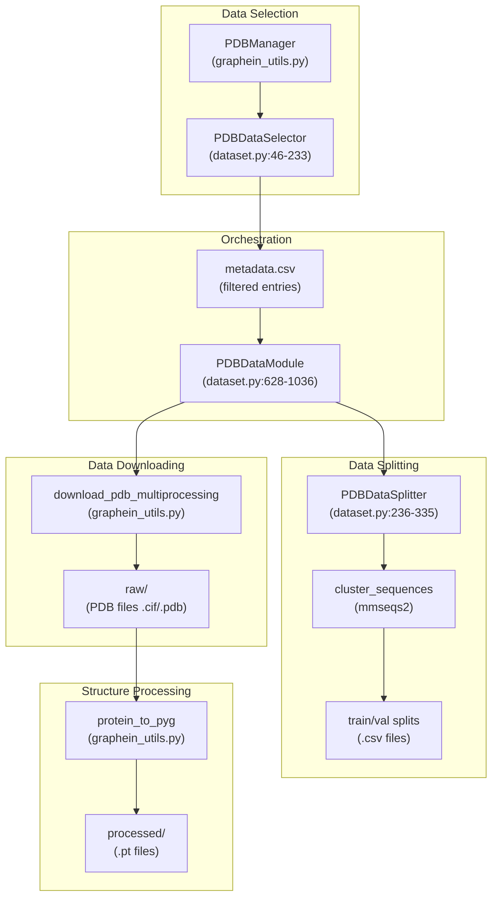
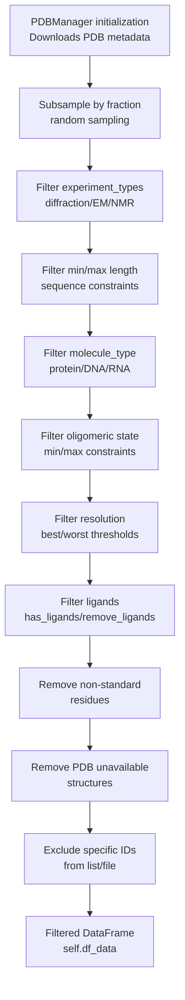
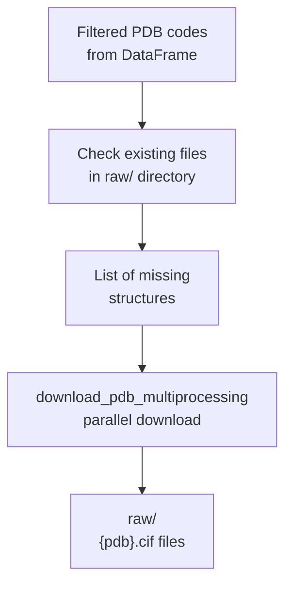
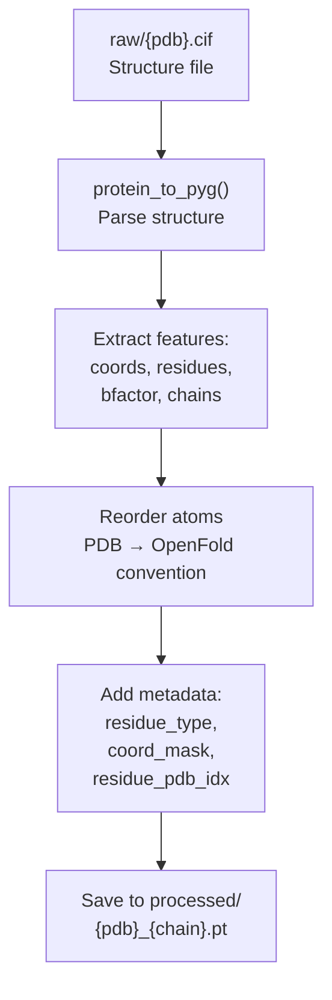
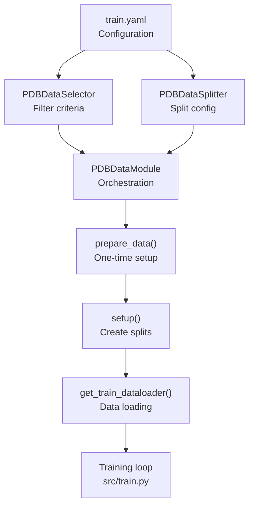

# Data Preparation and Selection

> **Relevant source files**
> * [README.md](https://github.com/Junjie-Zhu/IDPFold2/blob/5315b279/README.md?plain=1)
> * [src/data/dataset.py](https://github.com/Junjie-Zhu/IDPFold2/blob/5315b279/src/data/dataset.py)
> * [src/model/flow_matching/r3flow.py](https://github.com/Junjie-Zhu/IDPFold2/blob/5315b279/src/model/flow_matching/r3flow.py)

## Purpose and Scope

This page documents the data preparation and selection subsystem of IDPFold2, which handles the initial stages of the data pipeline: filtering protein structures from PDB based on metadata criteria, downloading structure files, and preprocessing them into model-ready formats. This system is primarily used during training to create datasets from PDB and custom structure sources.

For information about feature generation (PLM embeddings, coordinate processing), see [Feature Generation](/Junjie-Zhu/IDPFold2/4.2-feature-generation). For details on data loading and batching during training/inference, see [Data Loading and Batching](/Junjie-Zhu/IDPFold2/4.3-data-loading-and-batching). For data transformations applied during training, see [Data Transforms and Augmentation](/Junjie-Zhu/IDPFold2/4.4-data-transforms-and-augmentation).

---

## System Overview

The data preparation system consists of three main components that work sequentially:



**Sources:** [src/data/dataset.py L46-L1036](https://github.com/Junjie-Zhu/IDPFold2/blob/5315b279/src/data/dataset.py#L46-L1036)

 [src/utils/graphein_utils.py](https://github.com/Junjie-Zhu/IDPFold2/blob/5315b279/src/utils/graphein_utils.py)

 [README.md L116-L161](https://github.com/Junjie-Zhu/IDPFold2/blob/5315b279/README.md?plain=1#L116-L161)

---

## Data Selection with PDBDataSelector

The `PDBDataSelector` class filters protein structures from PDB based on metadata criteria. It uses `PDBManager` (from graphein utilities) to query and filter the PDB database.

### Initialization Parameters

The selector accepts extensive filtering criteria:

| Parameter | Type | Purpose | Example |
| --- | --- | --- | --- |
| `data_dir` | str | Root directory for dataset | `/path/to/dataset` |
| `molecule_type` | str | Filter by molecule type | `"protein"` |
| `experiment_types` | List[str] | Filter by experimental method | `["diffraction", "EM"]` |
| `min_length` / `max_length` | int | Sequence length constraints | `50` / `1024` |
| `oligomeric_min` / `oligomeric_max` | int | Oligomeric state filter | `1` / `10` |
| `best_resolution` / `worst_resolution` | float | Resolution constraints (Å) | `0.0` / `3.5` |
| `remove_non_standard_residues` | bool | Exclude non-standard amino acids | `True` |
| `remove_pdb_unavailable` | bool | Exclude unavailable structures | `True` |
| `exclude_ids` | List[str] | Explicitly exclude PDB IDs | `["1abc", "2xyz"]` |
| `fraction` | float | Random subsample fraction | `1.0` (all data) |

**Sources:** [src/data/dataset.py L46-L119](https://github.com/Junjie-Zhu/IDPFold2/blob/5315b279/src/data/dataset.py#L46-L119)

### Filtering Workflow



**Sources:** [src/data/dataset.py L121-L233](https://github.com/Junjie-Zhu/IDPFold2/blob/5315b279/src/data/dataset.py#L121-L233)

### Implementation Details

The `create_dataset()` method applies filters sequentially:

1. **Initialize PDBManager**: Downloads/loads PDB metadata [src/data/dataset.py L132-L133](https://github.com/Junjie-Zhu/IDPFold2/blob/5315b279/src/data/dataset.py#L132-L133)
2. **Subsample**: Random sampling if `fraction < 1.0` [src/data/dataset.py L138-L142](https://github.com/Junjie-Zhu/IDPFold2/blob/5315b279/src/data/dataset.py#L138-L142)
3. **Apply filters**: Each filter reduces the DataFrame [src/data/dataset.py L144-L215](https://github.com/Junjie-Zhu/IDPFold2/blob/5315b279/src/data/dataset.py#L144-L215)
4. **Exclude IDs**: Remove explicitly excluded structures [src/data/dataset.py L217-L231](https://github.com/Junjie-Zhu/IDPFold2/blob/5315b279/src/data/dataset.py#L217-L231)
5. **Return DataFrame**: Contains `pdb`, `chain`, and metadata columns [src/data/dataset.py L232-L233](https://github.com/Junjie-Zhu/IDPFold2/blob/5315b279/src/data/dataset.py#L232-L233)

After filtering, the DataFrame is passed to `PDBDataModule` for downloading and processing.

**Sources:** [src/data/dataset.py L121-L233](https://github.com/Junjie-Zhu/IDPFold2/blob/5315b279/src/data/dataset.py#L121-L233)

---

## Data Downloading

Structure files are downloaded in parallel using multiprocessing:



### Download Process

The `_download_structure_data()` method handles downloading:

1. **Identify missing files**: Check which PDB codes are not in `raw/` directory [src/data/dataset.py L895-L906](https://github.com/Junjie-Zhu/IDPFold2/blob/5315b279/src/data/dataset.py#L895-L906)
2. **Parallel download**: Use `download_pdb_multiprocessing` with configurable workers [src/data/dataset.py L920-L926](https://github.com/Junjie-Zhu/IDPFold2/blob/5315b279/src/data/dataset.py#L920-L926)
3. **File format**: Defaults to `.cif` format, also supports `.pdb`, `.mmtf`, `.ent` [src/data/dataset.py L913-L915](https://github.com/Junjie-Zhu/IDPFold2/blob/5315b279/src/data/dataset.py#L913-L915)
4. **Skip existing**: If not `overwrite=True`, skips already-downloaded files [src/data/dataset.py L896-L905](https://github.com/Junjie-Zhu/IDPFold2/blob/5315b279/src/data/dataset.py#L896-L905)

**Sources:** [src/data/dataset.py L893-L930](https://github.com/Junjie-Zhu/IDPFold2/blob/5315b279/src/data/dataset.py#L893-L930)

---

## Structure Processing

Raw PDB files are converted to PyTorch Geometric `Data` objects and saved as `.pt` files:



### Processing Pipeline

The `_load_and_process_pdb()` method processes each structure:

1. **Load structure**: Use `protein_to_pyg()` to parse PDB/CIF file [src/data/dataset.py L863-L870](https://github.com/Junjie-Zhu/IDPFold2/blob/5315b279/src/data/dataset.py#L863-L870)
2. **Extract features**: Coordinates, residue types, B-factors, chain IDs [src/data/dataset.py L863-L870](https://github.com/Junjie-Zhu/IDPFold2/blob/5315b279/src/data/dataset.py#L863-L870)
3. **Convert residue types**: Map 3-letter codes to indices using `resname_to_idx` [src/data/dataset.py L880-L882](https://github.com/Junjie-Zhu/IDPFold2/blob/5315b279/src/data/dataset.py#L880-L882)
4. **Reorder coordinates**: Convert from PDB atom ordering to OpenFold convention (done later in `PDBDataset`) [src/data/dataset.py L493-L494](https://github.com/Junjie-Zhu/IDPFold2/blob/5315b279/src/data/dataset.py#L493-L494)
5. **Add metadata**: Database identifier, sequence position, PDB residue indices [src/data/dataset.py L883-L888](https://github.com/Junjie-Zhu/IDPFold2/blob/5315b279/src/data/dataset.py#L883-L888)
6. **Save**: Store as `.pt` file in `processed/` directory [src/data/dataset.py L890](https://github.com/Junjie-Zhu/IDPFold2/blob/5315b279/src/data/dataset.py#L890-L890)

### Parallel Processing

Processing uses multiprocessing for efficiency:

* **Workers**: Configurable via `num_workers` parameter [src/data/dataset.py L804-L817](https://github.com/Junjie-Zhu/IDPFold2/blob/5315b279/src/data/dataset.py#L804-L817)
* **Chunking**: Work is divided into chunks for load balancing [src/data/dataset.py L805-L810](https://github.com/Junjie-Zhu/IDPFold2/blob/5315b279/src/data/dataset.py#L805-L810)
* **Progress tracking**: Uses `tqdm` for progress monitoring [src/data/dataset.py L808-L815](https://github.com/Junjie-Zhu/IDPFold2/blob/5315b279/src/data/dataset.py#L808-L815)
* **Error handling**: Failed structures are logged but don't stop processing [src/data/dataset.py L872-L874](https://github.com/Junjie-Zhu/IDPFold2/blob/5315b279/src/data/dataset.py#L872-L874)

**Sources:** [src/data/dataset.py L782-L891](https://github.com/Junjie-Zhu/IDPFold2/blob/5315b279/src/data/dataset.py#L782-L891)

---

## Dataset Organization

The data preparation system creates a specific directory structure:

```markdown
data_dir/
├── raw/
│   ├── 1abc.cif
│   ├── 2xyz.cif
│   └── ...
├── processed/
│   ├── 1abc_A.pt
│   ├── 1abc_B.pt
│   ├── 2xyz_A.pt
│   └── ...
├── df_pdb_*.csv              # Metadata for all structures
├── seq_df_pdb_*.csv          # Sequences for clustering
├── cluster_seqid_0.5_*.tsv   # Sequence similarity clusters
├── cluster_seqid_0.5_*.fasta # Cluster representatives
└── complex_chains.pkl        # Inter-chain contact info (optional)
```

### File Naming Conventions

| File Type | Naming Pattern | Purpose |
| --- | --- | --- |
| Raw structures | `{pdb}.cif` | Original structure files |
| Processed chains | `{pdb}_{chain}.pt` | Individual chain features |
| Metadata CSV | `df_pdb_f{fraction}_minl{min}_maxl{max}_....csv` | Filtered structure metadata |
| Sequence CSV | `seq_{data_dir_name}.csv` | Sequences for clustering |
| Cluster TSV | `cluster_seqid_{similarity}_{data_dir}.tsv` | Cluster assignments |
| Cluster FASTA | `cluster_seqid_{similarity}_{data_dir}.fasta` | Cluster representatives |

**Sources:** [src/data/dataset.py L99-L101](https://github.com/Junjie-Zhu/IDPFold2/blob/5315b279/src/data/dataset.py#L99-L101)

 [src/data/dataset.py L650-L654](https://github.com/Junjie-Zhu/IDPFold2/blob/5315b279/src/data/dataset.py#L650-L654)

 [src/data/dataset.py L768-L780](https://github.com/Junjie-Zhu/IDPFold2/blob/5315b279/src/data/dataset.py#L768-L780)

---

## Data Splitting with PDBDataSplitter

The `PDBDataSplitter` class creates train/validation splits using sequence similarity clustering to prevent data leakage:

```

```

### Split Types

**Random Split** [src/data/dataset.py L283-L288](https://github.com/Junjie-Zhu/IDPFold2/blob/5315b279/src/data/dataset.py#L283-L288)

* Directly splits DataFrame into train/val proportions
* No sequence similarity considerations
* Fast but may lead to data leakage

**Sequence Similarity Split** [src/data/dataset.py L290-L331](https://github.com/Junjie-Zhu/IDPFold2/blob/5315b279/src/data/dataset.py#L290-L331)

* Clusters sequences at specified identity threshold (e.g., 50%)
* Splits cluster representatives randomly
* Expands to include all cluster members
* Prevents data leakage from similar sequences

### Clustering Implementation

The sequence similarity split uses mmseqs2 via utility functions:

1. **Generate FASTA**: Convert DataFrame to FASTA format [src/data/dataset.py L306-L307](https://github.com/Junjie-Zhu/IDPFold2/blob/5315b279/src/data/dataset.py#L306-L307)
2. **Run mmseqs2**: Cluster at specified identity threshold [src/data/dataset.py L309-L316](https://github.com/Junjie-Zhu/IDPFold2/blob/5315b279/src/data/dataset.py#L309-L316)
3. **Parse clusters**: Read TSV mapping cluster IDs to sequence IDs [src/data/dataset.py L326](https://github.com/Junjie-Zhu/IDPFold2/blob/5315b279/src/data/dataset.py#L326-L326)
4. **Split representatives**: Random split of cluster representatives [src/data/dataset.py L322-L324](https://github.com/Junjie-Zhu/IDPFold2/blob/5315b279/src/data/dataset.py#L322-L324)
5. **Expand clusters**: Assign all cluster members to same split [src/data/dataset.py L328-L331](https://github.com/Junjie-Zhu/IDPFold2/blob/5315b279/src/data/dataset.py#L328-L331)

### Configuration

| Parameter | Purpose | Default |
| --- | --- | --- |
| `split_type` | "random" or "sequence_similarity" | "random" |
| `train_val_test` | Split proportions | `[0.95, 0.05]` |
| `split_sequence_similarity` | Clustering threshold (0-1) | `0.5` |
| `overwrite_sequence_clusters` | Regenerate clusters | `False` |

**Sources:** [src/data/dataset.py L236-L335](https://github.com/Junjie-Zhu/IDPFold2/blob/5315b279/src/data/dataset.py#L236-L335)

 [src/utils/cluster_utils.py](https://github.com/Junjie-Zhu/IDPFold2/blob/5315b279/src/utils/cluster_utils.py)

---

## Integration with PDBDataModule

`PDBDataModule` orchestrates the entire data preparation pipeline:

```mermaid
flowchart TD

INIT["PDBDataModule.init()<br>Store config parameters"]
SEL["PDBDataSelector.create_dataset()<br>Filter structures"]
DOWN["_download_structure_data()<br>Download PDB files"]
PROC["_process_structure_data()<br>Convert to .pt files"]
META["Save metadata CSV<br>{data_dir}.csv"]
LOAD["Load metadata CSV<br>pd.read_csv()"]
SPLIT["PDBDataSplitter.split_data()<br>Create train/val splits"]
DATASET["PDBDataset<br>Load .pt files"]
LOADER["DensePaddingDataLoader<br>Batch data"]

INIT --> SEL
META --> LOAD
SPLIT --> DATASET

subgraph get_train_dataloader() ["get_train_dataloader()"]
    DATASET
    LOADER
    DATASET --> LOADER
end

subgraph setup() ["setup()"]
    LOAD
    SPLIT
    LOAD --> SPLIT
end

subgraph prepare_data() ["prepare_data()"]
    SEL
    DOWN
    PROC
    META
    SEL --> DOWN
    DOWN --> PROC
    PROC --> META
end

subgraph Initialization ["Initialization"]
    INIT
end
```

### Workflow Methods

**`prepare_data()`** [src/data/dataset.py L700-L740](https://github.com/Junjie-Zhu/IDPFold2/blob/5315b279/src/data/dataset.py#L700-L740)

* Called once before training starts
* Handles data selection, downloading, and preprocessing
* Creates metadata CSV file
* Idempotent: skips if files already exist (unless `overwrite=True`)

**`setup()`** [src/data/dataset.py L678-L692](https://github.com/Junjie-Zhu/IDPFold2/blob/5315b279/src/data/dataset.py#L678-L692)

* Called after `prepare_data()`
* Loads metadata CSV
* Creates train/val splits using `PDBDataSplitter`
* Stores split DataFrames for later use

**`get_train_dataloader()`** [src/data/dataset.py L1013-L1035](https://github.com/Junjie-Zhu/IDPFold2/blob/5315b279/src/data/dataset.py#L1013-L1035)

* Creates `PDBDataset` instances for train and val splits
* Wraps in `DensePaddingDataLoader` for batching
* Returns tuple of (train_loader, val_loader)

### Configuration Example

```markdown
data_module = PDBDataModule(    data_dir="/path/to/dataset",    dataselector=PDBDataSelector(        data_dir="/path/to/dataset",        molecule_type="protein",        experiment_types=["diffraction", "EM"],        min_length=50,        max_length=1024,        worst_resolution=3.5,        remove_non_standard_residues=True,    ),    datasplitter=PDBDataSplitter(        split_type="sequence_similarity",        split_sequence_similarity=0.5,        train_val_test=[0.99, 0.01],    ),    format="cif",    batch_size=8,    num_workers=32,) # Execute preparationdata_module.prepare_data()  # Downloads and processesdata_module.setup()          # Creates splitstrain_dl, val_dl = data_module.get_train_dataloader()
```

**Sources:** [src/data/dataset.py L628-L1036](https://github.com/Junjie-Zhu/IDPFold2/blob/5315b279/src/data/dataset.py#L628-L1036)

 [src/train.py L97-L143](https://github.com/Junjie-Zhu/IDPFold2/blob/5315b279/src/train.py#L97-L143)

---

## Custom Dataset Preparation

For custom datasets (simulation data, mdCATH, IDRome, etc.), the system can process existing structure files:

### Custom Dataset Workflow

1. **Place files**: Put `.pdb` or `.cif` files in `data_dir/raw/` directory
2. **Set dataselector to None**: Skip PDB filtering [src/data/dataset.py L724-L740](https://github.com/Junjie-Zhu/IDPFold2/blob/5315b279/src/data/dataset.py#L724-L740)
3. **Run prepare_data()**: System auto-detects files in `raw/` [src/data/dataset.py L742-L766](https://github.com/Junjie-Zhu/IDPFold2/blob/5315b279/src/data/dataset.py#L742-L766)
4. **Processing**: Structures are converted to `.pt` files [src/data/dataset.py L733-L737](https://github.com/Junjie-Zhu/IDPFold2/blob/5315b279/src/data/dataset.py#L733-L737)
5. **Metadata creation**: Generates CSV with filenames [src/data/dataset.py L739-L740](https://github.com/Junjie-Zhu/IDPFold2/blob/5315b279/src/data/dataset.py#L739-L740)

### Custom Dataset Code Path

The `_load_pdb_folder_data()` method handles custom datasets:

```python
def _load_pdb_folder_data(self, data_dir: pathlib.Path) -> pd.DataFrame:    # Get all files with specified format    pdb_files = list(data_dir.glob(f"*.{self.format}"))        # Create DataFrame with filenames    df_data = pd.DataFrame({        'pdb': [pdb_file.stem for pdb_file in pdb_files],        'id': [pdb_file.stem for pdb_file in pdb_files],    })        return df_data
```

This allows seamless processing of any structure collection without PDB database queries.

**Sources:** [src/data/dataset.py L742-L766](https://github.com/Junjie-Zhu/IDPFold2/blob/5315b279/src/data/dataset.py#L742-L766)

 [README.md L156-L161](https://github.com/Junjie-Zhu/IDPFold2/blob/5315b279/README.md?plain=1#L156-L161)

---

## Multimer Data Preparation

For training on protein complexes, the system supports inter-chain contact information:

### Multimer Configuration

```markdown
data_module = PDBDataModule(    ...,    complex_dir="/path/to/contacts.csv",  # Inter-chain contacts    complex_prop=0.8,  # Probability of using multimer)
```

### Contact File Format

The `contacts.csv` file contains inter-chain residue contacts:

| Column | Type | Description |
| --- | --- | --- |
| `chain1` | str | First chain identifier |
| `chain2` | str | Second chain identifier |
| `residue_chain1` | List[int] | Contacting residues in chain1 |
| `residue_chain2` | List[int] | Contacting residues in chain2 |

### Processing

The contact information is loaded and indexed for efficient lookup:

1. **Load CSV**: Read contact information [src/data/dataset.py L386-L390](https://github.com/Junjie-Zhu/IDPFold2/blob/5315b279/src/data/dataset.py#L386-L390)
2. **Parse lists**: Convert string representations to Python lists [src/data/dataset.py L389-L390](https://github.com/Junjie-Zhu/IDPFold2/blob/5315b279/src/data/dataset.py#L389-L390)
3. **Create lookup**: Build dictionary mapping chain IDs to companion chains [src/data/dataset.py L392-L397](https://github.com/Junjie-Zhu/IDPFold2/blob/5315b279/src/data/dataset.py#L392-L397)
4. **Save index**: Cache as `.pkl` for faster loading [src/data/dataset.py L399-L401](https://github.com/Junjie-Zhu/IDPFold2/blob/5315b279/src/data/dataset.py#L399-L401)

During training, chains are randomly paired according to `complex_prop` probability.

**Sources:** [src/data/dataset.py L386-L409](https://github.com/Junjie-Zhu/IDPFold2/blob/5315b279/src/data/dataset.py#L386-L409)

 [README.md L185-L194](https://github.com/Junjie-Zhu/IDPFold2/blob/5315b279/README.md?plain=1#L185-L194)

---

## Training Integration

The complete data preparation is invoked in the training script:



### Training Script Usage

```sql
# From src/train.py # Optional: Create dataselector for PDB datadataselector = PDBDataSelector(    data_dir=args.data.data_dir,    fraction=args.data.fraction,    molecule_type=args.data.molecule_type,    experiment_types=args.data.experiment_types,    min_length=args.data.min_length,    max_length=args.data.max_length,    # ... other filters) if args.data.molecule_type is not None else None # Create data moduledata_module = PDBDataModule(    data_dir=args.data.data_dir,    dataselector=dataselector,    datasplitter=PDBDataSplitter(        split_type="sequence_similarity",        split_sequence_similarity=0.5,        train_val_test=[0.99, 0.01],    ),    # ... other parameters) # Execute data preparation (only runs once)data_module.prepare_data()data_module.setup() # Get dataloaderstrain_dl, val_dl = data_module.get_train_dataloader()
```

**Sources:** [src/train.py L97-L143](https://github.com/Junjie-Zhu/IDPFold2/blob/5315b279/src/train.py#L97-L143)

 [README.md L162-L183](https://github.com/Junjie-Zhu/IDPFold2/blob/5315b279/README.md?plain=1#L162-L183)

---

## Performance Considerations

### Parallelization

* **Download workers**: Set via `num_workers` parameter [src/data/dataset.py L920-L926](https://github.com/Junjie-Zhu/IDPFold2/blob/5315b279/src/data/dataset.py#L920-L926)
* **Processing workers**: Configurable for structure parsing [src/data/dataset.py L804-L817](https://github.com/Junjie-Zhu/IDPFold2/blob/5315b279/src/data/dataset.py#L804-L817)
* **Chunk size**: Automatically calculated for load balancing [src/data/dataset.py L805](https://github.com/Junjie-Zhu/IDPFold2/blob/5315b279/src/data/dataset.py#L805-L805)

### Caching and Reuse

* **Skip existing downloads**: Checks `raw/` directory before downloading [src/data/dataset.py L895-L906](https://github.com/Junjie-Zhu/IDPFold2/blob/5315b279/src/data/dataset.py#L895-L906)
* **Skip existing processing**: Checks `processed/` directory before converting [src/data/dataset.py L784-L795](https://github.com/Junjie-Zhu/IDPFold2/blob/5315b279/src/data/dataset.py#L784-L795)
* **Reuse cluster files**: Avoids re-clustering unless `overwrite=True` [src/data/dataset.py L305-L316](https://github.com/Junjie-Zhu/IDPFold2/blob/5315b279/src/data/dataset.py#L305-L316)
* **Metadata persistence**: CSV files enable quick setup on subsequent runs [src/data/dataset.py L704-L707](https://github.com/Junjie-Zhu/IDPFold2/blob/5315b279/src/data/dataset.py#L704-L707)

### Resource Usage

| Operation | Memory | Disk | Time |
| --- | --- | --- | --- |
| PDB metadata query | ~500 MB | Minimal | ~1 min |
| Download 10K structures | Minimal | ~50 GB | ~30 min (32 workers) |
| Process 10K structures | ~2 GB per worker | ~10 GB | ~60 min (32 workers) |
| Sequence clustering | ~4 GB | ~1 GB | ~10 min (10K sequences) |

**Sources:** [src/data/dataset.py L804-L926](https://github.com/Junjie-Zhu/IDPFold2/blob/5315b279/src/data/dataset.py#L804-L926)

---

## Summary

The data preparation and selection subsystem provides a complete pipeline from raw PDB data to model-ready features:

1. **`PDBDataSelector`**: Filters structures using extensive metadata criteria
2. **Download**: Parallel downloading of missing structure files
3. **Processing**: Converts structures to PyTorch Geometric format
4. **`PDBDataSplitter`**: Creates train/val splits with sequence similarity clustering
5. **`PDBDataModule`**: Orchestrates the entire workflow
6. **Custom datasets**: Supports arbitrary structure collections
7. **Multimer support**: Handles inter-chain contact information

The system is designed for efficiency with extensive caching, parallel processing, and idempotent operations. Once prepared, the processed data can be quickly loaded for training without re-downloading or re-processing.

**Sources:** [src/data/dataset.py](https://github.com/Junjie-Zhu/IDPFold2/blob/5315b279/src/data/dataset.py)

 [README.md L116-L161](https://github.com/Junjie-Zhu/IDPFold2/blob/5315b279/README.md?plain=1#L116-L161)

 [src/train.py L97-L143](https://github.com/Junjie-Zhu/IDPFold2/blob/5315b279/src/train.py#L97-L143)