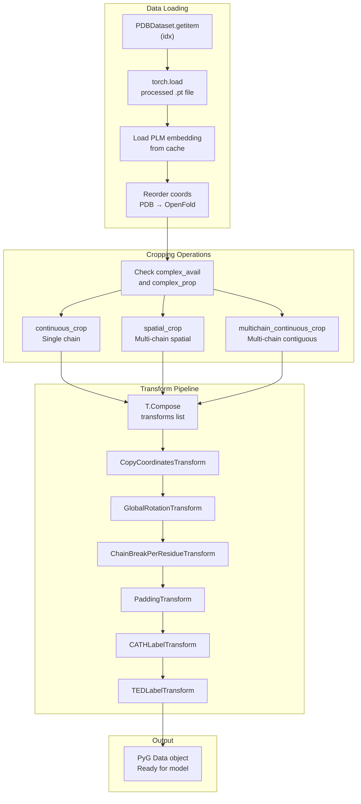
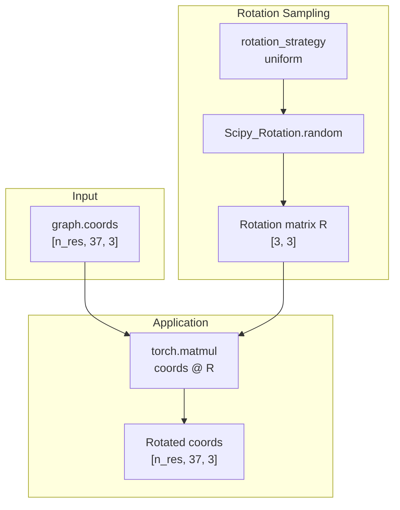
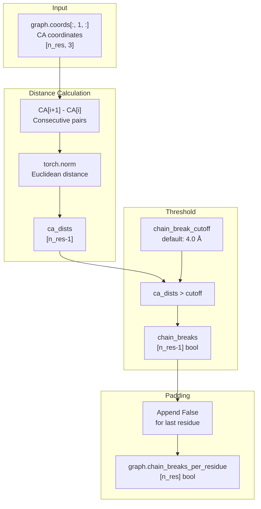
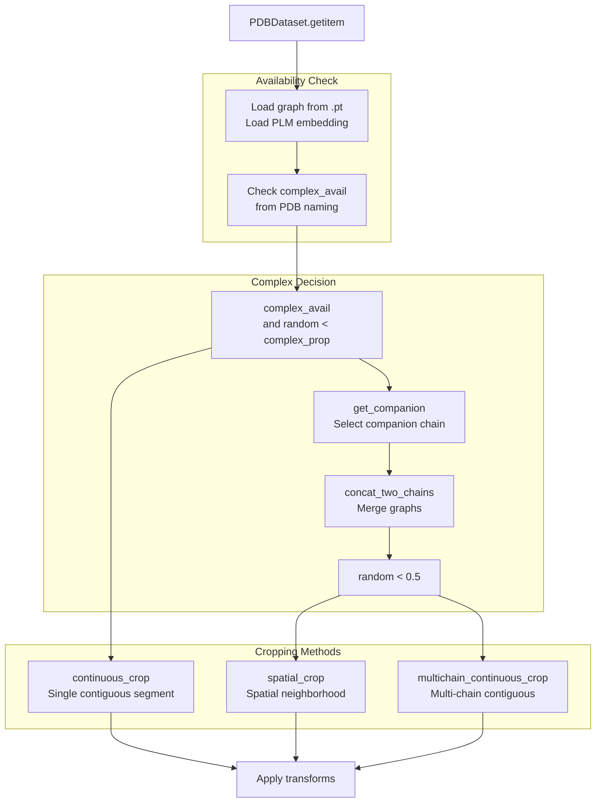
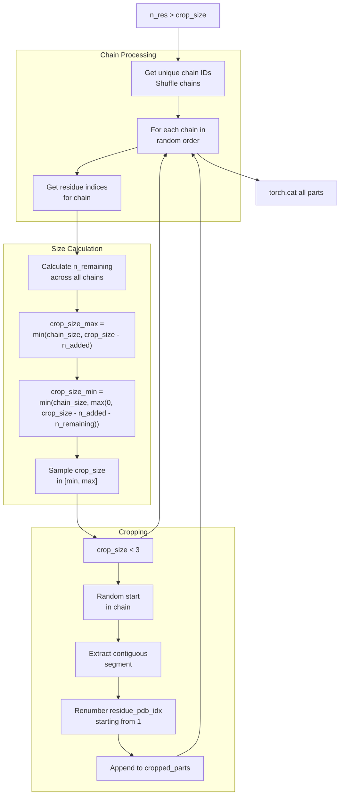
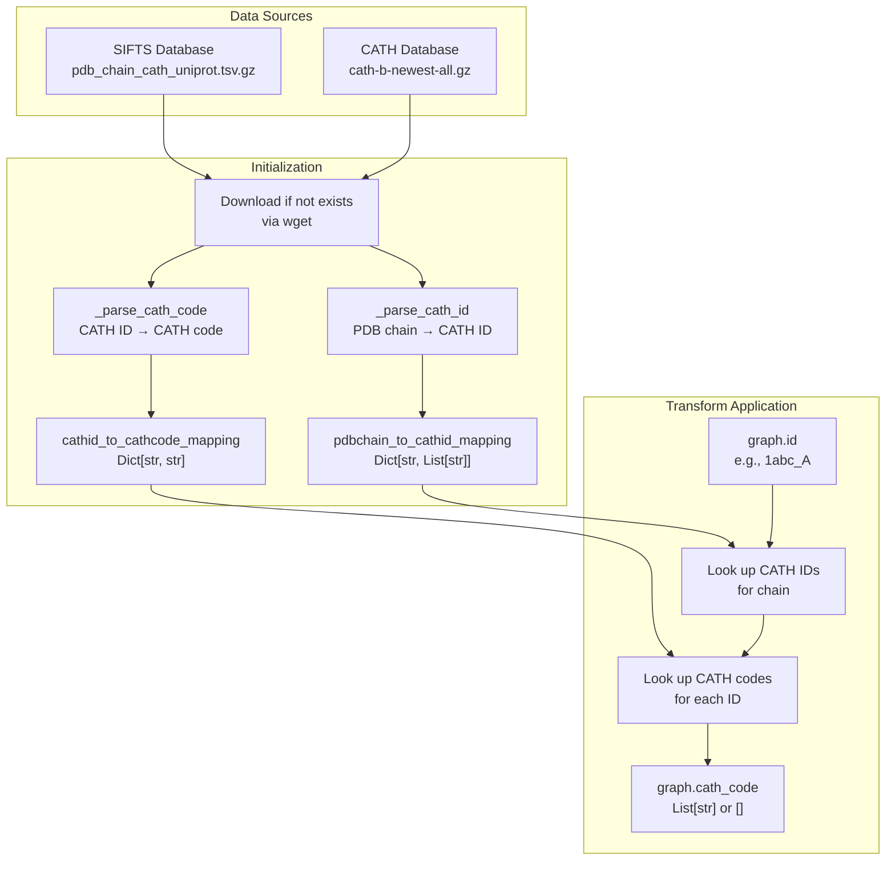
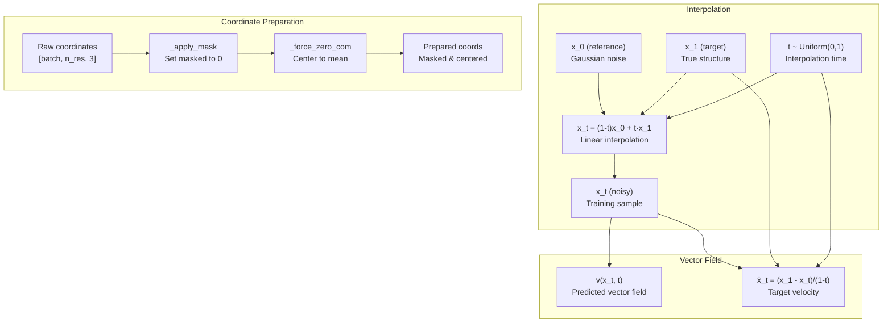

# Data Transforms and Augmentation

> **Relevant source files**
> * [src/data/dataset.py](https://github.com/Junjie-Zhu/IDPFold2/blob/5315b279/src/data/dataset.py)
> * [src/data/transforms.py](https://github.com/Junjie-Zhu/IDPFold2/blob/5315b279/src/data/transforms.py)
> * [src/model/flow_matching/r3flow.py](https://github.com/Junjie-Zhu/IDPFold2/blob/5315b279/src/model/flow_matching/r3flow.py)

This page documents the data transformation and augmentation pipeline used to prepare protein structures for training and inference. These transforms handle coordinate modifications, structural analysis, padding, cropping, and metadata enrichment. For information about how these transforms are composed and applied within the data loading pipeline, see [Data Loading and Batching](/Junjie-Zhu/IDPFold2/4.3-data-loading-and-batching). For the initial data preparation steps that precede transformation, see [Data Preparation and Selection](/Junjie-Zhu/IDPFold2/4.1-data-preparation-and-selection).

## Transform Pipeline Overview

Data transforms in IDPFold2 are implemented as PyTorch Geometric `BaseTransform` subclasses and are applied sequentially during data loading. The `PDBDataModule` composes transforms using `T.Compose` and applies them in the `PDBDataset.__getitem__` method.

**Diagram: Transform Application Flow**



**Sources:** [src/data/dataset.py L414-L452](https://github.com/Junjie-Zhu/IDPFold2/blob/5315b279/src/data/dataset.py#L414-L452)

 [src/data/dataset.py L667-L698](https://github.com/Junjie-Zhu/IDPFold2/blob/5315b279/src/data/dataset.py#L667-L698)

The transform pipeline operates in two phases:

1. **Cropping Phase**: Applied before the transform composition to control training sample size
2. **Transform Phase**: Sequential application of coordinate, structural, and metadata transforms

## Coordinate Transforms

Coordinate transforms modify the 3D positions of atoms in protein structures. These are essential for data augmentation and maintaining rotational invariance during training.

### GlobalRotationTransform

Applies random rotation matrices sampled uniformly from SO(3) to all coordinates. This transform should be the first coordinate-modifying operation to ensure subsequent transforms operate on consistently oriented structures.

**Diagram: Rotation Transform Implementation**



**Sources:** [src/data/transforms.py L166-L199](https://github.com/Junjie-Zhu/IDPFold2/blob/5315b279/src/data/transforms.py#L166-L199)

| Parameter | Type | Description |
| --- | --- | --- |
| `rotation_strategy` | `Literal["uniform"]` | Method for sampling rotations. Currently only uniform from SO(3) is supported |

The rotation is applied via matrix multiplication: `coords' = coords @ R`, where `R` is a 3×3 orthogonal matrix with determinant 1.

### CopyCoordinatesTransform

Creates a backup copy of the original coordinates before any modifications are applied. This allows downstream operations to access both modified and unmodified coordinates.

**Implementation:**

* Copies `graph.coords` to `graph.coords_unmodified`
* Should be applied before any coordinate-modifying transforms
* Useful for computing structure comparison metrics during training

**Sources:** [src/data/transforms.py L48-L66](https://github.com/Junjie-Zhu/IDPFold2/blob/5315b279/src/data/transforms.py#L48-L66)

## Structural Analysis Transforms

### ChainBreakPerResidueTransform

Identifies discontinuities in protein chains by measuring CA-CA distances between consecutive residues. Chain breaks are important for properly handling multi-domain proteins and ensuring valid bonding constraints.

**Diagram: Chain Break Detection Logic**



**Sources:** [src/data/transforms.py L68-L103](https://github.com/Junjie-Zhu/IDPFold2/blob/5315b279/src/data/transforms.py#L68-L103)

| Parameter | Type | Default | Description |
| --- | --- | --- | --- |
| `chain_break_cutoff` | `float` | 4.0 | Maximum CA-CA distance (Å) before considering a chain break |

The transform produces a boolean mask of shape `[n_res]` indicating whether each residue is followed by a chain break. The last residue is always marked as `False`.

## Padding and Batching Transforms

### PaddingTransform

Pads all tensors in a graph to a specified maximum size along the first dimension. This ensures uniform tensor shapes within batches, though in practice, `DensePaddingDataLoader` handles most padding operations dynamically.

**Sources:** [src/data/transforms.py L105-L164](https://github.com/Junjie-Zhu/IDPFold2/blob/5315b279/src/data/transforms.py#L105-L164)

| Parameter | Type | Default | Description |
| --- | --- | --- | --- |
| `max_size` | `int` | 256 | Target size for padding along dimension 0 |
| `fill_value` | `int/float` | 0 | Value used for padding |

**Padding Operation:**

```
For each tensor in graph:
  if tensor.dim() >= 1 and tensor.size(0) < max_size:
    pad to [max_size, ...] with fill_value
```

The padding is applied only to the first dimension and uses `torch.nn.functional.pad` with mode `"constant"`.

## Data Augmentation via Cropping

Cropping operations reduce protein length to a manageable size for training while preserving structural and sequence context. Three cropping strategies are available depending on whether the protein is a monomer or complex.

**Diagram: Cropping Strategy Selection**



**Sources:** [src/data/dataset.py L430-L452](https://github.com/Junjie-Zhu/IDPFold2/blob/5315b279/src/data/dataset.py#L430-L452)

### continuous_crop

Extracts a single contiguous segment of residues by randomly selecting a starting position and taking `crop_size` consecutive residues.

**Algorithm:**

1. If `n_res <= crop_size`, return graph unchanged
2. Sample start index: `start ~ Uniform(0, n_res - crop_size)`
3. Extract residues `[start, start + crop_size)`
4. Renumber `residue_pdb_idx` to start from 1

**Sources:** [src/data/dataset.py L591-L615](https://github.com/Junjie-Zhu/IDPFold2/blob/5315b279/src/data/dataset.py#L591-L615)

| Attribute | Type | Default | Description |
| --- | --- | --- | --- |
| `crop_size` | `int` | 256 | Maximum number of residues to retain |

### spatial_crop

Selects residues based on spatial proximity to a randomly chosen central residue. This is used for protein complexes to ensure interface regions are preserved.

**Algorithm:**

1. If `n_res <= crop_size`, return graph unchanged
2. Select central residue from `central_residues` (interface residues)
3. Compute CA-CA distances from central residue to all others
4. Select top-k closest residues (k = `crop_size`)
5. Sort selected indices to maintain sequence order
6. Extract and renumber residues

**Sources:** [src/data/dataset.py L513-L538](https://github.com/Junjie-Zhu/IDPFold2/blob/5315b279/src/data/dataset.py#L513-L538)

This cropping strategy preserves spatially clustered regions, making it suitable for maintaining binding interfaces in protein complexes.

### multichain_continuous_crop

Extracts contiguous segments from multiple chains while respecting chain boundaries. This is used for protein complexes when spatial cropping is not selected.

**Diagram: Multi-Chain Cropping Logic**



**Sources:** [src/data/dataset.py L540-L589](https://github.com/Junjie-Zhu/IDPFold2/blob/5315b279/src/data/dataset.py#L540-L589)

**Algorithm:**

1. Identify all unique chain IDs and shuffle order
2. For each chain: * Calculate minimum and maximum crop size for this chain based on: * Remaining budget: `crop_size - n_added` * Remaining chains to process * Sample crop size within valid range * Skip if crop size < 3 residues * Randomly select contiguous segment from chain * Renumber residue indices to start from 1
3. Concatenate all cropped segments

This ensures fair sampling across chains while maintaining contiguous segments within each chain.

## Label Integration Transforms

Label transforms enrich protein structures with hierarchical classification metadata used for conditional generation and analysis.

### CATHLabelTransform

Adds CATH (Class, Architecture, Topology, Homology) structural classification labels to PDB structures by integrating data from SIFTS and the CATH database.

**Diagram: CATH Label Integration Pipeline**



**Sources:** [src/data/transforms.py L201-L364](https://github.com/Junjie-Zhu/IDPFold2/blob/5315b279/src/data/transforms.py#L201-L364)

| Parameter | Type | Description |
| --- | --- | --- |
| `root_dir` | `str` | Directory where CATH data files are stored/downloaded |

**CATH Code Format:** `C.A.T.H` where:

* C: Class (1-4)
* A: Architecture (e.g., 10, 20)
* T: Topology (e.g., 10, 25)
* H: Homologous superfamily (e.g., 10, 20)

Example: `3.40.50.720` represents an α-β protein with 3-layer αβα sandwich architecture.

The transform handles multiple CATH domains per chain and gracefully handles missing data by setting `graph.cath_code = []`.

### TEDLabelTransform

Adds CATH labels to AlphaFold Database (AFDB) structures using the TED (Tertiary structure-based Evaluation of Domains) database. This enables CATH-conditioned generation for predicted structures.

**Sources:** [src/data/transforms.py L366-L496](https://github.com/Junjie-Zhu/IDPFold2/blob/5315b279/src/data/transforms.py#L366-L496)

| Parameter | Type | Default | Description |
| --- | --- | --- | --- |
| `file_path` | `str` | - | Path to `ted_365m.domain_summary.cath.globularity.taxid.tsv` file |
| `pkl_path` | `str` | - | Base path for storing processed data as chunked pickle files |
| `chunk_size` | `int` | 50000000 | Number of samples per pickle chunk |

**Processing Pipeline:**

1. **First Run**: Parse TED file and create chunked pickles for fast loading * Extract sample ID and CATH codes from each line * Group by sample ID * Save in chunks of `chunk_size` samples
2. **Subsequent Runs**: Load pre-processed pickle chunks
3. **Transform**: Look up CATH codes for `graph.id` and pad 3-level codes to 4-level (CAT → CATH)

The chunking mechanism handles the large size of the TED database (~365M domains) by splitting the mapping dictionary across multiple pickle files.

## Flow Matching Coordinate Operations

The `R3NFlowMatcher` class provides low-level coordinate operations used during flow matching training and sampling. While not traditional "transforms" in the PyG sense, these operations manipulate coordinates in ways that are fundamental to the generative process.

**Diagram: Flow Matching Coordinate Operations**



**Sources:** [src/model/flow_matching/r3flow.py L22-L194](https://github.com/Junjie-Zhu/IDPFold2/blob/5315b279/src/model/flow_matching/r3flow.py#L22-L194)

### Zero-Centering (_force_zero_com)

Centers coordinates by subtracting the mean position, optionally respecting a mask. This is used when `zero_com=True` to ensure rotation/translation invariance.

**Implementation:**

```yaml
if mask is None:
    x_centered = x - mean(x, dim=-2, keepdim=True)
else:
    x_centered = (x - mean_w_mask(x, mask, keepdim=True)) * mask[..., None]
```

**Sources:** [src/model/flow_matching/r3flow.py L39-L56](https://github.com/Junjie-Zhu/IDPFold2/blob/5315b279/src/model/flow_matching/r3flow.py#L39-L56)

### Masking (_apply_mask)

Applies a binary mask to coordinates, setting masked positions to zero. This ensures padding positions don't contribute to computations.

**Sources:** [src/model/flow_matching/r3flow.py L58-L73](https://github.com/Junjie-Zhu/IDPFold2/blob/5315b279/src/model/flow_matching/r3flow.py#L58-L73)

### Interpolation

Implements the core stochastic interpolant between reference (Gaussian noise) and target (true structure) distributions:

**Formula:** `x_t = (1 - t) · x_0 + t · x_1`

Where:

* `x_0`: Sample from reference distribution (Gaussian with scale `scale_ref`)
* `x_1`: Sample from target distribution (true protein structure)
* `t`: Interpolation time in [0, 1]

Both inputs are automatically masked and zero-centered if configured.

**Sources:** [src/model/flow_matching/r3flow.py L106-L135](https://github.com/Junjie-Zhu/IDPFold2/blob/5315b279/src/model/flow_matching/r3flow.py#L106-L135)

### Target Velocity (xt_dot)

Computes the target vector field for flow matching loss. This is the derivative of the interpolation path:

**Formula:** `ẋ_t = (x_1 - x_t) / (1 - t)`

This target is compared against the model's predicted vector field during training.

**Sources:** [src/model/flow_matching/r3flow.py L163-L194](https://github.com/Junjie-Zhu/IDPFold2/blob/5315b279/src/model/flow_matching/r3flow.py#L163-L194)

## Transform Composition and Configuration

Transforms are configured through Hydra configuration files and composed in the `PDBDataModule`.

**Example Transform Configuration:**

```
data:  transforms:    copy_coordinates:      _target_: src.data.transforms.CopyCoordinatesTransform        global_rotation:      _target_: src.data.transforms.GlobalRotationTransform      rotation_strategy: uniform        chain_breaks:      _target_: src.data.transforms.ChainBreakPerResidueTransform      chain_break_cutoff: 4.0        cath_labels:      _target_: src.data.transforms.CATHLabelTransform      root_dir: ${data.data_dir}/cath
```

The transforms are applied in the order specified in the configuration via `T.Compose`, which calls each transform sequentially on the graph.

**Sources:** [src/data/dataset.py L667-L698](https://github.com/Junjie-Zhu/IDPFold2/blob/5315b279/src/data/dataset.py#L667-L698)

---

**Summary Table: All Transforms**

| Transform | Category | Purpose | Key Parameters |
| --- | --- | --- | --- |
| `CopyCoordinatesTransform` | Coordinate | Backup original coordinates | None |
| `GlobalRotationTransform` | Coordinate | Random SO(3) rotation augmentation | `rotation_strategy` |
| `ChainBreakPerResidueTransform` | Structural | Detect chain discontinuities | `chain_break_cutoff` |
| `PaddingTransform` | Batching | Pad to uniform size | `max_size`, `fill_value` |
| `CATHLabelTransform` | Label | Add CATH classification | `root_dir` |
| `TEDLabelTransform` | Label | Add TED-based CATH labels | `file_path`, `pkl_path`, `chunk_size` |
| `continuous_crop` | Augmentation | Contiguous segment extraction | `crop_size` |
| `spatial_crop` | Augmentation | Spatial neighborhood extraction | `crop_size`, `central_residues` |
| `multichain_continuous_crop` | Augmentation | Multi-chain segment extraction | `crop_size` |