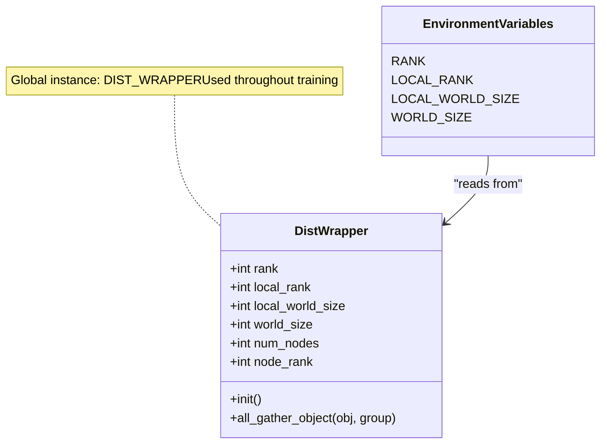
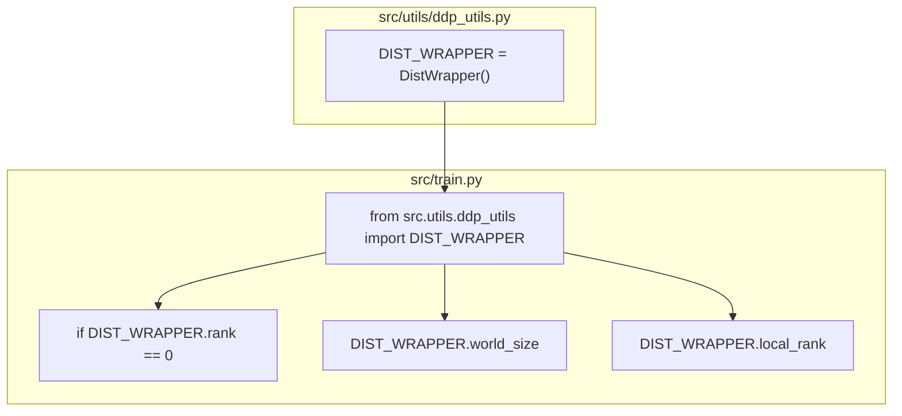
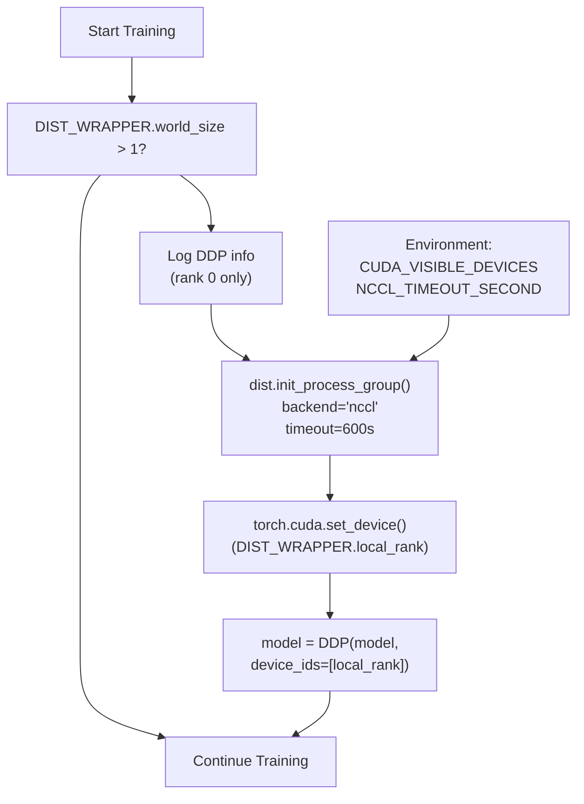
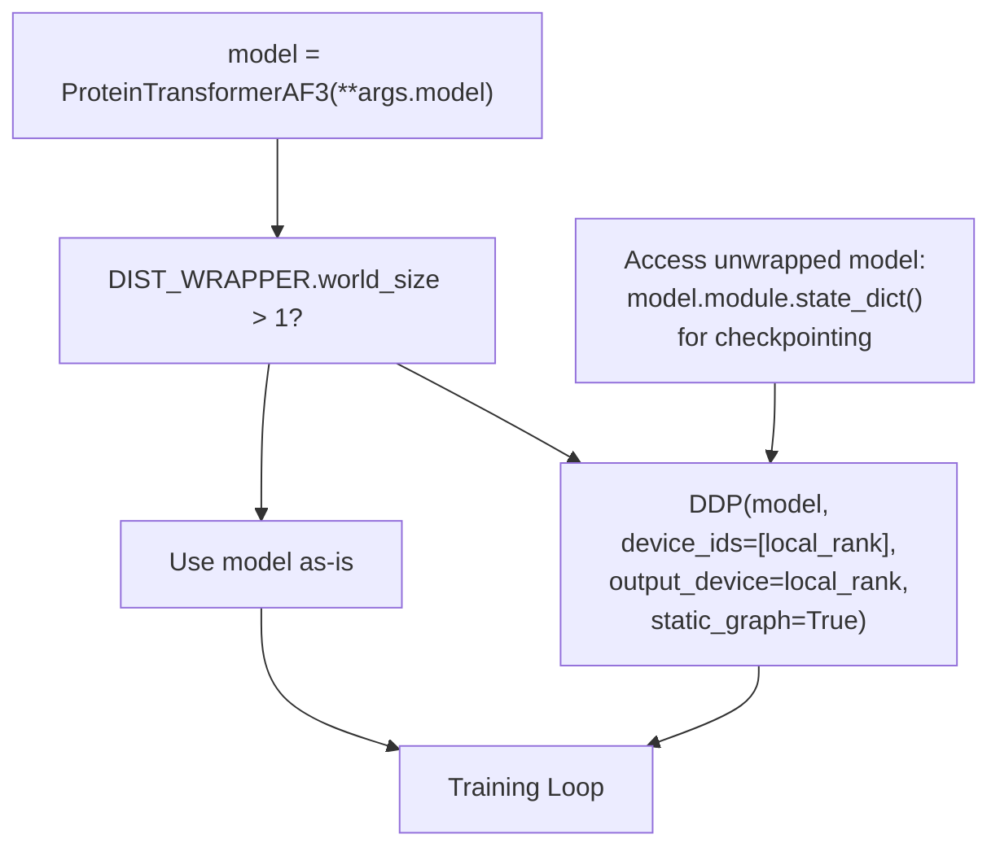
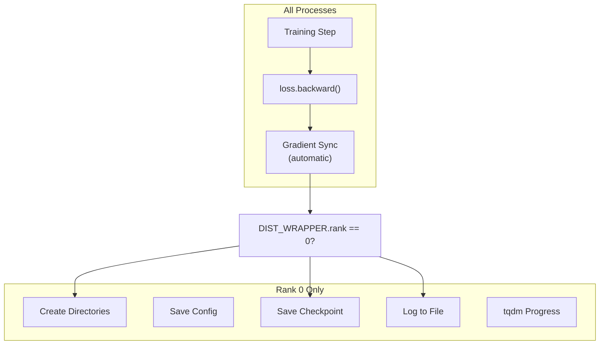
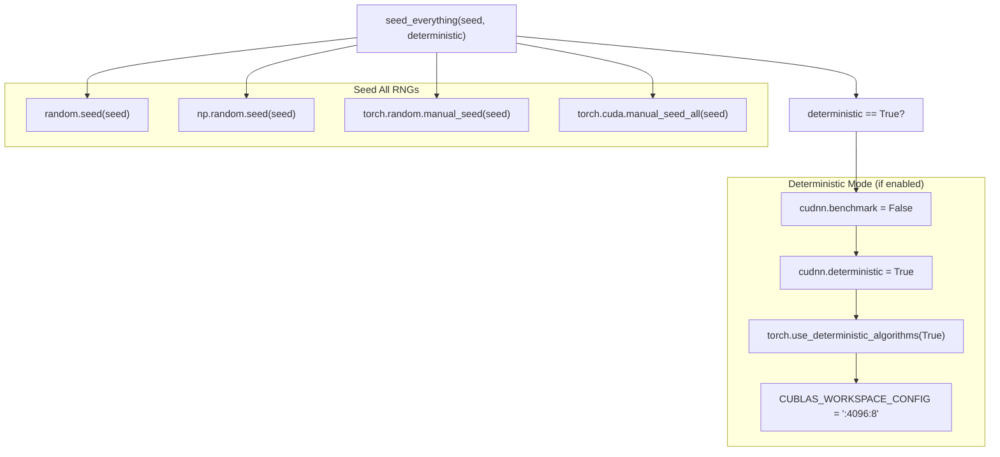
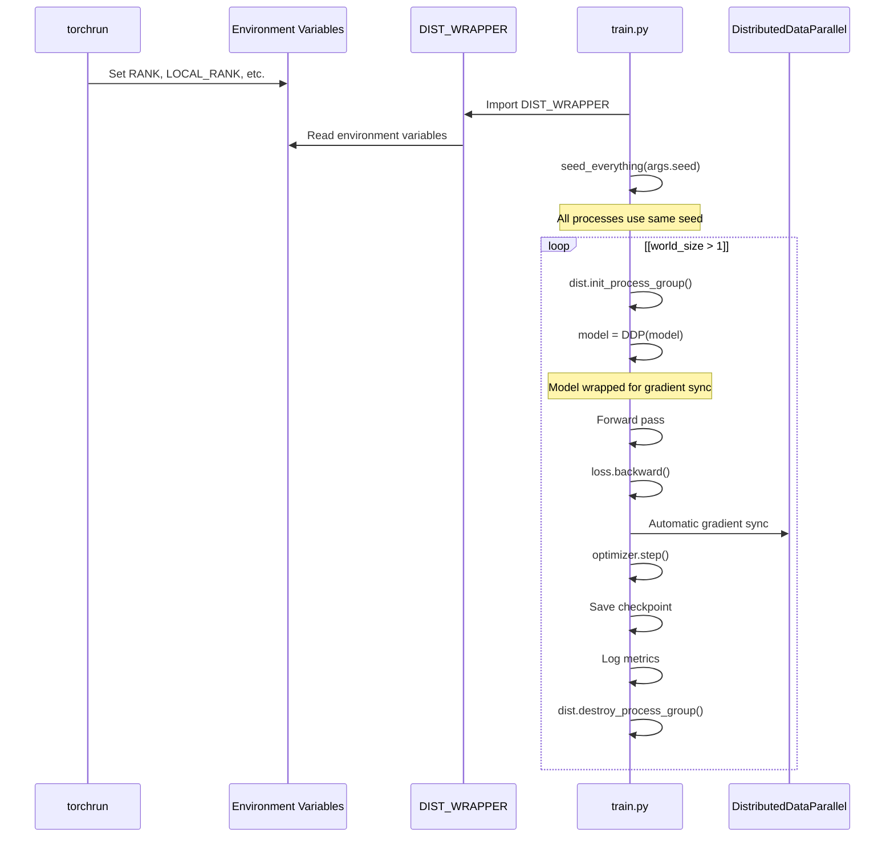

# Distributed Computing Utilities

> **Relevant source files**
> * [.project-root](https://github.com/Junjie-Zhu/IDPFold2/blob/5315b279/.project-root)
> * [configs/train.yaml](https://github.com/Junjie-Zhu/IDPFold2/blob/5315b279/configs/train.yaml)
> * [setup.py](https://github.com/Junjie-Zhu/IDPFold2/blob/5315b279/setup.py)
> * [src/train.py](https://github.com/Junjie-Zhu/IDPFold2/blob/5315b279/src/train.py)
> * [src/utils/ddp_utils.py](https://github.com/Junjie-Zhu/IDPFold2/blob/5315b279/src/utils/ddp_utils.py)

This document describes the distributed computing infrastructure in IDPFold2, which enables multi-GPU and multi-node training using PyTorch's Distributed Data Parallel (DDP). The utilities handle rank management, process group initialization, synchronization, and reproducibility across distributed processes.

For information about the training pipeline that uses these utilities, see [Training Pipeline](/Junjie-Zhu/IDPFold2/6.1-training-pipeline). For distributed inference, see [Multi-Device Inference](/Junjie-Zhu/IDPFold2/7.5-multi-device-inference).

---

## Overview

The distributed computing utilities are located in [src/utils/ddp_utils.py](https://github.com/Junjie-Zhu/IDPFold2/blob/5315b279/src/utils/ddp_utils.py)

 and provide a thin wrapper around PyTorch's distributed training capabilities. The primary component is the `DistWrapper` class, which manages rank information and provides helper methods for distributed operations. These utilities are used throughout the training pipeline to coordinate multiple processes during model training.

**Key Components:**

* `DistWrapper` - Manages rank and world size information from environment variables
* `DIST_WRAPPER` - Global singleton instance used throughout the codebase
* `seed_everything()` - Ensures reproducibility across all processes
* `distributed_available()` - Checks if distributed training is initialized

Sources: [src/utils/ddp_utils.py L1-L50](https://github.com/Junjie-Zhu/IDPFold2/blob/5315b279/src/utils/ddp_utils.py#L1-L50)

---

## DistWrapper Class

The `DistWrapper` class encapsulates all distributed process information by reading standard PyTorch distributed environment variables. It provides a clean interface to access rank and world size information without repeatedly reading environment variables.



### Properties

| Property | Environment Variable | Description | Default |
| --- | --- | --- | --- |
| `rank` | `RANK` | Global rank of current process across all nodes | 0 |
| `local_rank` | `LOCAL_RANK` | Local rank within the current node | 0 |
| `local_world_size` | `LOCAL_WORLD_SIZE` | Number of processes on current node | 1 |
| `world_size` | `WORLD_SIZE` | Total number of processes across all nodes | 1 |
| `num_nodes` | Computed | `world_size // local_world_size` | 1 |
| `node_rank` | Computed | `rank // local_world_size` | 0 |

**Implementation Details:**

The constructor reads environment variables with fallback defaults [src/utils/ddp_utils.py L13-L19](https://github.com/Junjie-Zhu/IDPFold2/blob/5315b279/src/utils/ddp_utils.py#L13-L19)

:

* Defaults to 0 for rank values (single process)
* Defaults to 1 for world sizes (single process)
* Computes derived values (`num_nodes`, `node_rank`) from base properties

Sources: [src/utils/ddp_utils.py L12-L20](https://github.com/Junjie-Zhu/IDPFold2/blob/5315b279/src/utils/ddp_utils.py#L12-L20)

---

## Global DistWrapper Instance

The module exports a global `DIST_WRAPPER` instance that is imported throughout the codebase. This singleton pattern ensures consistent rank information access without passing the wrapper as a parameter.



**Usage Pattern:**

The wrapper is typically used for conditional execution based on process rank [src/train.py L34-L44](https://github.com/Junjie-Zhu/IDPFold2/blob/5315b279/src/train.py#L34-L44)

:

```markdown
if DIST_WRAPPER.rank == 0:    # Only master process executes    os.makedirs(logging_dir)    save_config()
```

Sources: [src/utils/ddp_utils.py L34](https://github.com/Junjie-Zhu/IDPFold2/blob/5315b279/src/utils/ddp_utils.py#L34-L34)

 [src/train.py L23-L24](https://github.com/Junjie-Zhu/IDPFold2/blob/5315b279/src/train.py#L23-L24)

 [src/train.py L34](https://github.com/Junjie-Zhu/IDPFold2/blob/5315b279/src/train.py#L34-L34)

 [src/train.py L56-L62](https://github.com/Junjie-Zhu/IDPFold2/blob/5315b279/src/train.py#L56-L62)

---

## Environment Variable Management

PyTorch's `torchrun` launcher automatically sets the required environment variables when launching distributed training. The wrapper reads these without requiring manual configuration.

### Single GPU Training

```markdown
# Environment variables (defaults)RANK=0LOCAL_RANK=0WORLD_SIZE=1LOCAL_WORLD_SIZE=1
```

### Multi-GPU Single Node

```markdown
torchrun --nproc_per_node=4 src/train.py # Process 0:RANK=0, LOCAL_RANK=0WORLD_SIZE=4, LOCAL_WORLD_SIZE=4 # Process 1:RANK=1, LOCAL_RANK=1WORLD_SIZE=4, LOCAL_WORLD_SIZE=4 # ... etc
```

### Multi-Node Training

```markdown
# Node 0:torchrun --nproc_per_node=4 --nnodes=2 --node_rank=0 src/train.py # Node 1:torchrun --nproc_per_node=4 --nnodes=2 --node_rank=1 src/train.py # Results in 8 total processes with appropriate rank assignments
```

Sources: [src/train.py L46-L67](https://github.com/Junjie-Zhu/IDPFold2/blob/5315b279/src/train.py#L46-L67)

---

## Distributed Process Group Initialization

The training script uses the wrapper to conditionally initialize PyTorch's distributed process group. This initialization is required before using DDP or any collective operations.



**Initialization Sequence** [src/train.py L56-L67](https://github.com/Junjie-Zhu/IDPFold2/blob/5315b279/src/train.py#L56-L67)

:

1. **Check world size**: Only initialize if `world_size > 1`
2. **Log configuration**: Master process logs GPU assignments and world size
3. **Initialize process group**: Uses NCCL backend with configurable timeout
4. **Set CUDA device**: Each process binds to its local GPU

**Timeout Configuration:**

The NCCL timeout can be configured via environment variable `NCCL_TIMEOUT_SECOND` (default: 600 seconds) [src/train.py L64](https://github.com/Junjie-Zhu/IDPFold2/blob/5315b279/src/train.py#L64-L64)

:

```
timeout_seconds = int(os.environ.get("NCCL_TIMEOUT_SECOND", 600))dist.init_process_group(    backend="nccl",     timeout=datetime.timedelta(seconds=timeout_seconds))
```

Sources: [src/train.py L46-L67](https://github.com/Junjie-Zhu/IDPFold2/blob/5315b279/src/train.py#L46-L67)

 [src/train.py L130-L140](https://github.com/Junjie-Zhu/IDPFold2/blob/5315b279/src/train.py#L130-L140)

---

## DDP Model Wrapping

After process group initialization, the model is wrapped with `DistributedDataParallel` to enable gradient synchronization across processes.



**DDP Configuration** [src/train.py L135-L140](https://github.com/Junjie-Zhu/IDPFold2/blob/5315b279/src/train.py#L135-L140)

:

| Parameter | Value | Purpose |
| --- | --- | --- |
| `device_ids` | `[DIST_WRAPPER.local_rank]` | GPU device for this process |
| `output_device` | `DIST_WRAPPER.local_rank` | Where to gather outputs |
| `static_graph` | `True` | Optimization for fixed computation graph |

**Accessing Wrapped Model:**

When saving checkpoints, the unwrapped model must be accessed via `.module` [src/train.py L349](https://github.com/Junjie-Zhu/IDPFold2/blob/5315b279/src/train.py#L349-L349)

:

```
if DIST_WRAPPER.world_size > 1:    state_dict = model.module.state_dict()else:    state_dict = model.state_dict()
```

Sources: [src/train.py L130-L144](https://github.com/Junjie-Zhu/IDPFold2/blob/5315b279/src/train.py#L130-L144)

 [src/train.py L176-L179](https://github.com/Junjie-Zhu/IDPFold2/blob/5315b279/src/train.py#L176-L179)

 [src/train.py L187-L190](https://github.com/Junjie-Zhu/IDPFold2/blob/5315b279/src/train.py#L187-L190)

 [src/train.py L349](https://github.com/Junjie-Zhu/IDPFold2/blob/5315b279/src/train.py#L349-L349)

---

## Rank-Based Conditional Execution

Many operations should only be executed by the master process (rank 0) to avoid duplication and ensure consistency. Common patterns include logging, checkpointing, and directory creation.



### Common Rank-Based Patterns

**1. Directory Creation and Config Saving** [src/train.py L34-L44](https://github.com/Junjie-Zhu/IDPFold2/blob/5315b279/src/train.py#L34-L44)

:

```
if DIST_WRAPPER.rank == 0:    os.makedirs(logging_dir)    os.makedirs(os.path.join(logging_dir, "checkpoints"))        with open(f"{logging_dir}/config.yaml", "w") as f:        OmegaConf.save(args, f)
```

**2. Progress Bars** [src/train.py L227-L232](https://github.com/Junjie-Zhu/IDPFold2/blob/5315b279/src/train.py#L227-L232)

:

```
epoch_progress = tqdm(...) if DIST_WRAPPER.rank == 0 else None if DIST_WRAPPER.rank == 0:    train_iter = tqdm(train_iter, ...)
```

**3. Logging and Metrics** [src/train.py L281-L282](https://github.com/Junjie-Zhu/IDPFold2/blob/5315b279/src/train.py#L281-L282)

:

```
if DIST_WRAPPER.rank == 0:    train_iter.set_postfix(step_loss=f"{step_loss:.3f}", **loss_dict)
```

**4. Checkpointing** [src/train.py L344-L352](https://github.com/Junjie-Zhu/IDPFold2/blob/5315b279/src/train.py#L344-L352)

:

```
if DIST_WRAPPER.rank == 0:    checkpoint_path = os.path.join(logging_dir, f"checkpoints/epoch_{crt_epoch}.pth")    torch.save({...}, checkpoint_path)
```

**5. Informational Logging** [src/train.py L131-L133](https://github.com/Junjie-Zhu/IDPFold2/blob/5315b279/src/train.py#L131-L133)

:

```
if DIST_WRAPPER.rank == 0:    log_info(model)    log_info(f"Model has {nparam / 1000000:.2f}M parameters")
```

Sources: [src/train.py L34-L44](https://github.com/Junjie-Zhu/IDPFold2/blob/5315b279/src/train.py#L34-L44)

 [src/train.py L131-L143](https://github.com/Junjie-Zhu/IDPFold2/blob/5315b279/src/train.py#L131-L143)

 [src/train.py L227-L232](https://github.com/Junjie-Zhu/IDPFold2/blob/5315b279/src/train.py#L227-L232)

 [src/train.py L281-L282](https://github.com/Junjie-Zhu/IDPFold2/blob/5315b279/src/train.py#L281-L282)

 [src/train.py L336-L342](https://github.com/Junjie-Zhu/IDPFold2/blob/5315b279/src/train.py#L336-L342)

 [src/train.py L344-L359](https://github.com/Junjie-Zhu/IDPFold2/blob/5315b279/src/train.py#L344-L359)

---

## Seed Management for Reproducibility

The `seed_everything()` function ensures all random number generators are seeded consistently across all processes, which is critical for reproducible distributed training.



### Seeding Strategy

**All Processes Use Same Seed** [src/train.py L73-L77](https://github.com/Junjie-Zhu/IDPFold2/blob/5315b279/src/train.py#L73-L77)

:

```markdown
# All ddp process got the same seedseed_everything(    seed=args.seed,    deterministic=args.deterministic,)
```

This ensures:

* Identical weight initialization across processes
* Reproducible data shuffling (when combined with distributed samplers)
* Deterministic model behavior

### Deterministic Mode

When `deterministic=True` [src/utils/ddp_utils.py L42-L49](https://github.com/Junjie-Zhu/IDPFold2/blob/5315b279/src/utils/ddp_utils.py#L42-L49)

:

| Setting | Effect |
| --- | --- |
| `cudnn.benchmark = False` | Disables auto-tuning for reproducibility |
| `cudnn.deterministic = True` | Forces deterministic CUDA convolutions |
| `use_deterministic_algorithms(True)` | Enforces deterministic PyTorch ops |
| `CUBLAS_WORKSPACE_CONFIG` | Configures cuBLAS workspace for determinism |

**Trade-off:** Deterministic mode may reduce training speed but ensures perfect reproducibility across runs.

Sources: [src/utils/ddp_utils.py L37-L49](https://github.com/Junjie-Zhu/IDPFold2/blob/5315b279/src/utils/ddp_utils.py#L37-L49)

 [src/train.py L73-L77](https://github.com/Junjie-Zhu/IDPFold2/blob/5315b279/src/train.py#L73-L77)

 [configs/train.yaml L7-L8](https://github.com/Junjie-Zhu/IDPFold2/blob/5315b279/configs/train.yaml#L7-L8)

---

## Collective Operations

The `DistWrapper` provides helper methods for distributed collective operations.

### all_gather_object

The `all_gather_object()` method gathers Python objects from all processes [src/utils/ddp_utils.py L21-L31](https://github.com/Junjie-Zhu/IDPFold2/blob/5315b279/src/utils/ddp_utils.py#L21-L31)

:

```python
def all_gather_object(self, obj, group=None):    """Gather objects from several distributed processes."""    if self.world_size > 1 and distributed_available():        with torch.no_grad():            obj_list = [None for _ in range(self.world_size)]            torch.distributed.all_gather_object(obj_list, obj, group=group)            return obj_list    else:        return [obj]
```

**Behavior:**

* Returns list of objects from all processes if distributed
* Returns `[obj]` (single-element list) if running single process
* Useful for synchronizing metrics or logging information

**Safety Note:** The docstring indicates this is "now only used by sync metrics in logger due to security reason" [src/utils/ddp_utils.py L22-L23](https://github.com/Junjie-Zhu/IDPFold2/blob/5315b279/src/utils/ddp_utils.py#L22-L23)

 suggesting caution with untrusted objects.

Sources: [src/utils/ddp_utils.py L21-L31](https://github.com/Junjie-Zhu/IDPFold2/blob/5315b279/src/utils/ddp_utils.py#L21-L31)

---

## Cleanup

Process groups must be properly destroyed when training completes [src/train.py L411-L413](https://github.com/Junjie-Zhu/IDPFold2/blob/5315b279/src/train.py#L411-L413)

:

```markdown
# Clean up process group when finishedif DIST_WRAPPER.world_size > 1:    dist.destroy_process_group()
```

This ensures:

* Proper release of NCCL resources
* Clean shutdown of communication backends
* Prevention of hanging processes

Sources: [src/train.py L411-L413](https://github.com/Junjie-Zhu/IDPFold2/blob/5315b279/src/train.py#L411-L413)

---

## Complete DDP Workflow

The following diagram shows the complete workflow from initialization to cleanup:



Sources: [src/train.py L46-L413](https://github.com/Junjie-Zhu/IDPFold2/blob/5315b279/src/train.py#L46-L413)

 [src/utils/ddp_utils.py L1-L50](https://github.com/Junjie-Zhu/IDPFold2/blob/5315b279/src/utils/ddp_utils.py#L1-L50)

---

## Configuration Reference

### Training Configuration

Relevant distributed training parameters in [configs/train.yaml](https://github.com/Junjie-Zhu/IDPFold2/blob/5315b279/configs/train.yaml)

:

| Parameter | Default | Description |
| --- | --- | --- |
| `batch_size` | 8 | Batch size **per device** (not global) |
| `seed` | 42 | Random seed for all processes |
| `deterministic` | False | Enable deterministic mode |

**Important:** The `batch_size` parameter specifies the per-device batch size. The effective global batch size is `batch_size * world_size`.

Sources: [configs/train.yaml L3-L8](https://github.com/Junjie-Zhu/IDPFold2/blob/5315b279/configs/train.yaml#L3-L8)

---

## Usage Example

Complete example showing distributed training setup:

```javascript
# Environment automatically set by torchrun# RANK=0, LOCAL_RANK=0, WORLD_SIZE=4, LOCAL_WORLD_SIZE=4 from src.utils.ddp_utils import DIST_WRAPPER, seed_everything # Seed all processes identicallyseed_everything(seed=42, deterministic=False) # Set device based on local rankdevice = torch.device(f"cuda:{DIST_WRAPPER.local_rank}")torch.cuda.set_device(device) # Initialize process groupif DIST_WRAPPER.world_size > 1:    dist.init_process_group(backend="nccl", timeout=timedelta(seconds=600)) # Create and wrap modelmodel = ProteinTransformerAF3(**args.model).to(device)if DIST_WRAPPER.world_size > 1:    model = DDP(model, device_ids=[DIST_WRAPPER.local_rank]) # Training loopfor epoch in range(epochs):    for batch in dataloader:        loss = compute_loss(model, batch)        loss.backward()  # Gradients automatically synchronized        optimizer.step()        # Only master saves checkpoints    if DIST_WRAPPER.rank == 0:        torch.save(model.module.state_dict(), "checkpoint.pth") # Cleanupif DIST_WRAPPER.world_size > 1:    dist.destroy_process_group()
```

Sources: [src/train.py L46-L413](https://github.com/Junjie-Zhu/IDPFold2/blob/5315b279/src/train.py#L46-L413)

 [src/utils/ddp_utils.py L1-L50](https://github.com/Junjie-Zhu/IDPFold2/blob/5315b279/src/utils/ddp_utils.py#L1-L50)