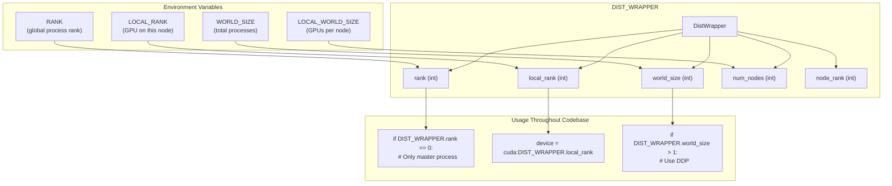
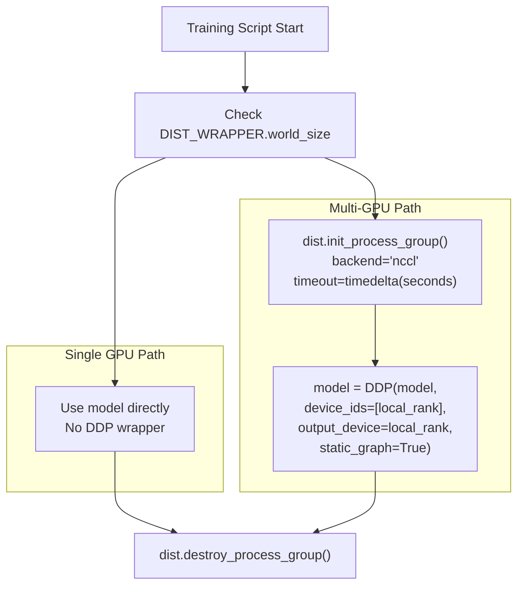
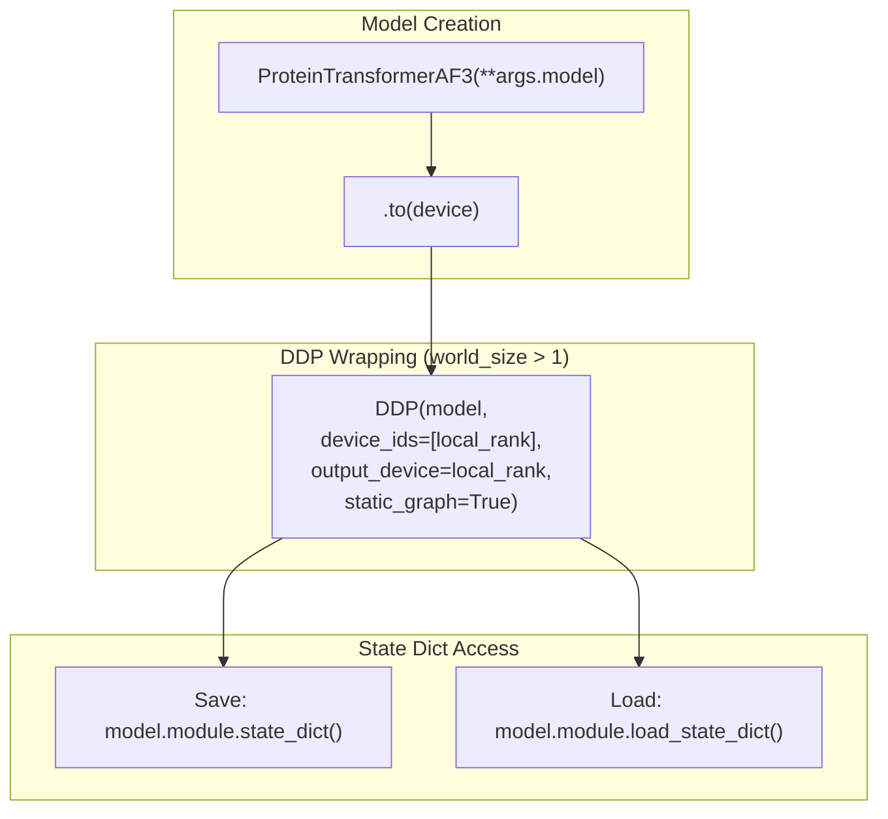
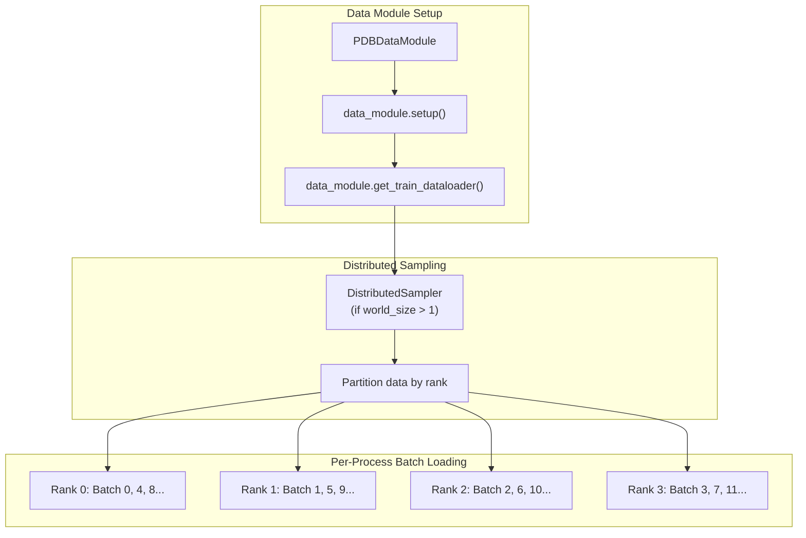
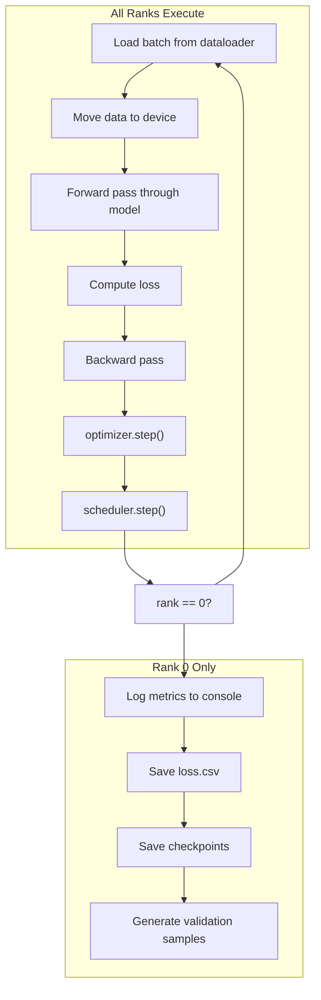
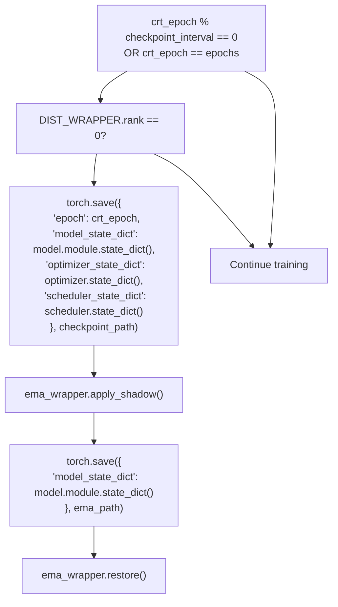
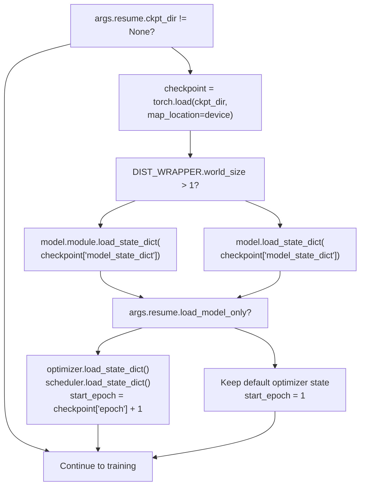

# Distributed Training

> **Relevant source files**
> * [.project-root](https://github.com/Junjie-Zhu/IDPFold2/blob/5315b279/.project-root)
> * [configs/train.yaml](https://github.com/Junjie-Zhu/IDPFold2/blob/5315b279/configs/train.yaml)
> * [setup.py](https://github.com/Junjie-Zhu/IDPFold2/blob/5315b279/setup.py)
> * [src/train.py](https://github.com/Junjie-Zhu/IDPFold2/blob/5315b279/src/train.py)
> * [src/utils/ddp_utils.py](https://github.com/Junjie-Zhu/IDPFold2/blob/5315b279/src/utils/ddp_utils.py)

This page documents the distributed training infrastructure in IDPFold2, which enables multi-GPU training using PyTorch's Distributed Data Parallel (DDP). This includes the DDP setup, process group initialization, distributed data loading, checkpoint synchronization, and coordination across multiple GPUs and nodes.

For the main training loop and pipeline, see [Training Pipeline](/Junjie-Zhu/IDPFold2/6.1-training-pipeline). For optimizer and scheduler configuration, see [Optimization and Scheduling](/Junjie-Zhu/IDPFold2/6.4-optimization-and-scheduling).

---

## Overview

IDPFold2 uses PyTorch's `DistributedDataParallel` (DDP) to scale training across multiple GPUs. The system supports:

* Multi-GPU training on a single node
* Multi-node training across multiple machines
* NCCL backend for efficient GPU communication
* Rank-based coordination for logging and checkpointing
* Distributed data loading with proper batching

The distributed setup is optional - the same training script works for single-GPU training without modification.

**Sources:** [src/train.py L8-L10](https://github.com/Junjie-Zhu/IDPFold2/blob/5315b279/src/train.py#L8-L10)

 [src/train.py L56-L67](https://github.com/Junjie-Zhu/IDPFold2/blob/5315b279/src/train.py#L56-L67)

---

## Distributed Infrastructure

### DIST_WRAPPER Utility

The `DIST_WRAPPER` is a singleton object that provides convenient access to distributed training state throughout the codebase. It reads environment variables set by the launcher (e.g., `torchrun`) to determine the current process's role in the distributed setup.



**Key attributes:**

* `rank`: Global rank across all processes (0 to world_size-1)
* `local_rank`: Rank on the current node (0 to local_world_size-1), maps to GPU ID
* `world_size`: Total number of processes across all nodes
* `local_world_size`: Number of processes per node
* `num_nodes`: Total number of nodes
* `node_rank`: Rank of the current node

**Sources:** [src/utils/ddp_utils.py L12-L34](https://github.com/Junjie-Zhu/IDPFold2/blob/5315b279/src/utils/ddp_utils.py#L12-L34)

### Environment Variables

The distributed training system relies on several environment variables:

| Variable | Purpose | Set By | Default |
| --- | --- | --- | --- |
| `RANK` | Global process rank | `torchrun` | 0 |
| `LOCAL_RANK` | GPU index on current node | `torchrun` | 0 |
| `WORLD_SIZE` | Total number of processes | `torchrun` | 1 |
| `LOCAL_WORLD_SIZE` | Processes per node | `torchrun` | 1 |
| `CUDA_VISIBLE_DEVICES` | Visible GPU devices | User/launcher | All GPUs |
| `CUDA_DEVICE_ORDER` | GPU enumeration order | Training script | `PCI_BUS_ID` |
| `NCCL_TIMEOUT_SECOND` | Communication timeout | User (optional) | 600 |
| `CUBLAS_WORKSPACE_CONFIG` | Deterministic cuBLAS | Training script | `:4096:8` |

**Sources:** [src/train.py L46-L67](https://github.com/Junjie-Zhu/IDPFold2/blob/5315b279/src/train.py#L46-L67)

 [src/utils/ddp_utils.py L14-L17](https://github.com/Junjie-Zhu/IDPFold2/blob/5315b279/src/utils/ddp_utils.py#L14-L17)

---

## DDP Initialization

### Process Group Setup

The training script initializes the DDP process group when `DIST_WRAPPER.world_size > 1`. This establishes communication channels between all processes using the NCCL backend.



The initialization sequence [src/train.py L56-L67](https://github.com/Junjie-Zhu/IDPFold2/blob/5315b279/src/train.py#L56-L67)

:

1. **Check world size**: If `DIST_WRAPPER.world_size > 1`, proceed with DDP setup
2. **Set device**: Each process assigns itself to `cuda:DIST_WRAPPER.local_rank`
3. **Log configuration**: Rank 0 logs the DDP configuration
4. **Initialize process group**: Call `dist.init_process_group()` with NCCL backend
5. **Configure timeout**: Uses `NCCL_TIMEOUT_SECOND` environment variable (default 600s)

**Sources:** [src/train.py L46-L67](https://github.com/Junjie-Zhu/IDPFold2/blob/5315b279/src/train.py#L46-L67)

### Device Assignment

Each process is assigned to a specific GPU based on its local rank:

```css
# From src/train.py:49-53device = torch.device("cuda:{}".format(DIST_WRAPPER.local_rank))os.environ["CUDA_DEVICE_ORDER"] = "PCI_BUS_ID"all_gpu_ids = ",".join(str(x) for x in range(torch.cuda.device_count()))devices = os.getenv("CUDA_VISIBLE_DEVICES", all_gpu_ids)torch.cuda.set_device(device)
```

This ensures each process operates on its designated GPU, preventing conflicts and enabling parallel computation.

**Sources:** [src/train.py L46-L53](https://github.com/Junjie-Zhu/IDPFold2/blob/5315b279/src/train.py#L46-L53)

---

## Model Wrapping with DDP

### DistributedDataParallel Wrapper

When training with multiple GPUs, the model is wrapped with PyTorch's `DistributedDataParallel` class:



Key DDP configuration parameters [src/train.py L135-L140](https://github.com/Junjie-Zhu/IDPFold2/blob/5315b279/src/train.py#L135-L140)

:

* `device_ids=[DIST_WRAPPER.local_rank]`: Specifies which GPU this replica uses
* `output_device=DIST_WRAPPER.local_rank`: Where to gather outputs
* `static_graph=True`: Optimization for models with static computation graphs

### Accessing Model Parameters

When using DDP, the original model is wrapped and becomes accessible via the `.module` attribute:

| Context | Access Pattern |
| --- | --- |
| **Non-DDP** | `model.state_dict()` |
| **DDP** | `model.module.state_dict()` |

The training script handles this conditionally [src/train.py L349](https://github.com/Junjie-Zhu/IDPFold2/blob/5315b279/src/train.py#L349-L349)

:

```markdown
# Conditional state dict accessmodel.module.state_dict() if DIST_WRAPPER.world_size > 1 else model.state_dict()
```

**Sources:** [src/train.py L126-L143](https://github.com/Junjie-Zhu/IDPFold2/blob/5315b279/src/train.py#L126-L143)

 [src/train.py L349](https://github.com/Junjie-Zhu/IDPFold2/blob/5315b279/src/train.py#L349-L349)

---

## Distributed Data Loading

### Data Module Configuration

The `PDBDataModule` handles distributed data loading automatically. Each process receives a different subset of the data through PyTorch's distributed sampler.



**Batch size semantics:**

* The `batch_size` in configuration is **per GPU**
* Effective global batch size = `batch_size × world_size`
* Each process loads its own batches independently

Example with 4 GPUs and `batch_size=8`:

* Each GPU processes 8 samples per step
* Global effective batch size is 32 samples per step

**Sources:** [src/train.py L98-L123](https://github.com/Junjie-Zhu/IDPFold2/blob/5315b279/src/train.py#L98-L123)

 [configs/train.yaml L3](https://github.com/Junjie-Zhu/IDPFold2/blob/5315b279/configs/train.yaml#L3-L3)

### Data Worker Configuration

The data loading configuration supports distributed training:

| Parameter | Purpose | Configuration |
| --- | --- | --- |
| `num_workers` | Worker processes per GPU | `args.data.num_workers` (default: 6) |
| `pin_memory` | Pin memory for faster transfer | `args.data.pin_memory` (default: True) |

Each GPU spawns its own worker processes, so total workers = `num_workers × world_size`.

**Sources:** [configs/train.yaml L42-L43](https://github.com/Junjie-Zhu/IDPFold2/blob/5315b279/configs/train.yaml#L42-L43)

---

## Training Loop Coordination

### Rank-Based Execution

The training loop executes on all ranks, but certain operations are restricted to rank 0 to avoid duplication:



Key rank-specific code patterns:

**Progress bars and logging** [src/train.py L232](https://github.com/Junjie-Zhu/IDPFold2/blob/5315b279/src/train.py#L232-L232)

:

```
epoch_progress = tqdm(...) if DIST_WRAPPER.rank == 0 else None
```

**Checkpoint saving** [src/train.py L345-L358](https://github.com/Junjie-Zhu/IDPFold2/blob/5315b279/src/train.py#L345-L358)

:

```
if DIST_WRAPPER.rank == 0:    if crt_epoch % args.checkpoint_interval == 0:        torch.save({...}, checkpoint_path)
```

**Loss logging** [src/train.py L341-L342](https://github.com/Junjie-Zhu/IDPFold2/blob/5315b279/src/train.py#L341-L342)

:

```
if DIST_WRAPPER.rank == 0:    with open(f"{logging_dir}/loss.csv", "a") as f:        f.write(f"{crt_epoch},{epoch_loss},{epoch_val_loss}\n")
```

**Sources:** [src/train.py L227-L338](https://github.com/Junjie-Zhu/IDPFold2/blob/5315b279/src/train.py#L227-L338)

 [src/train.py L345-L358](https://github.com/Junjie-Zhu/IDPFold2/blob/5315b279/src/train.py#L345-L358)

### Gradient Synchronization

DDP automatically handles gradient synchronization:

1. **Forward pass**: Each rank computes outputs independently
2. **Loss computation**: Each rank computes loss on its batch
3. **Backward pass**: Gradients are computed locally
4. **Gradient reduction**: DDP performs all-reduce to average gradients across ranks
5. **Parameter update**: All ranks apply the same averaged gradients

This synchronization is implicit - the code looks identical to single-GPU training.

**Sources:** [src/train.py L258-L275](https://github.com/Junjie-Zhu/IDPFold2/blob/5315b279/src/train.py#L258-L275)

---

## Checkpoint Management

### Saving Checkpoints

Only rank 0 saves checkpoints to avoid write conflicts and redundant I/O:



The checkpoint includes:

* `epoch`: Current epoch number
* `model_state_dict`: Model parameters (accessed via `.module` for DDP)
* `optimizer_state_dict`: Optimizer state
* `scheduler_state_dict`: Learning rate scheduler state

**EMA checkpoints** are saved separately with only the model state dict, after applying EMA shadow weights.

**Sources:** [src/train.py L345-L408](https://github.com/Junjie-Zhu/IDPFold2/blob/5315b279/src/train.py#L345-L408)

### Loading Checkpoints

All ranks load the same checkpoint to ensure synchronized initialization:



**Resume configuration** [configs/train.yaml L15-L18](https://github.com/Junjie-Zhu/IDPFold2/blob/5315b279/configs/train.yaml#L15-L18)

:

* `ckpt_dir`: Path to checkpoint file (or `null` to train from scratch)
* `ema_dir`: Path to EMA checkpoint (optional)
* `load_model_only`: If `True`, only loads model weights, not optimizer state

**Sources:** [src/train.py L174-L195](https://github.com/Junjie-Zhu/IDPFold2/blob/5315b279/src/train.py#L174-L195)

---

## Running Distributed Training

### Single Node Multi-GPU

To launch training on a single node with multiple GPUs, use PyTorch's `torchrun`:

```markdown
# Train on 4 GPUs on one nodetorchrun --nproc_per_node=4 src/train.py # Train on 2 specific GPUsCUDA_VISIBLE_DEVICES=0,1 torchrun --nproc_per_node=2 src/train.py # With custom config overridestorchrun --nproc_per_node=4 src/train.py \    batch_size=16 \    epochs=100 \    optimizer.lr=0.0002
```

**Key `torchrun` arguments:**

* `--nproc_per_node`: Number of processes (GPUs) per node
* `--nnodes`: Number of nodes (default: 1)
* `--node_rank`: Rank of this node (for multi-node)
* `--master_addr`: Address of rank 0 node (for multi-node)
* `--master_port`: Port for communication (default: 29500)

**Sources:** [src/train.py L31-L32](https://github.com/Junjie-Zhu/IDPFold2/blob/5315b279/src/train.py#L31-L32)

### Multi-Node Training

For training across multiple nodes:

**Node 0 (master):**

```
torchrun \    --nproc_per_node=4 \    --nnodes=2 \    --node_rank=0 \    --master_addr=192.168.1.100 \    --master_port=29500 \    src/train.py
```

**Node 1:**

```
torchrun \    --nproc_per_node=4 \    --nnodes=2 \    --node_rank=1 \    --master_addr=192.168.1.100 \    --master_port=29500 \    src/train.py
```

This launches 8 total processes (4 per node).

### Environment Variables for Debugging

Useful environment variables for distributed training:

```javascript
# Increase NCCL timeout for slow networksexport NCCL_TIMEOUT_SECOND=1800 # Enable NCCL debug loggingexport NCCL_DEBUG=INFO # Launch trainingtorchrun --nproc_per_node=4 src/train.py
```

**Sources:** [src/train.py L64-L66](https://github.com/Junjie-Zhu/IDPFold2/blob/5315b279/src/train.py#L64-L66)

---

## Synchronization and Determinism

### Seed Synchronization

All processes use the same random seed to ensure reproducible data shuffling:

```markdown
# From src/train.py:74-77seed_everything(    seed=args.seed,    deterministic=args.deterministic,)
```

The `seed_everything` function [src/utils/ddp_utils.py L37-L49](https://github.com/Junjie-Zhu/IDPFold2/blob/5315b279/src/utils/ddp_utils.py#L37-L49)

 sets:

* Python random seed
* NumPy random seed
* PyTorch CPU random seed
* PyTorch CUDA random seed (all GPUs)
* CuDNN deterministic mode (if `deterministic=True`)
* PyTorch deterministic algorithms (if `deterministic=True`)

**Note:** Deterministic mode may reduce performance due to enforced algorithmic determinism.

**Sources:** [src/train.py L73-L77](https://github.com/Junjie-Zhu/IDPFold2/blob/5315b279/src/train.py#L73-L77)

 [src/utils/ddp_utils.py L37-L49](https://github.com/Junjie-Zhu/IDPFold2/blob/5315b279/src/utils/ddp_utils.py#L37-L49)

 [configs/train.yaml L7-L8](https://github.com/Junjie-Zhu/IDPFold2/blob/5315b279/configs/train.yaml#L7-L8)

### Process Group Cleanup

After training completes, the process group is explicitly destroyed:

```markdown
# From src/train.py:411-413if DIST_WRAPPER.world_size > 1:    dist.destroy_process_group()
```

This releases communication resources and ensures clean shutdown.

**Sources:** [src/train.py L411-L413](https://github.com/Junjie-Zhu/IDPFold2/blob/5315b279/src/train.py#L411-L413)

---

## Performance Considerations

### Batch Size Selection

Choose batch size per GPU based on memory constraints:

| Configuration | Recommendation |
| --- | --- |
| **Small proteins (<128 res)** | batch_size=16-32 per GPU |
| **Medium proteins (128-256 res)** | batch_size=8-16 per GPU |
| **Large proteins (>256 res)** | batch_size=4-8 per GPU |

**Effective global batch size** = `batch_size × world_size`

Example: 4 GPUs with `batch_size=8` → effective batch size = 32

**Sources:** [configs/train.yaml L3](https://github.com/Junjie-Zhu/IDPFold2/blob/5315b279/configs/train.yaml#L3-L3)

### Communication Overhead

DDP introduces gradient synchronization overhead:

* **All-reduce operation**: Happens after every backward pass
* **Overlap with computation**: DDP overlaps gradient synchronization with backward pass when possible
* **Network bandwidth**: Multi-node training requires high-bandwidth interconnect (e.g., InfiniBand)

The `static_graph=True` parameter [src/train.py L139](https://github.com/Junjie-Zhu/IDPFold2/blob/5315b279/src/train.py#L139-L139)

 enables optimizations for models with consistent computation graphs across iterations.

**Sources:** [src/train.py L135-L140](https://github.com/Junjie-Zhu/IDPFold2/blob/5315b279/src/train.py#L135-L140)

### Memory Efficiency

Each GPU maintains:

* Full model replica
* Optimizer state for its parameters
* Batch data (1/world_size of global batch)
* Activations for its forward pass

DDP does **not** perform model sharding - each GPU has the full model. For models that don't fit on a single GPU, alternative strategies like pipeline parallelism or ZeRO would be needed (not currently implemented).

**Sources:** [src/train.py L126-L143](https://github.com/Junjie-Zhu/IDPFold2/blob/5315b279/src/train.py#L126-L143)

---

## Common Issues and Solutions

| Issue | Cause | Solution |
| --- | --- | --- |
| **NCCL timeout** | Slow initialization or communication | Increase `NCCL_TIMEOUT_SECOND` env var |
| **Different losses across ranks** | Non-deterministic operations | Set `deterministic=True` in config |
| **OOM on multi-GPU but not single** | Effective batch size too large | Reduce per-GPU `batch_size` |
| **Checkpoints corrupted** | Multiple ranks writing | Verify only rank 0 saves (check logs) |
| **Gradient explosion** | Learning rate too high for global batch | Reduce `lr` or enable gradient clipping |
| **Slow multi-node training** | Network bandwidth bottleneck | Use high-bandwidth interconnect |

**Sources:** [src/train.py L56-L67](https://github.com/Junjie-Zhu/IDPFold2/blob/5315b279/src/train.py#L56-L67)

 [src/train.py L345-L358](https://github.com/Junjie-Zhu/IDPFold2/blob/5315b279/src/train.py#L345-L358)