# Evaluation and Analysis

> **Relevant source files**
> * [README.md](https://github.com/Junjie-Zhu/IDPFold2/blob/5315b279/README.md?plain=1)
> * [benchmarks/analyze_cs_integrative.py](https://github.com/Junjie-Zhu/IDPFold2/blob/5315b279/benchmarks/analyze_cs_integrative.py)
> * [benchmarks/analyze_pre_integrative.py](https://github.com/Junjie-Zhu/IDPFold2/blob/5315b279/benchmarks/analyze_pre_integrative.py)
> * [benchmarks/analyze_rdc_integrative.py](https://github.com/Junjie-Zhu/IDPFold2/blob/5315b279/benchmarks/analyze_rdc_integrative.py)
> * [benchmarks/analyze_saxs_integrative.py](https://github.com/Junjie-Zhu/IDPFold2/blob/5315b279/benchmarks/analyze_saxs_integrative.py)
> * [benchmarks/compare_to_multi_conf.py](https://github.com/Junjie-Zhu/IDPFold2/blob/5315b279/benchmarks/compare_to_multi_conf.py)
> * [scripts/_cg2all.py](https://github.com/Junjie-Zhu/IDPFold2/blob/5315b279/scripts/_cg2all.py)
> * [scripts/process_training_trajs.py](https://github.com/Junjie-Zhu/IDPFold2/blob/5315b279/scripts/process_training_trajs.py)
> * [scripts/quick_analysis.py](https://github.com/Junjie-Zhu/IDPFold2/blob/5315b279/scripts/quick_analysis.py)

## Purpose and Scope

This section documents the evaluation and analysis tools provided in IDPFold2 for assessing generated conformational ensembles. The evaluation pipeline includes structural metrics (radius of gyration, end-to-end distance, RMSD, native contacts) and experimental data reweighting (SAXS, chemical shifts, PRE, RDC). For information about the inference process that generates these ensembles, see [Inference](/Junjie-Zhu/IDPFold2/7-inference). For details on training data preparation, see [Data Pipeline](/Junjie-Zhu/IDPFold2/4-data-pipeline).

The evaluation framework is organized into four main subsystems:

| Subsystem | Purpose | Implementation |
| --- | --- | --- |
| Quick Structural Analysis | Calculate ensemble-averaged structural properties | [8.1](/Junjie-Zhu/IDPFold2/8.1-quick-structural-analysis) |
| Backmapping to All-Atom | Convert coarse-grained to all-atom structures | [8.2](/Junjie-Zhu/IDPFold2/8.2-backmapping-to-all-atom) |
| Structural Validation | Compare to experimental multi-conformer structures | [8.3](/Junjie-Zhu/IDPFold2/8.3-structural-validation) |
| Experimental Data Reweighting | Refine ensembles using NMR and SAXS data | [8.4](/Junjie-Zhu/IDPFold2/8.4-experimental-data-reweighting) |

---

## Overview of Evaluation Pipeline

The evaluation pipeline transforms generated coarse-grained ensembles into validated, experimentally consistent structural models through a multi-stage process.

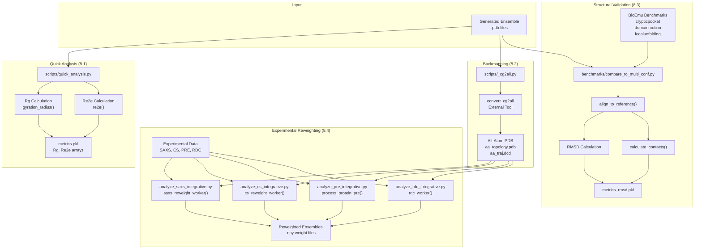

**Sources:** [README.md L208-L269](https://github.com/Junjie-Zhu/IDPFold2/blob/5315b279/README.md?plain=1#L208-L269)

 [scripts/quick_analysis.py L1-L81](https://github.com/Junjie-Zhu/IDPFold2/blob/5315b279/scripts/quick_analysis.py#L1-L81)

 [scripts/_cg2all.py L1-L70](https://github.com/Junjie-Zhu/IDPFold2/blob/5315b279/scripts/_cg2all.py#L1-L70)

 [benchmarks/compare_to_multi_conf.py L1-L352](https://github.com/Junjie-Zhu/IDPFold2/blob/5315b279/benchmarks/compare_to_multi_conf.py#L1-L352)

---

## Evaluation Scripts and Entry Points

The evaluation codebase is organized into two directories with distinct purposes:

### Directory Structure

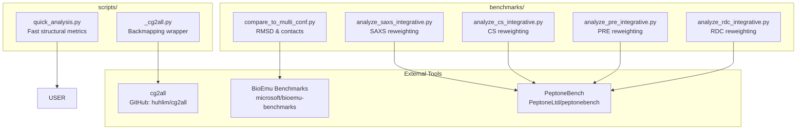

**Sources:** [README.md L208-L269](https://github.com/Junjie-Zhu/IDPFold2/blob/5315b279/README.md?plain=1#L208-L269)

 [scripts/quick_analysis.py L1-L10](https://github.com/Junjie-Zhu/IDPFold2/blob/5315b279/scripts/quick_analysis.py#L1-L10)

 [benchmarks/compare_to_multi_conf.py L1-L25](https://github.com/Junjie-Zhu/IDPFold2/blob/5315b279/benchmarks/compare_to_multi_conf.py#L1-L25)

### Script Invocation Patterns

| Script | Invocation | Input | Output |
| --- | --- | --- | --- |
| `quick_analysis.py` | `python scripts/quick_analysis.py /path/to/ensemble` | Directory with `.pdb` files | `metrics.pkl` |
| `_cg2all.py` | `python scripts/_cg2all.py -i /input -o /output` | Coarse-grained PDB | All-atom DCD/PDB |
| `compare_to_multi_conf.py` | `python benchmarks/compare_to_multi_conf.py /path` | PDB + BioEmu references | `metrics_rmsd.pkl` |
| `analyze_saxs_integrative.py` | `python benchmarks/analyze_saxs_integrative.py -i /ensemble -e /exp` | SAXS profiles + exp data | `SAXSrew_*.npy` |
| `analyze_cs_integrative.py` | `python benchmarks/analyze_cs_integrative.py -i /ensemble -e /exp` | CS predictions + exp data | `CSrew_*.npy` |
| `analyze_pre_integrative.py` | `python benchmarks/analyze_pre_integrative.py -i /ensemble -e /exp -p /pre` | PRE data + SAXS weights | `PRE_analysis_*.json` |
| `analyze_rdc_integrative.py` | `python benchmarks/analyze_rdc_integrative.py -i /ensemble -e /exp -r /rdc` | RDC data + CS weights | `RDC_analysis_*.npy` |

**Sources:** [README.md L208-L269](https://github.com/Junjie-Zhu/IDPFold2/blob/5315b279/README.md?plain=1#L208-L269)

 [benchmarks/analyze_saxs_integrative.py L251-L285](https://github.com/Junjie-Zhu/IDPFold2/blob/5315b279/benchmarks/analyze_saxs_integrative.py#L251-L285)

 [benchmarks/analyze_cs_integrative.py L214-L245](https://github.com/Junjie-Zhu/IDPFold2/blob/5315b279/benchmarks/analyze_cs_integrative.py#L214-L245)

---

## Quick Structural Analysis

The quick analysis module calculates basic structural properties directly from coarse-grained ensembles without backmapping.

### Metrics Computed

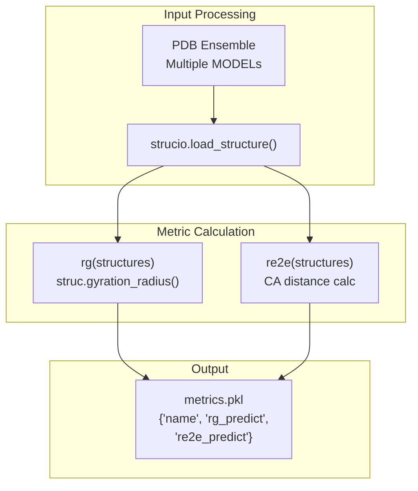

**Sources:** [scripts/quick_analysis.py L17-L52](https://github.com/Junjie-Zhu/IDPFold2/blob/5315b279/scripts/quick_analysis.py#L17-L52)

### Implementation Details

The `process_fn()` function handles per-protein analysis:

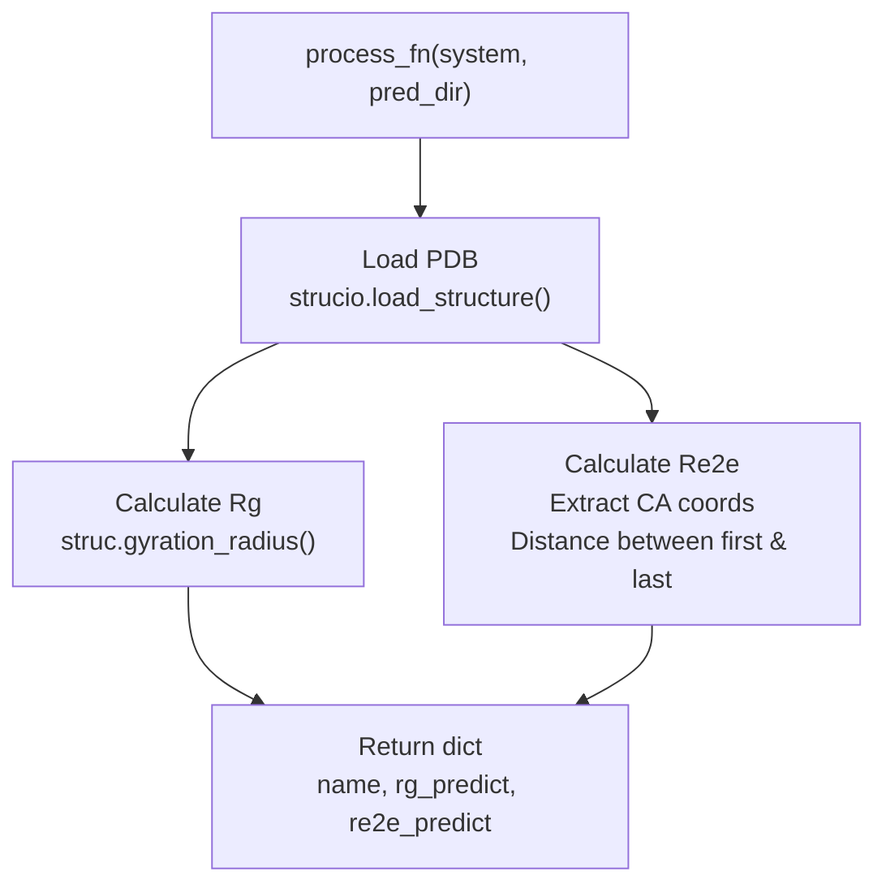

**Sources:** [scripts/quick_analysis.py L36-L52](https://github.com/Junjie-Zhu/IDPFold2/blob/5315b279/scripts/quick_analysis.py#L36-L52)

#### Radius of Gyration (Rg)

The radius of gyration measures the root-mean-square distance of atoms from the protein's center of mass. It is calculated using Biotite's built-in function [scripts/quick_analysis.py L54-L55](https://github.com/Junjie-Zhu/IDPFold2/blob/5315b279/scripts/quick_analysis.py#L54-L55)

:

* **Input**: Biotite `AtomArray` with all atoms
* **Formula**: $R_g = \sqrt{\frac{1}{N}\sum_{i=1}^{N}(r_i - r_{COM})^2}$
* **Output**: Array of Rg values for each model in the ensemble

#### End-to-End Distance (Re2e)

The end-to-end distance measures the distance between the first and last Cα atoms [scripts/quick_analysis.py L58-L67](https://github.com/Junjie-Zhu/IDPFold2/blob/5315b279/scripts/quick_analysis.py#L58-L67)

:

```
For each model:
    1. Filter to CA atoms
    2. Extract coordinates
    3. Calculate Euclidean distance: ||coords[0] - coords[-1]||
```

### Multiprocessing

The script uses multiprocessing to accelerate analysis across multiple proteins [scripts/quick_analysis.py L22-L29](https://github.com/Junjie-Zhu/IDPFold2/blob/5315b279/scripts/quick_analysis.py#L22-L29)

:

* Uses `multiprocessing.Pool` with `os.cpu_count()` workers
* Employs `functools.partial` to fix the `pred_dir` argument
* Progress tracking via `tqdm`
* Results consolidated into unified dictionary [scripts/quick_analysis.py L70-L73](https://github.com/Junjie-Zhu/IDPFold2/blob/5315b279/scripts/quick_analysis.py#L70-L73)

**Sources:** [scripts/quick_analysis.py L1-L81](https://github.com/Junjie-Zhu/IDPFold2/blob/5315b279/scripts/quick_analysis.py#L1-L81)

---

## Backmapping to All-Atom Structures

IDPFold2 generates coarse-grained (Cα-only) ensembles. For detailed analysis requiring all atoms (e.g., chemical shifts, PRE), structures must be backmapped to all-atom representations using the external `cg2all` tool.

### Backmapping Workflow

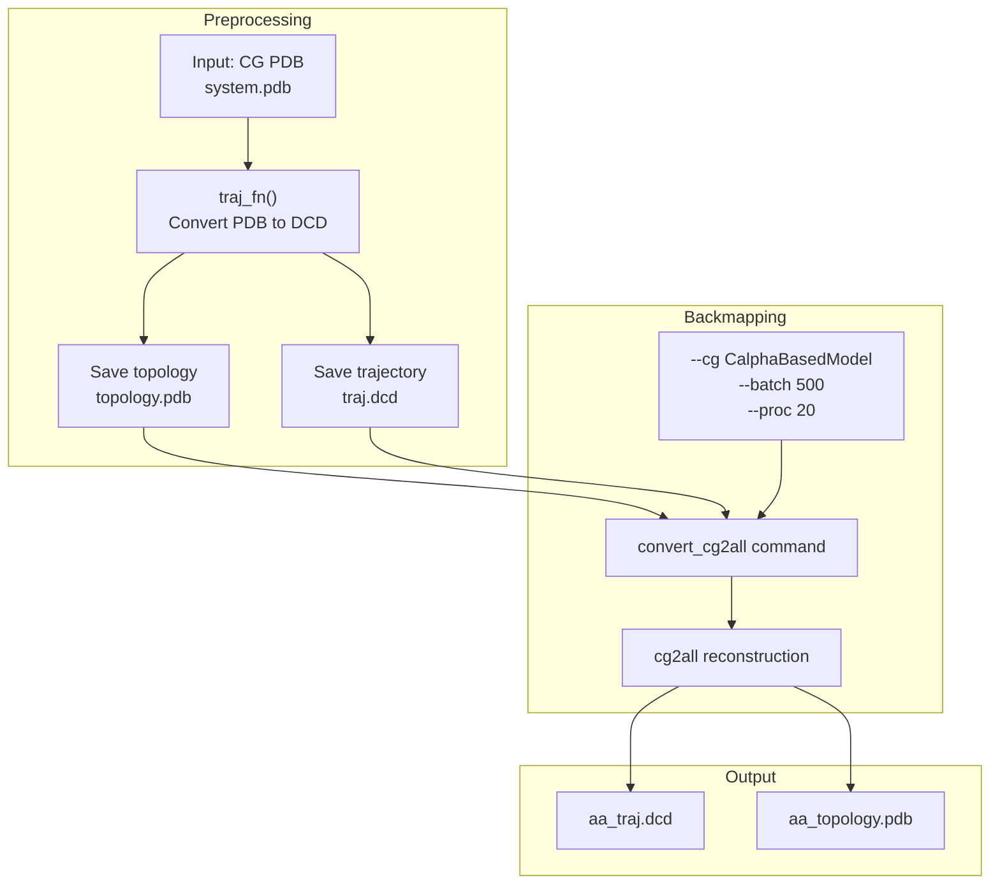

**Sources:** [scripts/_cg2all.py L32-L51](https://github.com/Junjie-Zhu/IDPFold2/blob/5315b279/scripts/_cg2all.py#L32-L51)

 [README.md L218-L229](https://github.com/Junjie-Zhu/IDPFold2/blob/5315b279/README.md?plain=1#L218-L229)

### Implementation

The backmapping script [scripts/_cg2all.py L1-L70](https://github.com/Junjie-Zhu/IDPFold2/blob/5315b279/scripts/_cg2all.py#L1-L70)

 follows a two-stage process:

#### Stage 1: Format Conversion

The `traj_fn()` function converts PDB ensembles to DCD trajectory format [scripts/_cg2all.py L44-L51](https://github.com/Junjie-Zhu/IDPFold2/blob/5315b279/scripts/_cg2all.py#L44-L51)

:

| Step | Operation | Tool |
| --- | --- | --- |
| Load | Read PDB ensemble | `mdtraj.load()` |
| Split | Extract first frame as topology | `traj[0].save_pdb()` |
| Convert | Save trajectory as DCD | `traj.save_dcd()` |

#### Stage 2: Reconstruction

The `process_fn()` function invokes the external `cg2all` tool [scripts/_cg2all.py L32-L41](https://github.com/Junjie-Zhu/IDPFold2/blob/5315b279/scripts/_cg2all.py#L32-L41)

:

**Command Template**:

```
convert_cg2all \    -p {output_dir}/{system}/topology.pdb \    -d {output_dir}/{system}/traj.dcd \    -o {output_dir}/{system}/aa_traj.dcd \    -opdb {output_dir}/{system}/aa_topology.pdb \    --cg CalphaBasedModel \    --batch {batch_size} --proc {num_proc}
```

**Performance Parameters**:

* `--batch`: Number of frames processed per batch (default: 500)
* `--proc`: Number of parallel processes (default: 20)
* `OMP_NUM_THREAD`: OpenMP threads per process (recommended: 2)

### Usage Recommendations

From [README.md L225-L229](https://github.com/Junjie-Zhu/IDPFold2/blob/5315b279/README.md?plain=1#L225-L229)

:

* Adjust `OMP_NUM_THREAD` and `num_proc` for efficiency
* Setting `OMP_NUM_THREAD=2` and `num_proc=20` works well with 40 CPU cores
* Total parallelism = `OMP_NUM_THREAD × num_proc`

**Sources:** [scripts/_cg2all.py L1-L70](https://github.com/Junjie-Zhu/IDPFold2/blob/5315b279/scripts/_cg2all.py#L1-L70)

 [README.md L218-L229](https://github.com/Junjie-Zhu/IDPFold2/blob/5315b279/README.md?plain=1#L218-L229)

---

## Structural Validation Against Benchmarks

The structural validation module compares generated ensembles to experimental multi-conformer structures from the BioEmu Benchmarks suite.

### BioEmu Benchmarks

IDPFold2 evaluates against five benchmark categories [benchmarks/compare_to_multi_conf.py L25-L29](https://github.com/Junjie-Zhu/IDPFold2/blob/5315b279/benchmarks/compare_to_multi_conf.py#L25-L29)

:

| Benchmark | Focus | Reference File |
| --- | --- | --- |
| `crypticpocket/` | Cryptic pocket opening | `crypticpocket/references.csv` |
| `domainmotion/` | Large-scale domain motions | `domainmotion/references.csv` |
| `localunfolding/` | Local disorder/unfolding | `localunfolding/references.csv` |
| `ood60/` | Out-of-distribution test set | `ood60/references.csv` |
| `oodval/` | OOD validation set | `oodval/references.csv` |

### Alignment and RMSD Pipeline

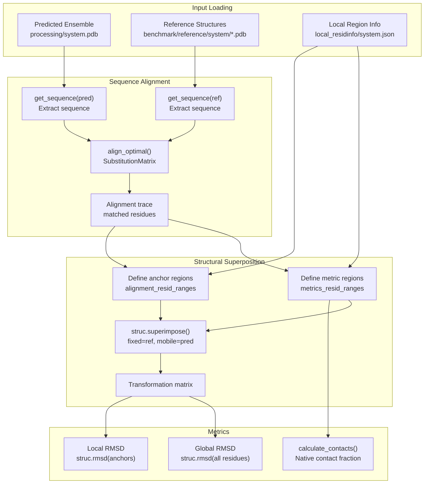

**Sources:** [benchmarks/compare_to_multi_conf.py L244-L317](https://github.com/Junjie-Zhu/IDPFold2/blob/5315b279/benchmarks/compare_to_multi_conf.py#L244-L317)

### Alignment Implementation

The `align_to_reference()` function [benchmarks/compare_to_multi_conf.py L244-L317](https://github.com/Junjie-Zhu/IDPFold2/blob/5315b279/benchmarks/compare_to_multi_conf.py#L244-L317)

 performs multi-stage alignment:

#### Stage 1: Sequence Alignment

Uses Biotite's optimal alignment with a protein substitution matrix [benchmarks/compare_to_multi_conf.py L248-L262](https://github.com/Junjie-Zhu/IDPFold2/blob/5315b279/benchmarks/compare_to_multi_conf.py#L248-L262)

:

* **Algorithm**: `align_optimal()` with `SubstitutionMatrix.std_protein_matrix()`
* **Output**: Alignment trace mapping predicted to reference residue indices
* **Filtering**: Only matched positions (trace[:, 0] != -1 and trace[:, 1] != -1)

#### Stage 2: Region Selection

For local unfolding benchmarks, alignment uses specific regions [benchmarks/compare_to_multi_conf.py L268-L288](https://github.com/Junjie-Zhu/IDPFold2/blob/5315b279/benchmarks/compare_to_multi_conf.py#L268-L288)

:

| Region Type | Purpose | Source |
| --- | --- | --- |
| `alignment_resid_ranges` | Anchor points for superposition | Structured/folded regions |
| `metrics_resid_ranges` | Regions for RMSD calculation | Mobile/disordered regions |

If no regions specified, entire sequence is used.

#### Stage 3: Structural Superposition

Biotite's `struc.superimpose()` computes optimal rotation/translation [benchmarks/compare_to_multi_conf.py L303-L315](https://github.com/Junjie-Zhu/IDPFold2/blob/5315b279/benchmarks/compare_to_multi_conf.py#L303-L315)

:

```yaml
Input: 
    fixed = reference CA coordinates (anchor region)
    mobile = predicted CA coordinates (anchor region, all models)

Output:
    aligned = transformed mobile coordinates
    transform = transformation matrix object

Metrics:
    local_rmsd = RMSD(aligned_anchors, fixed_anchors)
    global_rmsd = RMSD(transform.apply(all_coords), ref_all_coords)
```

### Native Contact Calculation

The `calculate_contacts()` function [benchmarks/compare_to_multi_conf.py L320-L348](https://github.com/Junjie-Zhu/IDPFold2/blob/5315b279/benchmarks/compare_to_multi_conf.py#L320-L348)

 quantifies conformational similarity:

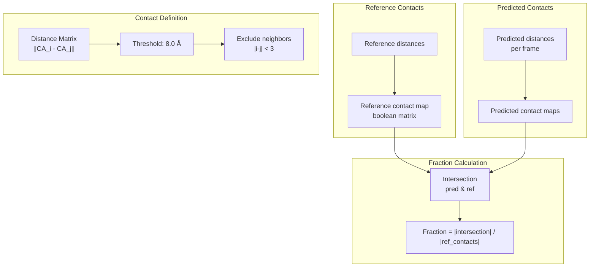

**Sources:** [benchmarks/compare_to_multi_conf.py L320-L348](https://github.com/Junjie-Zhu/IDPFold2/blob/5315b279/benchmarks/compare_to_multi_conf.py#L320-L348)

#### Contact Criteria

* **Distance threshold**: 8.0 Å between Cα atoms
* **Neighbor exclusion**: Residues within ±3 sequence positions ignored
* **Output**: Fraction of native contacts preserved in each predicted model

### Multiprocessing Pipeline

The main script [benchmarks/compare_to_multi_conf.py L128-L178](https://github.com/Junjie-Zhu/IDPFold2/blob/5315b279/benchmarks/compare_to_multi_conf.py#L128-L178)

 uses parallel processing:

1. **System filtering**: Identify test cases present in benchmark references
2. **File preparation**: Copy relevant PDBs to `processing/` directory
3. **Parallel processing**: `multiprocessing.Pool` with `os.cpu_count()` workers
4. **Result consolidation**: Collect RMSD and contact data into `metrics_rmsd.pkl`

**Sources:** [benchmarks/compare_to_multi_conf.py L1-L352](https://github.com/Junjie-Zhu/IDPFold2/blob/5315b279/benchmarks/compare_to_multi_conf.py#L1-L352)

---

## Experimental Data Reweighting

Ensemble reweighting refines generated conformations to match experimental observables using maximum entropy principles. IDPFold2 implements reweighting for four experimental data types: SAXS, chemical shifts (CS), paramagnetic relaxation enhancement (PRE), and residual dipolar couplings (RDC).

### Reweighting Framework

All reweighting methods follow a common maximum entropy optimization framework:

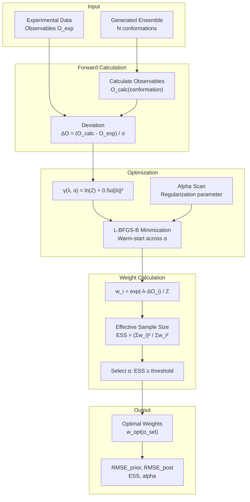

**Sources:** [benchmarks/analyze_saxs_integrative.py L88-L133](https://github.com/Junjie-Zhu/IDPFold2/blob/5315b279/benchmarks/analyze_saxs_integrative.py#L88-L133)

 [benchmarks/analyze_cs_integrative.py L26-L64](https://github.com/Junjie-Zhu/IDPFold2/blob/5315b279/benchmarks/analyze_cs_integrative.py#L26-L64)

### Common Optimization Components

All reweighting scripts share core optimization logic:

#### Objective Function

The dual objective function for maximum entropy reweighting [benchmarks/analyze_saxs_integrative.py L114-L132](https://github.com/Junjie-Zhu/IDPFold2/blob/5315b279/benchmarks/analyze_saxs_integrative.py#L114-L132)

:

```yaml
γ(λ, α) = ln(Z) + 0.5 * α * ||λ||²

where:
    Z = Σ_i exp(-λ · ΔO_i)  [partition function]
    λ = Lagrange multipliers
    α = regularization parameter
    ΔO_i = standardized deviations for conformation i

Gradient:
    ∇γ = -<ΔO>_reweighted + α * λ
```

#### Warm-Start Alpha Scanning

The `run_gamma_minimization_turbo()` function [benchmarks/analyze_saxs_integrative.py L135-L178](https://github.com/Junjie-Zhu/IDPFold2/blob/5315b279/benchmarks/analyze_saxs_integrative.py#L135-L178)

 optimizes across multiple α values:

| Step | Purpose | Implementation |
| --- | --- | --- |
| Sort alphas | Start from high α (easier) | `np.sort(alpha_range)[::-1]` |
| Initialize | Begin at uniform weights | `last_lmbd = np.zeros(n_obs)` |
| Iterate | Use previous solution as x0 | L-BFGS-B with warm-start |
| Collect | Store λ for each α | `alpha_to_lmbd[alpha]` |

#### Weight Computation

Weights are computed via softmax normalization [benchmarks/analyze_saxs_integrative.py L17-L29](https://github.com/Junjie-Zhu/IDPFold2/blob/5315b279/benchmarks/analyze_saxs_integrative.py#L17-L29)

:

```
w_i = exp(-λ · ΔO_i) / Z

Special handling:
    - NaN samples receive weight 0
    - Weights normalized: Σw_i = 1
```

#### Effective Sample Size (ESS)

ESS measures the information content of reweighted ensemble [benchmarks/analyze_saxs_integrative.py L32-L40](https://github.com/Junjie-Zhu/IDPFold2/blob/5315b279/benchmarks/analyze_saxs_integrative.py#L32-L40)

:

```
ESS = (Σw_i)² / Σw_i²

Selection threshold:
    ESS_min = min(max_ESS, max(100, 0.1 * N_samples))
```

### SAXS Reweighting

Small-angle X-ray scattering provides low-resolution shape information.

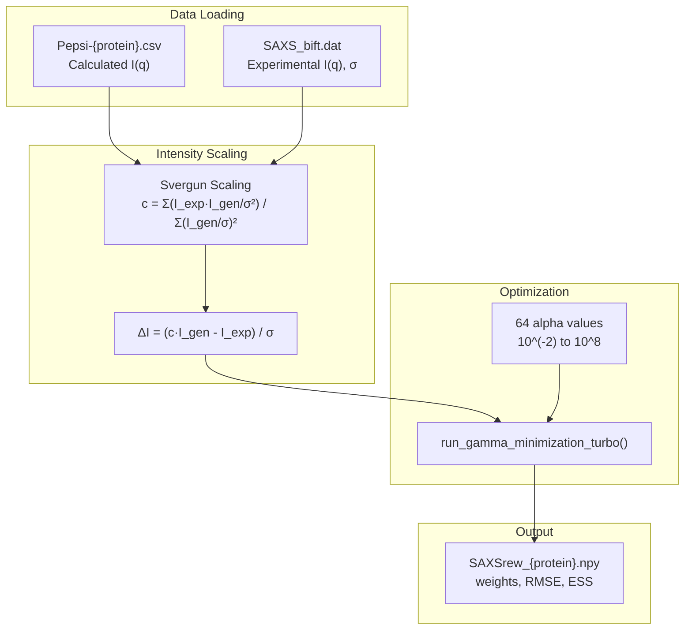

**Sources:** [benchmarks/analyze_saxs_integrative.py L181-L247](https://github.com/Junjie-Zhu/IDPFold2/blob/5315b279/benchmarks/analyze_saxs_integrative.py#L181-L247)

#### Implementation: saxs_reweight_worker()

The worker function [benchmarks/analyze_saxs_integrative.py L181-L247](https://github.com/Junjie-Zhu/IDPFold2/blob/5315b279/benchmarks/analyze_saxs_integrative.py#L181-L247)

 processes a single protein:

1. **Load data**: Parse SAXS profiles using `parse_gensaxs_dat()` and `parse_saxs_dat()`
2. **Scale intensities**: Apply Svergun scaling [benchmarks/analyze_saxs_integrative.py L77-L86](https://github.com/Junjie-Zhu/IDPFold2/blob/5315b279/benchmarks/analyze_saxs_integrative.py#L77-L86)
3. **Optimize**: Scan 64 α values from 10⁻² to 10⁸
4. **Select**: Choose α with ESS ≥ threshold and lowest RMSE
5. **Save**: Store all weights, metrics in `.npy` file

**Key parameters**:

* `intensity_scaling=True`: Apply optimal scaling factor to match intensity magnitude
* `n_alphas=64`: Resolution of regularization parameter scan

### Chemical Shift Reweighting

NMR chemical shifts provide atomic-level structural information for backbone and side-chain atoms.

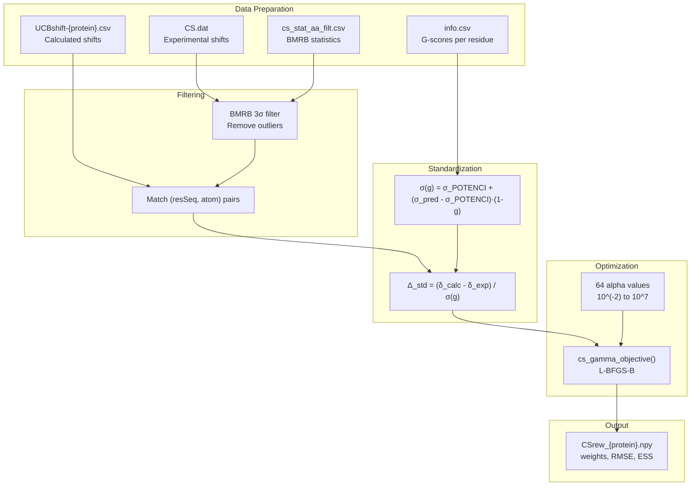

**Sources:** [benchmarks/analyze_cs_integrative.py L138-L210](https://github.com/Junjie-Zhu/IDPFold2/blob/5315b279/benchmarks/analyze_cs_integrative.py#L138-L210)

#### G-Score Weighted Uncertainties

Chemical shifts use residue-specific uncertainties based on structural order [benchmarks/analyze_cs_integrative.py L70-L92](https://github.com/Junjie-Zhu/IDPFold2/blob/5315b279/benchmarks/analyze_cs_integrative.py#L70-L92)

:

```yaml
σ_combined(g) = σ_POTENCI + (σ_predictor - σ_POTENCI) × (1 - g)

where:
    g = G-score (0=disordered, 1=ordered)
    σ_POTENCI = intrinsic uncertainty (0.18 ppm for CA)
    σ_predictor = prediction error (1.09 ppm for UCBshift CA)
```

| Atom | POTENCI σ | UCBshift σ | Ordered σ (g=1) | Disordered σ (g=0) |
| --- | --- | --- | --- | --- |
| CA | 0.186 | 1.09 | 0.186 | 1.09 |
| CB | 0.168 | 1.34 | 0.168 | 1.34 |
| N | 0.534 | 2.61 | 0.534 | 2.61 |
| H | 0.074 | 0.45 | 0.074 | 0.45 |

#### BMRB Statistical Filtering

Experimental shifts are validated against BMRB database statistics [benchmarks/analyze_cs_integrative.py L95-L113](https://github.com/Junjie-Zhu/IDPFold2/blob/5315b279/benchmarks/analyze_cs_integrative.py#L95-L113)

:

```python
Filter criterion:
    |δ_exp - μ_BMRB| < 3 × σ_BMRB

where μ_BMRB, σ_BMRB from BMRB Chemical Shift Statistics
```

#### Implementation: cs_reweight_worker()

The worker function [benchmarks/analyze_cs_integrative.py L138-L210](https://github.com/Junjie-Zhu/IDPFold2/blob/5315b279/benchmarks/analyze_cs_integrative.py#L138-L210)

 implements:

1. **Load**: Parse calculated shifts, experimental data, BMRB stats, g-scores
2. **Filter**: Apply BMRB 3σ filter to experimental data
3. **Standardize**: Compute g-score weighted deviations
4. **Optimize**: Scan 64 α values with warm-start L-BFGS-B
5. **Select**: Choose highest ESS meeting threshold
6. **Save**: Store weights and metrics

**Sources:** [benchmarks/analyze_cs_integrative.py L1-L245](https://github.com/Junjie-Zhu/IDPFold2/blob/5315b279/benchmarks/analyze_cs_integrative.py#L1-L245)

### PRE Reweighting

Paramagnetic relaxation enhancement measures distances from spin label to amide protons.

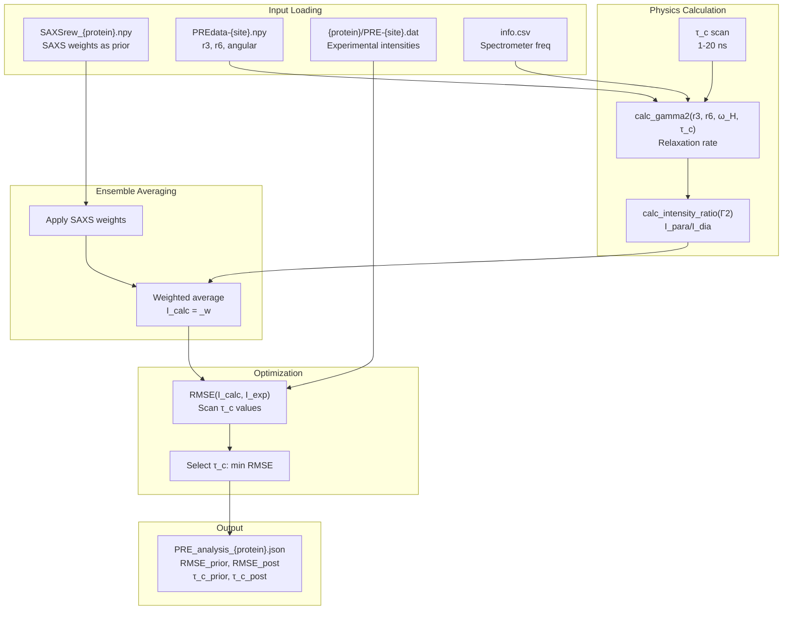

**Sources:** [benchmarks/analyze_pre_integrative.py L84-L200](https://github.com/Junjie-Zhu/IDPFold2/blob/5315b279/benchmarks/analyze_pre_integrative.py#L84-L200)

#### PRE Physics

The `calc_gamma2()` function [benchmarks/analyze_pre_integrative.py L27-L35](https://github.com/Junjie-Zhu/IDPFold2/blob/5315b279/benchmarks/analyze_pre_integrative.py#L27-L35)

 computes relaxation rates:

```yaml
Γ2 = K × r⁻⁶ × [4J(0) + 3J(ω_H)]

where:
    K = 1.23×10¹⁶ Å⁶ s⁻²
    J(ω) = S² × τ_c / (1 + (ωτ_c)²) + (1-S²) × τ_t / (1 + (ωτ_t)²)
    S² = <r³>² / <r⁶>  [order parameter]
    τ_t = 0.5 ns [fast internal motion]
    τ_c = correlation time (optimized)
```

Intensity ratios depend on experiment type [benchmarks/analyze_pre_integrative.py L39-L44](https://github.com/Junjie-Zhu/IDPFold2/blob/5315b279/benchmarks/analyze_pre_integrative.py#L39-L44)

:

| Experiment | Intensity Formula |
| --- | --- |
| HSQC | `exp(-T_HSQC × Γ2) × R2H / (R2H + Γ2)` |
| HMQC | `exp(-T_HMQC × Γ2) × R2H/(R2H+Γ2) × R2MQ/(R2MQ+Γ2)` |

#### Two-Stage Reweighting

PRE reweighting uses SAXS weights as prior [benchmarks/analyze_pre_integrative.py L84-L200](https://github.com/Junjie-Zhu/IDPFold2/blob/5315b279/benchmarks/analyze_pre_integrative.py#L84-L200)

:

1. **Prior**: Uniform weights on valid SAXS-reweighted conformations
2. **Posterior**: Use optimal SAXS weights
3. **Selection**: Choose SAXS α with ESS ≥ 100 and best PRE RMSE

#### Correlation Time Optimization

The `perform_scan()` function [benchmarks/analyze_pre_integrative.py L132-L155](https://github.com/Junjie-Zhu/IDPFold2/blob/5315b279/benchmarks/analyze_pre_integrative.py#L132-L155)

 searches for optimal τ_c:

* **Range**: 1-20 ns (20 values)
* **Objective**: Minimize RMSE across all PRE sites
* **Output**: Best τ_c, calculated intensities, RMSE

**Sources:** [benchmarks/analyze_pre_integrative.py L1-L235](https://github.com/Junjie-Zhu/IDPFold2/blob/5315b279/benchmarks/analyze_pre_integrative.py#L1-L235)

### RDC Reweighting

Residual dipolar couplings measure bond vector orientations in partially aligned media.

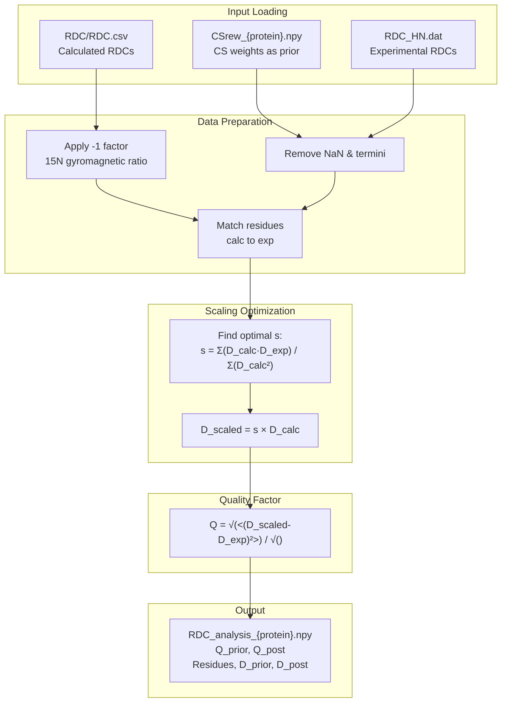

**Sources:** [benchmarks/analyze_rdc_integrative.py L66-L130](https://github.com/Junjie-Zhu/IDPFold2/blob/5315b279/benchmarks/analyze_rdc_integrative.py#L66-L130)

#### RDC Processing

The `scale_rdcs_to_minimize_q()` function [benchmarks/analyze_rdc_integrative.py L23-L61](https://github.com/Junjie-Zhu/IDPFold2/blob/5315b279/benchmarks/analyze_rdc_integrative.py#L23-L61)

 implements:

1. **Weight application**: * Prior: Uniform weights on non-NaN conformations * Posterior: Use CS reweighting
2. **Ensemble average**: Compute weighted mean RDCs
3. **Scaling**: Find optimal scaling factor for sign-matched pairs
4. **Q-factor**: Calculate Cornilescu quality metric

#### Sign Matching

Scale optimization uses only RDC pairs with matching signs [benchmarks/analyze_rdc_integrative.py L43-L50](https://github.com/Junjie-Zhu/IDPFold2/blob/5315b279/benchmarks/analyze_rdc_integrative.py#L43-L50)

:

```markdown
keepidxs = where(D_calc × D_exp > 0)
s = Σ(D_calc[keep] × D_exp[keep]) / Σ(D_calc[keep]²)
s = max(s, 0)  # Non-negative constraint
```

#### Q-Factor Calculation

The Cornilescu Q-factor measures agreement [benchmarks/analyze_rdc_integrative.py L58-L59](https://github.com/Junjie-Zhu/IDPFold2/blob/5315b279/benchmarks/analyze_rdc_integrative.py#L58-L59)

:

```
Q = √(Σ(D_scaled - D_exp)²) / √(Σ(D_exp²))

Lower Q = better agreement
    Q < 0.2: Good
    Q < 0.4: Acceptable
```

#### Implementation: rdc_worker()

The worker function [benchmarks/analyze_rdc_integrative.py L66-L130](https://github.com/Junjie-Zhu/IDPFold2/blob/5315b279/benchmarks/analyze_rdc_integrative.py#L66-L130)

 processes a single protein:

1. **Load CS weights**: Use as prior for RDC refinement
2. **Load RDC data**: Parse calculated and experimental files
3. **Account for gyromagnetic ratio**: Multiply by -1 [benchmarks/analyze_rdc_integrative.py L19](https://github.com/Junjie-Zhu/IDPFold2/blob/5315b279/benchmarks/analyze_rdc_integrative.py#L19-L19)
4. **Filter**: Remove NaN, spin label residue, terminal residues
5. **Align**: Match simulation to experimental residues
6. **Optimize**: Calculate scaling and Q-factors
7. **Save**: Store results with residue-level details

**Sources:** [benchmarks/analyze_rdc_integrative.py L1-L175](https://github.com/Junjie-Zhu/IDPFold2/blob/5315b279/benchmarks/analyze_rdc_integrative.py#L1-L175)

---

## Multiprocessing Architecture

All evaluation scripts employ multiprocessing for efficiency:

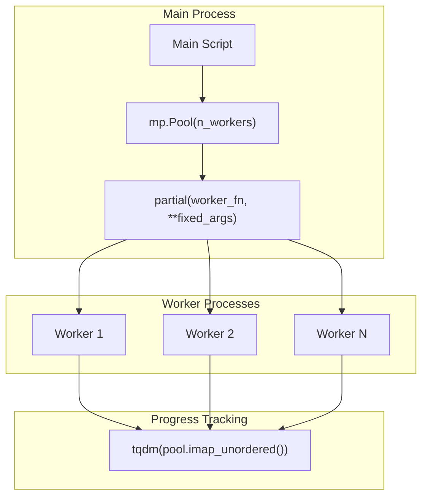

**Sources:** [benchmarks/analyze_saxs_integrative.py L269-L284](https://github.com/Junjie-Zhu/IDPFold2/blob/5315b279/benchmarks/analyze_saxs_integrative.py#L269-L284)

 [benchmarks/analyze_cs_integrative.py L234-L244](https://github.com/Junjie-Zhu/IDPFold2/blob/5315b279/benchmarks/analyze_cs_integrative.py#L234-L244)

### Worker Configuration

| Script | Worker Count | Strategy |
| --- | --- | --- |
| `quick_analysis.py` | `os.cpu_count()` | Full CPU utilization |
| `_cg2all.py` | `os.cpu_count()` | Format conversion stage only |
| `compare_to_multi_conf.py` | `os.cpu_count()` | Per-protein parallelism |
| `analyze_saxs_integrative.py` | `min(n_proteins, cpu_count)` | Avoid oversubscription |
| `analyze_cs_integrative.py` | `min(n_proteins//3, cpu_count)` | Computational load balancing |
| `analyze_pre_integrative.py` | `min(n_proteins, cpu_count)` | Standard parallelism |
| `analyze_rdc_integrative.py` | `min(n_proteins//3, cpu_count)` | Load balancing |

### Error Handling

All multiprocessing workers return status strings for centralized error reporting:

```css
# Successreturn f"Success {protein}: RMSE {rmse:.3f}" # Failurereturn f"Error {protein}: No valid data."return f"Failed {protein}: {traceback.format_exc()}"
```

Results are filtered and reported after parallel execution completes.

**Sources:** [benchmarks/analyze_saxs_integrative.py L181-L285](https://github.com/Junjie-Zhu/IDPFold2/blob/5315b279/benchmarks/analyze_saxs_integrative.py#L181-L285)

 [benchmarks/analyze_cs_integrative.py L138-L245](https://github.com/Junjie-Zhu/IDPFold2/blob/5315b279/benchmarks/analyze_cs_integrative.py#L138-L245)

---

## Summary of Evaluation Outputs

| Analysis Type | Input | Output | Key Metrics |
| --- | --- | --- | --- |
| Quick Analysis | CG PDB | `metrics.pkl` | Rg, Re2e arrays per protein |
| Backmapping | CG PDB | `aa_traj.dcd`, `aa_topology.pdb` | All-atom coordinates |
| Structural | CG PDB + BioEmu refs | `metrics_rmsd.pkl` | Local/global RMSD, contact fraction |
| SAXS | AA ensemble + exp | `SAXSrew_*.npy` | Weights, RMSE, ESS, alpha |
| Chemical Shifts | AA ensemble + exp | `CSrew_*.npy` | Weights, RMSE, ESS, alpha |
| PRE | AA ensemble + exp | `PRE_analysis_*.json` | RMSE, τ_c, site-level I_para/I_dia |
| RDC | AA ensemble + exp | `RDC_analysis_*.npy` | Q-factor, scaled RDCs |

All reweighting outputs include:

* **Prior metrics**: Uniform weighting results
* **Posterior metrics**: Optimized reweighting results
* **Alpha scan**: Full regularization parameter sweep
* **Weights**: Per-conformation reweighting factors

**Sources:** [README.md L208-L269](https://github.com/Junjie-Zhu/IDPFold2/blob/5315b279/README.md?plain=1#L208-L269)

 [benchmarks/analyze_saxs_integrative.py L228-L241](https://github.com/Junjie-Zhu/IDPFold2/blob/5315b279/benchmarks/analyze_saxs_integrative.py#L228-L241)

 [benchmarks/analyze_cs_integrative.py L195-L208](https://github.com/Junjie-Zhu/IDPFold2/blob/5315b279/benchmarks/analyze_cs_integrative.py#L195-L208)