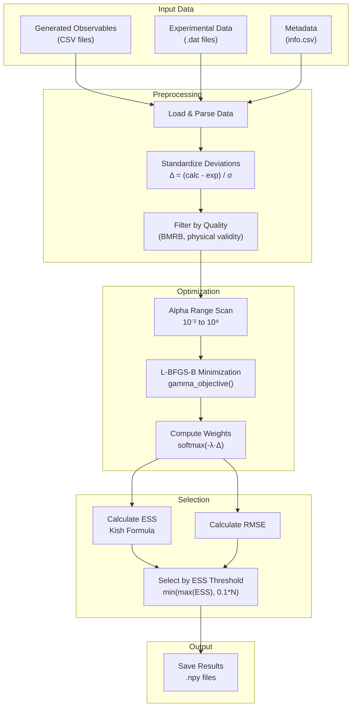
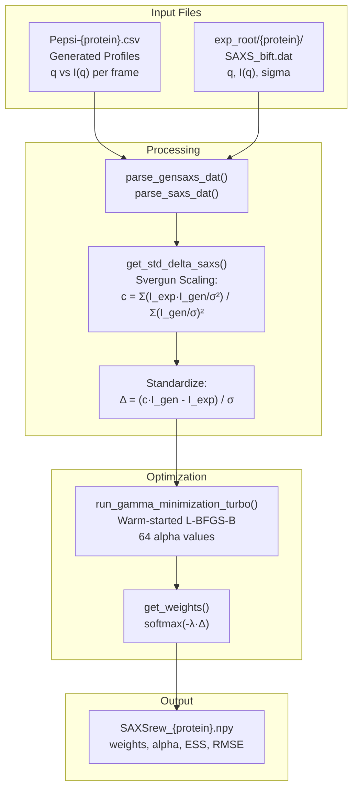
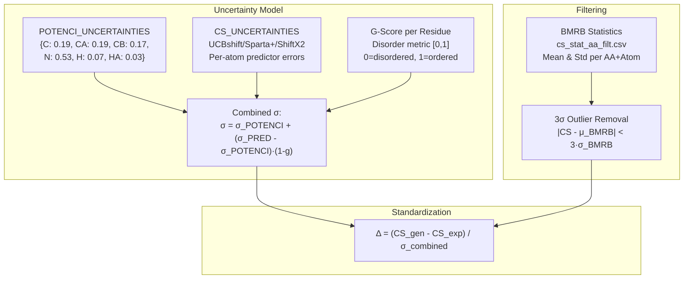
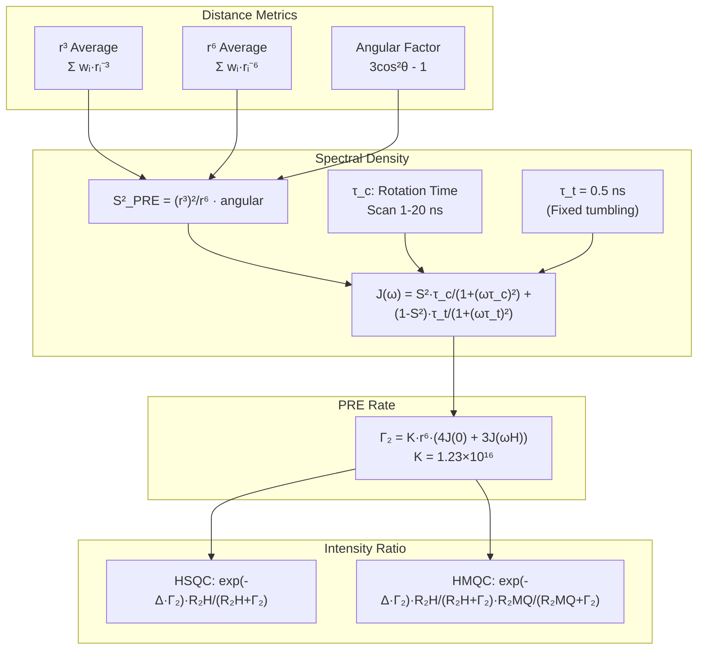
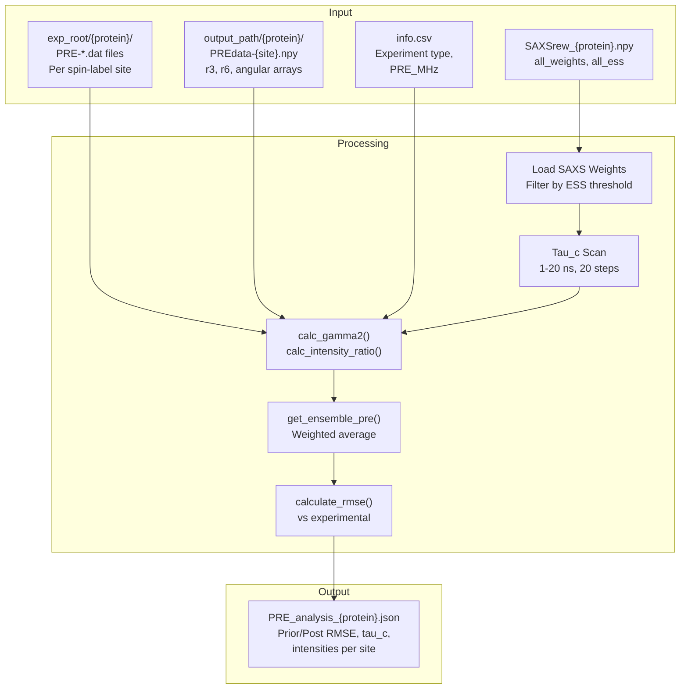
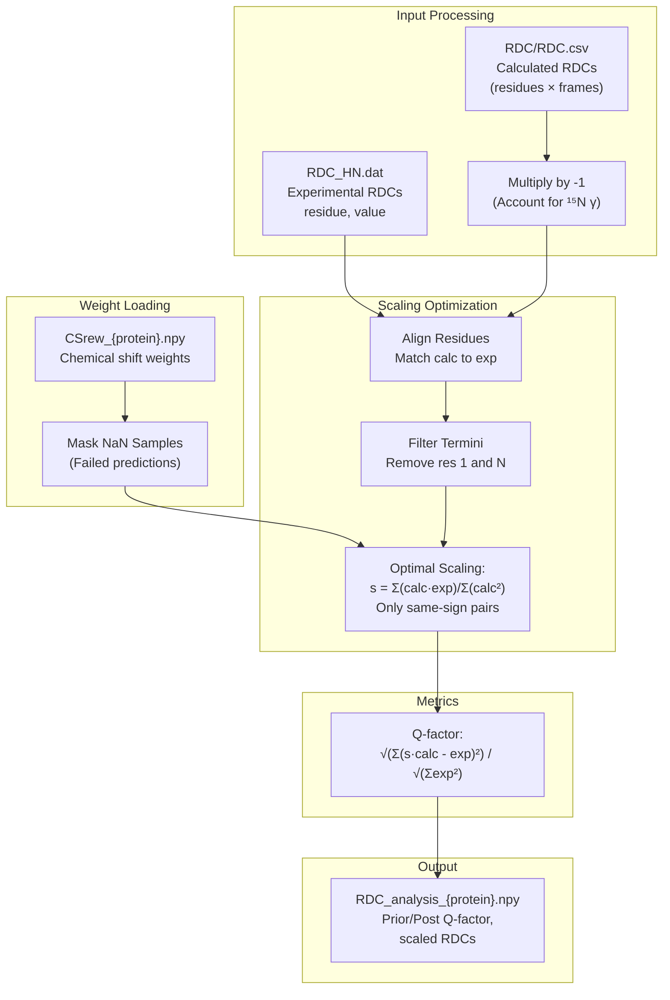
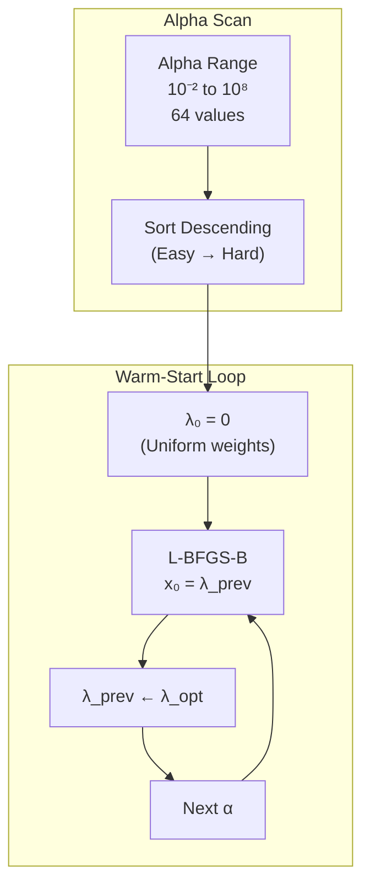
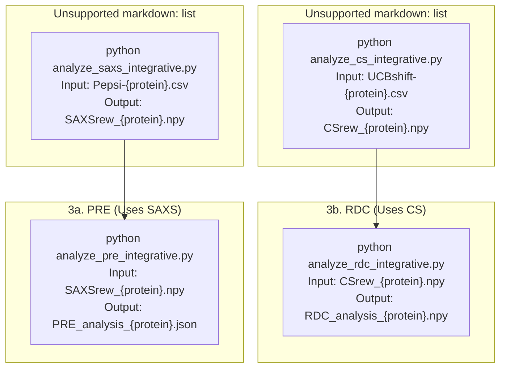

# Experimental Data Reweighting

> **Relevant source files**
> * [README.md](https://github.com/Junjie-Zhu/IDPFold2/blob/5315b279/README.md?plain=1)
> * [benchmarks/analyze_cs_integrative.py](https://github.com/Junjie-Zhu/IDPFold2/blob/5315b279/benchmarks/analyze_cs_integrative.py)
> * [benchmarks/analyze_pre_integrative.py](https://github.com/Junjie-Zhu/IDPFold2/blob/5315b279/benchmarks/analyze_pre_integrative.py)
> * [benchmarks/analyze_rdc_integrative.py](https://github.com/Junjie-Zhu/IDPFold2/blob/5315b279/benchmarks/analyze_rdc_integrative.py)
> * [benchmarks/analyze_saxs_integrative.py](https://github.com/Junjie-Zhu/IDPFold2/blob/5315b279/benchmarks/analyze_saxs_integrative.py)
> * [benchmarks/compare_to_multi_conf.py](https://github.com/Junjie-Zhu/IDPFold2/blob/5315b279/benchmarks/compare_to_multi_conf.py)
> * [scripts/_cg2all.py](https://github.com/Junjie-Zhu/IDPFold2/blob/5315b279/scripts/_cg2all.py)
> * [scripts/process_training_trajs.py](https://github.com/Junjie-Zhu/IDPFold2/blob/5315b279/scripts/process_training_trajs.py)
> * [scripts/quick_analysis.py](https://github.com/Junjie-Zhu/IDPFold2/blob/5315b279/scripts/quick_analysis.py)

## Purpose and Scope

This page documents the experimental data reweighting capabilities in IDPFold2, which enable refinement of generated conformational ensembles using experimental observables. The system implements Maximum Entropy (MaxEnt) reweighting for four types of experimental data: Small-Angle X-ray Scattering (SAXS), Chemical Shifts (CS), Paramagnetic Relaxation Enhancement (PRE), and Residual Dipolar Couplings (RDC). These tools are used to post-process generated ensembles to better match experimental measurements while maintaining maximum conformational diversity.

For information about generating initial ensembles, see [Inference Pipeline](/Junjie-Zhu/IDPFold2/7.1-inference-pipeline). For structural validation metrics, see [Structural Validation](/Junjie-Zhu/IDPFold2/8.3-structural-validation).

## Maximum Entropy Reweighting Framework

All reweighting methods implement the Maximum Entropy principle, which reweights an ensemble to match experimental observables while minimizing the change from the prior (uniform) distribution. This is formulated as a constrained optimization problem solved in the dual space.

### Mathematical Formulation

The dual objective function optimized for all experimental data types is:

```yaml
Γ(λ) = ln Z(λ) + (α/2)||λ||²

where:
  Z(λ) = Σᵢ exp(-λ · Δᵢ)         (partition function)
  Δᵢ = standardized deviation for sample i
  α = regularization parameter
  λ = Lagrange multipliers
```

The reweighted probabilities are obtained via softmax:

```
wᵢ = exp(-λ · Δᵢ) / Z(λ)
```

### Common Workflow Pattern

All reweighting scripts follow a similar structure:



**Workflow Diagram: Maximum Entropy Reweighting**

Sources: [benchmarks/analyze_saxs_integrative.py L1-L285](https://github.com/Junjie-Zhu/IDPFold2/blob/5315b279/benchmarks/analyze_saxs_integrative.py#L1-L285)

 [benchmarks/analyze_cs_integrative.py L1-L245](https://github.com/Junjie-Zhu/IDPFold2/blob/5315b279/benchmarks/analyze_cs_integrative.py#L1-L245)

### Key Metrics

| Metric | Formula | Purpose |
| --- | --- | --- |
| **RMSE** | `√(Σᵢ wᵢ(calcᵢ - exp)²) / √N` | Measures agreement with experiment |
| **ESS** | `(Σwᵢ)² / Σwᵢ²` | Kish effective sample size, measures diversity |
| **Q-factor** | `√(Σ(scaled - exp)²) / √(Σexp²)` | RDC-specific quality metric |

Sources: [benchmarks/analyze_saxs_integrative.py L32-L56](https://github.com/Junjie-Zhu/IDPFold2/blob/5315b279/benchmarks/analyze_saxs_integrative.py#L32-L56)

 [benchmarks/analyze_cs_integrative.py L116-L136](https://github.com/Junjie-Zhu/IDPFold2/blob/5315b279/benchmarks/analyze_cs_integrative.py#L116-L136)

## SAXS Reweighting

SAXS reweighting matches the ensemble-averaged scattering intensity profile to experimental measurements. The system uses Pepsi-SAXS calculated profiles and applies intensity scaling following the Svergun method.

### SAXS Data Flow



**Diagram: SAXS Reweighting Pipeline**

Sources: [benchmarks/analyze_saxs_integrative.py L58-L112](https://github.com/Junjie-Zhu/IDPFold2/blob/5315b279/benchmarks/analyze_saxs_integrative.py#L58-L112)

 [benchmarks/analyze_saxs_integrative.py L135-L178](https://github.com/Junjie-Zhu/IDPFold2/blob/5315b279/benchmarks/analyze_saxs_integrative.py#L135-L178)

### Key Functions

| Function | Location | Purpose |
| --- | --- | --- |
| `saxs_reweight_worker()` | [benchmarks/analyze_saxs_integrative.py L181-L247](https://github.com/Junjie-Zhu/IDPFold2/blob/5315b279/benchmarks/analyze_saxs_integrative.py#L181-L247) | Main processing function for a single protein |
| `parse_gensaxs_dat()` | [benchmarks/analyze_saxs_integrative.py L58-L63](https://github.com/Junjie-Zhu/IDPFold2/blob/5315b279/benchmarks/analyze_saxs_integrative.py#L58-L63) | Loads Pepsi-SAXS CSV with q and I(q) columns |
| `parse_saxs_dat()` | [benchmarks/analyze_saxs_integrative.py L65-L75](https://github.com/Junjie-Zhu/IDPFold2/blob/5315b279/benchmarks/analyze_saxs_integrative.py#L65-L75) | Loads experimental SAXS with q, I(q), sigma |
| `get_std_delta_saxs()` | [benchmarks/analyze_saxs_integrative.py L77-L86](https://github.com/Junjie-Zhu/IDPFold2/blob/5315b279/benchmarks/analyze_saxs_integrative.py#L77-L86) | Applies Svergun scaling and standardization |
| `gamma_objective()` | [benchmarks/analyze_saxs_integrative.py L114-L133](https://github.com/Junjie-Zhu/IDPFold2/blob/5315b279/benchmarks/analyze_saxs_integrative.py#L114-L133) | Dual objective with gradient for L-BFGS-B |
| `run_gamma_minimization_turbo()` | [benchmarks/analyze_saxs_integrative.py L135-L178](https://github.com/Junjie-Zhu/IDPFold2/blob/5315b279/benchmarks/analyze_saxs_integrative.py#L135-L178) | Optimizes over alpha range with warm-starting |

### Execution

```
python benchmarks/analyze_saxs_integrative.py \    --ensemble_root /path/to/pepsi/profiles \    --exp_root /path/to/experimental/data
```

The script processes all proteins with `SAXS_bift.dat` files in parallel using multiprocessing. Output is saved to `SAXSrew_{protein}.npy` containing:

* `n_obs`: Number of q-points
* `n_samples`: Number of ensemble frames
* `prior_rmse`: RMSE before reweighting
* `post_rmse`: RMSE after reweighting
* `alpha`: Selected regularization parameter
* `ess`: Effective sample size
* `weights`: Reweighting vector (shape: n_samples)
* `all_alphas`, `all_post_rmse`, `all_ess`, `all_weights`: Full scan results

Sources: [benchmarks/analyze_saxs_integrative.py L181-L247](https://github.com/Junjie-Zhu/IDPFold2/blob/5315b279/benchmarks/analyze_saxs_integrative.py#L181-L247)

 [benchmarks/analyze_saxs_integrative.py L251-L285](https://github.com/Junjie-Zhu/IDPFold2/blob/5315b279/benchmarks/analyze_saxs_integrative.py#L251-L285)

## Chemical Shift Reweighting

Chemical shift (CS) reweighting uses NMR chemical shift predictions to refine ensembles. The system incorporates residue-specific disorder scores (g-scores) to weight the uncertainty between intrinsic (POTENCI) and predictor error contributions.

### CS-Specific Features



**Diagram: Chemical Shift Uncertainty Model**

Sources: [benchmarks/analyze_cs_integrative.py L13-L21](https://github.com/Junjie-Zhu/IDPFold2/blob/5315b279/benchmarks/analyze_cs_integrative.py#L13-L21)

 [benchmarks/analyze_cs_integrative.py L69-L93](https://github.com/Junjie-Zhu/IDPFold2/blob/5315b279/benchmarks/analyze_cs_integrative.py#L69-L93)

### Key Functions

| Function | Location | Purpose |
| --- | --- | --- |
| `cs_reweight_worker()` | [benchmarks/analyze_cs_integrative.py L141-L210](https://github.com/Junjie-Zhu/IDPFold2/blob/5315b279/benchmarks/analyze_cs_integrative.py#L141-L210) | Main processing function for a single protein |
| `load_filtered_exp()` | [benchmarks/analyze_cs_integrative.py L95-L114](https://github.com/Junjie-Zhu/IDPFold2/blob/5315b279/benchmarks/analyze_cs_integrative.py#L95-L114) | Loads experimental CS with BMRB filtering |
| `standardize_deltas()` | [benchmarks/analyze_cs_integrative.py L69-L93](https://github.com/Junjie-Zhu/IDPFold2/blob/5315b279/benchmarks/analyze_cs_integrative.py#L69-L93) | Computes standardized deviations using g-scores |
| `cs_gamma_objective()` | [benchmarks/analyze_cs_integrative.py L26-L37](https://github.com/Junjie-Zhu/IDPFold2/blob/5315b279/benchmarks/analyze_cs_integrative.py#L26-L37) | Dual objective function |
| `run_cs_minimization_turbo()` | [benchmarks/analyze_cs_integrative.py L39-L65](https://github.com/Junjie-Zhu/IDPFold2/blob/5315b279/benchmarks/analyze_cs_integrative.py#L39-L65) | Sequential optimization with warm-starting |

### CS Constants

The system defines predictor-specific uncertainties:

```
POTENCI_UNCERTAINTIES = {    "C": 0.1861, "CA": 0.1862, "CB": 0.1677,     "N": 0.5341, "H": 0.0735, "HA": 0.0319, "HB": 0.0187} CS_UNCERTAINTIES = {    "UCBshift": {"C": 1.14, "CA": 1.09, "CB": 1.34, "N": 2.61, ...},    "Sparta+": {"C": 1.25, "CA": 1.16, "CB": 1.36, "N": 2.73, ...},    "ShiftX2": {"C": 1.20, "CA": 1.15, "CB": 1.37, "N": 2.73, ...}}
```

Sources: [benchmarks/analyze_cs_integrative.py L13-L21](https://github.com/Junjie-Zhu/IDPFold2/blob/5315b279/benchmarks/analyze_cs_integrative.py#L13-L21)

### Execution

```
python benchmarks/analyze_cs_integrative.py \    --ensemble_dir /path/to/ucbshift/predictions \    --exp_dir /path/to/experimental/data \    --bmrb_path cs_stat_aa_filt.csv \    --info_path PeptoneDB-Integrative.csv
```

Required input files:

* `UCBshift-{protein}.csv`: Generated CS predictions with columns (resSeq, name, frame columns)
* `{protein}/CS.dat`: Experimental chemical shifts
* `{protein}/info.csv`: G-scores per residue

Output: `CSrew_{protein}.npy` with weights and metrics

Sources: [benchmarks/analyze_cs_integrative.py L214-L245](https://github.com/Junjie-Zhu/IDPFold2/blob/5315b279/benchmarks/analyze_cs_integrative.py#L214-L245)

 [README.md L245-L251](https://github.com/Junjie-Zhu/IDPFold2/blob/5315b279/README.md?plain=1#L245-L251)

## PRE Reweighting

Paramagnetic Relaxation Enhancement (PRE) reweighting refines ensembles using distance-dependent relaxation rates measured from spin-labeled proteins. Unlike SAXS/CS, PRE reweighting uses SAXS-derived weights as a starting point and optimizes over the rotational correlation time (tau_c).

### PRE Physics Model



**Diagram: PRE Calculation Pipeline**

Sources: [benchmarks/analyze_pre_integrative.py L11-L19](https://github.com/Junjie-Zhu/IDPFold2/blob/5315b279/benchmarks/analyze_pre_integrative.py#L11-L19)

 [benchmarks/analyze_pre_integrative.py L22-L45](https://github.com/Junjie-Zhu/IDPFold2/blob/5315b279/benchmarks/analyze_pre_integrative.py#L22-L45)

### PRE Processing Flow

Unlike other methods, PRE reweighting operates in two stages:

1. **Use SAXS weights as prior**: Loads `SAXSrew_{protein}.npy`
2. **Optimize tau_c**: Scans correlation times to minimize RMSE



**Diagram: PRE Reweighting Pipeline**

Sources: [benchmarks/analyze_pre_integrative.py L84-L201](https://github.com/Junjie-Zhu/IDPFold2/blob/5315b279/benchmarks/analyze_pre_integrative.py#L84-L201)

### Key Functions

| Function | Location | Purpose |
| --- | --- | --- |
| `process_protein_pre()` | [benchmarks/analyze_pre_integrative.py L84-L201](https://github.com/Junjie-Zhu/IDPFold2/blob/5315b279/benchmarks/analyze_pre_integrative.py#L84-L201) | Main PRE reweighting function |
| `calc_gamma2()` | [benchmarks/analyze_pre_integrative.py L22-L36](https://github.com/Junjie-Zhu/IDPFold2/blob/5315b279/benchmarks/analyze_pre_integrative.py#L22-L36) | Calculates Γ₂ from distances and correlation times |
| `calc_intensity_ratio()` | [benchmarks/analyze_pre_integrative.py L38-L45](https://github.com/Junjie-Zhu/IDPFold2/blob/5315b279/benchmarks/analyze_pre_integrative.py#L38-L45) | Converts Γ₂ to I_para/I_dia based on experiment type |
| `get_ensemble_pre()` | [benchmarks/analyze_pre_integrative.py L54-L82](https://github.com/Junjie-Zhu/IDPFold2/blob/5315b279/benchmarks/analyze_pre_integrative.py#L54-L82) | Computes weighted ensemble average for given tau_c |

### PRE Constants

```markdown
K_CONST = 1.23e16      # Å⁶ s⁻²TAU_T = 0.5e-9         # 0.5 ns (fixed tumbling time)DELAY_HSQC = 0.010     # 10 msDELAY_HMQC = 0.01086   # 10.86 msR2H_HSQC = 10.0        # s⁻¹R2H_HMQC = 50.0        # s⁻¹R2MQ_HMQC = 50.0       # s⁻¹
```

Sources: [benchmarks/analyze_pre_integrative.py L11-L19](https://github.com/Junjie-Zhu/IDPFold2/blob/5315b279/benchmarks/analyze_pre_integrative.py#L11-L19)

### Execution

```
python benchmarks/analyze_pre_integrative.py \    --input_root /path/to/saxs/results \    --exp_root /path/to/experimental/data \    --pre_path /path/to/pre/calculations
```

The script requires:

* `SAXSrew_{protein}.npy` from SAXS reweighting
* `{protein}/PRE-*.dat` experimental files
* `{protein}/PREdata-{site}.npy` generated PRE arrays

Output: `PRE_analysis_{protein}.json` containing prior/post RMSE, optimal tau_c values, and intensity profiles per spin-label site

Sources: [benchmarks/analyze_pre_integrative.py L205-L235](https://github.com/Junjie-Zhu/IDPFold2/blob/5315b279/benchmarks/analyze_pre_integrative.py#L205-L235)

 [README.md L252-L261](https://github.com/Junjie-Zhu/IDPFold2/blob/5315b279/README.md?plain=1#L252-L261)

## RDC Reweighting

Residual Dipolar Coupling (RDC) reweighting uses orientational constraints to refine ensembles. Like PRE, it uses chemical shift-derived weights and performs scaling optimization.

### RDC Scaling and Q-Factor



**Diagram: RDC Reweighting Pipeline**

Sources: [benchmarks/analyze_rdc_integrative.py L14-L62](https://github.com/Junjie-Zhu/IDPFold2/blob/5315b279/benchmarks/analyze_rdc_integrative.py#L14-L62)

### Key Functions

| Function | Location | Purpose |
| --- | --- | --- |
| `rdc_worker()` | [benchmarks/analyze_rdc_integrative.py L66-L131](https://github.com/Junjie-Zhu/IDPFold2/blob/5315b279/benchmarks/analyze_rdc_integrative.py#L66-L131) | Main processing function for a single protein |
| `read_calc_RDCs()` | [benchmarks/analyze_rdc_integrative.py L14-L21](https://github.com/Junjie-Zhu/IDPFold2/blob/5315b279/benchmarks/analyze_rdc_integrative.py#L14-L21) | Parses calculated RDC CSV and accounts for ¹⁵N γ |
| `scale_rdcs_to_minimize_q()` | [benchmarks/analyze_rdc_integrative.py L23-L62](https://github.com/Junjie-Zhu/IDPFold2/blob/5315b279/benchmarks/analyze_rdc_integrative.py#L23-L62) | Computes optimal scaling factor and Q-factor |

### RDC Processing Logic

The scaling optimization distinguishes between prior and posterior:

```markdown
if is_prior:    # Mask out unphysical conformations (NaN weights)    mask_nan = ~np.isnan(weights)    calc_avg = np.average(calc_all_frames[mask_nan, :], axis=0)else:    # Standard reweighting    w = np.nan_to_num(weights, nan=0)    calc_avg = np.average(calc_all_frames, weights=w / np.sum(w), axis=0) # Scaling factor calculation (same-sign pairs only)if scale_matching:    prod = calc_avg * exp    keepidxs = np.where(prod > 0)[0]    s = np.sum(calc_filt * exp_filt) / np.sum(calc_filt ** 2)
```

Sources: [benchmarks/analyze_rdc_integrative.py L23-L62](https://github.com/Junjie-Zhu/IDPFold2/blob/5315b279/benchmarks/analyze_rdc_integrative.py#L23-L62)

### Execution

```
python benchmarks/analyze_rdc_integrative.py \    --proton_root /path/to/cs/results \    --exp_root /path/to/experimental/data \    --rdc_path /path/to/rdc/calculations \    --info_path PeptoneDB-Integrative.csv
```

Required inputs:

* `CSrew_{protein}.npy` from chemical shift reweighting
* `{protein}/RDC_HN.dat` experimental RDCs
* `{protein}/RDC/RDC.csv` calculated RDCs

Output: `RDC_analysis_{protein}.npy` containing:

* `Prior Q`, `Post. Q`: Q-factors before/after reweighting
* `Residues`: Aligned residue indices
* `Exp`, `Prior`, `Post.`: Experimental, prior-averaged, and post-averaged RDC values

Sources: [benchmarks/analyze_rdc_integrative.py L134-L175](https://github.com/Junjie-Zhu/IDPFold2/blob/5315b279/benchmarks/analyze_rdc_integrative.py#L134-L175)

 [README.md L257-L261](https://github.com/Junjie-Zhu/IDPFold2/blob/5315b279/README.md?plain=1#L257-L261)

## Common Utilities and Metrics

### Effective Sample Size (ESS)

All methods use the Kish formula to quantify ensemble diversity:

```python
def get_ESS(weights: np.ndarray) -> float:    """Kish effective sample size."""    mask_nan = ~np.isnan(weights)    if not mask_nan.any():        return np.nan    w = weights[mask_nan]    return float(np.sum(w)**2 / np.dot(w, w))
```

ESS ranges from 1 (all weight on one structure) to N (uniform weights). The system uses dual thresholds:

* Absolute: `ESS ≥ 100`
* Relative: `ESS ≥ 0.1 × N_samples`

Sources: [benchmarks/analyze_saxs_integrative.py L32-L40](https://github.com/Junjie-Zhu/IDPFold2/blob/5315b279/benchmarks/analyze_saxs_integrative.py#L32-L40)

 [benchmarks/analyze_cs_integrative.py L130-L136](https://github.com/Junjie-Zhu/IDPFold2/blob/5315b279/benchmarks/analyze_cs_integrative.py#L130-L136)

### RMSE Calculation

```python
def get_RMSE(std_delta_cs: np.ndarray,              weights: Optional[np.ndarray] = None) -> float:    mask_nan = ~np.isnan(std_delta_cs).any(axis=0)        if weights is None:        avg = np.average(std_delta_cs[:, mask_nan], axis=1)    else:        mask_nan_w = ~np.isnan(weights)        total_mask = mask_nan & mask_nan_w        avg = np.average(std_delta_cs[:, total_mask],                         weights=weights[total_mask], axis=1)        return np.linalg.norm(avg) / np.sqrt(len(std_delta_cs))
```

Sources: [benchmarks/analyze_saxs_integrative.py L42-L56](https://github.com/Junjie-Zhu/IDPFold2/blob/5315b279/benchmarks/analyze_saxs_integrative.py#L42-L56)

 [benchmarks/analyze_cs_integrative.py L116-L128](https://github.com/Junjie-Zhu/IDPFold2/blob/5315b279/benchmarks/analyze_cs_integrative.py#L116-L128)

### Optimization Strategy

All methods use warm-started L-BFGS-B optimization:



**Diagram: Warm-Started Optimization Strategy**

The key insight: high α (high regularization) produces solutions near λ=0, which serve as good initial guesses for lower α values.

Sources: [benchmarks/analyze_saxs_integrative.py L135-L178](https://github.com/Junjie-Zhu/IDPFold2/blob/5315b279/benchmarks/analyze_saxs_integrative.py#L135-L178)

 [benchmarks/analyze_cs_integrative.py L39-L65](https://github.com/Junjie-Zhu/IDPFold2/blob/5315b279/benchmarks/analyze_cs_integrative.py#L39-L65)

## Execution Workflow

### Sequential Processing Order

The reweighting must be performed in sequence due to dependencies:



**Diagram: Reweighting Execution Order**

Sources: [README.md L239-L269](https://github.com/Junjie-Zhu/IDPFold2/blob/5315b279/README.md?plain=1#L239-L269)

### Multiprocessing Architecture

All scripts use the same parallelization pattern:

```javascript
from functools import partialimport multiprocessing as mpfrom tqdm import tqdm # Configure worker function with fixed pathsworker_fn = partial(reweight_worker,                    ensemble_root=ENSEMBLE_ROOT,                    exp_root=EXP_ROOT) # Parallel execution with progress barnum_workers = min(len(proteins), mp.cpu_count())with mp.Pool(num_workers) as pool:    results = list(tqdm(pool.imap_unordered(worker_fn, proteins),                        total=len(proteins)))
```

Each protein is processed independently, with results saved to individual `.npy` or `.json` files.

Sources: [benchmarks/analyze_saxs_integrative.py L273-L278](https://github.com/Junjie-Zhu/IDPFold2/blob/5315b279/benchmarks/analyze_saxs_integrative.py#L273-L278)

 [benchmarks/analyze_cs_integrative.py L238-L243](https://github.com/Junjie-Zhu/IDPFold2/blob/5315b279/benchmarks/analyze_cs_integrative.py#L238-L243)

 [benchmarks/analyze_pre_integrative.py L228-L231](https://github.com/Junjie-Zhu/IDPFold2/blob/5315b279/benchmarks/analyze_pre_integrative.py#L228-L231)

 [benchmarks/analyze_rdc_integrative.py L162-L164](https://github.com/Junjie-Zhu/IDPFold2/blob/5315b279/benchmarks/analyze_rdc_integrative.py#L162-L164)

### Output File Structure

| Data Type | Output File | Key Contents |
| --- | --- | --- |
| **SAXS** | `SAXSrew_{protein}.npy` | `weights`, `alpha`, `ess`, `post_rmse`, `all_weights` |
| **CS** | `CSrew_{protein}.npy` | `weights`, `alpha`, `ess`, `post_rmse`, `all_weights` |
| **PRE** | `PRE_analysis_{protein}.json` | `Prior_RMSE`, `Post_RMSE`, `Prior_TauC`, `Post_TauC`, `Sites` |
| **RDC** | `RDC_analysis_{protein}.npy` | `Prior Q`, `Post. Q`, `Residues`, `Exp`, `Prior`, `Post.` |

All `.npy` files are NumPy dictionaries loadable with `np.load(file, allow_pickle=True).item()`.

Sources: [benchmarks/analyze_saxs_integrative.py L228-L242](https://github.com/Junjie-Zhu/IDPFold2/blob/5315b279/benchmarks/analyze_saxs_integrative.py#L228-L242)

 [benchmarks/analyze_cs_integrative.py L195-L208](https://github.com/Junjie-Zhu/IDPFold2/blob/5315b279/benchmarks/analyze_cs_integrative.py#L195-L208)

 [benchmarks/analyze_pre_integrative.py L176-L198](https://github.com/Junjie-Zhu/IDPFold2/blob/5315b279/benchmarks/analyze_pre_integrative.py#L176-L198)

 [benchmarks/analyze_rdc_integrative.py L122-L130](https://github.com/Junjie-Zhu/IDPFold2/blob/5315b279/benchmarks/analyze_rdc_integrative.py#L122-L130)