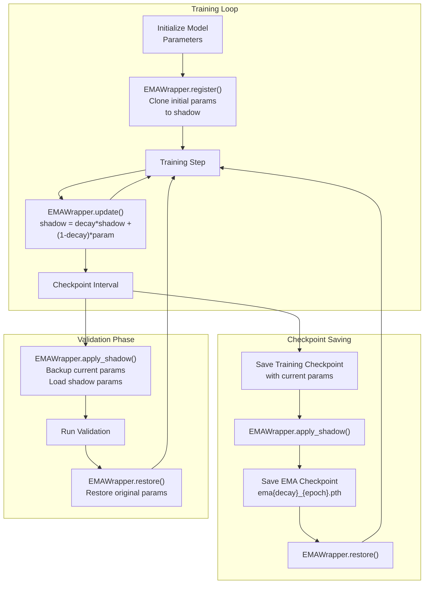
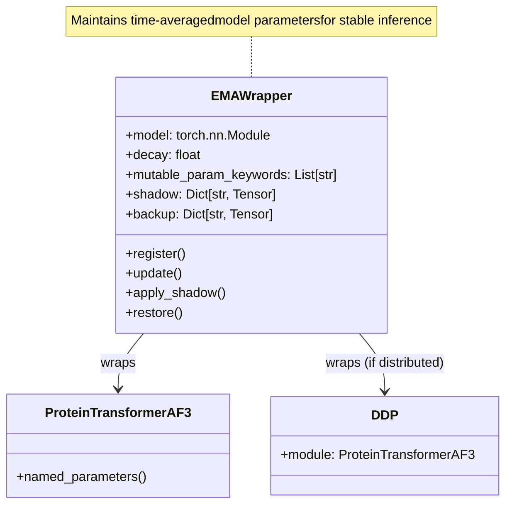
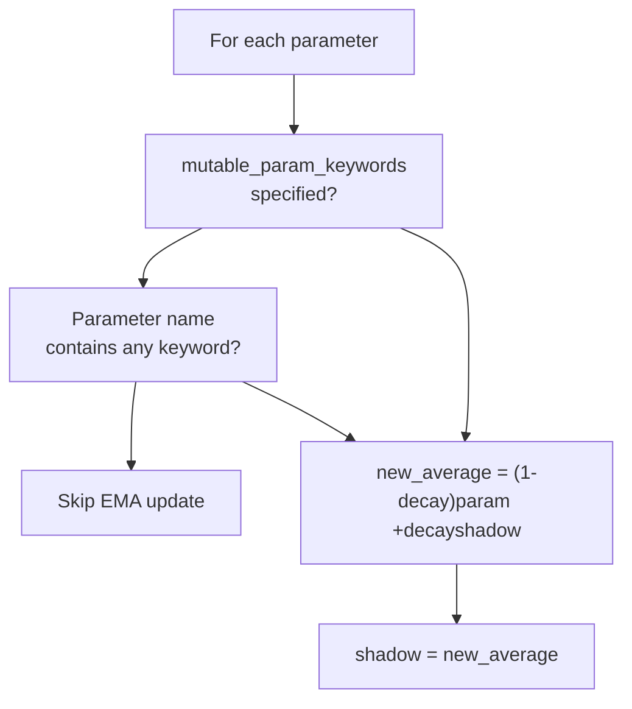
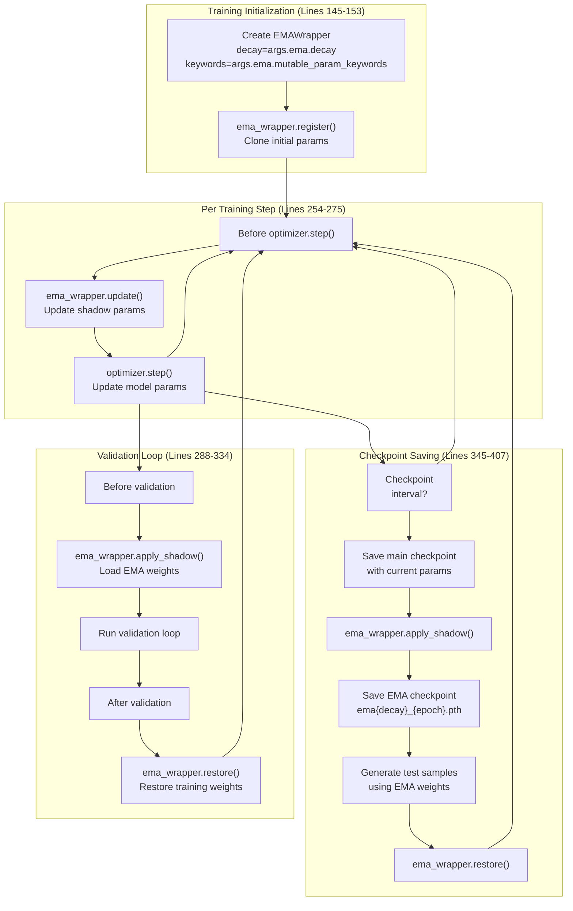
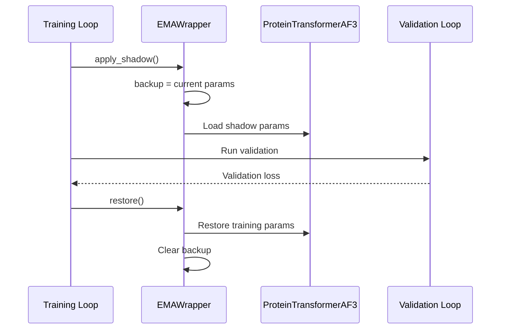
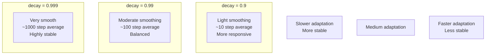
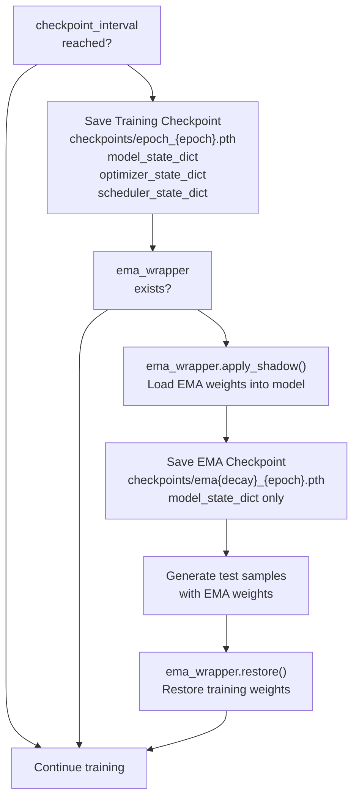
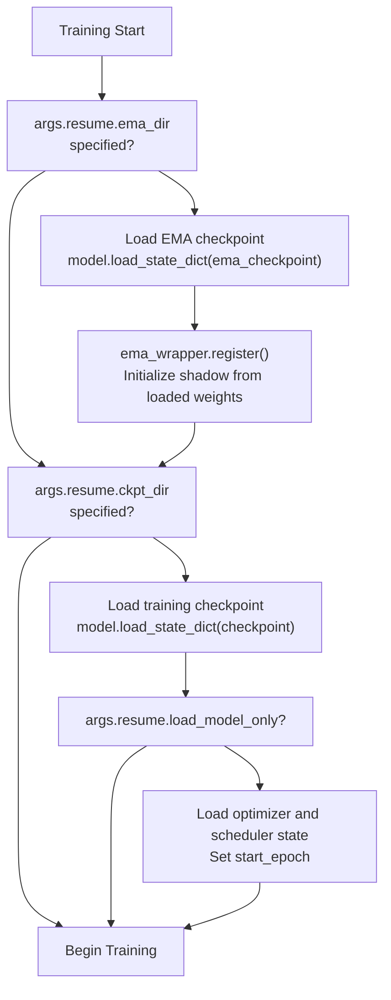
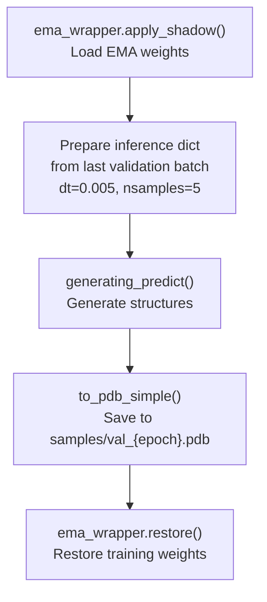

# Exponential Moving Average

> **Relevant source files**
> * [configs/train.yaml](https://github.com/Junjie-Zhu/IDPFold2/blob/5315b279/configs/train.yaml)
> * [src/common/atom37_constants.py](https://github.com/Junjie-Zhu/IDPFold2/blob/5315b279/src/common/atom37_constants.py)
> * [src/model/ema.py](https://github.com/Junjie-Zhu/IDPFold2/blob/5315b279/src/model/ema.py)
> * [src/train.py](https://github.com/Junjie-Zhu/IDPFold2/blob/5315b279/src/train.py)
> * [src/utils/graphein_utils.py](https://github.com/Junjie-Zhu/IDPFold2/blob/5315b279/src/utils/graphein_utils.py)

## Purpose and Scope

This page documents the Exponential Moving Average (EMA) implementation used in IDPFold2 to maintain stabilized model weights for inference. EMA creates a time-averaged copy of model parameters during training, which typically produces more robust predictions than the final training checkpoint. This page covers the `EMAWrapper` class, its integration with the training loop, and checkpoint management strategies.

For information about the overall training pipeline, see [Training Pipeline](/Junjie-Zhu/IDPFold2/6.1-training-pipeline). For details on how EMA checkpoints are loaded during inference, see [Inference Pipeline](/Junjie-Zhu/IDPFold2/7.1-inference-pipeline).

---

## Overview and Motivation

Exponential Moving Average maintains a shadow copy of model parameters that is updated as a weighted average of the current and previous values. During training, model parameters can exhibit high-variance updates due to individual batches, but the EMA weights provide a smoothed trajectory that often generalizes better.

### EMA Update Formula

For each parameter, the EMA maintains:

```
shadow[t] = decay * shadow[t-1] + (1 - decay) * param[t]
```

Where:

* `shadow[t]` is the EMA value at step t
* `param[t]` is the current parameter value
* `decay` is typically 0.999, giving high weight to historical values

**EMA Workflow in IDPFold2**



Sources: [src/train.py L145-L408](https://github.com/Junjie-Zhu/IDPFold2/blob/5315b279/src/train.py#L145-L408)

 [src/model/ema.py L1-L49](https://github.com/Junjie-Zhu/IDPFold2/blob/5315b279/src/model/ema.py#L1-L49)

---

## EMAWrapper Class

The `EMAWrapper` class in [src/model/ema.py](https://github.com/Junjie-Zhu/IDPFold2/blob/5315b279/src/model/ema.py)

 provides the core EMA functionality. It maintains three internal dictionaries:

| Dictionary | Purpose |
| --- | --- |
| `shadow` | Stores the exponentially averaged parameter values |
| `backup` | Temporarily stores original parameters when shadow is applied |
| `mutable_param_keywords` | List of parameter name patterns to apply EMA to |

### Class Interface



Sources: [src/model/ema.py L4-L49](https://github.com/Junjie-Zhu/IDPFold2/blob/5315b279/src/model/ema.py#L4-L49)

### Method Descriptions

#### register()

Initializes the shadow dictionary by cloning all model parameters at their current values. This is called once after model initialization or checkpoint loading.

[src/model/ema.py L23-L25](https://github.com/Junjie-Zhu/IDPFold2/blob/5315b279/src/model/ema.py#L23-L25)

```python
def register(self):    for name, param in self.model.named_parameters():        self.shadow[name] = param.data.clone()
```

#### update()

Updates shadow parameters using the EMA formula. This is called after every training step, before the optimizer step. The method respects `mutable_param_keywords` to selectively apply EMA to specific parameter groups.

[src/model/ema.py L27-L37](https://github.com/Junjie-Zhu/IDPFold2/blob/5315b279/src/model/ema.py#L27-L37)

**Selective Parameter Update Logic:**



Sources: [src/model/ema.py L27-L37](https://github.com/Junjie-Zhu/IDPFold2/blob/5315b279/src/model/ema.py#L27-L37)

#### apply_shadow() and restore()

These methods swap between current training parameters and EMA shadow parameters:

* `apply_shadow()`: Backs up current parameters and loads shadow parameters into the model
* `restore()`: Restores backed-up parameters and clears the backup dictionary

[src/model/ema.py L39-L49](https://github.com/Junjie-Zhu/IDPFold2/blob/5315b279/src/model/ema.py#L39-L49)

This swapping mechanism is used during validation and checkpoint saving to evaluate or save the EMA weights without permanently modifying the training state.

Sources: [src/model/ema.py L39-L49](https://github.com/Junjie-Zhu/IDPFold2/blob/5315b279/src/model/ema.py#L39-L49)

---

## Integration with Training Pipeline

**EMA Lifecycle in Training Loop**



Sources: [src/train.py L145-L407](https://github.com/Junjie-Zhu/IDPFold2/blob/5315b279/src/train.py#L145-L407)

### Initialization

EMA is conditionally initialized based on the `args.ema.decay` configuration:

[src/train.py L145-L153](https://github.com/Junjie-Zhu/IDPFold2/blob/5315b279/src/train.py#L145-L153)

```
if args.ema.decay > 0:    ema_wrapper = EMAWrapper(        model=model,        decay=args.ema.decay,        mutable_param_keywords=args.ema.mutable_param_keywords,    )    ema_wrapper.register()else:    ema_wrapper = None
```

### Training Step Integration

EMA is updated before each backward pass:

[src/train.py L254-L256](https://github.com/Junjie-Zhu/IDPFold2/blob/5315b279/src/train.py#L254-L256)

```sql
if ema_wrapper is not None:    ema_wrapper.update()
```

This ensures the shadow parameters track the model's trajectory throughout training.

### Validation with EMA Weights

During validation, the model is evaluated using EMA weights:

[src/train.py L301-L332](https://github.com/Junjie-Zhu/IDPFold2/blob/5315b279/src/train.py#L301-L332)

**Validation EMA Workflow:**



Sources: [src/train.py L301-L332](https://github.com/Junjie-Zhu/IDPFold2/blob/5315b279/src/train.py#L301-L332)

---

## Configuration Options

### YAML Configuration

EMA is configured in [configs/train.yaml](https://github.com/Junjie-Zhu/IDPFold2/blob/5315b279/configs/train.yaml)

 under the `ema` section:

[configs/train.yaml L20-L22](https://github.com/Junjie-Zhu/IDPFold2/blob/5315b279/configs/train.yaml#L20-L22)

```yaml
ema:  decay: 0.999  # EMA decay rate  mutable_param_keywords: [""]
```

### Configuration Parameters

| Parameter | Type | Default | Description |
| --- | --- | --- | --- |
| `decay` | float | 0.999 | Decay rate for exponential averaging. Higher values give more weight to history. Set to 0 or negative to disable EMA. |
| `mutable_param_keywords` | List[str] | `[""]` | List of substring patterns to match parameter names. Only matching parameters will have EMA applied. Empty strings match all parameters. |

**Decay Rate Impact:**



Sources: [configs/train.yaml L20-L22](https://github.com/Junjie-Zhu/IDPFold2/blob/5315b279/configs/train.yaml#L20-L22)

 [src/model/ema.py L8-L9](https://github.com/Junjie-Zhu/IDPFold2/blob/5315b279/src/model/ema.py#L8-L9)

### Selective Parameter Filtering

The `mutable_param_keywords` parameter allows applying EMA only to specific parameter groups. For example:

```yaml
mutable_param_keywords: ["transformer", "decoder"]  # Only EMA transformer and decoder layers
```

[src/model/ema.py L29-L32](https://github.com/Junjie-Zhu/IDPFold2/blob/5315b279/src/model/ema.py#L29-L32)

 implements the filtering logic:

```markdown
if self.mutable_param_keywords and not any(    [keyword in name for keyword in self.mutable_param_keywords]):    continue  # Skip this parameter
```

In the default configuration, `[""]` contains an empty string, which matches all parameters since every string contains the empty string.

Sources: [configs/train.yaml L20-L22](https://github.com/Junjie-Zhu/IDPFold2/blob/5315b279/configs/train.yaml#L20-L22)

 [src/model/ema.py L17-L19](https://github.com/Junjie-Zhu/IDPFold2/blob/5315b279/src/model/ema.py#L17-L19)

 [src/model/ema.py L29-L32](https://github.com/Junjie-Zhu/IDPFold2/blob/5315b279/src/model/ema.py#L29-L32)

---

## Checkpoint Management

IDPFold2 saves two types of checkpoints:

### Checkpoint Types

| Checkpoint Type | File Pattern | Contents | Purpose |
| --- | --- | --- | --- |
| Training Checkpoint | `epoch_{epoch}.pth` | Current model params, optimizer state, scheduler state, epoch number | Resume training |
| EMA Checkpoint | `_ema_{decay}_{epoch}.pth` | EMA shadow params only | Inference and evaluation |

**Checkpoint Saving Workflow:**



Sources: [src/train.py L345-L407](https://github.com/Junjie-Zhu/IDPFold2/blob/5315b279/src/train.py#L345-L407)

### Saving Checkpoints

[src/train.py L345-L358](https://github.com/Junjie-Zhu/IDPFold2/blob/5315b279/src/train.py#L345-L358)

The training checkpoint includes full training state:

```
checkpoint_path = os.path.join(logging_dir, f"checkpoints/epoch_{crt_epoch}.pth")torch.save({    'epoch': crt_epoch,    'model_state_dict': model.module.state_dict() if DIST_WRAPPER.world_size > 1 else model.state_dict(),    'optimizer_state_dict': optimizer.state_dict(),    'scheduler_state_dict': scheduler.state_dict(),}, checkpoint_path)
```

The EMA checkpoint contains only model parameters:

[src/train.py L353-L358](https://github.com/Junjie-Zhu/IDPFold2/blob/5315b279/src/train.py#L353-L358)

```
if ema_wrapper is not None:    ema_wrapper.apply_shadow()    ema_path = os.path.join(logging_dir, f"checkpoints/_ema_{ema_wrapper.decay}_{crt_epoch}.pth")    torch.save({        'model_state_dict': model.module.state_dict() if DIST_WRAPPER.world_size > 1 else model.state_dict(),    }, ema_path)
```

### Loading Checkpoints

**Checkpoint Loading Strategy:**



Sources: [src/train.py L173-L195](https://github.com/Junjie-Zhu/IDPFold2/blob/5315b279/src/train.py#L173-L195)

#### Loading EMA Checkpoint

When resuming training with EMA, the EMA checkpoint is loaded first:

[src/train.py L174-L183](https://github.com/Junjie-Zhu/IDPFold2/blob/5315b279/src/train.py#L174-L183)

```
if args.resume.ema_dir is not None and args.ema.decay > 0:    ema_checkpoint = torch.load(args.resume.ema_dir, map_location=device)    if DIST_WRAPPER.world_size > 1:        model.module.load_state_dict(ema_checkpoint['model_state_dict'])    else:        model.load_state_dict(ema_checkpoint['model_state_dict'])    ema_wrapper.register()    del ema_checkpoint
```

Note that after loading, `ema_wrapper.register()` is called to initialize the shadow parameters from the loaded EMA weights.

#### Loading Training Checkpoint

The training checkpoint is loaded second (if specified):

[src/train.py L185-L195](https://github.com/Junjie-Zhu/IDPFold2/blob/5315b279/src/train.py#L185-L195)

```
if args.resume.ckpt_dir is not None:    checkpoint = torch.load(args.resume.ckpt_dir, map_location=device)    if DIST_WRAPPER.world_size > 1:        model.module.load_state_dict(checkpoint['model_state_dict'])    else:        model.load_state_dict(checkpoint['model_state_dict'])    if not args.resume.load_model_only:        optimizer.load_state_dict(checkpoint['optimizer_state_dict'])        scheduler.load_state_dict(checkpoint['scheduler_state_dict'])        start_epoch = checkpoint['epoch'] + 1    del checkpoint
```

Sources: [src/train.py L173-L195](https://github.com/Junjie-Zhu/IDPFold2/blob/5315b279/src/train.py#L173-L195)

---

## Usage Patterns

### Pattern 1: Standard Training with EMA

**Typical configuration for training with EMA:**

[configs/train.yaml L20-L22](https://github.com/Junjie-Zhu/IDPFold2/blob/5315b279/configs/train.yaml#L20-L22)

```yaml
ema:  decay: 0.999  mutable_param_keywords: [""]
```

This applies EMA with strong smoothing (0.999 decay) to all model parameters.

### Pattern 2: Resuming Training

**Resume from both EMA and training checkpoints:**

```yaml
resume:  ckpt_dir: ./logs/run_name/checkpoints/epoch_100.pth  ema_dir: ./logs/run_name/checkpoints/_ema_0.999_100.pth  load_model_only: False  # Also load optimizer/scheduler state
```

Loading order:

1. EMA checkpoint → model parameters
2. `ema_wrapper.register()` → initialize shadow from loaded weights
3. Training checkpoint → overwrite model parameters with current training state
4. Optimizer and scheduler states restored

### Pattern 3: Inference with EMA Checkpoint

For inference, only the EMA checkpoint is needed:

```
checkpoint = torch.load("_ema_0.999_500.pth")model.load_state_dict(checkpoint['model_state_dict'])
```

The inference pipeline typically loads EMA checkpoints directly without needing the `EMAWrapper`. See [Inference Pipeline](/Junjie-Zhu/IDPFold2/7.1-inference-pipeline) for details.

### Pattern 4: Disabling EMA

To train without EMA:

```yaml
ema:  decay: 0  # or any value <= 0
```

[src/train.py L145-L153](https://github.com/Junjie-Zhu/IDPFold2/blob/5315b279/src/train.py#L145-L153)

 checks if `args.ema.decay > 0` before creating the wrapper.

Sources: [configs/train.yaml L20-L22](https://github.com/Junjie-Zhu/IDPFold2/blob/5315b279/configs/train.yaml#L20-L22)

 [src/train.py L145-L153](https://github.com/Junjie-Zhu/IDPFold2/blob/5315b279/src/train.py#L145-L153)

 [src/train.py L173-L195](https://github.com/Junjie-Zhu/IDPFold2/blob/5315b279/src/train.py#L173-L195)

---

## Test Sample Generation

During checkpoint saving, IDPFold2 generates test samples using the EMA weights to verify model quality:

[src/train.py L360-L405](https://github.com/Junjie-Zhu/IDPFold2/blob/5315b279/src/train.py#L360-L405)

**Sample Generation Workflow:**



This provides immediate feedback on generation quality using the EMA weights during training.

Sources: [src/train.py L360-L407](https://github.com/Junjie-Zhu/IDPFold2/blob/5315b279/src/train.py#L360-L407)

---

## Implementation Details

### Thread Safety and DDP Compatibility

The `EMAWrapper` works with both single-GPU and distributed data parallel (DDP) training:

[src/train.py L130-L143](https://github.com/Junjie-Zhu/IDPFold2/blob/5315b279/src/train.py#L130-L143)

When using DDP, the model is wrapped:

```
model = DDP(    model,    device_ids=[DIST_WRAPPER.local_rank],    output_device=DIST_WRAPPER.local_rank,    static_graph=True,)
```

The `EMAWrapper` handles this by accessing parameters through `model.named_parameters()`, which works correctly whether the model is wrapped in DDP or not.

### Memory Overhead

EMA maintains a full copy of all model parameters in the `shadow` dictionary. For a model with parameters `P`, EMA adds:

* Memory: `1x` model parameter size (for shadow copy)
* Additional temporary memory during `apply_shadow()`: `1x` model parameter size (for backup)

For large models (e.g., 100M parameters), this represents significant but manageable overhead.

### Numerical Precision

The EMA update uses high-precision arithmetic:

[src/model/ema.py L34-L37](https://github.com/Junjie-Zhu/IDPFold2/blob/5315b279/src/model/ema.py#L34-L37)

```
new_average = (1.0 - self.decay) * param.data + self.decay * self.shadow[name]self.shadow[name] = new_average.clone()
```

The `.clone()` operation ensures the shadow maintains its own memory and prevents unintended sharing with the model parameters.

Sources: [src/model/ema.py L1-L49](https://github.com/Junjie-Zhu/IDPFold2/blob/5315b279/src/model/ema.py#L1-L49)

 [src/train.py L130-L143](https://github.com/Junjie-Zhu/IDPFold2/blob/5315b279/src/train.py#L130-L143)