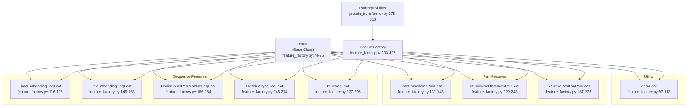
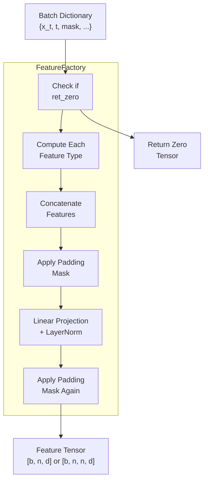
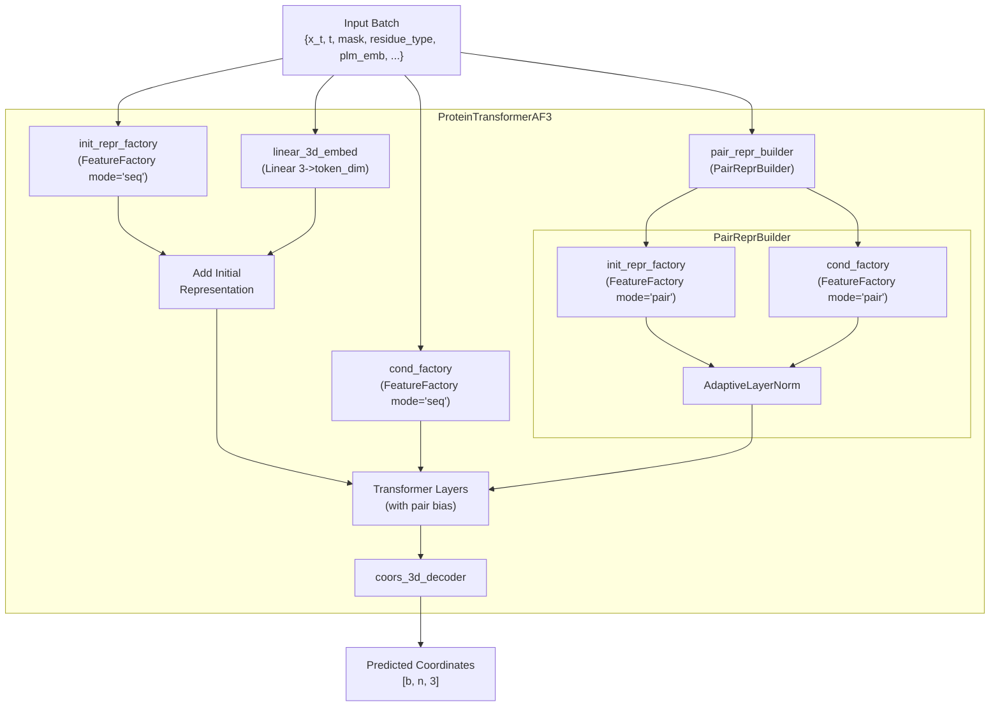
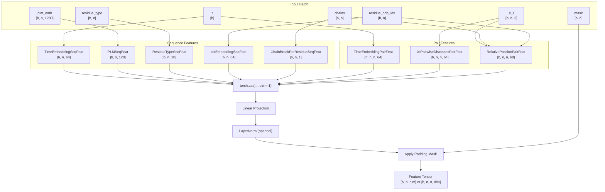

# Feature Factories

> **Relevant source files**
> * [src/model/components/feature_factory.py](https://github.com/Junjie-Zhu/IDPFold2/blob/5315b279/src/model/components/feature_factory.py)
> * [src/model/components/moe_modules.py](https://github.com/Junjie-Zhu/IDPFold2/blob/5315b279/src/model/components/moe_modules.py)
> * [src/model/integral.py](https://github.com/Junjie-Zhu/IDPFold2/blob/5315b279/src/model/integral.py)
> * [src/model/protein_transformer.py](https://github.com/Junjie-Zhu/IDPFold2/blob/5315b279/src/model/protein_transformer.py)

## Purpose and Scope

This document describes the **Feature Factory** system in IDPFold2, which provides a modular framework for computing input features for the neural network. Feature factories transform raw batch data (coordinates, embeddings, metadata) into structured feature tensors that serve as inputs to the transformer layers and conditioning variables. The system supports two modes of operation: sequence features (per-residue) and pair features (residue-residue interactions).

For information about how these features are used in the main model architecture, see [ProteinTransformerAF3](/Junjie-Zhu/IDPFold2/5.1-proteintransformeraf3). For details on the adaptive layer normalization that consumes conditioning features, see [Adaptive Layer Normalization](/Junjie-Zhu/IDPFold2/5.5-adaptive-layer-normalization).

## System Overview

The Feature Factory system implements a **factory pattern** that aggregates multiple feature types into unified feature tensors. Each feature type is implemented as a separate class inheriting from a common `Feature` base class. The `FeatureFactory` class orchestrates feature computation, concatenation, and projection to the desired output dimension.

**Key Design Principles:**

* **Modularity**: Each feature type is encapsulated in its own class
* **Configurability**: Features are selected via string identifiers in configuration files
* **Dual-mode operation**: Supports both sequence `[b, n, dim]` and pair `[b, n, n, dim]` features
* **Graceful fallback**: Provides default values when optional features are missing from batch data

Sources: [src/model/components/feature_factory.py L1-L425](https://github.com/Junjie-Zhu/IDPFold2/blob/5315b279/src/model/components/feature_factory.py#L1-L425)

## Architecture and Class Hierarchy

### Class Hierarchy Diagram



Sources: [src/model/components/feature_factory.py L74-L425](https://github.com/Junjie-Zhu/IDPFold2/blob/5315b279/src/model/components/feature_factory.py#L74-L425)

 [src/model/protein_transformer.py L275-L313](https://github.com/Junjie-Zhu/IDPFold2/blob/5315b279/src/model/protein_transformer.py#L275-L313)

### Base Feature Class

The `Feature` base class provides the interface that all feature types implement:

| Method | Purpose |
| --- | --- |
| `__init__(dim)` | Initialize with feature dimension |
| `get_dim()` | Return feature dimension for concatenation |
| `forward(batch)` | Compute feature from batch dictionary |
| `assert_defaults_allowed(batch, ftype)` | Validate that default fallbacks are permitted |

The `assert_defaults_allowed` method enforces strict feature requirements when `batch["strict_feats"]` is set to `True`, preventing silent fallbacks to default values.

Sources: [src/model/components/feature_factory.py L74-L95](https://github.com/Junjie-Zhu/IDPFold2/blob/5315b279/src/model/components/feature_factory.py#L74-L95)

## FeatureFactory Main Class

### Initialization and Configuration

The `FeatureFactory` class is initialized with a list of feature identifiers and configuration parameters:

```python
# Example initialization from ProteinTransformerAF3self.init_repr_factory = FeatureFactory(    feats=["time_emb", "plm_emb", "res_type"],    dim_feats_out=256,    use_ln_out=False,    mode="seq",    **kwargs)
```

**Constructor Parameters:**

| Parameter | Type | Description |
| --- | --- | --- |
| `feats` | `List[str]` | List of feature identifiers to compute |
| `dim_feats_out` | `int` | Target output dimension after projection |
| `use_ln_out` | `bool` | Whether to apply LayerNorm to output |
| `mode` | `"seq"` or `"pair"` | Feature mode (sequence or pairwise) |
| `**kwargs` | `dict` | Additional feature-specific parameters |

Sources: [src/model/components/feature_factory.py L303-L343](https://github.com/Junjie-Zhu/IDPFold2/blob/5315b279/src/model/components/feature_factory.py#L303-L343)

### Feature Computation Pipeline



Sources: [src/model/components/feature_factory.py L398-L425](https://github.com/Junjie-Zhu/IDPFold2/blob/5315b279/src/model/components/feature_factory.py#L398-L425)

### Feature String Mapping

The `get_creator` method maps configuration strings to feature classes:

**Sequence Features:**

| String Identifier | Class | Required Batch Keys |
| --- | --- | --- |
| `"time_emb"` | `TimeEmbeddingSeqFeat` | `t`, `x_t` |
| `"plm_emb"` | `PLMSeqFeat` | `plm_emb` (optional) |
| `"res_type"` | `ResidueTypeSeqFeat` | `residue_type` |
| `"res_idx"` | `IdxEmbeddingSeqFeat` | `residue_pdb_idx` (optional) |
| `"chain_break_per_res"` | `ChainBreakPerResidueSeqFeat` | `chain_break_per_res` or `chains` (optional) |

**Pair Features:**

| String Identifier | Class | Required Batch Keys |
| --- | --- | --- |
| `"xt_pair_dists"` | `XtPairwiseDistancesPairFeat` | `x_t` |
| `"time_emb"` | `TimeEmbeddingPairFeat` | `t`, `x_t` |
| `"rel_pos"` | `RelativePositionPairFeat` | `chains`, `residue_pdb_idx` (optional) |

Sources: [src/model/components/feature_factory.py L345-L375](https://github.com/Junjie-Zhu/IDPFold2/blob/5315b279/src/model/components/feature_factory.py#L345-L375)

## Sequence Features

### Time Embedding Sequence Feature

**Purpose**: Encodes the diffusion timestep `t` as a per-residue feature for time-conditional generation.

**Implementation**: `TimeEmbeddingSeqFeat` computes a sinusoidal time embedding and expands it across all residues:

```yaml
Input:  t [b]
Step 1: get_time_embedding(t) -> [b, t_emb_dim]
Step 2: Expand to [b, 1, t_emb_dim]
Step 3: Broadcast to [b, n, t_emb_dim]
Output: [b, n, t_emb_dim]
```

The sinusoidal embedding is computed in `src/utils/idx_emb_utils.py:get_time_embedding()`, which uses frequency-based encoding similar to Transformer positional embeddings.

Sources: [src/model/components/feature_factory.py L116-L128](https://github.com/Junjie-Zhu/IDPFold2/blob/5315b279/src/model/components/feature_factory.py#L116-L128)

### PLM Sequence Feature

**Purpose**: Projects pre-computed protein language model (PLM) embeddings from ESM2 into the model's feature space.

**Architecture**:

```
plm_emb [b, n, 1280] 
    -> Linear(1280, plm_out_dim) 
    -> ReLU 
    -> Output [b, n, plm_out_dim]
```

**Graceful Degradation**: If `plm_emb` is not present in the batch, returns a zero tensor. This enables classifier-free guidance where PLM embeddings are conditionally dropped.

**PLM Masking**: The feature checks if PLM embeddings are all-zero (indicating missing data) and masks them accordingly using `plm_mask`.

Sources: [src/model/components/feature_factory.py L277-L295](https://github.com/Junjie-Zhu/IDPFold2/blob/5315b279/src/model/components/feature_factory.py#L277-L295)

### Residue Type Sequence Feature

**Purpose**: Encodes amino acid identity as a one-hot vector.

**Encoding**:

* Input: `residue_type` tensor with integer values 0-19 representing 20 amino acid types
* Padding: Represented as -1, which is masked out
* Output: One-hot vectors `[b, n, 20]`

The encoding follows standard amino acid indexing defined in `src/common/residue_constants.py`.

Sources: [src/model/components/feature_factory.py L246-L274](https://github.com/Junjie-Zhu/IDPFold2/blob/5315b279/src/model/components/feature_factory.py#L246-L274)

### Index Embedding Sequence Feature

**Purpose**: Encodes residue position within the protein sequence.

**Behavior**:

* If `residue_pdb_idx` is present in batch: Uses actual PDB residue indices
* If absent: Creates sequential indices `[1, 2, 3, ..., n]` for each sequence
* Applies sinusoidal index embedding via `get_index_embedding()`

This feature is crucial for encoding sequence order information in the permutation-invariant attention layers.

Sources: [src/model/components/feature_factory.py L146-L163](https://github.com/Junjie-Zhu/IDPFold2/blob/5315b279/src/model/components/feature_factory.py#L146-L163)

### Chain Break Sequence Feature

**Purpose**: Indicates positions where protein chains break (multi-chain complexes).

**Detection Strategy**:

1. If `chain_break_per_res` is in batch: Use it directly
2. Else if `chains` is in batch: Compute breaks as `(chains[i+1] != chains[i])`
3. Else: Return zeros (single chain assumed)

**Output Format**: Binary indicator `[b, n, 1]` where 1 indicates a chain break after that residue.

Sources: [src/model/components/feature_factory.py L166-L184](https://github.com/Junjie-Zhu/IDPFold2/blob/5315b279/src/model/components/feature_factory.py#L166-L184)

## Pair Features

### Pairwise Distance Pair Feature

**Purpose**: Encodes distances between residue pairs in the current noisy coordinates `x_t`.

**Computation Pipeline**:

```
x_t [b, n, 3]
    -> Compute pairwise distances: ||x_i - x_j||
    -> Bin distances into intervals [min_dist, max_dist]
    -> One-hot encode bins
    -> Output [b, n, n, xt_pair_dist_dim]
```

**Binning Strategy**: The function `bin_pairwise_distances` creates `dim-1` bins:

* Bins: `[<min, (min, b1), (b1, b2), ..., (b_{d-2}, max), >max]`
* Default: `min_dist=0.0`, `max_dist=20.0`, `dim=64` (from typical config)

This feature provides local geometric context for attention bias.

Sources: [src/model/components/feature_factory.py L15-L48](https://github.com/Junjie-Zhu/IDPFold2/blob/5315b279/src/model/components/feature_factory.py#L15-L48)

 [src/model/components/feature_factory.py L229-L243](https://github.com/Junjie-Zhu/IDPFold2/blob/5315b279/src/model/components/feature_factory.py#L229-L243)

### Relative Position Pair Feature

**Purpose**: Encodes relative sequence and chain relationships between residue pairs.

**Components**:

1. **Same Chain Indicator**: One-hot `[b, n, n, 2]` indicating if residues are on same chain
2. **Relative Residue Index**: One-hot `[b, n, n, 2*(r_max+1)]` encoding `(i - j)` within range `[-r_max, r_max]`

**Calculation**:

```
d_residue = clip(idx_i - idx_j + r_max, 0, 2*r_max)
If different chains: d_residue = 2*r_max + 1 (special bin)
```

**Default `r_max`**: Typically 32, giving 65 bins for relative position encoding.

This feature enables the model to leverage sequence proximity and chain structure in attention computations.

Sources: [src/model/components/feature_factory.py L187-L226](https://github.com/Junjie-Zhu/IDPFold2/blob/5315b279/src/model/components/feature_factory.py#L187-L226)

### Time Embedding Pair Feature

**Purpose**: Provides time conditioning for pair representations.

**Implementation**: Similar to sequence time embedding but broadcast to pair dimensions:

```
t [b] -> get_time_embedding(t) -> [b, t_emb_dim]
      -> Expand to [b, 1, 1, t_emb_dim]
      -> Broadcast to [b, n, n, t_emb_dim]
```

This enables time-dependent pair biases in the attention mechanism.

Sources: [src/model/components/feature_factory.py L131-L143](https://github.com/Junjie-Zhu/IDPFold2/blob/5315b279/src/model/components/feature_factory.py#L131-L143)

## Integration with Model Architecture

### Feature Factory Usage in ProteinTransformerAF3



Sources: [src/model/protein_transformer.py L316-L537](https://github.com/Junjie-Zhu/IDPFold2/blob/5315b279/src/model/protein_transformer.py#L316-L537)

### Feature Types by Purpose

**Initial Sequence Representation** (`init_repr_factory`):

* Purpose: Create initial token embeddings before transformer processing
* Typical features: `["plm_emb", "res_type", "res_idx"]`
* Configuration: `use_ln_out=False` (no output normalization)
* Usage: Added to coordinate embeddings to form input tokens

**Conditioning Variables** (`cond_factory`):

* Purpose: Provide time-dependent conditioning for ADALN layers
* Typical features: `["time_emb", "chain_break_per_res"]`
* Configuration: `use_ln_out=False`
* Usage: Fed through transition layers, then used in all ADALN operations

**Pair Representation** (`pair_repr_builder`):

* Purpose: Create attention bias for pair-biased attention
* Typical features: `["xt_pair_dists", "rel_pos"]`
* Configuration: `use_ln_out=True` with optional ADALN conditioning
* Usage: Provides bias term in multi-head attention computation

Sources: [src/model/protein_transformer.py L359-L386](https://github.com/Junjie-Zhu/IDPFold2/blob/5315b279/src/model/protein_transformer.py#L359-L386)

 [src/model/protein_transformer.py L507-L520](https://github.com/Junjie-Zhu/IDPFold2/blob/5315b279/src/model/protein_transformer.py#L507-L520)

## Auxiliary Functions

### Binning and One-Hot Encoding

The `bin_and_one_hot` function discretizes continuous values:

```python
# Creates d bins from d-1 limits: (<l1), [l1, l2), ..., [l_{d-1}, ∞)bin_limits = [l1, l2, ..., l_{d-1}]Output: one-hot [*, d]
```

Used for both pairwise distances and relative positions.

Sources: [src/model/components/feature_factory.py L35-L48](https://github.com/Junjie-Zhu/IDPFold2/blob/5315b279/src/model/components/feature_factory.py#L35-L48)

### Index Forcing Function

`indices_force_start_w_one` normalizes PDB indices to start at 1 while preserving masked elements as -1:

```yaml
Input:  pdb_idx = [5, 6, 7, -1, 10, 11]  (with gaps/padding)Output: pdb_idx = [1, 2, 3, -1, 6, 7]    (renumbered, gaps preserved)
```

This ensures consistent index embeddings across different PDB structures.

Sources: [src/model/components/feature_factory.py L51-L66](https://github.com/Junjie-Zhu/IDPFold2/blob/5315b279/src/model/components/feature_factory.py#L51-L66)

## PairReprBuilder

The `PairReprBuilder` class extends the basic FeatureFactory pattern for pair representations:

**Architecture**:

1. **Representation Factory**: Computes main pair features (e.g., distances, relative positions)
2. **Optional Conditioning Factory**: Computes conditioning features for ADALN
3. **Optional ADALN**: Applies adaptive normalization if conditioning features exist

**Usage Pattern**:

```markdown
pair_repr_builder = PairReprBuilder(    feats_repr=["xt_pair_dists", "rel_pos"],  # Main features    feats_cond=["time_emb"],                   # Conditioning (optional)    dim_feats_out=128,    dim_cond_pair=64)pair_rep = pair_repr_builder(batch)  # [b, n, n, 128]
```

This allows time-dependent pair representations where the time embedding modulates the pair features through ADALN.

Sources: [src/model/protein_transformer.py L275-L313](https://github.com/Junjie-Zhu/IDPFold2/blob/5315b279/src/model/protein_transformer.py#L275-L313)

## Configuration Examples

### Typical Training Configuration

```markdown
# Sequence features for initial representationfeats_init_seq: ["plm_emb", "res_type"] # Sequence features for conditioningfeats_cond_seq: ["time_emb", "chain_break_per_res"] # Pair features for representationfeats_pair_repr: ["xt_pair_dists", "rel_pos"] # Pair features for conditioning (optional)feats_pair_cond: ["time_emb"] # Feature dimensionstoken_dim: 256dim_cond: 128pair_repr_dim: 128plm_in_dim: 1280plm_out_dim: 128idx_emb_dim: 64t_emb_dim: 64
```

### Ablation Studies

The modular design enables easy feature ablation:

```markdown
# No PLM embeddings (test structure-only learning)feats_init_seq = ["res_type", "res_idx"] # No time conditioning (test unconditional generation)feats_cond_seq = [] # No pair bias (test pure self-attention)feats_pair_repr = []
```

Sources: [src/model/protein_transformer.py L333-L386](https://github.com/Junjie-Zhu/IDPFold2/blob/5315b279/src/model/protein_transformer.py#L333-L386)

## Feature Factory Dataflow



Sources: [src/model/components/feature_factory.py L398-L425](https://github.com/Junjie-Zhu/IDPFold2/blob/5315b279/src/model/components/feature_factory.py#L398-L425)

## Summary

The Feature Factory system provides:

1. **Modular Feature Computation**: Each feature type is encapsulated in a separate class with clear input/output contracts
2. **Flexible Configuration**: Features are selected via string identifiers in YAML configs
3. **Dual-Mode Operation**: Supports both sequence and pair features with appropriate dimension handling
4. **Robust Fallbacks**: Provides sensible defaults when optional features are missing
5. **Clean Integration**: Seamlessly integrates with the transformer architecture through well-defined interfaces

The system is central to IDPFold2's ability to incorporate diverse information sources (PLM embeddings, geometric features, metadata) into a unified representation for structure generation.

Sources: [src/model/components/feature_factory.py L1-L425](https://github.com/Junjie-Zhu/IDPFold2/blob/5315b279/src/model/components/feature_factory.py#L1-L425)

 [src/model/protein_transformer.py L275-L537](https://github.com/Junjie-Zhu/IDPFold2/blob/5315b279/src/model/protein_transformer.py#L275-L537)