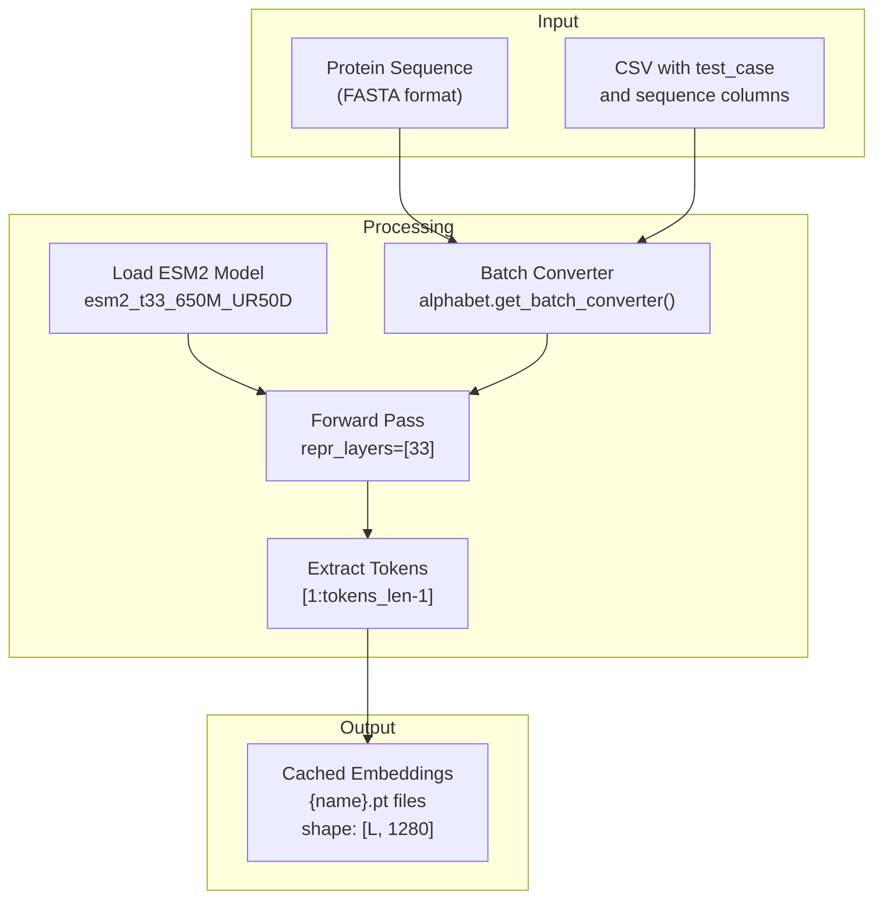
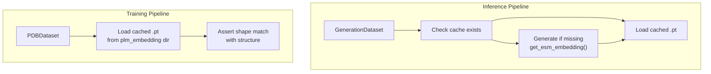
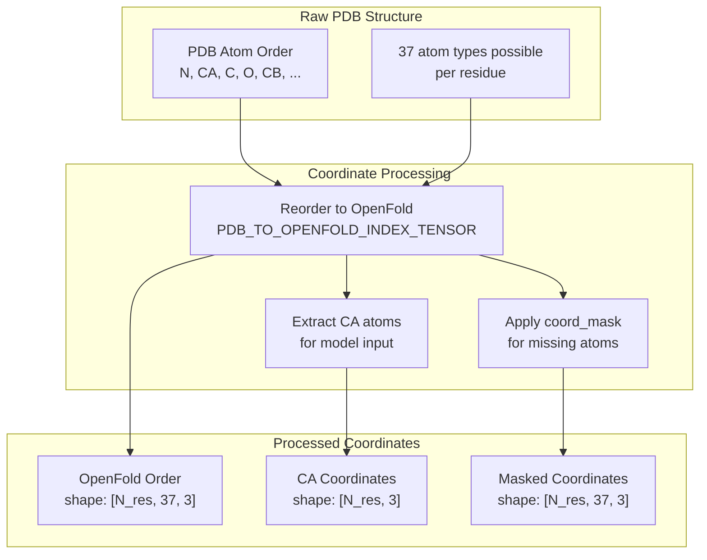
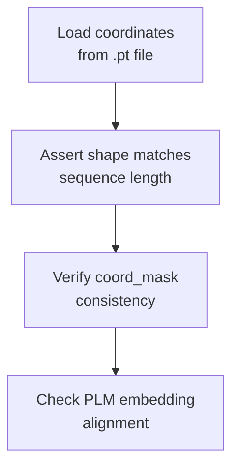
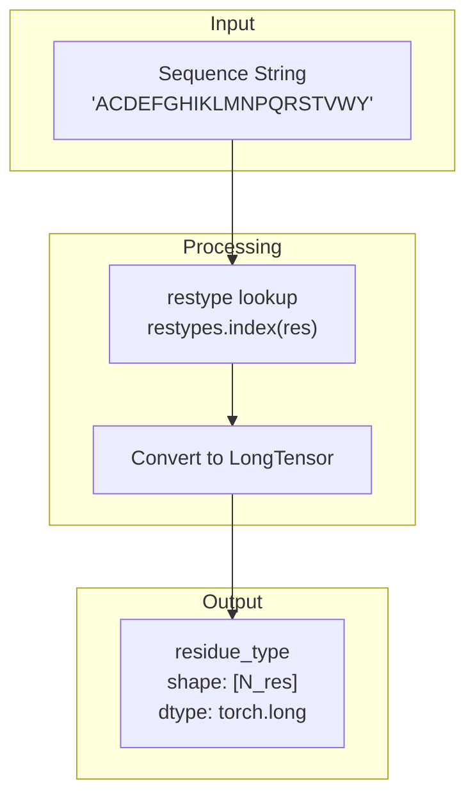
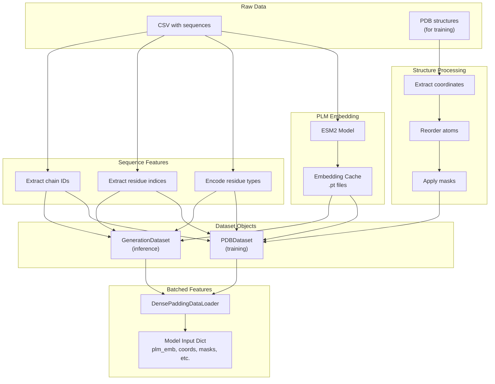

# Feature Generation

> **Relevant source files**
> * [configs/inference.yaml](https://github.com/Junjie-Zhu/IDPFold2/blob/5315b279/configs/inference.yaml)
> * [scripts/get_esm_embedding.py](https://github.com/Junjie-Zhu/IDPFold2/blob/5315b279/scripts/get_esm_embedding.py)
> * [src/data/dataset.py](https://github.com/Junjie-Zhu/IDPFold2/blob/5315b279/src/data/dataset.py)
> * [src/inference.py](https://github.com/Junjie-Zhu/IDPFold2/blob/5315b279/src/inference.py)
> * [src/model/flow_matching/r3flow.py](https://github.com/Junjie-Zhu/IDPFold2/blob/5315b279/src/model/flow_matching/r3flow.py)
> * [src/utils/pdb_utils.py](https://github.com/Junjie-Zhu/IDPFold2/blob/5315b279/src/utils/pdb_utils.py)

## Purpose and Scope

This page describes how raw protein sequence and structure data are transformed into numerical features that can be consumed by the model. Feature generation encompasses: (1) generating and caching Protein Language Model (PLM) embeddings using ESM2, (2) processing coordinate data from PDB structures, and (3) extracting sequence-level features like residue types and indices.

For information about data selection and filtering, see [Data Preparation and Selection](/Junjie-Zhu/IDPFold2/4.1-data-preparation-and-selection). For details on how these features are batched and loaded during training, see [Data Loading and Batching](/Junjie-Zhu/IDPFold2/4.3-data-loading-and-batching). For model-level feature processing within the neural network, see [Feature Factories](/Junjie-Zhu/IDPFold2/5.4-feature-factories).

---

## PLM Embedding Generation

The system uses pre-trained Protein Language Models to generate sequence embeddings that capture evolutionary and structural information. These embeddings are generated once and cached to disk for efficient reuse during training and inference.

### ESM2 Model Architecture

The codebase uses the ESM2 (Evolutionary Scale Modeling 2) model to generate embeddings:

* **Model variant**: `esm2_t33_650M_UR50D` (650M parameters, 33 layers)
* **Embedding dimension**: 1280 (from layer 33 representations)
* **Token representations**: Extracted from the final transformer layer (layer 33)
* **Special tokens**: BOS and EOS tokens are stripped from output (only internal residue tokens retained)

**Sources**: [src/inference.py L122-L129](https://github.com/Junjie-Zhu/IDPFold2/blob/5315b279/src/inference.py#L122-L129)

 [scripts/get_esm_embedding.py L12-L14](https://github.com/Junjie-Zhu/IDPFold2/blob/5315b279/scripts/get_esm_embedding.py#L12-L14)

### Embedding Generation Process



**Diagram: ESM2 Embedding Generation Pipeline**

The generation process follows these steps:

1. **Sequence Loading**: Read sequences from CSV or FASTA format
2. **Batch Conversion**: Use ESM2's batch converter to tokenize sequences
3. **Model Forward Pass**: Pass tokens through the 33-layer transformer
4. **Token Extraction**: Extract representations from layer 33, excluding BOS/EOS tokens
5. **Caching**: Save embeddings as `.pt` files with shape `[sequence_length, 1280]`

**Sources**: [src/inference.py L117-L157](https://github.com/Junjie-Zhu/IDPFold2/blob/5315b279/src/inference.py#L117-L157)

 [scripts/get_esm_embedding.py L41-L60](https://github.com/Junjie-Zhu/IDPFold2/blob/5315b279/scripts/get_esm_embedding.py#L41-L60)

### Caching Strategy

The system implements an intelligent caching strategy to avoid redundant computation:

| Scenario | Behavior | Code Location |
| --- | --- | --- |
| Directory not found | Create directory and generate all embeddings | [src/inference.py L43-L44](https://github.com/Junjie-Zhu/IDPFold2/blob/5315b279/src/inference.py#L43-L44) |
| Partial embeddings | Generate only missing embeddings | [src/inference.py L43-L44](https://github.com/Junjie-Zhu/IDPFold2/blob/5315b279/src/inference.py#L43-L44) |
| All embeddings present | Load from cache, no generation | [src/inference.py L484-L490](https://github.com/Junjie-Zhu/IDPFold2/blob/5315b279/src/inference.py#L484-L490) |

**Embedding file naming conventions**:

* **Monomers**: `{test_case}.pt` (e.g., `1ubq_A.pt`)
* **Multimers**: `{test_case}_{chain_id}.pt` (e.g., `1a2k_A.pt`, `1a2k_B.pt`)
* **IDRome entries**: `{name}_f0.pt` for frame 0

**Sources**: [src/inference.py L43-L44](https://github.com/Junjie-Zhu/IDPFold2/blob/5315b279/src/inference.py#L43-L44)

 [src/data/dataset.py L462-L472](https://github.com/Junjie-Zhu/IDPFold2/blob/5315b279/src/data/dataset.py#L462-L472)

### Training vs Inference Embedding Handling



**Diagram: Embedding Handling in Training vs Inference**

**Key differences**:

* **Training**: Assumes embeddings are pre-generated; raises error if missing
* **Inference**: Generates embeddings on-the-fly if not found
* **Validation**: Both paths validate that embedding length matches sequence length

**Sources**: [src/inference.py L43-L44](https://github.com/Junjie-Zhu/IDPFold2/blob/5315b279/src/inference.py#L43-L44)

 [src/data/dataset.py L482-L490](https://github.com/Junjie-Zhu/IDPFold2/blob/5315b279/src/data/dataset.py#L482-L490)

---

## Coordinate Processing

Raw coordinate data from PDB structures undergoes several processing steps before being used by the model.

### Atom Ordering and Representation

The system converts PDB atom ordering to OpenFold convention and uses a coarse-grained representation:



**Diagram: Coordinate Processing Pipeline**

The coordinate processing involves:

1. **Reordering**: Convert from PDB to OpenFold atom convention using `PDB_TO_OPENFOLD_INDEX_TENSOR`
2. **Mask Application**: Apply `coord_mask` to indicate which atoms are present vs missing
3. **CA Extraction**: For coarse-grained modeling, primarily use C-alpha atoms

**Sources**: [src/data/dataset.py L493-L495](https://github.com/Junjie-Zhu/IDPFold2/blob/5315b279/src/data/dataset.py#L493-L495)

 [src/common/atom37_constants.py](https://github.com/Junjie-Zhu/IDPFold2/blob/5315b279/src/common/atom37_constants.py)

### Coordinate Centering and Masking

During flow matching, coordinates are often centered to remove translational degrees of freedom:

```markdown
# Centering operation (conceptual)# x_centered = x - mean(x, dim=residues)# Applied when zero_com=True in R3NFlowMatcher
```

**Centering scenarios**:

| Context | Zero COM | Location |
| --- | --- | --- |
| Flow matching training | Yes (configurable) | [src/model/flow_matching/r3flow.py L89-L91](https://github.com/Junjie-Zhu/IDPFold2/blob/5315b279/src/model/flow_matching/r3flow.py#L89-L91) |
| Motif conditioning | No (preserve motif position) | [src/inference.py L226](https://github.com/Junjie-Zhu/IDPFold2/blob/5315b279/src/inference.py#L226-L226) |
| Reference sampling | Yes (if enabled) | [src/model/flow_matching/r3flow.py L398](https://github.com/Junjie-Zhu/IDPFold2/blob/5315b279/src/model/flow_matching/r3flow.py#L398-L398) |

**Sources**: [src/model/flow_matching/r3flow.py L39-L91](https://github.com/Junjie-Zhu/IDPFold2/blob/5315b279/src/model/flow_matching/r3flow.py#L39-L91)

 [src/inference.py L226](https://github.com/Junjie-Zhu/IDPFold2/blob/5315b279/src/inference.py#L226-L226)

### Coordinate Validation

The system validates coordinate integrity at multiple points:



**Diagram: Coordinate Validation Steps**

**Sources**: [src/data/dataset.py L486-L488](https://github.com/Junjie-Zhu/IDPFold2/blob/5315b279/src/data/dataset.py#L486-L488)

---

## Sequence Feature Extraction

Beyond PLM embeddings and coordinates, the system extracts several sequence-level features.

### Residue Type Encoding

Amino acid sequences are converted to integer indices for model processing:



**Diagram: Residue Type Encoding**

The encoding uses the standard 20 amino acid alphabet defined in `residue_constants.py`:

* **Mapping**: Single letter code → integer index (0-19)
* **Special residues**: Non-standard residues are typically filtered out during data preparation
* **Output format**: `torch.long` tensor of shape `[sequence_length]`

**Sources**: [src/inference.py L159-L164](https://github.com/Junjie-Zhu/IDPFold2/blob/5315b279/src/inference.py#L159-L164)

 [src/common/residue_constants.py](https://github.com/Junjie-Zhu/IDPFold2/blob/5315b279/src/common/residue_constants.py)

### Residue Indices and Chain Information

For multimer structures, additional features track residue positions and chain assignments:

| Feature | Description | Shape | Dtype |
| --- | --- | --- | --- |
| `residue_pdb_idx` | Residue number from PDB file | `[N_res]` | `long` |
| `residue_idx` | Sequential 0-indexed position | `[N_res]` | `long` |
| `chains` | Chain ID as integer (1-indexed) | `[N_res]` | `long` |

**Multimer feature generation**:

```markdown
# For multimers with multiple chains (conceptual)plm_embs = [torch.load(path) for path in chain_paths]chains = torch.cat([torch.ones(emb.shape[0]) + i for i, emb in enumerate(plm_embs)])residue_idx = torch.cat([torch.arange(emb.shape[0]) for emb in plm_embs])
```

**Sources**: [src/inference.py L100-L115](https://github.com/Junjie-Zhu/IDPFold2/blob/5315b279/src/inference.py#L100-L115)

---

## Feature Dimensions and Model Input

The following table summarizes the dimensions of features passed to the model:

| Feature Name | Source | Dimension | Description |
| --- | --- | --- | --- |
| `plm_emb` | ESM2 layer 33 | `[N_res, 1280]` | Protein language model embeddings |
| `coords` | PDB structure | `[N_res, 37, 3]` | Atom coordinates in OpenFold order |
| `coord_mask` | PDB structure | `[N_res, 37]` | Binary mask for present atoms |
| `residue_type` | Sequence | `[N_res]` | Integer-encoded amino acid types |
| `residue_pdb_idx` | PDB file | `[N_res]` | Residue numbering from PDB |
| `chains` | PDB/inference | `[N_res]` | Chain assignment for multimers |

**Configuration in model**:

* `plm_in_dim: 1280` - Input dimension for PLM embeddings
* `plm_out_dim: 256` - Projection dimension after linear layer
* These are projected by `FeatureFactory` before entering the transformer

**Sources**: [configs/inference.yaml L68-L69](https://github.com/Junjie-Zhu/IDPFold2/blob/5315b279/configs/inference.yaml#L68-L69)

 [src/model/components/feature_factory.py](https://github.com/Junjie-Zhu/IDPFold2/blob/5315b279/src/model/components/feature_factory.py)

---

## Complete Feature Generation Flow



**Diagram: Complete Feature Generation Pipeline**

This diagram shows the end-to-end flow from raw data to model-ready features, highlighting the parallel processing of PLM embeddings, structure coordinates, and sequence features before they are combined in dataset objects and batched for model consumption.

**Sources**: [src/inference.py L31-L157](https://github.com/Junjie-Zhu/IDPFold2/blob/5315b279/src/inference.py#L31-L157)

 [src/data/dataset.py L338-L626](https://github.com/Junjie-Zhu/IDPFold2/blob/5315b279/src/data/dataset.py#L338-L626)

 [src/utils/dense_dataloader_utils.py](https://github.com/Junjie-Zhu/IDPFold2/blob/5315b279/src/utils/dense_dataloader_utils.py)